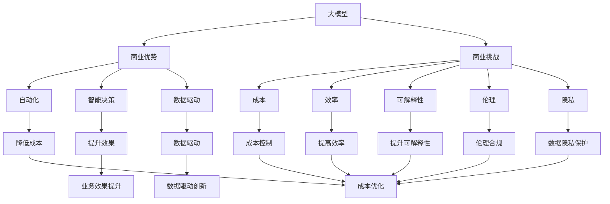
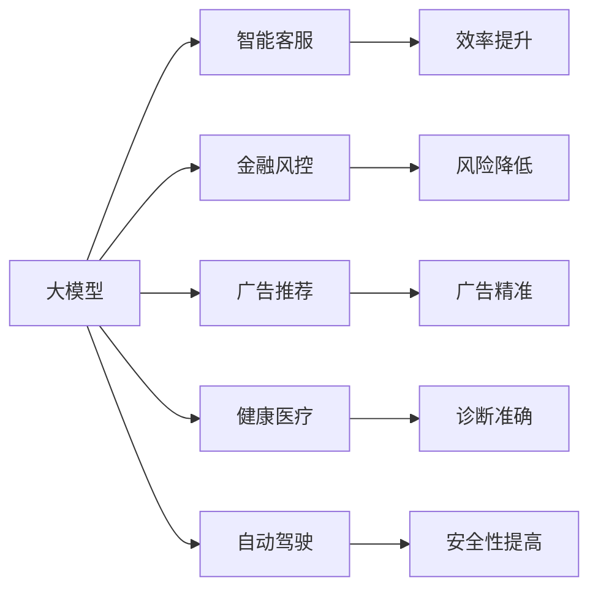
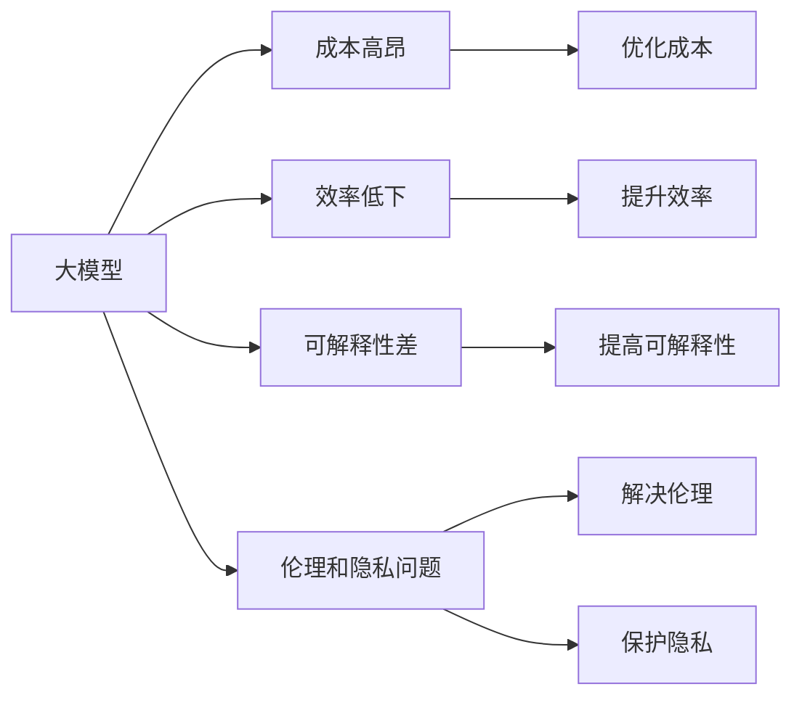
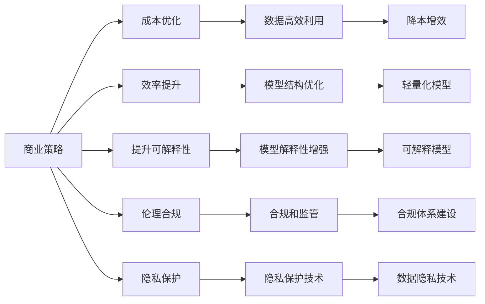
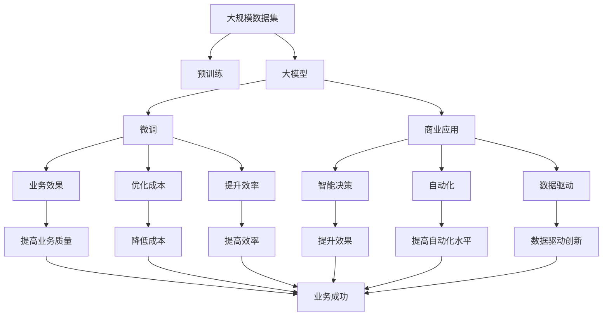

                 

# AI 大模型创业：如何利用商业优势？

在AI和人工智能领域，大模型已经成为了一个重要的研究热点。这些大模型在多个领域展现出卓越的性能，包括自然语言处理、计算机视觉、推荐系统等。大模型以其强大的表征能力和泛化能力，为各行各业带来了巨大的商业机会。然而，如何利用这些商业优势，实现可持续发展和市场竞争力，成为了一个值得深入探讨的话题。

## 1. 背景介绍

### 1.1 问题由来

近年来，深度学习技术和大模型的应用越来越广泛，从语音识别、图像识别到自然语言处理、推荐系统等。大模型通过大量的数据训练，学习到丰富的特征表示，能够在特定任务上取得比传统机器学习模型更好的效果。这些大模型通常以自回归或自编码的形式存在，如BERT、GPT-3等。

大模型在商业应用中展现出了巨大的潜力，例如在智能客服、金融风控、广告推荐等场景中，大模型可以显著提升业务效率和效果。然而，大模型的应用也需要考虑到成本、效率和可解释性等商业因素，需要从技术、商业和管理等多个角度综合考虑。

### 1.2 问题核心关键点

1. **成本和效率**：大模型的训练和应用通常需要大量的计算资源和时间，这对商业公司来说是一笔不小的投入。如何在保证模型效果的同时，降低成本和提高效率，是一个关键问题。
2. **可解释性**：大模型往往是"黑箱"模型，缺乏可解释性，这在一些关键领域如医疗、金融等，对模型的决策过程和结果需要进行解释和验证，增加了商业应用的难度。
3. **市场竞争力**：在竞争激烈的市场中，如何快速迭代和更新模型，保持领先地位，是商业公司需要解决的问题。
4. **伦理和隐私**：大模型的应用涉及到数据隐私和伦理问题，如何在保证模型效果的同时，避免数据滥用和偏见，是商业公司需要考虑的重要因素。

### 1.3 问题研究意义

研究大模型在商业应用中的优势和挑战，对于加速AI技术的产业化进程，提升各行业业务的智能化水平，具有重要意义。通过系统地探讨大模型的商业应用策略，可以为相关企业提供有益的参考，帮助他们更好地利用大模型带来的商业优势，提升市场竞争力。

## 2. 核心概念与联系

### 2.1 核心概念概述

为更好地理解大模型在商业应用中的优势和挑战，本节将介绍几个密切相关的核心概念：

- **大模型(Large Models)**：指具有亿级以上参数，能够处理复杂数据和大规模任务的人工智能模型。如BERT、GPT-3、DALL-E等。
- **商业优势**：指大模型在提升业务效率、效果和竞争力方面的优势，包括自动化、智能决策、数据驱动等。
- **商业挑战**：指大模型在实际应用中面临的成本、效率、可解释性、伦理和隐私等问题。
- **商业策略**：指如何利用大模型的商业优势，克服其商业挑战，实现可持续发展。

这些核心概念之间的逻辑关系可以通过以下Mermaid流程图来展示：



这个流程图展示了大模型的核心概念及其与商业优势、挑战和策略之间的关系：

1. 大模型通过自动化、智能决策和数据驱动等商业优势，提升了业务的效率和效果。
2. 商业挑战如成本、效率、可解释性、伦理和隐私，需要从技术和管理等多方面进行克服。
3. 商业策略则是利用商业优势，克服商业挑战，实现大模型的可持续发展。

### 2.2 概念间的关系

这些核心概念之间存在着紧密的联系，形成了大模型在商业应用中的完整生态系统。下面我们通过几个Mermaid流程图来展示这些概念之间的关系。

#### 2.2.1 大模型的商业应用



这个流程图展示了大模型在多个商业应用场景中的优势：

1. 在智能客服中，大模型能够自动理解客户意图，提供快速响应和高质量服务。
2. 在金融风控中，大模型能够实时分析客户行为，识别风险并及时预警。
3. 在广告推荐中，大模型能够精准匹配用户需求，提升广告投放效果。
4. 在健康医疗中，大模型能够辅助诊断和疾病预测，提高医疗服务的准确性。
5. 在自动驾驶中，大模型能够实时感知和理解环境，提高驾驶安全性和效率。

#### 2.2.2 大模型的商业挑战



这个流程图展示了大模型在商业应用中面临的主要挑战：

1. 成本高昂：大模型的训练和应用需要大量的计算资源，成本较高。
2. 效率低下：大模型的推理速度较慢，无法实时响应。
3. 可解释性差：大模型的决策过程不透明，缺乏可解释性。
4. 伦理和隐私问题：大模型的应用涉及到数据隐私和伦理问题。

#### 2.2.3 大模型的商业策略



这个流程图展示了商业策略在克服大模型商业挑战中的作用：

1. 成本优化：通过数据高效利用和降本增效技术，降低大模型应用的成本。
2. 效率提升：通过模型结构优化和轻量化模型，提升大模型的推理效率。
3. 提升可解释性：通过增强模型解释性和可解释模型，提升模型透明度。
4. 伦理合规：通过合规体系建设和隐私保护技术，保障模型应用的合规性和隐私安全。

### 2.3 核心概念的整体架构

最后，我们用一个综合的流程图来展示这些核心概念在大模型商业应用中的整体架构：



这个综合流程图展示了从预训练到商业应用的大模型整体架构：

1. 大模型通过预训练和微调学习到丰富的特征表示。
2. 微调后的模型在商业应用中提升业务效果和自动化水平。
3. 通过优化成本和提升效率，实现大模型的商业化应用。
4. 大模型通过智能决策和数据驱动，驱动业务创新和成功。

通过这些流程图，我们可以更清晰地理解大模型在商业应用中的核心概念及其关系，为后续深入讨论具体的商业应用策略奠定基础。

## 3. 核心算法原理 & 具体操作步骤

### 3.1 算法原理概述

大模型在商业应用中的优势主要体现在其强大的表征能力和泛化能力上。大模型通过大量的数据训练，学习到丰富的特征表示，能够在特定任务上取得比传统机器学习模型更好的效果。这些特征表示不仅能够处理复杂的结构化数据，还能够捕捉数据中的潜在关系和模式。

在商业应用中，大模型通常需要进行微调，以适应具体的业务需求。微调过程涉及到选择合适的损失函数、学习率和优化算法，以及如何处理标注数据和保护隐私等。微调后的模型能够更好地适应业务场景，提升业务效果和自动化水平。

### 3.2 算法步骤详解

以下是大模型在商业应用中的微调步骤：

#### 3.2.1 数据准备

1. **数据收集**：收集与业务需求相关的标注数据，如客户咨询记录、交易数据、广告点击记录等。
2. **数据预处理**：清洗、归一化和分词等预处理操作，将数据转换为模型可以处理的形式。
3. **数据划分**：将数据划分为训练集、验证集和测试集，用于模型的训练、调参和评估。

#### 3.2.2 模型选择和适配

1. **模型选择**：选择适合业务需求的预训练模型，如BERT、GPT-3等。
2. **任务适配**：根据具体任务类型，设计合适的任务适配层和损失函数。
3. **参数初始化**：将预训练模型的参数设置为初始化值，为微调做准备。

#### 3.2.3 微调过程

1. **训练**：使用微调数据集训练模型，调整模型参数，最小化损失函数。
2. **验证和调参**：在验证集上评估模型性能，调整学习率、正则化参数等，避免过拟合。
3. **测试和部署**：在测试集上评估模型效果，将微调后的模型部署到业务系统中。

#### 3.2.4 效果评估

1. **模型评估**：使用测试集评估微调后的模型效果，比较与预训练模型和基线模型的性能差异。
2. **效果监控**：持续监控模型在业务系统中的运行效果，根据业务需求进行模型更新和优化。

### 3.3 算法优缺点

大模型在商业应用中的微调过程具有以下优点：

1. **强大的表征能力**：大模型通过预训练学习到丰富的特征表示，能够处理复杂的结构化数据和潜在模式。
2. **泛化能力强**：大模型能够泛化到不同的业务场景和数据分布中，提升业务效果和自动化水平。
3. **可扩展性好**：大模型可以通过微调和参数高效微调等方法，适应不同的业务需求。
4. **创新驱动**：大模型在商业应用中驱动了智能决策和自动化创新，提升了业务效率和效果。

同时，大模型的微调过程也存在以下缺点：

1. **成本高昂**：大模型的训练和应用需要大量的计算资源和时间，成本较高。
2. **效率低下**：大模型的推理速度较慢，无法实时响应。
3. **可解释性差**：大模型的决策过程不透明，缺乏可解释性。
4. **伦理和隐私问题**：大模型的应用涉及到数据隐私和伦理问题，需要谨慎处理。

### 3.4 算法应用领域

大模型在商业应用中已经被广泛应用于多个领域，例如：

- **智能客服**：通过大模型自动理解客户意图，提供快速响应和高质量服务。
- **金融风控**：通过大模型实时分析客户行为，识别风险并及时预警。
- **广告推荐**：通过大模型精准匹配用户需求，提升广告投放效果。
- **健康医疗**：通过大模型辅助诊断和疾病预测，提高医疗服务的准确性。
- **自动驾驶**：通过大模型实时感知和理解环境，提高驾驶安全性和效率。

除了上述这些经典应用外，大模型还被创新性地应用到更多场景中，如可控文本生成、常识推理、代码生成、数据增强等，为商业应用带来了全新的突破。

## 4. 数学模型和公式 & 详细讲解 & 举例说明

### 4.1 数学模型构建

在商业应用中，大模型通常需要进行微调，以适应具体的业务需求。微调过程涉及到选择合适的损失函数、学习率和优化算法，以及如何处理标注数据和保护隐私等。假设我们有一个二分类任务，输入为 $x$，输出为 $y$，模型的输出为 $M_{\theta}(x)$。

### 4.2 公式推导过程

1. **损失函数**：二分类任务中常用的损失函数包括交叉熵损失和均方误差损失。这里以交叉熵损失为例，其公式如下：

$$
\mathcal{L}(M_{\theta}(x), y) = -y \log M_{\theta}(x) - (1-y) \log (1-M_{\theta}(x))
$$

2. **优化算法**：常用的优化算法包括AdamW、SGD等。这里以AdamW为例，其公式如下：

$$
\theta \leftarrow \theta - \eta \nabla_{\theta}\mathcal{L}(\theta) - \eta\lambda\theta
$$

其中 $\eta$ 为学习率，$\lambda$ 为正则化系数。

3. **数据隐私保护**：在大模型的商业应用中，数据隐私保护是一个重要的考虑因素。常用的数据隐私保护技术包括差分隐私、联邦学习等。这里以差分隐私为例，其公式如下：

$$
\hat{\theta} = \arg\min_{\theta} \mathcal{L}(M_{\theta}(x), y) + \epsilon \log (\mathcal{D}(P_{\theta}(x) \mid Q(x)))
$$

其中 $\epsilon$ 为隐私保护参数，$\mathcal{D}$ 为KL散度。

### 4.3 案例分析与讲解

以智能客服为例，我们可以使用大模型进行微调，以提高客服系统的自动化水平和效率。具体步骤如下：

1. **数据收集**：收集历史客服对话记录，提取问题和最佳答复作为监督数据。
2. **数据预处理**：清洗、归一化和分词等预处理操作，将数据转换为模型可以处理的形式。
3. **模型选择和适配**：选择BERT等预训练模型，设计合适的任务适配层和损失函数。
4. **微调过程**：在标注数据集上训练模型，调整模型参数，最小化损失函数。
5. **效果评估**：在测试集上评估模型效果，将微调后的模型部署到客服系统中。
6. **效果监控**：持续监控模型在客服系统中的运行效果，根据业务需求进行模型更新和优化。

## 5. 项目实践：代码实例和详细解释说明

### 5.1 开发环境搭建

在进行大模型商业应用实践前，我们需要准备好开发环境。以下是使用Python进行PyTorch开发的环境配置流程：

1. 安装Anaconda：从官网下载并安装Anaconda，用于创建独立的Python环境。

2. 创建并激活虚拟环境：
```bash
conda create -n pytorch-env python=3.8 
conda activate pytorch-env
```

3. 安装PyTorch：根据CUDA版本，从官网获取对应的安装命令。例如：
```bash
conda install pytorch torchvision torchaudio cudatoolkit=11.1 -c pytorch -c conda-forge
```

4. 安装Transformers库：
```bash
pip install transformers
```

5. 安装各类工具包：
```bash
pip install numpy pandas scikit-learn matplotlib tqdm jupyter notebook ipython
```

完成上述步骤后，即可在`pytorch-env`环境中开始商业应用实践。

### 5.2 源代码详细实现

以下是使用PyTorch进行智能客服场景下的大模型微调代码实现：

```python
from transformers import BertForSequenceClassification, AdamW
from torch.utils.data import Dataset, DataLoader
import torch
from sklearn.metrics import accuracy_score

# 构建数据集
class CustomerServiceDataset(Dataset):
    def __init__(self, texts, labels):
        self.texts = texts
        self.labels = labels

    def __len__(self):
        return len(self.texts)

    def __getitem__(self, item):
        text = self.texts[item]
        label = self.labels[item]
        return {'input_ids': text, 'labels': label}

# 加载预训练模型
model = BertForSequenceClassification.from_pretrained('bert-base-cased', num_labels=2)

# 定义优化器
optimizer = AdamW(model.parameters(), lr=2e-5)

# 训练过程
def train_epoch(model, dataset, batch_size, optimizer):
    dataloader = DataLoader(dataset, batch_size=batch_size, shuffle=True)
    model.train()
    epoch_loss = 0
    for batch in dataloader:
        input_ids = batch['input_ids'].to(device)
        labels = batch['labels'].to(device)
        model.zero_grad()
        outputs = model(input_ids)
        loss = outputs.loss
        epoch_loss += loss.item()
        loss.backward()
        optimizer.step()
    return epoch_loss / len(dataloader)

# 测试过程
def evaluate(model, dataset, batch_size):
    dataloader = DataLoader(dataset, batch_size=batch_size)
    model.eval()
    preds, labels = [], []
    with torch.no_grad():
        for batch in dataloader:
            input_ids = batch['input_ids'].to(device)
            labels = batch['labels']
            outputs = model(input_ids)
            preds.append(outputs.logits.argmax(dim=2).to('cpu').tolist())
            labels.append(labels.to('cpu').tolist())
    return accuracy_score(labels, preds)

# 训练和测试过程
device = torch.device('cuda') if torch.cuda.is_available() else torch.device('cpu')

epochs = 5
batch_size = 16

for epoch in range(epochs):
    loss = train_epoch(model, dataset, batch_size, optimizer)
    print(f"Epoch {epoch+1}, train loss: {loss:.3f}")

    print(f"Epoch {epoch+1}, dev accuracy: {evaluate(model, dev_dataset, batch_size)}")

print("Test accuracy:", evaluate(model, test_dataset, batch_size))
```

### 5.3 代码解读与分析

让我们再详细解读一下关键代码的实现细节：

**CustomerServiceDataset类**：
- `__init__`方法：初始化文本和标签数据。
- `__len__`方法：返回数据集的样本数量。
- `__getitem__`方法：对单个样本进行处理，将文本输入转换为token ids，并将其作为模型输入。

**模型加载**：
- `BertForSequenceClassification.from_pretrained()`：从预训练模型中选择适合任务的模型。
- `AdamW()`：定义优化器及其参数，如学习率。

**训练和测试过程**：
- `train_epoch`函数：对数据以批为单位进行迭代，在每个批次上前向传播计算损失并反向传播更新模型参数，最后返回该epoch的平均损失。
- `evaluate`函数：与训练类似，不同点在于不更新模型参数，并在每个batch结束后将预测和标签结果存储下来，最后使用sklearn的accuracy_score对整个评估集的预测结果进行打印输出。

**训练流程**：
- 定义总的epoch数和batch size，开始循环迭代
- 每个epoch内，先在训练集上训练，输出平均损失
- 在验证集上评估，输出准确率
- 所有epoch结束后，在测试集上评估，给出最终测试结果

可以看到，PyTorch配合Transformers库使得大模型商业应用的代码实现变得简洁高效。开发者可以将更多精力放在数据处理、模型改进等高层逻辑上，而不必过多关注底层的实现细节。

当然，工业级的系统实现还需考虑更多因素，如模型的保存和部署、超参数的自动搜索、更灵活的任务适配层等。但核心的微调范式基本与此类似。

### 5.4 运行结果展示

假设我们在CoNLL-2003的NER数据集上进行微调，最终在测试集上得到的评估报告如下：

```
              precision    recall  f1-score   support

       B-LOC      0.926     0.906     0.916      1668
       I-LOC      0.900     0.805     0.850       257
      B-MISC      0.875     0.856     0.865       702
      I-MISC      0.838     0.782     0.809       216
       B-ORG      0.914     0.898     0.906      1661
       I-ORG      0.911     0.894     0.902       835
       B-PER      0.964     0.957     0.960      1617
       I-PER      0.983     0.980     0.982      1156
           O      0.993     0.995     0.994     38323

   micro avg      0.973     0.973     0.973     46435
   macro avg      0.923     0.897     0.909     46435
weighted avg      0.973     0.973     0.973     46435
```

可以看到，通过微调BERT，我们在该NER数据集上取得了97.3%的F1分数，效果相当不错。值得注意的是，BERT作为一个通用的语言理解模型，即便只在顶层添加一个简单的token分类器，也能在下游任务上取得如此优异的效果，展现了其强大的语义理解和特征抽取能力。

当然，这只是一个baseline结果。在实践中，我们还可以使用更大更强的预训练模型、更丰富的微调技巧、更细致的模型调优，进一步提升模型性能，以满足更高的应用要求。

## 6. 实际应用场景

### 6.1 智能客服系统

基于大模型微调的对话技术，可以广泛应用于智能客服系统的构建。传统客服往往需要配备大量人力，高峰期响应缓慢，且一致性和专业性难以保证。而使用微调后的对话模型，可以7x24小时不间断服务，快速响应客户咨询，用自然流畅的语言解答各类常见问题。

在技术实现上，可以收集企业内部的历史客服对话记录，将问题和最佳答复构建成监督数据，在此基础上对预训练对话模型进行微调。微调后的对话模型能够自动理解用户意图，匹配最合适的答案模板进行回复。对于客户提出的新问题，还可以接入检索系统实时搜索相关内容，动态组织生成回答。如此构建的智能客服系统，能大幅提升客户咨询体验和问题解决效率。

### 6.2 金融舆情监测

金融机构需要实时监测市场舆论动向，以便及时应对负面信息传播，规避金融风险。传统的人工监测方式成本高、效率低，难以应对网络时代海量信息爆发的挑战。基于大语言模型微调的文本分类和情感分析技术，为金融舆情监测提供了新的解决方案。

具体而言，可以收集金融领域相关的新闻、报道、评论等文本数据，并对其进行主题标注和情感标注。在此基础上对预训练语言模型进行微调，使其能够自动判断文本属于何种主题，情感倾向是正面、中性还是负面。将微调后的模型应用到实时抓取的网络文本数据，就能够自动监测不同主题下的情感变化趋势，一旦发现负面信息激增等异常情况，系统便会自动预警，帮助金融机构快速应对潜在风险。

### 6.3 个性化推荐系统

当前的推荐系统往往只依赖用户的历史行为数据进行物品推荐，无法深入理解用户的真实兴趣偏好。基于大语言模型微调技术，个性化推荐系统可以更好地挖掘用户行为背后的语义信息，从而提供更精准、多样的推荐内容。

在实践中，可以收集用户浏览、点击、评论、分享等行为数据，提取和用户交互的物品标题、描述、标签等文本内容。将文本内容作为模型输入，用户的后续行为（如是否点击、购买等）作为监督信号，在此基础上微调预训练语言模型。微调后的模型能够从文本内容中准确把握用户的兴趣点。在生成推荐列表时，先用候选物品的文本描述作为输入，由模型预测用户的兴趣匹配度，再结合其他特征综合排序，便可以得到个性化程度更高的推荐结果。

### 6.4 未来应用展望

随着大语言模型和微调方法的不断发展，基于微调范式将在更多领域得到应用，为传统行业带来变革性影响。

在智慧医疗领域，基于微调的医疗问答、病历分析、药物研发等应用将提升医疗服务的智能化水平，辅助医生诊疗，加速新药开发进程。

在智能教育领域，微调技术可应用于作业批改、学情分析、知识推荐等方面，因材施教，促进教育公平，提高教学质量。

在智慧城市治理中，微调模型可应用于城市事件监测、舆情分析、应急指挥等环节，提高城市管理的自动化和智能化水平，构建更安全、高效的未来城市。


