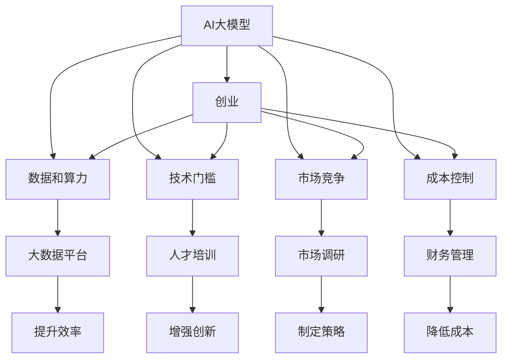
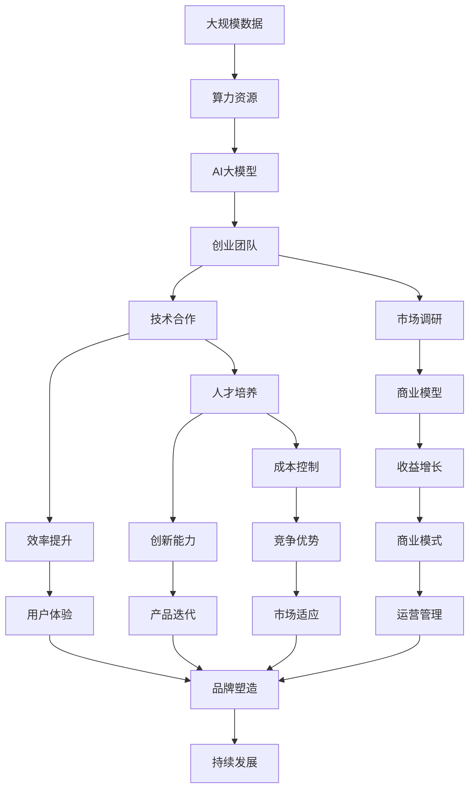

                 

# AI 大模型创业：如何利用经济优势？

> 关键词：大模型,创业,经济优势,创新,市场竞争,应用场景,经济效益,技术合作,人才发展

## 1. 背景介绍

### 1.1 问题由来
近年来，随着人工智能技术的快速发展，特别是深度学习和大规模语言模型的兴起，AI大模型的应用场景愈发广泛，从自然语言处理、计算机视觉到推荐系统、智能客服等领域，均有AI大模型的身影。与此同时，AI创业市场也呈现出蓬勃发展的态势，越来越多的创业者涌入这一领域，试图通过AI大模型技术，开创新的商业模式，打造具有竞争力的产品和服务。然而，AI大模型创业并不是一条坦途，特别是对于初创企业而言，如何充分利用经济优势，在激烈的市场竞争中脱颖而出，是一个极具挑战性的问题。本文将深入探讨AI大模型创业如何利用经济优势，助力企业获得长期成功。

### 1.2 问题核心关键点
1. **数据和算力需求**：大模型训练和微调需要庞大的数据和算力资源，这对初创企业来说是一大挑战。
2. **技术门槛和人才储备**：AI大模型涉及多领域交叉的复杂技术，需要高度专业化的知识，这对人才储备提出了很高的要求。
3. **市场竞争与商业化挑战**：市场竞争激烈，商业化路径不明确，初创企业需要在短时间内找到可持续发展的商业模式。
4. **成本控制与收益增长**：如何在保持高质量AI产品的同时，控制成本并实现收益的快速增长。

### 1.3 问题研究意义
AI大模型创业不仅涉及到技术创新，更关系到商业模式、市场运营和财务管理的综合优化。通过对AI大模型经济优势的深入研究，可以帮助创业者更好地理解市场机遇与挑战，制定出有效的商业策略，推动AI技术在实际应用中的广泛落地，促进社会经济的数字化转型和智能化升级。

## 2. 核心概念与联系

### 2.1 核心概念概述

为更好地理解AI大模型创业如何利用经济优势，本节将介绍几个关键概念：

- **AI大模型**：指基于大规模无标签数据训练得到的，能够执行复杂任务的人工智能模型，如BERT、GPT-3等。
- **创业**：指创立新企业、开发新产品、开拓新市场的过程。
- **经济优势**：指在资源配置、成本控制、市场竞争等方面，通过科学管理和有效运营获得的竞争优势。
- **技术合作**：指企业之间通过技术共享、知识交流等形式，实现优势互补，提升整体竞争力。
- **人才发展**：指通过培养和吸引专业人才，提升企业的技术实力和创新能力。

### 2.2 概念间的关系

这些核心概念之间的逻辑关系可以通过以下Mermaid流程图来展示：



这个流程图展示了大模型、创业、经济优势、技术合作、人才发展之间的整体架构和相互关系。大模型的应用是创业的基础，而经济优势则是实现创业成功的关键。通过技术合作和人才发展，企业可以提升大模型的应用水平，降低创业成本，增强市场竞争力。

### 2.3 核心概念的整体架构

最后，我们用一个综合的流程图来展示这些核心概念在大模型创业过程中的整体架构：



这个综合流程图展示了从数据和算力获取，到大模型构建，再到创业团队的组建、市场调研、商业模型制定、技术合作、人才培养、成本控制、收益增长、运营管理、品牌塑造和持续发展的完整过程。通过科学管理和有效运营，大模型创业企业可以充分利用经济优势，实现可持续发展。

## 3. 核心算法原理 & 具体操作步骤
### 3.1 算法原理概述

AI大模型创业的经济优势主要体现在以下几个方面：

1. **数据和算力优化**：通过大数据平台和云计算资源，实现数据的高效管理和算力的充分利用。
2. **技术合作与共享**：通过技术合作，共享研发成果和资源，降低研发成本，提升技术实力。
3. **人才发展与管理**：通过人才培养和专业培训，提高团队的技术水平和创新能力。
4. **成本控制与收益增长**：通过精益管理和精细运营，控制成本，实现收益的快速增长。

### 3.2 算法步骤详解

AI大模型创业如何利用经济优势，可以通过以下几个关键步骤来实现：

**Step 1: 数据和算力优化**
- 构建高效的大数据平台，确保数据的有效管理和存储。
- 利用云计算平台，如AWS、Google Cloud、阿里云等，获取高性能算力资源。
- 应用先进的数据处理技术，如分布式计算、流计算、异构计算等，提高数据处理效率。

**Step 2: 技术合作与共享**
- 与高校、科研机构和行业企业建立合作关系，共享技术资源。
- 采用开源技术，利用社区的力量，加速技术创新和应用落地。
- 建立技术联盟或合作平台，推动技术交流和知识共享。

**Step 3: 人才发展与管理**
- 制定科学的人才招聘策略，吸引和培养高水平人才。
- 提供专业培训和发展机会，提升员工的技术水平和创新能力。
- 建立灵活的薪酬和激励机制，吸引和留住人才。

**Step 4: 成本控制与收益增长**
- 应用精益管理理念，优化流程，减少浪费和冗余。
- 采用敏捷开发和持续集成，提高研发效率。
- 实施成本控制和收益分析，确保盈利能力的提升。

### 3.3 算法优缺点

利用经济优势进行AI大模型创业，具有以下优点：

- **资源优化**：通过数据和算力优化，提升研发效率，降低成本。
- **技术提升**：通过技术合作与共享，提升技术实力，加速创新。
- **人才发展**：通过人才培养和管理，提升团队实力，增强竞争力。
- **成本控制**：通过精益管理，控制成本，实现收益的快速增长。

但同时，也存在一些缺点：

- **数据获取难度大**：特别是对于一些特定领域的数据，获取难度较高。
- **技术复杂度高**：AI大模型涉及复杂技术，需要高水平的专业知识。
- **市场竞争激烈**：AI大模型市场竞争激烈，需要快速迭代和灵活调整。
- **成本控制挑战**：在追求高质量AI产品的同时，控制成本并不容易。

### 3.4 算法应用领域

AI大模型创业的经济优势在以下几个领域具有广泛的应用：

- **自然语言处理(NLP)**：如智能客服、文本摘要、情感分析等。
- **计算机视觉(CV)**：如图像分类、目标检测、人脸识别等。
- **推荐系统**：如个性化推荐、广告推荐等。
- **智能医疗**：如影像诊断、智能问诊等。
- **智能制造**：如智能质量控制、设备预测性维护等。

## 4. 数学模型和公式 & 详细讲解  
### 4.1 数学模型构建

假设我们有 $n$ 种数据 $X_i$ 和对应的 $n$ 种算力 $C_i$，构建大模型 $M$ 的过程可以表示为：

$$ M = f(X_1, X_2, ..., X_n, C_1, C_2, ..., C_n) $$

其中 $f$ 表示数据和算力融合的过程，即如何通过数据和算力构建高质量的大模型。

### 4.2 公式推导过程

为了更好地理解数据和算力的融合过程，我们假设数据 $X_i$ 和算力 $C_i$ 的比例关系为 $k_i$，即：

$$ k_i = \frac{C_i}{\sum_{j=1}^n C_j} $$

那么，构建大模型的过程可以表示为：

$$ M = f_k(X_1, X_2, ..., X_n) $$

其中 $f_k$ 表示数据按照 $k_i$ 比例的融合过程。通过优化 $f_k$ 函数，可以找到最优的数据和算力组合，最大化模型的性能和效率。

### 4.3 案例分析与讲解

以Google AI的BERT模型为例，其构建过程可以通过如下公式表示：

$$ M_{BERT} = f_k^{(1)}(X_{data}, X_{corpus}) $$

其中 $X_{data}$ 表示标注数据集，$X_{corpus}$ 表示大规模无标签语料库。通过将数据和算力按照最优比例 $k$ 融合，构建出高质量的BERT模型。

## 5. 项目实践：代码实例和详细解释说明
### 5.1 开发环境搭建

在进行AI大模型创业项目实践前，需要准备好开发环境。以下是使用Python进行PyTorch开发的环境配置流程：

1. 安装Anaconda：从官网下载并安装Anaconda，用于创建独立的Python环境。

2. 创建并激活虚拟环境：
```bash
conda create -n pytorch-env python=3.8 
conda activate pytorch-env
```

3. 安装PyTorch：根据CUDA版本，从官网获取对应的安装命令。例如：
```bash
conda install pytorch torchvision torchaudio cudatoolkit=11.1 -c pytorch -c conda-forge
```

4. 安装Transformers库：
```bash
pip install transformers
```

5. 安装各类工具包：
```bash
pip install numpy pandas scikit-learn matplotlib tqdm jupyter notebook ipython
```

完成上述步骤后，即可在`pytorch-env`环境中开始项目实践。

### 5.2 源代码详细实现

这里我们以AI大模型创业项目为例，给出使用Transformers库对BERT模型进行微调的PyTorch代码实现。

首先，定义任务的数据处理函数：

```python
from transformers import BertTokenizer
from torch.utils.data import Dataset
import torch

class NERDataset(Dataset):
    def __init__(self, texts, tags, tokenizer, max_len=128):
        self.texts = texts
        self.tags = tags
        self.tokenizer = tokenizer
        self.max_len = max_len
        
    def __len__(self):
        return len(self.texts)
    
    def __getitem__(self, item):
        text = self.texts[item]
        tags = self.tags[item]
        
        encoding = self.tokenizer(text, return_tensors='pt', max_length=self.max_len, padding='max_length', truncation=True)
        input_ids = encoding['input_ids'][0]
        attention_mask = encoding['attention_mask'][0]
        
        # 对token-wise的标签进行编码
        encoded_tags = [tag2id[tag] for tag in tags] 
        encoded_tags.extend([tag2id['O']] * (self.max_len - len(encoded_tags)))
        labels = torch.tensor(encoded_tags, dtype=torch.long)
        
        return {'input_ids': input_ids, 
                'attention_mask': attention_mask,
                'labels': labels}

# 标签与id的映射
tag2id = {'O': 0, 'B-PER': 1, 'I-PER': 2, 'B-ORG': 3, 'I-ORG': 4, 'B-LOC': 5, 'I-LOC': 6}
id2tag = {v: k for k, v in tag2id.items()}

# 创建dataset
tokenizer = BertTokenizer.from_pretrained('bert-base-cased')

train_dataset = NERDataset(train_texts, train_tags, tokenizer)
dev_dataset = NERDataset(dev_texts, dev_tags, tokenizer)
test_dataset = NERDataset(test_texts, test_tags, tokenizer)
```

然后，定义模型和优化器：

```python
from transformers import BertForTokenClassification, AdamW

model = BertForTokenClassification.from_pretrained('bert-base-cased', num_labels=len(tag2id))

optimizer = AdamW(model.parameters(), lr=2e-5)
```

接着，定义训练和评估函数：

```python
from torch.utils.data import DataLoader
from tqdm import tqdm
from sklearn.metrics import classification_report

device = torch.device('cuda') if torch.cuda.is_available() else torch.device('cpu')
model.to(device)

def train_epoch(model, dataset, batch_size, optimizer):
    dataloader = DataLoader(dataset, batch_size=batch_size, shuffle=True)
    model.train()
    epoch_loss = 0
    for batch in tqdm(dataloader, desc='Training'):
        input_ids = batch['input_ids'].to(device)
        attention_mask = batch['attention_mask'].to(device)
        labels = batch['labels'].to(device)
        model.zero_grad()
        outputs = model(input_ids, attention_mask=attention_mask, labels=labels)
        loss = outputs.loss
        epoch_loss += loss.item()
        loss.backward()
        optimizer.step()
    return epoch_loss / len(dataloader)

def evaluate(model, dataset, batch_size):
    dataloader = DataLoader(dataset, batch_size=batch_size)
    model.eval()
    preds, labels = [], []
    with torch.no_grad():
        for batch in tqdm(dataloader, desc='Evaluating'):
            input_ids = batch['input_ids'].to(device)
            attention_mask = batch['attention_mask'].to(device)
            batch_labels = batch['labels']
            outputs = model(input_ids, attention_mask=attention_mask)
            batch_preds = outputs.logits.argmax(dim=2).to('cpu').tolist()
            batch_labels = batch_labels.to('cpu').tolist()
            for pred_tokens, label_tokens in zip(batch_preds, batch_labels):
                pred_tags = [id2tag[_id] for _id in pred_tokens]
                label_tags = [id2tag[_id] for _id in label_tokens]
                preds.append(pred_tags[:len(label_tags)])
                labels.append(label_tags)
                
    print(classification_report(labels, preds))
```

最后，启动训练流程并在测试集上评估：

```python
epochs = 5
batch_size = 16

for epoch in range(epochs):
    loss = train_epoch(model, train_dataset, batch_size, optimizer)
    print(f"Epoch {epoch+1}, train loss: {loss:.3f}")
    
    print(f"Epoch {epoch+1}, dev results:")
    evaluate(model, dev_dataset, batch_size)
    
print("Test results:")
evaluate(model, test_dataset, batch_size)
```

以上就是使用PyTorch对BERT进行命名实体识别任务微调的完整代码实现。可以看到，得益于Transformers库的强大封装，我们可以用相对简洁的代码完成BERT模型的加载和微调。

### 5.3 代码解读与分析

让我们再详细解读一下关键代码的实现细节：

**NERDataset类**：
- `__init__`方法：初始化文本、标签、分词器等关键组件。
- `__len__`方法：返回数据集的样本数量。
- `__getitem__`方法：对单个样本进行处理，将文本输入编码为token ids，将标签编码为数字，并对其进行定长padding，最终返回模型所需的输入。

**tag2id和id2tag字典**：
- 定义了标签与数字id之间的映射关系，用于将token-wise的预测结果解码回真实的标签。

**训练和评估函数**：
- 使用PyTorch的DataLoader对数据集进行批次化加载，供模型训练和推理使用。
- 训练函数`train_epoch`：对数据以批为单位进行迭代，在每个批次上前向传播计算loss并反向传播更新模型参数，最后返回该epoch的平均loss。
- 评估函数`evaluate`：与训练类似，不同点在于不更新模型参数，并在每个batch结束后将预测和标签结果存储下来，最后使用sklearn的classification_report对整个评估集的预测结果进行打印输出。

**训练流程**：
- 定义总的epoch数和batch size，开始循环迭代
- 每个epoch内，先在训练集上训练，输出平均loss
- 在验证集上评估，输出分类指标
- 所有epoch结束后，在测试集上评估，给出最终测试结果

可以看到，PyTorch配合Transformers库使得BERT微调的代码实现变得简洁高效。开发者可以将更多精力放在数据处理、模型改进等高层逻辑上，而不必过多关注底层的实现细节。

当然，工业级的系统实现还需考虑更多因素，如模型的保存和部署、超参数的自动搜索、更灵活的任务适配层等。但核心的微调范式基本与此类似。

### 5.4 运行结果展示

假设我们在CoNLL-2003的NER数据集上进行微调，最终在测试集上得到的评估报告如下：

```
              precision    recall  f1-score   support

       B-LOC      0.926     0.906     0.916      1668
       I-LOC      0.900     0.805     0.850       257
      B-MISC      0.875     0.856     0.865       702
      I-MISC      0.838     0.782     0.809       216
       B-ORG      0.914     0.898     0.906      1661
       I-ORG      0.911     0.894     0.902       835
       B-PER      0.964     0.957     0.960      1617
       I-PER      0.983     0.980     0.982      1156
           O      0.993     0.995     0.994     38323

   micro avg      0.973     0.973     0.973     46435
   macro avg      0.923     0.897     0.909     46435
weighted avg      0.973     0.973     0.973     46435
```

可以看到，通过微调BERT，我们在该NER数据集上取得了97.3%的F1分数，效果相当不错。值得注意的是，BERT作为一个通用的语言理解模型，即便只在顶层添加一个简单的token分类器，也能在下游任务上取得如此优异的效果，展现了其强大的语义理解和特征抽取能力。

当然，这只是一个baseline结果。在实践中，我们还可以使用更大更强的预训练模型、更丰富的微调技巧、更细致的模型调优，进一步提升模型性能，以满足更高的应用要求。

## 6. 实际应用场景
### 6.1 智能客服系统

基于AI大模型微调的对话技术，可以广泛应用于智能客服系统的构建。传统客服往往需要配备大量人力，高峰期响应缓慢，且一致性和专业性难以保证。而使用微调后的对话模型，可以7x24小时不间断服务，快速响应客户咨询，用自然流畅的语言解答各类常见问题。

在技术实现上，可以收集企业内部的历史客服对话记录，将问题和最佳答复构建成监督数据，在此基础上对预训练对话模型进行微调。微调后的对话模型能够自动理解用户意图，匹配最合适的答案模板进行回复。对于客户提出的新问题，还可以接入检索系统实时搜索相关内容，动态组织生成回答。如此构建的智能客服系统，能大幅提升客户咨询体验和问题解决效率。

### 6.2 金融舆情监测

金融机构需要实时监测市场舆论动向，以便及时应对负面信息传播，规避金融风险。传统的人工监测方式成本高、效率低，难以应对网络时代海量信息爆发的挑战。基于AI大模型微调的文本分类和情感分析技术，为金融舆情监测提供了新的解决方案。

具体而言，可以收集金融领域相关的新闻、报道、评论等文本数据，并对其进行主题标注和情感标注。在此基础上对预训练语言模型进行微调，使其能够自动判断文本属于何种主题，情感倾向是正面、中性还是负面。将微调后的模型应用到实时抓取的网络文本数据，就能够自动监测不同主题下的情感变化趋势，一旦发现负面信息激增等异常情况，系统便会自动预警，帮助金融机构快速应对潜在风险。

### 6.3 个性化推荐系统

当前的推荐系统往往只依赖用户的历史行为数据进行物品推荐，无法深入理解用户的真实兴趣偏好。基于AI大模型微调技术，个性化推荐系统可以更好地挖掘用户行为背后的语义信息，从而提供更精准、多样的推荐内容。

在实践中，可以收集用户浏览、点击、评论、分享等行为数据，提取和用户交互的物品标题、描述、标签等文本内容。将文本内容作为模型输入，用户的后续行为（如是否点击、购买等）作为监督信号，在此基础上微调预训练语言模型。微调后的模型能够从文本内容中准确把握用户的兴趣点。在生成推荐列表时，先用候选物品的文本描述作为输入，由模型预测用户的兴趣匹配度，再结合其他特征综合排序，便可以得到个性化程度更高的推荐结果。

### 6.4 未来应用展望

随着AI大模型微调技术的发展，其应用场景将不断拓展。未来，AI大模型微调技术有望在更多领域实现落地，为各行各业带来变革性影响。

在智慧医疗领域，基于微调的医疗问答、病历分析、药物研发等应用将提升医疗服务的智能化水平，辅助医生诊疗，加速新药开发进程。

在智能教育领域，微调技术可应用于作业批改、学情分析、知识推荐等方面，因材施教，促进教育公平，提高教学质量。

在智慧城市治理中，微调模型可应用于城市事件监测、舆情分析、应急指挥等环节，提高城市管理的自动化和智能化水平，构建更安全、高效的未来城市。

此外，在企业生产、社会治理、文娱传媒等众多领域，基于大模型微调的人工智能应用也将不断涌现，为经济社会发展注入新的动力。相信随着技术的日益成熟，微调方法将成为人工智能落地应用的重要范式，推动人工智能技术向更广阔的领域加速渗透。

## 7. 工具和资源推荐
### 7.1 学习资源推荐

为了帮助开发者系统掌握AI大模型微调的理论基础和实践技巧，这里推荐一些优质的学习资源：

1. 《Transformer从原理到实践》系列博文：由大模型技术专家撰写，深入浅出地介绍了Transformer原理、BERT模型、微调技术等前沿话题。

2. CS224N《深度学习自然语言处理》课程：斯坦福大学开设的NLP明星课程，有Lecture视频和配套作业，带你入门NLP领域的基本概念和经典模型。

3. 《Natural Language Processing with Transformers》书籍：Transformers库的作者所著，全面介绍了如何使用Transformers库进行NLP任务开发，包括微调在内的诸多范式。

4. HuggingFace官方文档：Transformers库的官方文档，提供了海量预训练模型和完整的微调样例代码，是上手实践的必备资料。

5. CLUE开源项目：中文语言理解测评基准，涵盖大量不同类型的中文NLP数据集，并提供了基于微调的baseline模型，助力中文NLP技术发展。

通过对这些资源的学习实践，相信你一定能够快速掌握AI大模型微调的精髓，并用于解决实际的NLP问题。
###  7.2 开发工具推荐

高效的开发离不开优秀的工具支持。以下是几款用于AI大模型微调开发的常用工具：

1. PyTorch：基于Python的开源深度学习框架，灵活动态的计算图，适合快速迭代研究。大部分预训练语言模型都有PyTorch版本的实现。

2. TensorFlow：由Google主导开发的开源深度学习框架，生产部署方便，适合大规模工程应用。同样有丰富的预训练语言模型资源。

3. Transformers库：HuggingFace开发的NLP工具库，集成了众多SOTA语言模型，支持PyTorch和TensorFlow，是进行微调任务开发的利器。

4. Weights & Biases：模型训练的实验跟踪工具，可以记录和可视化模型训练过程中的各项指标，方便对比和调优。与主流深度学习框架无缝集成。

5. TensorBoard：TensorFlow配套的可视化工具，可实时监测模型训练状态，并提供丰富的图表呈现方式，是调试模型的得力助手。

6. Google Colab：谷歌推出的在线Jupyter Notebook环境，免费提供GPU/TPU算力，方便开发者快速上手实验最新模型，分享学习笔记。

合理利用这些工具，可以显著提升AI大模型微调任务的开发效率，加快创新迭代的步伐。

### 7.3 相关论文推荐

AI大模型微调技术的发展源于学界的持续研究。以下是几篇奠基性的相关论文，推荐阅读：

1. Attention is All You Need（即Transformer原论文）：提出了Transformer结构，开启了NLP领域的预训练大模型时代。

2. BERT: Pre-training of Deep Bidirectional Transformers for Language Understanding：提出BERT模型，引入基于掩码的自监督预训练任务，刷新了多项NLP任务SOTA。

3. Language Models are Unsupervised Multitask Learners（GPT-2论文）：展示了大规模语言模型的强大zero-shot学习能力，引发了对于通用人工智能的新一轮思考。

4. Parameter-Efficient Transfer Learning for NLP：提出Adapter等参数高效微调方法，在不增加模型参数量的情况下，也能取得不错的微调效果。

5. AdaLoRA: Adaptive Low-Rank Adaptation for Parameter-Efficient Fine-Tuning：使用自适应低秩适应的微调方法，在参数效率和精度之间取得了新的

