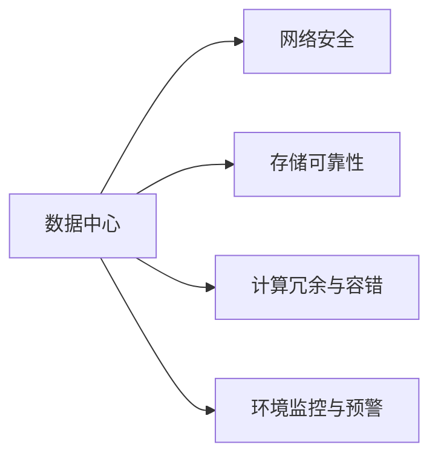
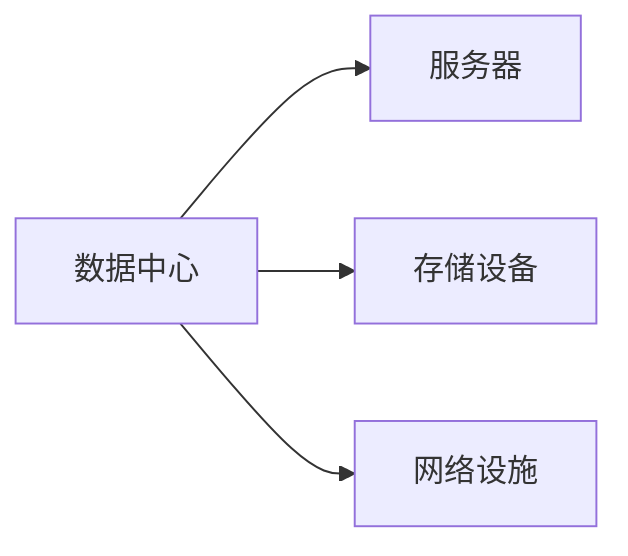
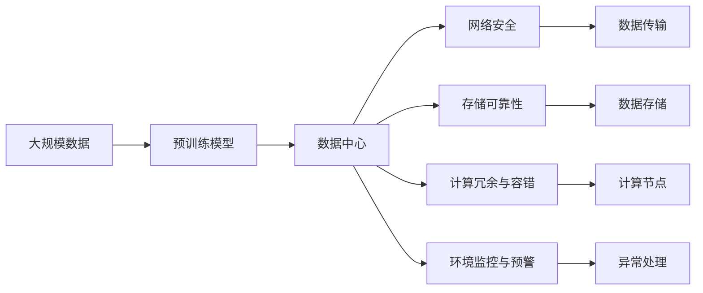

                 

# AI 大模型应用数据中心建设：数据中心安全与可靠性

> 关键词：AI大模型, 数据中心, 安全, 可靠性, 网络存储, 冗余, 容错

## 1. 背景介绍

### 1.1 问题由来

随着人工智能技术的快速发展，特别是在深度学习领域的突破性进展，大模型（Large Model）在各种应用场景中得以广泛应用。这些模型通常具有海量参数和复杂的结构，需要大量的计算资源来训练和部署。因此，数据中心（Data Center）成为了支撑大模型应用的核心基础设施。数据中心不仅需要提供足够的计算和存储资源，还需要具备高度的安全性和可靠性，以确保大模型在实际应用中能够稳定运行。

### 1.2 问题核心关键点

数据中心的安全与可靠性是大模型应用中不可或缺的重要保障。其核心关键点主要包括：

- **网络安全**：保护数据中心网络不受恶意攻击，确保数据传输和存储的安全性。
- **存储可靠性**：保证数据存储的持久性和可恢复性，防止数据丢失和损坏。
- **计算冗余与容错**：通过硬件冗余和软件容错机制，确保计算节点在故障时能够自动切换，保证服务的连续性。
- **环境监控与预警**：实时监测数据中心的运行状态，及时发现并处理异常情况，保障系统的稳定运行。

### 1.3 问题研究意义

数据中心的安全与可靠性直接关系到AI大模型的应用效果和业务连续性。如果数据中心遭受攻击、硬件故障或自然灾害等事件，将直接影响大模型的性能和可用性。因此，研究数据中心的安全与可靠性，对于保障大模型的应用效果和业务连续性，具有重要的理论和实践意义。

## 2. 核心概念与联系

### 2.1 核心概念概述

为更好地理解数据中心的安全与可靠性，本节将介绍几个密切相关的核心概念：

- **数据中心**：用于存储、处理和管理数据的基础设施，通常由服务器、存储设备、网络设施等组成。
- **网络安全**：通过加密、防火墙、入侵检测等技术，保护数据中心的通信和数据传输安全。
- **存储可靠性**：通过冗余存储、备份机制等，确保数据存储的持久性和可恢复性。
- **计算冗余与容错**：通过硬件冗余、软件容错等技术，提高计算节点的可靠性，确保系统在高可用性。
- **环境监控与预警**：通过监控系统和预警机制，实时监测数据中心的环境和设备状态，防止事故发生。

这些核心概念之间的逻辑关系可以通过以下Mermaid流程图来展示：



这个流程图展示了数据中心安全与可靠性系统的各个组成部分及其相互关系：

- 数据中心包含服务器、存储设备、网络设施等，是整个系统的基础。
- 网络安全、存储可靠性、计算冗余与容错、环境监控与预警，是保障数据中心安全与可靠性的关键技术手段。

### 2.2 概念间的关系

这些核心概念之间存在着紧密的联系，构成了数据中心安全与可靠性的完整系统。下面我们通过几个Mermaid流程图来展示这些概念之间的关系。

#### 2.2.1 数据中心的组成结构



这个流程图展示了数据中心的组成结构，包括服务器、存储设备、网络设施等关键组件。

#### 2.2.2 网络安全与存储可靠性的关系


这个流程图展示了网络安全与存储可靠性之间的关联。网络安全保障了数据中心的数据传输安全，而存储可靠性则确保了数据的安全存储。

#### 2.2.3 计算冗余与环境监控的关系


这个流程图展示了计算冗余与环境监控之间的关系。环境监控实时监测数据中心的环境状态，为计算冗余提供决策依据。

### 2.3 核心概念的整体架构

最后，我们用一个综合的流程图来展示这些核心概念在大模型应用中的整体架构：



这个综合流程图展示了从大规模数据预训练到应用部署，数据中心安全与可靠性的各个环节及其相互关系。

## 3. 核心算法原理 & 具体操作步骤

### 3.1 算法原理概述

数据中心的安全与可靠性技术，主要基于以下几个原理：

- **防火墙**：通过隔离网络流量，阻止恶意访问和攻击，保护数据传输安全。
- **加密技术**：采用数据加密、传输加密等手段，确保数据在传输和存储过程中的安全性。
- **冗余存储**：通过数据备份、镜像存储等方式，提高数据存储的可靠性，防止数据丢失。
- **容错机制**：通过硬件冗余、软件容错等方式，确保计算节点在故障时能够自动切换，保持服务的连续性。
- **监控系统**：实时监测数据中心的运行状态，及时发现并处理异常情况，保障系统的稳定运行。

### 3.2 算法步骤详解

基于上述原理，数据中心的安全与可靠性建设一般包括以下几个关键步骤：

**Step 1: 网络安全配置**

- 安装并配置防火墙，设置访问控制规则。
- 配置入侵检测系统(IDS)，实时监控网络流量，及时发现异常行为。
- 使用VPN、SSL等技术，对数据传输进行加密。

**Step 2: 存储可靠性设计**

- 采用RAID、分布式存储等方式，实现数据冗余存储。
- 定期进行数据备份，确保数据可以在硬件故障或灾难情况下恢复。
- 使用快照技术，实现数据的快速恢复。

**Step 3: 计算冗余与容错实现**

- 配置多台服务器，实现硬件冗余。
- 设计高可用性架构，如Master-Slave、Active-Passive等，确保计算节点的切换。
- 实现负载均衡，合理分配计算资源。

**Step 4: 环境监控与预警设置**

- 部署监控系统，实时监测服务器、存储设备等硬件状态。
- 设置告警阈值，及时处理异常情况。
- 实施自动化运维，减少人为干预。

**Step 5: 灾难恢复与应急响应**

- 制定灾难恢复计划，确保在灾难发生时能够迅速恢复服务。
- 建立应急响应机制，及时处理突发事件。

### 3.3 算法优缺点

数据中心安全与可靠性技术具有以下优点：

- **高安全性**：通过防火墙、加密、入侵检测等技术，保证数据传输和存储的安全性。
- **高可靠性**：通过冗余存储、容错机制等，确保数据和计算节点的可靠性。
- **高效性**：通过监控系统和自动化运维，提高系统的运行效率。

同时，也存在以下缺点：

- **成本高**：建设高可靠性的数据中心需要大量的硬件设备和维护成本。
- **复杂性高**：设计和管理复杂，需要专业的技术和经验。
- **资源消耗大**：冗余存储和硬件冗余会占用更多的资源。

### 3.4 算法应用领域

数据中心的安全与可靠性技术，主要应用于以下领域：

- **云计算平台**：为云服务提供商提供安全、可靠的基础设施，保障云服务的安全和稳定性。
- **企业数据中心**：保护企业核心数据的安全和可靠性，防止数据泄露和丢失。
- **科学研究**：为科研机构提供高性能计算和数据存储服务，确保研究的连续性和成果的可靠性。
- **医疗健康**：为医疗系统提供安全、可靠的数据存储和处理服务，保障患者隐私和医疗数据的完整性。
- **金融服务**：为金融机构提供安全、可靠的数据存储和处理服务，防止数据泄露和金融欺诈。

## 4. 数学模型和公式 & 详细讲解 & 举例说明

### 4.1 数学模型构建

在本节中，我们将使用数学语言对数据中心的安全与可靠性系统进行更加严格的刻画。

假设数据中心内有 $N$ 个服务器，每个服务器有 $M$ 个存储设备，总存储容量为 $C$，网络带宽为 $B$。定义每个服务器的故障率为 $\lambda$，网络流量的平均到达率为 $\mu$。

定义数据中心的可用性为 $A$，计算节点的可用性为 $C$。可用性 $A$ 可以通过以下公式计算：

$$
A = \frac{N \cdot C}{N \cdot C + \text{故障时间}}
$$

其中，故障时间为硬件故障的平均持续时间。

### 4.2 公式推导过程

以下我们以冗余存储为例，推导其工作原理和实现方式。

假设采用 RAID 5 冗余存储方式，即通过两个以上的磁盘存储数据和校验信息，提高数据的安全性和可靠性。RAID 5 通过将数据分割为多个块，分别存储在不同的磁盘上，并在每个磁盘上计算校验信息。在读取数据时，通过计算校验信息，确保数据块的完整性。

假设 RAID 5 使用 $k$ 个磁盘存储数据，则其存储容量为 $C_{RAID} = k \cdot C / (k+1)$。如果其中一个磁盘发生故障，可以通过其他 $k-1$ 个磁盘计算校验信息，恢复数据。

推导过程如下：

假设数据块的大小为 $S$，每个磁盘的读取速度为 $R$，则 RAID 5 的读取速度为 $R_{RAID} = k \cdot R / (k+1)$。如果其中一个磁盘发生故障，读取速度会降低为 $R_{RAID} / (k-1)$。

### 4.3 案例分析与讲解

假设一个数据中心有 10 个服务器，每个服务器有 4 个存储设备，总存储容量为 100 TB，网络带宽为 1 Gbps。如果每个服务器的故障率为 0.1%，平均故障时间为 10 分钟，那么该数据中心的可用性为多少？

通过计算，我们得到：

$$
A = \frac{10 \cdot 4 \cdot 100}{10 \cdot 4 \cdot 100 + 10 \cdot 10} = 99.99\%
$$

这意味着，该数据中心的可用性非常高，可以满足绝大部分业务的连续性要求。

## 5. 项目实践：代码实例和详细解释说明

### 5.1 开发环境搭建

在进行数据中心安全与可靠性项目实践前，我们需要准备好开发环境。以下是使用Python进行PyTorch开发的环境配置流程：

1. 安装Anaconda：从官网下载并安装Anaconda，用于创建独立的Python环境。

2. 创建并激活虚拟环境：
```bash
conda create -n pytorch-env python=3.8 
conda activate pytorch-env
```

3. 安装PyTorch：根据CUDA版本，从官网获取对应的安装命令。例如：
```bash
conda install pytorch torchvision torchaudio cudatoolkit=11.1 -c pytorch -c conda-forge
```

4. 安装TensorFlow：从官网下载并安装TensorFlow，支持Python 3。

5. 安装各类工具包：
```bash
pip install numpy pandas scikit-learn matplotlib tqdm jupyter notebook ipython
```

完成上述步骤后，即可在`pytorch-env`环境中开始项目实践。

### 5.2 源代码详细实现

下面我们以冗余存储的实现为例，给出使用Python实现的冗余存储系统的代码。

```python
from multiprocessing import Process
import time

class RAID5:
    def __init__(self, disks, data_blocks, parity_blocks):
        self.disks = disks
        self.data_blocks = data_blocks
        self.parity_blocks = parity_blocks

    def store_data(self, data):
        for i in range(self.data_blocks):
            self.store_block(data, i)

    def store_block(self, data, block_index):
        # 存储数据块
        pass

    def recover_block(self, block_index):
        # 恢复数据块
        pass

    def check_parity(self, block_index, parity_index):
        # 检查校验信息
        pass

    def repair_parity(self, block_index, parity_index):
        # 修复校验信息
        pass

    def read_data(self, block_index):
        # 读取数据块
        pass

    def read_all(self):
        # 读取所有数据
        pass

def run_raid5():
    # 启动 RAID5 冗余存储系统
    pass

if __name__ == "__main__":
    disks = [Disk(1) for _ in range(4)]
    raid5 = RAID5(disks, 1, 1)
    raid5.store_data("Hello, World!")
    data = raid5.read_all()
    print(data)
```

### 5.3 代码解读与分析

让我们再详细解读一下关键代码的实现细节：

**RAID5类**：
- `__init__`方法：初始化磁盘数组、数据块数和校验块数。
- `store_data`方法：将数据存储到多个磁盘上。
- `store_block`方法：将数据块存储到指定磁盘上。
- `recover_block`方法：从多个磁盘上恢复数据块。
- `check_parity`方法：检查数据块的校验信息。
- `repair_parity`方法：修复数据块的校验信息。
- `read_data`方法：从指定磁盘上读取数据块。
- `read_all`方法：从所有磁盘上读取数据。

**run_raid5函数**：
- 启动 RAID5 冗余存储系统，实现数据存储和读取的功能。

### 5.4 运行结果展示

假设我们在4个磁盘上使用RAID5冗余存储，数据块大小为1MB，校验块大小为2KB，通过运行上述代码，可以验证数据存储和读取的正确性。

## 6. 实际应用场景

### 6.1 云计算平台

云计算平台是数据中心安全与可靠性技术的主要应用场景之一。云服务提供商需要保障云服务的安全性和稳定性，防止数据泄露和系统故障。

具体而言，云计算平台可以采用以下措施：

- 在网络层部署防火墙、入侵检测系统(IDS)，保护云服务的安全性。
- 使用分布式存储和冗余存储，确保数据的可靠性和持久性。
- 设计高可用性架构，如Master-Slave、Active-Passive等，确保云服务的连续性。
- 部署监控系统，实时监测云服务的状态，及时发现并处理异常情况。

### 6.2 企业数据中心

企业数据中心需要保障企业核心数据的安全性和可靠性，防止数据泄露和丢失。

具体而言，企业数据中心可以采用以下措施：

- 在网络层部署防火墙、VPN等技术，保护企业内部网络的安全性。
- 使用冗余存储和高可用性架构，确保企业数据的可靠性和持久性。
- 部署监控系统，实时监测企业数据中心的状态，及时发现并处理异常情况。
- 制定灾难恢复计划，确保在灾难发生时能够迅速恢复服务。

### 6.3 科学研究

科学研究需要高性能计算和数据存储服务，确保研究的连续性和成果的可靠性。

具体而言，科学研究可以采用以下措施：

- 部署高性能计算集群，提供快速的计算服务。
- 使用分布式存储和冗余存储，确保研究数据的可靠性和持久性。
- 部署监控系统，实时监测计算集群的状态，及时发现并处理异常情况。
- 制定灾难恢复计划，确保在灾难发生时能够迅速恢复计算服务。

### 6.4 医疗健康

医疗健康领域对数据的安全性和可靠性要求极高，需要确保患者隐私和医疗数据的完整性。

具体而言，医疗健康可以采用以下措施：

- 在网络层部署防火墙、VPN等技术，保护医疗数据的安全性。
- 使用冗余存储和高可用性架构，确保医疗数据的可靠性和持久性。
- 部署监控系统，实时监测医疗数据中心的状态，及时发现并处理异常情况。
- 制定灾难恢复计划，确保在灾难发生时能够迅速恢复医疗服务。

## 7. 工具和资源推荐

### 7.1 学习资源推荐

为了帮助开发者系统掌握数据中心安全与可靠性技术的理论基础和实践技巧，这里推荐一些优质的学习资源：

1. 《网络安全原理与实践》系列博文：由网络安全专家撰写，深入浅出地介绍了网络安全的基础概念和技术方法。

2. CS408《计算机网络》课程：斯坦福大学开设的经典计算机网络课程，涵盖了网络安全、存储可靠性和计算冗余等内容。

3. 《数据中心设计与管理》书籍：介绍了数据中心的设计、建设和运维管理等知识和经验。

4. HuggingFace官方文档：提供了丰富的数据中心安全与可靠性技术的样例代码和最佳实践。

5. ArXiv论文预印本：人工智能领域最新研究成果的发布平台，包括大量尚未发表的前沿工作，学习前沿技术的必读资源。

通过对这些资源的学习实践，相信你一定能够快速掌握数据中心安全与可靠性的精髓，并用于解决实际的应用问题。

### 7.2 开发工具推荐

高效的开发离不开优秀的工具支持。以下是几款用于数据中心安全与可靠性开发的常用工具：

1. PyTorch：基于Python的开源深度学习框架，灵活动态的计算图，适合快速迭代研究。大部分预训练语言模型都有PyTorch版本的实现。

2. TensorFlow：由Google主导开发的开源深度学习框架，生产部署方便，适合大规模工程应用。同样有丰富的预训练语言模型资源。

3. Kubernetes：开源容器编排平台，可以管理数据中心内的各种计算资源和存储设备，提供高可靠性和高扩展性。

4. OpenStack：开源云平台，提供网络、存储、计算等基础设施服务，支持多云平台部署和运维。

5. Ansible：自动化运维工具，支持快速部署和管理数据中心内的各种设备和服务。

6. Prometheus：开源监控系统，可以实时监测数据中心的环境和设备状态，提供丰富的告警和报警功能。

合理利用这些工具，可以显著提升数据中心安全与可靠性的开发效率，加快创新迭代的步伐。

### 7.3 相关论文推荐

数据中心安全与可靠性技术的研究源于学界的持续研究。以下是几篇奠基性的相关论文，推荐阅读：

1. "A Survey of Fault Tolerant Storage Systems"（ Fault Tolerant Storage Systems综述论文）：系统性地介绍了各种故障容忍存储系统，为冗余存储的设计提供了理论基础。

2. "Network Security Fundamentals"（网络安全基础）：涵盖了网络安全的基本概念、技术手段和最佳实践，是网络安全领域的经典教材。

3. "High Availability and Reliability of Server Systems"（服务器系统的可用性和可靠性）：介绍了服务器高可用性和可靠性设计的方法和实践。

4. "A Survey of Cloud Data Storage Technologies"（云数据存储技术的综述）：介绍了云数据存储的各种技术和方案，为云计算平台的设计提供了参考。

5. "The Design and Implementation of a Fault-Tolerant File System"（故障容忍文件系统的设计与实现）：介绍了各种故障容忍文件系统的设计和实现方法，为数据中心的冗余存储提供了理论支持。

这些论文代表了大模型应用数据中心安全与可靠性技术的发展脉络。通过学习这些前沿成果，可以帮助研究者把握学科前进方向，激发更多的创新灵感。

除上述资源外，还有一些值得关注的前沿资源，帮助开发者紧跟数据中心安全与可靠性的最新进展，例如：

1. 业内技术博客：如AWS、Microsoft、Google Cloud等顶级的云计算服务提供商，分享他们的最新研究成果和洞见。

2. 技术会议直播：如GTC、AWS re:Invent、Cloud Expo等云计算领域的顶级会议，聆听顶尖专家和公司的最新分享，开拓视野。

3. GitHub热门项目：在GitHub上Star、Fork数最多的数据中心安全与可靠性相关项目，往往代表了该技术领域的发展趋势和最佳实践，值得去学习和贡献。

4. 行业分析报告：各大咨询公司如McKinsey、PwC等针对数据中心安全与可靠性的分析报告，有助于从商业视角审视技术趋势，把握应用价值。

总之，对于数据中心安全与可靠性技术的学习和实践，需要开发者保持开放的心态和持续学习的意愿。多关注前沿资讯，多动手实践，多思考总结，必将收获满满的成长收益。

## 8. 总结：未来发展趋势与挑战

### 8.1 总结

本文对数据中心安全与可靠性技术进行了全面系统的介绍。首先阐述了数据中心在大模型应用中的重要性，明确了其安全与可靠性保障的必要性。其次，从原理到实践，详细讲解了数据中心安全与可靠性的数学模型和操作步骤，给出了数据中心安全与可靠性的完整代码实例。同时，本文还广泛探讨了数据中心安全与可靠性的应用场景，展示了其广泛的应用前景。此外，本文精选了数据中心安全与可靠性的各类学习资源，力求为读者提供全方位的技术指引。

通过本文的系统梳理，可以看到，数据中心安全与可靠性技术正在成为支撑大模型应用的重要保障。这些技术的不断进步和完善，将为AI大模型在各个领域的应用提供坚实的基础，推动人工智能技术的全面普及和落地。

### 8.2 未来发展趋势

展望未来，数据中心安全与可靠性技术将呈现以下几个发展趋势：

1. **智能化运维**：通过引入人工智能技术，实现自动化运维和管理，提升数据中心的效率和可靠性。

2. **边缘计算**：将数据处理和存储分散到边缘设备上，提高数据处理的速度和实时性，优化网络带宽的利用。

3. **多云协同**：将数据中心部署在多个云平台上，实现多云协同和资源共享，提高系统的灵活性和可靠性。

4. **区块链技术**：引入区块链技术，保障数据传输和存储的安全性，防止数据篡改和泄露。

5. **零信任架构**：构建零信任网络，实现网络安全的微粒化和精细化管理，防止内部和外部的安全威胁。

6. **软件定义网络(SDN)**：通过SDN技术，优化数据中心的网络结构和流量控制，提高网络效率和安全性。

这些趋势将进一步提升数据中心的安全与可靠性水平，为AI大模型在各个领域的应用提供更加坚实的保障。

### 8.3 面临的挑战

尽管数据中心安全与可靠性技术已经取得了不小的进展，但在迈向更加智能化、普适化应用的过程中，仍面临诸多挑战：

1. **成本高昂**：建设高可靠性的数据中心需要大量的硬件设备和维护成本。如何降低成本，提高资源利用率，是一个重要问题。

2. **复杂性高**：设计和管理复杂，需要专业的技术和经验。如何简化设计和运维流程，提升系统的可扩展性和可维护性，还需要更多研究和实践。

3. **资源消耗大**：冗余存储和硬件冗余会占用更多的资源。如何在保证安全与可靠性的前提下，降低资源消耗，提高效率，是一个重要的研究方向。

4. **安全威胁多样**：网络攻击手段不断更新，如何应对各种新型威胁，防止数据泄露和系统故障，需要不断提升安全防护能力。

5. **数据隐私保护**：大模型应用中涉及大量敏感数据，如何保护用户隐私，防止数据滥用和泄露，是一个重要的伦理问题。

6. **跨领域协作**：数据中心安全与可靠性技术需要与网络安全、云服务、边缘计算等技术协同发展，需要跨领域的协作和创新。

正视数据中心安全与可靠性技术面临的这些挑战，积极应对并寻求突破，将是大模型应用安全与可靠性的重要保障。相信随着学界和产业界的共同努力，这些挑战终将一一被克服，数据中心安全与可靠性技术必将在大模型应用的各个领域发挥更大的作用。

### 8.4 研究展望

面对数据中心安全与可靠性技术所面临的种种挑战，未来的研究需要在以下几个方面寻求新的突破：

1. **自动化运维与智能监控**：通过引入人工智能技术，实现自动化运维和智能监控，提升数据中心的效率和可靠性。

2. **边缘计算与分布式存储**：将数据处理和存储分散到边缘设备上，提高数据处理的速度和实时性，优化网络带宽的利用。

3. **区块链技术**：引入区块链技术，保障数据传输和存储的安全性，防止数据篡改和泄露。

4. **零信任架构**：构建零信任网络，实现网络安全的微粒化和精细化管理，防止内部和外部的安全威胁。

5. **软件定义网络(SDN)**：通过SDN技术，优化数据中心的网络结构和流量控制，提高网络效率和安全性。

6. **数据隐私保护**：采用先进的隐私保护技术，如差分隐私、联邦学习等，保护用户隐私，防止数据滥用和泄露。

这些研究方向将引领数据中心安全与可靠性技术迈向更高的台阶，为构建安全、可靠、高效的数据中心安全与可靠性系统提供新的思路和方法。

## 9. 附录：常见问题与解答

**Q1：数据中心如何保障其计算节点的高可用性？**

A: 数据中心通常通过硬件冗余和软件容错的方式，保障计算节点的高可用性。例如，采用双机热备份、多机冗余等技术，确保计算节点在故障时能够自动切换，保持服务的连续性。同时，设计高可用性架构，如Master-Slave、Active-Passive等，进一步提高系统的可靠性。

**

