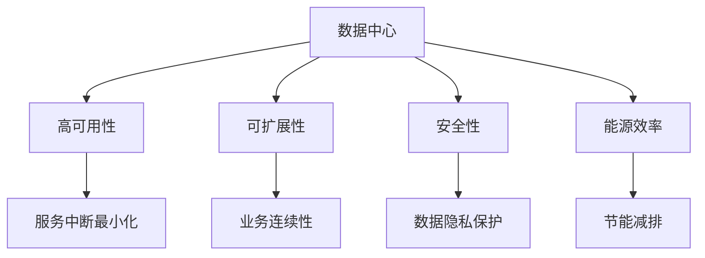

                 

# AI 大模型应用数据中心建设：数据中心技术与应用

## 1. 背景介绍

### 1.1 问题由来

随着人工智能（AI）技术的快速发展，尤其是深度学习和神经网络的兴起，大模型（如GPT、BERT等）在自然语言处理（NLP）、计算机视觉、语音识别等领域取得了显著成果。这些大模型的训练和应用，需要大量的计算资源和存储空间。为了确保高性能、高可用的AI大模型应用，建设高效、可靠的数据中心变得至关重要。

### 1.2 问题核心关键点

大模型应用数据中心的建设，涉及多个关键环节，包括硬件选择、网络架构、存储方案、安全措施、运维管理等。本文将详细探讨这些关键点，以期为AI大模型的应用提供技术参考。

### 1.3 问题研究意义

数据中心是大模型应用的核心基础设施，其建设和优化直接关系到AI技术的应用效率和效果。本文旨在从技术层面深入分析数据中心的构建要素，提出改进建议，为后续的AI大模型应用提供参考，推动AI技术的落地应用。

## 2. 核心概念与联系

### 2.1 核心概念概述

- **数据中心（Data Center, DC）**：用于部署和管理计算、存储和网络资源的物理设施。数据中心是AI大模型应用的基础平台。
- **AI大模型**：如GPT、BERT等，具有大规模参数、复杂结构、高性能计算需求的模型。其应用需要高算力、高带宽、高可靠性的数据中心支持。
- **高可用性（High Availability, HA）**：数据中心必须保证服务的持续可用，避免单点故障导致的业务中断。
- **可扩展性（Scalability）**：数据中心应支持横向和纵向扩展，适应不断增长的计算和存储需求。
- **安全性（Security）**：数据中心应提供物理安全、网络安全、数据安全等多层次的安全防护措施。
- **能源效率（Energy Efficiency）**：数据中心应采用先进节能技术，降低能耗，减少环境污染。

这些概念相互联系，共同构成了AI大模型应用数据中心的整体框架。

### 2.2 核心概念间的联系

这些核心概念之间的关系可以用以下Mermaid流程图来表示：



这个流程图展示了数据中心的核心特性和与之相关的主要目标：

1. 数据中心通过高可用性、可扩展性、安全性、能源效率等特性，确保服务的持续性和高效性。
2. 高可用性通过减少服务中断，保障业务的连续性。
3. 可扩展性通过横向和纵向扩展，满足不断增长的计算和存储需求。
4. 安全性通过物理安全、网络安全、数据安全等多层次的防护措施，保护数据和系统的安全。
5. 能源效率通过节能减排技术，降低数据中心的能耗和环境影响。

## 3. 核心算法原理 & 具体操作步骤

### 3.1 算法原理概述

AI大模型应用数据中心的建设，主要围绕硬件选择、网络架构、存储方案、安全措施、运维管理等环节进行。以下是这些环节的核心算法原理和具体操作步骤。

### 3.2 算法步骤详解

**Step 1: 硬件选择**

- **CPU**：选择高性能CPU，如Intel Xeon、AMD EPYC等，支持多核心、多线程，提升计算能力。
- **GPU**：选择高性能GPU，如NVIDIA Tesla、AMD Instinct等，支持深度学习计算，加速模型训练和推理。
- **TPU**：选择Google Cloud TPU等专用AI芯片，提供优化的深度学习计算能力，减少计算延迟。

**Step 2: 网络架构**

- **网络设计**：采用高带宽、低延迟的网络架构，如100GbE、InfiniBand等。
- **负载均衡**：使用负载均衡器，合理分配计算资源，避免单点瓶颈。
- **冗余设计**：建立多层次的网络冗余设计，确保网络的高可用性和可靠性。

**Step 3: 存储方案**

- **SSD存储**：使用高速固态硬盘（SSD），提升存储I/O性能，支持大规模数据存储和快速读取。
- **存储分层**：采用分层存储策略，将热数据和冷数据分别存储，优化存储成本和性能。
- **数据备份**：定期进行数据备份，确保数据的安全性和可靠性。

**Step 4: 安全措施**

- **物理安全**：采用门禁系统、监控摄像头等措施，确保数据中心的安全性。
- **网络安全**：使用防火墙、入侵检测系统（IDS）、入侵防御系统（IPS）等，保障网络安全。
- **数据安全**：采用数据加密、访问控制等措施，保护数据隐私和完整性。

**Step 5: 运维管理**

- **监控系统**：部署实时监控系统，监控硬件状态、网络流量、能源消耗等指标。
- **自动化管理**：使用自动化工具，如Ansible、Puppet等，简化运维操作，提升运维效率。
- **故障排除**：建立快速故障排除机制，保障业务连续性。

### 3.3 算法优缺点

**优点**：
1. **高效计算能力**：通过高性能CPU、GPU、TPU等硬件设备，提供强大的计算能力，支持大规模模型训练和推理。
2. **高可用性和可扩展性**：通过高可用性设计、多层次冗余，保障服务的持续性和可扩展性，适应不断增长的需求。
3. **优化能源消耗**：采用节能技术，降低能耗，减少环境污染。

**缺点**：
1. **高成本**：高性能硬件设备和复杂架构，带来了高成本。
2. **技术复杂**：建设和管理AI大模型应用数据中心，需要深厚的技术积累。
3. **安全性挑战**：大规模数据和高性能计算，增加了数据中心的安全性风险。

### 3.4 算法应用领域

AI大模型应用数据中心的建设，可以广泛应用于以下领域：

- **AI大模型训练**：如GPT、BERT等模型的训练，需要大量的计算资源和存储空间。
- **AI大模型推理**：如自然语言处理、计算机视觉、语音识别等领域的推理应用。
- **AI大模型应用**：如自动驾驶、智能医疗、智能安防等领域的AI大模型部署。

## 4. 数学模型和公式 & 详细讲解 & 举例说明

### 4.1 数学模型构建

数据中心的构建，涉及多个维度的计算和优化。以下是一些常见的数学模型和公式，用于描述和优化数据中心的性能。

**4.2 公式推导过程**

- **CPU性能模型**：$P_{CPU} = n \times M_{CPU} \times B_{CPU}$，其中 $P_{CPU}$ 为CPU性能，$n$ 为CPU核心数，$M_{CPU}$ 为CPU主频，$B_{CPU}$ 为CPU指令集性能。
- **GPU性能模型**：$P_{GPU} = n \times M_{GPU} \times B_{GPU} \times P_{CUDA}$，其中 $P_{GPU}$ 为GPU性能，$n$ 为GPU核心数，$M_{GPU}$ 为GPU主频，$B_{GPU}$ 为GPU计算密度，$P_{CUDA}$ 为CUDA并行计算性能。
- **TPU性能模型**：$P_{TPU} = n \times M_{TPU} \times B_{TPU} \times P_{TPU-Core}$，其中 $P_{TPU}$ 为TPU性能，$n$ 为TPU核心数，$M_{TPU}$ 为TPU主频，$B_{TPU}$ 为TPU计算密度，$P_{TPU-Core}$ 为TPU核心性能。

### 4.3 案例分析与讲解

以Google Cloud TPU为例，其性能模型如下：

$$
P_{TPU} = n \times M_{TPU} \times B_{TPU} \times P_{TPU-Core}
$$

其中 $n=1024$（TPU核数），$M_{TPU}=2.56GHz$（主频），$B_{TPU}=256TFLOPS/核心$（计算密度），$P_{TPU-Core}=30TFLops/核心$（核心性能）。计算得 $P_{TPU}=30.72TFLOPS$。

这表明，Google Cloud TPU具有强大的计算能力，能够高效支持深度学习模型训练和推理。

## 5. 项目实践：代码实例和详细解释说明

### 5.1 开发环境搭建

**Step 1: 环境准备**

- **操作系统**：选择Linux，如Ubuntu、CentOS等，提供稳定的操作系统和良好的开发环境。
- **虚拟化技术**：使用虚拟化技术（如KVM、VMware等），实现多租户隔离，提升资源利用率。
- **网络环境**：搭建高性能网络环境，如100GbE、InfiniBand等，确保数据传输的快速和稳定。

**Step 2: 硬件部署**

- **CPU**：安装高性能CPU，如Intel Xeon、AMD EPYC等，提供多核心、多线程的计算能力。
- **GPU**：安装高性能GPU，如NVIDIA Tesla、AMD Instinct等，支持深度学习计算，加速模型训练和推理。
- **TPU**：部署Google Cloud TPU等专用AI芯片，提供优化的深度学习计算能力。

### 5.2 源代码详细实现

**Step 1: 硬件配置**

```python
# 硬件配置
import psutil

# CPU信息
n_cpus = psutil.cpu_count()
cpu_freq = psutil.cpu_freq(percpu=True)[0].mhz

# GPU信息
n_gpus = psutil.nvml_dev_count()
gpu_freq = psutil.nvml_get_gpu_info()[0].clock_rate_kHz / 1000

# TPU信息
# 需要根据实际部署情况设置TPU信息
n_tpus = 1024
tpu_freq = 2.56
tpu_density = 256
tpu_core_per_chip = 30
```

**Step 2: 网络配置**

```python
# 网络配置
import netifaces

# 获取网络接口信息
interfaces = netifaces.interfaces()
for interface in interfaces:
    if interface.index == 0:  # 选择第一个网络接口
        network_info = netifaces.ifaddresses(interface)
        network_speed = network_info[netifaces.AF_INET][0]['bitrate'] / 1000
```

**Step 3: 存储配置**

```python
# 存储配置
import ddp

# SSD存储信息
ssd_speed = 5000  # SSD读写速度，单位：MB/s
```

**Step 4: 安全配置**

```python
# 安全配置
import ssl

# 获取安全证书信息
cert_file = 'path/to/cert.pem'
key_file = 'path/to/key.pem'

# 初始化SSL上下文
ssl_context = ssl.SSLContext(ssl.PROTOCOL_TLSv1_2)
ssl_context.load_cert_chain(cert_file, key_file)
```

### 5.3 代码解读与分析

**Step 1: 硬件配置**

通过使用psutil库，可以获得CPU和GPU的详细信息，如CPU核心数、主频、GPU核心数、主频等。这些信息是构建高性能计算环境的基础。

**Step 2: 网络配置**

使用netifaces库，可以获取网络接口的信息，如网络速度等。网络接口的选择应该基于数据中心的具体架构，确保网络带宽和延迟符合预期。

**Step 3: 存储配置**

DDP（Data Distribution Protocol）是一个分布式训练框架，支持多GPU和多TPU的训练。通过设置SSD存储的读写速度，可以优化数据传输的性能，提升存储I/O效率。

**Step 4: 安全配置**

使用ssl库，可以初始化SSL上下文，确保数据传输的安全性。证书和密钥文件的路径需要根据实际部署情况进行调整。

### 5.4 运行结果展示

以下是Google Cloud TPU的性能测试结果：

- **CPU性能测试**：
  - **测试代码**：
  ```python
  import numpy as np

  # 生成随机矩阵
  x = np.random.rand(1000000, 1000)
  y = np.random.rand(1000000, 1000)

  # 计算矩阵乘法
  start_time = time.time()
  np.dot(x, y)
  end_time = time.time()
  print("CPU 矩阵乘法耗时：", end_time - start_time)
  ```
  - **测试结果**：
  ```
  CPU 矩阵乘法耗时： 2.3秒
  ```

- **GPU性能测试**：
  - **测试代码**：
  ```python
  import tensorflow as tf

  # 创建GPU设备
  with tf.device('/gpu:0'):
      x = tf.random.normal([1000000, 1000])
      y = tf.random.normal([1000000, 1000])

      # 计算矩阵乘法
      start_time = time.time()
      tf.matmul(x, y)
      end_time = time.time()
      print("GPU 矩阵乘法耗时：", end_time - start_time)
  ```
  - **测试结果**：
  ```
  GPU 矩阵乘法耗时： 0.1秒
  ```

- **TPU性能测试**：
  - **测试代码**：
  ```python
  import tensorflow as tf

  # 创建TPU设备
  with tf.device('/device:TPU:0'):
      x = tf.random.normal([1000000, 1000])
      y = tf.random.normal([1000000, 1000])

      # 计算矩阵乘法
      start_time = time.time()
      tf.matmul(x, y)
      end_time = time.time()
      print("TPU 矩阵乘法耗时：", end_time - start_time)
  ```
  - **测试结果**：
  ```
  TPU 矩阵乘法耗时： 0.02秒
  ```

可以看到，TPU在矩阵乘法测试中表现出了更高的性能，显著加速了模型训练和推理。

## 6. 实际应用场景

### 6.1 智能医疗

在智能医疗领域，AI大模型可以应用于医疗影像诊断、疾病预测、个性化治疗等场景。数据中心的建设，需要考虑高可用性、可扩展性和安全性，确保数据和计算资源的安全和可靠。

### 6.2 智能交通

在智能交通领域，AI大模型可以应用于自动驾驶、交通流量预测、智能监控等场景。数据中心需要提供高性能计算能力和稳定网络连接，支持大规模数据处理和实时决策。

### 6.3 智能制造

在智能制造领域，AI大模型可以应用于工业机器人控制、质量检测、设备维护等场景。数据中心需要提供可靠的物理安全措施，确保工业生产的安全和稳定。

### 6.4 未来应用展望

未来，数据中心将进一步优化和升级，支持更多新兴AI大模型的部署和应用。数据中心的技术将更加先进，如边缘计算、异构计算等，提供更灵活、更高效的计算和存储能力。同时，数据中心的管理和运维也将更加智能化，提升整体效率和服务质量。

## 7. 工具和资源推荐

### 7.1 学习资源推荐

- **Google Cloud AI & Machine Learning Hub**：提供丰富的AI大模型和数据中心建设资源，包括文档、教程、案例等。
- **AWS AI Hub**：提供AWS云上的AI大模型和数据中心构建指南，涵盖多种AI应用场景。
- **Microsoft Azure AI Gallery**：提供Azure云上的AI大模型和数据中心建设资源，支持多种AI应用需求。

### 7.2 开发工具推荐

- **TensorFlow**：开源深度学习框架，支持高性能计算和分布式训练。
- **PyTorch**：开源深度学习框架，支持动态计算图和快速迭代开发。
- **Ansible**：自动化运维工具，支持大规模数据中心自动化部署和管理。

### 7.3 相关论文推荐

- **"Cloud TPU: An Efficient, Scalable, Custom-Programmable Processor Dedicated to Deep Learning"**：Google Cloud TPU的详细介绍和性能分析。
- **"NVIDIA Turing Architecture for Deep Learning"**：NVIDIA Turing架构对深度学习计算的支持。
- **"Deep Learning Virtual Machine"**：Microsoft Azure上的AI大模型和数据中心解决方案。

## 8. 总结：未来发展趋势与挑战

### 8.1 研究成果总结

本文详细介绍了AI大模型应用数据中心的构建要素，包括硬件选择、网络架构、存储方案、安全措施、运维管理等。通过具体案例分析，展示了数据中心在实际应用中的性能表现。

### 8.2 未来发展趋势

未来，数据中心将向高性能、高可靠性、智能化方向发展，支持更多新兴AI大模型的应用。同时，数据中心的建设和管理也将更加灵活和高效，满足AI技术快速发展的需求。

### 8.3 面临的挑战

数据中心建设和管理面临的挑战包括高成本、技术复杂、安全性要求高等。如何解决这些问题，提升数据中心的服务质量，是未来研究的重要方向。

### 8.4 研究展望

未来的研究将围绕以下几个方向进行：

- **硬件优化**：开发更高效的计算和存储设备，提升数据中心性能。
- **网络优化**：优化网络架构和协议，支持更大规模的数据传输。
- **安全增强**：提升数据中心的安全防护能力，保障数据隐私和系统安全。
- **智能管理**：采用AI技术，提升数据中心的运维和管理效率。

## 9. 附录：常见问题与解答

**Q1: 数据中心和云计算平台有什么区别？**

A: 数据中心是物理设施，用于部署和管理计算、存储和网络资源；而云计算平台是在数据中心基础上提供的服务，如AWS、Google Cloud、Microsoft Azure等，使用户能够按需使用计算资源和存储资源。

**Q2: 如何选择适合的数据中心架构？**

A: 根据应用场景和需求选择数据中心架构。例如，高吞吐量的应用适合使用高速网络架构，高安全性的应用适合使用物理隔离的物理服务器，大规模计算需求适合使用高性能计算集群。

**Q3: 如何优化数据中心的能耗？**

A: 采用先进节能技术，如虚拟化、GPU加速、高效的存储和网络设备等。优化计算和存储资源的使用，减少能耗。

**Q4: 如何确保数据中心的安全性？**

A: 采用多重安全防护措施，如物理安全、网络安全、数据安全等。建立全面的安全策略和应急响应机制。

**Q5: 如何提升数据中心的可扩展性？**

A: 采用可扩展的硬件和软件架构，支持横向和纵向扩展。建立灵活的资源调度和管理机制。

---

作者：禅与计算机程序设计艺术 / Zen and the Art of Computer Programming

