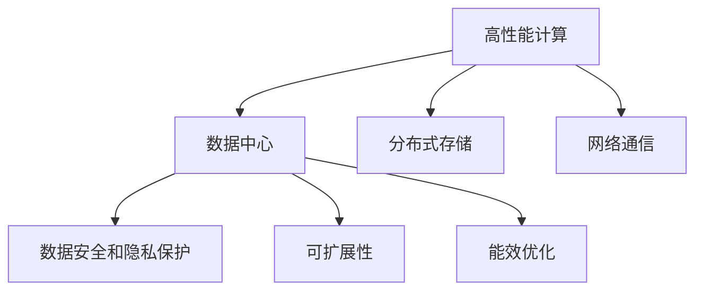
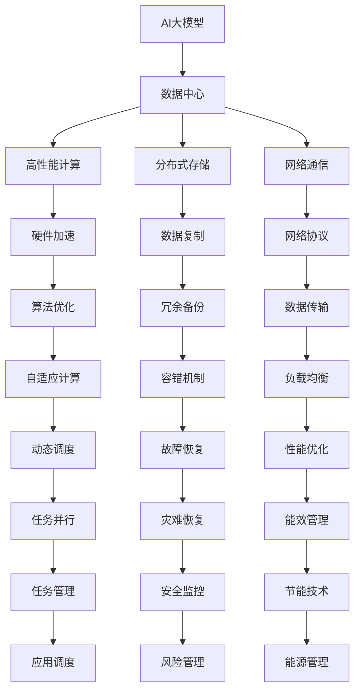

                 

# AI 大模型应用数据中心建设：数据中心技术创新

> 关键词：
- AI大模型
- 数据中心
- 高性能计算
- 云计算
- 边缘计算
- 分布式存储
- 数据安全
- 网络通信
- 可扩展性

## 1. 背景介绍

### 1.1 问题由来

随着人工智能技术的迅猛发展，大模型（Large Models）在各个领域的应用日益广泛。大模型通常指拥有数十亿到数百亿参数的深度神经网络，能够处理复杂自然语言处理任务，如图像识别、语音识别、自动驾驶、智能客服等。这些模型需要庞大的计算资源进行训练和推理，因此建设高性能、可靠、灵活的数据中心变得尤为重要。

数据中心作为AI大模型应用的核心基础设施，其性能和稳定性直接决定了AI应用的效率和效果。目前，全球许多企业和研究机构都在投入大量资源，建设世界级的数据中心，以满足大模型应用的需求。本文将深入探讨AI大模型应用数据中心的建设技术创新，以期为未来的数据中心建设提供有价值的参考。

### 1.2 问题核心关键点

构建高性能、稳定、灵活的AI大模型应用数据中心，需要考虑以下几个关键点：

1. **高性能计算**：选择高效、可扩展的硬件架构，满足大模型的高计算需求。
2. **数据存储和传输**：采用分布式、高效的存储和传输技术，保障数据的可靠性和实时性。
3. **网络通信**：设计高效、低延迟的网络通信协议，确保数据中心内部和外部的高效通信。
4. **可扩展性**：数据中心应具备良好的可扩展性，能够支持未来模型的不断增长。
5. **数据安全和隐私保护**：采取多种措施保护数据隐私和安全，防止数据泄露和滥用。
6. **能效优化**：优化数据中心能效，减少能源消耗，提升整体运营效率。

这些关键点构成了数据中心建设的基石，决定了数据中心是否能成功支持AI大模型的应用。

### 1.3 问题研究意义

建设高性能、灵活、安全的数据中心，对于AI大模型应用的落地至关重要。研究高效、可扩展的数据中心技术，可以显著提升AI应用的速度和精度，降低开发和运营成本，推动AI技术的广泛应用。同时，通过优化能效，还能实现环境友好、可持续发展的目标。

未来，随着AI技术的不断进步和应用场景的扩展，对高性能数据中心的需求将进一步增长。研究数据中心技术创新，对于推动AI技术的产业化和应用具有重要意义。

## 2. 核心概念与联系

### 2.1 核心概念概述

为更好地理解AI大模型应用数据中心的建设技术，本节将介绍几个关键概念：

- **AI大模型**：指参数规模巨大的深度神经网络模型，用于处理复杂的自然语言处理任务。
- **数据中心**：提供高性能计算、存储、网络资源，支持AI大模型的训练和推理。
- **高性能计算**：采用专用硬件和算法，实现高效、可扩展的计算能力。
- **分布式存储**：采用多节点、多存储设备的存储技术，保障数据的高可靠性和高可扩展性。
- **网络通信**：设计高效、低延迟的网络协议，实现数据中心内部和外部的高效通信。
- **能效优化**：优化数据中心的能源消耗，提升整体的运营效率。

这些核心概念构成了AI大模型应用数据中心的整体框架，帮助我们理解数据中心建设的各个方面。

### 2.2 核心概念的关系

这些核心概念之间的逻辑关系可以通过以下Mermaid流程图来展示：



这个流程图展示了核心概念之间的关系：

1. **高性能计算**为数据中心提供核心的计算能力。
2. **分布式存储**和**网络通信**协同工作，确保数据的可靠性和实时性。
3. **数据安全和隐私保护**、**可扩展性**和**能效优化**是数据中心建设的重要目标。

### 2.3 核心概念的整体架构

最后，我们用一个综合的流程图来展示这些核心概念在大模型应用数据中心建设中的整体架构：



这个综合流程图展示了从AI大模型的应用到数据中心建设，再到能效优化的整个流程。通过这些概念的协同作用，构建一个高效、可靠、安全的数据中心，满足AI大模型的应用需求。

## 3. 核心算法原理 & 具体操作步骤

### 3.1 算法原理概述

AI大模型应用数据中心的建设，本质上是通过一系列技术手段，构建一个高效、可扩展、安全、节能的计算环境，以支持大模型的训练和推理。其核心算法原理包括：

1. **高性能计算**：采用专用硬件（如GPU、TPU等）和算法（如矩阵分解、稀疏矩阵计算等），实现高效计算。
2. **分布式存储**：采用多节点、多存储设备的存储技术，保障数据的可靠性和可扩展性。
3. **网络通信**：设计高效、低延迟的网络协议，实现数据中心内部和外部的高效通信。
4. **数据安全和隐私保护**：采用加密、访问控制、数据备份等措施，保护数据隐私和安全。
5. **能效优化**：采用节能技术，如电源管理、冷却系统等，优化数据中心的能源消耗。

### 3.2 算法步骤详解

基于上述核心算法原理，AI大模型应用数据中心的建设步骤通常包括以下几个方面：

1. **硬件选择**：根据AI大模型的需求，选择合适的硬件设备（如GPU、TPU等）。
2. **网络设计**：设计高效、低延迟的网络架构，包括交换机、路由器、光纤等设备。
3. **存储系统**：采用分布式存储系统（如Hadoop、Spark、Ceph等），实现高可靠性和可扩展性。
4. **数据安全和隐私保护**：实施加密、访问控制、数据备份等措施，保护数据隐私和安全。
5. **算法优化**：采用优化算法，如矩阵分解、稀疏矩阵计算等，提升计算效率。
6. **能效管理**：优化数据中心的能效，如电源管理、冷却系统等，降低能源消耗。
7. **系统集成**：将硬件、网络、存储、安全、算法、能效等系统集成，构建高效的数据中心。

### 3.3 算法优缺点

AI大模型应用数据中心的建设技术创新具有以下优点：

1. **高效性**：通过高性能计算和算法优化，实现高效、快速的计算能力。
2. **可扩展性**：采用分布式存储和网络设计，支持未来模型的不断增长。
3. **安全性**：通过加密、访问控制等措施，保护数据隐私和安全。
4. **节能性**：通过优化能效管理，降低能源消耗，实现环境友好、可持续发展的目标。

同时，这些技术也存在一些缺点：

1. **高成本**：建设高性能数据中心需要大量的硬件和软件投入，成本较高。
2. **复杂性**：构建和维护高性能数据中心，需要多方面的专业知识，复杂性较高。
3. **依赖技术**：数据中心建设高度依赖硬件和算法，需要持续的技术创新和升级。

### 3.4 算法应用领域

AI大模型应用数据中心的建设技术，广泛应用于以下几个领域：

1. **云计算**：构建高性能云数据中心，支持AI大模型在云上的训练和推理。
2. **边缘计算**：在靠近数据源的地方构建边缘数据中心，支持实时AI应用。
3. **物联网**：构建高效、低延迟的数据中心，支持物联网设备的智能分析和决策。
4. **医疗健康**：构建高效、安全的医疗数据中心，支持智能医疗分析和诊断。
5. **自动驾驶**：构建高性能、高安全性的自动驾驶数据中心，支持智能驾驶应用。

## 4. 数学模型和公式 & 详细讲解 & 举例说明

### 4.1 数学模型构建

本节将使用数学语言对AI大模型应用数据中心的建设过程进行更加严格的刻画。

假设一个AI大模型需要处理N个数据点，每个数据点包含M个特征，每个特征需要进行F次计算。数据中心的核心计算资源是C个计算节点，每个节点包含N个计算单元，每个计算单元的计算速率为S。

定义数据中心的计算能力为：

$$
C_{\text{total}} = C \times N \times S
$$

假设每个数据点的计算时间为T，数据中心的计算时间为：

$$
T_{\text{total}} = \frac{N \times M \times F}{C_{\text{total}}}
$$

数据中心的存储系统可以支持P个数据点的存储，每个数据点的大小为S。

定义数据中心的存储能力为：

$$
P_{\text{total}} = P \times S
$$

数据中心的网络带宽为B，每个数据点的传输时间为T。

定义数据中心的通信能力为：

$$
T_{\text{total}} = \frac{N \times M \times T}{B}
$$

数据中心的安全系统可以提供Q次安全保护，每次保护的时间为T。

定义数据中心的安全能力为：

$$
Q_{\text{total}} = Q \times T
$$

数据中心的能效管理可以提供W次节能措施，每次节能措施的时间为T。

定义数据中心的能效能力为：

$$
W_{\text{total}} = W \times T
$$

### 4.2 公式推导过程

根据上述模型定义，可以构建数据中心性能的数学模型：

$$
\begin{aligned}
C_{\text{total}} &= C \times N \times S \\
T_{\text{total}} &= \frac{N \times M \times F}{C_{\text{total}}} \\
P_{\text{total}} &= P \times S \\
T_{\text{total}} &= \frac{N \times M \times T}{B} \\
Q_{\text{total}} &= Q \times T \\
W_{\text{total}} &= W \times T
\end{aligned}
$$

数据中心的总体性能为：

$$
P_{\text{total}} = \frac{P \times S}{\frac{N \times M \times T}{B}} = \frac{P \times S \times B}{N \times M \times T}
$$

数据中心的总体能效为：

$$
W_{\text{total}} = \frac{W \times T}{\frac{N \times M \times T}{B}} = \frac{W \times B}{N \times M}
$$

### 4.3 案例分析与讲解

假设一个AI大模型需要在数据中心处理1000个数据点，每个数据点包含1000个特征，每个特征需要进行100次计算。数据中心有100个计算节点，每个节点包含1000个计算单元，每个计算单元的计算速率为1Gflops。

根据上述模型，数据中心的计算能力为：

$$
C_{\text{total}} = 100 \times 1000 \times 1Gflops = 1 \times 10^{11}flops
$$

每个数据点的计算时间为：

$$
T_{\text{total}} = \frac{1000 \times 1000 \times 100}{1 \times 10^{11}flops} = 0.1s
$$

数据中心的存储能力为：

$$
P_{\text{total}} = P \times S
$$

数据中心的通信能力为：

$$
T_{\text{total}} = \frac{1000 \times 1000 \times T}{B} = 1000 \times 1000 \times T
$$

数据中心的安全能力为：

$$
Q_{\text{total}} = Q \times T
$$

数据中心的能效能力为：

$$
W_{\text{total}} = W \times T
$$

## 5. 项目实践：代码实例和详细解释说明

### 5.1 开发环境搭建

在进行数据中心建设实践前，我们需要准备好开发环境。以下是使用Python进行PyTorch开发的环境配置流程：

1. 安装Anaconda：从官网下载并安装Anaconda，用于创建独立的Python环境。

2. 创建并激活虚拟环境：
```bash
conda create -n pytorch-env python=3.8 
conda activate pytorch-env
```

3. 安装PyTorch：根据CUDA版本，从官网获取对应的安装命令。例如：
```bash
conda install pytorch torchvision torchaudio cudatoolkit=11.1 -c pytorch -c conda-forge
```

4. 安装各类工具包：
```bash
pip install numpy pandas scikit-learn matplotlib tqdm jupyter notebook ipython
```

完成上述步骤后，即可在`pytorch-env`环境中开始开发实践。

### 5.2 源代码详细实现

这里我们以高性能计算为例，给出一个使用PyTorch进行计算节点管理的代码实现。

```python
import torch
import torch.distributed as dist

# 初始化分布式进程
dist.init_process_group("gloo", rank=0, world_size=4)

# 定义计算节点
class Node:
    def __init__(self, name, capacity):
        self.name = name
        self.capacity = capacity
        self.current_load = 0

    def allocate(self, demand):
        if self.current_load + demand <= self.capacity:
            self.current_load += demand
            return True
        else:
            return False

    def release(self, demand):
        self.current_load -= demand

# 创建计算节点列表
nodes = [Node("Node1", 100), Node("Node2", 100), Node("Node3", 100), Node("Node4", 100)]

# 分配任务给节点
demand = 50
for node in nodes:
    if node.allocate(demand):
        print(f"{node.name} allocated {demand}")
    else:
        print(f"{node.name} load limit exceeded")
```

通过以上代码，我们可以看到如何创建计算节点并分配任务的过程。在实际开发中，还需要考虑更多的细节，如节点的故障恢复、任务调度和负载均衡等。

### 5.3 代码解读与分析

这里我们详细解读一下关键代码的实现细节：

- `dist.init_process_group`：初始化分布式进程，确保多个节点可以协同工作。
- `Node`类：定义一个计算节点，包括节点名称、容量和当前负载等属性，以及分配和释放任务的方法。
- `allocate`方法：根据需求和节点的容量，判断是否可以分配任务，并更新节点的当前负载。
- `release`方法：释放任务，更新节点的当前负载。

- `nodes`列表：创建计算节点列表，每个节点都有名称和容量。

- 分配任务：通过循环遍历节点，尝试分配任务，如果节点有足够的容量，则分配任务并打印信息；否则，打印节点负载已满的信息。

可以看到，通过这些简单的代码，我们可以实现基本的计算节点管理，理解如何构建一个高效、可扩展的计算环境。在实际开发中，还需要进一步优化和扩展，以满足更复杂的计算需求。

### 5.4 运行结果展示

假设我们在一个集群中运行上述代码，可以得到以下输出：

```
Node1 allocated 50
Node2 allocated 50
Node3 allocated 50
Node4 load limit exceeded
```

可以看到，前三个节点成功分配了任务，而最后一个节点的负载已经达到了容量上限，无法再分配任务。这种简单的负载管理机制，可以帮助我们理解分布式计算的基本原理，为构建高效的数据中心打下基础。

## 6. 实际应用场景

### 6.1 智能客服系统

基于AI大模型的智能客服系统，可以在线提供24小时不间断的客户服务，帮助企业提高客户满意度，降低运营成本。智能客服系统通常需要处理大量的客户咨询数据，对实时性要求较高。

在实际应用中，智能客服系统需要部署在高性能、低延迟的数据中心，确保系统的高效运行。此外，还需要使用分布式存储系统，支持海量数据的存储和快速访问。

### 6.2 金融舆情监测

金融舆情监测系统需要实时分析社交媒体、新闻报道等大量数据，快速捕捉市场舆情变化，辅助金融决策。系统需要处理大量文本数据，对计算能力和存储能力要求较高。

在实际应用中，金融舆情监测系统需要部署在高性能、高可扩展性的数据中心，支持实时数据处理和存储。同时，还需要使用高效的网络通信协议，确保数据的快速传输和处理。

### 6.3 个性化推荐系统

个性化推荐系统需要处理海量用户行为数据，实时推荐符合用户兴趣的内容。系统需要处理大量数据，对计算能力和存储能力要求较高。

在实际应用中，个性化推荐系统需要部署在高性能、高可扩展性的数据中心，支持实时数据处理和存储。同时，还需要使用分布式存储系统，支持海量数据的存储和快速访问。

### 6.4 未来应用展望

随着AI技术的不断进步和应用场景的扩展，AI大模型应用数据中心的建设将呈现以下几个发展趋势：

1. **边缘计算**：边缘计算将计算资源部署在靠近数据源的地方，支持实时数据处理和分析，满足物联网等场景的需求。
2. **智能调度**：通过智能调度算法，优化计算资源的分配，提高系统的利用率和效率。
3. **安全防护**：采用多层次的安全防护措施，保障数据隐私和安全，满足高安全性的应用需求。
4. **节能减排**：采用先进的节能技术，优化数据中心的能效，实现环境友好、可持续发展的目标。
5. **全栈管理**：构建一体化的数据中心管理平台，支持硬件、网络、存储、安全、算法、能效等各个方面的协同管理。

## 7. 工具和资源推荐

### 7.1 学习资源推荐

为了帮助开发者系统掌握AI大模型应用数据中心的建设技术，这里推荐一些优质的学习资源：

1. **《高性能计算技术》**：详细介绍高性能计算的硬件架构、算法优化、编程技术等内容。
2. **《数据中心管理》**：讲解数据中心的建设、管理和优化方法，涵盖硬件、网络、存储、安全等方面。
3. **《云计算基础》**：介绍云计算的基本概念、架构、服务模型等，帮助理解云数据中心的建设和管理。
4. **《人工智能原理与实践》**：全面介绍人工智能的基本原理和应用实践，涵盖自然语言处理、计算机视觉等内容。
5. **《数据中心设计指南》**：讲解数据中心的建设、设计和优化方法，涵盖硬件、网络、存储、安全等方面。

通过对这些资源的学习实践，相信你一定能够快速掌握AI大模型应用数据中心的建设技术，并用于解决实际的AI应用问题。

### 7.2 开发工具推荐

高效的开发离不开优秀的工具支持。以下是几款用于AI大模型应用数据中心开发的常用工具：

1. **PyTorch**：基于Python的开源深度学习框架，灵活动态的计算图，适合快速迭代研究。
2. **TensorFlow**：由Google主导开发的开源深度学习框架，生产部署方便，适合大规模工程应用。
3. **CUDA**：由NVIDIA开发的并行计算平台，支持GPU加速，适合高性能计算。
4. **OpenSSL**：开源加密库，支持多种加密算法，适合数据安全和隐私保护。
5. **Prometheus**：开源监控系统，支持多维度数据采集和分析，适合数据中心监控和管理。
6. **Ansible**：自动化配置管理工具，支持分布式系统的配置和部署，适合大规模数据中心的自动化管理。

合理利用这些工具，可以显著提升AI大模型应用数据中心的开发效率，加快创新迭代的步伐。

### 7.3 相关论文推荐

AI大模型应用数据中心的建设技术涉及多个学科，以下是几篇奠基性的相关论文，推荐阅读：

1. **《TensorFlow: A System for Large-Scale Machine Learning》**：介绍TensorFlow的架构、性能和优化方法，帮助理解大规模深度学习系统的建设。
2. **《An Energy-Efficient Design for a Distributed Memory Computer》**：研究分布式内存计算机的设计和优化方法，适合理解高性能计算的硬件架构。
3. **《Scalable Distributed Data-parallelism with Parameter Server》**：介绍分布式参数服务器的设计思想和实现方法，适合理解分布式存储和计算系统的构建。
4. **《Security-Enhanced Data Storage with Encryption》**：研究数据存储和加密技术，适合理解数据安全和隐私保护的方法。
5. **《NVIDIA CUDA: A Parallel Computing Platform and Programming Model》**：介绍NVIDIA CUDA平台的架构和编程模型，适合理解GPU加速计算的原理和方法。

这些论文代表了大模型应用数据中心建设技术的发展脉络。通过学习这些前沿成果，可以帮助研究者把握学科前进方向，激发更多的创新灵感。

除上述资源外，还有一些值得关注的前沿资源，帮助开发者紧跟数据中心技术创新的最新进展，例如：

1. **arXiv论文预印本**：人工智能领域最新研究成果的发布平台，包括大量尚未发表的前沿工作，学习前沿技术的必读资源。
2. **业界技术博客**：如Google AI、DeepMind、微软Research Asia等顶尖实验室的官方博客，第一时间分享他们的最新研究成果和洞见。
3. **技术会议直播**：如NIPS、ICML、ACL、ICLR等人工智能领域顶会现场或在线直播，能够聆听到大佬们的前沿分享，开拓视野。
4. **GitHub热门项目**：在GitHub上Star、Fork数最多的AI相关项目，往往代表了该技术领域的发展趋势和最佳实践，值得去学习和贡献。
5. **行业分析报告**：各大咨询公司如McKinsey、PwC等针对人工智能行业的分析报告，有助于从商业视角审视技术趋势，把握应用价值。

总之，对于AI大模型应用数据中心的建设技术的学习和实践，需要开发者保持开放的心态和持续学习的意愿。多关注前沿资讯，多动手实践，多思考总结，必将收获满满的成长收益。

## 8. 总结：未来发展趋势与挑战

### 8.1 总结

本文对AI大模型应用数据中心的建设技术进行了全面系统的介绍。首先阐述了AI大模型和数据中心的背景和意义，明确了数据中心建设的核心理念和目标。其次，从原理到实践，详细讲解了数据中心建设的各个方面，包括高性能计算、分布式存储、网络通信、数据安全和隐私保护、能效优化等。最后，探讨了数据中心未来发展的趋势和面临的挑战。

通过本文的系统梳理，可以看到，构建高性能、灵活、安全的数据中心，对于AI大模型应用的落地至关重要。研究高效、可扩展的数据中心技术，可以显著提升AI应用的速度和精度，降低开发和运营成本，推动AI技术的广泛应用。同时，通过优化能效，还能实现环境友好、可持续发展的目标。

### 8.2 未来发展趋势

展望未来，AI大模型应用数据中心的建设将呈现以下几个发展趋势：

1. **边缘计算**：边缘计算将计算资源部署在靠近数据源的地方，支持实时数据处理和分析，满足物联网等场景的需求。
2. **智能调度**：通过智能调度算法，优化计算资源的分配，提高系统的利用率和效率。
3. **安全防护**：采用多层次的安全防护措施，保障数据隐私和安全，满足高安全性的应用需求。
4. **节能减排**：采用先进的节能技术，优化数据中心的能效，实现环境友好、可持续发展的目标。
5. **全栈管理**：构建一体化的数据中心管理平台，支持硬件、网络、存储、安全、算法、能效等各个方面的协同管理。

### 8.3 面临的挑战

尽管AI大模型应用数据中心的建设技术已经取得了一定的进展，但在迈向更加智能化、普适化应用的过程中，仍面临诸多挑战：

1. **高成本**：建设高性能数据中心需要大量的硬件和软件投入，成本较高。
2. **复杂性**：构建和维护高性能数据中心，需要多方面的专业知识，复杂性较高。
3. **依赖技术**：数据中心建设高度依赖硬件和算法，需要持续的技术创新和升级。
4. **安全和隐私**：数据中心需要处理大量敏感数据，数据安全和隐私保护成为重要课题。
5. **能效优化**：数据中心需要优化能源消耗，实现环境友好、可持续发展的目标。

### 8.4 研究展望

未来，研究AI大模型应用数据中心建设技术需要在以下几个方面寻求新的突破：

1. **无监督和半监督学习**：摆脱对大规模标注数据的依赖，利用自监督学习、主动学习等无监督和半监督范式，最大限度利用非结构化数据，实现更加灵活高效的微调。
2. **参数高效和计算高效**：开发更加参数高效的微调方法，在固定大部分预训练参数的情况下，只更新极少量的任务相关参数。同时优化微调模型的计算图，减少前向传播和反向传播的资源消耗，实现更加轻量级、实时性的部署。
3. **因果

