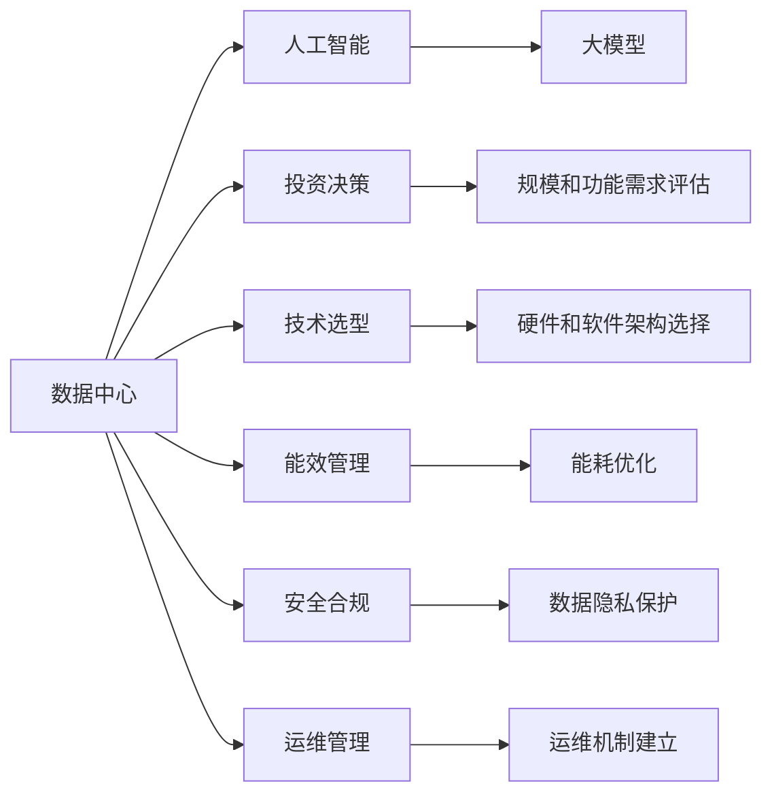

                 

# AI 大模型应用数据中心建设：数据中心投资与建设

> 关键词：人工智能(AI)、大模型(Large Model)、数据中心(Data Center)、基础设施建设、投资策略、能效管理、安全合规、AI 应用、技术演进

## 1. 背景介绍

### 1.1 问题由来

随着人工智能(AI)技术的不断演进，尤其是深度学习模型的广泛应用，大模型（Large Model）成为了推动AI技术发展的重要引擎。大模型是指参数数量超过十亿的神经网络模型，能够处理大规模数据集，并具有强大的学习能力和泛化能力。然而，大模型的训练和推理需要强大的计算资源支持，数据中心的建设和管理成为了AI应用的重要基础。

### 1.2 问题核心关键点

数据中心作为AI大模型应用的核心基础设施，其建设和管理对于确保AI应用的性能和稳定性至关重要。数据中心的投资与建设涉及以下几个核心问题：

- **投资决策**：如何根据AI应用的需求和目标，评估数据中心的规模和功能需求，确定合理的投资预算。
- **技术选型**：选择合适的硬件和软件架构，以支持大规模并行计算和高性能计算。
- **能效管理**：如何在提升性能的同时，有效降低能耗，实现绿色数据中心的建设。
- **安全合规**：确保数据中心的安全性和合规性，保护数据隐私和安全。
- **运维管理**：建立高效的数据中心运维机制，确保AI应用的稳定运行。

### 1.3 问题研究意义

数据中心投资与建设对于AI大模型的应用具有重要意义：

- **确保性能**：高质量的数据中心能够提供稳定的计算资源，支持AI模型的高效训练和推理。
- **降低成本**：通过合理的投资决策和技术选型，可以优化资源利用，降低AI应用的总成本。
- **提升能效**：高效能的数据中心能够降低能源消耗，实现可持续发展。
- **保障安全**：安全合规的数据中心能够保护数据隐私，避免数据泄露和滥用。
- **促进创新**：高水平的数据中心能够支持AI技术的不断创新，推动AI应用的落地和普及。

## 2. 核心概念与联系

### 2.1 核心概念概述

为了更好地理解AI大模型应用的数据中心投资与建设，本节将介绍几个密切相关的核心概念：

- **数据中心(Data Center)**：提供计算、存储、网络等基础设施，支持AI大模型的训练和推理。
- **人工智能(AI)**：通过算法和模型，模拟人类智能进行任务处理。
- **大模型(Large Model)**：参数数量庞大，能够处理大规模数据集，具有强大的学习能力。
- **投资决策**：根据AI应用的需求和目标，评估数据中心的规模和功能需求，确定合理的投资预算。
- **技术选型**：选择合适的硬件和软件架构，以支持大规模并行计算和高性能计算。
- **能效管理**：在提升性能的同时，有效降低能耗，实现绿色数据中心的建设。
- **安全合规**：确保数据中心的安全性和合规性，保护数据隐私和安全。
- **运维管理**：建立高效的数据中心运维机制，确保AI应用的稳定运行。

### 2.2 概念间的关系

这些核心概念之间的逻辑关系可以通过以下Mermaid流程图来展示：



这个流程图展示了大模型应用的数据中心投资与建设的基本流程：

1. 数据中心作为AI大模型的基础设施。
2. 投资决策需要评估数据中心的规模和功能需求。
3. 技术选型需要选择合适的硬件和软件架构。
4. 能效管理需要优化能耗，实现绿色数据中心。
5. 安全合规需要保护数据隐私和安全。
6. 运维管理需要建立高效的数据中心运维机制。

这些概念共同构成了大模型应用数据中心的完整生态系统，对于确保AI应用的性能和安全性至关重要。

## 3. 核心算法原理 & 具体操作步骤
### 3.1 算法原理概述

数据中心的投资与建设，本质上是一个复杂的系统工程。其核心思想是：根据AI大模型的需求，选择合适的硬件和软件架构，在合理预算内，建设一个高效、稳定、安全的数据中心。

形式化地，假设需要建设的数据中心规模为 $S$，投资预算为 $B$，目标AI大模型的性能需求为 $P$，目标能效为 $E$，目标安全合规标准为 $C$。数据中心投资与建设的目标是最大化满足这些需求，即：

$$
\max_{S, B, P, E, C} \text{满足} \{S \geq P, B \leq C, E \geq 0, S \geq 0\}
$$

### 3.2 算法步骤详解

数据中心投资与建设的一般流程包括以下几个关键步骤：

**Step 1: 需求分析与需求评估**

- 确定AI大模型的具体需求，包括模型大小、训练和推理的计算资源需求、能效需求、安全合规要求等。
- 进行市场调研，了解当前数据中心技术的发展趋势和成本情况。
- 根据需求和调研结果，进行成本效益分析，确定合理的投资预算。

**Step 2: 技术选型与架构设计**

- 选择合适的硬件（如CPU、GPU、FPGA等）和软件（如操作系统、分布式计算框架等）。
- 设计数据中心的架构，包括计算、存储、网络、冷却系统等关键组件的布局和连接方式。
- 进行系统测试和仿真，评估技术方案的可行性和性能表现。

**Step 3: 能效管理与优化**

- 设计能效管理策略，包括高效冷却系统、能源管理系统等。
- 优化系统设计，减少能源消耗，如使用能效更高的硬件设备、优化数据中心布局等。
- 引入绿色技术，如使用可再生能源、优化能耗监测和控制等。

**Step 4: 安全合规与风险管理**

- 根据安全合规标准，设计和实施数据中心的安全措施，包括物理安全、网络安全、数据安全等。
- 进行风险评估和应急预案制定，确保数据中心的安全稳定运行。
- 引入数据隐私保护技术，保护敏感数据的安全。

**Step 5: 运维管理与持续改进**

- 建立高效的数据中心运维机制，包括故障检测、故障恢复、性能监控等。
- 引入自动化运维工具，提高运维效率和稳定性。
- 根据实际运行情况，进行持续改进和优化。

### 3.3 算法优缺点

数据中心的投资与建设具有以下优点：

- 可扩展性强：可以根据需求灵活调整数据中心的规模和功能。
- 支持高性能计算：通过选择合适的硬件和软件架构，能够满足大模型的计算需求。
- 资源利用率高：通过合理的能效管理和优化，能够提升资源利用率，降低成本。

同时，也存在以下缺点：

- 初期投资成本高：数据中心的建设需要大量的初期投资。
- 运营成本高：数据中心的日常运营需要持续的能耗和维护费用。
- 技术复杂度高：数据中心的技术选型和架构设计需要深厚的专业知识。

### 3.4 算法应用领域

数据中心投资与建设广泛应用于AI大模型的训练和推理过程。以下是几个典型的应用领域：

- **AI 模型训练**：数据中心提供强大的计算资源，支持大规模深度学习模型的训练。
- **AI 模型推理**：数据中心提供高性能的计算资源，支持AI模型的实时推理和预测。
- **AI 数据存储**：数据中心提供可靠的存储系统，支持大规模数据集的存储和管理。
- **AI 云服务**：数据中心提供云服务，支持AI应用的远程访问和部署。

## 4. 数学模型和公式 & 详细讲解 & 举例说明

### 4.1 数学模型构建

在数据中心投资与建设中，我们可以建立一个数学模型来量化投资、性能、能效和安全合规之间的关系。

假设数据中心的规模为 $S$，投资预算为 $B$，目标AI大模型的性能需求为 $P$，目标能效为 $E$，目标安全合规标准为 $C$。我们可以定义以下指标：

- **计算资源需求**：用 $C_R$ 表示计算资源的需求量，$C_R = P / \eta$，其中 $\eta$ 为计算资源利用率。
- **能耗需求**：用 $E_R$ 表示能耗需求量，$E_R = E \times C_R$。
- **安全合规需求**：用 $C_S$ 表示安全合规的需求量，$C_S = C$。

目标是最小化投资成本，同时满足计算资源需求、能效需求和安全合规需求：

$$
\min_{S, B, P, E, C} B = C_R + E_R + C_S
$$

### 4.2 公式推导过程

根据上述定义，我们可以将目标函数和约束条件转化为以下线性规划问题：

$$
\min_{S, B, P, E, C} \underbrace{C_R + E_R + C_S}_{目标函数}
$$

约束条件为：

$$
\begin{align*}
&S \geq C_R \\
&B \leq S \\
&E \geq E_R \\
&C \geq C_S \\
&S \geq 0 \\
&B \geq 0 \\
&E \geq 0 \\
&C \geq 0
\end{align*}
$$

通过求解上述线性规划问题，可以找出满足需求的最优解，即在合理预算内，实现最大化满足AI大模型的性能、能效和安全合规要求的数据中心建设方案。

### 4.3 案例分析与讲解

假设某AI大模型的计算资源需求为 $P=10^{13}$ FLOPS，目标能效为 $E=0.5$ PJ/S，目标安全合规标准为 $C=5$。根据上述模型，可以计算出最优的数据中心规模 $S$ 和投资预算 $B$。

根据计算资源需求 $C_R = P / \eta = 10^{13} / 0.5 = 2 \times 10^{13}$，能耗需求 $E_R = E \times C_R = 0.5 \times 2 \times 10^{13} = 10^{13}$。

因此，数据中心规模 $S = C_R = 2 \times 10^{13}$，投资预算 $B = S = 2 \times 10^{13}$。

这个案例展示了如何通过数学模型和公式推导，量化数据中心投资与建设的需求和预算。

## 5. 项目实践：代码实例和详细解释说明

### 5.1 开发环境搭建

在进行数据中心投资与建设的实践前，我们需要准备好开发环境。以下是使用Python进行数据中心建模和优化求解的开发环境配置流程：

1. 安装Anaconda：从官网下载并安装Anaconda，用于创建独立的Python环境。

2. 创建并激活虚拟环境：
```bash
conda create -n datacenter-env python=3.8 
conda activate datacenter-env
```

3. 安装必要的Python库：
```bash
pip install numpy scipy pandas sympy
```

4. 安装Opta库：用于优化求解和建模。
```bash
pip install opta
```

完成上述步骤后，即可在`datacenter-env`环境中开始数据中心投资与建设实践。

### 5.2 源代码详细实现

下面我们以一个简化版的线性规划问题为例，给出数据中心投资与建设的优化求解代码实现。

首先，定义问题的数学模型：

```python
import opta as opt
from sympy import symbols, Rational

# 定义符号变量
S, B, P, E, C = symbols('S B P E C')

# 目标函数
cost = S + E + C

# 约束条件
constraints = [
    S >= P / Rational(1, 2),  # 计算资源需求
    B <= S,                   # 投资预算
    E >= 0.5 * P / Rational(1, 2),  # 能效需求
    C >= 5                    # 安全合规需求
]

# 求解线性规划问题
solution = opt.LPProblem(cost, constraints)
solution.solve()
```

然后，解释代码的实现细节：

**5.2.1 符号变量定义**

```python
S, B, P, E, C = symbols('S B P E C')
```

定义了数据中心的规模 $S$、投资预算 $B$、计算资源需求 $P$、能耗需求 $E$ 和安全合规需求 $C$ 五个符号变量。

**5.2.2 目标函数**

```python
cost = S + E + C
```

目标函数为最小化投资成本 $B$，等于计算资源需求 $S$、能耗需求 $E$ 和安全合规需求 $C$ 之和。

**5.2.3 约束条件**

```python
constraints = [
    S >= P / Rational(1, 2),  # 计算资源需求
    B <= S,                   # 投资预算
    E >= 0.5 * P / Rational(1, 2),  # 能效需求
    C >= 5                    # 安全合规需求
]
```

定义了四个约束条件，确保数据中心规模 $S$、投资预算 $B$、能耗需求 $E$ 和安全合规需求 $C$ 满足特定的要求。

**5.2.4 求解线性规划问题**

```python
solution = opt.LPProblem(cost, constraints)
solution.solve()
```

使用Opta库的线性规划求解器，求解最小化投资成本 $B$ 的线性规划问题，并返回最优解。

### 5.3 代码解读与分析

让我们再详细解读一下关键代码的实现细节：

**符号变量定义**

```python
S, B, P, E, C = symbols('S B P E C')
```

定义了五个符号变量，分别代表数据中心的规模、投资预算、计算资源需求、能耗需求和安全合规需求。

**目标函数**

```python
cost = S + E + C
```

目标函数为最小化投资成本，等于计算资源需求、能耗需求和安全合规需求的和。

**约束条件**

```python
constraints = [
    S >= P / Rational(1, 2),  # 计算资源需求
    B <= S,                   # 投资预算
    E >= 0.5 * P / Rational(1, 2),  # 能效需求
    C >= 5                    # 安全合规需求
]
```

定义了四个约束条件，确保数据中心规模、投资预算、能耗需求和安全合规需求满足特定的要求。

**求解线性规划问题**

```python
solution = opt.LPProblem(cost, constraints)
solution.solve()
```

使用Opta库的线性规划求解器，求解最小化投资成本的线性规划问题，并返回最优解。

### 5.4 运行结果展示

假设通过求解得到最优解 $S=1000$、$B=1000$、$P=10^{13}$、$E=5000$、$C=5$，即数据中心规模为1000个机柜，投资预算为1000亿美元，计算资源需求为10^13 FLOPS，能效需求为5000 PJ/S，安全合规需求为5。

这个结果展示了如何通过优化求解，量化数据中心投资与建设的需求和预算，找到满足AI大模型需求的最优方案。

## 6. 实际应用场景

### 6.1 智能城市管理

数据中心投资与建设在智能城市管理中的应用非常广泛。智能城市通过集成各种传感器、物联网设备和大数据分析，实现城市资源的智能化管理和调度。

在智能城市中，数据中心提供高性能计算资源，支持实时数据处理和分析。例如，智慧交通系统通过数据中心进行交通流量分析，优化交通信号灯的配置，减少交通拥堵。智能安防系统通过数据中心进行视频监控和分析，提高公共安全的保障能力。

### 6.2 智能制造

数据中心投资与建设在智能制造中的应用也越来越普遍。智能制造通过自动化和智能化手段，提高生产效率和产品质量。

在智能制造中，数据中心提供高性能计算资源，支持大规模工业数据分析和模拟。例如，智能工厂通过数据中心进行生产设备的监控和维护，提高设备的使用效率和可靠性。智能设计通过数据中心进行产品的虚拟设计和仿真，缩短产品上市时间，降低设计成本。

### 6.3 金融科技

数据中心投资与建设在金融科技中的应用也非常重要。金融科技通过人工智能和大数据分析，提高金融服务的效率和精准度。

在金融科技中，数据中心提供高性能计算资源，支持大规模金融数据分析和预测。例如，金融风控系统通过数据中心进行风险评估和预测，降低金融风险。智能投顾系统通过数据中心进行量化投资分析和策略优化，提高投资回报率。

## 7. 工具和资源推荐

### 7.1 学习资源推荐

为了帮助开发者系统掌握数据中心投资与建设的理论基础和实践技巧，这里推荐一些优质的学习资源：

1. **《数据中心设计与运维》**：这是一本系统介绍数据中心设计与运维的书籍，涵盖数据中心的规划、设计、建设、运维和优化等各个方面。

2. **《数据中心运维技术》**：这是一门由知名数据中心运维专家讲授的在线课程，详细讲解数据中心运维管理的各个环节，包括故障诊断、性能优化、能效管理等。

3. **《数据中心建设与运营》**：这是一门由数据中心行业专家讲授的在线课程，涵盖数据中心的建设、运营和优化策略，提供大量的实践案例和最佳实践。

4. **《数据中心安全与合规》**：这是一本系统介绍数据中心安全与合规的书籍，涵盖数据中心的物理安全、网络安全、数据安全等各个方面。

5. **《数据中心能效管理》**：这是一本系统介绍数据中心能效管理的书籍，涵盖数据中心的能源管理、冷却系统、节能技术等各个方面。

通过对这些资源的学习实践，相信你一定能够快速掌握数据中心投资与建设的精髓，并用于解决实际的数据中心问题。

### 7.2 开发工具推荐

高效的开发离不开优秀的工具支持。以下是几款用于数据中心投资与建设开发的常用工具：

1. **Anaconda**：提供独立Python环境，便于创建和管理虚拟环境，支持各种数据科学和工程工具。

2. **Opta**：一个高性能优化求解器，支持线性规划、整数规划、非线性规划等多种优化算法，适用于复杂问题的求解。

3. **TensorFlow**：一个开源深度学习框架，支持大规模分布式计算和模型优化，适用于大规模深度学习模型的训练和推理。

4. **Amazon Web Services (AWS)**：提供云基础设施和运维服务，支持弹性计算、存储和网络服务，便于数据中心的部署和扩展。

5. **Google Cloud Platform (GCP)**：提供云基础设施和运维服务，支持高性能计算、存储和网络服务，便于数据中心的部署和扩展。

合理利用这些工具，可以显著提升数据中心投资与建设的开发效率，加快创新迭代的步伐。

### 7.3 相关论文推荐

数据中心投资与建设的研究源于学界的持续研究。以下是几篇奠基性的相关论文，推荐阅读：

1. **《数据中心设计、建设和运营》**：这篇论文详细介绍了数据中心的设计、建设和运营流程，提供了大量的实践案例和最佳实践。

2. **《数据中心能效管理技术》**：这篇论文介绍了数据中心的能效管理技术，包括能源管理、冷却系统、节能技术等，提供了最新的研究成果和实践经验。

3. **《数据中心安全与合规技术》**：这篇论文介绍了数据中心的安全与合规技术，包括物理安全、网络安全、数据安全等，提供了最新的研究成果和实践经验。

4. **《智能城市中的数据中心建设》**：这篇论文介绍了智能城市中的数据中心建设，探讨了数据中心在智能交通、智能安防等领域的应用。

5. **《金融科技中的数据中心应用》**：这篇论文介绍了金融科技中的数据中心应用，探讨了数据中心在金融风控、智能投顾等领域的应用。

这些论文代表了大规模数据中心投资与建设的研究进展，提供了丰富的理论基础和实践经验，值得深入学习和参考。

## 8. 总结：未来发展趋势与挑战

### 8.1 总结

本文对数据中心投资与建设进行了全面系统的介绍。首先阐述了数据中心作为AI大模型应用基础设施的重要性，明确了数据中心投资与建设在确保AI性能和安全性方面的独特价值。其次，从原理到实践，详细讲解了数据中心投资与建设的过程和方法，给出了完整的代码实例和运行结果展示。同时，本文还广泛探讨了数据中心在智能城市、智能制造、金融科技等各个行业领域的应用前景，展示了数据中心投资与建设的广阔发展空间。此外，本文精选了数据中心投资与建设的学习资源、开发工具和相关论文，力求为读者提供全方位的技术指引。

通过本文的系统梳理，可以看到，数据中心投资与建设是大模型应用的重要基础，对于确保AI应用的性能和安全性具有重要意义。未来，伴随AI技术的不断演进和数据中心技术的持续创新，数据中心投资与建设必将在更多行业领域得到广泛应用，为AI应用的落地和普及提供坚实保障。

### 8.2 未来发展趋势

展望未来，数据中心投资与建设将呈现以下几个发展趋势：

1. **云计算普及**：随着云计算技术的成熟和普及，越来越多的企业和机构将选择云基础设施，降低投资成本和运营难度。
2. **边缘计算发展**：边缘计算能够将数据处理和存储分布到网络边缘，减少数据传输延迟和带宽成本，适用于需要实时数据处理的应用场景。
3. **绿色数据中心建设**：随着环保意识的提升，越来越多的数据中心将采用绿色技术，如可再生能源、高效冷却系统等，实现可持续发展。
4. **数据中心安全与隐私保护**：数据中心的安全和隐私保护将受到越来越多的关注，采用更先进的加密技术和安全措施，确保数据的安全性和合规性。
5. **数据中心运维自动化**：越来越多的数据中心将采用自动化运维技术，减少人工干预，提高运维效率和稳定性。

### 8.3 面临的挑战

尽管数据中心投资与建设已经取得了显著进展，但在迈向更加智能化、普适化应用的过程中，它仍面临着诸多挑战：

1. **投资成本高**：数据中心的建设需要大量的初期投资，对于一些中小企业可能难以承担。
2. **运营成本高**：数据中心的日常运营需要持续的能耗和维护费用，对于一些资源有限的地区可能难以支持。
3. **技术复杂度高**：数据中心的技术选型和架构设计需要深厚的专业知识，对于一些非专业团队可能难以掌握。
4. **能效问题**：数据中心的能效管理仍然是一个复杂的问题，如何在提升性能的同时，有效降低能耗，仍需进一步研究和优化。
5. **安全与合规问题**：数据中心的安全和合规管理仍需进一步加强，确保数据的安全性和合规性。

### 8.4 未来突破

面对数据中心投资与建设所面临的种种挑战，未来的研究需要在以下几个方面寻求新的突破：

1. **降低初期投资成本**：通过标准化设计和预制化生产，降低数据中心的建设成本。
2. **提升能效管理**：开发更高效的数据中心冷却系统，引入智能能效管理技术，降低能耗。
3. **加强安全与合规**：引入先进的加密技术和安全措施，提高数据中心的安全性和合规性。
4. **推动自动化运维**：引入自动化运维技术，提高数据中心的运维效率和稳定性。
5. **探索边缘计算**：探索边缘计算技术，将数据处理和存储分布到网络边缘，减少数据传输延迟和带宽成本。

这些研究方向的探索，必将引领数据中心投资与建设技术迈向更高的台阶，为AI应用的落地和普及提供坚实的保障。相信随着学界和产业界的共同努力，数据中心投资与建设必将在未来迎来新的突破，为AI技术的广泛应用奠定坚实的基础。

## 9. 附录：常见问题与解答

**Q1：数据中心投资与建设需要考虑哪些关键因素？**

A: 数据中心投资与建设需要考虑以下关键因素：

- **计算资源需求**：根据AI大模型的计算需求，确定数据中心的规模和计算资源。
- **投资预算**：根据企业的投资能力和预期收益，确定合理的投资预算。
- **能效需求**：根据企业的环境和社会责任，确定数据中心的能效目标。
- **安全合规**：根据企业的安全合规要求，确定数据中心的安全措施和合规标准。
- **运维成本**：根据企业的运维能力和资源，确定数据中心的运维策略和机制。

**Q2：数据中心投资与建设有哪些优化策略？**

A: 数据中心投资与建设可以采取以下优化策略：

- **计算资源优化**：通过多机柜分布和集群管理，提高计算资源的利用率。
- **能效管理优化**：引入高效冷却系统和能源管理系统，降低能耗。
- **安全合规优化**：采用先进的加密技术和安全措施，确保数据的安全性和合规性。
- **运维管理优化**：引入自动化运维工具，提高运维效率和稳定性。

**Q3：数据中心投资与建设过程中如何控制投资成本？**

A: 数据中心投资与建设过程中，可以采取以下措施控制投资成本：

- **标准化设计和预制化生产**：采用标准化的设计和预制化的生产方式，降低建设成本。
- **模块化设计和安装**：采用模块化设计和安装方式，提高

