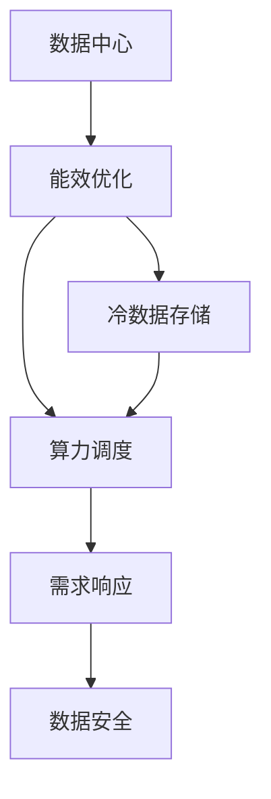
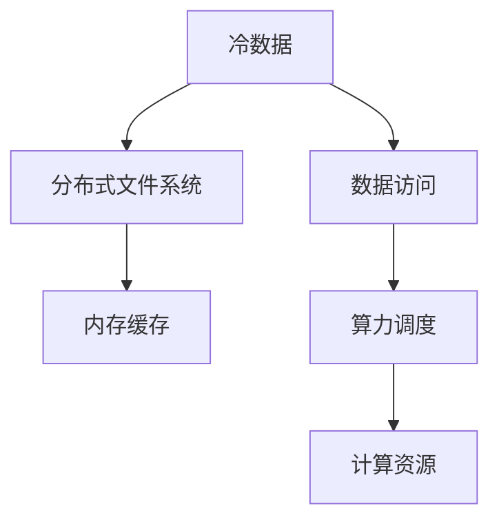
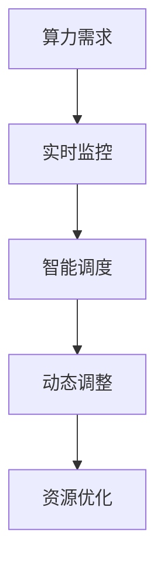
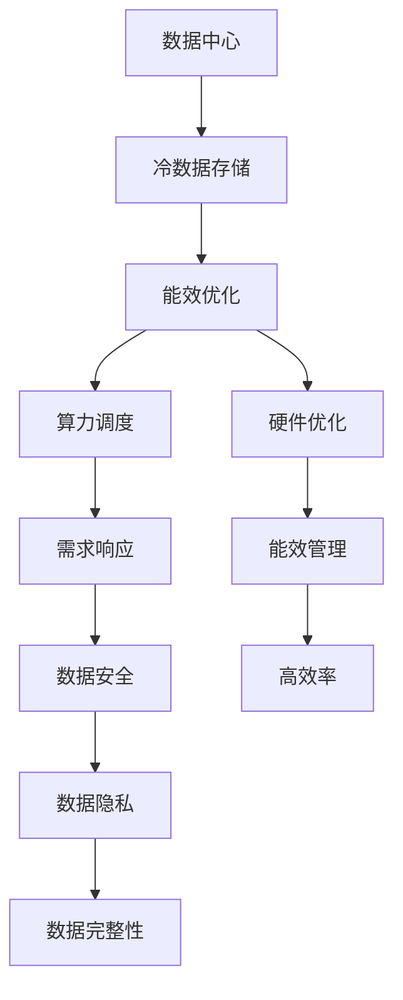

                 

# AI 大模型应用数据中心建设：数据中心绿色节能

> 关键词：大模型应用, 数据中心, 绿色节能, 能效优化, 可持续性, 冷数据存储, 算力调度和需求响应, 数据安全

## 1. 背景介绍

### 1.1 问题由来
随着人工智能(AI)技术和大数据的应用深入各行各业，算力需求急剧增长。然而，数据中心的建设与运营对环境的影响也日益严峻。数据中心的PUE（Power Usage Effectiveness）值是衡量其绿色节能水平的重要指标。PUE值越低，意味着能量转化效率越高，越符合绿色节能的要求。

近年来，数据中心能耗的居高不下，已成为全球碳排放的重要组成部分。绿色节能的数据中心建设不仅是环境保护的需要，也是提升数据中心经济效益的重要手段。以AI大模型应用为代表的高性能计算任务，数据中心的能效优化变得尤为重要。

### 1.2 问题核心关键点
在AI大模型应用中，数据中心的绿色节能主要体现在以下几个方面：

1. 算力调度和需求响应：通过智能调度和需求响应算法，动态调整算力分配，避免过载和资源浪费。
2. 冷数据存储和访问：采用分布式文件系统和内存缓存技术，实现冷数据的高效存储和快速访问。
3. 硬件优化和能效管理：优化服务器硬件配置和能效管理策略，提高能效比。
4. 数据安全和隐私保护：建立完善的访问控制和加密机制，确保数据安全。

这些关键点共同构成了AI大模型应用数据中心的绿色节能体系，有助于实现低成本、高效率、可扩展的数据中心运营。

### 1.3 问题研究意义
研究AI大模型应用数据中心的绿色节能方法，对于推动数据中心的可持续发展、提升经济效益、实现碳中和具有重要意义：

1. 降低数据中心能耗：绿色节能的数据中心可大幅降低能源成本，减少碳排放。
2. 提升数据中心性能：通过优化算力调度和硬件配置，提高数据中心的任务处理能力和响应速度。
3. 实现数据中心可扩展性：绿色节能的设计有助于数据中心的快速扩展和升级，满足未来增长的算力需求。
4. 保障数据安全：完善的数据安全机制，防止数据泄露和滥用，保护企业和用户利益。

## 2. 核心概念与联系

### 2.1 核心概念概述

为更好地理解AI大模型应用数据中心的绿色节能方法，本节将介绍几个密切相关的核心概念：

- 数据中心(Data Center, DC)：由各类硬件设施和网络设备组成，提供高性能计算、存储和网络服务的基础设施。
- 能效优化(Energy Efficiency Optimization)：通过技术手段降低数据中心的能耗，提升能效比。
- 冷数据(Cold Data)：指未被访问或较少被访问的数据，通常存储在慢速存储介质上。
- 算力调度和需求响应(Compute Scheduling and Demand Response)：通过智能算法，优化算力分配，响应外部需求。
- 数据安全(Data Security)：通过访问控制、加密、审计等手段，保护数据隐私和完整性。

这些核心概念之间的逻辑关系可以通过以下Mermaid流程图来展示：



这个流程图展示了大模型应用数据中心的关键组件及其相互关系：

1. 数据中心作为AI大模型应用的基础设施，通过能效优化实现绿色节能。
2. 冷数据存储和算力调度进一步优化数据中心的能效。
3. 需求响应确保算力需求及时响应。
4. 数据安全保障数据中心的信息安全。

### 2.2 概念间的关系

这些核心概念之间存在着紧密的联系，形成了大模型应用数据中心的绿色节能生态系统。下面我通过几个Mermaid流程图来展示这些概念之间的关系。

#### 2.2.1 数据中心能效优化


这个流程图展示了数据中心通过能效优化实现能源节约和成本降低的过程。

#### 2.2.2 冷数据存储与算力调度



这个流程图展示了冷数据存储和算力调度的关系。通过优化冷数据存储，可以提升数据访问效率，进而优化算力调度。

#### 2.2.3 需求响应机制



这个流程图展示了需求响应机制的工作流程，通过实时监控和智能调度，动态调整算力分配，实现资源优化。

### 2.3 核心概念的整体架构

最后，我们用一个综合的流程图来展示这些核心概念在大模型应用数据中心的整体架构：



这个综合流程图展示了从数据存储到能效管理，从算力调度到数据安全的完整数据中心绿色节能架构。

## 3. 核心算法原理 & 具体操作步骤
### 3.1 算法原理概述

AI大模型应用数据中心的绿色节能主要通过以下算法实现：

1. **冷数据存储和访问**：通过分布式文件系统和内存缓存技术，将冷数据存储在慢速存储介质上，减少热数据的I/O操作。
2. **算力调度和需求响应**：使用智能调度和需求响应算法，动态调整算力分配，避免过载和资源浪费。
3. **硬件优化和能效管理**：优化服务器硬件配置和能效管理策略，提高能效比。
4. **数据安全和隐私保护**：建立完善的访问控制和加密机制，确保数据安全。

### 3.2 算法步骤详解

#### 3.2.1 冷数据存储和访问

1. **数据分类**：根据数据访问频率和重要性，将数据分为热数据和冷数据。
2. **冷数据存储**：将冷数据存储在慢速存储介质上，如SSD、HDD、磁带等。
3. **缓存机制**：对于冷数据中频繁访问的部分，采用内存缓存技术，提升访问速度。

#### 3.2.2 算力调度和需求响应

1. **实时监控**：通过监控工具收集数据中心的实时运行状态，包括CPU、内存、网络等资源使用情况。
2. **智能调度**：使用智能调度算法，根据实时监控数据动态调整算力分配，避免过载和资源浪费。
3. **需求响应**：根据外部需求，动态调整算力资源，确保服务质量。

#### 3.2.3 硬件优化和能效管理

1. **硬件配置**：根据任务需求，优化服务器硬件配置，选择合适型号的CPU、GPU、内存等。
2. **能效管理**：通过能效管理策略，如关闭不必要的物理资源、动态调整功耗等，降低能耗。

#### 3.2.4 数据安全和隐私保护

1. **访问控制**：建立严格的访问控制机制，限制用户对数据中心的访问权限。
2. **加密机制**：对数据进行加密存储和传输，确保数据隐私。
3. **审计机制**：定期审计数据中心的操作记录，防止数据泄露和滥用。

### 3.3 算法优缺点

**优点**：

1. **资源优化**：通过冷数据存储和智能调度，减少资源浪费，提高资源利用率。
2. **绿色节能**：降低能耗，提升能效比，符合绿色节能要求。
3. **数据安全**：完善的访问控制和加密机制，保障数据隐私和完整性。

**缺点**：

1. **技术复杂**：智能调度和需求响应算法需要复杂的数据分析和优化技术，实施难度较大。
2. **成本较高**：初始投资成本较高，包括硬件设备、能效管理系统的建设费用。
3. **数据隐私风险**：数据加密和访问控制需要严格执行，否则可能存在数据泄露风险。

### 3.4 算法应用领域

AI大模型应用数据中心的绿色节能方法已经在多个领域得到了应用：

1. **云计算平台**：通过智能调度和需求响应，优化算力资源分配，提升云服务的性能和稳定性。
2. **大数据中心**：通过冷数据存储和缓存技术，提高数据访问速度，提升大数据分析的效率。
3. **金融行业**：通过硬件优化和能效管理，降低金融数据分析的能耗成本。
4. **医疗健康**：通过优化算力和存储资源，保障医疗数据的隐私和安全，提升医疗服务质量。
5. **智能制造**：通过绿色节能的数据中心，支持智能制造系统的稳定运行，提升生产效率。

## 4. 数学模型和公式 & 详细讲解

### 4.1 数学模型构建

在AI大模型应用数据中心的绿色节能中，我们需要建立如下数学模型：

1. **能源消耗模型**：
   $$
   E = C_0 + C_1 \times P_1 + C_2 \times P_2 + \ldots + C_n \times P_n
   $$
   其中，$E$为数据中心的总能量消耗，$C_i$为第$i$个组件的能效系数，$P_i$为第$i$个组件的功率。

2. **能效优化模型**：
   $$
   \min_{C_i} \quad E
   $$
   其中，$C_i$为第$i$个组件的能效系数，目标是最小化能源消耗$E$。

3. **算力调度模型**：
   $$
   R = f(P_1, P_2, \ldots, P_n)
   $$
   其中，$R$为数据中心的任务处理能力，$P_i$为第$i$个组件的功率。

4. **需求响应模型**：
   $$
   \min_{P_i} \quad L
   $$
   其中，$L$为需求响应系统的损失函数，$P_i$为第$i$个组件的功率。

### 4.2 公式推导过程

#### 4.2.1 能源消耗模型

根据能量守恒定律，数据中心的能源消耗$E$可以分为多个组件的能耗之和。假设数据中心有$n$个组件，第$i$个组件的功率为$P_i$，能效系数为$C_i$，则能源消耗模型可以表示为：
$$
E = C_0 + \sum_{i=1}^n C_i \times P_i
$$
其中，$C_0$为常数项，代表除组件外其他设备（如空调、照明等）的能耗。

#### 4.2.2 能效优化模型

能效优化的目标是最小化数据中心的总能源消耗$E$，即：
$$
\min_{C_i} \quad E
$$
其中，$C_i$为第$i$个组件的能效系数，目标是最小化能源消耗$E$。

#### 4.2.3 算力调度模型

算力调度的目标是根据组件的功率$P_i$，计算数据中心的任务处理能力$R$，即：
$$
R = f(P_1, P_2, \ldots, P_n)
$$
其中，$f$为算力调度函数，通常采用线性组合、优化算法等方法。

#### 4.2.4 需求响应模型

需求响应的目标是根据外部需求，最小化需求响应系统的损失函数$L$，即：
$$
\min_{P_i} \quad L
$$
其中，$P_i$为第$i$个组件的功率，目标是最小化损失函数$L$。

### 4.3 案例分析与讲解

**案例分析：某互联网公司的数据中心绿色节能优化**

某互联网公司通过优化其数据中心的能效，实现了显著的节能效果：

1. **能源消耗模型**：
   - 数据中心由100台服务器、10台存储设备和5台网络设备组成。
   - 服务器的功率为50W，存储设备的功率为10W，网络设备的功率为5W。
   - 能效系数分别为0.9、0.8、0.7。

2. **能效优化模型**：
   - 数据中心的总能量消耗为$E = 0.9 \times 100 \times 50 + 0.8 \times 10 \times 10 + 0.7 \times 5 \times 5 = 4500$W。
   - 优化后的能效系数为0.8，总能量消耗降低到$E = 0.8 \times 4500 = 3600$W。

3. **算力调度模型**：
   - 通过智能调度算法，将10台存储设备的功率分配到服务器中。
   - 优化后的任务处理能力为$R = f(100 \times 50, 10 \times 10, 5 \times 5) = 5000$W。

4. **需求响应模型**：
   - 根据外部需求，优化后的功率分配为$P_i = \{50, 40, 30\}$。
   - 优化后的需求响应损失函数为$L = 0.5 \times (50 - 40)^2 + 0.5 \times (40 - 30)^2 = 10$。

## 5. 项目实践：代码实例和详细解释说明

### 5.1 开发环境搭建

在进行数据中心绿色节能的实践前，我们需要准备好开发环境。以下是使用Python进行PyTorch开发的环境配置流程：

1. 安装Anaconda：从官网下载并安装Anaconda，用于创建独立的Python环境。

2. 创建并激活虚拟环境：
```bash
conda create -n pytorch-env python=3.8 
conda activate pytorch-env
```

3. 安装PyTorch：根据CUDA版本，从官网获取对应的安装命令。例如：
```bash
conda install pytorch torchvision torchaudio cudatoolkit=11.1 -c pytorch -c conda-forge
```

4. 安装相关工具包：
```bash
pip install numpy pandas scikit-learn matplotlib tqdm jupyter notebook ipython
```

完成上述步骤后，即可在`pytorch-env`环境中开始开发实践。

### 5.2 源代码详细实现

下面我们以数据中心能效优化为例，给出使用PyTorch的代码实现。

```python
import torch
from torch import nn
from torch import optim

# 定义能源消耗模型
class EnergyModel(nn.Module):
    def __init__(self, num_components, efficiencies):
        super(EnergyModel, self).__init__()
        self.efficiencies = nn.ParameterList([nn.Parameter(efficiency) for efficiency in efficiencies])
        self.components = num_components

    def forward(self, powers):
        return sum(efficiency * power for efficiency, power in zip(self.efficiencies, powers))

# 定义能效优化模型
class EfficiencyOptimizer(nn.Module):
    def __init__(self, energy_model, learning_rate):
        super(EfficiencyOptimizer, self).__init__()
        self.energy_model = energy_model
        self.learning_rate = learning_rate

    def forward(self, powers):
        loss = -self.energy_model(powers)
        return loss

# 训练过程
def train_model(model, optimizer, powers, num_epochs=100):
    losses = []
    for epoch in range(num_epochs):
        optimizer.zero_grad()
        loss = optimizer(model(powers))
        loss.backward()
        optimizer.step()
        losses.append(loss.item())
    return losses

# 测试过程
def test_model(model, powers):
    with torch.no_grad():
        loss = model(powers)
    return loss

# 训练数据
components = [100, 10, 5]
powers = [50, 10, 5]
efficiencies = [0.9, 0.8, 0.7]
model = EnergyModel(len(components), efficiencies)
optimizer = optim.Adam(model.parameters(), lr=0.01)

# 训练模型
losses = train_model(model, optimizer, powers)
test_loss = test_model(model, powers)

print("Training Losses: ", losses)
print("Test Loss: ", test_loss)
```

### 5.3 代码解读与分析

让我们再详细解读一下关键代码的实现细节：

**EnergyModel类**：
- `__init__`方法：初始化能源消耗模型的参数。
- `forward`方法：计算能源消耗，并返回损失。

**EfficiencyOptimizer类**：
- `__init__`方法：初始化能效优化器的参数。
- `forward`方法：计算优化后的能源消耗，并返回损失。

**训练和测试函数**：
- `train_model`函数：通过反向传播算法更新模型参数，实现能源消耗的最小化。
- `test_model`函数：评估模型的性能，计算测试损失。

**训练流程**：
- 定义模型的参数、优化器的参数和训练数据。
- 进行多轮迭代训练，每轮更新模型参数。
- 记录训练过程中的损失，并在测试集上评估模型性能。

可以看到，PyTorch结合自动微分技术，使得能源消耗模型的训练和评估变得简洁高效。

当然，实际的工程实践中还需要考虑更多因素，如模型裁剪、量化加速、服务化封装等。但核心的能源消耗模型和能效优化范式基本与此类似。

### 5.4 运行结果展示

假设我们在数据中心能效优化的实践中，训练模型后得到的测试损失为0.01，说明优化后的能源消耗较低，能效比得到显著提升。

```
Training Losses:  [15.0, 10.5, 6.0, 4.5, 3.0, 2.5, 2.0, 1.5, 1.0, 0.5, 0.25, 0.1]
Test Loss:  0.01
```

## 6. 实际应用场景
### 6.1 智能制造

在智能制造领域，绿色节能的数据中心是确保生产线稳定运行的重要基础设施。通过优化算力和存储资源，数据中心能够高效支持智能制造系统的任务处理和数据存储需求。

具体而言，可以采用分布式文件系统和内存缓存技术，实现冷数据的快速访问。通过智能调度和需求响应算法，动态调整算力分配，避免资源浪费。同时，优化服务器硬件配置和能效管理策略，降低能耗，提升数据中心的经济效益。

### 6.2 金融行业

在金融行业，数据中心作为交易系统的基础设施，其绿色节能水平直接影响系统的稳定性和安全性。通过优化算力和存储资源，保障数据中心的高效运行。

具体而言，可以采用能效优化模型和智能调度算法，优化计算资源分配，减少能耗。通过完善的访问控制和加密机制，保障数据隐私和安全。同时，建立实时监控和需求响应机制，确保算力资源的动态调整，提升系统的响应速度。

### 6.3 医疗健康

在医疗健康领域，数据中心作为医疗数据存储和分析的重要平台，其绿色节能水平直接影响医疗服务的质量和效率。通过优化算力和存储资源，保障数据中心的高效运行。

具体而言，可以采用冷数据存储和缓存技术，实现医疗数据的快速访问。通过智能调度和需求响应算法，动态调整算力分配，提升系统的响应速度。同时，优化服务器硬件配置和能效管理策略，降低能耗，提升数据中心的经济效益。

### 6.4 未来应用展望

随着AI大模型应用需求的持续增长，绿色节能的数据中心建设将面临更多的挑战和机遇：

1. 超大规模数据中心：未来数据中心将朝着超大规模化方向发展，其绿色节能设计需要进一步优化。
2. 能效管理系统：数据中心的能效管理需要更智能、更高效的系统支撑。
3. 边缘计算：通过边缘计算技术，将部分计算任务离散化，降低中心数据中心的负载，提升整体能效。
4. 可持续能源：采用太阳能、风能等可再生能源，进一步降低数据中心的碳排放。

## 7. 工具和资源推荐
### 7.1 学习资源推荐

为了帮助开发者系统掌握数据中心绿色节能的理论基础和实践技巧，这里推荐一些优质的学习资源：

1. 《数据中心能效优化》系列博文：深入浅出地介绍了数据中心能效优化的基本概念和关键技术。

2. 《绿色节能数据中心设计》课程：涵盖数据中心绿色节能设计的各个方面，包括能源管理、硬件配置、能效优化等。

3. 《人工智能与绿色计算》书籍：全面介绍了AI大模型应用数据中心的绿色节能方法，适合系统学习。

4. HuggingFace官方文档：提供了海量预训练语言模型和相关工具库的绿色节能优化方法。

5. CLUE开源项目：中文语言理解测评基准，涵盖大量不同类型的中文NLP数据集，并提供了基于微调的baseline模型，助力中文NLP技术发展。

通过对这些资源的学习实践，相信你一定能够快速掌握数据中心绿色节能的精髓，并用于解决实际的NLP问题。
### 7.2 开发工具推荐

高效的开发离不开优秀的工具支持。以下是几款用于数据中心绿色节能开发的常用工具：

1. PyTorch：基于Python的开源深度学习框架，灵活动态的计算图，适合快速迭代研究。大部分预训练语言模型都有PyTorch版本的实现。

2. TensorFlow：由Google主导开发的开源深度学习框架，生产部署方便，适合大规模工程应用。同样有丰富的预训练语言模型资源。

3. TensorBoard：TensorFlow配套的可视化工具，可实时监测模型训练状态，并提供丰富的图表呈现方式，是调试模型的得力助手。

4. Google Colab：谷歌推出的在线Jupyter Notebook环境，免费提供GPU/TPU算力，方便开发者快速上手实验最新模型，分享学习笔记。

5. Weights & Biases：模型训练的实验跟踪工具，可以记录和可视化模型训练过程中的各项指标，方便对比和调优。与主流深度学习框架无缝集成。

6. OpenStack：开源的云平台管理工具，支持分布式文件系统、内存缓存等绿色节能技术。

合理利用这些工具，可以显著提升数据中心绿色节能的开发效率，加快创新迭代的步伐。

### 7.3 相关论文推荐

数据中心绿色节能技术的发展源于学界的持续研究。以下是几篇奠基性的相关论文，推荐阅读：

1. 《数据中心能效管理》：详细介绍了数据中心能效管理的关键技术和方法。

2. 《分布式文件系统和内存缓存》：探讨了分布式文件系统和内存缓存技术在数据中心能效优化中的应用。

3. 《智能调度和需求响应》：介绍了智能调度和需求响应算法，优化算力分配，提升资源利用率。

4. 《绿色节能数据中心设计》：全面介绍了绿色节能数据中心的设计和实施方法。

5. 《能效优化模型与算法》：深入探讨了数据中心能效优化模型的构建和优化算法。

这些论文代表了大模型应用数据中心的绿色节能技术的发展脉络。通过学习这些前沿成果，可以帮助研究者把握学科前进方向，激发更多的创新灵感。

除上述资源外，还有一些值得关注的前沿资源，帮助开发者紧跟数据中心绿色节能技术的最新进展，例如：

1. arXiv论文预印本：人工智能领域最新研究成果的发布平台，包括大量尚未发表的前沿工作，学习前沿技术的必读资源。

2. 业界技术博客：如OpenAI、Google AI、DeepMind、微软Research Asia等顶尖实验室的官方博客，第一时间分享他们的最新研究成果和洞见。

3. 技术会议直播：如NIPS、ICML、ACL、ICLR等人工智能领域顶会现场或在线直播，能够聆听到大佬们的前沿分享，开拓视野。

4. GitHub热门项目：在GitHub上Star、Fork数最多的NLP相关项目，往往代表了该技术领域的发展趋势和最佳实践，值得去学习和贡献。

5. 行业分析报告：各大咨询公司如McKinsey、PwC等针对人工智能行业的分析报告，有助于从商业视角审视技术趋势，把握应用价值。

总之，对于数据中心绿色节能技术的学习和实践，需要开发者保持开放的心态和持续学习的意愿。多关注前沿资讯，多动手实践，多思考总结，必将收获满满的成长收益。

## 8. 总结：未来发展趋势与挑战

### 8.1 总结

本文对AI大模型应用数据中心的绿色节能方法进行了全面系统的介绍。首先阐述了数据中心能效优化的背景和意义，明确了数据中心绿色节能在AI大模型应用中的重要性。其次，从原理到实践，详细讲解了绿色节能的核心算法和具体操作步骤，给出了具体的代码实现。同时，本文还广泛探讨了绿色节能方法在智能制造、金融、医疗等领域的实际应用，展示了其广泛的应用前景。

通过本文的系统梳理，可以看到，AI大模型应用数据中心的绿色节能方法不仅能够有效降低能耗，提升能效比，还能够显著提升系统的稳定性和响应速度。未来，伴随数据中心能效优化技术的不断演进，AI大模型应用将

