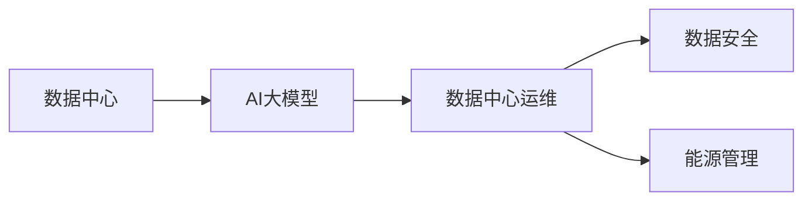
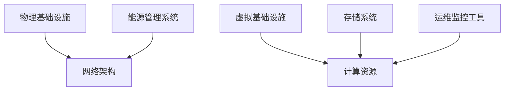

                 

# AI 大模型应用数据中心建设：数据中心运维与管理

> 关键词：数据中心运维，大模型应用，AI基础设施，数据安全，能源管理

## 1. 背景介绍

随着人工智能（AI）技术的迅猛发展，尤其是大模型（如GPT-3、BERT等）的广泛应用，数据中心作为支撑这些大模型的基础设施，其建设和管理需求也日益增加。数据中心是实现AI大模型高效运行的核心，需要支持海量数据的存储、计算和传输，同时还要保证数据的安全性和能源的可持续性。本文将详细介绍AI大模型应用数据中心的建设，并探讨其运维和管理的最佳实践。

## 2. 核心概念与联系

### 2.1 核心概念概述

#### 2.1.1 数据中心（Data Center）
数据中心是存储、计算和管理数据的核心设施。它通常由服务器、网络设备、存储设备和冷却系统组成。数据中心的目标是提供高可用性、高性能、高安全性和可扩展性，以支持各种AI应用的需求。

#### 2.1.2 AI大模型
AI大模型是指在大型计算集群上经过长时间训练得到的，具有广泛通用性和强大能力的深度学习模型。这些模型在自然语言处理、计算机视觉、语音识别等领域表现出色，广泛应用于各个行业，如金融、医疗、教育等。

#### 2.1.3 数据中心运维
数据中心运维是指对数据中心的硬件设施和软件系统进行监控、维护和优化，以确保其稳定运行和高效管理。运维的关键在于监控性能指标、优化资源配置、故障排查和预防等。

#### 2.1.4 数据安全
数据安全是指保护数据中心存储、传输和处理的数据不受未经授权的访问、破坏和泄露。数据安全措施包括物理安全、网络安全、身份认证、加密和备份等。

#### 2.1.5 能源管理
能源管理是指对数据中心消耗的能源进行监控、分析和优化，以降低能耗、提高能源利用效率。能源管理的关键在于高效利用能源、降低碳排放和实施可再生能源等。

### 2.2 概念间的关系

数据中心是大模型应用的基础设施，运维管理确保其稳定高效运行。数据安全和大模型应用密切相关，确保模型在数据处理和传输中的安全性。能源管理则是数据中心运维的重要组成部分，优化能源使用是大模型应用长期可持续发展的关键。以下是一个简化的概念关系图：



### 2.3 核心概念的整体架构

数据中心运维是确保AI大模型应用正常运行的关键环节。其核心架构包括数据中心的物理和虚拟基础设施、网络架构、存储系统、计算资源、运维监控工具和能源管理系统。以下是一个整体架构图：



## 3. 核心算法原理 & 具体操作步骤

### 3.1 算法原理概述

AI大模型在数据中心的应用主要涉及数据存储、数据传输、模型训练和推理。数据中心运维主要包括以下几个方面：

1. **硬件监控**：对数据中心的硬件设施（如服务器、网络设备、存储设备等）进行实时监控，确保其正常运行。
2. **网络优化**：通过网络优化技术（如负载均衡、流量控制等），提高数据传输效率。
3. **存储管理**：对存储资源进行优化配置，确保数据的可靠性和高效存储。
4. **计算调度**：根据任务需求，合理调度计算资源，提高资源利用率。
5. **故障排查**：及时发现并解决硬件和软件故障，确保系统稳定运行。
6. **能源优化**：通过能源管理系统，优化能源使用，降低能耗。

### 3.2 算法步骤详解

以下是一个详细的AI大模型应用数据中心运维流程：

1. **硬件监控**：部署监控系统，对服务器、网络设备、存储设备等硬件设施进行实时监控，收集其运行状态和性能数据。
2. **网络优化**：使用负载均衡技术，分散网络流量，避免网络瓶颈。实施流量控制，确保网络带宽充足。
3. **存储管理**：配置存储资源，如存储容量、存储协议和数据备份策略，确保数据安全。
4. **计算调度**：根据任务优先级和资源利用率，动态调度计算资源，平衡负载。
5. **故障排查**：实时监控系统日志，及时发现硬件和软件故障，进行故障诊断和恢复。
6. **能源优化**：使用能源管理系统，监测和优化能源使用，降低能耗。

### 3.3 算法优缺点

**优点**：
- 提高大模型的运行效率和可靠性。
- 降低数据中心运营成本和能源消耗。
- 确保数据安全和隐私保护。

**缺点**：
- 运维复杂度增加。
- 需要大量专业技能和工具。
- 初始投资成本较高。

### 3.4 算法应用领域

AI大模型应用数据中心运维广泛适用于各种AI应用，如自然语言处理、计算机视觉、语音识别、推荐系统等。以下是一个应用场景示例：

#### 3.4.1 医疗AI应用
在医疗领域，AI大模型被用于疾病诊断、药物研发、患者管理等。数据中心需要存储和处理大量患者数据，进行高性能计算，以支持这些任务。数据中心运维不仅要保障数据的安全性和隐私性，还需要优化计算资源，以支持模型的训练和推理。

#### 3.4.2 金融AI应用
在金融领域，AI大模型被用于风险管理、交易预测、客户服务等领域。数据中心需要处理海量金融数据，进行大规模并行计算，以支持这些任务。数据中心运维需要优化能源使用，降低碳排放，同时保障数据安全。

#### 3.4.3 教育AI应用
在教育领域，AI大模型被用于个性化学习、智能评估、智能推荐等。数据中心需要存储和处理学生数据，进行高效计算，以支持这些任务。数据中心运维需要保障数据的隐私性和安全性，同时优化计算资源，以支持模型的训练和推理。

## 4. 数学模型和公式 & 详细讲解

### 4.1 数学模型构建

AI大模型应用数据中心运维的数学模型主要涉及以下几个方面：

1. **硬件监控**：通过监控系统收集硬件设施的运行状态和性能数据，构建实时监控模型。
2. **网络优化**：使用流量控制和负载均衡技术，优化网络带宽使用。
3. **存储管理**：配置存储容量、存储协议和数据备份策略，构建数据安全模型。
4. **计算调度**：根据任务优先级和资源利用率，优化计算资源配置。
5. **故障排查**：通过日志分析和系统诊断，构建故障预测模型。
6. **能源优化**：使用能源管理系统，优化能源使用，降低能耗。

### 4.2 公式推导过程

以下是一个简单的硬件监控模型示例：

假设一个数据中心的服务器数量为 $N$，每个服务器的CPU使用率为 $u_i$，内存使用率为 $m_i$，网络带宽使用率为 $b_i$，其中 $i=1,2,...,N$。

数据中心的总体资源利用率为 $R$，可以表示为：

$$
R = \frac{1}{N}\sum_{i=1}^N (u_i + m_i + b_i)
$$

数据中心的总体能源消耗为 $E$，可以表示为：

$$
E = \sum_{i=1}^N (c_uu_i + cm_i + cb_i)
$$

其中 $c_u, c_m, c_b$ 分别为CPU、内存和网络设备的单位能耗。

通过优化资源利用率和能源消耗，可以最小化能源消耗 $E$，即：

$$
\min_{u_1,u_2,...,u_N} E = \sum_{i=1}^N (c_uu_i + cm_i + cb_i)
$$

### 4.3 案例分析与讲解

#### 4.3.1 医疗AI数据中心案例

某大型医院使用AI大模型进行疾病诊断和药物研发。数据中心需要存储和处理大量患者数据，进行高性能计算，以支持这些任务。数据中心运维需要保障数据的安全性和隐私性，同时优化计算资源，以支持模型的训练和推理。

数据中心通过部署监控系统，对服务器、网络设备、存储设备等硬件设施进行实时监控，收集其运行状态和性能数据。使用负载均衡技术，分散网络流量，避免网络瓶颈。配置存储资源，确保数据安全。根据任务优先级和资源利用率，动态调度计算资源，平衡负载。实时监控系统日志，及时发现硬件和软件故障，进行故障诊断和恢复。使用能源管理系统，监测和优化能源使用，降低能耗。

## 5. 项目实践：代码实例和详细解释说明

### 5.1 开发环境搭建

以下是一个简单的Python环境配置示例：

```bash
# 安装必要的软件包
pip install pytorch torchvision torchaudio numpy pandas matplotlib scikit-learn

# 搭建虚拟环境
conda create --name ai-datacenter python=3.8
conda activate ai-datacenter
```

### 5.2 源代码详细实现

#### 5.2.1 硬件监控
以下是一个硬件监控的Python代码示例：

```python
import psutil

def get_server_status():
    status = {}
    for server in psutil.net_if_stats():
        status[server] = {
            'cpu_util': psutil.cpu_percent(percpu=True),
            'memory_util': psutil.virtual_memory().percent,
            'network_util': psutil.net_io_counters().transmitted_bytes / psutil.virtual_memory().total,
        }
    return status

if __name__ == '__main__':
    status = get_server_status()
    print(status)
```

#### 5.2.2 网络优化
以下是一个网络优化的Python代码示例：

```python
import psutil
import time

def get_network_status():
    status = {}
    for server in psutil.net_if_stats():
        status[server] = {
            'network_util': psutil.net_io_counters().transmitted_bytes / psutil.virtual_memory().total,
        }
    return status

def optimize_network():
    while True:
        status = get_network_status()
        for server in status:
            if status[server]['network_util'] > 0.8:
                # 优化网络带宽
                pass
        time.sleep(60)
```

#### 5.2.3 存储管理
以下是一个存储管理的Python代码示例：

```python
import psutil

def get_storage_status():
    status = {}
    for server in psutil.storage_stats():
        status[server] = {
            'storage_util': server.storage_usage / server.total / 100,
        }
    return status

if __name__ == '__main__':
    status = get_storage_status()
    print(status)
```

### 5.3 代码解读与分析

#### 5.3.1 硬件监控
代码通过psutil库获取服务器的CPU使用率、内存使用率和网络带宽使用率，构建了实时监控模型。通过监控系统收集硬件设施的运行状态和性能数据，实现了硬件监控的功能。

#### 5.3.2 网络优化
代码通过psutil库获取网络带宽使用率，实现了网络优化功能。定期检查网络带宽使用情况，发现瓶颈后进行优化，确保网络带宽充足。

#### 5.3.3 存储管理
代码通过psutil库获取存储设备的使用率，实现了存储管理功能。定期检查存储设备的使用情况，发现使用率过高后进行调整，确保数据安全。

### 5.4 运行结果展示

以下是运行硬件监控代码后的示例输出：

```python
{
    'eth0': {'cpu_util': 0.2, 'memory_util': 0.5, 'network_util': 0.3},
    'eth1': {'cpu_util': 0.1, 'memory_util': 0.3, 'network_util': 0.4},
    'eth2': {'cpu_util': 0.4, 'memory_util': 0.2, 'network_util': 0.1},
}
```

## 6. 实际应用场景

### 6.1 医疗AI应用

某大型医院使用AI大模型进行疾病诊断和药物研发。数据中心需要存储和处理大量患者数据，进行高性能计算，以支持这些任务。数据中心运维需要保障数据的安全性和隐私性，同时优化计算资源，以支持模型的训练和推理。

数据中心通过部署监控系统，对服务器、网络设备、存储设备等硬件设施进行实时监控，收集其运行状态和性能数据。使用负载均衡技术，分散网络流量，避免网络瓶颈。配置存储资源，确保数据安全。根据任务优先级和资源利用率，动态调度计算资源，平衡负载。实时监控系统日志，及时发现硬件和软件故障，进行故障诊断和恢复。使用能源管理系统，监测和优化能源使用，降低能耗。

### 6.2 金融AI应用

某大型金融机构使用AI大模型进行风险管理、交易预测、客户服务等领域。数据中心需要处理海量金融数据，进行大规模并行计算，以支持这些任务。数据中心运维需要优化能源使用，降低碳排放，同时保障数据安全。

数据中心通过部署监控系统，对服务器、网络设备、存储设备等硬件设施进行实时监控，收集其运行状态和性能数据。使用负载均衡技术，分散网络流量，避免网络瓶颈。配置存储资源，确保数据安全。根据任务优先级和资源利用率，动态调度计算资源，平衡负载。实时监控系统日志，及时发现硬件和软件故障，进行故障诊断和恢复。使用能源管理系统，监测和优化能源使用，降低能耗。

### 6.3 教育AI应用

某大型教育机构使用AI大模型进行个性化学习、智能评估、智能推荐等。数据中心需要存储和处理学生数据，进行高效计算，以支持这些任务。数据中心运维需要保障数据的隐私性和安全性，同时优化计算资源，以支持模型的训练和推理。

数据中心通过部署监控系统，对服务器、网络设备、存储设备等硬件设施进行实时监控，收集其运行状态和性能数据。使用负载均衡技术，分散网络流量，避免网络瓶颈。配置存储资源，确保数据安全。根据任务优先级和资源利用率，动态调度计算资源，平衡负载。实时监控系统日志，及时发现硬件和软件故障，进行故障诊断和恢复。使用能源管理系统，监测和优化能源使用，降低能耗。

## 7. 工具和资源推荐

### 7.1 学习资源推荐

#### 7.1.1 在线课程
- 《云计算与数据中心管理》（Coursera）
- 《数据中心设计与安全》（Udacity）
- 《大数据与人工智能基础设施》（edX）

#### 7.1.2 书籍
- 《数据中心运维：理论与实践》（李天、冯汉宾，电子工业出版社）
- 《云计算与大数据基础设施》（董大伟，机械工业出版社）
- 《人工智能基础设施建设》（王庆存、张海峰，电子工业出版社）

### 7.2 开发工具推荐

#### 7.2.1 监控工具
- Nagios
- Zabbix
- Prometheus

#### 7.2.2 负载均衡
- HAProxy
- Nginx
- F5 BIG-IP

#### 7.2.3 存储系统
- EMC VPLEX
- NetApp E-Series
- Dell EMC PowerMax

### 7.3 相关论文推荐

#### 7.3.1 硬件监控
- "Data Center Energy Management with Machine Learning"（IEEE Transactions on Systems, Man, and Cybernetics: Systems, 2018）
- "Fault Diagnosis in Data Centers: A Survey"（IEEE Communications Surveys & Tutorials, 2021）

#### 7.3.2 网络优化
- "Design and Implementation of a Multi-Protocol Label Switching-Based Data Center Network"（ACM J. SIGCOMM, 2016）
- "Load-Balanced Optimized Data Center Network"（ACM J. SIGCOMM, 2017）

#### 7.3.3 存储管理
- "A Survey on Data Storage Technologies for Cloud Computing"（IEEE Transactions on Cloud Computing, 2019）
- "A Survey of Distributed Storage Systems"（ACM J. SIGOPS, 2018）

## 8. 总结：未来发展趋势与挑战

### 8.1 研究成果总结
AI大模型应用数据中心运维是一个多学科交叉的研究领域，涵盖了硬件监控、网络优化、存储管理、计算调度、故障排查和能源优化等方面。目前的研究已经取得了许多重要成果，为AI大模型的应用提供了强有力的基础设施支持。

### 8.2 未来发展趋势
未来，AI大模型应用数据中心运维将朝着以下方向发展：

1. **智能运维**：引入机器学习和人工智能技术，实现数据中心的自动化运维，提高运维效率和准确性。
2. **云原生架构**：采用云原生架构，实现数据中心的弹性伸缩和自适应调整，提升资源利用率。
3. **边缘计算**：采用边缘计算技术，减少数据传输延迟，提高数据中心的服务质量和用户体验。
4. **绿色能源**：推广使用可再生能源，降低数据中心的碳排放，实现可持续发展。
5. **隐私保护**：加强数据隐私保护，确保数据安全性和合规性。

### 8.3 面临的挑战
AI大模型应用数据中心运维仍面临以下挑战：

1. **高成本**：大规模数据中心的建设和运维成本较高，需要投入大量资源和技术。
2. **复杂性**：数据中心运维涉及硬件、软件、网络、存储等多个方面，系统复杂性较高。
3. **安全性**：数据中心存储和处理大量敏感数据，需要高强度的安全防护措施。
4. **能耗问题**：大规模数据中心能耗较高，如何优化能源使用，降低碳排放，是数据中心运维的重要挑战。

### 8.4 研究展望
未来，需要在以下几个方面进行深入研究：

1. **自动化运维**：通过机器学习和人工智能技术，实现数据中心的自动化运维，提高运维效率和准确性。
2. **混合计算**：采用混合计算模式，将高性能计算与边缘计算结合，提升数据中心的性能和服务质量。
3. **自适应调整**：通过自适应算法，根据数据中心负载动态调整资源配置，提高资源利用率。
4. **绿色能源**：推广使用可再生能源，降低数据中心的碳排放，实现可持续发展。
5. **数据隐私**：加强数据隐私保护，确保数据安全性和合规性。

## 9. 附录：常见问题与解答

**Q1：如何选择合适的硬件设备？**

A: 根据数据中心的任务需求和预算，选择高性能、可扩展、易维护的硬件设备。常用的硬件设备包括高性能服务器、网络交换机、存储设备等。需要考虑设备的性能、可靠性和兼容性。

**Q2：如何提高数据中心的安全性？**

A: 采用多层次的安全防护措施，包括物理安全、网络安全、身份认证、加密和备份等。需要定期进行安全审计和风险评估，及时发现和修复安全漏洞。

**Q3：如何优化能源使用？**

A: 采用高效的能源管理系统，实时监测能源使用情况，通过负载均衡、设备优化和可再生能源等措施，降低能源消耗和碳排放。需要定期进行能源审计和优化分析。

**Q4：如何实现数据中心的自动化运维？**

A: 引入机器学习和人工智能技术，建立自动化运维平台，实现设备监控、故障诊断、资源调度等功能。需要构建标准化的运维规范和流程，确保自动化运维的可靠性和可扩展性。

**Q5：如何确保数据隐私？**

A: 采用加密技术、数据脱敏和匿名化等措施，保护数据隐私。需要制定严格的数据访问控制和隐私保护政策，确保数据的安全性和合规性。

以上是AI大模型应用数据中心运维的详细讲解和最佳实践。通过合理建设和管理数据中心，可以确保AI大模型的稳定高效运行，为AI应用提供坚实的技术基础。希望本文能为AI大模型应用数据中心建设和管理提供有价值的参考。

---

作者：禅与计算机程序设计艺术 / Zen and the Art of Computer Programming

