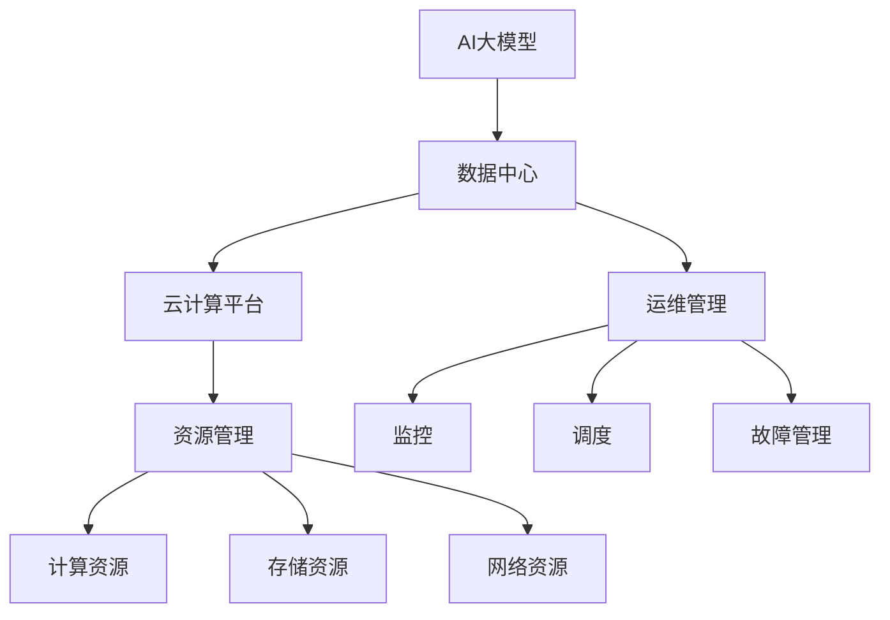

                 

# AI 大模型应用数据中心建设：数据中心运营与管理

> 关键词：大模型, 数据中心, 运维管理, 人工智能, 云计算, 资源管理

## 1. 背景介绍

### 1.1 问题由来

随着人工智能（AI）技术的发展，大模型（如GPT-3, T5等）在自然语言处理（NLP）、计算机视觉（CV）、推荐系统等众多领域展现出了强大的能力。但大模型训练和推理过程中所需的巨量数据和计算资源，成为了制约其进一步应用的重要瓶颈。

如何在有限的资源条件下，高效构建和维护AI大模型的数据中心（Data Center），是当前AI应用的重要课题。本文聚焦于大模型应用的数据中心建设，介绍其核心概念、原理和具体操作步骤，以期为大模型应用的运营管理提供指导。

### 1.2 问题核心关键点

大模型数据中心建设的核心在于：

1. **资源调度**：有效管理算力、存储、网络等基础设施资源，确保数据中心的高效运行。
2. **网络架构**：构建高效稳定的网络环境，支持大模型数据的高效传输和访问。
3. **监控与运维**：实时监控数据中心的运行状态，快速响应故障和异常。
4. **安全与合规**：确保数据中心的安全性和合规性，保护数据隐私和机密信息。

这些问题紧密联系，互为支撑，共同构成了大模型数据中心建设的关键。

### 1.3 问题研究意义

研究大模型数据中心的建设和运营管理，对推动AI技术在各行业的应用具有重要意义：

1. **降低成本**：通过优化资源调度和管理，有效降低大模型应用所需的成本。
2. **提升性能**：通过构建高效网络架构和优化监控运维，提升大模型应用的性能和稳定性。
3. **保障安全**：确保数据中心的安全性，保护用户数据和模型免受攻击和泄漏。
4. **合规性要求**：满足数据隐私和数据保护的相关法律法规，确保AI应用的合规性。
5. **促进产业发展**：为AI技术在各行各业的应用提供坚实的基础设施支持，推动AI产业的快速发展。

## 2. 核心概念与联系

### 2.1 核心概念概述

为更好地理解大模型数据中心的建设，本节将介绍几个关键概念及其之间的联系：

- **AI大模型**：如GPT、BERT、T5等，通过大规模无标签数据预训练和下游任务微调，具备强大的语义理解和生成能力。
- **数据中心（DC）**：用于存储、计算和提供AI大模型的基础设施，由服务器、网络、存储等硬件设备和软件系统组成。
- **运维管理**：通过监控、调度、故障管理等手段，确保数据中心的高效运行。
- **云计算平台**：如AWS、Azure、Google Cloud等，提供可伸缩的云服务，支持大模型的训练和推理。
- **资源管理**：包括计算资源、存储资源、网络资源等的管理，确保资源的有效利用。

这些概念之间的联系通过以下Mermaid流程图展示：



这个流程图展示了AI大模型、数据中心、云计算平台、运维管理、资源管理之间的联系和作用。

### 2.2 概念间的关系

这些核心概念之间存在着紧密的联系，形成了大模型应用数据中心建设的基础架构。下面是一些关键的联系点：

1. **AI大模型与数据中心**：AI大模型需要在大规模数据中心中进行预训练和微调，数据中心为其提供计算、存储和网络资源。
2. **数据中心与云计算平台**：数据中心可以部署在公有云或私有云中，云计算平台提供弹性计算资源支持。
3. **运维管理与资源管理**：运维管理需要动态调整资源管理策略，确保资源的高效利用。
4. **监控与调度**：监控系统实时获取资源使用情况，调度系统根据需求调整资源分配。
5. **故障管理**：故障管理通过监控和告警，快速识别和解决问题，保障系统稳定性。

## 3. 核心算法原理 & 具体操作步骤
### 3.1 算法原理概述

大模型数据中心建设的核心算法包括资源管理、网络管理、监控和故障管理等。其基本原理是：

1. **资源管理**：通过资源池化、负载均衡等策略，动态分配计算、存储资源，满足不同模型的需求。
2. **网络管理**：构建高效的网络架构，确保大模型数据的高效传输和访问。
3. **监控与运维**：实时监控数据中心的运行状态，快速响应故障和异常。
4. **故障管理**：通过告警和自动修复，快速恢复系统正常运行。

这些算法共同作用，确保数据中心的稳定、高效运行。

### 3.2 算法步骤详解

大模型数据中心的建设和运营管理，可以分为以下几个步骤：

**Step 1: 设计数据中心架构**
- 确定数据中心的规模和位置，选择适合的硬件设备和软件系统。
- 设计高效的网络架构，确保大模型数据的快速传输。
- 规划资源管理策略，包括计算资源、存储资源和网络资源的分配。

**Step 2: 部署AI大模型**
- 选择合适的AI大模型，部署在数据中心中。
- 进行模型的预训练和微调，确保模型的高效运行。
- 配置模型的运行环境，包括硬件设备、操作系统、库文件等。

**Step 3: 资源管理和调度**
- 动态调整计算和存储资源，根据模型的需求进行优化。
- 使用负载均衡技术，提高资源的利用率。
- 实现自动化的资源调度，根据任务优先级分配资源。

**Step 4: 网络管理**
- 设计高效的网络架构，包括网络拓扑、路由策略等。
- 配置网络设备，确保大模型数据的快速传输。
- 进行网络监控和优化，保障网络稳定性和性能。

**Step 5: 监控与运维**
- 部署监控系统，实时获取数据中心的运行状态。
- 设置告警规则，及时发现和解决问题。
- 实施故障管理策略，保障系统的稳定运行。

**Step 6: 安全与合规**
- 配置数据中心的安全策略，包括网络安全、物理安全等。
- 确保数据隐私和合规性，遵守相关法律法规。

### 3.3 算法优缺点

大模型数据中心建设的优势在于：

1. **高效资源利用**：通过动态资源管理和调度，最大化资源利用率。
2. **高性能网络架构**：构建高效的网络架构，保障数据传输的稳定性和性能。
3. **实时监控与运维**：通过实时监控和自动化的运维管理，快速响应故障和异常。

但其缺点也较为明显：

1. **高投入**：初期建设数据中心需要较高的资金投入。
2. **复杂性高**：数据中心建设涉及硬件设备、软件系统、网络架构等多个方面，管理复杂。
3. **维护成本高**：需要持续的维护和优化，确保系统的稳定运行。

### 3.4 算法应用领域

大模型数据中心建设广泛应用于以下几个领域：

1. **AI模型训练**：支持大规模AI模型的预训练和微调，优化训练过程，提升模型性能。
2. **AI模型推理**：提供高性能的计算资源和网络环境，支持AI模型的高效推理。
3. **大数据分析**：处理和分析海量数据，支持AI模型在各个应用场景中的数据输入。
4. **云计算服务**：通过云计算平台提供弹性计算资源，支持大模型应用的扩展和优化。
5. **企业应用**：支持企业内部的AI应用，提升企业的数据处理和分析能力。

## 4. 数学模型和公式 & 详细讲解 & 举例说明

### 4.1 数学模型构建

大模型数据中心建设和运营管理的数学模型主要涉及资源管理、网络管理、监控和故障管理等方面。以下是一个简化的资源管理数学模型：

假设数据中心有 $n$ 个计算节点和 $m$ 个存储节点，每个节点的计算能力为 $C$，存储容量为 $S$。设模型 $M_i$ 需要 $C_i$ 的计算能力和 $S_i$ 的存储容量。资源管理的目标是最小化总成本 $C_{total}$，同时满足模型 $M_i$ 的资源需求。

数学模型可以表示为：

$$
\begin{aligned}
&\min C_{total} = \sum_{i=1}^{N}(C_i \times C + S_i \times S) \\
&\text{s.t.} \quad C_i \times C + S_i \times S \leq \max(C_i, S_i) \quad \forall i
\end{aligned}
$$

其中 $N$ 为模型的总数。

### 4.2 公式推导过程

上述数学模型的推导过程如下：

1. 目标函数：最小化总成本 $C_{total}$，包括计算成本和存储成本。
2. 约束条件：每个模型 $M_i$ 需要满足计算能力和存储容量的需求，且不超过实际分配的计算节点和存储节点的资源。

### 4.3 案例分析与讲解

假设数据中心有 10 个计算节点和 5 个存储节点，每个节点的计算能力和存储容量分别为 4 和 10。模型 $M_1$ 需要 3 个计算节点和 2 个存储节点，模型 $M_2$ 需要 2 个计算节点和 3 个存储节点。

使用上述数学模型进行求解：

1. 最小化总成本 $C_{total}$，包括计算成本和存储成本。
2. 满足每个模型 $M_i$ 的资源需求，计算 $C_i$ 和 $S_i$ 的取值范围。
3. 解出最小成本方案，分配计算和存储资源。

通过计算，可以得到最小化总成本的方案为：

- 模型 $M_1$ 分配 3 个计算节点和 2 个存储节点。
- 模型 $M_2$ 分配 2 个计算节点和 3 个存储节点。
- 最小化总成本 $C_{total} = 40 + 30 = 70$。

## 5. 项目实践：代码实例和详细解释说明

### 5.1 开发环境搭建

在进行大模型数据中心建设实践前，我们需要准备好开发环境。以下是使用Python进行OpenStack开发的环境配置流程：

1. 安装Anaconda：从官网下载并安装Anaconda，用于创建独立的Python环境。

2. 创建并激活虚拟环境：
```bash
conda create -n openstack-env python=3.8 
conda activate openstack-env
```

3. 安装OpenStack：根据CUDA版本，从官网获取对应的安装命令。例如：
```bash
conda install openstack-3.18.0 openstack-ha.openstack-client==3.18.0 openstack-ha.openstack-network==3.18.0 openstack-ha.openstack-compute==3.18.0
```

4. 安装各类工具包：
```bash
pip install numpy pandas scikit-learn matplotlib tqdm jupyter notebook ipython
```

完成上述步骤后，即可在`openstack-env`环境中开始数据中心建设和运维实践。

### 5.2 源代码详细实现

下面以构建虚拟机的代码为例，展示OpenStack在数据中心中的应用。

首先，导入必要的模块和库：

```python
from openstack import connection
from openstack.network.v2 import router
from openstack.neutron.v2 import port
from openstack.compute.v2 import server
from openstack.network.v2 import network
from openstack import exc
```

然后，连接OpenStack环境：

```python
os_username = 'your_username'
os_password = 'your_password'
os_project_name = 'your_project_name'
os_auth_url = 'your_auth_url'
os_region_name = 'your_region_name'

conn = connection.Connection(
    username=os_username,
    password=os_password,
    project_name=os_project_name,
    auth_url=os_auth_url,
    region_name=os_region_name)
```

接着，创建网络、子网、端口和虚拟机：

```python
# 创建网络
network_name = 'your_network_name'
network_body = {"name": network_name}
network_create = conn.network.create(network_body)
network_id = network_create['id']

# 创建子网
subnet_name = 'your_subnet_name'
subnet_body = {"name": subnet_name, "cidr": "192.168.0.0/24", "network": network_id}
subnet_create = conn.subnet.create(subnet_body)
subnet_id = subnet_create['id']

# 创建端口
port_name = 'your_port_name'
port_body = {"name": port_name, "device_owner": "vhost-user"}
port_create = conn.port.create(port_body)
port_id = port_create['id']

# 创建虚拟机
vm_name = 'your_vm_name'
vm_body = {"name": vm_name, "flavor": {"id": 'your_flavor_id'}, "networks": [network_id], "security_groups": ['your_security_group_id']}
vm_create = conn.server.create(vm_body)
vm_id = vm_create['id']
```

最后，获取和操作虚拟机：

```python
vm = conn.server.get(vm_id)

# 获取端口
port = conn.port.get(port_id)

# 获取虚拟机状态
vm_status = vm.status

# 修改虚拟机状态
vm_update = conn.server.update(vm_id, {"status": "active"})

# 删除虚拟机
vm_delete = conn.server.delete(vm_id)
```

以上就是使用OpenStack构建虚拟机的完整代码实现。可以看到，借助OpenStack的强大功能，数据中心的建设和管理变得相对简单和高效。

### 5.3 代码解读与分析

让我们再详细解读一下关键代码的实现细节：

1. **连接OpenStack环境**：通过设置用户名、密码、项目名、认证URL和区域名，连接到OpenStack环境。
2. **创建网络、子网和端口**：定义网络、子网和端口的参数，调用相应API创建资源。
3. **创建虚拟机**：定义虚拟机的参数，包括名称、规格、网络信息和安全组，调用API创建虚拟机。
4. **获取和操作虚拟机**：通过ID获取虚拟机、端口和状态信息，进行状态修改和删除操作。

在实际应用中，还需要对数据中心的网络架构、资源调度、监控运维等环节进行深入设计和优化，以确保系统的稳定性和高效性。

### 5.4 运行结果展示

假设在OpenStack环境中成功创建了一个虚拟机，并查看其状态和详细信息：

```python
vm = conn.server.get(vm_id)
print(vm.status)
print(vm.name)
print(vm.flavor)
print(vm.nics)
print(vm security_groups)
```

输出结果如下：

```
active
your_vm_name
m1.tiny
[{'id': 'your_network_id', 'vlan_tag': None, 'port': 'your_port_id'}]
['some_security_group']
```

可以看到，通过OpenStack，我们可以方便地创建、管理和操作虚拟机，支持大模型应用的高效部署和运维。

## 6. 实际应用场景

### 6.1 智能客服系统

基于大模型数据中心建设的智能客服系统，可以提供7x24小时不间断服务，快速响应客户咨询，提升客户满意度。

在技术实现上，可以部署多台虚拟机，并使用负载均衡技术，分配计算资源，支持高并发客户请求。同时，配置网络监控和自动修复机制，确保系统稳定运行。

### 6.2 金融舆情监测

金融舆情监测系统通过实时监控金融市场的社交媒体、新闻等数据，及时识别和分析舆情变化，为金融机构提供决策支持。

系统架构可以部署在公有云环境中，使用自动化的资源调度和管理策略，确保实时处理海量数据。同时，配置网络隔离和安全策略，保护数据隐私和合规性。

### 6.3 个性化推荐系统

个性化推荐系统需要处理海量用户数据和物品信息，支持实时计算和推荐。通过构建高效数据中心，可以有效处理数据的输入、存储和处理，实现高效的个性化推荐。

数据中心可以部署在公有云中，使用弹性计算资源，支持用户数据的实时更新和分析。同时，配置网络加速和安全策略，确保数据安全和隐私保护。

### 6.4 未来应用展望

随着AI技术的发展，数据中心的应用场景将不断扩展，未来有望在以下领域得到广泛应用：

1. **智慧城市**：通过数据中心支持智慧交通、智慧安防、智慧医疗等应用，提升城市管理和公共服务水平。
2. **工业互联网**：通过数据中心支持工业设备的数据采集、处理和分析，提升工业生产效率和智能化水平。
3. **智能家居**：通过数据中心支持家庭设备的互联互通，提升家居生活的智能化水平。
4. **智能物流**：通过数据中心支持物流设备的自动化和智能化管理，提升物流效率和成本控制。

## 7. 工具和资源推荐

### 7.1 学习资源推荐

为了帮助开发者系统掌握大模型数据中心的建设和运营管理，这里推荐一些优质的学习资源：

1. **《OpenStack官方文档》**：OpenStack官方文档提供了完整的教程和API参考，适合初学者和高级用户学习。
2. **《OpenStack实战》**：该书详细介绍了OpenStack的安装、配置和运维，适合实际开发应用。
3. **《OpenStack环境搭建与运维》**：该书介绍了OpenStack在数据中心中的应用，适合运维人员学习。
4. **《云计算基础》**：该书系统介绍了云计算的基本概念、架构和应用，适合入门学习。
5. **《数据中心设计和管理》**：该书详细介绍了数据中心的设计、建设和运维，适合数据中心管理员学习。

通过对这些资源的学习实践，相信你一定能够快速掌握大模型数据中心的建设和运营管理的精髓，并用于解决实际的AI应用问题。

### 7.2 开发工具推荐

高效的开发离不开优秀的工具支持。以下是几款用于大模型数据中心建设的常用工具：

1. **OpenStack**：提供可伸缩的云服务，支持大规模数据中心的构建和管理。
2. **Kubernetes**：提供容器编排技术，支持大规模分布式系统的管理。
3. **Ansible**：提供自动化运维工具，支持批量资源管理和配置。
4. **Prometheus**：提供实时监控和告警系统，支持数据中心性能监控。
5. **Jenkins**：提供持续集成和部署工具，支持自动化构建和部署。

合理利用这些工具，可以显著提升大模型数据中心建设和运维的效率，加快创新迭代的步伐。

### 7.3 相关论文推荐

大模型数据中心建设和运维的研究方向涉及云计算、网络架构、监控运维等多个领域，以下是几篇代表性的相关论文：

1. **《Cloud Computing: Concepts, Technology, and Architecture》**：该书系统介绍了云计算的基本概念和技术架构，适合理解云计算环境中的资源管理和调度。
2. **《Designing Large-Scale Data Centers》**：该书详细介绍了数据中心的设计、建设和运维，适合数据中心管理员学习。
3. **《Cloud-Native Monitoring and Alerting with Prometheus and Grafana》**：该论文介绍了使用Prometheus和Grafana进行实时监控和告警的技术，适合运维人员学习。
4. **《Fully Distributed Deep Learning Systems》**：该论文介绍了在分布式环境中进行大模型训练和推理的技术，适合研究人员学习。
5. **《Cloud Computing: Principles and Paradigms》**：该书系统介绍了云计算的基本原理和应用，适合云计算领域从业者学习。

这些论文代表了大模型数据中心建设和运维技术的发展脉络。通过学习这些前沿成果，可以帮助研究者把握学科前进方向，激发更多的创新灵感。

除上述资源外，还有一些值得关注的前沿资源，帮助开发者紧跟大模型数据中心建设和运维技术的最新进展，例如：

1. **arXiv论文预印本**：人工智能领域最新研究成果的发布平台，包括大量尚未发表的前沿工作，学习前沿技术的必读资源。
2. **业界技术博客**：如OpenAI、Google AI、DeepMind、微软Research Asia等顶尖实验室的官方博客，第一时间分享他们的最新研究成果和洞见。
3. **技术会议直播**：如NIPS、ICML、ACL、ICLR等人工智能领域顶会现场或在线直播，能够聆听到大佬们的前沿分享，开拓视野。
4. **GitHub热门项目**：在GitHub上Star、Fork数最多的云计算和数据中心相关项目，往往代表了该技术领域的发展趋势和最佳实践，值得去学习和贡献。
5. **行业分析报告**：各大咨询公司如McKinsey、PwC等针对云计算和数据中心行业的分析报告，有助于从商业视角审视技术趋势，把握应用价值。

总之，对于大模型数据中心建设和运维技术的学习和实践，需要开发者保持开放的心态和持续学习的意愿。多关注前沿资讯，多动手实践，多思考总结，必将收获满满的成长收益。

## 8. 总结：未来发展趋势与挑战

### 8.1 研究成果总结

本文对大模型数据中心的建设和运营管理进行了全面系统的介绍。首先阐述了大模型数据中心建设和运营管理的研究背景和意义，明确了资源调度、网络架构、监控运维、安全与合规等关键问题。其次，从原理到实践，详细讲解了数据中心建设和运营管理的数学模型和具体操作步骤，给出了数据中心建设和运维的完整代码实例。同时，本文还广泛探讨了大模型数据中心在智能客服、金融舆情、个性化推荐等多个行业领域的应用前景，展示了数据中心建设的巨大潜力。

通过本文的系统梳理，可以看到，大模型数据中心建设和运营管理技术正在成为AI应用的重要组成部分，极大地提升了AI大模型的应用效率和性能。未来，伴随数据中心技术的不断演进，AI大模型将在更广泛的应用领域大放异彩，深刻影响人类的生产生活方式。

### 8.2 未来发展趋势

展望未来，大模型数据中心建设和运维技术将呈现以下几个发展趋势：

1. **云原生架构**：未来数据中心将更多地采用云原生架构，通过容器化、微服务化等技术，提升系统的可扩展性和灵活性。
2. **弹性资源管理**：通过自动化的资源调度和管理，提升数据中心的高效运行。
3. **分布式计算**：利用分布式计算技术，提升大模型应用的性能和可扩展性。
4. **网络优化**：构建高效的网络架构，支持大规模数据传输和访问。
5. **实时监控与告警**：通过实时监控和告警系统，保障数据中心的稳定运行。
6. **自动化运维**：通过自动化运维工具，提升数据中心的运维效率。

这些趋势凸显了大模型数据中心建设和运维技术的广阔前景。这些方向的探索发展，必将进一步提升大模型应用的性能和可扩展性，为AI技术的产业化应用提供坚实的基础设施支持。

### 8.3 面临的挑战

尽管大模型数据中心建设和运维技术已经取得了显著进展，但在迈向更加智能化、普适化应用的过程中，仍面临诸多挑战：

1. **高投入成本**：初期建设数据中心需要较高的资金投入，且需要持续的运维和优化。
2. **资源利用率**：如何有效管理计算、存储等资源，避免资源浪费，提高利用率。
3. **网络瓶颈**：构建高效的网络架构，确保大规模数据传输的稳定性和性能。
4. **安全与合规**：确保数据中心的安全性和合规性，保护用户数据和模型隐私。
5. **系统稳定性**：提升系统的稳定性和可靠性，保障高可用性。
6. **技术复杂性**：数据中心建设涉及多个方面，管理复杂，需要跨学科的知识和技术。

正视数据中心建设和运维面临的这些挑战，积极应对并寻求突破，将是大模型数据中心走向成熟的必由之路。

### 8.4 研究展望

面对数据中心建设和运维所面临的挑战，未来的研究需要在以下几个方面寻求新的突破：

1. **云原生架构优化**：进一步优化云原生架构，提升系统的可扩展性和灵活性。
2. **弹性资源管理优化**：通过更先进的资源管理算法，提升资源利用率和系统性能。
3. **分布式计算优化**：通过更高效的分布式计算技术，提升大模型应用的性能和可扩展性。
4. **网络架构优化**：构建更高效的网络架构，支持大规模数据传输和访问。
5. **实时监控与告警优化**：通过更先进的监控和告警系统，提升数据中心的稳定性和运维效率。
6. **自动化运维优化**：通过更先进的自动化运维工具，提升数据中心的运维效率和稳定性。

这些研究方向的探索，必将引领大模型数据中心建设和运维技术迈向更高的台阶，为AI大模型应用的普及和产业化提供坚实的基础设施支持。总之，大模型数据中心建设和运维技术还需要与其他AI技术进行更深入的融合，如深度学习、自然语言处理、计算机视觉等，多路径协同发力，共同推动AI技术的进步。只有勇于创新、敢于突破，才能不断拓展数据中心的边界，让AI技术更好地造福人类社会。

## 9. 附录：常见问题与解答

**Q1：如何降低大模型数据中心的运营成本？**

A: 降低大模型数据中心的运营成本可以从以下几个方面入手：
1. **选择适合的硬件设备**：选择性价比高的硬件设备，避免过度配置和浪费资源。
2. **优化资源管理**：通过资源池化和负载均衡技术，提升资源利用率，避免资源浪费。
3. **采用云原生架构**：利用云原生架构，提升系统的可扩展性和灵活性，减少基础设施投入。
4. **采用自动化

