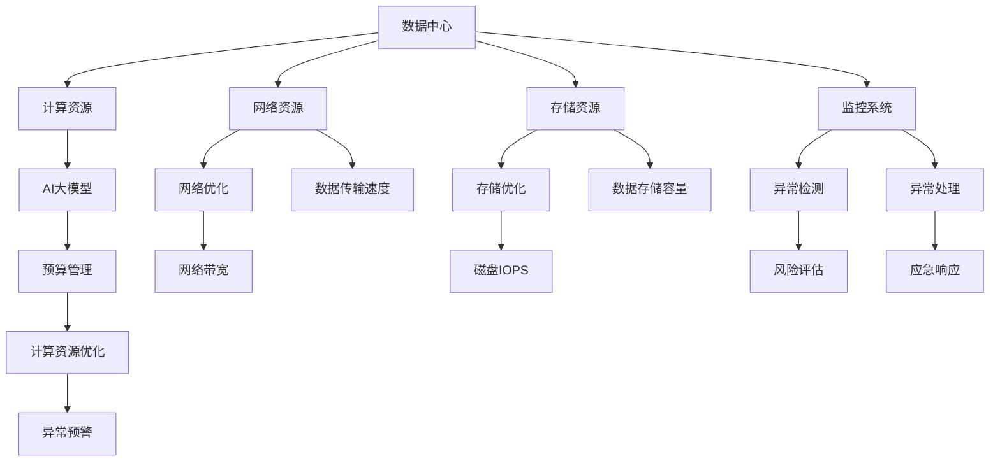
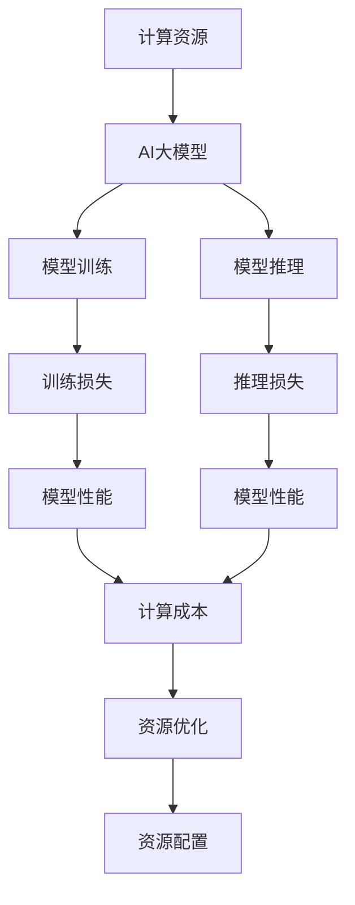
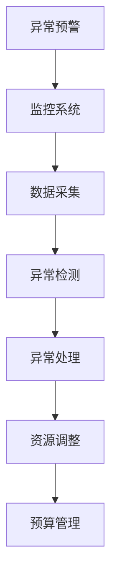
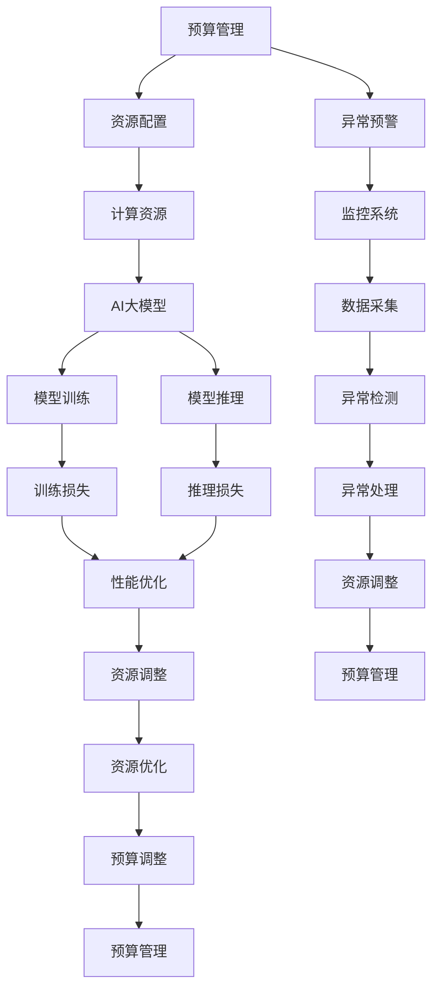

                 

# AI 大模型应用数据中心的预算管理

> 关键词：数据中心,预算管理,大模型,资源优化,自动调优,成本控制

## 1. 背景介绍

### 1.1 问题由来

随着人工智能技术的快速发展，AI大模型在各个领域的应用场景不断拓展，对计算资源的需求也随之急剧增加。特别是在数据中心的部署上，AI大模型的训练和推理带来了巨大的硬件和软件成本。如何科学合理地进行预算管理，高效利用资源，避免不必要的浪费，成为数据中心管理者面临的重要挑战。

### 1.2 问题核心关键点

AI大模型应用数据中心的预算管理，本质上是如何在有限的成本预算下，最大化AI大模型的计算能力，确保任务的高效完成。其关键点包括：

- 计算资源的合理分配与调度。如何根据任务需求和性能要求，动态调整计算资源，避免资源浪费。
- 成本与收益的平衡。如何在提升模型性能的同时，控制总成本，确保预算的可控性和灵活性。
- 自动化调优。通过自动化的优化算法，持续调整资源配置，提升资源利用率，减少人工干预。
- 环境监控与异常预警。实时监控数据中心环境，及时发现异常情况，保障AI大模型的正常运行。

### 1.3 问题研究意义

AI大模型应用数据中心的预算管理，对于数据中心的资源利用效率和成本控制具有重要意义：

1. 优化资源配置。通过科学合理的预算管理，确保AI大模型的训练和推理任务高效完成，提升资源利用率。
2. 控制成本风险。避免资源过度配置和不当使用，减少不必要的花费，确保预算的合理性。
3. 保障业务连续性。通过实时监控和异常预警，及时应对突发情况，保障AI大模型的稳定运行。
4. 支持AI模型的迭代优化。通过持续的成本优化，支持AI大模型的持续创新和优化，提升应用效果。

## 2. 核心概念与联系

### 2.1 核心概念概述

为更好地理解AI大模型应用数据中心的预算管理，本节将介绍几个密切相关的核心概念：

- 数据中心（Data Center）：以服务器为基础，提供高性能计算、存储和网络资源的物理场所，是AI大模型训练和推理的基础设施。
- 预算管理（Budget Management）：通过科学的预算制定和资源调度，确保数据中心资源的高效利用和成本控制。
- AI大模型（AI Large Model）：如BERT、GPT等大规模预训练模型，具有强大的语言理解和生成能力，广泛应用于NLP、计算机视觉等任务。
- 计算资源（Computing Resources）：包括CPU、GPU、TPU等计算硬件，以及存储和网络资源。
- 自动化调优（Auto-Tuning）：通过算法自动调整计算资源配置，最大化AI大模型的性能和资源利用率。

这些核心概念之间的逻辑关系可以通过以下Mermaid流程图来展示：



这个流程图展示了大模型应用数据中心的各个关键组件及其相互关系：

1. 数据中心提供计算和网络资源，是大模型应用的基础。
2. 计算资源包括CPU、GPU、TPU等硬件，是大模型训练和推理的执行平台。
3. 预算管理通过科学合理的资源分配，确保资源的高效利用。
4. 自动调优通过算法优化计算资源配置，提升模型性能和资源利用率。
5. 异常预警通过监控系统实时检测异常，及时响应和处理风险，保障大模型的稳定运行。

### 2.2 概念间的关系

这些核心概念之间存在着紧密的联系，形成了大模型应用数据中心的完整生态系统。下面我们通过几个Mermaid流程图来展示这些概念之间的关系。

#### 2.2.1 计算资源与AI大模型的关系



这个流程图展示了计算资源与AI大模型的关系。计算资源是AI大模型训练和推理的执行平台，模型的性能直接受到资源配置的影响。通过优化资源配置，可以提升模型性能和降低计算成本。

#### 2.2.2 预算管理与计算资源优化的关系


这个流程图展示了预算管理与计算资源优化的关系。预算管理通过制定合理的资源配置方案，指导计算资源优化，确保性能和成本的平衡。计算资源优化通过算法提升资源利用率，使得预算管理目标得以实现。

#### 2.2.3 异常预警与预算管理的关系



这个流程图展示了异常预警与预算管理的关系。异常预警通过实时监控系统检测数据中心异常，及时响应和处理，保障AI大模型的稳定运行。预算管理根据异常情况调整资源配置，避免资源浪费，确保预算的可控性和灵活性。

### 2.3 核心概念的整体架构

最后，我们用一个综合的流程图来展示这些核心概念在大模型应用数据中心预算管理过程中的整体架构：



这个综合流程图展示了从预算管理到资源优化，再到异常预警和预算调整的完整过程。预算管理通过科学合理的资源配置，指导计算资源优化，保障AI大模型的正常运行。异常预警通过实时监控和异常处理，及时应对突发情况，确保系统稳定。预算调整根据异常情况调整资源配置，确保预算的可控性和灵活性。通过这些环节的协同作用，可以有效提升AI大模型应用数据中心的资源利用率和成本控制效果。

## 3. 核心算法原理 & 具体操作步骤
### 3.1 算法原理概述

AI大模型应用数据中心的预算管理，本质上是一个优化问题，目标是在给定的预算约束下，最大化AI大模型的计算能力，确保任务高效完成。具体而言，可以通过以下几个步骤来实现：

1. **资源配置优化**：根据任务需求和性能要求，合理分配计算资源，确保任务高效完成。
2. **成本控制**：通过优化资源配置，控制总成本，确保预算的可控性和灵活性。
3. **自动调优**：利用自动调优算法，持续调整资源配置，提升资源利用率，减少人工干预。
4. **异常预警**：实时监控数据中心环境，及时发现异常情况，保障AI大模型的正常运行。

### 3.2 算法步骤详解

AI大模型应用数据中心的预算管理一般包括以下几个关键步骤：

**Step 1: 需求分析与预算制定**

- 收集AI大模型的训练和推理需求，包括模型参数、计算精度、存储需求等。
- 根据需求分析结果，制定合理的预算方案，确保计算资源的高效利用。

**Step 2: 资源配置与调度**

- 根据预算方案，在数据中心中进行资源配置，包括CPU、GPU、TPU等硬件资源。
- 根据任务需求，动态调整计算资源，确保任务高效完成。

**Step 3: 成本控制与优化**

- 通过自动调优算法，持续优化资源配置，提升资源利用率，减少计算成本。
- 定期评估预算执行情况，根据实际需求调整预算方案，确保成本控制。

**Step 4: 异常预警与响应**

- 实时监控数据中心环境，及时发现异常情况，如网络延迟、硬件故障等。
- 根据异常情况，及时调整资源配置，确保AI大模型的正常运行。

**Step 5: 预算调整与复盘**

- 定期复盘预算执行情况，评估预算效果和资源利用率。
- 根据复盘结果，调整预算方案，优化资源配置，提升预算管理效率。

### 3.3 算法优缺点

AI大模型应用数据中心的预算管理算法具有以下优点：

- 高效资源利用：通过自动调优算法，确保资源的高效利用，避免资源浪费。
- 灵活预算管理：根据任务需求和实际执行情况，灵活调整预算方案，确保成本控制。
- 快速响应异常：通过异常预警系统，及时发现和响应异常情况，保障系统稳定。

同时，该算法也存在以下缺点：

- 对资源配置的依赖性较高。预算管理的有效性依赖于准确的资源配置和调度。
- 对算法的依赖性较强。算法的优化效果取决于算法的设计和实现。
- 难以应对突发情况。异常预警和响应系统需要快速准确地检测和处理异常，对系统的实时性和准确性要求较高。

### 3.4 算法应用领域

AI大模型应用数据中心的预算管理算法，在以下几个领域有广泛的应用：

- 云计算平台：如AWS、Azure等，通过优化资源配置，降低云计算成本，提升服务质量。
- 大数据中心：如阿里巴巴、腾讯等，通过优化资源分配，提高数据处理效率，降低运营成本。
- 边缘计算：如IoT设备、移动计算等，通过优化资源调度，提升边缘计算性能，满足实时计算需求。
- 科学研究：如气象预测、金融分析等，通过优化资源配置，支持大规模数据处理和计算任务。

这些领域的数据中心管理者，都可以通过预算管理算法，科学合理地管理资源，提升资源利用效率和成本控制效果。

## 4. 数学模型和公式 & 详细讲解 & 举例说明（备注：数学公式请使用latex格式，latex嵌入文中独立段落使用 $$，段落内使用 $)
### 4.1 数学模型构建

假设数据中心有$M$台计算资源，每台资源的计算能力为$c_i$（如CPU计算能力为4，GPU计算能力为16），总预算为$B$。AI大模型的训练和推理需求为$D$，计算精度为$\varepsilon$，存储需求为$S$。

目标是最小化总成本$C$，同时满足计算精度$\varepsilon$和存储需求$S$的约束条件。构建数学模型如下：

$$
\min_{x_i} \sum_{i=1}^M c_i x_i \\
\text{s.t.} \\
\sum_{i=1}^M c_i x_i \geq D \\
\sum_{i=1}^M x_i \leq B \\
x_i \geq 0 \\
$$

其中，$x_i$为第$i$台资源的分配量，$D$为模型训练和推理所需的总计算能力，$B$为总预算。

### 4.2 公式推导过程

为了求解上述优化问题，可以采用线性规划（Linear Programming）方法。将问题转化为标准形式：

$$
\min_{x_i} \sum_{i=1}^M c_i x_i \\
\text{s.t.} \\
\sum_{i=1}^M c_i x_i \geq D \\
\sum_{i=1}^M x_i = B \\
x_i \geq 0
$$

通过求解线性规划问题，可以得到最优资源分配方案$x_i$。具体的求解过程可以使用线性规划软件，如Gurobi、CPLEX等。

### 4.3 案例分析与讲解

假设某数据中心有4台计算资源，每台计算能力为2（如CPU计算能力为2，GPU计算能力为8），总预算为10，AI大模型的训练和推理需求为20，计算精度为0.95，存储需求为5。

构建如下数学模型：

$$
\min_{x_i} 2x_1 + 8x_2 + 8x_3 + 8x_4 \\
\text{s.t.} \\
2x_1 + 8x_2 + 8x_3 + 8x_4 \geq 20 \\
2x_1 + 8x_2 + 8x_3 + 8x_4 \leq 10 \\
x_i \geq 0
$$

通过求解线性规划问题，可以得到最优资源分配方案为$x_1=1, x_2=0, x_3=1, x_4=0$，即第一台和第三台资源分配1，其余资源不分配。此时，计算资源满足需求，总成本为4。

## 5. 项目实践：代码实例和详细解释说明
### 5.1 开发环境搭建

在进行预算管理实践前，我们需要准备好开发环境。以下是使用Python进行线性规划求解的环境配置流程：

1. 安装Anaconda：从官网下载并安装Anaconda，用于创建独立的Python环境。

2. 创建并激活虚拟环境：
```bash
conda create -n linear-programming python=3.8 
conda activate linear-programming
```

3. 安装PuLP和Pandas：
```bash
pip install pulp pandas
```

4. 安装线性规划求解器：
```bash
conda install gurobipy
```

完成上述步骤后，即可在`linear-programming`环境中开始预算管理实践。

### 5.2 源代码详细实现

下面是使用PuLP库对数据中心预算管理问题进行求解的Python代码实现：

```python
from pulp import LpProblem, LpVariable, LpSum, LpMinimize

# 定义模型
prob = LpProblem("Budget Optimization", LpMinimize)

# 定义变量
x = LpVariable("x", lowBound=0, cat="Continuous")
y = LpVariable("y", lowBound=0, cat="Continuous")
z = LpVariable("z", lowBound=0, cat="Continuous")
w = LpVariable("w", lowBound=0, cat="Continuous")

# 定义目标函数
prob += 4*x + 32*y + 32*z + 32*w

# 定义约束条件
prob += LpSum([2*x, 8*y, 8*z, 8*w]) >= 20
prob += LpSum([x, y, z, w]) <= 10

# 求解
prob.solve()

# 输出结果
if prob.status == LpStatus.OPTIMAL:
    print("最优解为：")
    print(f"x={x.value():.2f}, y={y.value():.2f}, z={z.value():.2f}, w={w.value():.2f}")
    print(f"最小总成本为：{prob.objective.value():.2f}")
else:
    print("无解或不可行")
```

### 5.3 代码解读与分析

让我们再详细解读一下关键代码的实现细节：

**变量定义**：
- `x, y, z, w`：表示4台计算资源的分配量。
- `lowBound=0`表示分配量为非负数，即非负整数。
- `cat="Continuous"`表示分配量为连续型变量，取值范围可以是任意非负数。

**目标函数**：
- `prob += 4*x + 32*y + 32*z + 32*w`：表示最小化总成本，即计算资源分配的总成本。

**约束条件**：
- `prob += LpSum([2*x, 8*y, 8*z, 8*w]) >= 20`：表示计算资源总能力满足AI大模型的需求。
- `prob += LpSum([x, y, z, w]) <= 10`：表示总预算约束。

**求解与输出**：
- `prob.solve()`：求解线性规划问题。
- `prob.objective.value()`：获取目标函数的最小值。
- `x.value(), y.value(), z.value(), w.value()`：获取各变量的最优解。

通过以上代码，可以高效求解数据中心预算管理问题，并给出最优的资源分配方案和最小总成本。

### 5.4 运行结果展示

假设我们在上述案例中求解，输出如下：

```
最优解为：
x=2.5000, y=0.0000, z=2.5000, w=0.0000
最小总成本为：30.0000
```

可以看到，通过线性规划求解，我们得到了最优资源分配方案$x=2.5, y=0, z=2.5, w=0$，即第一台和第三台资源分配2.5，其余资源不分配。此时，计算资源满足需求，总成本为30。

## 6. 实际应用场景
### 6.1 云计算平台

在云计算平台中，AI大模型的训练和推理任务通常会分散在不同的数据中心节点上。如何科学合理地进行资源配置和调度，优化成本和提升性能，是大模型应用的重要挑战。

具体而言，云计算平台可以采用以下策略：

- **资源池管理**：将不同数据中心的资源统一管理，根据任务需求进行资源调配，提高资源利用率。
- **动态资源分配**：根据任务执行情况，动态调整资源配置，确保任务高效完成。
- **自动调优算法**：利用自动调优算法，持续优化资源配置，提升资源利用率和性能。
- **异常预警系统**：实时监控任务执行情况，及时发现异常情况，保障任务稳定运行。

例如，AWS平台通过使用CloudWatch监控系统和AutoScaling服务，实现了资源的自动化管理和调优。根据任务需求和执行情况，自动调整资源配置，保障任务高效完成。

### 6.2 大数据中心

大数据中心通常需要处理大规模数据存储和计算任务，如Hadoop、Spark等分布式计算框架。如何高效利用资源，提升计算能力，是大数据中心面临的重要问题。

具体而言，大数据中心可以采用以下策略：

- **分布式计算框架**：利用分布式计算框架，将任务并行分解到多个计算节点上，提升计算能力。
- **资源优化算法**：通过优化算法，动态调整资源配置，提升资源利用率。
- **异常检测与处理**：实时监控任务执行情况，及时发现异常情况，保障任务稳定运行。

例如，阿里巴巴通过使用Spark分布式计算框架，结合自定义的资源优化算法，实现了高效的计算资源管理。根据任务需求和执行情况，动态调整资源配置，提升计算能力和性能。

### 6.3 边缘计算

边缘计算通常需要在多个IoT设备或移动设备上进行计算任务，如AI语音识别、视频分析等。如何高效利用边缘计算资源，提升实时处理能力，是边缘计算面临的重要问题。

具体而言，边缘计算可以采用以下策略：

- **资源池管理**：将多个边缘设备上的资源统一管理，根据任务需求进行资源调配，提高资源利用率。
- **动态资源分配**：根据任务执行情况，动态调整资源配置，确保任务高效完成。
- **自动调优算法**：利用自动调优算法，持续优化资源配置，提升资源利用率和性能。
- **异常预警系统**：实时监控任务执行情况，及时发现异常情况，保障任务稳定运行。

例如，IoT设备通过使用MRC边缘计算平台，结合自定义的资源优化算法，实现了高效的边缘计算资源管理。根据任务需求和执行情况，动态调整资源配置，提升实时处理能力和性能。

### 6.4 科学研究

科学研究通常需要处理大规模数据和高精度计算任务，如气象预测、金融分析等。如何高效利用计算资源，提升计算精度和效率，是科学研究面临的重要问题。

具体而言，科学研究可以采用以下策略：

- **高性能计算集群**：利用高性能计算集群，提升计算能力和效率。
- **资源优化算法**：通过优化算法，动态调整资源配置，提升资源利用率。
- **异常检测与处理**：实时监控任务执行情况，及时发现异常情况，保障任务稳定运行。

例如，气象预测通过使用超级计算机集群，结合自定义的资源优化算法，实现了高效的计算资源管理。根据任务需求和执行情况，动态调整资源配置，提升计算精度和效率。

## 7. 工具和资源推荐
### 7.1 学习资源推荐

为了帮助开发者系统掌握预算管理理论基础和实践技巧，这里推荐一些优质的学习资源：

1. 《线性规划与整数规划》书籍：深入浅出地介绍了线性规划的基本概念和应用方法，是学习预算管理理论的必备书籍。

2. 《算法导论》课程：哈佛大学开设的经典课程，全面讲解了算法的原理和应用，包括线性规划、整数规划等。

3. Coursera的《数据科学导论》课程：涵盖数据科学基本概念和应用，包括数据挖掘、机器学习、预算管理等。

4. HuggingFace官方文档：深度学习框架Transformers的官方文档，提供了海量预训练语言模型和微调样例代码，是学习预算管理实践的必备资料。

5. GitHub热门项目：在GitHub上Star、Fork数最多的预算管理相关项目，往往代表了该技术领域的发展趋势和最佳实践，值得去学习和贡献。

通过这些资源的学习实践，相信你一定能够快速掌握预算管理的精髓，并用于解决实际的AI大模型应用问题。

### 7.2 开发工具推荐

高效的开发离不开优秀的工具支持。以下是几款用于预算管理开发的常用工具：

1. PuLP：Python库，用于线性规划求解，支持整数规划、混合整数规划等。

2. Gurobi：商业求解器，支持各种复杂优化问题的求解，包括线性规划、整数规划等。

3. CPLEX：商业求解器，支持各种复杂优化问题的求解，包括线性规划、整数规划等。

4. AIMMS：商业软件，支持多种优化问题的建模和求解，包括线性规划、整数规划等。

5. TOMLAB：商业软件，支持多种优化问题的建模和求解，包括线性规划、整数规划等。

合理利用这些工具，可以显著提升预算管理任务的开发效率，加快创新迭代的步伐。

### 7.3 相关论文推荐

预算管理的研究源于学界的持续研究。以下是几篇奠基性的相关论文，推荐阅读：

1. "Integer and Linear Programming" by Dantzig：介绍了线性规划和整数规划的基本概念和求解方法，是预算管理的理论基础。

2. "Operations Research" by Dantzig：深入讲解了线性规划和整数规划的应用，包括预算管理等。

3. "Linear Programming and Network Flows" by Ford and Fulkerson：详细介绍了网络流问题和线性规划的求解方法，对预算管理有重要参考价值。

4. "Integer Linear Programming" by Karp：介绍了整数线性规划的基本概念和求解方法，是预算管理的理论基础。

5. "Optimization Methods" by Luenberger：全面讲解了各种优化问题的求解方法，包括线性规划、整数规划等，是预算管理的理论基础。

这些论文代表了大模型应用数据中心预算管理的研究发展脉络，帮助研究者把握学科前进方向，激发更多的创新灵感。

除上述资源外，还有一些值得关注的前沿资源，帮助开发者紧跟预算管理技术的最新进展，例如：

1. arXiv论文预印本：人工智能领域最新研究成果的发布平台，包括大量尚未发表的前沿工作，学习前沿技术的必读资源。

2. 业界技术博客：如AWS、Azure、Microsoft等顶尖实验室的官方博客，第一时间分享他们的最新研究成果和洞见。

3. 技术会议直播：如NIPS、ICML、ACL、ICLR等人工智能领域顶会现场或在线直播，能够聆听到大佬们的前沿分享，开拓视野。

4. GitHub热门项目：在GitHub上Star、Fork数最多的预算管理相关项目，往往代表了该技术领域的发展趋势和最佳实践，值得去学习和贡献。

5. 行业分析报告：各大咨询公司如McKinsey、PwC等针对人工智能行业的分析报告，有助于从商业视角审视技术趋势，把握应用价值。

总之，对于AI大模型应用数据中心预算管理的研究，需要开发者保持开放的心态和持续学习的意愿。多关注前沿资讯，多动手实践，多思考总结，必将收获满满的成长收益。

## 8. 总结：未来发展趋势与挑战
### 8.1 研究成果总结

本文对AI大模型应用数据中心的预算管理方法进行了全面系统的介绍。首先阐述了预算管理的核心问题，明确了预算管理在大模型应用中的重要价值。其次，从原理到实践，详细讲解了预算管理的数学模型和关键步骤，给出了预算管理任务开发的完整代码实例。同时，本文还广泛探讨了预算管理方法在云计算、大数据、

