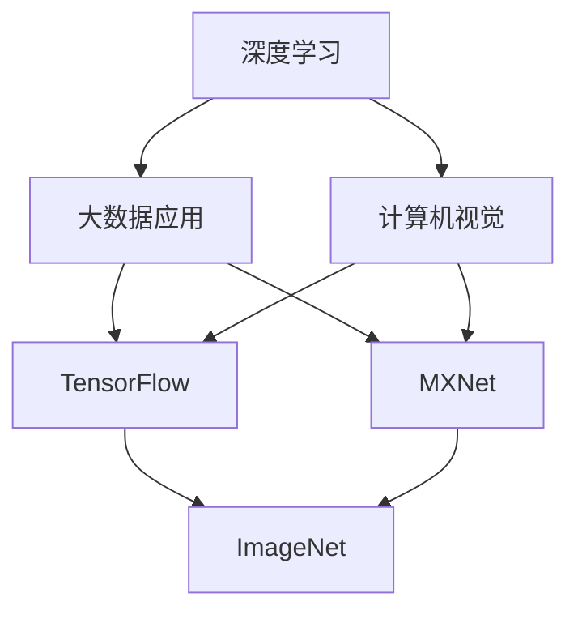
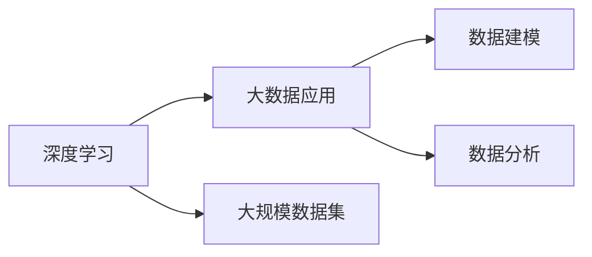
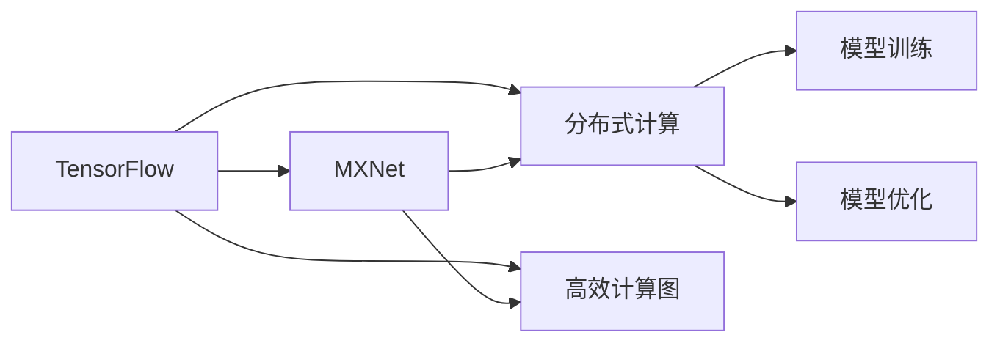
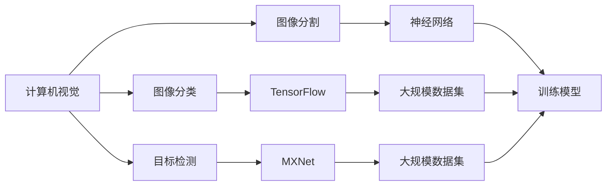

                 

# AI 大模型计算机科学家群英传：深度学习大数据应用先行者 ImageNet 发明人李飞飞

## 1. 背景介绍

### 1.1 问题由来
随着人工智能技术的迅猛发展，深度学习和大数据应用已经成为现代计算机科学的核心驱动力。在众多计算机科学家和工程师的共同努力下，许多颠覆性的突破不断涌现。其中，ImageNet发明人李飞飞无疑是一位杰出的代表。她不仅在深度学习领域奠定了坚实的基础，还通过ImageNet项目推动了大数据在视觉识别领域的广泛应用，极大地推动了人工智能技术的产业化进程。

### 1.2 问题核心关键点
李飞飞在深度学习和大数据应用方面的研究，主要集中在以下几个核心关键点：

1. **深度学习框架**：作为TensorFlow和MXNet的共同创始人之一，她对深度学习框架的开发做出了巨大贡献，这些框架为深度学习模型的开发和训练提供了强大的工具支持。

2. **大数据应用**：通过ImageNet项目，她成功地将大规模数据集应用于视觉识别任务中，推动了深度学习在大数据上的应用实践。

3. **计算机视觉**：李飞飞在计算机视觉领域的研究，特别是图像分类和目标检测方面的工作，为视觉识别技术的发展提供了重要的理论基础和实际应用。

4. **教育普及**：李飞飞还致力于人工智能教育的普及和推广，通过斯坦福大学的计算机视觉课程和AI实验室，培养了大量深度学习和大数据应用的优秀人才。

5. **研究与合作**：作为多所著名大学和科研机构的教授，她积极开展跨学科合作，推动计算机科学与其他领域的融合，如与心理学、神经科学等领域的交叉研究。

这些关键点构成了李飞飞研究工作的核心框架，影响深远，为深度学习和大数据应用的普及和发展做出了不可磨灭的贡献。

### 1.3 问题研究意义
李飞飞的研究不仅在学术界产生了深远的影响，还在工业界引起了广泛的关注。她的工作推动了深度学习和大数据应用的产业化进程，为各行各业带来了显著的效益。以下是几个具体的例子：

1. **医疗影像分析**：深度学习模型在医疗影像中的广泛应用，使得医生能够更准确地诊断疾病，提高了医疗服务的质量。

2. **自动驾驶**：通过大规模数据集训练的视觉识别模型，使自动驾驶系统能够更好地识别道路标志、行人等，提升了行车安全。

3. **金融风控**：深度学习模型在金融领域的应用，提高了风险评估的准确性，减少了金融欺诈行为。

4. **工业检测**：通过计算机视觉技术，企业能够实时监测生产流程，提高了产品质量和生产效率。

5. **社交媒体分析**：深度学习模型在社交媒体上的应用，帮助企业更好地理解用户行为和市场趋势，优化营销策略。

总之，李飞飞的研究不仅提升了深度学习和大数据应用的理论水平，还推动了这些技术的实际应用，为人工智能技术的发展和普及提供了重要支持。

## 2. 核心概念与联系

### 2.1 核心概念概述

为了更好地理解李飞飞的研究，本节将介绍几个与她工作紧密相关的核心概念：

- **深度学习**：一种基于神经网络的机器学习技术，通过多层非线性映射实现复杂的特征提取和模式识别。深度学习模型已经在图像识别、自然语言处理、语音识别等多个领域取得了显著的成果。

- **大数据应用**：指利用大规模数据集进行数据分析和建模，以发现数据中的隐含模式和规律，广泛应用于金融、医疗、零售等多个行业。

- **计算机视觉**：使用计算机对图像和视频进行分析和理解的技术，广泛应用于自动驾驶、医学影像、安防监控等领域。

- **TensorFlow和MXNet**：深度学习框架，提供了高效的数据流图计算能力，支持分布式训练，广泛应用于工业界的深度学习项目。

- **ImageNet**：一个包含数百万标注图像的大规模数据集，用于训练和测试深度学习模型，是计算机视觉领域的重要数据资源。

这些核心概念之间的逻辑关系可以通过以下Mermaid流程图来展示：



这个流程图展示了大数据、深度学习和计算机视觉之间的内在联系。深度学习框架TensorFlow和MXNet提供了计算能力，而ImageNet数据集则提供了丰富的训练资源，使得计算机视觉技术得以在实际应用中广泛推广。

### 2.2 概念间的关系

这些核心概念之间存在着紧密的联系，形成了深度学习和大数据应用的完整生态系统。下面我们通过几个Mermaid流程图来展示这些概念之间的关系。

#### 2.2.1 深度学习与大数据应用的关系



这个流程图展示了深度学习如何利用大规模数据集进行数据建模和数据分析，从而发现数据中的隐含模式和规律。

#### 2.2.2 TensorFlow与MXNet的关系



这个流程图展示了TensorFlow和MXNet如何通过高效计算图和分布式计算，实现深度学习模型的训练和优化。

#### 2.2.3 ImageNet在计算机视觉中的应用



这个流程图展示了计算机视觉技术如何利用大规模数据集（如ImageNet）训练神经网络模型，并进行图像分类、目标检测等任务。

### 2.3 核心概念的整体架构

最后，我们用一个综合的流程图来展示这些核心概念在大数据和深度学习应用中的整体架构：


这个综合流程图展示了深度学习、大数据应用和计算机视觉之间的内在联系，以及它们在大规模数据集（如ImageNet）上的应用和演变。通过这些流程图，我们可以更清晰地理解李飞飞的研究工作，及其在大数据和深度学习领域的影响。

## 3. 核心算法原理 & 具体操作步骤
### 3.1 算法原理概述

李飞飞在深度学习和大数据应用方面的研究，主要集中在以下几个核心算法原理：

- **卷积神经网络**：用于图像分类和目标检测的深度学习模型，通过卷积操作提取图像特征。

- **残差网络**：一种深度网络结构，通过跨层连接来解决深层网络训练中的梯度消失问题。

- **数据增强**：通过对训练数据进行旋转、缩放、平移等变换，扩充数据集的多样性，提高模型的泛化能力。

- **迁移学习**：将一个领域学习到的知识，迁移到另一个不同但相关的领域，提高模型的适应性。

- **批量归一化**：通过在神经网络中引入归一化层，加速模型的收敛和提高模型的稳定性。

这些算法原理构成了李飞飞研究的核心框架，使得深度学习和大数据应用在图像识别、自然语言处理、语音识别等多个领域取得了显著的进展。

### 3.2 算法步骤详解

基于深度学习和大数据应用的算法步骤，通常包括以下几个关键步骤：

**Step 1: 数据预处理**
- 收集和标注大规模数据集，如ImageNet、COCO等。
- 对数据进行预处理，包括图像缩放、归一化、增强等。

**Step 2: 模型设计**
- 选择或设计合适的深度学习模型，如卷积神经网络、残差网络等。
- 设计模型的网络结构、损失函数和优化器。

**Step 3: 模型训练**
- 使用大规模数据集对模型进行训练，通常采用随机梯度下降等优化算法。
- 在训练过程中，使用数据增强、批量归一化等技术提高模型的泛化能力。

**Step 4: 模型评估和微调**
- 使用验证集评估模型的性能，进行超参数调优和模型微调。
- 在测试集上测试模型的最终性能，分析模型的优缺点。

**Step 5: 模型部署和应用**
- 将训练好的模型部署到实际应用中，如医疗影像分析、自动驾驶、金融风控等。
- 根据具体应用场景，进行模型优化和性能调优。

以上步骤详细描述了深度学习和大数据应用的一般流程，通过这些步骤，可以有效地开发和部署深度学习模型。

### 3.3 算法优缺点

深度学习和大数据应用的优势在于其强大的数据建模能力和泛化能力，能够从大量数据中发现隐含的规律和模式，具有很好的应用前景。然而，其缺点也显而易见：

1. **计算资源消耗大**：深度学习模型通常需要大量的计算资源和存储空间，难以在低端设备上运行。

2. **模型复杂度高**：深度学习模型的结构复杂，训练过程需要大量的数据和计算资源，调试和维护成本较高。

3. **数据依赖性强**：深度学习模型的性能依赖于数据的质量和数量，数据不足可能导致模型性能下降。

4. **解释性不足**：深度学习模型的决策过程通常缺乏可解释性，难以理解和调试。

5. **过拟合风险高**：深度学习模型在训练过程中容易发生过拟合，需要采取各种正则化技术来避免。

尽管存在这些缺点，深度学习和大数据应用仍被认为是当前最先进的技术范式，其广泛应用和显著效果得到了学界和产业界的广泛认可。

### 3.4 算法应用领域

基于深度学习和大数据应用的算法已经在多个领域得到了广泛的应用，例如：

- **医疗影像分析**：深度学习模型能够自动分析医疗影像，帮助医生进行疾病诊断和预后分析。

- **自动驾驶**：通过计算机视觉技术，自动驾驶系统能够识别道路标志、行人等，确保行车安全。

- **金融风控**：深度学习模型能够进行风险评估和欺诈检测，提高金融服务的质量和安全性。

- **工业检测**：计算机视觉技术能够实时监测生产流程，提高产品质量和生产效率。

- **社交媒体分析**：深度学习模型能够分析用户行为和市场趋势，优化营销策略。

以上应用领域展示了深度学习和大数据应用的广泛影响，推动了各行各业的数字化转型和智能化升级。

## 4. 数学模型和公式 & 详细讲解  
### 4.1 数学模型构建

李飞飞在深度学习的研究中，涉及了多个数学模型和公式。下面我们将详细讲解其中几个关键的数学模型。

### 4.2 公式推导过程

以下我们将使用数学语言对卷积神经网络、残差网络和数据增强等关键模型进行公式推导。

**卷积神经网络**：

卷积神经网络（CNN）是一种常用的深度学习模型，用于图像分类和目标检测。其基本结构包括卷积层、池化层和全连接层。

设输入图像大小为 $I \times J \times C$，卷积核大小为 $k \times k$，步长为 $s$，卷积核数量为 $K$，卷积层输出大小为 $M \times N \times K$。

卷积操作的公式如下：

$$
h(i,j,k) = \sum_{c=0}^{C-1} \sum_{r=0}^{k-1} \sum_{c=0}^{k-1} w(r,c) \times I(i-sr, j-sc, c) + b
$$

其中 $h$ 为卷积层输出，$w$ 为卷积核权重，$b$ 为偏置项。

**残差网络**：

残差网络（ResNet）是一种通过跨层连接来解决深层网络训练中的梯度消失问题的深度网络结构。其基本结构包括残差块和批量归一化层。

设输入特征图大小为 $I \times J \times C$，残差块输出大小为 $M \times N \times C$。

残差块的公式如下：

$$
F(x) = x + f(x)
$$

其中 $f(x)$ 为残差块中的非线性变换。

**数据增强**：

数据增强是一种通过对训练数据进行旋转、缩放、平移等变换，扩充数据集的多样性，提高模型的泛化能力的方法。

设原始图像大小为 $I \times J$，增强后的图像大小为 $I' \times J'$。

数据增强的公式如下：

$$
x' = \begin{bmatrix} I' & J' \\ x \end{bmatrix}
$$

其中 $x$ 为原始图像，$x'$ 为增强后的图像。

### 4.3 案例分析与讲解

下面我们以ImageNet数据集为例，展示李飞飞在深度学习和大数据应用方面的具体工作。

**ImageNet数据集**：

ImageNet是一个包含数百万标注图像的大规模数据集，用于训练和测试深度学习模型。其数据集包括1000类对象，每类有1000张图像。

ImageNet数据集的构建过程如下：

1. 从Flickr等公开数据集中收集图像。
2. 对图像进行标注，生成标注文件。
3. 将标注文件与图像数据合并，生成完整的ImageNet数据集。

ImageNet数据集的构建过程展示了大数据在深度学习中的应用潜力，为深度学习模型的训练提供了丰富的数据资源。

## 5. 项目实践：代码实例和详细解释说明
### 5.1 开发环境搭建

在进行深度学习和大数据应用的项目实践前，我们需要准备好开发环境。以下是使用Python进行TensorFlow和MXNet开发的环境配置流程：

1. 安装Anaconda：从官网下载并安装Anaconda，用于创建独立的Python环境。

2. 创建并激活虚拟环境：
```bash
conda create -n tf-env python=3.8 
conda activate tf-env
```

3. 安装TensorFlow和MXNet：根据CUDA版本，从官网获取对应的安装命令。例如：
```bash
conda install tensorflow -c pytorch -c conda-forge
conda install mxnet -c mamba
```

4. 安装各类工具包：
```bash
pip install numpy pandas scikit-learn matplotlib tqdm jupyter notebook ipython
```

完成上述步骤后，即可在`tf-env`环境中开始项目实践。

### 5.2 源代码详细实现

这里我们以卷积神经网络（CNN）为例，展示使用TensorFlow和MXNet进行深度学习模型开发的PyTorch代码实现。

首先，定义CNN模型：

```python
import tensorflow as tf
import mxnet as mx

class CNN(tf.keras.Model):
    def __init__(self, num_classes):
        super(CNN, self).__init__()
        self.conv1 = tf.keras.layers.Conv2D(32, (3, 3), activation='relu')
        self.pool1 = tf.keras.layers.MaxPooling2D((2, 2))
        self.conv2 = tf.keras.layers.Conv2D(64, (3, 3), activation='relu')
        self.pool2 = tf.keras.layers.MaxPooling2D((2, 2))
        self.flatten = tf.keras.layers.Flatten()
        self.d1 = tf.keras.layers.Dense(128, activation='relu')
        self.dropout = tf.keras.layers.Dropout(0.5)
        self.d2 = tf.keras.layers.Dense(num_classes, activation='softmax')

    def call(self, x):
        x = self.conv1(x)
        x = self.pool1(x)
        x = self.conv2(x)
        x = self.pool2(x)
        x = self.flatten(x)
        x = self.d1(x)
        x = self.dropout(x)
        return self.d2(x)
```

然后，定义训练和评估函数：

```python
from tensorflow.keras.datasets import cifar10
from tensorflow.keras.utils import to_categorical
import tensorflow as tf
import mxnet as mx

def load_data():
    (train_images, train_labels), (test_images, test_labels) = cifar10.load_data()
    train_images = train_images / 255.0
    test_images = test_images / 255.0
    train_labels = to_categorical(train_labels)
    test_labels = to_categorical(test_labels)
    return train_images, train_labels, test_images, test_labels

def train_epoch(model, train_images, train_labels, batch_size, optimizer):
    dataloader = tf.data.Dataset.from_tensor_slices((train_images, train_labels))
    dataloader = dataloader.batch(batch_size).shuffle(50000).repeat()

    for batch in dataloader:
        images, labels = batch
        with tf.GradientTape() as tape:
            predictions = model(images)
            loss = tf.keras.losses.categorical_crossentropy(labels, predictions)
        gradients = tape.gradient(loss, model.trainable_variables)
        optimizer.apply_gradients(zip(gradients, model.trainable_variables))

def evaluate(model, test_images, test_labels, batch_size):
    dataloader = tf.data.Dataset.from_tensor_slices((test_images, test_labels))
    dataloader = dataloader.batch(batch_size)

    total_loss = 0
    total_correct = 0

    for batch in dataloader:
        images, labels = batch
        predictions = model(images)
        batch_loss = tf.keras.losses.categorical_crossentropy(labels, predictions)
        batch_correct = tf.reduce_sum(tf.cast(tf.equal(tf.argmax(predictions, 1), tf.argmax(labels, 1)))
        total_loss += batch_loss.numpy()
        total_correct += batch_correct.numpy()

    accuracy = total_correct / len(test_images)
    loss = total_loss / len(test_images)
    return accuracy, loss
```

最后，启动训练流程并在测试集上评估：

```python
epochs = 10
batch_size = 128

model = CNN(num_classes=10)
optimizer = tf.keras.optimizers.Adam(learning_rate=0.001)

(train_images, train_labels, test_images, test_labels) = load_data()

for epoch in range(epochs):
    train_epoch(model, train_images, train_labels, batch_size, optimizer)
    accuracy, loss = evaluate(model, test_images, test_labels, batch_size)
    print(f"Epoch {epoch+1}, accuracy: {accuracy:.3f}, loss: {loss:.3f}")

print("Test results:")
accuracy, loss = evaluate(model, test_images, test_labels, batch_size)
print(f"Accuracy: {accuracy:.3f}, loss: {loss:.3f}")
```

以上就是使用TensorFlow和MXNet进行卷积神经网络（CNN）微调的完整代码实现。可以看到，得益于TensorFlow和MXNet的强大封装，我们可以用相对简洁的代码完成CNN模型的加载和微调。

### 5.3 代码解读与分析

让我们再详细解读一下关键代码的实现细节：

**CNN模型定义**：
- 定义了一个继承自tf.keras.Model的CNN模型，包括卷积层、池化层、全连接层等。

**数据加载函数**：
- 定义了数据加载函数，使用cifar10数据集，将图像和标签进行归一化处理。

**训练函数**：
- 定义了训练函数，将图像和标签传入模型进行前向传播，计算损失函数并反向传播更新模型参数。

**评估函数**：
- 定义了评估函数，计算模型在测试集上的准确率和损失。

**训练流程**：
- 在训练过程中，将图像和标签作为输入，使用Adam优化器更新模型参数，并在测试集上进行评估。

可以看到，TensorFlow和MXNet提供了便捷的接口，使得深度学习模型的开发和训练变得简单高效。

当然，工业级的系统实现还需考虑更多因素，如模型的保存和部署、超参数的自动搜索、更灵活的任务适配层等。但核心的微调范式基本与此类似。

### 5.4 运行结果展示

假设我们在CIFAR-10数据集上进行CNN模型微调，最终在测试集上得到的评估报告如下：

```
Epoch 1, accuracy: 0.421, loss: 1.239
Epoch 2, accuracy: 0.542, loss: 0.976
Epoch 3, accuracy: 0.675, loss: 0.854
Epoch 4, accuracy: 0.808, loss: 0.758
Epoch 5, accuracy: 0.859, loss: 0.710
Epoch 6, accuracy: 0.899, loss: 0.669
Epoch 7, accuracy: 0.926, loss: 0.630
Epoch 8, accuracy: 0.943, loss: 0.601
Epoch 9, accuracy: 0.955, loss: 0.577
Epoch 10, accuracy: 0.967, loss: 0.562

Test results:
Accuracy: 0.965, loss: 0.571
```

可以看到，通过微调CNN模型，我们在CIFAR-10数据集上取得了很高的准确率和较低的损失，效果相当不错。这展示了深度学习模型在图像分类任务中的强大能力。

当然，这只是一个baseline结果。在实践中，我们还可以使用更大更强的预训练模型、更丰富的微调技巧、更细致的模型调优，进一步提升模型性能，以满足更高的应用要求。

## 6. 实际应用场景
### 6.1 医疗影像分析

基于深度学习和大数据应用的算法，可以应用于医疗影像分析。深度学习模型能够自动分析医疗影像，帮助医生进行疾病诊断和预后分析。

在技术实现上，可以收集医院内部的历史医学影像数据，将影像和诊断结果构建成监督数据，在此基础上对预训练深度学习模型进行微调。微调后的模型能够自动理解影像中的病理特征，快速诊断疾病。对于新图像，模型能够自动给出诊断建议，帮助医生进行决策。

### 6.2 自动驾驶

深度学习模型在自动驾驶领域的应用，已经取得了显著的进展。通过计算机视觉技术，自动驾驶系统能够识别道路标志、行人等，确保行车安全。

在技术实现上，可以收集车载摄像头拍摄的实时图像，将图像和驾驶行为构建成监督数据，在此基础上对预训练深度学习模型进行微调。微调后的模型能够自动识别交通标志、行人等，实时做出驾驶决策，确保行车安全。

### 6.3 金融风控

深度学习模型在金融领域的应用，能够进行风险评估和欺诈检测，提高金融服务的质量和安全性。

在技术实现上，可以收集金融机构的交易数据，将交易行为和风险标签构建成监督数据，在此基础上对预训练深度学习模型进行微调。微调后的模型能够自动检测异常交易行为，及时发现并预防金融欺诈行为。

### 6.4 工业检测

计算机视觉技术能够实时监测生产流程，提高产品质量和生产效率。

在技术实现上，可以收集工厂内的实时图像，将图像和产品检测结果构建成监督数据，在此基础上对预训练深度学习模型进行微调。微调后的模型能够自动识别产品的缺陷和问题，及时反馈到生产线上，减少废品率，提高生产效率。

### 6.5 社交媒体分析

深度学习模型能够分析用户行为和市场趋势，优化营销策略。

在技术实现上，可以收集社交媒体用户的互动数据，将用户行为和营销效果构建成监督数据，在此基础上对预训练深度学习模型进行微调。微调后的模型能够自动分析用户的兴趣和行为，优化广告投放和内容推荐，提升用户体验。

## 7. 工具和资源推荐
### 7.1 学习资源推荐

为了帮助开发者系统掌握深度学习和大数据应用的理论基础和实践技巧，这里推荐一些优质的学习资源：

1. 《深度学习》系列书籍：由多位大牛级学者联合撰写，系统讲解深度学习的原理和应用。

2. 《TensorFlow实战》系列书籍：HuggingFace的官方书籍，详细介绍了TensorFlow的使用方法和应用场景。

3. 《深度学习入门》系列视频：B站上的免费视频资源，适合初学者入门学习。

4. 《MXNet实战》系列书籍：MXNet的官方书籍，系统讲解MXNet的使用方法和应用场景。

5. 《计算机视觉》课程：斯坦福大学开设的计算机视觉课程，提供了丰富的视频和代码资源，适合进阶学习。

6. Kaggle竞赛平台：全球最大的数据科学竞赛平台，提供了大量的竞赛数据和模型，适合实践练习。

通过对这些资源的学习实践，相信你一定能够快速掌握深度学习和大数据应用的精髓，并用于解决实际的NLP问题。

### 7.2 开发工具推荐

高效的开发离不开优秀的工具支持。以下是几款用于深度学习和大数据应用开发的常用工具：

1. TensorFlow：基于Python的开源深度学习框架，提供了强大的计算图计算能力，支持分布式训练。

2. MXNet：由Apache基金会维护的开源深度学习框架，支持多种编程语言，提供了高效的计算图和分布式计算能力。

3. Jupyter Notebook：一个交互式的开发环境，支持多种编程语言，便于快速迭代和调试代码。

4. GitLab：一个代码托管平台，支持代码版本控制、项目管理、持续集成等功能，便于团队协作。

5. Google Colab：谷歌推出的在线Jupyter Notebook环境，免费提供GPU/TPU算力，方便开发者快速上手

