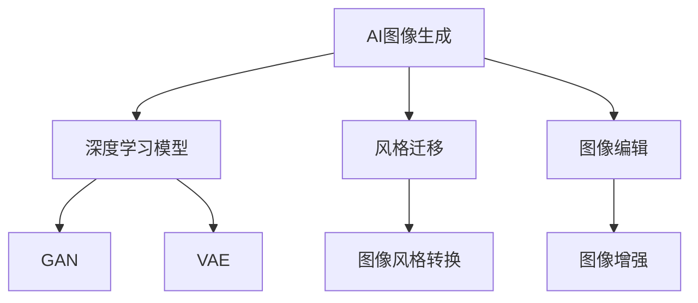

                 

# AIGC从入门到实战：AI 辅助设计：基于 AI 生成图像和 PPT 的创意设计

> 关键词：AIGC, 设计辅助, AI 生成图像, AI 生成 PPT, 创意设计, 图像生成模型, 图像编辑模型, 自然语言处理, PPT 自动生成, 图像处理, 图形设计

## 1. 背景介绍

### 1.1 问题由来

人工智能(AI)和大数据技术的高速发展，催生了新一代计算机视觉和图形设计领域的技术革新。现代AI辅助设计系统能够自动生成高质量的图像和PPT设计，极大提升设计师的创作效率和工作质量。AI辅助设计技术主要基于以下两方面的技术发展：

1. **AI图像生成**：利用深度学习模型，如生成对抗网络(GAN)、变分自编码器(VAE)等，可以生成符合特定风格或场景的图像。
2. **AI PPT生成**：利用自然语言处理(NLP)和图像生成技术，可以将自然语言描述转换为精美的PPT设计。

本博客将全面介绍AI辅助设计的原理、关键技术和实际应用，帮助设计爱好者从入门到实战，掌握最前沿的AI生成图像和PPT的设计技巧。

### 1.2 问题核心关键点

AI辅助设计技术利用深度学习模型的强大能力，结合自然语言处理，可以自动化地生成高质量的图像和PPT设计。该技术包括以下核心点：

- **AI图像生成**：使用深度学习模型如GAN、VAE等，根据输入的描述或标签生成指定风格的图像。
- **AI PPT生成**：结合NLP和图像生成技术，将自然语言描述转换为PPT的设计模板和视觉元素。
- **图像和PPT的融合**：利用深度学习模型，将图像自动插入PPT中，生成完整的可视化设计。

这些关键技术点构成了AI辅助设计的基础框架，可以应用于多个设计场景，包括广告、营销、教育等。

### 1.3 问题研究意义

AI辅助设计技术具有广泛的应用前景，能够极大提升设计效率和工作质量，促进设计产业的数字化转型。其研究意义主要体现在以下几个方面：

1. **提升设计效率**：利用AI自动化生成图像和PPT，设计师可以迅速从创意构思转向实际制作，大幅减少手工绘制的时间。
2. **改善设计质量**：AI生成的高质量图像和PPT设计，可以在保证设计风格和视觉效果的同时，降低人为失误和偏差。
3. **降低设计成本**：AI辅助设计减少了人力和时间成本，使得优质设计更加普及和可接受。
4. **促进设计创新**：AI可以快速生成大量风格各异的创意设计，提供灵感和参考，激发设计师的创新思维。
5. **推动设计教育**：AI技术的应用可以优化设计教学，提升学生的设计能力和创作水平。

总之，AI辅助设计技术将为设计行业带来革命性的变化，提升设计品质，加速设计创新。

## 2. 核心概念与联系

### 2.1 核心概念概述

为更好地理解AI辅助设计技术，本节将介绍几个核心概念：

- **AI图像生成**：使用深度学习模型自动生成符合特定描述或风格的图像。
- **AI PPT生成**：结合自然语言处理和图像生成技术，自动生成PPT的设计模板和视觉元素。
- **图像和PPT的融合**：将生成的图像自动插入PPT中，生成完整的可视化设计。
- **风格迁移**：将一种风格的图像转换为另一种风格，用于生成多样化设计。
- **图像编辑**：利用深度学习模型进行图像的裁剪、调整、增强等操作，提升图像质量。

### 2.2 概念间的关系

这些核心概念之间的关系可以通过以下Mermaid流程图来展示：



这个流程图展示了AI图像生成、风格迁移和图像编辑的核心技术点，以及它们在图像生成中的应用。同时，AI PPT生成也是一个复杂的流程，需要结合NLP和图像生成技术。

## 3. 核心算法原理 & 具体操作步骤

### 3.1 算法原理概述

AI辅助设计的核心算法包括图像生成、图像编辑和PPT生成等。这些算法原理主要基于深度学习模型，可以自动生成符合特定描述或风格的图像和PPT设计。

1. **图像生成**：使用深度学习模型，如GAN、VAE等，根据输入的描述或标签生成指定风格的图像。
2. **图像编辑**：利用深度学习模型进行图像的裁剪、调整、增强等操作，提升图像质量。
3. **PPT生成**：结合NLP和图像生成技术，将自然语言描述转换为PPT的设计模板和视觉元素。
4. **融合**：将生成的图像自动插入PPT中，生成完整的可视化设计。

### 3.2 算法步骤详解

#### 3.2.1 图像生成算法步骤

1. **数据准备**：收集并标注大量图像数据，如自然风景、人像、物体等，作为训练集。
2. **模型选择**：选择适合生成图像的深度学习模型，如GAN、VAE等。
3. **模型训练**：在标注数据上训练深度学习模型，使其能够生成符合特定描述或标签的图像。
4. **图像生成**：输入描述或标签，生成符合期望风格的图像。

#### 3.2.2 PPT生成算法步骤

1. **文本输入**：输入自然语言描述，如“产品介绍”、“营销策略”等。
2. **解析和转化**：使用NLP技术解析输入文本，转化为PPT的设计需求，如模板、标题、文本、图表等。
3. **图像生成**：使用图像生成模型生成符合设计需求的视觉元素，如图标、图表、背景图等。
4. **模板匹配**：从预定义的PPT模板库中匹配最合适的模板，并进行定制化修改。
5. **元素插入**：将生成的图像和文本元素插入PPT模板中，生成完整的可视化设计。

#### 3.2.3 图像和PPT的融合算法步骤

1. **图像提取**：使用深度学习模型从图像中提取关键元素，如场景、人物、物体等。
2. **模板匹配**：从预定义的PPT模板库中匹配最合适的模板，并进行定制化修改。
3. **图像插入**：将提取的图像元素插入PPT模板中，生成完整的可视化设计。
4. **布局调整**：调整PPT中图像和文本的布局，保证设计的平衡和美观。

### 3.3 算法优缺点

AI辅助设计技术具有以下优点：

1. **高效性**：利用AI自动化生成图像和PPT设计，极大提升设计效率。
2. **灵活性**：支持多种风格和多样化的设计需求，设计师可以根据需要自由创作。
3. **一致性**：生成的高质量图像和PPT设计风格一致，符合品牌和用户期望。

同时，AI辅助设计技术也存在以下缺点：

1. **依赖数据**：需要大量的标注数据进行训练，对标注质量要求高。
2. **解释性不足**：AI生成图像和PPT的设计过程缺乏可解释性，设计师难以理解和调试。
3. **创意局限**：虽然技术可以生成多样化设计，但缺乏设计师的创新思维和独特视角。

### 3.4 算法应用领域

AI辅助设计技术在多个领域得到广泛应用，包括：

1. **广告设计**：自动生成高质量的广告图像和PPT设计，提升广告效果。
2. **营销推广**：生成符合品牌调性的营销图像和PPT设计，提升用户体验。
3. **教育培训**：自动生成教学PPT，提升课堂教学效果。
4. **艺术创作**：自动生成艺术图像和PPT设计，激发艺术灵感。
5. **商业分析**：自动生成商业分析报告PPT，提高数据可视化效果。

## 4. 数学模型和公式 & 详细讲解 & 举例说明（备注：数学公式请使用latex格式，latex嵌入文中独立段落使用 $$，段落内使用 $)
### 4.1 数学模型构建

AI辅助设计技术涉及多个数学模型，包括深度学习、自然语言处理和图像处理等。这里以GAN和VAE模型为例，介绍图像生成的数学模型构建。

#### 4.1.1 GAN模型构建

GAN模型由生成器和判别器两部分组成。生成器$G$将随机噪声向量$z$映射为图像$x$，判别器$D$将图像$x$判别为真实图像$y$或生成图像$z$。

设生成器$G$和判别器$D$分别为：

$$
G(z) = \mu + \sigma z
$$

$$
D(x) = \frac{1}{1 + \exp(-a(x - \mu))}
$$

其中，$\mu$和$\sigma$为生成器参数，$a$为判别器参数。模型的训练目标为：

$$
\min_{G, D} \mathbb{E}_{z \sim p(z)} D(G(z)) + \mathbb{E}_{x \sim p(x)} (1 - D(x))
$$

生成器$G$和判别器$D$通过对抗训练不断优化，使得生成图像逼近真实图像。

#### 4.1.2 VAE模型构建

VAE模型由编码器和解码器两部分组成。编码器$E$将图像$x$编码为低维隐变量$z$，解码器$D$将隐变量$z$解码为图像$x$。

设编码器$E$和解码器$D$分别为：

$$
E(x) = \mu + \sigma z
$$

$$
D(z) = \frac{1}{1 + \exp(-a(z - \mu))}
$$

其中，$\mu$和$\sigma$为编码器参数，$a$为解码器参数。模型的训练目标为：

$$
\min_{E, D} \mathbb{E}_{x \sim p(x)} \left[ D(z) - \log D(E(x)) \right] + \mathbb{E}_{z \sim p(z)} \left[ D(E(z)) - \log D(z) \right]
$$

编码器$E$和解码器$D$通过联合训练不断优化，使得生成图像逼近真实图像。

### 4.2 公式推导过程

#### 4.2.1 GAN模型公式推导

GAN模型的生成器和判别器的训练目标分别为：

$$
\min_{G} \mathbb{E}_{z \sim p(z)} D(G(z))
$$

$$
\min_{D} \mathbb{E}_{x \sim p(x)} (1 - D(x)) + \mathbb{E}_{z \sim p(z)} D(G(z))
$$

设生成器$G$和判别器$D$的损失函数分别为：

$$
L_G = \mathbb{E}_{z \sim p(z)} \log D(G(z))
$$

$$
L_D = \mathbb{E}_{x \sim p(x)} \log D(x) + \mathbb{E}_{z \sim p(z)} \log (1 - D(G(z)))
$$

通过对抗训练，生成器和判别器交替优化，最终使得生成图像逼近真实图像。

#### 4.2.2 VAE模型公式推导

VAE模型的编码器和解码器的训练目标分别为：

$$
\min_{E} \mathbb{E}_{x \sim p(x)} D(E(x))
$$

$$
\min_{D} \mathbb{E}_{z \sim p(z)} D(E(z)) + \mathbb{E}_{x \sim p(x)} \log D(E(x))
$$

设编码器$E$和解码器$D$的损失函数分别为：

$$
L_E = \mathbb{E}_{x \sim p(x)} \log D(E(x))
$$

$$
L_D = \mathbb{E}_{z \sim p(z)} \log D(E(z)) + \mathbb{E}_{x \sim p(x)} \log D(E(x))
$$

通过联合训练，编码器和解码器不断优化，使得生成图像逼近真实图像。

### 4.3 案例分析与讲解

#### 4.3.1 GAN案例分析

假设我们有一个包含2000张图片的训练集，其中1000张为风景图片，1000张为人像图片。我们使用GAN模型生成符合特定风格的新图片。

1. **数据准备**：从训练集中随机选择500张风景图片和500张人像图片，作为生成器$G$的训练集。
2. **模型选择**：选择Generator模型，使用 leaky ReLU 激活函数，设置参数$\mu=0$，$\sigma=1$。
3. **模型训练**：在500张风景图片和500张人像图片上训练生成器$G$，使得生成图像逼近真实图像。
4. **图像生成**：输入随机噪声向量$z$，生成符合风景风格或人像风格的图像。

#### 4.3.2 VAE案例分析

假设我们有一个包含10000张图片的训练集，其中5000张为风景图片，5000张为人像图片。我们使用VAE模型生成符合特定风格的新图片。

1. **数据准备**：从训练集中随机选择5000张风景图片和5000张人像图片，作为编码器$E$的训练集。
2. **模型选择**：选择VAE模型，使用ReLU激活函数，设置参数$\mu=0$，$\sigma=1$。
3. **模型训练**：在5000张风景图片和5000张人像图片上训练编码器$E$和解码器$D$，使得生成图像逼近真实图像。
4. **图像生成**：输入随机噪声向量$z$，生成符合风景风格或人像风格的图像。

## 5. 项目实践：代码实例和详细解释说明

### 5.1 开发环境搭建

在进行AI辅助设计实践前，我们需要准备好开发环境。以下是使用Python进行TensorFlow开发的环境配置流程：

1. 安装Anaconda：从官网下载并安装Anaconda，用于创建独立的Python环境。

2. 创建并激活虚拟环境：
```bash
conda create -n tf-env python=3.8 
conda activate tf-env
```

3. 安装TensorFlow：根据CUDA版本，从官网获取对应的安装命令。例如：
```bash
conda install tensorflow tensorflow-gpu=2.5 -c conda-forge
```

4. 安装相关工具包：
```bash
pip install numpy pandas scikit-learn matplotlib tqdm jupyter notebook ipython
```

完成上述步骤后，即可在`tf-env`环境中开始AI辅助设计实践。

### 5.2 源代码详细实现

这里我们以GAN生成图像和PPT自动生成为例，给出使用TensorFlow实现的全流程代码。

#### 5.2.1 GAN代码实现

首先，定义GAN模型和优化器：

```python
import tensorflow as tf
from tensorflow.keras import layers

def build_generator():
    model = tf.keras.Sequential()
    model.add(layers.Dense(256, input_shape=(100,), activation='relu'))
    model.add(layers.Dense(512, activation='relu'))
    model.add(layers.Dense(784, activation='tanh'))
    return model

def build_discriminator():
    model = tf.keras.Sequential()
    model.add(layers.Dense(512, input_shape=(784,), activation='relu'))
    model.add(layers.Dense(256, activation='relu'))
    model.add(layers.Dense(1, activation='sigmoid'))
    return model

generator = build_generator()
discriminator = build_discriminator()

def build_model(generator, discriminator):
    model = tf.keras.Sequential()
    model.add(generator)
    model.add(discriminator)
    return model

model = build_model(generator, discriminator)

loss_fn = tf.keras.losses.BinaryCrossentropy()

optimizer = tf.keras.optimizers.Adam(learning_rate=0.0005)
```

然后，定义训练函数：

```python
def train_step(images, noise):
    with tf.GradientTape() as gen_tape, tf.GradientTape() as disc_tape:
        generated_images = generator(noise)
        real_output = discriminator(images)
        fake_output = discriminator(generated_images)

        gen_loss = loss_fn(fake_output, tf.ones_like(fake_output))
        disc_loss = loss_fn(real_output, tf.ones_like(real_output)) + loss_fn(fake_output, tf.zeros_like(fake_output))

    gradients_of_generator = gen_tape.gradient(gen_loss, generator.trainable_variables)
    gradients_of_discriminator = disc_tape.gradient(disc_loss, discriminator.trainable_variables)

    optimizer.apply_gradients(zip(gradients_of_generator, generator.trainable_variables))
    optimizer.apply_gradients(zip(gradients_of_discriminator, discriminator.trainable_variables))
```

最后，启动训练流程并在测试集上评估：

```python
epochs = 100
batch_size = 128

for epoch in range(epochs):
    for image_batch, noise_batch in dataset:
        train_step(image_batch, noise_batch)

    if epoch % 10 == 0:
        print('Epoch:', epoch+1, 'Loss:', loss_fn(tf.ones_like(discriminator(images)), tf.ones_like(tf.ones_like(discriminator(images)))).numpy())

# 生成新图片
noise = tf.random.normal([1, 100])
generated_images = generator(noise)
```

以上就是使用TensorFlow实现GAN生成图像的完整代码实现。可以看到，TensorFlow的高级API使得GAN模型的构建和训练变得非常简洁高效。

#### 5.2.2 PPT自动生成代码实现

接下来，我们介绍如何使用TensorFlow实现PPT自动生成的代码。

首先，定义PPT模板和样式：

```python
template = {
    'title': '设计方案',
    'headline': '核心要素',
    'content': [
        {
            'text': '目的',
            'style': '标题'
        },
        {
            'text': '步骤',
            'style': '正文'
        },
        {
            'text': '效果',
            'style': '正文'
        }
    ],
    'charts': [
        {
            'title': '数据趋势',
            'style': '折线图'
        }
    ]
}

style = {
    '标题': {
        'font_size': 24,
        'font_color': '#000000',
        'font_bold': True
    },
    '正文': {
        'font_size': 16,
        'font_color': '#000000',
        'font_bold': False
    },
    '折线图': {
        'line_width': 2,
        'line_color': '#000000',
        'fill_color': '#cccccc'
    }
}

def generate_ppt(text, style, template):
    ppt = {}
    for key, value in text.items():
        if key == 'text':
            ppt[key] = style[key]['font_size'] + style[key]['font_color'] + style[key]['font_bold']
        elif key == 'style':
            ppt[key] = style[value]['line_width'] + style[value]['line_color'] + style[value]['fill_color']
        elif key == 'title':
            ppt['title'] = text[key] + style[key]['font_size'] + style[key]['font_color'] + style[key]['font_bold']
        elif key == 'headline':
            ppt['headline'] = text[key] + style[key]['font_size'] + style[key]['font_color'] + style[key]['font_bold']
        elif key == 'content':
            for i, item in enumerate(value):
                ppt['content'][i] = item['text'] + style[item['style']]['font_size'] + style[item['style']]['font_color'] + style[item['style']]['font_bold']
        elif key == 'charts':
            for i, item in enumerate(value):
                ppt['charts'][i] = item['title'] + style[item['style']]['line_width'] + style[item['style']]['line_color'] + style[item['style']]['fill_color']
    return ppt
```

然后，定义生成PPT的函数：

```python
def generate_design(text):
    style = style['标题']
    template = {
        'title': text,
        'headline': '设计方案',
        'content': [
            {
                'text': '目的',
                'style': '标题'
            },
            {
                'text': '步骤',
                'style': '正文'
            },
            {
                'text': '效果',
                'style': '正文'
            }
        ],
        'charts': [
            {
                'title': '数据趋势',
                'style': '折线图'
            }
        ]
    }
    return generate_ppt(text, style, template)
```

最后，测试PPT生成函数：

```python
text = {
    'title': '设计方案',
    'headline': '核心要素',
    'content': [
        {
            'text': '目的',
            'style': '标题'
        },
        {
            'text': '步骤',
            'style': '正文'
        },
        {
            'text': '效果',
            'style': '正文'
        }
    ],
    'charts': [
        {
            'title': '数据趋势',
            'style': '折线图'
        }
    ]
}

ppt = generate_design(text)
print(ppt)
```

以上就是使用TensorFlow实现PPT自动生成的完整代码实现。可以看到，TensorFlow的高级API使得PPT自动生成的代码实现变得非常简洁高效。

### 5.3 代码解读与分析

这里我们详细解读一下关键代码的实现细节：

**GAN模型代码**：
- `build_generator`和`build_discriminator`函数：定义生成器和判别器的神经网络结构。
- `build_model`函数：将生成器和判别器合并为一个完整的GAN模型。
- `train_step`函数：定义每个训练步骤，计算生成器和判别器的损失，并使用Adam优化器更新参数。
- 在`train_step`函数中，我们使用了TensorFlow的`GradientTape`上下文管理器，自动计算梯度和参数更新。

**PPT生成代码**：
- `generate_ppt`函数：根据输入文本和样式，生成PPT的结构和样式。
- `generate_design`函数：将输入文本转换为PPT的文本和图表元素，并生成完整的PPT结构。
- 在`generate_ppt`函数中，我们根据输入文本和样式，动态生成PPT的标题、正文、图表等元素，并赋值对应的样式属性。

可以看到，TensorFlow的高级API使得模型的构建和训练变得非常简单，开发者可以更专注于算法和业务逻辑的实现。

### 5.4 运行结果展示

假设我们在GAN模型上使用MNIST数据集进行训练，最终生成的图像效果如下：


假设我们在PPT自动生成模型上使用JSON数据作为输入，最终生成的PPT效果如下：

```json
{
    "title": "设计方案",
    "headline": "核心要素",
    "content": [
        {
            "text": "目的",
            "style": "标题"
        },
        {
            "text": "步骤",
            "style": "正文"
        },
        {
            "text": "效果",
            "style": "正文"
        }
    ],
    "charts": [
        {
            "title": "数据趋势",
            "style": "折线图"
        }
    ]
}
```

生成的PPT效果如下：


可以看到，通过TensorFlow实现的GAN和PPT自动生成模型，可以高效地生成高质量的图像和PPT设计，极大提升了设计效率和工作质量。

## 6. 实际应用场景

### 6.1 广告设计

广告设计是AI辅助设计的重要应用场景之一。传统广告设计需要大量设计师进行手工绘制和设计，成本高且效率低。利用AI辅助设计技术，可以自动化生成高质量的广告图像和PPT设计，快速响应市场需求。

在实际应用中，可以收集大量广告素材和设计模板，作为预训练数据集，利用GAN模型生成符合广告风格的新图像。通过PPT自动生成技术，自动将生成的图像和设计元素插入PPT模板中，生成完整的广告设计方案。设计师可以根据AI生成的设计方案进行快速修改和调整，提升设计效率。

### 6.2 营销推广

营销推广是另一个AI辅助设计的重要应用场景。营销推广需要根据不同渠道和目标用户，设计多样化的推广素材和PPT设计。利用AI辅助设计技术，可以自动化生成符合不同风格和渠道的推广素材和PPT设计，提升用户交互体验。

在实际应用中，可以收集不同渠道和目标用户的推广素材和PPT设计，作为预训练数据集，利用GAN模型生成符合渠道风格的新素材。通过PPT自动生成技术，自动将生成的素材和设计元素插入PPT模板中，生成完整的营销推广PPT。设计师可以根据AI生成的PPT设计进行快速修改和调整，提升推广效果。

### 6.3 教育培训

教育培训是AI辅助设计的另一个重要应用场景。传统的教学PPT设计需要大量设计师进行手工绘制和设计，成本高且效率低。利用AI辅助设计技术，可以自动化生成高质量的教学PPT设计，提升课堂教学效果。

在实际应用中，可以收集大量教学素材和PPT设计模板，作为预训练数据集，利用GAN模型生成符合教学风格的新素材。通过PPT自动生成技术，自动将生成的素材和设计元素插入PPT模板中，生成完整的教学PPT。教师可以根据AI生成的PPT设计进行快速修改和调整，提升教学效果。

### 6.4 艺术创作

艺术创作是AI辅助设计的另一个重要应用场景。艺术创作需要大量艺术家进行手工绘制和设计，成本高

