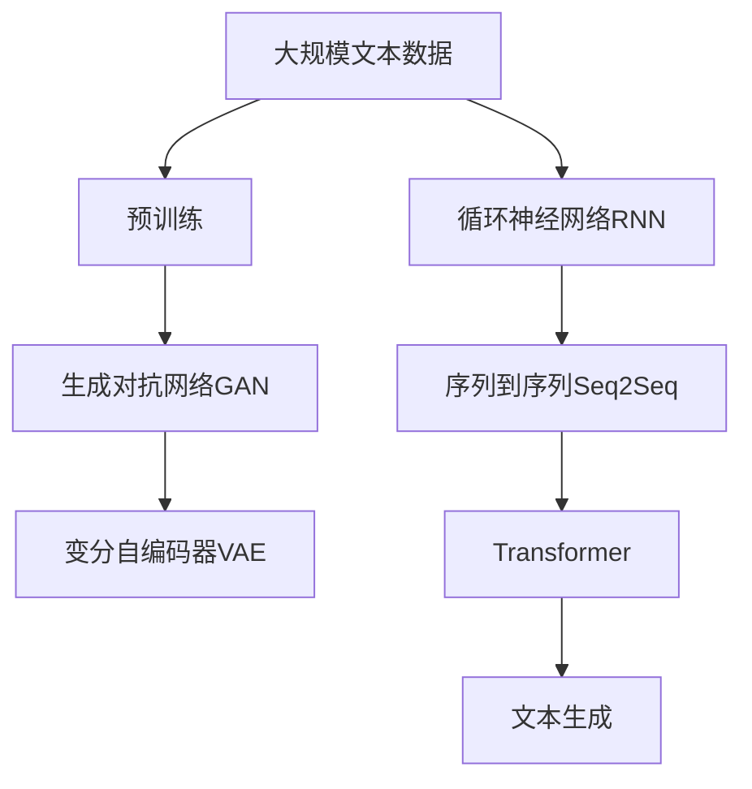
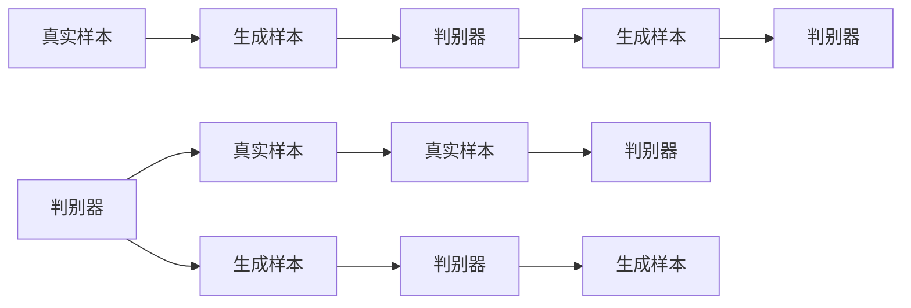
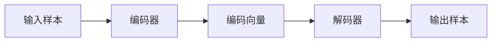
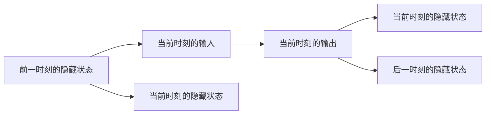
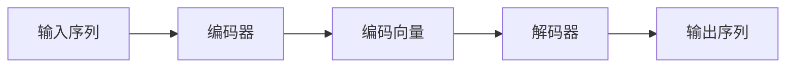
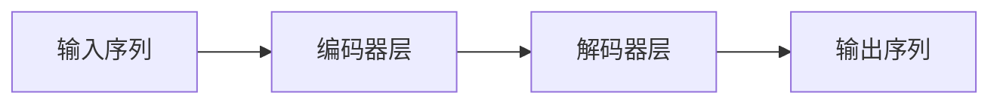
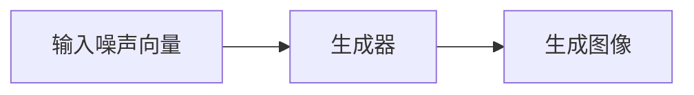

                 

# AIGC从入门到实战：超强的“文科状元”

## 1. 背景介绍

在人工智能(AI)的大潮中，生成对抗网络(GAN)、神经网络(NN)等技术已经取得了显著的进展，引领了AI领域的又一次浪潮。而生成式人工智能(AIGC，Artificial Intelligence Generated Content)作为AI的重要分支，也逐渐从实验室走向了工业应用。本文将通过深入浅出的语言，介绍AIGC从入门到实战的流程，带你一探“文科状元”的奥秘。

### 1.1 问题由来

“文科状元”（生成式AI）在近几年逐渐成为行业和学术界的热门话题。我们是否还记得，从前在高中阶段，文科学习常常以记忆和理解为主，考试成绩往往以作文或论述题的形式进行考察。但在今天，计算机通过生成式AI，几乎可以代替人完成各种文档写作、翻译、内容创作等任务，甚至在某些方面表现得比人还要出色。生成式AI的发展，已经成为推动社会进步和经济发展的重要驱动力。

在工业领域，生成式AI已经广泛应用于游戏开发、影视制作、广告创意、市场营销、新闻出版、医疗健康等多个方向，为各行各业提供了全新的解决方案。例如，在游戏领域，生成式AI已经可以用于角色自动生成、场景动态渲染、故事情节自动生成等任务，大大提升了游戏的创新度和玩家体验。

### 1.2 问题核心关键点

AIGC（生成式AI）的核心目标是通过训练数据集，让AI模型自动生成具有人类感知、理解和创造能力的新内容。AIGC的应用广泛，涵盖了文本、图像、视频、音频等多个领域，其技术实现依赖于深度学习、神经网络、自然语言处理（NLP）等技术。

核心概念包括：
- **生成对抗网络（GAN）**：一种可以生成逼真样本的模型。
- **变分自编码器（VAE）**：一种生成模型，能够学习数据的概率分布。
- **循环神经网络（RNN）**：用于处理序列数据的神经网络模型。
- **序列到序列（Seq2Seq）模型**：用于文本生成、翻译等任务。
- **Transformer模型**：一种高效的序列模型，用于机器翻译、文本生成等任务。

本文将通过这几个核心概念，循序渐进地带你了解AIGC的原理和应用。

### 1.3 问题研究意义

研究AIGC的生成式AI技术，对于拓展AI的应用范围，提升AI技术的普适性，加速AI技术的产业化进程，具有重要意义：

1. **降低开发成本**：生成式AI可以自动生成文本、图片、视频等创意内容，减少了人工创作的成本。
2. **提升创意质量**：通过AI模型生成的高质量内容，提升了创作作品的整体水平。
3. **加速开发进度**：生成式AI模型可以自动完成内容的创作，减少了人工创作所需的时间。
4. **带来技术创新**：生成式AI催生了更多基于生成模型的创新技术，如提示学习、少样本学习等。
5. **赋能产业升级**：生成式AI技术能够助力各行各业实现数字化转型升级，推动产业升级。

本文将详细讲解AIGC技术的原理和应用实践，帮助你了解这一技术的前沿进展。

## 2. 核心概念与联系

### 2.1 核心概念概述

要理解生成式AI技术，首先需要了解其核心概念及其联系：

1. **生成对抗网络（GAN）**：由Isola et al.提出，由生成器和判别器两个网络组成，通过对抗训练的方式生成逼真样本。GAN的核心理念是：生成器试图生成尽可能逼真的样本，而判别器试图区分真实样本和生成样本。通过这种对抗训练，生成器最终可以生成高质量的样本。

2. **变分自编码器（VAE）**：由Kingma et al.提出，用于生成低维编码后的样本，可以用于图像生成、文本生成等任务。VAE通过学习数据的概率分布，生成符合该分布的样本。

3. **循环神经网络（RNN）**：用于处理序列数据的神经网络模型，可以用于文本生成、语音识别等任务。RNN通过记忆上一时刻的状态，处理序列数据。

4. **序列到序列（Seq2Seq）模型**：用于文本生成、翻译等任务。Seq2Seq模型由编码器和解码器组成，编码器将输入序列编码成固定长度的向量，解码器将该向量生成目标序列。

5. **Transformer模型**：由Vaswani et al.提出，用于机器翻译、文本生成等任务。Transformer模型利用自注意力机制，实现了高效的序列建模。

这些核心概念共同构成了生成式AI技术的基础框架，使其能够应用于多种任务，生成高质量的内容。

### 2.2 概念间的关系

这些核心概念之间存在着紧密的联系，形成了生成式AI技术的完整生态系统。

**GAN与VAE**：GAN与VAE是两个重要的生成模型，GAN通过对抗训练生成逼真样本，而VAE通过学习数据的概率分布生成样本。两者都可以用于图像生成、文本生成等任务。

**RNN与Seq2Seq**：RNN主要用于序列数据的建模，而Seq2Seq模型则在此基础上，利用编码器和解码器生成新的序列数据。例如，Seq2Seq模型可以用于机器翻译，将源语言序列转换为目标语言序列。

**Transformer与Seq2Seq**：Transformer模型基于自注意力机制，可以高效地处理长序列，相较于传统的Seq2Seq模型，具有更高的训练效率和更优的性能。Transformer模型可以用于机器翻译、文本生成等任务。

通过这些核心概念之间的联系，生成式AI技术可以应用于图像生成、文本生成、语音生成等多个领域，提升内容的创作效率和质量。

### 2.3 核心概念的整体架构

最后，我们用一个综合的流程图来展示这些核心概念在大模型微调过程中的整体架构：



这个综合流程图展示了从预训练到生成模型的完整过程。大规模文本数据首先通过预训练模型进行学习，然后通过生成对抗网络GAN生成逼真样本，变分自编码器VAE生成高质量样本，循环神经网络RNN处理序列数据，序列到序列Seq2Seq模型生成新的序列数据，最终通过Transformer模型生成高质量的文本、图像等内容。

通过这些流程图，我们可以更清晰地理解生成式AI技术的工作原理和优化方向。

## 3. 核心算法原理 & 具体操作步骤
### 3.1 算法原理概述

生成式AI的算法原理主要基于深度学习和神经网络技术，通过训练生成模型，使其能够从输入数据中学习生成新内容的能力。

生成式AI主要包括以下几个关键步骤：
1. **数据准备**：收集、清洗、标注生成式AI所需的数据集，作为模型的训练和测试数据。
2. **模型训练**：选择合适的生成模型，如GAN、VAE、RNN、Seq2Seq、Transformer等，使用训练数据集对其进行训练。
3. **模型评估**：在验证集上评估训练模型的性能，根据评估结果调整模型参数。
4. **模型应用**：使用训练好的模型生成新的内容，满足实际应用需求。

### 3.2 算法步骤详解

以下我们将详细讲解生成式AI算法的详细步骤：

#### 3.2.1 数据准备

1. **数据收集**：收集生成式AI所需的数据集，如文本、图像、音频等。
2. **数据清洗**：清洗数据集，去除噪声、重复数据，确保数据质量。
3. **数据标注**：对数据进行标注，标注生成内容的目标、属性等信息，用于训练生成模型。

#### 3.2.2 模型训练

1. **选择合适的生成模型**：根据任务需求选择合适的生成模型，如GAN、VAE、RNN、Seq2Seq、Transformer等。
2. **模型初始化**：将模型参数随机初始化。
3. **模型训练**：使用训练数据集对模型进行训练，优化模型参数。

#### 3.2.3 模型评估

1. **评估指标**：选择合适的评估指标，如BLEU、ROUGE等，评估生成内容的准确性和质量。
2. **模型调整**：根据评估结果调整模型参数，重新训练模型。

#### 3.2.4 模型应用

1. **生成内容**：使用训练好的模型生成新的内容，如文本、图像、音频等。
2. **内容优化**：根据实际应用需求，对生成的内容进行优化，如语法修正、图像增强等。
3. **内容发布**：将生成的内容发布到目标平台上，供用户使用。

### 3.3 算法优缺点

生成式AI技术具有以下优点：
1. **高效**：通过深度学习技术，生成式AI可以快速生成高质量的内容。
2. **多领域应用**：生成式AI可以应用于文本生成、图像生成、视频生成等多个领域。
3. **灵活**：生成式AI可以根据不同需求，灵活调整生成模型。

但同时也存在一些缺点：
1. **数据依赖性强**：生成式AI的效果很大程度上取决于数据的质量和数量。
2. **模型复杂度高**：生成式AI模型的训练和调参复杂度较高。
3. **可解释性不足**：生成式AI模型的生成过程较为复杂，难以解释其生成逻辑。

### 3.4 算法应用领域

生成式AI技术已经广泛应用于多个领域，包括：

- **文本生成**：如自动写作、内容创作、文案生成等。生成式AI可以通过训练，生成符合语言规范、风格一致的文本内容。
- **图像生成**：如绘画、设计、广告创意等。生成式AI可以生成逼真、符合风格的高质量图像。
- **视频生成**：如电影制作、动画制作等。生成式AI可以生成逼真、连贯的视频内容。
- **音频生成**：如音乐创作、配音、语音合成等。生成式AI可以生成符合情感、风格的高质量音频内容。
- **虚拟现实（VR）和增强现实（AR）**：生成式AI可以生成逼真、互动的虚拟和增强现实内容，提升用户体验。

此外，生成式AI技术还可以应用于游戏开发、教育培训、医疗健康等多个领域，为这些行业带来新的应用场景。

## 4. 数学模型和公式 & 详细讲解 & 举例说明
### 4.1 数学模型构建

生成式AI的数学模型主要基于深度学习技术，包括生成对抗网络（GAN）、变分自编码器（VAE）、循环神经网络（RNN）、序列到序列（Seq2Seq）模型等。

#### 4.1.1 生成对抗网络（GAN）

GAN由生成器（Generator）和判别器（Discriminator）两个网络组成，如图：



生成器试图生成尽可能逼真的样本，判别器试图区分真实样本和生成样本。通过对抗训练，生成器最终可以生成高质量的样本。

#### 4.1.2 变分自编码器（VAE）

VAE由编码器（Encoder）和解码器（Decoder）两个网络组成，如图：



VAE通过学习数据的概率分布，生成符合该分布的样本。

#### 4.1.3 循环神经网络（RNN）

RNN如图：



RNN通过记忆上一时刻的状态，处理序列数据。

#### 4.1.4 序列到序列（Seq2Seq）模型

Seq2Seq模型由编码器和解码器组成，如图：



Seq2Seq模型用于文本生成、翻译等任务，通过编码器将输入序列编码成固定长度的向量，解码器将该向量生成目标序列。

#### 4.1.5 Transformer模型

Transformer模型如图：



Transformer模型基于自注意力机制，实现了高效的序列建模，广泛应用于机器翻译、文本生成等任务。

### 4.2 公式推导过程

以下我们将详细讲解生成对抗网络（GAN）、变分自编码器（VAE）、循环神经网络（RNN）、序列到序列（Seq2Seq）模型、Transformer模型的公式推导过程：

#### 4.2.1 生成对抗网络（GAN）

GAN由生成器（Generator）和判别器（Discriminator）两个网络组成，其公式推导过程如图：


生成器的目标是最小化判别器无法区分生成样本和真实样本的概率，即：

$$\min_{G}\max_{D}\mathbb{E}_{\mathbf{x}\sim p_{\mathbf{x}}}\left[\log D\left(\mathbf{x}\right)\right]+\mathbb{E}_{\mathbf{z}\sim p_{\mathbf{z}}}\left[\log \left(1-D\left(G\left(\mathbf{z}\right)\right)\right)\right]$$

其中，$G$为生成器，$D$为判别器，$\mathbf{x}$为真实样本，$\mathbf{z}$为噪声向量，$p_{\mathbf{x}}$为真实样本分布，$p_{\mathbf{z}}$为噪声向量分布。

#### 4.2.2 变分自编码器（VAE）

VAE由编码器（Encoder）和解码器（Decoder）两个网络组成，其公式推导过程如图：


VAE通过学习数据的概率分布，生成符合该分布的样本。VAE的目标是最小化重构误差和KL散度：

$$\min_{\mu(\mathbf{z})}\max_{\sigma(\mathbf{z})}D_{KL}\left(q_{\mathbf{z}}\left(\mathbf{z}\right)||p_{\mathbf{z}}\right)+\mathbb{E}_{\mathbf{x}\sim p_{\mathbf{x}}}\left[\left\|\mathbf{x}-\mu\left(\sigma^{-1}\left(\mathbf{x}\right)\right)\right\|_{2}^{2}\right]$$

其中，$\mu(\mathbf{z})$和$\sigma(\mathbf{z})$分别为编码器输出的均值和方差，$q_{\mathbf{z}}(\mathbf{z})$为编码向量分布，$p_{\mathbf{z}}$为噪声向量分布，$p_{\mathbf{x}}$为真实样本分布。

#### 4.2.3 循环神经网络（RNN）

RNN如图：


RNN通过记忆上一时刻的状态，处理序列数据。RNN的目标是最大化序列的预测概率，即：

$$\max_{\mathbf{h}}\prod_{t}\log p\left(\mathbf{x}_{t}\mid \mathbf{x}_{<t}, \mathbf{h}_{t-1}\right)$$

其中，$\mathbf{x}_{t}$为序列的当前时刻样本，$\mathbf{x}_{<t}$为序列的前一时刻样本，$\mathbf{h}_{t-1}$为前一时刻的隐藏状态，$p\left(\mathbf{x}_{t}\mid \mathbf{x}_{<t}, \mathbf{h}_{t-1}\right)$为序列的预测概率。

#### 4.2.4 序列到序列（Seq2Seq）模型

Seq2Seq模型由编码器和解码器组成，如图：


Seq2Seq模型用于文本生成、翻译等任务，通过编码器将输入序列编码成固定长度的向量，解码器将该向量生成目标序列。Seq2Seq模型的目标是最小化预测误差，即：

$$\min_{\theta}\sum_{i}\left(\mathbf{x}_{i}-\hat{\mathbf{x}}_{i}\right)^{2}$$

其中，$\theta$为模型参数，$\mathbf{x}_{i}$为输入序列的当前时刻样本，$\hat{\mathbf{x}}_{i}$为输出序列的当前时刻样本。

#### 4.2.5 Transformer模型

Transformer模型如图：


Transformer模型基于自注意力机制，实现了高效的序列建模。Transformer的目标是最小化序列的预测误差，即：

$$\min_{\theta}\sum_{i}\left(\mathbf{x}_{i}-\hat{\mathbf{x}}_{i}\right)^{2}$$

其中，$\theta$为模型参数，$\mathbf{x}_{i}$为输入序列的当前时刻样本，$\hat{\mathbf{x}}_{i}$为输出序列的当前时刻样本。

### 4.3 案例分析与讲解

下面我们以图像生成为例，讲解生成式AI的实际应用场景。

#### 4.3.1 图像生成案例

图像生成是生成式AI的重要应用之一，如图：



生成器的目标是最小化判别器无法区分生成图像和真实图像的概率，即：

$$\min_{G}\max_{D}\mathbb{E}_{\mathbf{x}\sim p_{\mathbf{x}}}\left[\log D\left(\mathbf{x}\right)\right]+\mathbb{E}_{\mathbf{z}\sim p_{\mathbf{z}}}\left[\log \left(1-D\left(G\left(\mathbf{z}\right)\right)\right)\right]$$

其中，$G$为生成器，$D$为判别器，$\mathbf{x}$为真实图像，$\mathbf{z}$为噪声向量，$p_{\mathbf{x}}$为真实图像分布，$p_{\mathbf{z}}$为噪声向量分布。

#### 4.3.2 图像生成实现

下面我们以GAN为例，使用PyTorch实现图像生成。

```python
import torch
import torch.nn as nn
import torch.optim as optim
import torchvision.datasets as dset
import torchvision.transforms as transforms
import torchvision.utils as vutils

# 定义生成器
class Generator(nn.Module):
    def __init__(self):
        super(Generator, self).__init__()
        self.encoder = nn.Sequential(
            nn.ConvTranspose2d(100, 256, 4, 1, 0, bias=False),
            nn.BatchNorm2d(256),
            nn.ReLU(True),
            nn.ConvTranspose2d(256, 128, 4, 2, 1, bias=False),
            nn.BatchNorm2d(128),
            nn.ReLU(True),
            nn.ConvTranspose2d(128, 64, 4, 2, 1, bias=False),
            nn.BatchNorm2d(64),
            nn.ReLU(True),
            nn.ConvTranspose2d(64, 3, 4, 2, 1, bias=False),
            nn.Tanh()
        )
        
    def forward(self, input):
        return self.encoder(input)

# 定义判别器
class Discriminator(nn.Module):
    def __init__(self):
        super(Discriminator, self).__init__()
        self.encoder = nn.Sequential(
            nn.Conv2d(3, 64, 4, 2, 1, bias=False),
            nn.LeakyReLU(0.2, inplace=True),
            nn.Conv2d(64, 128, 4, 2, 1, bias=False),
            nn.BatchNorm2d(128),
            nn.LeakyReLU(0.2, inplace=True),
            nn.Conv2d(128, 256, 4, 2, 1, bias=False),
            nn.BatchNorm2d(256),
            nn.LeakyReLU(0.2, inplace=True),
            nn.Conv2d(256, 1, 4, 1, 0, bias=False),
            nn.Sigmoid()
        )
        
    def forward(self, input):
        return self.encoder(input)

# 定义生成对抗网络（GAN）
class GAN(nn.Module):
    def __init__(self, generator, discriminator):
        super(GAN, self).__init__()
        self.generator = generator
        self.discriminator = discriminator
        
    def forward(self, input):
        fake_images = self.generator(input)
        real_images = self.discriminator(input)
        return fake_images, real_images

# 定义损失函数
criterion = nn.BCELoss()

# 定义优化器
optimizer_G = optim.Adam(generator.parameters(), lr=0.0002, betas=(0.5, 0.999))
optimizer_D = optim.Adam(discriminator.parameters(), lr=0.0002, betas=(0.5, 0.999))

# 定义训练函数
def train_GAN(generator, discriminator, criterion, optimizer_G, optimizer_D, device, batch_size):
    real_images = dset.CIFAR10(root='./data', download=True, transform=transforms.ToTensor()).train_data.to(device)
    for epoch in range(epochs):
        for i, data in enumerate(train_loader, 0):
            optimizer_D.zero_grad()
            batch_size = min(batch_size, real_images.size(0))
            real_images = real_images[i:i+batch_size].to(device)
            z = torch.randn(batch_size, 100, 1, 1).to(device)
            fake_images = generator(z)
            real_images = real_images.view(real_images.size(0), 3, 32, 32).to(device)
            real_labels = torch.ones(batch_size, 1).to(device)
            fake_labels = torch.zeros(batch_size, 1).to(device)
            real_loss = criterion(discriminator(real_images), real_labels)
            fake_loss = criterion(discriminator(fake_images.detach()), fake_labels)
            D_loss = real_loss + fake_loss
            D_loss.backward()
            optimizer_D.step()
            optimizer_G.zero_grad()
            z = torch.randn(batch_size, 100, 1, 1).to(device)
            fake_images = generator(z)
            real_loss = criterion(discriminator(real_images), real_labels)
            G_loss = criterion(discriminator(fake_images), real_labels)
            G_loss.backward()
            optimizer_G.step()
            if (i+1) % 100 == 0:
                print('Epoch [{}/{}], Step [{}/{}], D Loss: {:.4f}, G Loss: {:.4f}'.format(epoch+1, epochs, i+1, len(train_loader), D_loss.item(), G_loss.item()))
            if (i+1) % 500 == 0:
                save_image(fake_images.data.cpu(), 'images/GAN_{}.png'.format(i))
```

通过以上代码，我们可以使用PyTorch实现生成对抗网络（GAN），生成逼真的图像样本。

## 5. 项目实践：代码实例和详细解释说明
### 5.1 开发环境搭建

在进行生成式AI项目实践前，我们需要准备好开发环境。以下是使用Python进行PyTorch开发的环境配置流程：

1. 安装Anaconda：从官网下载并安装Anaconda，用于创建独立的Python环境。

2. 创建并激活虚拟环境：
```bash
conda create -n pytorch-env python=3.8 
conda activate pytorch-env
```

3. 安装PyTorch：根据CUDA版本，从官网获取对应的安装命令。例如：
```bash
conda install pytorch torchvision torchaudio cudatoolkit=11.1 -c pytorch -c conda-forge
```

4. 安装相关工具包：
```bash
pip install numpy pandas scikit-learn matplotlib tqdm j

