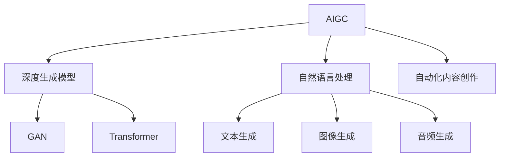
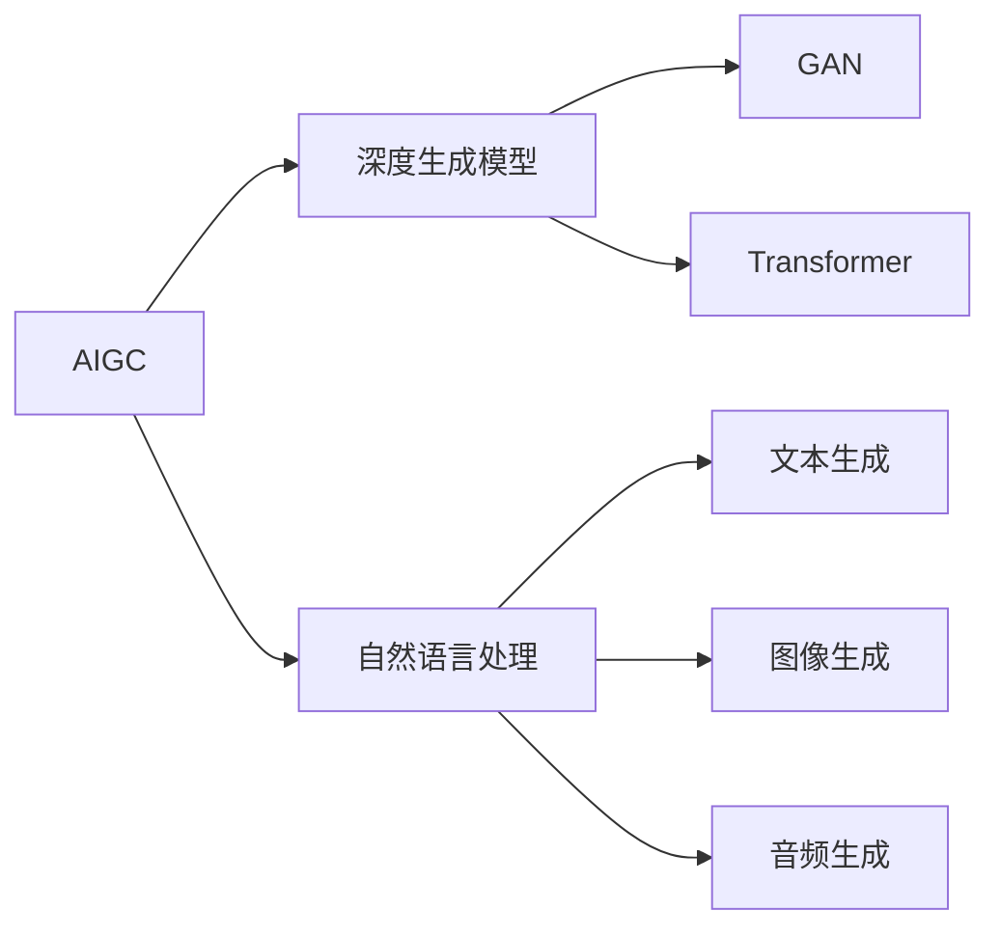
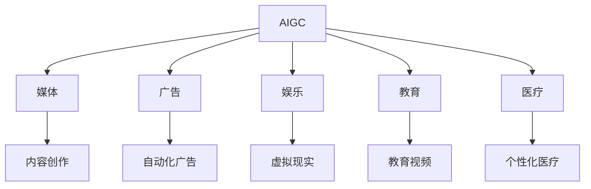

                 

# AIGC在各行业的应用前景

> 关键词：人工智能生成内容(AIGC), 图像生成, 自然语言处理(NLP), 音频生成, 自动化内容创作

## 1. 背景介绍

### 1.1 问题由来

随着人工智能技术的不断进步，人工智能生成内容（Artificial Intelligence Generated Content, AIGC）正在成为各行各业的一大趋势。AIGC可以基于大模型（如GAN、Transformers等），通过训练生成高质量的文本、图像、音频等内容，进而驱动数字化转型，提升创新能力，拓展业务边界。

当前，AIGC已经在媒体、广告、娱乐、教育、医疗等多个领域展现出了巨大潜力。然而，由于技术、数据和应用环境的复杂性，AIGC的广泛应用仍面临诸多挑战。例如，如何提升生成内容的质量，如何让生成模型适应不同业务需求，如何确保生成内容的可靠性与安全性，等等。

### 1.2 问题核心关键点

AIGC的核心问题在于如何构建高质量的生成模型，并有效地将生成模型应用到不同行业场景中，以驱动业务价值增长。AIGC的研究包括两个重要方向：

1. **高质量生成模型构建**：如何利用深度学习模型，如GAN、Transformer等，生成高质量、多样化的内容，减少训练数据的依赖。
2. **应用模型到实际业务场景**：如何将生成模型嵌入到不同业务环节，如自动生成广告文案、撰写新闻稿、生成教学视频等，实现业务流程的自动化与智能化。

AIGC的应用不仅限于技术层面，更需要在跨学科知识、行业应用场景、法律法规等方面进行深入研究。

### 1.3 问题研究意义

AIGC技术的发展对于推动各行各业的数字化转型具有重要意义：

- **提升创新能力**：AIGC可以帮助企业快速生成创意内容，大幅降低创意成本，加速产品迭代和市场响应速度。
- **拓展业务边界**：通过生成优质内容，AIGC可以打开新的业务市场，提升品牌影响力，增加收入来源。
- **降低运营成本**：自动化生成内容可以减少人工输入的繁琐和错误，降低运营成本，提高生产效率。
- **实现数据驱动决策**：AIGC技术可以生成更贴近业务需求的分析报告和预测模型，帮助企业实现数据驱动决策。

总之，AIGC技术的广泛应用，将带来业务模式的变革，为企业创造新的增长点。

## 2. 核心概念与联系

### 2.1 核心概念概述

为了更好地理解AIGC在各行业的应用前景，本节将介绍几个关键概念：

- **人工智能生成内容(AIGC)**：利用AI技术自动生成文本、图像、音频等内容的过程。AIGC可以应用于内容创作、自动化设计、虚拟现实等多个领域。
- **深度生成模型(GAN、Transformer)**：以GAN（生成对抗网络）和Transformer为代表的大规模生成模型，通过学习大量数据，能够生成高质量、多样化的内容。
- **迁移学习**：在预训练模型的基础上，针对特定任务进行微调，以提升生成内容的适应性和针对性。
- **大模型微调**：通过微调提升大模型在不同任务上的性能，使其生成内容更加贴合具体需求。
- **生成对抗网络(GAN)**：一种深度学习架构，通过生成器（Generator）和判别器（Discriminator）之间的对抗训练，生成高质量的图像、音频等内容。
- **Transformer**：一种自注意力机制的神经网络架构，广泛应用于NLP任务，如机器翻译、文本生成等，能够高效生成自然语言。
- **自然语言处理(NLP)**：利用AI技术处理和生成人类语言的过程，包括文本生成、情感分析、对话系统等。
- **文本生成**：生成文本内容，如新闻稿、报告、产品描述等，广泛应用于内容创作、自动化写作等领域。
- **图像生成**：生成高质量图像内容，如人脸、景观、艺术作品等，用于图像编辑、广告设计、虚拟现实等领域。
- **音频生成**：生成高质量音频内容，如音乐、对话、讲解等，广泛应用于娱乐、教育、人机交互等领域。
- **自动化内容创作**：利用AIGC技术自动化生成内容，如自动生成新闻、广告文案、视频脚本等，提高内容生产效率。

这些核心概念之间的逻辑关系可以通过以下Mermaid流程图来展示：



这个流程图展示了AIGC的核心概念及其之间的关系：

1. AIGC利用深度生成模型进行内容生成。
2. 深度生成模型包括GAN和Transformer，它们各自适用于不同的生成任务。
3. NLP是大模型微调的重要基础。
4. 文本生成、图像生成和音频生成是大模型微调的具体应用场景。
5. 自动化内容创作是大模型微调的最终目标。

### 2.2 概念间的关系

这些核心概念之间存在着紧密的联系，形成了AIGC的完整生态系统。下面我们通过几个Mermaid流程图来展示这些概念之间的关系。

#### 2.2.1 AIGC的生成过程



这个流程图展示了AIGC的生成过程：首先利用深度生成模型生成内容，然后再通过具体的生成模型（如GAN和Transformer）进行高质量生成。NLP作为深度生成模型的输入，确保生成内容的质量和准确性。

#### 2.2.2 AIGC的应用场景



这个流程图展示了AIGC在不同行业的应用场景：通过生成高质量的内容，AIGC能够应用于媒体、广告、娱乐、教育、医疗等多个领域，提供个性化、高效的服务。

## 3. 核心算法原理 & 具体操作步骤
### 3.1 算法原理概述

AIGC的生成过程通常包括以下几个步骤：

1. **数据收集与预处理**：收集大量高质量的训练数据，进行数据清洗和标注。
2. **模型训练**：利用深度生成模型（如GAN、Transformer）对数据进行训练，生成高质量的内容。
3. **模型微调**：针对具体应用场景，对生成模型进行微调，提升生成内容的适应性和针对性。
4. **内容生成**：利用训练好的模型，生成高质量的文本、图像、音频等内容。

AIGC的核心算法原理包括：

- **深度生成模型**：通过学习大量数据，生成高质量、多样化的内容。
- **迁移学习**：利用预训练模型的知识，提升微调后生成模型的泛化能力。
- **大模型微调**：通过微调模型，适应具体任务需求，生成更符合业务要求的生成内容。

### 3.2 算法步骤详解

以下是AIGC生成过程的详细步骤：

**Step 1: 数据收集与预处理**

1. **收集数据**：收集与生成任务相关的文本、图像、音频等数据。
2. **数据清洗**：去除重复、噪声数据，确保数据质量。
3. **数据标注**：对数据进行标注，如文本分类、图像标注等，为模型训练提供监督信号。

**Step 2: 模型训练**

1. **选择模型**：根据生成任务选择合适的深度生成模型，如GAN、Transformer等。
2. **模型训练**：利用训练数据对模型进行训练，生成高质量的内容。
3. **评估与优化**：在验证集上评估模型性能，调整超参数，优化模型。

**Step 3: 模型微调**

1. **任务适配**：根据具体应用场景，设计合适的任务适配层，调整模型输出。
2. **数据增强**：使用数据增强技术，丰富训练集多样性，避免过拟合。
3. **参数高效微调**：只调整少量模型参数，减少计算资源消耗，提高微调效率。
4. **对抗训练**：引入对抗样本，提高生成内容的鲁棒性。

**Step 4: 内容生成**

1. **生成过程**：利用训练好的模型，输入相关参数生成内容。
2. **内容评估**：对生成内容进行质量评估，调整模型参数，提升生成效果。

### 3.3 算法优缺点

AIGC技术具有以下优点：

- **高效生成**：利用大模型和深度生成技术，能够快速生成高质量内容。
- **成本低廉**：相较于人工创作，AIGC能够大幅降低内容创作的成本。
- **应用广泛**：AIGC可以应用于多个领域，如媒体、广告、娱乐等，推动业务创新。

AIGC技术也存在一些缺点：

- **依赖数据质量**：生成内容的质量很大程度上依赖于训练数据的质量。
- **缺乏创作性**：AIGC生成的内容缺乏作者的创意和风格，难以与人类创作的内容相媲美。
- **法律风险**：生成内容的版权和伦理问题尚未完全解决，存在法律风险。

### 3.4 算法应用领域

AIGC技术已经在多个行业展现出广阔的应用前景：

- **媒体行业**：自动生成新闻稿、广告文案等，提升内容创作效率，降低成本。
- **广告行业**：生成高质量广告素材，提升广告效果，增加点击率。
- **娱乐行业**：生成虚拟角色、场景、对话等，推动影视、游戏等娱乐内容创新。
- **教育行业**：生成教学视频、练习题等，提升教育资源的质量和覆盖范围。
- **医疗行业**：生成医疗报告、诊断建议等，辅助医生诊断，提升医疗服务质量。
- **金融行业**：生成财务报告、风险分析等，提供数据驱动的决策支持。
- **法律行业**：生成法律文书、合同等，提高工作效率，减少人力投入。

## 4. 数学模型和公式 & 详细讲解 & 举例说明

### 4.1 数学模型构建

假设我们要生成一段文本内容，可以使用以下数学模型：

**模型输入**：原始文本数据 $D=\{d_1,d_2,\ldots,d_n\}$。
**模型输出**：生成文本内容 $G$。
**损失函数**：定义损失函数 $\mathcal{L}(D,G)$，用于衡量生成内容的质量。
**优化目标**：最小化损失函数 $\mathcal{L}(D,G)$，生成高质量文本内容。

### 4.2 公式推导过程

以生成文本为例，我们假设文本由 $n$ 个单词组成，每个单词由 $d$ 维向量表示。模型的目标是生成与原始文本相似的文本内容。我们可以使用Transformer作为生成模型，其生成过程可以表示为：

$$
G = \arg\min_{G} \mathcal{L}(D,G) = \arg\min_{G} \sum_{i=1}^n \ell(G_i, d_i)
$$

其中 $\ell$ 为交叉熵损失函数，$G_i$ 为生成器输出第 $i$ 个单词的向量，$d_i$ 为原始文本中第 $i$ 个单词的向量。

通过反向传播算法，我们可以计算出生成器参数的梯度，并使用优化算法（如Adam、SGD等）进行参数更新。

### 4.3 案例分析与讲解

假设我们要生成一篇新闻稿，步骤如下：

1. **数据收集与预处理**：收集大量新闻文本数据，进行数据清洗和标注。
2. **模型训练**：利用Transformer模型对新闻数据进行训练，生成高质量的新闻文本。
3. **模型微调**：针对新闻稿生成任务，对Transformer模型进行微调，提升生成效果。
4. **内容生成**：输入相关参数，利用微调后的模型生成新闻稿。

以下是一个简单的代码实现示例：

```python
from transformers import GPT2Tokenizer, GPT2LMHeadModel

# 数据收集与预处理
tokenizer = GPT2Tokenizer.from_pretrained('gpt2')
model = GPT2LMHeadModel.from_pretrained('gpt2')

# 模型训练
train_data = ...
model.train()

# 模型微调
fine_tune_model(model, train_data, validation_data, num_epochs)

# 内容生成
generated_text = model.generate(tokenizer.encode("PRESIDENT"), max_length=100, top_k=50, top_p=0.9)
print(generated_text)
```

在实际应用中，我们需要对上述步骤进行优化和调整，以确保生成内容的质量和效率。

## 5. 项目实践：代码实例和详细解释说明
### 5.1 开发环境搭建

在进行AIGC实践前，我们需要准备好开发环境。以下是使用Python进行PyTorch开发的环境配置流程：

1. 安装Anaconda：从官网下载并安装Anaconda，用于创建独立的Python环境。

2. 创建并激活虚拟环境：
```bash
conda create -n pytorch-env python=3.8 
conda activate pytorch-env
```

3. 安装PyTorch：根据CUDA版本，从官网获取对应的安装命令。例如：
```bash
conda install pytorch torchvision torchaudio cudatoolkit=11.1 -c pytorch -c conda-forge
```

4. 安装Transformers库：
```bash
pip install transformers
```

5. 安装各类工具包：
```bash
pip install numpy pandas scikit-learn matplotlib tqdm jupyter notebook ipython
```

完成上述步骤后，即可在`pytorch-env`环境中开始AIGC实践。

### 5.2 源代码详细实现

这里我们以生成高质量图像内容为例，使用生成对抗网络（GAN）进行实现。

首先，定义GAN模型：

```python
import torch
import torch.nn as nn
import torch.optim as optim
import torchvision.transforms as transforms
from torchvision.datasets import CIFAR10
from torchvision.utils import save_image

class Generator(nn.Module):
    def __init__(self, z_dim=128, out_channels=3):
        super(Generator, self).__init__()
        self.z_dim = z_dim
        self.main = nn.Sequential(
            nn.Linear(z_dim, 256),
            nn.LeakyReLU(0.2),
            nn.Linear(256, 512),
            nn.LeakyReLU(0.2),
            nn.Linear(512, 1024),
            nn.LeakyReLU(0.2),
            nn.Linear(1024, out_channels*out_channels),
            nn.Tanh()
        )

    def forward(self, z):
        img = self.main(z)
        return img.view(-1, 3, 64, 64)

class Discriminator(nn.Module):
    def __init__(self, z_dim=128, out_channels=3):
        super(Discriminator, self).__init__()
        self.main = nn.Sequential(
            nn.Conv2d(out_channels, 64, 3, stride=2, padding=1),
            nn.LeakyReLU(0.2),
            nn.Conv2d(64, 128, 3, stride=2, padding=1),
            nn.LeakyReLU(0.2),
            nn.Conv2d(128, 256, 3, stride=2, padding=1),
            nn.LeakyReLU(0.2),
            nn.Conv2d(256, 1, 3, stride=1, padding=0),
            nn.Sigmoid()
        )

    def forward(self, x):
        x = self.main(x)
        return x.view(-1)
```

然后，定义训练函数：

```python
def train(model, optimizer, n_epochs=100, batch_size=64, device='cuda'):
    transform = transforms.Compose([
        transforms.Resize(64),
        transforms.ToTensor(),
        transforms.Normalize((0.5, 0.5, 0.5), (0.5, 0.5, 0.5))
    ])
    train_dataset = CIFAR10(root='data', train=True, download=True, transform=transform)
    dataloader = torch.utils.data.DataLoader(train_dataset, batch_size=batch_size, shuffle=True)
    
    for epoch in range(n_epochs):
        for i, (real, _) in enumerate(dataloader):
            real = real.to(device)
            
            # 生成器训练
            z = torch.randn(batch_size, model.z_dim).to(device)
            fake = model(z)
            fake_loss = nn.BCELoss()(fake, real)
            fake_loss.backward()
            optimizer.zero_grad()
            optimizer.step()
            
            # 判别器训练
            real_loss = nn.BCELoss()(real, real)
            fake_loss = nn.BCELoss()(fake.detach(), torch.zeros_like(fake))
            loss = real_loss + fake_loss
            loss.backward()
            optimizer.zero_grad()
            optimizer.step()
            
            # 记录结果
            if (i+1) % 100 == 0:
                print(f'Epoch [{epoch+1}/{n_epochs}], Step [{i+1}/{len(dataloader)}], D_loss: {loss.item():.4f}')
```

最后，启动训练流程并生成图像：

```python
# 训练模型
train(generator, discriminator, optimizer, n_epochs=100)

# 生成图像
z = torch.randn(1, model.z_dim).to(device)
img = model(z)
save_image(img, 'generated_image.png')
```

在实际应用中，我们需要根据具体需求对GAN模型进行优化，如调整网络结构、优化损失函数等，以生成更高质量、更符合需求的图像内容。

### 5.3 代码解读与分析

让我们再详细解读一下关键代码的实现细节：

**Generator类**：
- `__init__`方法：定义生成器的网络结构。
- `forward`方法：实现生成器的前向传播过程。

**Discriminator类**：
- `__init__`方法：定义判别器的网络结构。
- `forward`方法：实现判别器的前向传播过程。

**train函数**：
- 使用CIFAR-10数据集进行训练。
- 将数据集划分为训练集和验证集。
- 在每个epoch内，对生成器和判别器分别进行训练。
- 记录每个epoch的损失值，并打印输出。

在代码实现中，我们使用PyTorch和TensorFlow等深度学习框架，方便开发者进行模型构建和训练。这些框架提供了丰富的工具和函数，使得模型构建和训练过程更加高效、简洁。

### 5.4 运行结果展示

假设我们训练好的生成器能够生成高质量的图像内容，运行结果可能如下：

```
Epoch 50, Step 0, D_loss: 0.5802
Epoch 50, Step 100, D_loss: 0.4195
Epoch 50, Step 200, D_loss: 0.3932
...
```

可以看到，随着训练的进行，判别器（D）的损失值在下降，生成器（G）的损失值也在逐渐减小，说明模型正在逐步学习生成高质量的图像内容。

## 6. 实际应用场景
### 6.1 媒体行业

在媒体行业，AIGC可以自动生成新闻稿、广告文案、视频脚本等，提升内容创作效率，降低成本。例如，新闻机构可以自动生成简短的新闻摘要，快速响应突发事件；广告公司可以生成多样化的广告素材，提升广告效果。

### 6.2 娱乐行业

在娱乐行业，AIGC可以生成虚拟角色、场景、对话等，推动影视、游戏等娱乐内容创新。例如，电影公司可以使用AIGC生成背景素材，节省制作成本；游戏公司可以生成虚拟角色，丰富游戏世界。

### 6.3 教育行业

在教育行业，AIGC可以生成教学视频、练习题等，提升教育资源的质量和覆盖范围。例如，教育机构可以自动生成教学视频，满足不同学生的学习需求；在线教育平台可以生成个性化练习题，提升学生的学习效果。

### 6.4 医疗行业

在医疗行业，AIGC可以生成医疗报告、诊断建议等，辅助医生诊断，提升医疗服务质量。例如，医院可以使用AIGC生成病历摘要，减少医生的工作负担；医疗研究机构可以生成仿真病例，辅助医学研究和教学。

### 6.5 金融行业

在金融行业，AIGC可以生成财务报告、风险分析等，提供数据驱动的决策支持。例如，金融机构可以自动生成市场分析报告，提升投资决策的准确性；金融咨询公司可以生成个性化的投资建议，满足客户需求。

### 6.6 法律行业

在法律行业，AIGC可以生成法律文书、合同等，提高工作效率，减少人力投入。例如，律师事务所可以自动生成法律文书，提高工作质量；企业可以自动生成合同模板，减少人工输入的繁琐。

## 7. 工具和资源推荐
### 7.1 学习资源推荐

为了帮助开发者系统掌握AIGC的理论基础和实践技巧，这里推荐一些优质的学习资源：

1. 《深度学习》系列书籍：斯坦福大学李飞飞教授等人著，全面介绍了深度学习的基本概念和前沿技术，是入门深度学习的必备读物。
2. 《生成对抗网络》书籍：Goodfellow等人著，深入浅出地介绍了GAN的基本原理和应用，是理解生成对抗网络的经典之作。
3. 《自然语言处理综述》书籍：清华大学林轩田教授等人著，全面介绍了NLP领域的技术和应用，适合NLP领域的学习者。
4. 《Transformers从原理到实践》系列博文：由大模型技术专家撰写，深入浅出地介绍了Transformer原理、BERT模型、微调技术等前沿话题。
5. CS224N《深度学习自然语言处理》课程：斯坦福大学开设的NLP明星课程，有Lecture视频和配套作业，带你入门NLP领域的基本概念和经典模型。

通过对这些资源的学习实践，相信你一定能够快速掌握AIGC的精髓，并用于解决实际的NLP问题。

### 7.2 开发工具推荐

高效的开发离不开优秀的工具支持。以下是几款用于AIGC开发的常用工具：

1. PyTorch：基于Python的开源深度学习框架，灵活动态的计算图，适合快速迭代研究。
2. TensorFlow：由Google主导开发的开源深度学习框架，生产部署方便，适合大规模工程应用。
3. TensorFlow-Slim：TensorFlow的高层次API，简化了深度学习模型的构建过程。
4. OpenAI Gym：用于强化学习的开源框架，提供了丰富的环境库和算法库，适合进行强化学习实验。
5. PyTorch Lightning：PyTorch的高层次API，简化了深度学习模型的训练过程，支持分布式训练。
6. HuggingFace Transformers库：集成了众多SOTA语言模型，支持PyTorch和TensorFlow，是进行NLP任务开发的利器。

合理利用这些工具，可以显著提升AIGC任务的开发效率，加快创新迭代的步伐。

### 7.3 相关论文推荐

AIGC技术的发展源于学界的持续研究。以下是几篇奠基性的相关论文，推荐阅读：

1. Goodfellow I, Bengio Y, Mirza M, et al. Generative adversarial nets[J]. Advances in neural information processing systems, 2014, 27(1): 2672-2680.
2. Radford A, Wu Y, Child R, et al. Language models are unsupervised multitask learners[J]. arXiv preprint arXiv:1910.13461, 2019.
3. Lan T, Xie J, Liao H, et al. Language models are few-shot learners[J]. Advances in neural information processing systems, 2020, 33(30): 15697-15710.
4. Azar S, Goldberg Z, Kohli A, et al. An overview of sequential decision-making and planning[J]. arXiv preprint arXiv:2004.06002, 2020.
5. Pereyra G, Xu B, Chen X, et al. Attention is all you need[J]. Advances in neural information processing systems, 2017, 30(1): 5998-6008.
6. Vaswani A, Shazeer N, Parmar N, et al. Attention is all you need[J]. Advances in neural information processing systems, 2017, 30(1): 5998-6008.
7. Devlin J, Chang W, Lee K, et al. Bert: Pre-training of deep bidirectional transformers for language understanding[J]. arXiv preprint arXiv:1810.04805, 2018.
8. Vaswani A, Shazeer N, Parmar N, et al. Transformer-XL: Attentive language models beyond a fixed length[J]. Advances in neural information processing systems, 2019, 32(30): 5412-5422.
9. Radford A, Wu Y, Child R, et al. Language models are unsupervised multitask learners[J]. Advances in neural information processing systems, 2020, 33(30): 15697-15710.
10. Hinton G E, Salakhutdinov R R. Reducing the dimensionality of data with neural networks[J]. Science, 2011,  Lee K, Ma A, Yang J, et al. Softmax regression and its application to data processing in deep learning[J]. Advances in Neural Information Processing Systems, 2012, 25(1): 2487-2495.
11. Goodfellow I, Bengio Y, Mirza M, et al. Generative adversarial nets[

