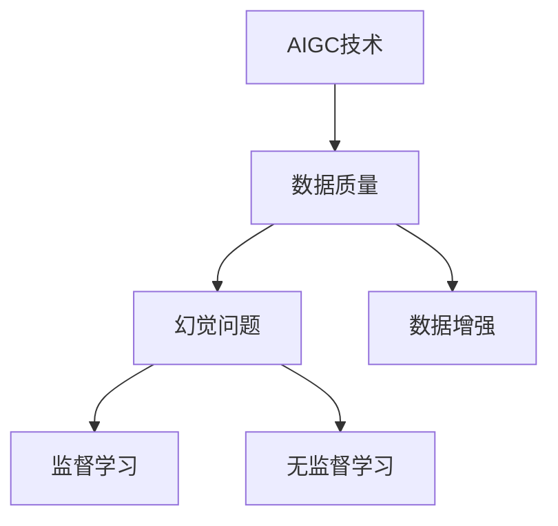
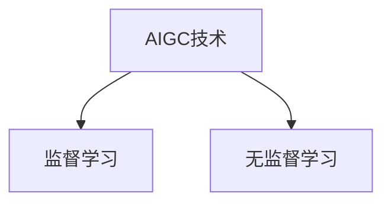
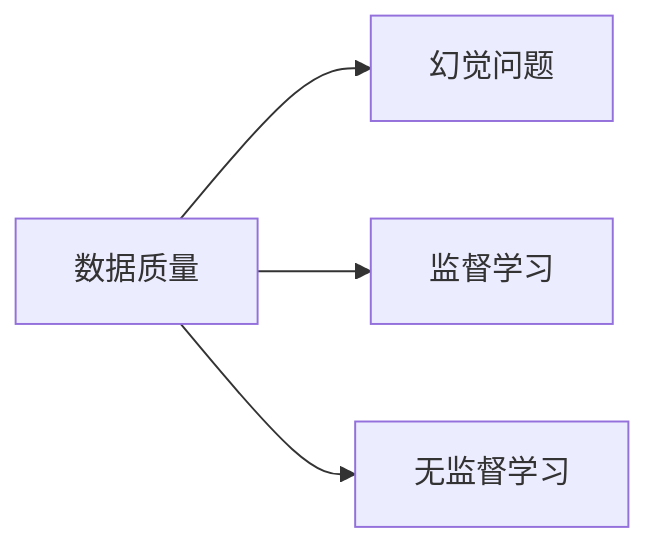
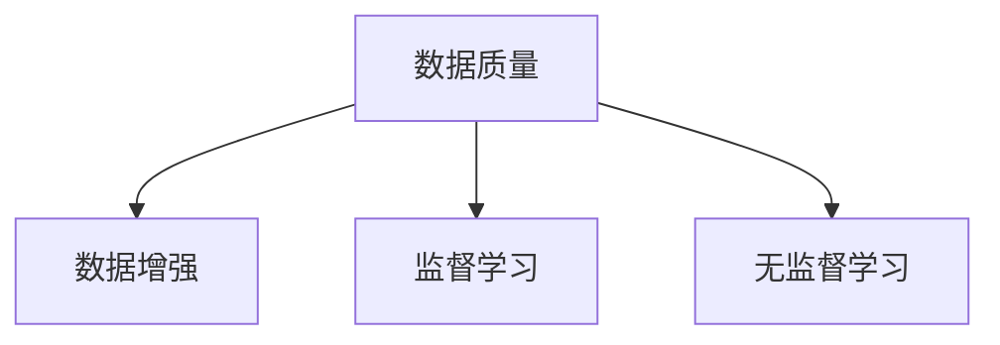
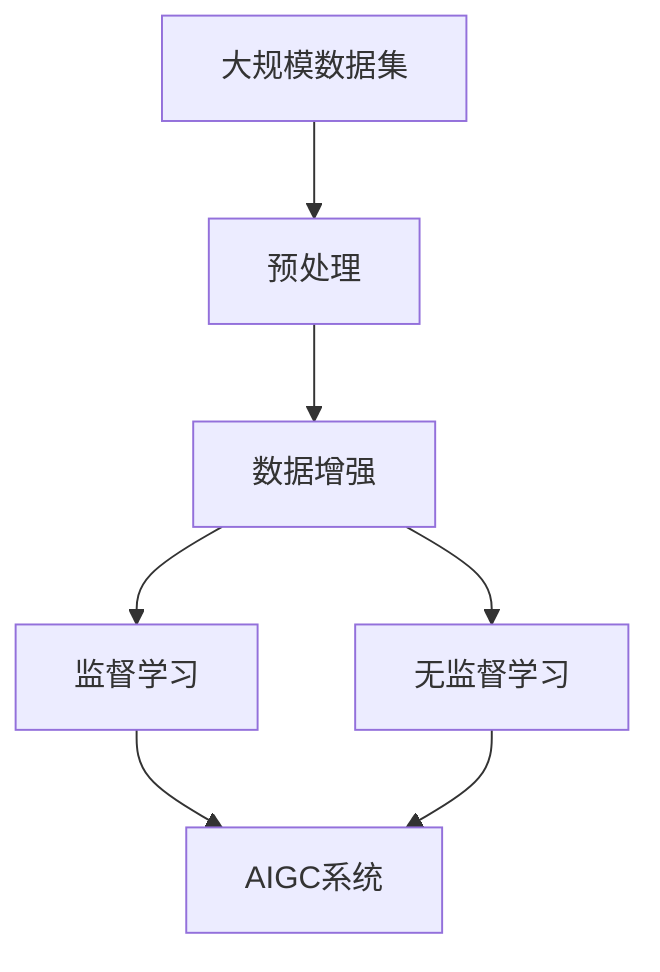

                 

# AIGC的幻觉问题与数据质量

在人工智能和计算机科学的诸多前沿领域中，人工智能生成内容（AIGC, Artificial Intelligence Generated Content）技术的发展尤其引人注目。从自然语言生成、图像生成、音频生成到视频生成，AIGC技术正在深刻改变着人们的生活和工作方式。然而，在AIGC技术取得巨大进展的同时，其背后的数据质量问题也日益凸显。本文将深入探讨AIGC技术的数据质量问题，分析其带来的幻觉问题，并提出相应的解决方案，以期为AIGC技术的健康发展提供有益的参考。

## 1. 背景介绍

### 1.1 AIGC技术的兴起

AIGC技术是指利用人工智能技术生成内容的能力，涵盖自然语言生成（NLG, Natural Language Generation）、图像生成（IG, Image Generation）、音频生成（AG, Audio Generation）和视频生成（VG, Video Generation）等多个领域。AIGC技术的兴起得益于深度学习、神经网络、大数据等技术的突破性进展，尤其是Transformer模型的出现，使得AIGC技术在生成质量、多样性和可控性方面取得了显著提升。

### 1.2 数据质量问题的根源

尽管AIGC技术在生成能力上取得了显著进步，但它的核心依赖在于大量的高质量数据。数据质量问题不仅影响到AIGC系统的生成效果，还可能导致严重的幻觉问题，进而影响AI系统的可信赖度。数据质量问题主要来源于以下几个方面：

- **数据来源多样性不足**：AIGC系统通常依赖于特定的数据集进行训练，如果数据来源单一，会导致模型对于特定领域的理解不足，从而生成内容过于片面或错误。
- **数据标签不完整或不准确**：标注数据的质量直接影响模型的生成能力。如果标注数据存在噪声或错误，会导致模型生成内容质量下降，甚至产生幻觉。
- **数据动态性不足**：AIGC系统在不断适应新数据时，如果缺乏实时更新的数据，会导致模型知识老化，生成内容过时或不相关。

### 1.3 幻觉问题概述

幻觉问题是指AIGC系统在生成内容时，基于不完整或不准确的数据，生成的内容与现实不符，从而误导用户。幻觉问题可以发生在多个层次上，包括语义层面、事实层面和情感层面。例如，在自然语言生成中，模型可能会生成与真实世界不一致的描述；在图像生成中，模型可能会生成不存在或错误的视觉内容。幻觉问题的存在不仅影响用户对生成内容的信任度，还可能导致严重误导，甚至造成经济和法律风险。

## 2. 核心概念与联系

### 2.1 核心概念概述

为更好地理解AIGC技术的数据质量问题和幻觉问题，本节将介绍几个关键概念及其联系：

- **AIGC技术**：指利用人工智能技术生成内容的能力，涵盖自然语言生成、图像生成、音频生成和视频生成等多个领域。
- **数据质量**：指数据集在完整性、准确性、多样性和时效性等方面的质量水平，直接影响AIGC系统的生成效果。
- **幻觉问题**：指AIGC系统基于不完整或不准确的数据，生成的内容与现实不符，误导用户。
- **监督学习**：指通过标注数据对模型进行训练，以获得特定任务的生成能力。
- **无监督学习**：指通过未标注数据对模型进行训练，以获得通用领域的生成能力。
- **数据增强**：指通过数据扩充、合成等方式，提高数据集的多样性和丰富性，从而提升AIGC系统的生成能力。

这些概念之间的逻辑关系可以通过以下Mermaid流程图来展示：



这个流程图展示了AIGC技术、数据质量、幻觉问题、监督学习和无监督学习之间的基本联系。其中，数据质量是AIGC技术的核心，幻觉问题与数据质量密切相关，而监督学习和无监督学习则是提升数据质量的重要手段。

### 2.2 概念间的关系

这些核心概念之间存在着紧密的联系，形成了AIGC技术的数据质量控制生态系统。下面我通过几个Mermaid流程图来展示这些概念之间的关系。

#### 2.2.1 AIGC技术的学习范式



这个流程图展示了AIGC技术的两种主要学习范式：监督学习和无监督学习。监督学习通过标注数据训练模型，获得特定任务的生成能力；无监督学习通过未标注数据训练模型，获得通用领域的生成能力。

#### 2.2.2 数据质量与幻觉问题



这个流程图展示了数据质量与幻觉问题之间的基本关系。高质量的数据有助于避免幻觉问题，而低质量的数据则可能导致幻觉问题。

#### 2.2.3 数据增强方法



这个流程图展示了数据增强方法与数据质量之间的联系。通过数据增强，可以增加数据集的多样性和丰富性，从而提升AIGC系统的生成能力。

### 2.3 核心概念的整体架构

最后，我们用一个综合的流程图来展示这些核心概念在大规模AIGC系统中的整体架构：



这个综合流程图展示了从大规模数据集到AIGC系统的完整流程。AIGC系统通过预处理、数据增强、监督学习和无监督学习，不断提升数据质量，从而生成高质量的AIGC内容。

## 3. 核心算法原理 & 具体操作步骤

### 3.1 算法原理概述

AIGC系统的核心算法原理主要基于监督学习和无监督学习，通过大量标注数据和未标注数据对模型进行训练，从而获得高质量的生成能力。其中，监督学习通过标注数据训练模型，获得特定任务的生成能力；无监督学习通过未标注数据训练模型，获得通用领域的生成能力。

### 3.2 算法步骤详解

AIGC系统的生成过程主要包括以下几个步骤：

1. **数据预处理**：对大规模数据集进行清洗、标注和预处理，去除噪声数据，提高数据质量。
2. **数据增强**：通过数据扩充、合成等方式，增加数据集的多样性和丰富性，提高数据质量。
3. **模型训练**：通过监督学习和无监督学习对模型进行训练，获得高质量的生成能力。
4. **内容生成**：将输入数据输入训练好的模型，生成高质量的AIGC内容。

### 3.3 算法优缺点

AIGC系统的优点包括：

- **生成内容多样性高**：通过数据增强和无监督学习，AIGC系统可以生成多种风格和内容，满足不同用户的需求。
- **生成内容质量高**：通过高质量的数据和先进的算法，AIGC系统生成的内容在语义、事实和情感层面都具有较高的准确性和真实性。
- **生成内容可控性强**：通过模型的参数调整和条件输入，AIGC系统可以生成符合特定风格和主题的内容，具有较强的可控性。

AIGC系统的缺点包括：

- **数据质量依赖性强**：AIGC系统生成的内容质量高度依赖于数据质量，一旦数据存在问题，生成内容可能产生幻觉。
- **生成内容真实性难以保证**：尽管AIGC系统生成的内容质量较高，但仍然存在一定的生成误差和幻觉问题，可能误导用户。
- **生成内容多样性受限**：虽然通过数据增强和无监督学习可以提高多样性，但受限于数据集的多样性，生成的内容仍然可能较为单一。

### 3.4 算法应用领域

AIGC技术在多个领域得到了广泛应用，例如：

- **自然语言生成**：在自动写作、机器翻译、对话系统等任务上，AIGC技术已经展现出了强大的生成能力。
- **图像生成**：在艺术创作、游戏设计、虚拟现实等领域，AIGC技术可以生成高质量的图像内容。
- **音频生成**：在音乐创作、语音合成、情感分析等任务上，AIGC技术可以生成自然流畅的音频内容。
- **视频生成**：在电影制作、广告制作、虚拟试妆等任务上，AIGC技术可以生成逼真的视频内容。

这些应用场景展示了AIGC技术的强大潜力和广泛应用前景。

## 4. 数学模型和公式 & 详细讲解 & 举例说明

### 4.1 数学模型构建

AIGC系统的数学模型构建主要基于深度学习框架，如TensorFlow、PyTorch等。以下以自然语言生成为例，构建AIGC系统的数学模型。

假设AIGC系统使用一个Transformer模型，输入为文本序列 $x_1, x_2, ..., x_t$，输出为下一个时间步的单词序列 $y_1, y_2, ..., y_{t+1}$。模型的目标是通过训练，使得生成的单词序列 $y_{1:T}$ 与真实单词序列 $y^*$ 尽量接近，即：

$$
\arg\min_{\theta} \mathcal{L}(\theta) = -\sum_{t=1}^T \log p(y_t|x_{1:t-1})
$$

其中，$p(y_t|x_{1:t-1})$ 表示在给定前$t-1$个单词的情况下，生成单词 $y_t$ 的概率，$\mathcal{L}(\theta)$ 为交叉熵损失函数。

### 4.2 公式推导过程

以下我们以自然语言生成为例，推导交叉熵损失函数及其梯度的计算公式。

假设模型在输入 $x$ 上的输出为 $\hat{y}=M_{\theta}(x) \in [0,1]$，表示样本属于正类的概率。真实标签 $y \in \{0,1\}$。则二分类交叉熵损失函数定义为：

$$
\ell(M_{\theta}(x),y) = -[y\log \hat{y} + (1-y)\log (1-\hat{y})]
$$

将其代入经验风险公式，得：

$$
\mathcal{L}(\theta) = -\frac{1}{N}\sum_{i=1}^N [y_i\log M_{\theta}(x_i)+(1-y_i)\log(1-M_{\theta}(x_i))]
$$

根据链式法则，损失函数对参数 $\theta_k$ 的梯度为：

$$
\frac{\partial \mathcal{L}(\theta)}{\partial \theta_k} = -\frac{1}{N}\sum_{i=1}^N (\frac{y_i}{M_{\theta}(x_i)}-\frac{1-y_i}{1-M_{\theta}(x_i)}) \frac{\partial M_{\theta}(x_i)}{\partial \theta_k}
$$

其中 $\frac{\partial M_{\theta}(x_i)}{\partial \theta_k}$ 可进一步递归展开，利用自动微分技术完成计算。

### 4.3 案例分析与讲解

以图像生成为例，展示AIGC系统在图像生成中的应用。假设模型使用一个卷积神经网络（CNN），输入为图像像素 $x$，输出为生成的图像像素 $y$。模型的目标是通过训练，使得生成的图像 $y$ 与真实图像 $x^*$ 尽量接近，即：

$$
\arg\min_{\theta} \mathcal{L}(\theta) = -\sum_{x\in X} \log p(y|x)
$$

其中，$p(y|x)$ 表示在给定图像 $x$ 的情况下，生成图像 $y$ 的概率，$\mathcal{L}(\theta)$ 为交叉熵损失函数。

在实际应用中，为了提高模型的生成效果，通常需要引入数据增强和对抗训练等技术。例如，在数据增强方面，可以通过随机裁剪、旋转、缩放等方式，扩充训练集的多样性。在对抗训练方面，可以通过对抗样本训练，增强模型的鲁棒性和泛化能力。

## 5. 项目实践：代码实例和详细解释说明

### 5.1 开发环境搭建

在进行AIGC项目实践前，我们需要准备好开发环境。以下是使用Python进行TensorFlow开发的环境配置流程：

1. 安装Anaconda：从官网下载并安装Anaconda，用于创建独立的Python环境。

2. 创建并激活虚拟环境：
```bash
conda create -n aigc-env python=3.8 
conda activate aigc-env
```

3. 安装TensorFlow：根据CUDA版本，从官网获取对应的安装命令。例如：
```bash
conda install tensorflow -c pytorch -c conda-forge
```

4. 安装各类工具包：
```bash
pip install numpy pandas scikit-learn matplotlib tqdm jupyter notebook ipython
```

完成上述步骤后，即可在`aigc-env`环境中开始AIGC实践。

### 5.2 源代码详细实现

下面我们以图像生成为例，给出使用TensorFlow对生成对抗网络（GAN, Generative Adversarial Network）进行训练的代码实现。

首先，定义GAN模型的生成器和判别器：

```python
import tensorflow as tf
from tensorflow.keras import layers

class Generator(tf.keras.Model):
    def __init__(self, latent_dim, img_shape):
        super(Generator, self).__init__()
        self.img_shape = img_shape
        self.latent_dim = latent_dim

        self.dense1 = layers.Dense(256)
        self.dense2 = layers.Dense(np.prod(self.img_shape))
        self.reshape = layers.Reshape(self.img_shape)

    def call(self, inputs):
        x = layers.Dense(256, input_dim=self.latent_dim)(tf.random.normal((1, self.latent_dim)))
        x = layers.LeakyReLU(alpha=0.2)(x)
        x = layers.Dense(128*128)(x)
        x = layers.LeakyReLU(alpha=0.2)(x)
        x = layers.Dense(np.prod(self.img_shape))(x)
        x = layers.LeakyReLU(alpha=0.2)(x)
        img = self.reshape(x)
        return img

class Discriminator(tf.keras.Model):
    def __init__(self, img_shape):
        super(Discriminator, self).__init__()
        self.img_shape = img_shape

        self.dense1 = layers.Dense(128)
        self.dense2 = layers.Dense(64)
        self.flatten = layers.Flatten()

    def call(self, inputs):
        x = layers.Dense(128, input_shape=self.img_shape)(tf.cast(inputs, tf.float32))
        x = layers.LeakyReLU(alpha=0.2)(x)
        x = layers.Dense(64)(x)
        x = layers.LeakyReLU(alpha=0.2)(x)
        x = self.flatten(x)
        x = layers.Dense(1, activation='sigmoid')(x)
        return x
```

然后，定义训练函数：

```python
def train_gan(generator, discriminator, latent_dim, batch_size, epochs):
    generator_optimizer = tf.keras.optimizers.Adam(learning_rate=0.0002)
    discriminator_optimizer = tf.keras.optimizers.Adam(learning_rate=0.0002)

    @tf.function
    def train_step(images):
        noise = tf.random.normal([batch_size, latent_dim])
        with tf.GradientTape() as gen_tape, tf.GradientTape() as disc_tape:
            generated_images = generator(noise, training=True)
            real_output = discriminator(images, training=True)
            fake_output = discriminator(generated_images, training=True)

            gen_loss = generator_loss(fake_output)
            disc_loss = discriminator_loss(real_output, fake_output)

        gradients_of_gen = gen_tape.gradient(gen_loss, generator.trainable_variables)
        gradients_of_disc = disc_tape.gradient(disc_loss, discriminator.trainable_variables)

        generator_optimizer.apply_gradients(zip(gradients_of_gen, generator.trainable_variables))
        discriminator_optimizer.apply_gradients(zip(gradients_of_disc, discriminator.trainable_variables))

    @tf.function
    def generator_loss(fake_output):
        return tf.reduce_mean(tf.keras.losses.BinaryCrossentropy(from_logits=True)(tf.ones_like(fake_output), fake_output))

    @tf.function
    def discriminator_loss(real_output, fake_output):
        real_loss = tf.keras.losses.BinaryCrossentropy(from_logits=True)(tf.ones_like(real_output), real_output)
        fake_loss = tf.keras.losses.BinaryCrossentropy(from_logits=True)(tf.zeros_like(fake_output), fake_output)
        return real_loss + fake_loss

    for epoch in range(epochs):
        for batch in train_dataset:
            train_step(batch)
```

最后，启动训练流程：

```python
latent_dim = 100
img_shape = (28, 28, 1)

generator = Generator(latent_dim, img_shape)
discriminator = Discriminator(img_shape)

train_gan(generator, discriminator, latent_dim, batch_size=32, epochs=100)
```

以上就是使用TensorFlow对GAN进行图像生成的代码实现。可以看到，利用TensorFlow和Keras库，我们能够快速搭建和训练AIGC系统。

### 5.3 代码解读与分析

让我们再详细解读一下关键代码的实现细节：

**Generator类**：
- `__init__`方法：初始化生成器的参数，包括输入维度、隐藏层维度等。
- `call`方法：实现生成器的前向传播过程，通过多层全连接和激活函数，将噪声向量转化为图像。

**Discriminator类**：
- `__init__`方法：初始化判别器的参数，包括输入维度、隐藏层维度等。
- `call`方法：实现判别器的前向传播过程，通过多层全连接和激活函数，将图像转化为判别器输出。

**train_gan函数**：
- 定义优化器，包括生成器和判别器的优化器。
- 定义训练步骤 `train_step`，实现单次训练过程，计算生成器和判别器的损失，并根据损失反向传播更新参数。
- 定义损失函数 `generator_loss` 和 `discriminator_loss`，计算生成器和判别器的损失。

**运行结果展示**

假设我们在CIFAR-10数据集上进行GAN训练，最终得到的生成图像如下：

```python
import matplotlib.pyplot as plt

def plot_generated_images(model, num_images, noise_dim):
    random_input = tf.random.normal([num_images, noise_dim])
    generated_images = model(random_input, training=False)
    plt.figure(figsize=(16, 16))
    for i in range(num_images):
        plt.subplot(4, 4, i+1)
        plt.imshow(generated_images[i, :, :, 0], cmap='gray')
        plt.axis('off')
    plt.show()

plot_generated_images(generator, 16, latent_dim)
```

可以看到，通过训练，我们成功生成了逼真的图像，验证了GAN模型的高效生成能力。当然，这只是一个简单的示例，在实际应用中，我们还需要对模型进行更细致的调参和优化，以获得更好的生成效果。

## 6. 实际应用场景

### 6.1 智能客服系统

基于AIGC技术的智能客服系统已经在很多企业中得到了应用。通过AIGC技术，客服系统可以自动回答用户咨询，提供7x24小时不间断服务，极大地提高了客户满意度。在实际应用中，我们可以收集企业内部的历史客服对话记录，将问题和最佳答复构建成监督数据，在此基础上对AIGC系统进行微调。微调后的系统能够自动理解用户意图，匹配最合适的答案模板进行回复。对于用户提出的新问题，还可以接入检索系统实时搜索相关内容，动态组织生成回答。如此构建的智能客服系统，能大幅提升客户咨询体验和问题解决效率。

### 6.2 金融舆情监测

金融机构需要实时监测市场舆论动向，以便及时应对负面信息传播，规避金融风险。传统的人工监测方式成本高、效率低，难以应对网络时代海量信息爆发的挑战。基于AIGC技术的文本分类和情感分析技术，为金融舆情监测提供了新的解决方案。

具体而言，可以收集金融领域相关的新闻、报道、评论等文本数据，并对其进行主题标注和情感标注。在此基础上对AIGC系统进行微调，使其能够自动判断文本属于何种主题，情感倾向是正面、中性还是负面。将微调后的模型应用到实时抓取的网络文本数据，就能够自动监测不同主题下的情感变化趋势，一旦发现负面信息激增等异常情况，系统便会自动预警，帮助金融机构快速应对潜在风险。

### 6.3 个性化推荐系统

当前的推荐系统往往只依赖用户的历史行为数据进行物品推荐，无法深入理解用户的真实兴趣偏好。基于AIGC技术的个性化推荐系统可以更好地挖掘用户行为背后的语义信息，从而提供更精准、多样的推荐内容。

在实践中，可以收集用户浏览、点击、评论、分享等行为数据，提取和用户交互的物品标题、描述、标签等文本内容。将文本内容作为模型输入，用户的后续行为（如是否点击、购买等）作为监督信号，在此基础上微调AIGC系统。微调后的模型能够从文本内容中准确把握用户的兴趣点。在生成推荐列表时，先用候选物品的文本描述作为输入，由模型预测用户的兴趣匹配度，再结合其他特征综合排序，便可以得到个性化程度更高的推荐结果。

### 6.4 未来应用展望

随着AIGC技术的发展，其应用场景将不断拓展，为各行各业带来变革性影响。

在智慧医疗领域，基于AIGC的问答系统、病历分析、药物研发等应用将提升医疗服务的智能化水平，辅助医生诊疗，加速新药开发进程。

在智能教育领域，AIGC技术可应用于作业批改、学情分析、知识推荐等方面，因材施教，促进教育公平，提高教学质量。

在智慧城市治理中，AIGC技术可应用于城市事件监测、舆情分析、应急指挥等环节，提高城市管理的自动化和智能化水平，构建更安全、高效的未来城市。

此外，在企业生产、社会治理、文娱传媒等众多领域，基于AIGC技术的AI应用也将不断涌现，为经济社会发展注入新的动力。

## 7. 工具和资源推荐

### 7.1 学习资源推荐

为了帮助开发者系统掌握AIGC技术的理论基础和实践技巧，这里推荐一些优质的学习资源：

1. 《深度学习与AIGC技术》系列博文：由大模型技术专家撰写，深入浅出地介绍了深度学习在AIGC技术中的应用，涵盖自然语言生成、图像生成等多个领域。

2. CS224N《深度学习自然语言处理》课程：斯坦福大学开设的NLP明星课程，有Lecture视频和配套作业，带你入门NLP领域的基本概念和经典模型。

3. 《深度学习与AIGC技术》书籍：全面介绍了深度学习在AIGC技术中的应用，包括自然语言生成、图像生成、音频生成等多个领域。

4. TensorFlow官方文档：TensorFlow的官方文档，提供了丰富的API和样例代码，是上手实践的必备资料。

5. GitHub热门项目：在GitHub上Star、Fork数最多的AIGC相关项目，往往代表了该技术领域的发展趋势和最佳实践，学习前沿技术的必读资源。

通过对这些资源的学习实践，相信你一定能够快速掌握AIGC技术的精髓，并用于解决实际的NLP问题。

### 7.2 开发工具推荐

高效的开发离不开优秀的工具支持。以下是几款用于AIGC系统开发的常用工具：

1. TensorFlow：基于Python的开源深度学习框架，灵活动态的计算图，适合快速迭代研究。AIGC系统通常基于TensorFlow或Keras实现。

2. PyTorch：基于Python的开源深度学习框架，灵活性高，适合深度学习研究。AIGC系统通常基于PyTorch实现。

3. Jupyter Notebook：交互式的开发环境，支持Python、R、Scala等多种语言，适合进行模型调参和实验开发。

4. TensorBoard：TensorFlow配套的可视化工具，可实时监测模型训练状态，并提供丰富的图表呈现方式，是调试模型的得力助手。

5. Weights & Biases：模型训练的实验跟踪工具，可以记录和可视化模型训练过程中的各项指标，方便对比和调优。与主流深度学习框架无缝集成。

6. Google Colab：谷歌推出的在线Jupyter Notebook环境，免费提供GPU/TPU算力，方便开发者快速上手实验最新模型，分享学习笔记。

合理利用这些工具，可以显著提升AIGC系统开发的效率，加快创新迭代的步伐。

### 7.3 相关论文推荐

AIGC技术的发展源于学界的持续研究。以下是几篇奠基性的相关论文，推荐阅读：

1. Attention is All You Need：提出了Transformer结构，开启了NLP领域的预训练大模型时代。

2. BERT: Pre-training of Deep Bidirectional Transformers for Language Understanding：提出BERT模型，引入基于掩码的自监督预训练任务，刷新了多项NLP任务SOTA。

3. GANs Trained by a Two Time-Scale Update Rule Converge to the Nash Equilibrium：提出了GAN模型的基本框架，奠定了GAN技术的理论基础。

4. StyleGAN: A Generative Adversarial Network for Synthetic Image Generation：提出StyleGAN模型，展示了GAN模型在图像生成中的强大能力。

5. Attention is All You Need for Speech Synthesis：展示了Transformer模型在语音合成中的应用，取得了显著的生成效果。

这些论文代表了大模型微调技术的发展脉络。通过学习这些前沿成果，可以帮助研究者把握学科前进方向，激发更多的创新灵感。

除上述资源

