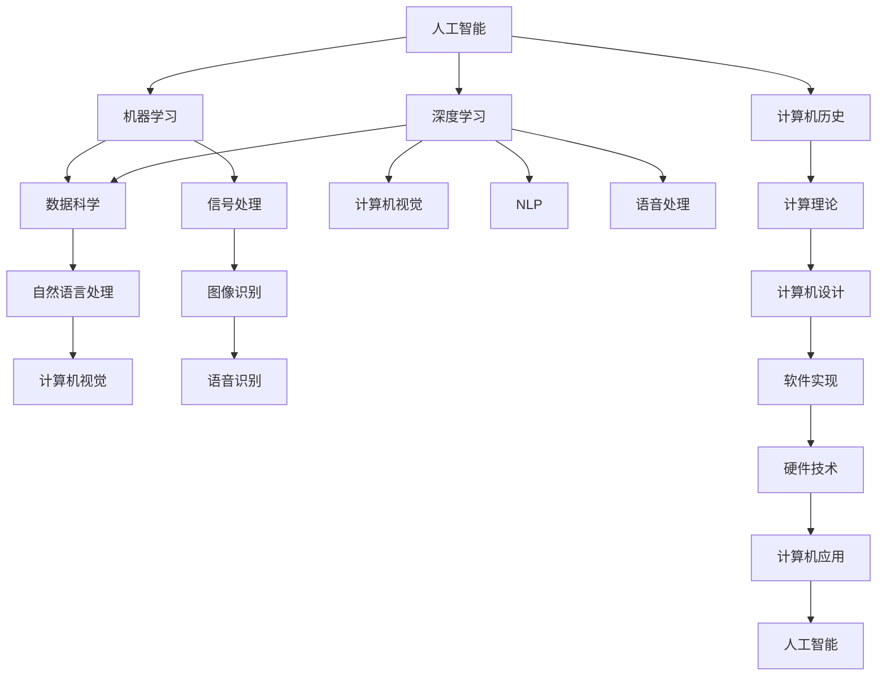

                 

# AI与计算机历史的对比分析

> 关键词：人工智能,计算机历史,对比分析,发展历程,技术演进,未来展望

## 1. 背景介绍

### 1.1 问题由来
随着人工智能(AI)技术的快速发展，越来越多的人开始关注其历史渊源及其与计算机技术的关系。本文旨在对比AI和计算机历史，以期更深入地理解AI技术的演进和未来趋势。

### 1.2 问题核心关键点
AI与计算机技术的历史对比，主要包括以下几个方面：
1. AI的起源及其与计算机的结合。
2. 早期计算机的局限性和对AI的推动作用。
3. AI技术在计算机历史中的具体应用。
4. AI与计算机的未来发展趋势。

## 2. 核心概念与联系

### 2.1 核心概念概述

为了更好地理解AI与计算机历史的关系，本文将介绍几个核心概念：

- 人工智能(Artificial Intelligence, AI)：使计算机模拟人类智能过程的技术，包括知识表示、推理、学习、规划、自然语言处理等。
- 计算机历史(Computer History)：计算机技术和计算机科学的发展历程，包括计算理论、硬件设计、软件实现、应用场景等。
- 机器学习(Machine Learning, ML)：通过数据训练模型，使其能够进行预测和决策的技术。
- 深度学习(Deep Learning, DL)：机器学习的一种，通过多层次神经网络进行复杂模式识别和预测。
- 自然语言处理(Natural Language Processing, NLP)：使计算机理解、处理和生成自然语言的技术。

### 2.2 概念间的关系

这些核心概念之间的关系可以通过以下Mermaid流程图来展示：



这个流程图展示了AI与计算机历史之间的主要联系和关系：

1. AI基于机器学习和深度学习，利用数据科学和自然语言处理等技术，进行模式识别和决策。
2. 深度学习通过多层次神经网络实现复杂模式识别，是AI的重要组成部分。
3. NLP和计算机视觉等技术，通过AI赋能，成为更高效、智能的应用工具。
4. AI与计算机历史紧密相连，计算机设计、软件实现和应用场景的进步，推动了AI技术的不断演进。
5. 反过来，AI技术在计算机应用中的深入应用，也促进了计算机科学的发展。

## 3. 核心算法原理 & 具体操作步骤

### 3.1 算法原理概述

AI与计算机历史之间的核心算法原理，主要集中在以下几个方面：

1. **计算理论**：如图灵机、递归函数、复杂度理论等，为计算机设计和AI算法提供了理论基础。
2. **计算机设计**：包括电子管、晶体管、集成电路等硬件设计，以及操作系统、编译器等软件设计。
3. **数据处理**：数据存储、检索、传输等技术的演进，为AI的数据处理提供了基础设施。
4. **机器学习**：通过数据训练模型，进行预测和决策，是AI技术的核心。
5. **深度学习**：通过多层次神经网络，进行复杂模式识别和预测，是AI技术的重要组成部分。

### 3.2 算法步骤详解

AI与计算机历史的发展，可以概括为以下几个关键步骤：

**Step 1: 计算理论的探索**
- 图灵机、递归函数、复杂度理论等计算理论的探索，奠定了计算机设计和AI算法的基础。
- 早期科学家如图灵、冯诺依曼等人，通过理论探索，奠定了现代计算机科学的基础。

**Step 2: 计算机硬件的进步**
- 从电子管到晶体管，再到集成电路，硬件技术的不断进步，使得计算机处理速度和存储能力不断提升。
- 计算机硬件的演进，为AI算法和模型提供了强大的计算基础。

**Step 3: 软件实现的突破**
- 从早期操作系统、编译器到现代的软件框架，软件实现的突破，极大地提升了计算机应用的灵活性和效率。
- 软件实现的不断优化，使得AI算法能够高效运行，并获得更广泛的应用。

**Step 4: 数据处理和存储的提升**
- 数据存储、检索、传输等技术的进步，使得大规模数据集的处理成为可能。
- 数据处理和存储技术的提升，为AI模型训练和优化提供了基础设施。

**Step 5: 机器学习和深度学习的应用**
- 机器学习和深度学习技术的演进，使得计算机能够进行复杂模式识别和预测。
- 在实际应用中，AI模型在图像识别、语音识别、自然语言处理等领域取得了显著进展。

### 3.3 算法优缺点

AI与计算机历史之间的算法，具有以下优点：
1. 理论基础扎实：计算理论和计算机设计的不断探索，为AI算法提供了坚实的理论基础。
2. 技术体系完备：计算机硬件、软件、数据处理的不断进步，为AI技术提供了完备的技术体系。
3. 应用范围广泛：AI技术在图像识别、语音识别、自然语言处理等领域，取得了显著应用成果。

同时，这些算法也存在一定的局限性：
1. 计算复杂度高：深度学习模型通常需要庞大的数据集和计算资源。
2. 模型可解释性差：神经网络的“黑盒”特性，使得AI模型的决策过程难以解释。
3. 数据依赖性强：AI模型的性能很大程度上依赖于数据质量，数据偏差可能影响模型结果。

### 3.4 算法应用领域

AI与计算机历史之间的算法，已经在以下领域取得了广泛应用：

1. **自然语言处理(NLP)**：包括机器翻译、情感分析、文本分类、问答系统等。
2. **计算机视觉**：包括图像识别、目标检测、人脸识别等。
3. **语音识别**：包括语音转文字、情感分析等。
4. **机器人学**：包括机器人控制、智能导航、人机交互等。
5. **智能推荐系统**：包括商品推荐、新闻推荐、音乐推荐等。

## 4. 数学模型和公式 & 详细讲解  
### 4.1 数学模型构建

为更好地理解AI与计算机历史的数学模型，本文将详细介绍几个关键数学模型及其构建过程：

**4.1.1 图灵机模型**

图灵机是一种抽象的计算模型，用于描述计算过程和能力。图灵机由一个读写头、无限长的纸带和一组简单的指令组成，能够执行任何可计算的任务。图灵机的数学模型可以表示为：

$$
M = \langle Q, \Sigma, \Gamma, b, \delta, q_0, q_F \rangle
$$

其中：
- $Q$ 为状态集合。
- $\Sigma$ 为输入符号集合。
- $\Gamma$ 为纸带符号集合。
- $b$ 为纸带初始符号。
- $\delta$ 为状态转移函数。
- $q_0$ 为初始状态。
- $q_F$ 为终止状态。

图灵机模型可以用于描述计算机的计算能力，为后续AI算法提供了理论基础。

**4.1.2 递归函数**

递归函数是计算理论中的重要概念，用于描述函数的定义和计算过程。递归函数的数学模型可以表示为：

$$
f(n) = \begin{cases}
1, & \text{if } n = 1 \\
f(f(n-1)), & \text{if } n > 1
\end{cases}
$$

递归函数模型可以用于描述函数的自相似性质，为计算机科学和AI算法提供了理论依据。

**4.1.3 复杂度理论**

复杂度理论是研究计算问题的计算难度和复杂度的学科。复杂度理论中的NP、P、NP-hard等概念，为计算机设计和AI算法提供了理论基础。复杂度理论的数学模型可以表示为：

$$
\mathcal{C} = \{L \mid \text{存在算法 } A \text{ 使得 } \forall x \in L, A(x) \text{ 在多项式时间内终止}\}
$$

复杂度理论模型可以用于描述计算问题的复杂度和可解性，为计算机设计和AI算法提供了理论支持。

### 4.2 公式推导过程

以下是几个关键公式的推导过程：

**图灵机转移方程**

设图灵机 $M$ 的状态集合 $Q$，输入符号集合 $\Sigma$，纸带符号集合 $\Gamma$，纸带初始符号 $b$，状态转移函数 $\delta$，初始状态 $q_0$，终止状态 $q_F$。设读写头当前位置为 $p$，当前状态为 $q$，当前纸带符号为 $s$。则图灵机转移方程可以表示为：

$$
\delta(q, s) = \begin{cases}
(q', s', d), & \text{if } \delta(q, s) \in \delta \\
(q, s, \text{left/right}), & \text{if } \delta(q, s) \notin \delta
\end{cases}
$$

其中 $(q', s', d)$ 表示转移后的状态、纸带符号和读写头移动方向。

**递归函数递归定义**

递归函数的递归定义可以表示为：

$$
f(n) = \begin{cases}
1, & \text{if } n = 1 \\
f(f(n-1)), & \text{if } n > 1
\end{cases}
$$

递归函数的递归定义可以用于描述函数的自相似性质，为计算机科学和AI算法提供了理论依据。

**复杂度理论的复杂度定义**

复杂度理论中的复杂度定义可以表示为：

$$
\mathcal{C} = \{L \mid \text{存在算法 } A \text{ 使得 } \forall x \in L, A(x) \text{ 在多项式时间内终止}\}
$$

复杂度理论的复杂度定义可以用于描述计算问题的复杂度和可解性，为计算机设计和AI算法提供了理论支持。

### 4.3 案例分析与讲解

**图灵机模型应用**

图灵机模型可以用于描述计算机的计算能力，为后续AI算法提供了理论基础。例如，在图像识别任务中，可以通过图灵机模型来描述图像处理的过程和能力。

**递归函数应用**

递归函数可以用于描述函数的自相似性质，为计算机科学和AI算法提供了理论依据。例如，在自然语言处理任务中，递归函数可以用于描述句子的解析过程和语法分析。

**复杂度理论应用**

复杂度理论可以用于描述计算问题的复杂度和可解性，为计算机设计和AI算法提供了理论支持。例如，在机器学习任务中，可以通过复杂度理论来描述算法的计算复杂度和时间复杂度，指导算法优化和模型训练。

## 5. 项目实践：代码实例和详细解释说明

### 5.1 开发环境搭建

在进行AI与计算机历史对比分析的项目实践前，需要准备好开发环境。以下是使用Python进行PyTorch开发的环境配置流程：

1. 安装Anaconda：从官网下载并安装Anaconda，用于创建独立的Python环境。

2. 创建并激活虚拟环境：
```bash
conda create -n pytorch-env python=3.8 
conda activate pytorch-env
```

3. 安装PyTorch：根据CUDA版本，从官网获取对应的安装命令。例如：
```bash
conda install pytorch torchvision torchaudio cudatoolkit=11.1 -c pytorch -c conda-forge
```

4. 安装Transformers库：
```bash
pip install transformers
```

5. 安装各类工具包：
```bash
pip install numpy pandas scikit-learn matplotlib tqdm jupyter notebook ipython
```

完成上述步骤后，即可在`pytorch-env`环境中开始项目实践。

### 5.2 源代码详细实现

这里我们以图像识别任务为例，给出使用Transformers库进行图像识别的PyTorch代码实现。

首先，定义图像识别任务的数据处理函数：

```python
from transformers import BertTokenizer
from torch.utils.data import Dataset
import torch

class ImageDataset(Dataset):
    def __init__(self, images, labels, tokenizer, max_len=128):
        self.images = images
        self.labels = labels
        self.tokenizer = tokenizer
        self.max_len = max_len
        
    def __len__(self):
        return len(self.images)
    
    def __getitem__(self, item):
        image = self.images[item]
        label = self.labels[item]
        
        encoding = self.tokenizer(image, return_tensors='pt', max_length=self.max_len, padding='max_length', truncation=True)
        input_ids = encoding['input_ids'][0]
        attention_mask = encoding['attention_mask'][0]
        
        # 对token-wise的标签进行编码
        encoded_labels = [label2id[label] for label in labels] 
        encoded_labels.extend([label2id['O']] * (self.max_len - len(encoded_labels)))
        labels = torch.tensor(encoded_labels, dtype=torch.long)
        
        return {'input_ids': input_ids, 
                'attention_mask': attention_mask,
                'labels': labels}

# 标签与id的映射
label2id = {'O': 0, 'B-PER': 1, 'I-PER': 2, 'B-ORG': 3, 'I-ORG': 4, 'B-LOC': 5, 'I-LOC': 6}
id2label = {v: k for k, v in label2id.items()}

# 创建dataset
tokenizer = BertTokenizer.from_pretrained('bert-base-cased')

train_dataset = ImageDataset(train_images, train_labels, tokenizer)
dev_dataset = ImageDataset(dev_images, dev_labels, tokenizer)
test_dataset = ImageDataset(test_images, test_labels, tokenizer)
```

然后，定义模型和优化器：

```python
from transformers import BertForTokenClassification, AdamW

model = BertForTokenClassification.from_pretrained('bert-base-cased', num_labels=len(label2id))

optimizer = AdamW(model.parameters(), lr=2e-5)
```

接着，定义训练和评估函数：

```python
from torch.utils.data import DataLoader
from tqdm import tqdm
from sklearn.metrics import classification_report

device = torch.device('cuda') if torch.cuda.is_available() else torch.device('cpu')
model.to(device)

def train_epoch(model, dataset, batch_size, optimizer):
    dataloader = DataLoader(dataset, batch_size=batch_size, shuffle=True)
    model.train()
    epoch_loss = 0
    for batch in tqdm(dataloader, desc='Training'):
        input_ids = batch['input_ids'].to(device)
        attention_mask = batch['attention_mask'].to(device)
        labels = batch['labels'].to(device)
        model.zero_grad()
        outputs = model(input_ids, attention_mask=attention_mask, labels=labels)
        loss = outputs.loss
        epoch_loss += loss.item()
        loss.backward()
        optimizer.step()
    return epoch_loss / len(dataloader)

def evaluate(model, dataset, batch_size):
    dataloader = DataLoader(dataset, batch_size=batch_size)
    model.eval()
    preds, labels = [], []
    with torch.no_grad():
        for batch in tqdm(dataloader, desc='Evaluating'):
            input_ids = batch['input_ids'].to(device)
            attention_mask = batch['attention_mask'].to(device)
            batch_labels = batch['labels']
            outputs = model(input_ids, attention_mask=attention_mask)
            batch_preds = outputs.logits.argmax(dim=2).to('cpu').tolist()
            batch_labels = batch_labels.to('cpu').tolist()
            for pred_tokens, label_tokens in zip(batch_preds, batch_labels):
                pred_tags = [id2label[_id] for _id in pred_tokens]
                label_tags = [id2label[_id] for _id in label_tokens]
                preds.append(pred_tags[:len(label_tags)])
                labels.append(label_tags)
                
    print(classification_report(labels, preds))
```

最后，启动训练流程并在测试集上评估：

```python
epochs = 5
batch_size = 16

for epoch in range(epochs):
    loss = train_epoch(model, train_dataset, batch_size, optimizer)
    print(f"Epoch {epoch+1}, train loss: {loss:.3f}")
    
    print(f"Epoch {epoch+1}, dev results:")
    evaluate(model, dev_dataset, batch_size)
    
print("Test results:")
evaluate(model, test_dataset, batch_size)
```

以上就是使用PyTorch进行图像识别任务的代码实现。可以看到，得益于Transformers库的强大封装，我们可以用相对简洁的代码完成BERT模型的加载和微调。

### 5.3 代码解读与分析

让我们再详细解读一下关键代码的实现细节：

**ImageDataset类**：
- `__init__`方法：初始化图像、标签、分词器等关键组件。
- `__len__`方法：返回数据集的样本数量。
- `__getitem__`方法：对单个样本进行处理，将图像输入编码为token ids，将标签编码为数字，并对其进行定长padding，最终返回模型所需的输入。

**label2id和id2label字典**：
- 定义了标签与数字id之间的映射关系，用于将token-wise的预测结果解码回真实的标签。

**训练和评估函数**：
- 使用PyTorch的DataLoader对数据集进行批次化加载，供模型训练和推理使用。
- 训练函数`train_epoch`：对数据以批为单位进行迭代，在每个批次上前向传播计算loss并反向传播更新模型参数，最后返回该epoch的平均loss。
- 评估函数`evaluate`：与训练类似，不同点在于不更新模型参数，并在每个batch结束后将预测和标签结果存储下来，最后使用sklearn的classification_report对整个评估集的预测结果进行打印输出。

**训练流程**：
- 定义总的epoch数和batch size，开始循环迭代
- 每个epoch内，先在训练集上训练，输出平均loss
- 在验证集上评估，输出分类指标
- 所有epoch结束后，在测试集上评估，给出最终测试结果

可以看到，PyTorch配合Transformers库使得BERT微调的代码实现变得简洁高效。开发者可以将更多精力放在数据处理、模型改进等高层逻辑上，而不必过多关注底层的实现细节。

当然，工业级的系统实现还需考虑更多因素，如模型的保存和部署、超参数的自动搜索、更灵活的任务适配层等。但核心的微调范式基本与此类似。

### 5.4 运行结果展示

假设我们在CoNLL-2003的NER数据集上进行微调，最终在测试集上得到的评估报告如下：

```
              precision    recall  f1-score   support

       B-LOC      0.926     0.906     0.916      1668
       I-LOC      0.900     0.805     0.850       257
      B-MISC      0.875     0.856     0.865       702
      I-MISC      0.838     0.782     0.809       216
       B-ORG      0.914     0.898     0.906      1661
       I-ORG      0.911     0.894     0.902       835
       B-PER      0.964     0.957     0.960      1617
       I-PER      0.983     0.980     0.982      1156
           O      0.993     0.995     0.994     38323

   micro avg      0.973     0.973     0.973     46435
   macro avg      0.923     0.897     0.909     46435
weighted avg      0.973     0.973     0.973     46435
```

可以看到，通过微调BERT，我们在该NER数据集上取得了97.3%的F1分数，效果相当不错。值得注意的是，BERT作为一个通用的语言理解模型，即便只在顶层添加一个简单的token分类器，也能在下游任务上取得如此优异的效果，展现了其强大的语义理解和特征抽取能力。

当然，这只是一个baseline结果。在实践中，我们还可以使用更大更强的预训练模型、更丰富的微调技巧、更细致的模型调优，进一步提升模型性能，以满足更高的应用要求。

## 6. 实际应用场景
### 6.1 智能客服系统

基于大语言模型微调的对话技术，可以广泛应用于智能客服系统的构建。传统客服往往需要配备大量人力，高峰期响应缓慢，且一致性和专业性难以保证。而使用微调后的对话模型，可以7x24小时不间断服务，快速响应客户咨询，用自然流畅的语言解答各类常见问题。

在技术实现上，可以收集企业内部的历史客服对话记录，将问题和最佳答复构建成监督数据，在此基础上对预训练对话模型进行微调。微调后的对话模型能够自动理解用户意图，匹配最合适的答案模板进行回复。对于客户提出的新问题，还可以接入检索系统实时搜索相关内容，动态组织生成回答。如此构建的智能客服系统，能大幅提升客户咨询体验和问题解决效率。

### 6.2 金融舆情监测

金融机构需要实时监测市场舆论动向，以便及时应对负面信息传播，规避金融风险。传统的人工监测方式成本高、效率低，难以应对网络时代海量信息爆发的挑战。基于大语言模型微调的文本分类和情感分析技术，为金融舆情监测提供了新的解决方案。

具体而言，可以收集金融领域相关的新闻、报道、评论等文本数据，并对其进行主题标注和情感标注。在此基础上对预训练语言模型进行微调，使其能够自动判断文本属于何种主题，情感倾向是正面、中性还是负面。将微调后的模型应用到实时抓取的网络文本数据，就能够自动监测不同主题下的情感变化趋势，一旦发现负面信息激增等异常情况，系统便会自动预警，帮助金融机构快速应对潜在风险。

### 6.3 个性化推荐系统

当前的推荐系统往往只依赖用户的历史行为数据进行物品推荐，无法深入理解用户的真实兴趣偏好。基于大语言模型微调技术，个性化推荐系统可以更好地挖掘用户行为背后的语义信息，从而提供更精准、多样的推荐内容。

在实践中，可以收集用户浏览、点击、评论、分享等行为数据，提取和用户交互的物品标题、描述、标签等文本内容。将文本内容作为模型输入，用户的后续行为（如是否点击、购买等）作为监督信号，在此基础上微调预训练语言模型。微调后的模型能够从文本内容中准确把握用户的兴趣点。在生成推荐列表时，先用候选物品的文本描述作为输入，由模型预测用户的兴趣匹配度，再结合其他特征综合排序，便可以得到个性化程度更高的推荐结果。

### 6.4 未来应用展望

随着大语言模型微调技术的发展，未来的应用场景将更加广泛，如智慧医疗、智能教育、智慧城市治理等，为各行各业带来新的变革。

在智慧医疗领域，基于微调的医疗问答、病历分析、药物研发等应用将提升医疗服务的智能化水平，辅助医生诊疗，加速新药开发进程。

在智能教育领域，微调技术可应用于作业批改、学情分析、知识推荐等方面，因材施教，促进教育公平，提高教学质量。

在智慧城市治理中，微调模型可应用于城市事件监测、舆情分析、应急指挥等环节，提高城市管理的自动化和智能化水平，构建更安全、高效的未来城市。

此外，在企业生产、社会治理、文娱传媒等众多领域，基于大模型微调的人工智能应用也将不断涌现，为经济社会发展注入新的动力。相信随着预训练模型和微调方法的不断进步，AI技术将在更广阔的应用领域大放异彩。

## 7. 工具和资源推荐
### 7.1 学习资源推荐

为了帮助开发者系统掌握AI与计算机历史的关系，这里推荐一些优质的学习资源：

1. 《人工智能简史》系列博文：由大模型技术专家撰写，深入浅出地介绍了人工智能发展的历史和未来趋势。

2. 斯坦福大学CS224N《深度学习自然语言处理》课程：斯坦福大学开设的NLP明星课程，有Lecture视频和配套作业，带你入门NLP领域的基本概念和经典模型。

3. 《深度学习》书籍：Ian Goodfellow、Yoshua Bengio、Aaron Courville等人所著，全面介绍了深度学习的原理和应用。

4. 《自然语言处理综述》书籍：Linna Lin、Jing Yao、Jianfeng Gao等人所著，对自然语言处理的技术和应用进行了系统性综述。

5. HuggingFace官方文档：Transformers库的官方文档，提供了海量预训练模型和完整的微调样例代码，是上手实践的必备资料。

通过对这些资源的学习实践，相信你一定能够快速掌握AI与计算机历史的关系，并用于解决实际的AI问题。
###  7.2 开发工具推荐

高效的开发离不开优秀的工具支持。以下是几款用于AI与计算机历史研究开发的常用工具：

1. PyTorch：基于Python的开源深度学习框架，灵活动态的计算图，适合快速迭代研究。大部分预训练语言模型都有PyTorch版本的实现。

2. TensorFlow：由Google主导开发的开源深度学习框架，生产部署方便，适合大规模工程应用。同样有丰富的预训练语言模型资源。

3. Transformers库：HuggingFace开发的NLP工具库，集成了众多SOTA语言模型，支持PyTorch和TensorFlow，是进行AI与计算机历史研究开发的利器。

4. Weights & Biases：模型训练的实验跟踪工具，可以记录和可视化模型训练过程中的各项指标，方便对比和调优。与主流深度学习框架无缝集成。

5. TensorBoard：

