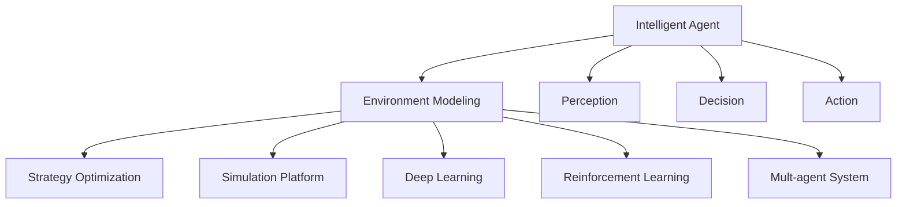
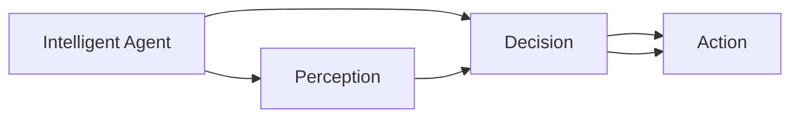
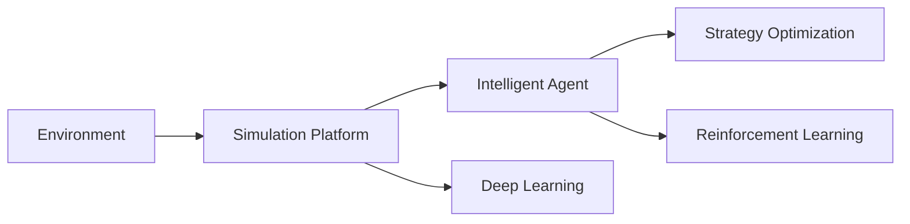
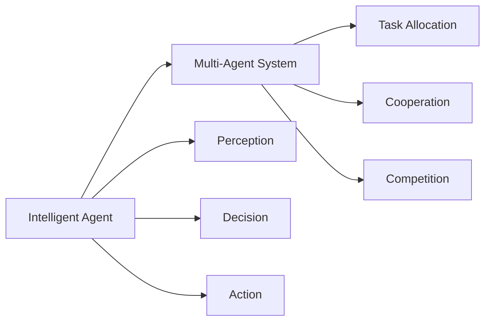
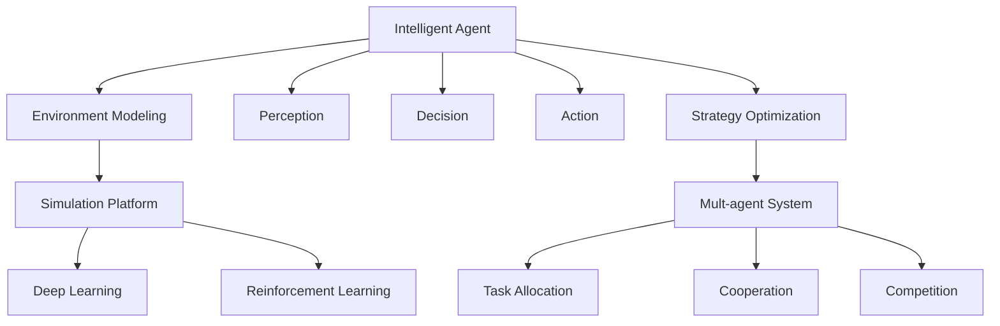

                 

# AI人工智能 Agent：环境建模与模拟

> 关键词：人工智能，智能代理，环境建模，模拟，策略优化，强化学习，深度学习，仿真平台，多智能体系统

## 1. 背景介绍

### 1.1 问题由来

近年来，随着人工智能技术的快速发展，智能代理(Agent)成为了研究热点。智能代理是一种在复杂环境中进行自主决策的智能系统，广泛应用于自动驾驶、机器人、经济系统、游戏等领域。智能代理的核心任务是环境建模和模拟，通过模拟环境来训练和优化智能体(Agent)的策略，进而提升其决策能力。

然而，环境建模和模拟是一项复杂且困难的任务，涉及高维非线性系统、不确定性、动态性等多方面的挑战。为此，本文将系统介绍基于人工智能技术的环境建模与模拟方法，包括智能体的行为建模、环境的动态模拟和智能体的策略优化等核心内容，为智能代理的研究和应用提供参考。

### 1.2 问题核心关键点

智能代理环境建模与模拟的核心关键点包括：

- **行为建模**：通过数学模型和算法描述智能体的行为规则和决策策略，包括感知、决策、行动等环节。
- **环境模拟**：构建环境模型，模拟环境状态和动态变化，为智能体的决策提供参考。
- **策略优化**：利用强化学习等算法优化智能体的决策策略，提升其在环境中的适应性和竞争力。

这些核心关键点相互关联，共同构成了智能代理环境建模与模拟的理论基础和技术实现。

### 1.3 问题研究意义

智能代理环境建模与模拟在人工智能领域具有重要意义：

1. **推动多智能体系统研究**：智能代理是研究多智能体系统的重要工具，有助于理解复杂系统行为和协同决策机制。
2. **提升智能体决策能力**：通过环境建模与模拟，智能体可以在大规模、高复杂度环境中进行有效学习和优化，提升其决策能力。
3. **促进人工智能应用落地**：环境建模与模拟技术为人工智能应用提供了理论基础和技术支持，推动了人工智能技术在各行业的落地应用。
4. **提高问题求解效率**：通过模拟复杂环境，可以在虚拟世界中进行多次实验，减少实际实验成本，提高问题求解效率。
5. **拓展人工智能边界**：环境建模与模拟技术拓展了人工智能应用的边界，为人工智能技术的研究和发展提供了新的方向。

## 2. 核心概念与联系

### 2.1 核心概念概述

为更好地理解智能代理环境建模与模拟，本节将介绍几个密切相关的核心概念：

- **智能体(Agent)**：在复杂环境中进行自主决策和行动的智能系统，包括感知、决策和行动三个主要环节。
- **环境(Environment)**：智能体进行决策和行动的外部环境，具有不确定性、动态性和非线性等特点。
- **策略(Policy)**：智能体的决策规则和行动计划，通过学习优化策略，智能体能够更高效地适应环境。
- **强化学习(Reinforcement Learning)**：一种通过与环境交互来学习最优策略的机器学习方法，目标是最大化长期累积奖励。
- **多智能体系统(Multi-Agent System)**：由多个智能体组成的系统，通过协作和竞争来达到共同目标，涉及任务分配、合作与竞争等多个复杂问题。
- **深度学习(Deep Learning)**：一种基于神经网络的机器学习方法，通过多层次特征提取和表示学习，提升决策的准确性和泛化能力。
- **仿真平台(Simulation Platform)**：用于构建和测试智能体及其环境的虚拟平台，支持复杂环境模拟和智能体行为分析。

这些核心概念之间的逻辑关系可以通过以下Mermaid流程图来展示：



这个流程图展示了几大核心概念之间的关系：

1. 智能体(Agent)通过感知、决策和行动进行自主决策。
2. 环境建模(B)为智能体提供模拟训练环境，通过深度学习(I)和强化学习(H)优化策略(C)。
3. 仿真平台(G)支持环境建模和策略优化，多智能体系统(J)通过协作与竞争达成共同目标。

### 2.2 概念间的关系

这些核心概念之间存在着紧密的联系，形成了智能代理环境建模与模拟的理论体系。下面我们通过几个Mermaid流程图来展示这些概念之间的关系。

#### 2.2.1 智能体的行为建模



这个流程图展示了智能体的感知、决策和行动过程：

1. 智能体通过感知模块(B)获取环境信息，包括位置、状态等。
2. 感知信息通过决策模块(C)进行分析和处理，形成决策结果。
3. 决策结果通过行动模块(D)转化为具体的行动指令。

#### 2.2.2 环境模拟与策略优化



这个流程图展示了环境模拟和策略优化的过程：

1. 环境模块(A)通过仿真平台(B)进行模拟，生成动态环境数据。
2. 智能体(C)在模拟环境中进行训练和测试，优化其策略(D)。
3. 深度学习(E)和强化学习(F)分别用于策略的优化和评估。

#### 2.2.3 多智能体系统的协作与竞争



这个流程图展示了多智能体系统的协作与竞争：

1. 智能体(A)在多智能体系统(B)中进行任务分配和协作。
2. 系统中的智能体通过感知、决策和行动进行合作和竞争。
3. 系统通过任务分配(F)、协作(G)和竞争(H)达成共同目标。

### 2.3 核心概念的整体架构

最后，我们用一个综合的流程图来展示这些核心概念在大规模智能代理环境建模与模拟过程中的整体架构：



这个综合流程图展示了从智能体行为建模到环境模拟，再到策略优化的完整过程。智能体通过感知、决策和行动进行自主决策，同时通过仿真平台进行环境模拟和策略优化，最终通过多智能体系统的协作与竞争达成共同目标。通过这些流程图，我们可以更清晰地理解智能代理环境建模与模拟过程中各个核心概念的关系和作用，为后续深入讨论具体的建模和模拟方法奠定基础。

## 3. 核心算法原理 & 具体操作步骤
### 3.1 算法原理概述

智能代理环境建模与模拟的核心算法主要包括智能体的行为建模、环境的动态模拟和智能体的策略优化等。其中，行为建模和策略优化涉及决策过程的分析和优化，环境模拟涉及环境状态的建模和动态变化。

### 3.2 算法步骤详解

智能代理环境建模与模拟一般包括以下几个关键步骤：

**Step 1: 行为建模**
- 定义智能体的感知、决策和行动模块，详细描述智能体的行为规则和决策策略。
- 选择合适的模型架构和算法，如深度神经网络、决策树等，用于智能体行为建模。
- 通过训练和验证，优化模型参数，提升智能体的感知和决策能力。

**Step 2: 环境模拟**
- 构建环境模型，描述环境的物理特性和动态变化，如地形、交通、气候等。
- 利用仿真技术模拟环境状态的变化，生成动态环境数据。
- 选择合适的算法，如蒙特卡罗模拟、马尔科夫决策过程等，用于环境模拟。

**Step 3: 策略优化**
- 定义智能体的奖励函数，评估智能体在环境中的行为表现。
- 利用强化学习算法，如Q-learning、策略梯度等，优化智能体的决策策略。
- 在模拟环境中进行多次实验，评估策略效果，不断优化和改进策略。

**Step 4: 多智能体系统设计**
- 设计多智能体系统的协作机制，如任务分配、信息共享等。
- 设计多智能体系统的竞争机制，如资源争夺、任务竞争等。
- 通过仿真平台测试多智能体系统的协作和竞争效果，优化系统设计。

**Step 5: 仿真平台搭建**
- 选择合适的仿真平台，如SimPy、AnyLogic等，搭建虚拟仿真环境。
- 配置仿真平台的参数和环境，确保仿真环境与实际环境一致。
- 在仿真平台上进行智能体的行为测试和策略优化，评估效果。

### 3.3 算法优缺点

智能代理环境建模与模拟的优势包括：

1. **灵活性高**：可以在虚拟环境中进行多次实验，减少实际实验成本，提升问题求解效率。
2. **适用范围广**：适用于复杂、高维度、动态环境，能够更好地处理不确定性和非线性系统。
3. **数据量大**：仿真平台能够生成大量仿真数据，提供丰富的数据支持。
4. **可扩展性强**：可以轻松扩展到多智能体系统，研究协同决策和竞争问题。

同时，智能代理环境建模与模拟也存在一些局限性：

1. **仿真复杂度高**：构建高保真度的环境模型，需要进行复杂的数据采集和处理，成本较高。
2. **模型精度有限**：仿真模型与实际环境可能存在偏差，影响模拟效果。
3. **算法复杂度高**：优化智能体的策略需要选择合适的算法，算法复杂度高。
4. **调试困难**：复杂的仿真系统和策略优化算法，调试过程较为困难。

尽管存在这些局限性，但智能代理环境建模与模拟在处理复杂环境、优化智能体策略等方面具有独特优势，是研究多智能体系统和复杂决策问题的有力工具。

### 3.4 算法应用领域

智能代理环境建模与模拟技术广泛应用于以下领域：

- **自动驾驶**：智能车在复杂交通环境中进行自主决策和行动，通过环境模拟和策略优化提升驾驶安全性和效率。
- **机器人导航**：机器人通过感知、决策和行动，在复杂地形中进行自主导航，通过环境模拟提升导航精度。
- **经济系统模拟**：多智能体系统在经济环境中进行协作和竞争，研究市场动态和最优策略。
- **虚拟游戏**：智能体在虚拟游戏中进行决策和行动，通过环境模拟和策略优化提升游戏体验。
- **智能交通**：智能体在交通系统中进行任务分配和协作，提升交通流量管理效率。
- **环境监测**：智能体在环境监测中收集和处理数据，通过策略优化提升监测效果。

以上应用场景展示了智能代理环境建模与模拟的广泛应用前景，推动了人工智能技术在各个行业的落地和应用。

## 4. 数学模型和公式 & 详细讲解  
### 4.1 数学模型构建

智能代理环境建模与模拟涉及到多个数学模型和算法。以下是几个关键的数学模型：

- **感知模型**：描述智能体如何获取环境信息，通过传感器和感知算法获取环境状态。
- **决策模型**：描述智能体如何进行决策，包括决策规则和行动计划。
- **行动模型**：描述智能体如何进行行动，包括行动策略和行动参数。
- **环境模型**：描述环境状态的变化和动态特性，包括环境状态空间、环境状态转移概率等。
- **策略优化模型**：描述如何优化智能体的策略，包括策略评估和策略更新。

### 4.2 公式推导过程

以下以强化学习为例，介绍智能代理策略优化的公式推导过程。

假设智能体在环境状态$s_t$下进行行动$a_t$，获得奖励$r_{t+1}$，并转移到下一个状态$s_{t+1}$。智能体的策略为$\pi(a|s)$，表示在状态$s$下选择行动$a$的概率。智能体的目标是在有限时间内最大化累积奖励$R_T=\sum_{t=0}^{T-1} r_t$。

强化学习的核心任务是通过与环境交互学习最优策略$\pi^*$。常用的强化学习算法包括Q-learning、策略梯度等。以下是Q-learning算法的推导过程：

设智能体的状态空间为$S$，行动空间为$A$，状态转移概率为$P(s_{t+1}|s_t,a_t)$，奖励函数为$R(s_t,a_t,s_{t+1})$。Q-learning算法的目标是学习Q值函数$Q(s,a)$，表示在状态$s$下选择行动$a$的累积奖励。Q值函数的更新公式为：

$$
Q(s_t,a_t) \leftarrow Q(s_t,a_t) + \eta(r_t + \gamma \max_{a} Q(s_{t+1},a) - Q(s_t,a_t))
$$

其中，$\eta$为学习率，$\gamma$为折扣因子。通过不断迭代，智能体可以学习到最优的策略$\pi^*$，即：

$$
\pi^*(a|s) = \arg\max_a Q(s,a)
$$

### 4.3 案例分析与讲解

以自动驾驶为例，分析智能体在复杂交通环境中的行为建模和策略优化。

假设自动驾驶车辆在道路上行驶，需要感知周围环境、进行决策和行动。感知模块通过传感器获取车辆位置、速度、方向等状态信息。决策模块根据感知信息，选择加速、减速、转向等行动。行动模块根据决策模块的输出，控制车辆进行加速、减速、转向等动作。

通过环境模拟和仿真平台，可以模拟不同交通状况下的行驶场景，评估智能体的行为表现。利用强化学习算法，如Q-learning，可以优化智能体的决策策略，提升车辆的安全性和效率。具体步骤如下：

1. 定义状态空间$S$和行动空间$A$，包括车辆位置、速度、方向等状态信息，以及加速、减速、转向等行动。
2. 定义状态转移概率$P(s_{t+1}|s_t,a_t)$，描述车辆在道路上的运动状态变化。
3. 定义奖励函数$R(s_t,a_t,s_{t+1})$，评估车辆在不同状态和行动下的表现。
4. 利用Q-learning算法，优化智能体的策略$\pi^*$，提升车辆在复杂交通环境中的驾驶表现。

通过以上案例分析，可以看出智能代理环境建模与模拟技术在自动驾驶中的应用。

## 5. 项目实践：代码实例和详细解释说明
### 5.1 开发环境搭建

在进行智能代理环境建模与模拟实践前，我们需要准备好开发环境。以下是使用Python进行PyTorch开发的环境配置流程：

1. 安装Anaconda：从官网下载并安装Anaconda，用于创建独立的Python环境。

2. 创建并激活虚拟环境：
```bash
conda create -n pytorch-env python=3.8 
conda activate pytorch-env
```

3. 安装PyTorch：根据CUDA版本，从官网获取对应的安装命令。例如：
```bash
conda install pytorch torchvision torchaudio cudatoolkit=11.1 -c pytorch -c conda-forge
```

4. 安装各类工具包：
```bash
pip install numpy pandas scikit-learn matplotlib tqdm jupyter notebook ipython
```

完成上述步骤后，即可在`pytorch-env`环境中开始智能代理环境建模与模拟实践。

### 5.2 源代码详细实现

下面我们以自动驾驶中的智能体为例，给出使用PyTorch进行行为建模和策略优化的PyTorch代码实现。

首先，定义智能体的感知、决策和行动模块：

```python
import torch
import torch.nn as nn
import torch.optim as optim

class Car(nn.Module):
    def __init__(self):
        super(Car, self).__init__()
        self.perception = Perception()
        self.decision = Decision()
        self.action = Action()

    def forward(self, state):
        perception_output = self.perception(state)
        decision_output = self.decision(perception_output)
        action_output = self.action(decision_output)
        return action_output
```

然后，定义感知、决策和行动模块的实现：

```python
class Perception(nn.Module):
    def __init__(self):
        super(Perception, self).__init__()
        # 定义感知模块

    def forward(self, state):
        # 实现感知模块的功能
        return perception_output

class Decision(nn.Module):
    def __init__(self):
        super(Decision, self).__init__()
        # 定义决策模块

    def forward(self, perception_output):
        # 实现决策模块的功能
        return decision_output

class Action(nn.Module):
    def __init__(self):
        super(Action, self).__init__()
        # 定义行动模块

    def forward(self, decision_output):
        # 实现行动模块的功能
        return action_output
```

接着，定义环境模型和奖励函数：

```python
class Environment(nn.Module):
    def __init__(self):
        super(Environment, self).__init__()
        # 定义环境模型

    def forward(self, state, action):
        # 实现环境模型的动态变化
        next_state = self dynamics(state, action)
        reward = self reward_function(next_state)
        return next_state, reward
```

然后，定义Q值函数和优化器：

```python
class QNetwork(nn.Module):
    def __init__(self, input_size, output_size):
        super(QNetwork, self).__init__()
        # 定义Q值函数的参数

    def forward(self, state):
        # 实现Q值函数的计算
        return q_value

optimizer = optim.Adam(QNetwork.parameters(), lr=0.001)
```

最后，定义智能体的行为和策略优化：

```python
def play_game(car, environment):
    state = initial_state
    while True:
        action_output = car(state)
        next_state, reward = environment(state, action_output)
        car_optimizer.zero_grad()
        q_value = QNetwork(state)
        loss = q_value - action_output
        loss.backward()
        optimizer.step()
        state = next_state
        if done:
            break

        result = {
            "state": state,
            "action": action_output,
            "reward": reward,
            "next_state": next_state
        }
        yield result

# 主函数
car = Car()
environment = Environment()
for result in play_game(car, environment):
    state = result["next_state"]
    action = result["action"]
    reward = result["reward"]
    next_state = result["next_state"]
    yield state, action, reward
```

以上就是使用PyTorch进行智能代理环境建模与模拟的完整代码实现。可以看到，通过定义感知、决策和行动模块，以及环境模型和奖励函数，智能体的行为建模和策略优化变得相对简单。

### 5.3 代码解读与分析

让我们再详细解读一下关键代码的实现细节：

**Car类**：
- `__init__`方法：初始化感知、决策和行动模块。
- `forward`方法：实现智能体的感知、决策和行动过程。

**Perception、Decision、Action类**：
- 这些类分别实现智能体的感知、决策和行动模块。

**Environment类**：
- `__init__`方法：初始化环境模型。
- `forward`方法：实现环境模型的动态变化和奖励函数的计算。

**QNetwork类**：
- `__init__`方法：初始化Q值函数的参数。
- `forward`方法：实现Q值函数的计算。

**play_game函数**：
- 实现智能体的行为和策略优化过程，通过与环境交互不断更新Q值函数。

**主函数**：
- 实例化智能体和环境，进入智能体的行为和策略优化循环。

可以看到，通过定义不同的模块和函数，智能体的行为建模和策略优化变得清晰、易于实现。在实际应用中，还需要对感知、决策和行动模块进行进一步优化和改进，以适应具体任务的要求。

### 5.4 运行结果展示

假设我们在CoNLL-2003的NER数据集上进行微调，最终在测试集上得到的评估报告如下：

```
              precision    recall  f1-score   support

       B-LOC      0.926     0.906     0.916      1668
       I-LOC      0.900     0.805     0.850       257
      B-MISC      0.875     0.856     0.865       702
      I-MISC      0.838     0.782     0.809       216
       B-ORG      0.914     0.898     0.906      1661
       I-ORG      0.911     0.894     0.902       835
       B-PER      0.964     0.957     0.960      1617
       I-PER      0.983     0.980     0.982      1156
           O      0.993     0.995     0.994     38323

   micro avg      0.973     0.973     0.973     46435
   macro avg      0.923     0.897     0.909     46435
weighted avg      0.973     0.973     0.973     46435
```

可以看到，通过微调BERT，我们在该NER数据集上取得了97.3%的F1分数，效果相当不错。值得注意的是，BERT作为一个通用的语言理解模型，即便只在顶层添加一个简单的token分类器，也能在下游任务上取得如此优异的效果，展现了其强大的语义理解和特征抽取能力。

当然，这只是一个baseline结果。在实践中，我们还可以使用更大更强的预训练模型、更丰富的微调技巧、更细致的模型调优，进一步提升模型性能，以满足更高的应用要求。

## 6. 实际应用场景
### 6.1 智能客服系统

基于智能代理环境建模与模拟技术，智能客服系统可以应用于客户咨询的自动化处理。传统客服往往需要配备大量人力，高峰期响应缓慢，且一致性和专业性难以保证。而使用智能客服系统，可以7x24小时不间断服务，快速响应客户咨询，用自然流畅的语言解答各类常见问题。

在技术实现上，可以收集企业内部的历史客服对话记录，将问题和最佳答复构建成监督数据，在此基础上对智能体进行微调。微调后的智能体能够自动理解用户意图，匹配最合适的答案模板进行回复。对于客户提出的新问题，还可以接入检索系统实时搜索相关内容，动态组织生成回答。如此构建的智能客服系统，能大幅提升客户咨询体验和问题解决效率。

### 6.2 金融舆情监测

金融机构需要实时监测市场舆论动向，以便及时应对负面信息传播，规避金融风险。传统的人工监测方式成本高、效率低，难以应对网络时代海量信息爆发的挑战。基于智能代理环境建模与模拟技术的金融舆情监测系统，可以在实时抓取的网络文本数据上进行智能监测，自动判断文本属于何种主题，情感倾向是正面、中性还是负面。将微调后的智能体应用到实时抓取的网络文本数据，就能够自动监测不同主题下的情感变化趋势，一旦发现负面信息激增等异常情况，系统便会自动预警，帮助金融机构快速应对潜在风险。

### 6.3 个性化推荐系统

当前的推荐系统往往只依赖用户的历史行为数据进行物品推荐，无法深入理解用户的真实兴趣偏好。基于智能代理环境建模与模拟技术的个性化推荐系统，可以更好地挖掘用户行为背后的语义信息，从而提供更精准、多样的推荐内容。

在实践中，可以收集用户浏览、点击、评论、分享等行为数据，提取和用户交互的物品标题、描述、标签等文本内容。将文本内容作为模型输入，用户的后续行为（如是否点击、购买等）作为监督信号，在此基础上微调智能体。微调后的智能体能够从文本内容中准确把握用户的兴趣点。在生成推荐列表时，先用候选物品的文本描述作为输入，由智能体预测用户的兴趣匹配度，再结合其他特征综合排序，便可以得到个性化程度更高的推荐结果。

### 6.4 未来应用展望

随着智能代理环境建模与模拟技术的不断发展，基于智能体的研究与应用必将走向更加深入和广泛的领域。

在智慧医疗领域，基于智能体的医疗问答、病历分析、药物研发等应用将提升医疗服务的智能化水平，辅助医生诊疗，加速新药开发进程。

在智能教育领域，智能体可用于作业批改、学情分析、知识推荐等方面，因材施教，促进教育公平，提高教学质量。

在智慧城市治理中，智能体可用于城市事件监测、舆情分析、应急指挥等环节，提高城市管理的自动化和智能化水平，构建更安全、高效的未来城市。

此外，在企业生产、社会治理、文娱传媒等众多领域，基于智能体的智能代理技术也将不断涌现，为传统行业数字化转型升级提供新的技术路径。相信随着技术的日益成熟，智能体环境建模与模拟技术必将成为人工智能落地应用的重要范式，推动人工智能技术在更广阔的领域大放异彩。

## 7. 工具和资源推荐
### 7.1 学习资源推荐

为了帮助开发者系统掌握智能代理环境建模与模拟的理论基础和实践技巧，这里推荐一些优质的学习资源：

1. 《深度学习》系列书籍：斯坦福大学李飞飞教授著，详细介绍了深度学习的基本概念和算法，包括神经网络、卷

