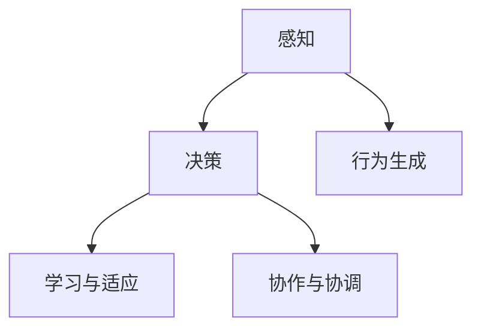
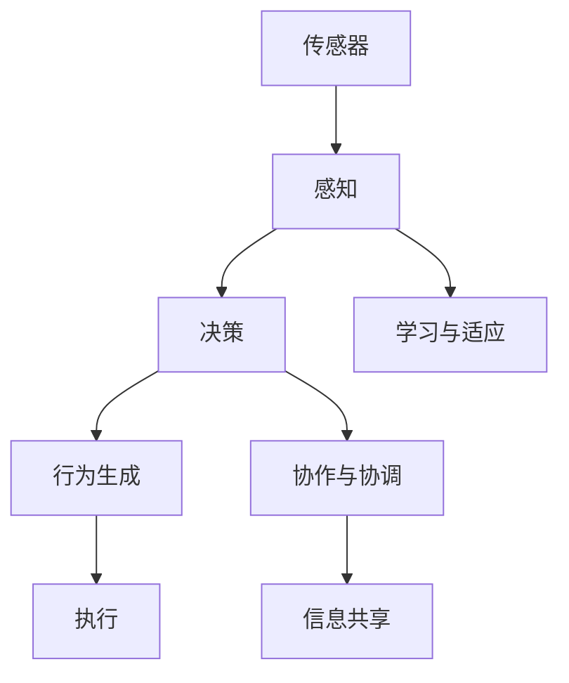

                 

# AI人工智能 Agent：高级概念剖析

> 关键词：人工智能, 智能体, 复杂系统, 决策优化, 强化学习, 深度学习, 多智能体系统

## 1. 背景介绍

### 1.1 问题由来
在当今快速发展的科技时代，人工智能（AI）技术正以惊人的速度改变着我们的生活。从自动驾驶汽车到智能客服，再到医疗诊断，AI技术的应用几乎无所不在。而在AI技术的核心，智能体（Agent）扮演着至关重要的角色。智能体是一种能够自主行动、具有一定智能能力的人工实体，能够感知环境并做出响应。

智能体作为AI技术的核心组成部分，不仅具备自主决策的能力，还能够与环境进行交互，从而实现复杂的任务。本文将深入剖析智能体的高级概念，探索其在复杂系统中的应用，并讨论如何通过优化算法使其更高效、更智能。

### 1.2 问题核心关键点
智能体的设计是一个多学科交叉的复杂问题，涉及计算机科学、控制论、认知科学等多个领域。其主要目标是在不确定环境中做出最优决策，以实现特定目标。智能体的设计需要解决以下几个关键问题：

1. **感知与环境交互**：智能体需要感知环境状态并与之交互，从而获得对环境的认识。
2. **决策与行为生成**：智能体需要基于感知到的环境状态，通过决策过程生成行为。
3. **学习与适应**：智能体需要根据经验进行学习和适应，以提升决策的准确性。
4. **协作与协调**：在多智能体系统中，智能体需要与其它智能体进行协作与协调，以共同完成任务。

本文将围绕这些关键问题，系统阐述智能体的高级概念，并通过具体案例分析，揭示其在复杂系统中的重要应用。

### 1.3 问题研究意义
研究智能体的高级概念，对于构建更高效、更智能的人工智能系统具有重要意义：

1. **提升决策效率**：智能体能够自主决策，减少人类干预，提升决策效率。
2. **增强系统灵活性**：智能体能够自适应环境变化，提升系统的灵活性和鲁棒性。
3. **促进多智能体协作**：智能体能够与其它智能体进行协作，实现复杂任务的自动化处理。
4. **推动AI技术发展**：智能体的设计与应用，为AI技术的发展提供了新的视角和工具。

本文旨在为读者提供一个系统性的智能体概念解析，帮助他们理解智能体在AI技术中的应用，并探索其在复杂系统中的潜在价值。

## 2. 核心概念与联系

### 2.1 核心概念概述

智能体作为AI技术的核心概念，涉及多个子领域，如感知、决策、学习、协作等。为了更好地理解智能体的高级概念，本节将介绍几个关键概念，并探讨它们之间的联系。

- **感知**：智能体通过传感器、信息提取等手段，获取环境状态信息。
- **决策**：智能体基于感知到的信息，通过算法和模型做出决策。
- **行为生成**：智能体根据决策生成相应的行为。
- **学习与适应**：智能体通过经验更新决策模型，以提升决策能力。
- **协作与协调**：在多智能体系统中，智能体需要与其它智能体进行信息共享和协作。

这些概念之间的联系可以通过以下Mermaid流程图来展示：



### 2.2 概念间的关系

智能体的高级概念之间存在紧密的联系，形成了一个动态的系统。通过这些概念的相互作用，智能体能够在复杂环境中高效决策和行动。

- **感知与决策**：感知是决策的前提，感知信息的质量直接影响决策的准确性。
- **决策与行为生成**：决策是行为生成的基础，智能体通过决策模型生成相应的行为。
- **学习与适应**：学习与适应是提升决策能力的关键，智能体通过不断的经验积累和模型优化，逐渐提高决策的准确性。
- **协作与协调**：在多智能体系统中，协作与协调是实现复杂任务的重要手段，智能体通过信息共享和协同决策，实现最优行为。

这些概念共同构成了智能体的核心工作机制，使得智能体能够在复杂系统中高效运转。

### 2.3 核心概念的整体架构

最后，我们用一个综合的流程图来展示智能体的核心概念及其在复杂系统中的应用：



这个综合流程图展示了从感知到决策，再到行为生成的整个过程，并通过学习与适应和协作与协调，实现了智能体在复杂系统中的高效应用。通过这些概念的相互作用，智能体能够实现自主决策和行为生成，适应环境变化，并与其它智能体进行协作，共同完成任务。

## 3. 核心算法原理 & 具体操作步骤
### 3.1 算法原理概述

智能体的高级决策过程，通常基于优化算法和模型学习。通过优化算法，智能体可以在不确定环境中寻找最优决策；通过模型学习，智能体能够从历史数据中提取规律，提升决策准确性。

智能体的决策过程可以分为两个阶段：感知阶段和决策阶段。在感知阶段，智能体通过传感器获取环境状态信息；在决策阶段，智能体基于感知信息，通过优化算法和模型学习，做出最优决策。

### 3.2 算法步骤详解

智能体的决策过程可以通过以下步骤进行：

1. **环境感知**：智能体通过传感器或信息提取算法，获取环境状态信息。
2. **决策生成**：智能体基于感知信息，通过优化算法（如强化学习、深度学习等）生成决策。
3. **行为生成**：智能体根据决策生成相应的行为。
4. **执行与反馈**：智能体执行行为，并根据环境反馈更新决策模型。

以强化学习为例，其决策过程可以分为以下几步：

1. **环境感知**：智能体通过传感器获取环境状态信息。
2. **决策生成**：智能体基于环境状态信息，通过Q学习等优化算法生成决策。
3. **行为生成**：智能体根据决策生成相应的行为。
4. **执行与反馈**：智能体执行行为，并根据环境反馈（如奖励信号）更新决策模型。

### 3.3 算法优缺点

智能体的高级决策过程具有以下优点：

- **自主决策**：智能体能够在复杂环境中自主决策，减少人类干预。
- **自适应能力**：智能体能够根据环境变化进行自适应，提升系统的鲁棒性。
- **协作与协调**：智能体能够与其它智能体进行协作，实现复杂任务的自动化处理。

同时，智能体的高级决策过程也存在一些缺点：

- **算法复杂性**：优化算法和模型学习的过程往往较为复杂，需要大量的计算资源。
- **环境不确定性**：在复杂环境中，环境的不确定性可能会影响智能体的决策。
- **模型泛化能力**：模型的泛化能力直接影响到智能体的决策准确性。

### 3.4 算法应用领域

智能体的高级决策过程在多个领域都有广泛应用：

1. **自动驾驶**：智能体能够通过感知、决策和行为生成，实现车辆的自主驾驶。
2. **智能客服**：智能体能够通过感知、决策和协作，实现自动回答客户问题。
3. **金融交易**：智能体能够通过感知、决策和反馈，实现自动交易决策。
4. **机器人控制**：智能体能够通过感知、决策和行为生成，实现机器人的自主控制。
5. **医疗诊断**：智能体能够通过感知、决策和反馈，实现疾病的自动诊断和治疗。

## 4. 数学模型和公式 & 详细讲解 & 举例说明

### 4.1 数学模型构建

智能体的高级决策过程可以通过数学模型进行建模。我们以强化学习为例，构建智能体的决策模型。

假设智能体在一个连续状态空间中进行操作，状态空间表示为 $\mathcal{S}$，动作空间表示为 $\mathcal{A}$，奖励函数表示为 $R$。智能体的决策目标是最小化期望累积奖励，即：

$$
J(\pi) = \mathbb{E}_{s \sim \rho, a \sim \pi}[R(s, a)] - \mathbb{E}_{s \sim \rho}[V^{\pi}(s)]
$$

其中，$\pi$ 为智能体的决策策略，$\rho$ 为状态分布，$V^{\pi}(s)$ 为智能体在状态 $s$ 下的期望价值函数。

### 4.2 公式推导过程

以Q学习和SARSA算法为例，推导智能体决策模型的详细公式。

Q学习算法通过迭代更新状态-动作对的价值函数，实现智能体的决策优化。Q函数的更新公式如下：

$$
Q(s, a) \leftarrow Q(s, a) + \alpha(R(s, a) + \gamma \max_{a'} Q(s', a') - Q(s, a))
$$

其中，$\alpha$ 为学习率，$\gamma$ 为折扣因子。

SARSA算法通过采样状态-动作对，更新状态-动作对的价值函数，实现智能体的决策优化。SARSA算法的更新公式如下：

$$
Q(s, a) \leftarrow Q(s, a) + \alpha(R(s, a) + \gamma Q(s', a') - Q(s, a))
$$

其中，$(s', a')$ 为采样得到的下一个状态-动作对。

### 4.3 案例分析与讲解

以无人驾驶为例，分析智能体的决策过程。

无人驾驶车辆通过车载传感器（如摄像头、雷达）感知周围环境，获取车辆位置、速度、方向等信息。根据感知信息，车辆通过决策模型生成最优行驶策略，并控制转向、加速、制动等行为。在行驶过程中，车辆不断根据环境反馈（如传感器数据、道路标志等）更新决策模型，以适应复杂的道路环境。

## 5. 项目实践：代码实例和详细解释说明

### 5.1 开发环境搭建

在进行智能体项目实践前，我们需要准备好开发环境。以下是使用Python进行PyTorch开发的环境配置流程：

1. 安装Anaconda：从官网下载并安装Anaconda，用于创建独立的Python环境。

2. 创建并激活虚拟环境：
```bash
conda create -n pytorch-env python=3.8 
conda activate pytorch-env
```

3. 安装PyTorch：根据CUDA版本，从官网获取对应的安装命令。例如：
```bash
conda install pytorch torchvision torchaudio cudatoolkit=11.1 -c pytorch -c conda-forge
```

4. 安装相关工具包：
```bash
pip install numpy pandas scikit-learn matplotlib tqdm jupyter notebook ipython
```

完成上述步骤后，即可在`pytorch-env`环境中开始智能体实践。

### 5.2 源代码详细实现

这里我们以强化学习中的Q学习算法为例，实现一个简单的智能体决策模型。

首先，定义智能体的环境状态和动作空间：

```python
import numpy as np

# 定义状态空间和动作空间
S = np.array([0, 1, 2, 3, 4, 5])
A = np.array([0, 1])
```

然后，定义智能体的Q值函数和决策策略：

```python
# 定义Q值函数
Q = np.zeros((len(S), len(A)))

# 定义决策策略
def policy(s):
    return np.argmax(Q[s, :])

# 定义奖励函数
def reward(s, a):
    if s == 4 and a == 0:
        return 1
    else:
        return 0
```

接下来，定义Q学习算法的具体实现：

```python
# 定义Q学习算法的参数
alpha = 0.1
gamma = 0.9
num_episodes = 1000
```

```python
# 定义Q学习算法的函数
def q_learning():
    for episode in range(num_episodes):
        s = 0
        total_reward = 0
        done = False
        
        while not done:
            a = policy(s)
            s_next, r = reward(s, a)
            Q[s, a] += alpha * (r + gamma * Q[s_next, :]) - Q[s, a]
            s = s_next
            total_reward += r
            done = (s == 4)
        
        print(f"Episode {episode+1}, reward: {total_reward}")

# 执行Q学习算法
q_learning()
```

通过上述代码，我们可以实现一个简单的Q学习算法，用于决策最优行驶策略。智能体通过感知环境，决策最优动作，并根据奖励信号更新Q值函数。

### 5.3 代码解读与分析

让我们再详细解读一下关键代码的实现细节：

**状态和动作空间**：
- `S` 和 `A` 分别定义了智能体的状态空间和动作空间。状态空间表示为离散的整数，动作空间表示为离散的整数。

**Q值函数和决策策略**：
- `Q` 定义了智能体的Q值函数，初始化为零矩阵。
- `policy` 定义了智能体的决策策略，根据当前状态返回最优动作。
- `reward` 定义了环境奖励函数，当智能体到达终点时给予奖励。

**Q学习算法**：
- `alpha` 和 `gamma` 分别定义了学习率和折扣因子。
- `num_episodes` 定义了算法的迭代次数。
- `q_learning` 函数实现了Q学习算法的具体过程，通过迭代更新Q值函数，实现智能体的决策优化。

**运行结果展示**：
- 每次迭代时，智能体将从起始状态出发，执行一系列动作，根据奖励信号更新Q值函数，直到到达终点或达到最大迭代次数。
- 最终，在每次迭代结束时，智能体将打印当前迭代的总奖励，观察智能体的决策策略是否逐渐优化。

## 6. 实际应用场景

### 6.1 智能客服系统

基于强化学习智能体的智能客服系统，可以广泛应用于客服中心的客户咨询。传统客服往往依赖人工接听，高峰期响应缓慢，且难以保证一致性和专业性。而使用强化学习智能体，可以7x24小时不间断服务，快速响应客户咨询，用自然流畅的语言解答各类常见问题。

在技术实现上，可以收集企业内部的历史客服对话记录，将问题和最佳答复构建成监督数据，在此基础上对智能体进行强化学习微调。微调后的智能体能够自动理解用户意图，匹配最合适的答案模板进行回复。对于客户提出的新问题，还可以接入检索系统实时搜索相关内容，动态组织生成回答。如此构建的智能客服系统，能大幅提升客户咨询体验和问题解决效率。

### 6.2 金融舆情监测

金融机构需要实时监测市场舆论动向，以便及时应对负面信息传播，规避金融风险。传统的人工监测方式成本高、效率低，难以应对网络时代海量信息爆发的挑战。基于强化学习智能体的金融舆情监测系统，可以通过强化学习智能体学习市场舆情数据，自动监测不同主题下的情感变化趋势，一旦发现负面信息激增等异常情况，系统便会自动预警，帮助金融机构快速应对潜在风险。

### 6.3 个性化推荐系统

当前的推荐系统往往只依赖用户的历史行为数据进行物品推荐，无法深入理解用户的真实兴趣偏好。基于强化学习智能体的个性化推荐系统，可以更好地挖掘用户行为背后的语义信息，从而提供更精准、多样的推荐内容。

在实践中，可以收集用户浏览、点击、评论、分享等行为数据，提取和用户交互的物品标题、描述、标签等文本内容。将文本内容作为模型输入，用户的后续行为（如是否点击、购买等）作为监督信号，在此基础上强化学习智能体学习用户兴趣点。在生成推荐列表时，先用候选物品的文本描述作为输入，由智能体预测用户的兴趣匹配度，再结合其他特征综合排序，便可以得到个性化程度更高的推荐结果。

### 6.4 未来应用展望

随着强化学习智能体技术的不断发展，其在更多领域将得到应用，为传统行业带来变革性影响。

在智慧医疗领域，基于强化学习智能体的医疗问答、病历分析、药物研发等应用将提升医疗服务的智能化水平，辅助医生诊疗，加速新药开发进程。

在智能教育领域，强化学习智能体可应用于作业批改、学情分析、知识推荐等方面，因材施教，促进教育公平，提高教学质量。

在智慧城市治理中，强化学习智能体可应用于城市事件监测、舆情分析、应急指挥等环节，提高城市管理的自动化和智能化水平，构建更安全、高效的未来城市。

此外，在企业生产、社会治理、文娱传媒等众多领域，基于强化学习智能体的AI应用也将不断涌现，为经济社会发展注入新的动力。相信随着技术的日益成熟，智能体技术将成为人工智能落地应用的重要范式，推动人工智能技术向更广阔的领域加速渗透。

## 7. 工具和资源推荐

### 7.1 学习资源推荐

为了帮助开发者系统掌握智能体的高级概念和实践技巧，这里推荐一些优质的学习资源：

1. 《强化学习》系列博文：由大模型技术专家撰写，深入浅出地介绍了强化学习的原理、算法和应用。

2. CS223《强化学习》课程：斯坦福大学开设的强化学习课程，有Lecture视频和配套作业，带你入门强化学习的基本概念和经典模型。

3. 《Reinforcement Learning: An Introduction》书籍：Reinforcement Learning的入门经典书籍，全面介绍了强化学习的理论和实践。

4. OpenAI Gym环境库：提供了多种常见的强化学习环境，方便开发者进行算法实验。

5. PyTorch强化学习库：由PyTorch社区开发的强化学习库，支持多种强化学习算法和环境，是进行智能体开发的好工具。

通过对这些资源的学习实践，相信你一定能够快速掌握智能体的高级概念，并用于解决实际的AI问题。

### 7.2 开发工具推荐

高效的开发离不开优秀的工具支持。以下是几款用于智能体开发的常用工具：

1. PyTorch：基于Python的开源深度学习框架，灵活动态的计算图，适合快速迭代研究。大部分强化学习算法都有PyTorch版本的实现。

2. TensorFlow：由Google主导开发的开源深度学习框架，生产部署方便，适合大规模工程应用。同样有丰富的强化学习算法资源。

3. OpenAI Gym：提供了多种常见的强化学习环境，方便开发者进行算法实验。

4. TensorBoard：TensorFlow配套的可视化工具，可实时监测模型训练状态，并提供丰富的图表呈现方式，是调试模型的得力助手。

5. Weights & Biases：模型训练的实验跟踪工具，可以记录和可视化模型训练过程中的各项指标，方便对比和调优。与主流深度学习框架无缝集成。

合理利用这些工具，可以显著提升智能体开发的效率，加快创新迭代的步伐。

### 7.3 相关论文推荐

智能体的高级概念涉及强化学习、深度学习等多个前沿领域，以下是几篇奠基性的相关论文，推荐阅读：

1. Deep Q-Learning: A Tutorial：提出深度强化学习算法，用于复杂环境中的决策优化。

2. Playing Atari with Deep Reinforcement Learning：展示深度Q学习算法在Atari游戏中的应用，取得显著效果。

3. Reinforcement Learning: An Introduction：Reinforcement Learning的入门经典书籍，全面介绍了强化学习的理论和实践。

4. AlphaGo Zero: Mastering the Game of Go without Human Knowledge：展示AlphaGo Zero通过强化学习实现围棋世界冠军水平的表现。

5. Multi-agent Reinforcement Learning：介绍多智能体系统中的强化学习算法，探索智能体之间的协作与竞争。

这些论文代表了大模型微调技术的发展脉络。通过学习这些前沿成果，可以帮助研究者把握学科前进方向，激发更多的创新灵感。

除上述资源外，还有一些值得关注的前沿资源，帮助开发者紧跟强化学习智能体技术的最新进展，例如：

1. arXiv论文预印本：人工智能领域最新研究成果的发布平台，包括大量尚未发表的前沿工作，学习前沿技术的必读资源。

2. 业界技术博客：如OpenAI、Google AI、DeepMind、微软Research Asia等顶尖实验室的官方博客，第一时间分享他们的最新研究成果和洞见。

3. 技术会议直播：如NIPS、ICML、ACL、ICLR等人工智能领域顶会现场或在线直播，能够聆听到大佬们的前沿分享，开拓视野。

4. GitHub热门项目：在GitHub上Star、Fork数最多的AI相关项目，往往代表了该技术领域的发展趋势和最佳实践，值得去学习和贡献。

5. 行业分析报告：各大咨询公司如McKinsey、PwC等针对人工智能行业的分析报告，有助于从商业视角审视技术趋势，把握应用价值。

总之，对于智能体技术的理解和应用，需要开发者保持开放的心态和持续学习的意愿。多关注前沿资讯，多动手实践，多思考总结，必将收获满满的成长收益。

## 8. 总结：未来发展趋势与挑战

### 8.1 总结

本文对基于强化学习的智能体高级概念进行了全面系统的介绍。首先阐述了智能体的设计目标和应用意义，明确了智能体在复杂系统中的重要价值。其次，从原理到实践，详细讲解了智能体的高级决策过程，并通过具体案例分析，揭示了其在实际应用中的广泛应用。

通过本文的系统梳理，可以看到，基于强化学习的智能体在复杂系统中发挥了重要的决策和行动能力，为许多高难度的自动化任务提供了解决方案。未来，随着强化学习智能体技术的不断演进，其在更多领域将得到应用，为各行各业带来变革性影响。

### 8.2 未来发展趋势

展望未来，强化学习智能体的高级概念将呈现以下几个发展趋势：

1. **深度融合**：智能体将与其他AI技术（如深度学习、因果推理等）进行深度融合，实现更加全面、鲁棒的决策过程。

2. **多模态协同**：智能体将融合视觉、语音、文本等多种模态信息，提升对复杂环境的理解能力。

3. **自适应与自学习**：智能体将具备更强的自适应能力，能够在不断变化的环境中学习和调整。

4. **多智能体协作**：智能体将能够与更多智能体进行协作，共同完成任务，实现系统的高度自治。

5. **伦理与安全性**：智能体的决策过程将更加透明和可解释，同时确保决策的伦理性和安全性。

这些趋势凸显了强化学习智能体技术的广阔前景，为构建更加智能、安全、可靠的人工智能系统提供了新的视角和方法。

### 8.3 面临的挑战

尽管强化学习智能体的高级概念已经取得了显著进展，但在迈向更加智能化、普适化应用的过程中，仍面临诸多挑战：

1. **算法复杂性**：强化学习算法往往较为复杂，需要大量的计算资源和时间进行训练和优化。

2. **环境不确定性**：在复杂环境中，环境的不确定性可能会影响智能体的决策，需要进行更为稳健的算法设计。

3. **模型泛化能力**：模型的泛化能力直接影响到智能体的决策准确性，需要在模型设计和训练过程中进行优化。

4. **伦理与安全性**：智能体的决策过程可能涉及伦理和安全性问题，需要进行严格的监管和审计。

5. **多智能体协作**：在多智能体系统中，智能体之间的协作与协调需要更高效的通信和协调机制。

正视智能体技术面临的这些挑战，积极应对并寻求突破，将是大规模智能化系统开发的关键。相信随着学界和产业界的共同努力，这些挑战终将一一被克服，智能体技术必将在构建智能未来中扮演越来越重要的角色。

### 8.4 研究展望

面对智能体技术面临的挑战，未来的研究需要在以下几个方面寻求新的突破：

1. **强化学习与深度学习融合**：探索强化学习与深度学习的融合机制，提升智能体的决策能力和鲁棒性。

2. **多模态信息融合**：探索多模态信息的融合方法，提升智能体对复杂环境的理解能力。

3. **自适应与自学习**：探索智能体的自适应与自学习机制，提升智能体在不断变化环境中的决策能力。

4. **多智能体协作**：探索智能体之间的协作与协调机制，实现系统的高度自治。

5. **伦理与安全性**：探索智能体决策的伦理与安全性约束，确保系统行为的可解释性和可控性。

这些研究方向将为智能体技术的持续演进提供新的动力，推动AI技术向更广泛的领域加速渗透，为构建智能未来提供坚实的基础。

## 9. 附录：常见问题与解答

**Q1：智能体与传统AI系统的区别是什么？**

A: 智能体相较于传统AI系统，具备以下特点：
1. **自主决策**：智能体能够自主决策，无需人类干预。
2. **动态学习**：智能体能够通过学习不断优化决策过程，提升适应能力。
3. **多智能体协作**：智能体能够与其它智能体进行协作，共同完成任务。

**Q2：强化学习智能体的学习过程是什么？**

A: 强化学习智能体的学习过程可以分为以下几个步骤：
1. **环境感知**：智能体通过传感器获取环境状态信息。
2. **决策生成**：智能体基于感知信息，通过优化算法（如Q学习、SARSA等）生成决策。
3. **行为生成**：智能体根据决策生成相应的行为。
4. **执行与反馈**：智能体执行行为，并根据环境反馈更新决策模型。

**Q3：强化学习智能体在实际应用中面临哪些挑战？**

A: 强化学习智能体在实际应用中面临以下挑战：
1. **环境复杂性**：复杂环境的不确定性可能会影响智能体的决策。
2. **计算资源需求**：强化学习算法需要大量的计算资源和时间进行训练和优化。
3. **模型泛化能力**：模型的泛化能力直接影响到智能体的

