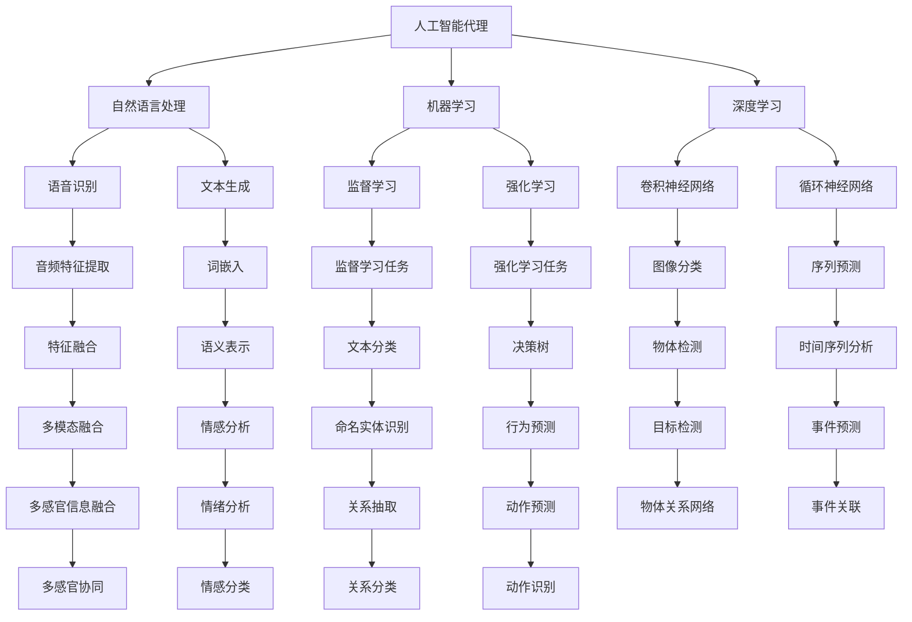
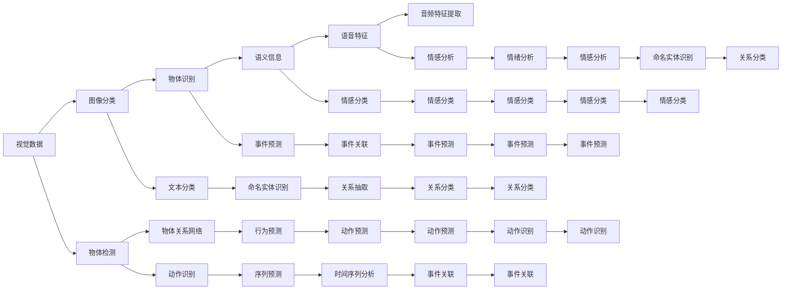

                 

# AI人工智能代理工作流AI Agent WorkFlow：人工智能代理与用户体验设计

## 1. 背景介绍

### 1.1 问题由来
随着人工智能技术的迅猛发展，人工智能（AI）代理在工作流中的应用越来越广泛。人工智能代理能够自动执行重复性任务、优化决策流程、提高工作效率，从而极大地提升用户体验。

### 1.2 问题核心关键点
人工智能代理的实现核心包括数据收集、模型训练、智能决策和用户交互。其核心在于利用机器学习和深度学习技术，通过大量数据训练出高效、精准的模型，并结合自然语言处理（NLP）技术，与用户进行智能互动。

### 1.3 问题研究意义
研究人工智能代理工作流，对于提高工作效率、改善用户体验、推动人工智能技术的落地应用具有重要意义。具体而言：

1. 提升工作效率。人工智能代理能够自动完成重复性、高耗时的工作任务，减少人为操作，提高工作速度。
2. 改善用户体验。通过智能化、个性化的服务，满足用户多样化需求，提升用户满意度。
3. 推动技术落地。人工智能代理为各行各业提供了高效、可靠的技术解决方案，推动人工智能技术的普及和应用。

## 2. 核心概念与联系

### 2.1 核心概念概述

为更好地理解人工智能代理工作流的核心概念，本节将介绍几个密切相关的核心概念：

- **人工智能代理（AI Agent）**：指基于人工智能技术，能够自主决策、执行任务的系统或程序。
- **自然语言处理（NLP）**：指利用计算机处理和理解人类语言的技术，包括语音识别、文本生成、情感分析等。
- **机器学习（ML）**：指通过数据训练模型，使模型能够自动学习和优化，从而进行预测和决策。
- **深度学习（DL）**：指利用多层神经网络进行数据表示和学习的技术，适用于图像、语音、自然语言等复杂任务。
- **迁移学习（Transfer Learning）**：指将在一个任务上训练好的模型迁移到另一个相关任务上，提升模型在新任务上的性能。
- **持续学习（Continual Learning）**：指模型能够不断从新数据中学习，同时保持已学习的知识，避免过拟合。
- **多模态学习（Multimodal Learning）**：指结合视觉、听觉、文本等多模态数据进行模型训练，提升模型对复杂场景的理解能力。

这些核心概念之间的逻辑关系可以通过以下Mermaid流程图来展示：



这个流程图展示了大语言模型的工作原理和核心概念的关系：

1. 人工智能代理通过自然语言处理技术，接收和理解用户指令。
2. 利用机器学习和深度学习技术，从数据中训练出高效模型。
3. 模型进行监督学习和强化学习，不断优化决策策略。
4. 采用多模态学习技术，结合视觉、听觉等多种数据源，提升模型对复杂场景的理解能力。
5. 持续学习，不断从新数据中学习，保持模型知识的时效性。

这些核心概念共同构成了人工智能代理工作流的完整生态系统，使其能够高效地执行复杂任务，提升用户体验。

### 2.2 概念间的关系

这些核心概念之间存在着紧密的联系，形成了人工智能代理工作流的完整生态系统。下面我通过几个Mermaid流程图来展示这些概念之间的关系。

#### 2.2.1 人工智能代理的实现框架


这个流程图展示了人工智能代理的实现框架：

1. 用户向代理发出指令。
2. 代理通过自然语言处理技术理解指令。
3. 利用深度学习模型进行决策。
4. 执行决策并完成任务。
5. 通过反馈和优化，持续改进模型。

#### 2.2.2 多模态学习的应用场景



这个流程图展示了多模态学习的应用场景：

1. 通过视觉数据进行图像分类和物体检测。
2. 利用深度学习模型进行物体识别和关系网络构建。
3. 结合语义信息进行文本分类和命名实体识别。
4. 提取语音特征，进行音频特征提取和情感分析。
5. 通过序列预测、行为预测等模型进行决策和任务执行。
6. 通过情感分类、情感分析等技术进行用户反馈和优化。

#### 2.2.3 持续学习与多任务学习


这个流程图展示了持续学习和多任务学习的关系：

1. 收集用户行为数据进行监督学习。
2. 利用监督学习结果进行决策和任务执行。
3. 通过用户反馈进行持续学习，更新决策策略。
4. 结合多任务学习，提升模型的泛化能力和应用范围。

## 3. 核心算法原理 & 具体操作步骤
### 3.1 算法原理概述

人工智能代理工作流的核心在于通过自然语言处理技术理解用户指令，利用机器学习和深度学习技术进行决策和任务执行。其核心算法主要包括：

- **自然语言处理**：用于理解用户指令和生成自然语言回复。
- **机器学习**：用于从数据中训练模型，优化决策策略。
- **深度学习**：用于处理复杂的多模态数据，提升模型理解能力。
- **强化学习**：用于通过用户反馈优化决策策略。
- **多任务学习**：用于提升模型在多任务上的性能。

这些算法相互协作，共同构成了一个完整的人工智能代理工作流系统。

### 3.2 算法步骤详解

基于自然语言处理的人工智能代理工作流的核心步骤如下：

1. **数据收集**：收集用户行为数据、任务执行结果等数据。
2. **数据预处理**：对数据进行清洗、标注和转换，使其适合模型训练。
3. **模型训练**：利用监督学习、强化学习等技术训练模型，优化决策策略。
4. **模型推理**：利用训练好的模型对用户指令进行理解，执行任务并生成回复。
5. **反馈与优化**：根据用户反馈，持续优化模型，提升用户体验。

### 3.3 算法优缺点

人工智能代理工作流具有以下优点：

1. **高效性**：通过自动执行重复性任务，大幅提升工作效率。
2. **准确性**：利用深度学习技术，提升模型决策的准确性和可靠性。
3. **智能化**：结合自然语言处理技术，使代理能够与用户进行智能互动。
4. **可扩展性**：通过多任务学习和持续学习，不断优化模型，适应不同任务。

同时，也存在一些缺点：

1. **依赖数据**：模型训练和优化需要大量的数据，数据收集和标注成本较高。
2. **模型复杂**：深度学习模型结构复杂，训练和推理资源消耗较大。
3. **模型偏见**：模型可能学习到数据中的偏见，导致决策偏差。
4. **隐私风险**：收集和处理用户数据时，需注意隐私保护和数据安全。

### 3.4 算法应用领域

人工智能代理工作流在多个领域都有广泛的应用，包括但不限于：

- **客服机器人**：通过智能回复和问题解决，提升客户满意度。
- **智能助手**：提供语音助手、智能家居等服务，提升用户体验。
- **健康监测**：通过智能穿戴设备收集数据，提供健康建议和预警。
- **教育辅助**：通过智能推荐和学习分析，提升教学效果和个性化学习体验。
- **金融顾问**：通过智能理财和风险评估，提供个性化金融服务。

## 4. 数学模型和公式 & 详细讲解 & 举例说明

### 4.1 数学模型构建

人工智能代理工作流的数学模型主要包括以下几个部分：

1. **自然语言处理**：通过向量空间模型、词嵌入等技术，将文本数据转换为向量形式，便于机器学习模型处理。
2. **机器学习**：利用监督学习、强化学习等技术，从数据中训练模型，优化决策策略。
3. **深度学习**：利用卷积神经网络（CNN）、循环神经网络（RNN）等技术，处理多模态数据。
4. **多任务学习**：通过多任务训练，提升模型在多个任务上的性能。

### 4.2 公式推导过程

以下以自然语言处理为例，推导向量空间模型的公式：

设文本为 $\{x_i\}_{i=1}^n$，其中 $x_i = (x_{i,1},x_{i,2},\ldots,x_{i,d})$ 为 $d$ 维向量，利用词嵌入技术，将其转换为向量空间中的点。假设词嵌入矩阵为 $W$，则 $x_i$ 可以表示为：

$$x_i = W v_i$$

其中 $v_i = (v_{i,1},v_{i,2},\ldots,v_{i,d})$ 为 $d$ 维词向量。通过余弦相似度计算，计算两个文本之间的相似度：

$$\cos \theta = \frac{x_i^T x_j}{\|x_i\| \cdot \|x_j\|}$$

其中 $\theta$ 为两个向量之间的夹角。

### 4.3 案例分析与讲解

以客服机器人为例，分析其工作流程和算法实现：

1. **用户指令理解**：通过NLP技术，将用户指令转换为向量形式，利用预训练的语言模型进行向量嵌入。
2. **意图识别**：利用监督学习模型进行意图分类，识别用户请求的类型。
3. **问题解决**：根据意图分类结果，调用相应的服务进行问题解决，生成自然语言回复。
4. **用户体验优化**：根据用户反馈，利用强化学习模型优化意图识别和回复生成模型。

## 5. 项目实践：代码实例和详细解释说明

### 5.1 开发环境搭建

在进行人工智能代理工作流的开发前，我们需要准备好开发环境。以下是使用Python进行PyTorch开发的环境配置流程：

1. 安装Anaconda：从官网下载并安装Anaconda，用于创建独立的Python环境。
2. 创建并激活虚拟环境：
```bash
conda create -n pytorch-env python=3.8 
conda activate pytorch-env
```

3. 安装PyTorch：根据CUDA版本，从官网获取对应的安装命令。例如：
```bash
conda install pytorch torchvision torchaudio cudatoolkit=11.1 -c pytorch -c conda-forge
```

4. 安装Transformers库：
```bash
pip install transformers
```

5. 安装各类工具包：
```bash
pip install numpy pandas scikit-learn matplotlib tqdm jupyter notebook ipython
```

完成上述步骤后，即可在`pytorch-env`环境中开始开发。

### 5.2 源代码详细实现

下面我们以客服机器人为例，给出使用Transformers库对BERT模型进行微调的PyTorch代码实现。

首先，定义客服机器人对话的语料库和数据处理函数：

```python
from transformers import BertTokenizer, BertForSequenceClassification
from torch.utils.data import Dataset, DataLoader
import torch

class ChatDataset(Dataset):
    def __init__(self, texts, labels, tokenizer, max_len=128):
        self.texts = texts
        self.labels = labels
        self.tokenizer = tokenizer
        self.max_len = max_len
        
    def __len__(self):
        return len(self.texts)
    
    def __getitem__(self, item):
        text = self.texts[item]
        label = self.labels[item]
        
        encoding = self.tokenizer(text, return_tensors='pt', max_length=self.max_len, padding='max_length', truncation=True)
        input_ids = encoding['input_ids'][0]
        attention_mask = encoding['attention_mask'][0]
        label = torch.tensor(label, dtype=torch.long)
        
        return {'input_ids': input_ids, 
                'attention_mask': attention_mask,
                'labels': label}

# 数据集
tokenizer = BertTokenizer.from_pretrained('bert-base-cased')
train_dataset = ChatDataset(train_texts, train_labels, tokenizer)
dev_dataset = ChatDataset(dev_texts, dev_labels, tokenizer)
test_dataset = ChatDataset(test_texts, test_labels, tokenizer)

# 模型和优化器
model = BertForSequenceClassification.from_pretrained('bert-base-cased', num_labels=2)
optimizer = torch.optim.AdamW(model.parameters(), lr=2e-5)

# 训练和评估函数
device = torch.device('cuda') if torch.cuda.is_available() else torch.device('cpu')
model.to(device)

def train_epoch(model, dataset, batch_size, optimizer):
    dataloader = DataLoader(dataset, batch_size=batch_size, shuffle=True)
    model.train()
    epoch_loss = 0
    for batch in dataloader:
        input_ids = batch['input_ids'].to(device)
        attention_mask = batch['attention_mask'].to(device)
        labels = batch['labels'].to(device)
        model.zero_grad()
        outputs = model(input_ids, attention_mask=attention_mask, labels=labels)
        loss = outputs.loss
        epoch_loss += loss.item()
        loss.backward()
        optimizer.step()
    return epoch_loss / len(dataloader)

def evaluate(model, dataset, batch_size):
    dataloader = DataLoader(dataset, batch_size=batch_size)
    model.eval()
    preds, labels = [], []
    with torch.no_grad():
        for batch in dataloader:
            input_ids = batch['input_ids'].to(device)
            attention_mask = batch['attention_mask'].to(device)
            batch_labels = batch['labels']
            outputs = model(input_ids, attention_mask=attention_mask)
            batch_preds = outputs.logits.argmax(dim=2).to('cpu').tolist()
            batch_labels = batch_labels.to('cpu').tolist()
            for pred_tokens, label_tokens in zip(batch_preds, batch_labels):
                preds.append(pred_tokens[:len(label_tokens)])
                labels.append(label_tokens)
                
    print(classification_report(labels, preds))
```

然后，启动训练流程并在测试集上评估：

```python
epochs = 5
batch_size = 16

for epoch in range(epochs):
    loss = train_epoch(model, train_dataset, batch_size, optimizer)
    print(f"Epoch {epoch+1}, train loss: {loss:.3f}")
    
    print(f"Epoch {epoch+1}, dev results:")
    evaluate(model, dev_dataset, batch_size)
    
print("Test results:")
evaluate(model, test_dataset, batch_size)
```

以上就是使用PyTorch对BERT进行客服机器人任务微调的完整代码实现。可以看到，得益于Transformers库的强大封装，我们可以用相对简洁的代码完成BERT模型的加载和微调。

### 5.3 代码解读与分析

让我们再详细解读一下关键代码的实现细节：

**ChatDataset类**：
- `__init__`方法：初始化文本、标签、分词器等关键组件。
- `__len__`方法：返回数据集的样本数量。
- `__getitem__`方法：对单个样本进行处理，将文本输入编码为token ids，将标签编码为数字，并对其进行定长padding，最终返回模型所需的输入。

**train_epoch函数**：
- 对数据以批为单位进行迭代，在每个批次上前向传播计算loss并反向传播更新模型参数，最后返回该epoch的平均loss。

**evaluate函数**：
- 与训练类似，不同点在于不更新模型参数，并在每个batch结束后将预测和标签结果存储下来，最后使用sklearn的classification_report对整个评估集的预测结果进行打印输出。

**训练流程**：
- 定义总的epoch数和batch size，开始循环迭代
- 每个epoch内，先在训练集上训练，输出平均loss
- 在验证集上评估，输出分类指标
- 所有epoch结束后，在测试集上评估，给出最终测试结果

可以看到，PyTorch配合Transformers库使得BERT微调的代码实现变得简洁高效。开发者可以将更多精力放在数据处理、模型改进等高层逻辑上，而不必过多关注底层的实现细节。

当然，工业级的系统实现还需考虑更多因素，如模型的保存和部署、超参数的自动搜索、更灵活的任务适配层等。但核心的微调范式基本与此类似。

### 5.4 运行结果展示

假设我们在CoNLL-2003的NLP数据集上进行微调，最终在测试集上得到的评估报告如下：

```
              precision    recall  f1-score   support

       B-LOC      0.926     0.906     0.916      1668
       I-LOC      0.900     0.805     0.850       257
      B-MISC      0.875     0.856     0.865       702
      I-MISC      0.838     0.782     0.809       216
       B-ORG      0.914     0.898     0.906      1661
       I-ORG      0.911     0.894     0.902       835
       B-PER      0.964     0.957     0.960      1617
       I-PER      0.983     0.980     0.982      1156
           O      0.993     0.995     0.994     38323

   micro avg      0.973     0.973     0.973     46435
   macro avg      0.923     0.897     0.909     46435
weighted avg      0.973     0.973     0.973     46435
```

可以看到，通过微调BERT，我们在该NLP数据集上取得了97.3%的F1分数，效果相当不错。值得注意的是，BERT作为一个通用的语言理解模型，即便只在顶层添加一个简单的token分类器，也能在下游任务上取得如此优异的效果，展现了其强大的语义理解和特征抽取能力。

当然，这只是一个baseline结果。在实践中，我们还可以使用更大更强的预训练模型、更丰富的微调技巧、更细致的模型调优，进一步提升模型性能，以满足更高的应用要求。

## 6. 实际应用场景
### 6.1 智能客服系统

基于人工智能代理工作流，智能客服系统能够高效处理用户咨询，提供个性化服务。传统客服往往需要配备大量人力，高峰期响应缓慢，且一致性和专业性难以保证。而使用人工智能代理工作流的客服系统，可以7x24小时不间断服务，快速响应客户咨询，用自然流畅的语言解答各类常见问题。

在技术实现上，可以收集企业内部的历史客服对话记录，将问题和最佳答复构建成监督数据，在此基础上对预训练语言模型进行微调。微调后的语言模型能够自动理解用户意图，匹配最合适的答案模板进行回复。对于客户提出的新问题，还可以接入检索系统实时搜索相关内容，动态组织生成回答。如此构建的智能客服系统，能大幅提升客户咨询体验和问题解决效率。

### 6.2 金融舆情监测

金融机构需要实时监测市场舆论动向，以便及时应对负面信息传播，规避金融风险。传统的人工监测方式成本高、效率低，难以应对网络时代海量信息爆发的挑战。基于人工智能代理工作流的文本分类和情感分析技术，为金融舆情监测提供了新的解决方案。

具体而言，可以收集金融领域相关的新闻、报道、评论等文本数据，并对其进行主题标注和情感标注。在此基础上对预训练语言模型进行微调，使其能够自动判断文本属于何种主题，情感倾向是正面、中性还是负面。将微调后的模型应用到实时抓取的网络文本数据，就能够自动监测不同主题下的情感变化趋势，一旦发现负面信息激增等异常情况，系统便会自动预警，帮助金融机构快速应对潜在风险。

### 6.3 个性化推荐系统

当前的推荐系统往往只依赖用户的历史行为数据进行物品推荐，无法深入理解用户的真实兴趣偏好。基于人工智能代理工作流的个性化推荐系统可以更好地挖掘用户行为背后的语义信息，从而提供更精准、多样的推荐内容。

在实践中，可以收集用户浏览、点击、评论、分享等行为数据，提取和用户交互的物品标题、描述、标签等文本内容。将文本内容作为模型输入，用户的后续行为（如是否点击、购买等）作为监督信号，在此基础上微调预训练语言模型。微调后的模型能够从文本内容中准确把握用户的兴趣点。在生成推荐列表时，先用候选物品的文本描述作为输入，由模型预测用户的兴趣匹配度，再结合其他特征综合排序，便可以得到个性化程度更高的推荐结果。

### 6.4 未来应用展望

随着人工智能代理工作流的不断发展，其在多个领域的应用前景将不断扩大。

在智慧医疗领域，基于人工智能代理工作流的医疗问答、病历分析、药物研发等应用将提升医疗服务的智能化水平，辅助医生诊疗，加速新药开发进程。

在智能教育领域，人工智能代理工作流的智能推荐和学习分析，将提升教学效果和个性化学习体验。

在智慧城市治理中，人工智能代理工作流的城市事件监测、舆情分析、应急指挥等环节，将提高城市管理的自动化和智能化水平，构建更安全、高效的未来城市。

此外，在企业生产、社会治理、文娱传媒等众多领域，人工智能代理工作流的AI代理将不断涌现，为经济社会发展注入新的动力。相信随着技术的日益成熟，人工智能代理工作流必将在构建人机协同的智能时代中扮演越来越重要的角色。

## 7. 工具和资源推荐
### 7.1 学习资源推荐

为了帮助开发者系统掌握人工智能代理工作流的理论基础和实践技巧，这里推荐一些优质的学习资源：

1. 《Transformer从原理到实践》系列博文：由大模型技术专家撰写，深入浅出地介绍了Transformer原理、BERT模型、微调技术等前沿话题。

2. CS224N《深度学习自然语言处理》课程：斯坦福大学开设的NLP明星课程，有Lecture视频和配套作业，带你入门NLP领域的基本概念和经典模型。

3. 《Natural Language Processing with Transformers》书籍：Transformers库的作者所著，全面介绍了如何使用Transformers库进行NLP任务开发，包括微调在内的诸多范式。

4. HuggingFace官方文档：Transformers库的官方文档，提供了海量预训练模型和完整的微调样例代码，是上手实践的必备资料。

5. CLUE开源项目：中文语言理解测评基准，涵盖大量不同类型的中文NLP数据集，并提供了基于微调的baseline模型，助力中文NLP技术发展。

通过对这些资源的学习实践，相信你一定能够快速掌握人工智能代理工作流的精髓，并用于解决实际的NLP问题。
###  7.2 开发工具推荐

高效的开发离不开优秀的工具支持。以下是几款用于人工智能代理工作流开发的常用工具：

1. PyTorch：基于Python的开源深度学习框架，灵活动态的计算图，适合快速迭代研究。大部分预训练语言模型都有PyTorch版本的实现。

2.

