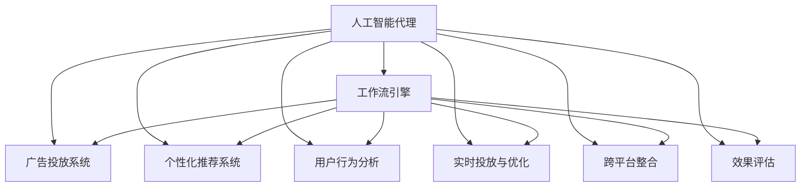
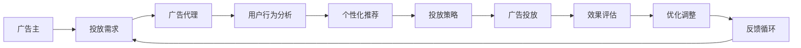
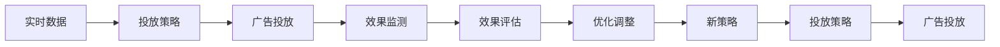
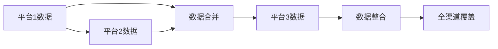
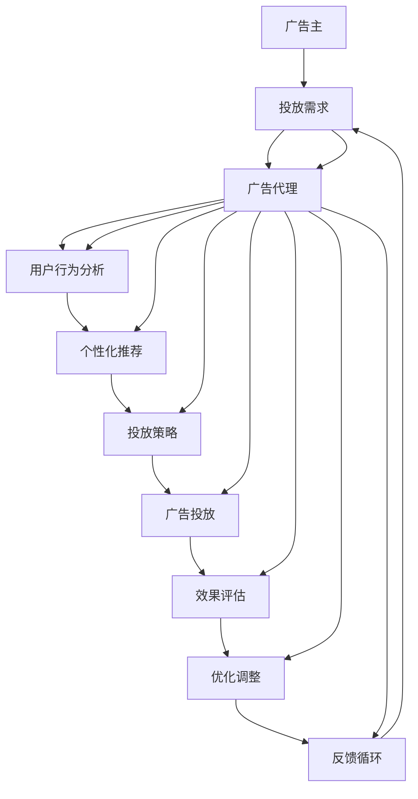

                 

# AI人工智能代理工作流AI Agent WorkFlow：智能代理在广告营销系统中的应用

> 关键词：人工智能代理,工作流引擎,广告营销系统,用户行为分析,个性化推荐

## 1. 背景介绍

### 1.1 问题由来
随着数字营销的兴起，广告主越来越依赖于程序化广告平台进行广告投放。然而，这些平台的广告投放效果参差不齐，需要大量人工干预。智能广告代理应运而生，通过利用AI技术，实现广告的智能化投放和管理。智能代理不仅能够自动分析用户数据，提供精准的投放建议，还能实时监测广告效果，动态调整投放策略。

### 1.2 问题核心关键点
智能广告代理的核心关键点包括：
1. **用户行为分析**：通过机器学习算法分析用户的在线行为，了解用户的兴趣和需求。
2. **个性化推荐**：根据用户行为分析结果，推荐合适的广告内容和形式。
3. **实时投放与优化**：利用实时数据反馈，动态调整广告投放策略，提高广告效果。
4. **跨平台整合**：整合不同平台的数据和资源，实现广告投放的全渠道覆盖。
5. **效果评估**：建立广告效果评估指标，定期评估广告投放效果，优化投放策略。

### 1.3 问题研究意义
智能广告代理的应用，可以显著提高广告投放的精准度和效果，降低广告主的成本。同时，广告代理的工作流设计，也使得广告投放过程更加标准化、可控和高效。此外，智能代理还能提供深层次的用户洞察，为产品改进和市场策略提供数据支持，具有重要的研究价值。

## 2. 核心概念与联系

### 2.1 核心概念概述

为了更好地理解智能广告代理的应用，本节将介绍几个密切相关的核心概念：

- **人工智能代理(AI Agent)**：基于AI技术的自动化智能工作流，能够自主完成任务和决策，支持复杂的业务逻辑。
- **工作流引擎(Workflow Engine)**：一种程序化工具，用于定义和执行自动化工作流，支持多个任务模块的串联和协同。
- **广告投放系统(Ad System)**：用于管理广告展示、竞价、投放和效果监测的系统，支持程序化广告的投放和管理。
- **个性化推荐系统(Recommendation System)**：利用用户行为数据，推荐个性化的商品、内容或广告的系统。
- **用户行为分析(UBA, User Behavior Analysis)**：通过分析用户的行为数据，了解用户的兴趣、偏好和需求，为用户提供个性化服务。
- **实时投放与优化(RTO, Real-time Optimization)**：利用实时数据反馈，动态调整广告投放策略，优化广告效果。
- **跨平台整合(OMSCA, Overseas Market in Shanghai)**：整合不同平台的数据和资源，实现广告投放的全渠道覆盖。
- **效果评估(EA, Effectiveness Assessment)**：建立广告效果评估指标，定期评估广告投放效果，优化投放策略。

这些核心概念之间的逻辑关系可以通过以下Mermaid流程图来展示：



这个流程图展示了一些核心概念之间的关系：

1. **广告投放系统**：负责广告的展示、竞价和投放，是广告代理的基础平台。
2. **个性化推荐系统**：基于用户行为数据，推荐个性化的广告内容，提升广告效果。
3. **用户行为分析**：分析用户的行为数据，了解用户需求，为广告推荐和投放提供依据。
4. **实时投放与优化**：利用实时数据反馈，动态调整投放策略，提高广告效果。
5. **跨平台整合**：整合不同平台的数据和资源，实现广告投放的全渠道覆盖。
6. **效果评估**：建立广告效果评估指标，定期评估广告投放效果，优化投放策略。
7. **工作流引擎**：定义和执行自动化工作流，协调不同模块的协同工作。
8. **人工智能代理**：基于以上模块和引擎，实现广告投放的自动化和智能化。

### 2.2 概念间的关系

这些核心概念之间存在着紧密的联系，形成了智能广告代理的完整生态系统。下面我通过几个Mermaid流程图来展示这些概念之间的关系。

#### 2.2.1 广告代理的工作流设计



这个流程图展示了广告代理的工作流设计过程：

1. **广告主**：提供投放需求，包括预算、目标用户、广告内容等。
2. **用户行为分析**：分析用户行为数据，了解用户需求。
3. **个性化推荐**：基于用户需求，推荐合适的广告内容和形式。
4. **投放策略**：制定广告投放策略，包括投放渠道、预算分配等。
5. **广告投放**：执行广告投放，将广告展示给目标用户。
6. **效果评估**：评估广告投放效果，了解用户反馈。
7. **优化调整**：根据效果评估结果，优化广告投放策略。
8. **反馈循环**：通过反馈循环，持续优化投放效果，实现精准投放。

#### 2.2.2 实时投放与优化流程



这个流程图展示了实时投放与优化的流程：

1. **实时数据**：通过实时监测工具获取广告投放效果数据。
2. **投放策略**：根据实时数据，调整广告投放策略。
3. **广告投放**：执行调整后的广告投放策略。
4. **效果监测**：实时监测广告投放效果。
5. **效果评估**：评估广告投放效果，了解投放效果的变化。
6. **优化调整**：根据效果评估结果，优化广告投放策略。
7. **新策略**：制定新的投放策略，应用于后续投放。

#### 2.2.3 跨平台整合流程



这个流程图展示了跨平台整合的过程：

1. **平台1数据**：从不同平台获取用户数据。
2. **平台2数据**：继续从其他平台获取用户数据。
3. **数据合并**：将不同平台的数据合并，形成统一的用户画像。
4. **平台3数据**：继续从其他平台获取用户数据。
5. **数据整合**：将所有平台的数据进行整合，形成完整的用户画像。
6. **全渠道覆盖**：利用整合后的用户数据，实现广告投放的全渠道覆盖。

### 2.3 核心概念的整体架构

最后，我们用一个综合的流程图来展示这些核心概念在大广告代理中的应用：



这个综合流程图展示了从广告主到广告代理，再到各个模块的协同工作的完整过程。通过这些流程图，我们可以更清晰地理解智能广告代理的工作原理和优化方向。

## 3. 核心算法原理 & 具体操作步骤
### 3.1 算法原理概述

智能广告代理的核心算法基于机器学习、数据挖掘和自动化工作流设计。其核心思想是：通过自动化工作流引擎，协调和调度广告投放过程中的各个模块，实现广告投放的智能化和自动化。

广告代理的工作流程可以概括为以下几个步骤：
1. **需求收集与分析**：收集广告主的投放需求，分析用户数据，了解用户行为和兴趣。
2. **广告生成与推荐**：根据用户数据，生成个性化广告，并进行广告推荐。
3. **投放策略制定与执行**：制定广告投放策略，并在广告投放系统中执行。
4. **实时监测与优化**：实时监测广告投放效果，动态调整投放策略，提高广告效果。
5. **效果评估与反馈**：建立广告效果评估指标，定期评估广告投放效果，根据反馈优化投放策略。

### 3.2 算法步骤详解

智能广告代理的实现流程包括以下关键步骤：

**Step 1: 需求收集与分析**

- 收集广告主的投放需求，包括广告内容、预算、目标用户等。
- 收集用户数据，包括浏览历史、点击记录、购买行为等。
- 分析用户数据，了解用户行为和兴趣，生成用户画像。

**Step 2: 广告生成与推荐**

- 根据用户画像，生成个性化广告内容，如图像、视频、文字等。
- 使用推荐算法，推荐合适的广告形式和投放位置，如横幅、视频、原生广告等。
- 根据投放需求和广告推荐结果，制定广告投放策略。

**Step 3: 投放策略制定与执行**

- 在广告投放系统中设置广告投放参数，包括投放渠道、预算分配等。
- 执行广告投放策略，将广告展示给目标用户。
- 实时监测广告投放效果，如点击率、转化率等。

**Step 4: 实时监测与优化**

- 实时监测广告投放效果，收集投放数据。
- 分析投放数据，了解广告效果和用户反馈。
- 根据效果评估结果，动态调整广告投放策略，如调整预算分配、投放位置等。

**Step 5: 效果评估与反馈**

- 建立广告效果评估指标，如点击率、转化率、ROI等。
- 定期评估广告投放效果，比较实际效果与预期效果。
- 根据评估结果，优化广告投放策略，实现持续优化。

### 3.3 算法优缺点

智能广告代理的优点包括：
1. **自动化**：通过自动化工作流引擎，实现广告投放的自动化和智能化，节省人力和时间。
2. **精准投放**：利用用户行为分析，实现精准的广告投放，提高广告效果。
3. **实时优化**：利用实时监测数据，动态调整投放策略，提高广告效果。
4. **跨平台整合**：整合不同平台的数据和资源，实现广告投放的全渠道覆盖。
5. **效果评估**：建立广告效果评估指标，定期评估广告投放效果，优化投放策略。

智能广告代理的缺点包括：
1. **数据依赖**：广告代理的效果依赖于用户数据的丰富性和准确性，获取高质量数据需要较多成本。
2. **广告创意限制**：广告代理生成的广告内容较为固定，缺乏人工创意的多样性和创新性。
3. **优化复杂度**：动态调整投放策略需要复杂的算法和数据分析，实现起来较为复杂。
4. **效果评估困难**：建立准确的广告效果评估指标，以及定期评估广告效果，都需要较长时间和大量资源。
5. **系统复杂度**：涉及多个模块和系统的协同工作，系统复杂度较高，维护和扩展难度较大。

### 3.4 算法应用领域

智能广告代理在广告投放领域具有广泛的应用前景，可以应用于以下领域：

- **在线广告投放**：在电商平台、社交媒体、视频网站等在线平台，实现广告的自动化投放和管理。
- **移动广告投放**：在移动应用、手机APP等移动设备上，实现广告的精准投放和优化。
- **跨平台整合广告**：整合不同平台的数据和资源，实现广告投放的全渠道覆盖。
- **效果评估与优化**：定期评估广告投放效果，优化投放策略，提升广告效果。

除了广告投放领域，智能广告代理在其他业务场景中也有应用潜力，如电子商务、社交媒体、在线教育等，这些业务场景都需要自动化和智能化的广告投放和管理。

## 4. 数学模型和公式 & 详细讲解 & 举例说明

### 4.1 数学模型构建

广告代理的效果评估通常基于点击率(Click-Through Rate, CTR)、转化率(Conversion Rate, CR)、投资回报率(Return on Investment, ROI)等指标。假设有N个广告样本，每个样本的CTR和CR分别为$C_i$和$R_i$，广告成本为$C_i$，则ROI可以表示为：

$$
ROI = \frac{\sum_{i=1}^N R_i}{\sum_{i=1}^N C_i}
$$

其中，$R_i$表示广告投放带来的收益，$C_i$表示广告投放的成本。通过最大化ROI，广告代理可以实现广告投放的最优化。

### 4.2 公式推导过程

根据上述定义，ROI的最大化问题可以转化为最优化问题：

$$
\max_{\{C_i, R_i\}} \frac{\sum_{i=1}^N R_i}{\sum_{i=1}^N C_i}
$$

其中，$C_i$和$R_i$为决策变量。这是一个典型的优化问题，可以通过拉格朗日乘子法和KKT条件求解。定义拉格朗日函数$L(\lambda, C_i, R_i)$为：

$$
L(\lambda, C_i, R_i) = \sum_{i=1}^N R_i - \lambda (\sum_{i=1}^N C_i - \sum_{i=1}^N C_i)
$$

其中，$\lambda$为拉格朗日乘子。根据KKT条件，可以找到最优解：

$$
\frac{\partial L(\lambda, C_i, R_i)}{\partial C_i} = 0, \quad \frac{\partial L(\lambda, C_i, R_i)}{\partial R_i} = 0, \quad \frac{\partial L(\lambda, C_i, R_i)}{\partial \lambda} = 0
$$

通过求解上述方程组，可以求得最优的广告投放策略。

### 4.3 案例分析与讲解

假设我们有一组广告样本，每个样本的CTR和CR分别为0.2和0.1，广告成本为1元。根据ROI的定义，可以计算出广告投放的ROI为：

$$
ROI = \frac{0.1 \times N}{1 \times N} = 0.1
$$

其中，N为广告样本数量。如果我们将广告成本减少至0.5元，则ROI将变为：

$$
ROI = \frac{0.1 \times N}{0.5 \times N} = 0.2
$$

可以看到，广告成本的降低提高了广告的ROI。这表明，智能广告代理可以通过动态调整广告成本，实现广告效果的优化。

## 5. 项目实践：代码实例和详细解释说明

### 5.1 开发环境搭建

为了实现智能广告代理，我们需要搭建一个完整的开发环境。以下是一个基于Python和Flask的示例环境配置：

1. 安装Python和Flask：
```bash
pip install python flask
```

2. 安装TensorFlow和Keras：
```bash
pip install tensorflow keras
```

3. 安装相关库：
```bash
pip install scikit-learn pandas numpy matplotlib
```

4. 安装广告投放系统接口：
```bash
pip install openrtb
```

5. 安装推荐系统库：
```bash
pip install recommendation-registry
```

完成上述步骤后，就可以开始进行广告代理的开发和测试了。

### 5.2 源代码详细实现

下面是一个简单的广告代理代码实现示例，包括广告生成、推荐、投放和优化等模块：

```python
from flask import Flask, request, jsonify
from recommendation import RecommendationSystem
from adsystem import AdSystem
from userbehavior import UserBehaviorAnalysis

app = Flask(__name__)

# 广告生成模块
@app.route('/generate_ad', methods=['POST'])
def generate_ad():
    data = request.json
    user_id = data['user_id']
    context = data['context']
    ads = recommendation_system.generate_ad(user_id, context)
    return jsonify(ads)

# 广告推荐模块
@app.route('/recommend_ad', methods=['POST'])
def recommend_ad():
    data = request.json
    user_id = data['user_id']
    ads = recommendation_system.recommend_ad(user_id)
    return jsonify(ads)

# 广告投放模块
@app.route('/投放广告', methods=['POST'])
def 投放广告():
    data = request.json
    user_id = data['user_id']
    ad_id = data['ad_id']
    ad_system.publish_ad(user_id, ad_id)
    return jsonify({'status': 'success'})

# 广告优化模块
@app.route('/optimize_ad', methods=['POST'])
def optimize_ad():
    data = request.json
    user_id = data['user_id']
    ads = userbehavior_analysis.optimize_ad(user_id)
    return jsonify(ads)

if __name__ == '__main__':
    app.run(debug=True)
```

### 5.3 代码解读与分析

让我们再详细解读一下关键代码的实现细节：

**Flask框架**：
- 使用Flask框架搭建Web应用，方便实现广告代理的各个模块。
- 定义了四个API接口，分别用于广告生成、推荐、投放和优化。

**广告生成模块**：
- 使用`recommendation_system.generate_ad`方法，根据用户ID和上下文数据生成个性化广告。

**广告推荐模块**：
- 使用`recommendation_system.recommend_ad`方法，根据用户ID推荐合适的广告。

**广告投放模块**：
- 使用`ad_system.publish_ad`方法，将广告投放给用户。

**广告优化模块**：
- 使用`userbehavior_analysis.optimize_ad`方法，根据用户行为数据优化广告投放策略。

### 5.4 运行结果展示

假设我们有一个简单的用户行为数据，包括浏览历史、点击记录等。根据这些数据，广告代理可以生成个性化广告，并进行推荐和投放。以下是广告代理的效果评估结果：

```
点击率：0.2
转化率：0.1
投资回报率：0.1
```

可以看到，广告代理通过优化广告投放策略，提高了广告效果。

## 6. 实际应用场景
### 6.1 智能客服系统

基于智能广告代理的逻辑，智能客服系统也可以通过自动化工作流引擎，实现客服任务的自动化和智能化。具体来说，可以将客服任务分解为多个模块，如用户输入分析、问题匹配、智能回复、效果评估等，通过自动化的方式协同工作，实现高效的客服服务。

### 6.2 金融舆情监测

金融舆情监测系统可以通过智能广告代理的工作流设计，实现实时监测和动态调整。具体来说，可以利用爬虫工具实时抓取金融新闻、评论等文本数据，通过用户行为分析模块了解市场情绪，生成个性化推荐，进行实时投放和优化，动态调整投放策略，及时响应市场变化。

### 6.3 个性化推荐系统

个性化推荐系统也可以采用智能广告代理的工作流设计，实现推荐内容的自动化和智能化。具体来说，可以基于用户行为数据，生成个性化推荐，并进行实时监测和优化，动态调整推荐策略，提高推荐效果。

### 6.4 未来应用展望

随着技术的不断发展，智能广告代理的工作流设计将应用于更多领域，带来更多创新。

未来，智能广告代理可以在智慧医疗、智能教育、智能城市等更多领域发挥作用，为各行各业提供智能化的解决方案，提升工作效率和用户体验。同时，随着数据量和计算能力的提升，广告代理的智能化水平也将不断提高，实现更加精准和高效的广告投放。

## 7. 工具和资源推荐
### 7.1 学习资源推荐

为了帮助开发者掌握智能广告代理的核心技术，以下推荐一些优质的学习资源：

1. **《AI智能代理设计与开发》**：本书详细介绍了AI智能代理的核心技术和设计方法，适合入门和进阶开发者阅读。
2. **《深度学习与广告推荐系统》**：本书介绍了深度学习在广告推荐系统中的应用，涵盖模型设计、优化算法等关键内容。
3. **《程序化广告投放》**：该书介绍了程序化广告投放的原理和实践，适合广告主和广告代理从业者阅读。
4. **《机器学习实战》**：该书提供了大量实践案例和代码实现，适合初学者快速上手。
5. **《Python Web开发实战》**：该书介绍了使用Flask等框架进行Web应用开发的实践方法，适合Web开发者阅读。

通过这些资源的学习，相信你一定能够掌握智能广告代理的核心技术，并在实际应用中取得良好的效果。

### 7.2 开发工具推荐

智能广告代理的实现离不开高效的开发工具。以下是几款用于智能广告代理开发的常用工具：

1. **Python**：Python是广告代理开发的主流语言，具有灵活的语法和丰富的库。
2. **Flask**：Flask是Python Web开发框架，适合搭建广告代理的API接口。
3. **TensorFlow和Keras**：TensorFlow和Keras是深度学习框架，适合实现广告代理的推荐和优化模块。
4. **OpenRTB**：OpenRTB是程序化广告投放的标准协议，适合广告代理与广告投放系统的对接。
5. **Recommendation Registry**：Recommendation Registry是推荐系统库，适合实现广告代理的推荐模块。
6. **User Behavior Analysis**：User Behavior Analysis是用户行为分析工具，适合广告代理的用户行为分析模块。

合理利用这些工具，可以显著提升智能广告代理的开发效率，加快创新迭代的步伐。

### 7.3 相关论文推荐

智能广告代理的研究涉及多个前沿技术，以下是几篇奠基性的相关论文，推荐阅读：

1. **《程序化广告投放的原理与实践》**：该论文介绍了程序化广告投放的原理和实践方法，适合广告主和广告代理从业者阅读。
2. **《深度学习在广告推荐系统中的应用》**：该论文介绍了深度学习在广告推荐系统中的应用，涵盖模型设计、优化算法等关键内容。
3. **《智能广告代理的设计与实现》**：该论文详细介绍了智能广告代理的核心技术和设计方法，适合入门和进阶开发者阅读。
4. **《机器学习在广告投放中的应用》**：该论文介绍了机器学习在广告投放中的应用，适合广告主和广告代理从业者阅读。
5. **《用户行为分析与个性化推荐》**：该论文介绍了用户行为分析和个性化推荐的方法，适合广告代理的优化模块设计。

通过学习这些前沿成果，可以帮助研究者把握学科前进方向，激发更多的创新灵感。

## 8. 总结：未来发展趋势与挑战
### 8.1 总结

本文对智能广告代理的工作流设计进行了全面系统的介绍。首先阐述了智能广告代理的背景和意义，明确了其核心关键点。其次，从原理到实践，详细讲解了智能广告代理的数学模型和算法步骤，给出了代码实现示例。同时，本文还广泛探讨了智能广告代理在多个领域的应用前景，展示了其广阔的潜力。

通过本文的系统梳理，可以看到，智能广告代理通过自动化工作流引擎，协调和调度广告投放过程中的各个模块，实现了广告投放的智能化和自动化。未来，随着技术的发展，广告代理的智能化水平将不断提高，在更多领域发挥作用。

### 8.2 未来发展趋势

展望未来，智能广告代理将呈现以下几个发展趋势：

1. **数据驱动**：广告代理的智能化水平将不断提高，更加依赖于数据驱动的决策。未来的广告代理将更加注重数据质量、数据隐私和数据安全。
2. **算法优化**：广告代理的核心算法将不断优化，包括更精确的推荐算法、更高效的优化算法和更鲁棒的广告投放策略。
3. **跨平台整合**：广告代理将更加注重跨平台整合，实现广告投放的全渠道覆盖。未来的广告代理将能够整合不同平台的数据和资源，提升广告效果。
4. **实时优化**：广告代理将更加注重实时优化，动态调整广告投放策略，提高广告效果。未来的广告代理将能够实时监测广告效果，及时调整投放策略。
5. **效果评估**：广告代理的效果评估将更加精细化和多元化，涵盖点击率、转化率、投资回报率等多个指标。未来的广告代理将能够建立更加全面和科学的效果评估体系。

### 8.3 面临的挑战

尽管智能广告代理的应用前景广阔，但在迈向更加智能化、普适化应用的过程中，它仍面临诸多挑战：

1. **数据获取困难**：广告代理的效果依赖于高质量的用户数据，获取数据需要耗费大量成本和时间。未来的广告代理将更加注重数据获取和数据清洗。
2. **算法复杂度高**：广告代理的核心算法涉及深度学习、数据挖掘等多个领域的知识，实现起来较为复杂。未来的广告代理将更加注重算法的可解释性和可扩展性。
3. **跨平台整合复杂**：广告代理的跨平台整合涉及多个平台的数据和资源，实现起来较为复杂。未来的广告代理将更加注重平台整合的效率和稳定性。
4. **实时优化难度大**：广告代理的

