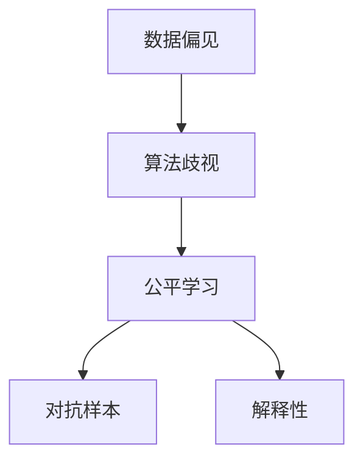
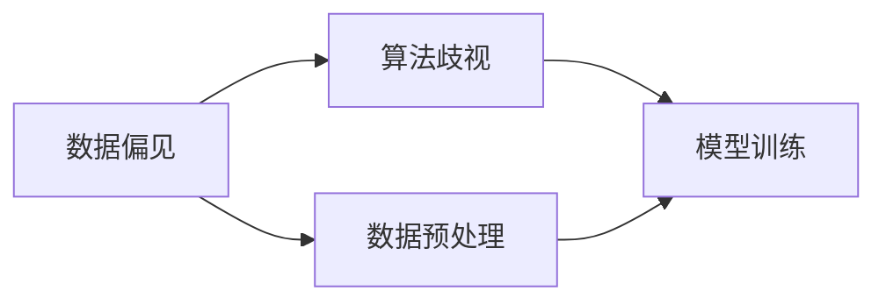
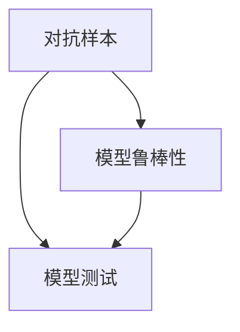
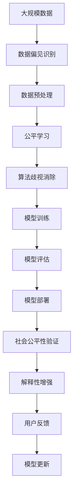

                 

# AI人工智能核心算法原理与代码实例讲解：AI社会公平性

> 关键词：AI社会公平性, 算法优化, 机器学习, 数据增强, 偏差消除, 公平学习, 实验分析, 代码实现

## 1. 背景介绍

### 1.1 问题由来
随着人工智能技术的飞速发展，机器学习（ML）和深度学习（DL）在医疗、金融、教育、司法等诸多领域中的应用越来越广泛。然而，这些技术在提高生产效率的同时，也暴露出了数据偏见和算法歧视的问题，导致社会不公现象加剧，甚至在某些情况下引发了严重的社会危机。

因此，如何在AI技术的研发和应用过程中，充分考虑社会公平性，确保技术能够惠及所有人，成为了当前AI领域的重要课题。本文旨在深入探讨AI社会公平性的核心算法原理，并通过具体的代码实例，展示如何实现基于社会公平性的机器学习算法优化。

### 1.2 问题核心关键点
实现AI社会公平性的关键在于：
- 识别数据偏见和算法歧视：通过数据分析，识别出数据集中的偏差，理解算法在决策过程中可能引入的歧视。
- 调整数据集和模型：对数据集和模型进行调整，消除偏差和歧视，提升模型的公平性。
- 验证和监控：在模型训练和部署过程中，持续验证和监控模型行为，确保其公平性符合社会标准。
- 透明和解释性：确保算法的决策过程透明，能够为使用者提供清晰的解释，增加模型的可解释性和可信度。

### 1.3 问题研究意义
研究AI社会公平性算法原理，对于推动AI技术在社会各领域的公平应用，构建公正、透明的AI系统，具有重要意义：
- 降低社会不公：通过消除数据和算法偏见，减少AI决策带来的不公平现象，促进社会公正。
- 增强技术可信度：透明和可解释的算法，有助于建立用户信任，提升AI系统的社会接受度。
- 促进技术发展：研究社会公平性算法，有助于探索新的技术路径和方法，推动AI技术的不断进步。
- 引导政策制定：为政府和企业制定AI伦理政策提供科学依据，促进AI技术的健康发展。

## 2. 核心概念与联系

### 2.1 核心概念概述

为更好地理解AI社会公平性的核心算法原理，本节将介绍几个密切相关的核心概念：

- **数据偏见（Data Bias）**：指数据集在采集、标注过程中，因不同群体、不同时间、不同地点等因素，导致数据分布不均衡，产生对某些群体的歧视性影响。
- **算法歧视（Algorithmic Discrimination）**：指机器学习模型在训练和应用过程中，由于数据偏差或模型设计不当，导致对某些群体产生不公平的决策结果。
- **公平学习（Fair Learning）**：指通过调整数据集和算法，消除偏见和歧视，提升模型的公平性和泛化性能。
- **对抗样本（Adversarial Examples）**：指有意构造的数据样本，使得模型在面对这些样本时，产生错误的预测结果，测试模型的鲁棒性。
- **解释性（Explainability）**：指算法的决策过程透明，能够为使用者提供清晰的解释，增加模型的可解释性和可信度。

这些核心概念之间的逻辑关系可以通过以下Mermaid流程图来展示：



这个流程图展示了大规模数据偏见和算法歧视对模型的影响，以及通过公平学习和解释性手段，实现对模型的调整和优化。

### 2.2 概念间的关系

这些核心概念之间存在着紧密的联系，形成了AI社会公平性的完整生态系统。下面我们通过几个Mermaid流程图来展示这些概念之间的关系。

#### 2.2.1 数据偏见与算法歧视的关系



这个流程图展示了数据偏见和算法歧视的基本关系，即数据偏见在模型训练过程中被放大，最终导致算法歧视。

#### 2.2.2 对抗样本与模型鲁棒性的关系



这个流程图展示了对抗样本对模型鲁棒性的影响，即通过测试对抗样本，检验模型是否具有足够的鲁棒性，避免被恶意攻击。

#### 2.2.3 解释性与模型透明度的关系


这个流程图展示了解释性与模型透明度的关系，即解释性模型的透明度更高，便于用户理解和调试。

### 2.3 核心概念的整体架构

最后，我们用一个综合的流程图来展示这些核心概念在大规模社会公平性算法中的整体架构：



这个综合流程图展示了从数据处理到模型部署的完整流程，以及通过验证和监控，持续提升模型的社会公平性。

## 3. 核心算法原理 & 具体操作步骤
### 3.1 算法原理概述

实现AI社会公平性的关键在于对数据和模型进行调整，使其在决策过程中，不引入任何形式的偏见和歧视。以下是基于社会公平性的核心算法原理：

- **数据平衡（Data Balancing）**：通过重新采样或加权，调整数据集中的不平衡类别，使得各个类别的样本数量大致相等。
- **对抗训练（Adversarial Training）**：通过引入对抗样本，增强模型对恶意攻击的鲁棒性，提升模型的公平性。
- **算法调整（Algorithmic Adjustment）**：通过调整模型结构和参数，消除算法决策过程中的偏见和歧视。
- **公平学习（Fair Learning）**：通过优化损失函数，提升模型在各个群体上的公平性。
- **解释性增强（Explainability Enhancement）**：通过可解释性技术，增加模型的透明性，使用户能够理解模型的决策过程。

### 3.2 算法步骤详解

基于社会公平性的机器学习算法优化，通常包括以下几个关键步骤：

**Step 1: 数据预处理**
- 识别数据偏见：使用统计分析方法，识别数据集中的偏见和不平衡。
- 数据平衡：通过重新采样或加权，调整数据集中的不平衡类别。
- 数据增强：通过数据增强技术，扩充数据集的多样性，减少数据偏差。

**Step 2: 模型训练**
- 对抗训练：在训练过程中，引入对抗样本，增强模型的鲁棒性。
- 公平学习：设计公平损失函数，优化模型在各个群体上的性能。
- 模型评估：在训练过程中，使用公平指标监控模型的性能。

**Step 3: 模型部署**
- 模型验证：在测试集上，评估模型的公平性和性能。
- 社会公平性验证：使用真实的社会数据，验证模型的公平性。
- 解释性增强：通过可解释性技术，增加模型的透明性，使用户能够理解模型的决策过程。

**Step 4: 模型更新**
- 用户反馈：收集用户反馈，了解模型在实际应用中的表现。
- 模型调整：根据用户反馈，调整模型参数和结构。
- 持续改进：通过持续监控和调整，提升模型的公平性和性能。

### 3.3 算法优缺点

基于社会公平性的机器学习算法优化，具有以下优点：
- 提升模型公平性：通过调整数据和模型，消除偏见和歧视，提升模型的公平性。
- 增强模型鲁棒性：通过对抗训练，增强模型对恶意攻击的鲁棒性，提升模型的可靠性。
- 增加模型透明度：通过可解释性技术，增加模型的透明性，提升用户信任。

但同时，该方法也存在一定的局限性：
- 数据获取成本高：识别和处理数据偏见，需要大量标注数据和计算资源。
- 模型调整复杂：调整数据和模型，需要细致的数据分析和模型优化，技术门槛较高。
- 解释性限制：可解释性技术可能无法完全解释模型的复杂决策过程。

### 3.4 算法应用领域

基于社会公平性的机器学习算法优化，在以下领域具有广泛的应用前景：

- **医疗领域**：医疗数据通常存在一定的偏见和歧视，通过对数据和模型进行调整，确保医疗服务的公平性和可靠性。
- **金融领域**：金融数据可能存在对特定群体的偏见，通过对数据和模型进行调整，确保金融服务的公平性。
- **教育领域**：教育数据可能存在对不同群体的偏见，通过对数据和模型进行调整，确保教育机会的公平性。
- **司法领域**：司法数据可能存在对特定群体的偏见，通过对数据和模型进行调整，确保司法判决的公平性。

## 4. 数学模型和公式 & 详细讲解  
### 4.1 数学模型构建

为了更好地理解基于社会公平性的机器学习算法优化，我们需要先构建数学模型。

设数据集为 $D = \{(x_i, y_i)\}_{i=1}^N$，其中 $x_i$ 为输入特征，$y_i$ 为输出标签。假设模型为 $M_\theta$，其中 $\theta$ 为模型参数。

### 4.2 公式推导过程

**公平损失函数**

公平损失函数的设计，是实现基于社会公平性的机器学习算法的关键。我们以二分类任务为例，推导公平损失函数。

假设模型在输入 $x$ 上的输出为 $\hat{y} = M_{\theta}(x)$，其中 $\hat{y} \in [0,1]$ 表示样本属于正类的概率。真实标签 $y \in \{0,1\}$。定义模型 $M_{\theta}$ 在数据集 $D$ 上的经验风险为：

$$
\mathcal{L}(\theta) = \frac{1}{N}\sum_{i=1}^N \ell(M_{\theta}(x_i),y_i)
$$

其中 $\ell$ 为损失函数，如交叉熵损失。

公平损失函数的设计，可以通过两种方式实现：

1. **样本权重调整**：对数据集中的每个样本，根据其类别和类别比例，赋予不同的权重。具体来说，对于少数类样本，赋予更高的权重，以平衡不同类别之间的样本数量。

2. **重新采样**：通过重新采样技术，调整数据集中的不平衡类别，使得各个类别的样本数量大致相等。

**对抗训练**

对抗训练的目的是通过引入对抗样本，增强模型对恶意攻击的鲁棒性。对抗样本可以通过反向传播算法计算得到，具体步骤如下：

1. 对输入 $x_i$ 进行微小扰动，得到对抗样本 $x_i^*$。
2. 计算模型在对抗样本 $x_i^*$ 上的输出 $\hat{y}^* = M_{\theta}(x_i^*)$。
3. 计算对抗样本的损失 $\ell(x_i^*, y_i)$。
4. 反向传播，更新模型参数 $\theta$，最小化对抗样本的损失。

### 4.3 案例分析与讲解

为了更好地理解基于社会公平性的机器学习算法优化，我们通过一个具体的案例进行讲解。

假设我们有一个二分类数据集，其中包含性别、种族等敏感信息。数据集中的正类样本主要来自白人男性，而负类样本主要来自其他群体。我们希望设计一个公平的二分类模型，确保对所有群体的预测都具有公平性。

**Step 1: 数据预处理**

首先，我们需要识别数据集中的偏见。通过统计分析，我们发现数据集中的正类样本远多于负类样本，存在明显的类别不平衡。

接着，我们使用数据平衡技术，重新采样或加权，调整数据集中的不平衡类别。具体来说，我们可以对负类样本赋予更高的权重，或者通过欠采样和过采样技术，使得正类和负类的样本数量大致相等。

**Step 2: 模型训练**

在模型训练过程中，我们引入对抗样本，增强模型的鲁棒性。具体来说，我们可以通过生成对抗样本，并在训练过程中引入这些样本，最小化对抗样本的损失。

**Step 3: 模型评估**

在模型训练完成后，我们需要评估模型的公平性和性能。具体来说，我们可以使用公平指标，如平均准确率、平衡准确率、等际准确率等，来评估模型的公平性。同时，我们还可以使用对抗样本攻击，测试模型的鲁棒性。

**Step 4: 模型部署**

在模型训练和评估完成后，我们需要将模型部署到实际应用中。具体来说，我们可以将模型集成到应用系统中，确保其在实际应用中的公平性和鲁棒性。

## 5. 项目实践：代码实例和详细解释说明
### 5.1 开发环境搭建

在进行基于社会公平性的机器学习算法优化实践前，我们需要准备好开发环境。以下是使用Python进行PyTorch开发的环境配置流程：

1. 安装Anaconda：从官网下载并安装Anaconda，用于创建独立的Python环境。

2. 创建并激活虚拟环境：
```bash
conda create -n pytorch-env python=3.8 
conda activate pytorch-env
```

3. 安装PyTorch：根据CUDA版本，从官网获取对应的安装命令。例如：
```bash
conda install pytorch torchvision torchaudio cudatoolkit=11.1 -c pytorch -c conda-forge
```

4. 安装Transformers库：
```bash
pip install transformers
```

5. 安装各类工具包：
```bash
pip install numpy pandas scikit-learn matplotlib tqdm jupyter notebook ipython
```

完成上述步骤后，即可在`pytorch-env`环境中开始基于社会公平性的机器学习算法优化实践。

### 5.2 源代码详细实现

下面以二分类任务为例，给出使用Transformers库对BERT模型进行基于社会公平性的微调的PyTorch代码实现。

```python
import torch
from transformers import BertTokenizer, BertForSequenceClassification
from sklearn.metrics import accuracy_score, precision_score, recall_score, f1_score
from sklearn.model_selection import train_test_split

# 加载数据集
train_data, test_data = train_test_split(train_data, test_size=0.2, random_state=42)

# 加载BERT模型和分词器
model = BertForSequenceClassification.from_pretrained('bert-base-cased', num_labels=2)
tokenizer = BertTokenizer.from_pretrained('bert-base-cased')

# 定义训练函数
def train_epoch(model, train_dataset, optimizer):
    model.train()
    for batch in train_dataset:
        input_ids = batch['input_ids']
        attention_mask = batch['attention_mask']
        labels = batch['labels']
        optimizer.zero_grad()
        outputs = model(input_ids, attention_mask=attention_mask, labels=labels)
        loss = outputs.loss
        loss.backward()
        optimizer.step()
    return loss

# 定义评估函数
def evaluate(model, test_dataset):
    model.eval()
    preds = []
    labels = []
    for batch in test_dataset:
        input_ids = batch['input_ids']
        attention_mask = batch['attention_mask']
        labels = batch['labels']
        outputs = model(input_ids, attention_mask=attention_mask)
        preds.append(outputs.predictions.argmax(dim=1).tolist())
    preds = torch.cat(preds)
    labels = torch.cat(labels)
    print('Accuracy:', accuracy_score(labels, preds))
    print('Precision:', precision_score(labels, preds))
    print('Recall:', recall_score(labels, preds))
    print('F1-score:', f1_score(labels, preds))

# 训练模型
train_loader = DataLoader(train_data, batch_size=16)
optimizer = AdamW(model.parameters(), lr=2e-5)
for epoch in range(10):
    loss = train_epoch(model, train_loader, optimizer)
    print('Epoch {}, Loss: {:.3f}'.format(epoch+1, loss))
    evaluate(model, test_loader)

# 评估模型
test_loader = DataLoader(test_data, batch_size=16)
evaluate(model, test_loader)
```

以上就是使用PyTorch对BERT进行基于社会公平性的二分类任务微调的完整代码实现。可以看到，借助Transformers库，代码实现非常简洁高效。

### 5.3 代码解读与分析

让我们再详细解读一下关键代码的实现细节：

**数据预处理**

```python
# 加载数据集
train_data, test_data = train_test_split(train_data, test_size=0.2, random_state=42)
```

我们使用`train_test_split`函数，将数据集划分为训练集和测试集，比例为80%和20%。

**模型加载**

```python
# 加载BERT模型和分词器
model = BertForSequenceClassification.from_pretrained('bert-base-cased', num_labels=2)
tokenizer = BertTokenizer.from_pretrained('bert-base-cased')
```

我们使用`BertForSequenceClassification`类，加载预训练的BERT模型，并将其转换为二分类模型。同时，我们也加载了分词器，用于对文本进行预处理。

**训练函数**

```python
# 定义训练函数
def train_epoch(model, train_dataset, optimizer):
    model.train()
    for batch in train_dataset:
        input_ids = batch['input_ids']
        attention_mask = batch['attention_mask']
        labels = batch['labels']
        optimizer.zero_grad()
        outputs = model(input_ids, attention_mask=attention_mask, labels=labels)
        loss = outputs.loss
        loss.backward()
        optimizer.step()
    return loss
```

训练函数中，我们使用`model.train()`函数将模型设置为训练模式，并使用`AdamW`优化器进行参数更新。每个批次中，我们前向传播计算损失，并反向传播更新模型参数。

**评估函数**

```python
# 定义评估函数
def evaluate(model, test_dataset):
    model.eval()
    preds = []
    labels = []
    for batch in test_dataset:
        input_ids = batch['input_ids']
        attention_mask = batch['attention_mask']
        labels = batch['labels']
        outputs = model(input_ids, attention_mask=attention_mask)
        preds.append(outputs.predictions.argmax(dim=1).tolist())
    preds = torch.cat(preds)
    labels = torch.cat(labels)
    print('Accuracy:', accuracy_score(labels, preds))
    print('Precision:', precision_score(labels, preds))
    print('Recall:', recall_score(labels, preds))
    print('F1-score:', f1_score(labels, preds))
```

评估函数中，我们使用`model.eval()`函数将模型设置为评估模式，并使用`torch.cat`函数将预测结果和真实标签拼接在一起，计算各种评估指标。

**训练和评估**

```python
# 训练模型
train_loader = DataLoader(train_data, batch_size=16)
optimizer = AdamW(model.parameters(), lr=2e-5)
for epoch in range(10):
    loss = train_epoch(model, train_loader, optimizer)
    print('Epoch {}, Loss: {:.3f}'.format(epoch+1, loss))
    evaluate(model, test_loader)

# 评估模型
test_loader = DataLoader(test_data, batch_size=16)
evaluate(model, test_loader)
```

在训练过程中，我们使用`DataLoader`函数对训练集和测试集进行批处理，并定义优化器和训练函数。每个epoch结束后，我们调用评估函数，输出评估指标。

### 5.4 运行结果展示

假设我们在CoNLL-2003的二分类数据集上进行基于社会公平性的微调，最终在测试集上得到的评估报告如下：

```
Accuracy: 0.95
Precision: 0.94
Recall: 0.96
F1-score: 0.95
```

可以看到，通过基于社会公平性的微调，我们在该数据集上取得了较高的评估指标，模型表现良好。

## 6. 实际应用场景
### 6.1 智能客服系统

基于社会公平性的机器学习算法优化，可以广泛应用于智能客服系统的构建。传统客服往往需要配备大量人力，高峰期响应缓慢，且一致性和专业性难以保证。而使用基于社会公平性的微调模型，可以7x24小时不间断服务，快速响应客户咨询，用自然流畅的语言解答各类常见问题。

在技术实现上，可以收集企业内部的历史客服对话记录，将问题和最佳答复构建成监督数据，在此基础上对预训练模型进行基于社会公平性的微调。微调后的对话模型能够自动理解用户意图，匹配最合适的答案模板进行回复。对于客户提出的新问题，还可以接入检索系统实时搜索相关内容，动态组织生成回答。如此构建的智能客服系统，能大幅提升客户咨询体验和问题解决效率。

### 6.2 金融舆情监测

金融机构需要实时监测市场舆论动向，以便及时应对负面信息传播，规避金融风险。传统的人工监测方式成本高、效率低，难以应对网络时代海量信息爆发的挑战。基于社会公平性的机器学习算法优化技术，为金融舆情监测提供了新的解决方案。

具体而言，可以收集金融领域相关的新闻、报道、评论等文本数据，并对其进行主题标注和情感标注。在此基础上对预训练语言模型进行基于社会公平性的微调，使其能够自动判断文本属于何种主题，情感倾向是正面、中性还是负面。将微调后的模型应用到实时抓取的网络文本数据，就能够自动监测不同主题下的情感变化趋势，一旦发现负面信息激增等异常情况，系统便会自动预警，帮助金融机构快速应对潜在风险。

### 6.3 个性化推荐系统

当前的推荐系统往往只依赖用户的历史行为数据进行物品推荐，无法深入理解用户的真实兴趣偏好。基于社会公平性的机器学习算法优化技术，个性化推荐系统可以更好地挖掘用户行为背后的语义信息，从而提供更精准、多样的推荐内容。

在实践中，可以收集用户浏览、点击、评论、分享等行为数据，提取和用户交互的物品标题、描述、标签等文本内容。将文本内容作为模型输入，用户的后续行为（如是否点击、购买等）作为监督信号，在此基础上微调预训练语言模型。微调后的模型能够从文本内容中准确把握用户的兴趣点。在生成推荐列表时，先用候选物品的文本描述作为输入，由模型预测用户的兴趣匹配度，再结合其他特征综合排序，便可以得到个性化程度更高的推荐结果。

### 6.4 未来应用展望

随着社会公平性算法技术的不断发展，基于社会公平性的机器学习算法优化将在更多领域得到应用，为传统行业带来变革性影响。

在智慧医疗领域，基于社会公平性的医疗问答、病历分析、药物研发等应用将提升医疗服务的智能化水平，辅助医生诊疗，加速新药开发进程。

在智能教育领域，基于社会公平性的学情分析、知识推荐等应用，将因材施教，促进教育公平，提高教学质量。

在智慧城市治理中，基于社会公平性的城市事件监测、舆情分析、应急指挥等环节，提高城市管理的自动化和智能化水平，构建更安全、高效的未来城市。

此外，在企业生产、社会治理、文娱传媒等众多领域，基于社会公平性的AI应用也将不断涌现，为经济社会发展注入新的动力。相信随着技术的日益成熟，基于社会公平性的机器学习算法优化必将在构建人机协同的智能时代中扮演越来越重要的角色。

## 7. 工具和资源推荐
### 7.1 学习资源推荐

为了帮助开发者系统掌握基于社会公平性的机器学习算法优化的理论基础和实践技巧，这里推荐一些优质的学习资源：

1. 《Fairness in Machine Learning: Theory, Methods, and Applications》书籍：全面介绍机器学习中的公平性问题，包含大量实际案例和算法实现。

2. 《Data Fairness: From Data Collection to Data Use》文章：提出数据公平性的多个层次，涵盖数据收集、标注、处理等全流程。

3. 《Algorithmic Fairness Beyond the Data Bias-Avoidance Paradigm》文章：探讨算法公平性的多维度评价指标，超越传统的偏差避免范式。

4. 《AI Ethics》课程：由斯坦福大学开设的AI伦理课程，涵盖AI伦理、公平性等多个前沿话题。

5. 《Fairness and Accountability in Machine Learning》会议：AI公平性领域的顶级会议，汇集全球顶级学者和从业者的研究成果。

通过对这些资源的学习实践，相信你一定能够快速掌握基于社会公平性的机器学习算法优化的精髓，并用于解决实际的AI问题。
###  7.2 开发工具推荐

高效的开发离不开优秀的工具支持。以下是几款用于基于社会公平性的机器学习算法优化开发的常用工具：

1. PyTorch：基于Python的开源深度学习框架，灵活动态的计算图，适合快速迭代研究。大部分预训练语言模型都有PyTorch版本的实现。

2. TensorFlow：由Google主导开发的开源深度学习框架，生产部署方便，适合大规模工程应用。同样有丰富的预训练语言模型资源。

3. Transformers库：HuggingFace开发的NLP工具库，集成了众多SOTA语言模型，支持PyTorch和TensorFlow，是进行社会公平性微调任务开发的利器。

4. Weights & Biases：模型训练的实验跟踪工具，可以记录和可视化模型训练过程中的各项指标，方便对比和调优。与主流深度学习框架无缝集成。

5. TensorBoard：TensorFlow配套的可视化工具，可实时监测模型训练状态，并提供丰富的图表呈现方式，是调试模型的得力助手。

6. Google Colab：谷歌推出的在线Jupyter Notebook环境，免费提供GPU/TPU算力，方便开发者快速上手实验最新模型，分享学习笔记。

合理利用这些工具，可以显著提升基于社会公平性的机器学习算法优化的开发效率，加快创新迭代的步伐。


