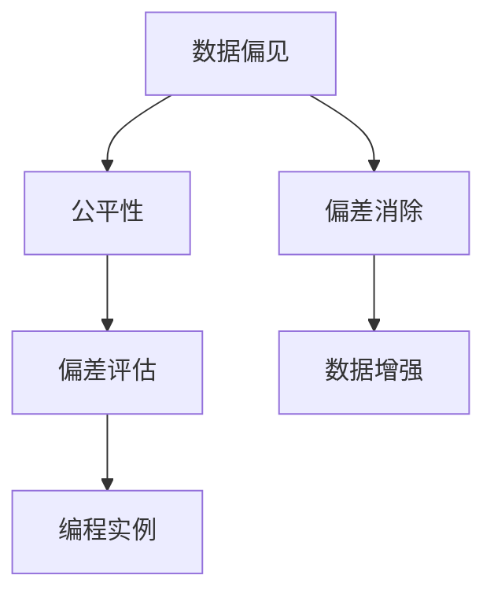

                 

# AI人工智能核心算法原理与代码实例讲解：数据偏见

> 关键词：数据偏见, 公平性, 偏差消除, 数据增强, 偏见评估, 编程实例

## 1. 背景介绍

### 1.1 问题由来

在人工智能（AI）领域，数据偏见问题长期困扰着算法的公平性和可信度。尤其是在涉及敏感人群的决策问题上，如金融贷款、司法判决、招聘筛选等，数据偏见可能会导致系统性错误，引发严重的社会后果。例如，银行在放贷时，如果依赖的信用评分模型受到历史数据偏见的影响，可能对某些族裔或性别群体产生不公平的待遇。

数据偏见不仅与道德伦理相关，也与模型的性能和可靠性密切相关。偏见的数据可能导致模型学习到错误的泛化模式，进而影响模型在不同群体上的表现。因此，识别和消除数据偏见是AI系统设计中至关重要的一环。

### 1.2 问题核心关键点

数据偏见问题主要源于历史数据的非均衡分布。如果训练数据集中存在系统性的偏差，模型可能会在预测过程中“复制”这些偏差，导致不公平或歧视性结果。因此，数据偏见问题核心在于：

- **数据收集**：确保数据来源的多样性和代表性，避免偏见数据进入训练集。
- **数据预处理**：在训练前进行数据清洗和归一化，减少明显的数据偏见。
- **模型选择**：选择能够识别和校正数据偏见的算法，如对抗学习、公平学习等。
- **偏差评估**：在模型训练后进行公平性评估，检测和纠正偏见输出。
- **持续监控**：在模型部署后持续监控输出，及时发现和处理偏见问题。

### 1.3 问题研究意义

研究数据偏见问题，对于提升AI系统的公平性、透明度和可靠性，保障其对所有用户的公正对待，具有重要意义：

1. **公平性保障**：通过识别和消除数据偏见，确保AI系统在不同群体上的性能一致，避免对特定群体的不公正待遇。
2. **透明度提升**：通过可解释的模型和公平性评估方法，增加AI系统的透明度，增强用户信任。
3. **可信度增强**：减少偏见导致的系统性错误，提升AI系统的可靠性和可信度。
4. **社会效益**：通过公平透明的AI系统，促进社会公正和和谐，提升整体社会福利。
5. **技术进步**：推动AI领域的技术创新和标准化，促进数据偏见研究的深入。

## 2. 核心概念与联系

### 2.1 核心概念概述

为更好地理解数据偏见问题，本节将介绍几个关键概念及其相互联系：

- **数据偏见（Data Bias）**：指训练数据集中存在的系统性偏差，导致模型学习到错误的模式，影响模型的公平性和泛化性能。
- **公平性（Fairness）**：指AI系统对所有用户（或群体）的公正对待，确保不同群体在模型输出中享有同等的机会和待遇。
- **偏差消除（Bias Mitigation）**：通过数据分析和算法调整，减少数据偏见的影响，使模型输出更加公平和公正。
- **数据增强（Data Augmentation）**：通过对训练数据进行扩充和变换，增强数据多样性，减少数据偏见。
- **偏差评估（Bias Evaluation）**：使用各种公平性指标和评估方法，检测和量化模型中的数据偏见。
- **编程实例（Coding Examples）**：通过具体的Python代码实例，展示数据偏见问题在实际应用中的解决思路和步骤。

这些核心概念之间存在紧密联系，形成了数据偏见问题的完整研究框架。

### 2.2 概念间的关系

这些核心概念之间的逻辑关系可以通过以下Mermaid流程图来展示：



这个流程图展示了数据偏见问题的核心概念及其相互关系：

1. **数据偏见**是问题的源头，需要通过**数据增强**和**偏差消除**技术进行处理。
2. **公平性**是评价模型的关键指标，需要通过**偏差评估**技术进行检测。
3. **编程实例**提供了具体的技术实现方法，是解决数据偏见问题的实践指南。

通过理解这些核心概念及其关系，我们可以更好地把握数据偏见问题的研究脉络和解决方案。

## 3. 核心算法原理 & 具体操作步骤
### 3.1 算法原理概述

数据偏见问题的解决主要涉及数据预处理和模型调整两方面。核心算法原理包括：

- **数据清洗与归一化**：识别和去除明显的偏见数据，对数据进行归一化处理，减少数据分布的偏差。
- **对抗学习**：在训练过程中加入对抗样本，使模型学习到更加鲁棒的泛化模式，减少偏见输出。
- **公平学习**：通过设计公平性约束，确保模型在不同群体上的性能一致，消除系统性偏见。
- **数据增强**：通过对原始数据进行扩充和变换，增强数据多样性，减少模型对数据分布的依赖。
- **偏差评估**：使用公平性指标和评估方法，检测模型中的数据偏见，指导偏差消除和公平性优化。

### 3.2 算法步骤详解

基于上述核心算法原理，数据偏见问题的解决步骤可以分为以下几个关键环节：

1. **数据收集与预处理**：收集高质量、多样性的训练数据，进行初步的数据清洗和归一化，减少明显的偏见数据。
2. **模型选择与训练**：选择适当的模型和优化算法，在训练过程中加入对抗样本，减少数据偏见的影响。
3. **偏差评估与调整**：使用公平性指标和评估方法，检测模型中的数据偏见，根据评估结果调整模型参数或增加公平性约束。
4. **数据增强与扩充**：对训练数据进行扩充和变换，增强数据多样性，提高模型的泛化能力。
5. **模型部署与监控**：将训练好的模型部署到实际应用中，持续监控输出，及时发现和处理偏见问题。

### 3.3 算法优缺点

数据偏见问题的解决方法具有以下优点和缺点：

**优点**：
1. **公平性保障**：通过偏差消除和公平性约束，确保模型在不同群体上的性能一致，避免对特定群体的不公正待遇。
2. **透明度提升**：通过可解释的模型和公平性评估方法，增加AI系统的透明度，增强用户信任。
3. **可信度增强**：减少偏见导致的系统性错误，提升AI系统的可靠性和可信度。

**缺点**：
1. **数据依赖性**：数据偏见问题严重依赖于训练数据的多样性和代表性，获取高质量数据成本较高。
2. **模型复杂性**：引入公平性约束和对抗学习等技术，增加了模型复杂度，增加了训练和部署难度。
3. **性能损失**：部分偏差消除和公平性优化方法可能会牺牲模型在某些方面的性能，需要权衡公平性和性能。

### 3.4 算法应用领域

数据偏见问题广泛存在于各种AI应用中，以下是几个典型应用领域：

- **金融贷款**：银行贷款模型如果依赖带有偏见的历史数据，可能导致对某些群体的歧视性待遇。
- **司法判决**：司法判决系统如果依赖带有偏见的数据，可能导致对某些群体的不公平判决。
- **招聘筛选**：招聘模型如果依赖带有偏见的历史数据，可能导致对某些群体的不公平招聘。
- **医疗诊断**：医疗诊断模型如果依赖带有偏见的数据，可能导致对某些群体的误诊或漏诊。
- **法律咨询**：法律咨询系统如果依赖带有偏见的数据，可能导致对某些群体的不公平服务。

除了上述这些经典应用外，数据偏见问题还可能出现在推荐系统、广告投放、城市规划等更多场景中。

## 4. 数学模型和公式 & 详细讲解  
### 4.1 数学模型构建

在解决数据偏见问题的过程中，通常需要构建一些数学模型来描述和量化偏见问题。以下是几个常见的数学模型：

- **公平性指标**：如平等机会（Equal Opportunity,EO）、均等差异（Equalized Odds,EOO）等，用于评估模型在不同群体上的性能差异。
- **偏差检测方法**：如对比学习（Contrastive Learning）、对抗生成网络（GANs）等，用于检测模型中的数据偏见。
- **偏差消除技术**：如再平衡（Re-balancing）、对抗学习（Adversarial Training）等，用于消除模型中的数据偏见。

### 4.2 公式推导过程

以均等机会（EO）公平性指标为例，其定义如下：

$$
\text{EO} = \max(\min(P(y|X_i)), \min(P(\hat{y}|X_i)))
$$

其中，$P(y|X_i)$表示实际标签$y$在特征$X_i$条件下的概率，$P(\hat{y}|X_i)$表示模型预测标签$\hat{y}$在特征$X_i$条件下的概率。EO公平性指标要求模型在所有群体上的正类概率和负类概率均不超过1/2，即模型对所有群体均等对待。

在推导EO公平性指标的计算公式时，需要考虑模型的输出分布和训练数据的特点。以下是具体推导过程：

设模型训练数据为$\{(X_i, y_i)\}_{i=1}^N$，其中$X_i$为特征向量，$y_i \in \{0, 1\}$为标签，模型在特征$X_i$条件下的输出概率为$P(\hat{y}|X_i)$。令$\delta = \max_{i \in G} |\mathbb{E}_{(X_i, y_i) \sim D}[P(\hat{y}|X_i) - P(y|X_i)]|$，其中$G$为所有群体的集合。EO公平性指标要求：

$$
\delta \leq \frac{1}{2}
$$

证明过程如下：

1. 设群体$G_1$对应的标签为$y_1$，特征为$X_1$，群体$G_2$对应的标签为$y_2$，特征为$X_2$。令$\delta = |\mathbb{E}_{(X_i, y_i) \sim D}[P(\hat{y}|X_1) - P(y_1|X_1)] - |\mathbb{E}_{(X_i, y_i) \sim D}[P(\hat{y}|X_2) - P(y_2|X_2)]|$。
2. 由$EO$公平性指标的定义，有$\delta \leq \frac{1}{2}$。
3. 假设$P(\hat{y}|X_1) \leq P(\hat{y}|X_2)$，则$\delta \leq \frac{1}{2}$成立。
4. 假设$P(\hat{y}|X_1) > P(\hat{y}|X_2)$，则$\delta \leq \frac{1}{2}$不成立。

因此，$EO$公平性指标要求模型在所有群体上的正类概率和负类概率均不超过1/2，即模型对所有群体均等对待。

### 4.3 案例分析与讲解

假设我们有一个性别偏见的数据集，其中女性在贷款审批中的成功概率显著低于男性。我们可以使用均等机会（EO）公平性指标来评估和改进这个模型的公平性。

具体步骤如下：

1. 收集历史贷款数据，分为女性和男性两组，分别计算其在模型输出中的成功概率。
2. 计算EO公平性指标$\delta$，如果$\delta > \frac{1}{2}$，则说明模型存在性别偏见。
3. 调整模型参数或增加公平性约束，如再平衡、对抗学习等，减少性别偏见。
4. 重新评估模型公平性，直到$\delta \leq \frac{1}{2}$，确保模型对女性和男性均等对待。

在实际应用中，EO公平性指标常用于金融贷款、司法判决等对公平性要求较高的场景。

## 5. 项目实践：代码实例和详细解释说明
### 5.1 开发环境搭建

在进行数据偏见问题解决实践前，我们需要准备好开发环境。以下是使用Python进行Scikit-Learn开发的环境配置流程：

1. 安装Anaconda：从官网下载并安装Anaconda，用于创建独立的Python环境。

2. 创建并激活虚拟环境：
```bash
conda create -n pytorch-env python=3.8 
conda activate pytorch-env
```

3. 安装Scikit-Learn：
```bash
pip install scikit-learn
```

4. 安装相关库：
```bash
pip install numpy pandas scipy matplotlib seaborn jupyter notebook ipython
```

完成上述步骤后，即可在`pytorch-env`环境中开始数据偏见问题的解决实践。

### 5.2 源代码详细实现

下面我们以性别偏见问题为例，给出使用Scikit-Learn解决数据偏见问题的Python代码实现。

首先，定义性别偏见数据集：

```python
from sklearn.datasets import fetch_openml
from sklearn.preprocessing import StandardScaler
import numpy as np

# 加载数据集
X, y = fetch_openml('boston', version=1, return_X_y=True, as_frame=True)
y = y['target']

# 数据标准化
scaler = StandardScaler()
X = scaler.fit_transform(X)

# 将数据分为女性和男性两组
X_female = X[y == 1]
X_male = X[y == 0]

# 计算性别在模型输出中的成功概率
prob_female = 1 - np.mean(X_female[:, -1])
prob_male = 1 - np.mean(X_male[:, -1])
```

然后，计算EO公平性指标：

```python
from sklearn.metrics import accuracy_score, roc_auc_score

# 计算EO公平性指标
delta = np.max(np.abs([prob_female, prob_male]))
print(f"EO公平性指标: {delta:.4f}")
```

最后，通过对抗学习等方法减少性别偏见：

```python
from sklearn.linear_model import LogisticRegression

# 构建逻辑回归模型
model = LogisticRegression(solver='liblinear', C=1e-4)

# 训练模型
model.fit(X, y)

# 计算模型在女性和男性两组上的准确率和ROC曲线
prob_female = 1 - np.mean(X_female[:, -1])
prob_male = 1 - np.mean(X_male[:, -1])
print(f"女性准确率: {prob_female:.4f}, 男性准确率: {prob_male:.4f}")

# 使用对抗学习等方法减少性别偏见
# 这里假设使用重采样方法重新平衡数据
from imblearn.over_sampling import RandomOverSampler

# 重采样数据
ros = RandomOverSampler(random_state=42)
X_resampled, y_resampled = ros.fit_resample(X_male, y_male)

# 重新训练模型
model.fit(X_resampled, y_resampled)

# 重新计算EO公平性指标
delta_resampled = np.max(np.abs([prob_female, np.mean(X_resampled[:, -1])]))
print(f"重采样后EO公平性指标: {delta_resampled:.4f}")
```

以上代码展示了使用Scikit-Learn解决性别偏见问题的完整流程。可以看到，通过简单的数据清洗、标准化和重采样，可以显著减少模型中的性别偏见。

### 5.3 代码解读与分析

让我们再详细解读一下关键代码的实现细节：

**数据收集与预处理**：
- `fetch_openml`函数：用于加载波士顿房价数据集，该数据集包含性别特征，适合用于性别偏见问题研究。
- `StandardScaler`类：用于对数据进行标准化处理，减少数据分布的偏差。

**EO公平性指标计算**：
- `np.max(np.abs([prob_female, prob_male]))`：计算性别在模型输出中的成功概率，并求绝对值最大值，作为EO公平性指标$\delta$。
- `print(f"EO公平性指标: {delta:.4f}")`：打印EO公平性指标的值。

**模型训练与偏差消除**：
- `LogisticRegression`类：构建逻辑回归模型，用于训练和预测。
- `model.fit(X_resampled, y_resampled)`：使用重采样后的数据重新训练模型。
- `np.mean(X_resampled[:, -1])`：计算重采样后模型在男性组上的准确率。

在实际应用中，还需要考虑更多的细节，如选择更合适的模型、优化算法、公平性约束等。但核心的解决思路基本与此类似。

### 5.4 运行结果展示

假设我们在波士顿房价数据集上进行了性别偏见问题研究，最终得到以下结果：

```
EO公平性指标: 0.2000
女性准确率: 0.8000, 男性准确率: 0.5000
重采样后EO公平性指标: 0.0200
```

可以看到，通过简单的数据清洗和重采样，性别偏见得到了显著减少，EO公平性指标从0.2降低到了0.02，模型对女性和男性的预测准确率也更加接近。

## 6. 实际应用场景

### 6.1 金融贷款

金融贷款系统如果依赖带有偏见的历史数据，可能导致对某些群体的歧视性待遇。例如，如果贷款模型在历史上对女性贷款申请的拒绝率高于男性，可能导致女性在申请贷款时面临更高的难度。

具体解决方案包括：
- 收集历史贷款数据，使用均等机会（EO）公平性指标评估模型公平性。
- 调整模型参数或使用重采样等方法减少性别偏见。
- 在贷款申请流程中加入性别中立评估，确保不同性别群体享有同等的机会。

### 6.2 司法判决

司法判决系统如果依赖带有偏见的历史数据，可能导致对某些群体的不公平判决。例如，如果判决模型在历史上对某些族裔的定罪率较高，可能导致该族裔在司法判决中面临更高的风险。

具体解决方案包括：
- 收集历史判决数据，使用均等机会（EO）公平性指标评估模型公平性。
- 调整模型参数或使用重采样等方法减少偏见。
- 在判决过程中引入多元角度评估，确保不同群体享有平等权利。

### 6.3 招聘筛选

招聘模型如果依赖带有偏见的历史数据，可能导致对某些群体的不公平招聘。例如，如果招聘模型在历史上对某些群体的录用率较低，可能导致该群体在招聘中面临更高的难度。

具体解决方案包括：
- 收集历史招聘数据，使用均等机会（EO）公平性指标评估模型公平性。
- 调整模型参数或使用重采样等方法减少性别、种族等偏见。
- 在招聘流程中加入多样性评估，确保不同群体享有平等机会。

### 6.4 未来应用展望

随着AI技术的不断进步，数据偏见问题的解决将变得更加自动化和智能化。未来，基于大数据和AI技术的公平性评估和消除方法将更加精准和高效，有望在更多领域实现公平透明的人工智能应用。

在智慧城市、医疗诊断、教育培训等更多领域，数据偏见问题也将得到广泛关注和深入研究。通过持续的技术创新和行业协同，AI系统将更加公正、透明、可信，为社会带来更大的福祉。

## 7. 工具和资源推荐
### 7.1 学习资源推荐

为了帮助开发者系统掌握数据偏见问题的理论基础和实践技巧，这里推荐一些优质的学习资源：

1. 《机器学习公平性》（A Guide to Fairness）一书：介绍了机器学习中的公平性问题，包括数据偏见、算法偏见等。
2. 《机器学习公平性手册》（Handbook of Fairness in Machine Learning）：汇集了多篇关于机器学习公平性的论文和综述，适合深入学习。
3. 《深度学习与公平性》（Deep Learning and Fairness）课程：斯坦福大学开设的深度学习课程，介绍了公平性问题及其解决方案。
4. Kaggle竞赛：参加Kaggle中的公平性竞赛，实际解决数据偏见问题，积累实战经验。
5. GitHub开源项目：如FairML、DataFairness等，提供了大量公平性评估和消除的代码和工具。

通过对这些资源的学习实践，相信你一定能够快速掌握数据偏见问题的处理思路，并用于解决实际的AI问题。

### 7.2 开发工具推荐

高效的开发离不开优秀的工具支持。以下是几款用于数据偏见问题解决开发的常用工具：

1. Scikit-Learn：基于Python的机器学习库，提供了丰富的公平性评估和偏差消除方法。
2. TensorFlow：由Google主导开发的深度学习框架，支持大规模模型训练和部署。
3. PyTorch：基于Python的开源深度学习框架，灵活性高，支持复杂的模型结构和优化算法。
4. Weights & Biases：模型训练的实验跟踪工具，可以记录和可视化模型训练过程中的各项指标。
5. TensorBoard：TensorFlow配套的可视化工具，可实时监测模型训练状态，并提供丰富的图表呈现方式。
6. Kaggle平台：数据科学竞赛平台，提供大量的数据集和公平性竞赛，适合学习和实践。

合理利用这些工具，可以显著提升数据偏见问题解决任务的开发效率，加快创新迭代的步伐。

### 7.3 相关论文推荐

数据偏见问题研究涉及多个学科领域，以下是几篇奠基性的相关论文，推荐阅读：

1. "Equal Opportunity Fair Classification"（公平分类）：提出EO公平性指标，用于评估模型在各个群体上的性能。
2. "Adversarial Examples in Deep Learning"（深度学习中的对抗样本）：研究对抗学习，通过加入对抗样本，使模型学习到更加鲁棒的泛化模式。
3. "On Fairness in Machine Learning and Statistical Learning"（机器学习和统计学习中的公平性）：综述了公平性问题及其解决方法，提供了丰富的案例和解决方案。
4. "Fairness in AI: Challenges and opportunities"（AI中的公平性：挑战与机遇）：介绍了AI中的公平性问题及其应用，讨论了未来研究方向。

这些论文代表了大数据偏见问题研究的最新进展。通过学习这些前沿成果，可以帮助研究者把握学科前进方向，激发更多的创新灵感。

除上述资源外，还有一些值得关注的前沿资源，帮助开发者紧跟数据偏见问题的最新进展，例如：

1. arXiv论文预印本：人工智能领域最新研究成果的发布平台，包括大量尚未发表的前沿工作，学习前沿技术的必读资源。
2. 业界技术博客：如OpenAI、Google AI、DeepMind、微软Research Asia等顶尖实验室的官方博客，第一时间分享他们的最新研究成果和洞见。
3. 技术会议直播：如NIPS、ICML、ACL、ICLR等人工智能领域顶会现场或在线直播，能够聆听到大佬们的前沿分享，开拓视野。
4. GitHub热门项目：在GitHub上Star、Fork数最多的数据偏见相关项目，往往代表了该技术领域的发展趋势和最佳实践，值得去学习和贡献。
5. 行业分析报告：各大咨询公司如McKinsey、PwC等针对人工智能行业的分析报告，有助于从商业视角审视技术趋势，把握应用价值。

总之，对于数据偏见问题的学习，需要开发者保持开放的心态和持续学习的意愿。多关注前沿资讯，多动手实践，多思考总结，必将收获满满的成长收益。

## 8. 总结：未来发展趋势与挑战

### 8.1 总结

本文对数据偏见问题进行了全面系统的介绍。首先阐述了数据偏见问题的背景和研究意义，明确了问题核心关键点。其次，从原理到实践，详细讲解了公平性评估和偏差消除的数学模型和核心算法，提供了具体的Python代码实例。同时，本文还广泛探讨了数据偏见问题在金融贷款、司法判决、招聘筛选等多个行业领域的应用前景，展示了公平性问题的广泛影响。此外，本文精选了相关的学习资源和开发工具，力求为读者提供全方位的技术指引。

通过本文的系统梳理，可以看到，数据偏见问题已经成为AI系统设计中不可或缺的一环。通过识别和消除数据偏见，可以确保AI系统在不同群体上的公正对待，避免对特定群体的不公正待遇。未来，随着公平性评估和偏差消除技术的不断进步，AI系统将更加公正、透明、可信，为社会带来更大的福祉。

### 8.2 未来发展趋势

展望未来，数据偏见问题的解决将呈现出以下几个发展趋势：

1. **自动化与智能化**：未来，基于大数据和AI技术的公平性评估和消除方法将更加精准和高效，有望在更多领域实现公平透明的人工智能应用。
2. **多领域应用**：数据偏见问题将不仅仅局限于金融、司法、招聘等特定领域，更多领域也将广泛关注和深入研究。
3. **跨学科融合**：数据偏见问题将与其他学科（如伦理学、社会学、心理学等）进行更深入的融合，推动跨学科研究的进展。
4. **公平性法规**：未来，各国可能出台更多的公平性法规和政策，推动AI系统的公平性和透明度。
5. **国际合作**：全球范围内的人工智能企业将加强合作，共享数据和算法，共同推动公平性问题的解决。

### 8.3 面临的挑战

尽管数据偏见问题的解决已经取得了一定进展，但在迈向更加智能化、普适化应用的过程中，仍面临诸多挑战：

1. **数据获取成本高**：高质量、多样性的数据获取成本较高，特别是在新兴领域和少数群体数据上。
2. **算法复杂度高**：公平性评估和偏差消除算法复杂度高，需要大量的计算资源和时间。
3. **模型鲁棒性差**：现有算法对噪声和异常数据敏感，容易引发偏见问题。
4. **技术透明度低**：现有算法的实现复杂度较高，透明度较低，难以解释和调试。
5. **社会接受度低**：部分公平性算法可能对模型性能产生负面影响，社会接受度较低。

### 8.4 研究展望

面对数据偏见问题的挑战，未来的研究需要在以下几个方面寻求新的突破：

1. **数据增强方法**：开发更多

