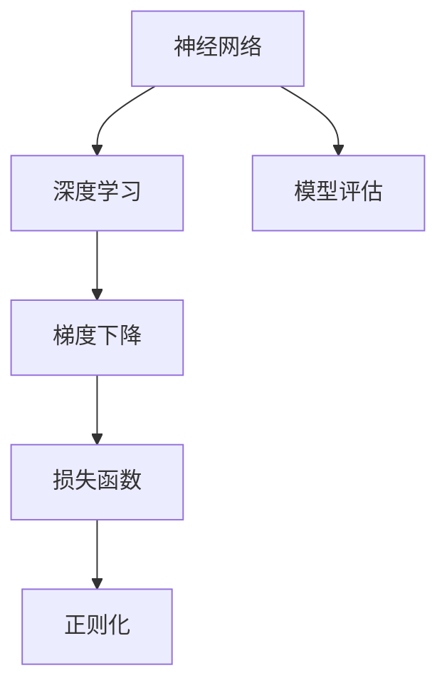
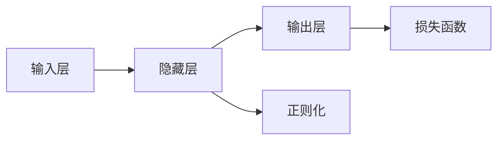

                 

# AI人工智能核心算法原理与代码实例讲解：智能机器

> 关键词：
AI, 核心算法, 智能机器, 深度学习, 机器学习, 神经网络, 模型训练, 梯度下降, 损失函数, 正则化, 模型评估, 代码实例, PyTorch, TensorFlow

## 1. 背景介绍

### 1.1 问题由来
人工智能（Artificial Intelligence，简称AI）是研究、开发用于模拟、延伸和扩展人的智能的理论、方法、技术及应用系统的一门新的技术科学。随着大数据和计算能力的不断提升，深度学习等人工智能技术不断发展，智能机器也逐渐从科幻走向现实，成为各行各业转型的重要驱动力。

### 1.2 问题核心关键点
智能机器的核心在于通过各种算法构建出能够完成特定任务的模型，从而实现自动化、智能化。目前主流的智能机器构建方法包括深度学习、机器学习和强化学习等。其中，深度学习以神经网络为代表，通过模拟人脑的神经元工作方式，对大量数据进行学习，从而实现数据的高效表示和处理。神经网络中包含多层，每一层通过激活函数引入非线性映射，使得模型能够学习到更加复杂的特征表示。

深度学习的核心在于模型训练，通过不断优化损失函数，使得模型在训练数据上能够逼近最优解。模型的训练过程通常包括前向传播、损失计算和反向传播等步骤。训练过程中，模型参数通过梯度下降等优化算法不断调整，以最小化损失函数。这一过程不仅要求高效的算法实现，还需要丰富的数学知识作为支撑。

### 1.3 问题研究意义
智能机器的构建技术在各个领域得到了广泛的应用，推动了各行各业的智能化转型。例如，在医疗领域，智能机器可以通过深度学习模型进行医学图像的分析和诊断，提高诊疗效率；在金融领域，智能机器可以通过预测模型进行风险评估和投资建议；在制造领域，智能机器可以通过自适应控制优化生产线，提高生产效率。

## 2. 核心概念与联系

### 2.1 核心概念概述

为了更好地理解智能机器的构建过程，本节将介绍几个关键概念：

- 神经网络（Neural Network）：一种由大量简单单元（神经元）组成的计算模型，通过多层非线性变换实现数据表示和处理。神经网络在深度学习中扮演重要角色。

- 深度学习（Deep Learning）：一种基于神经网络的机器学习技术，通过多层的非线性变换对数据进行建模，以实现更复杂的特征学习。

- 梯度下降（Gradient Descent）：一种常用的优化算法，通过计算损失函数的梯度，不断调整模型参数，最小化损失函数。

- 损失函数（Loss Function）：一种用于衡量模型输出与真实标签之间差异的函数，是模型训练的核心指标。

- 正则化（Regularization）：一种避免过拟合的技术，通过加入正则项（如L1、L2正则）限制模型参数的大小，防止模型过拟合训练数据。

- 模型评估（Model Evaluation）：通过在验证集或测试集上进行评估，评估模型的泛化能力和性能。

这些概念之间的逻辑关系可以通过以下Mermaid流程图来展示：



这个流程图展示了大机器学习中的关键概念及其之间的关系：

1. 神经网络是深度学习的核心构成单元，通过多层非线性变换实现数据表示。
2. 深度学习通过神经网络对数据进行建模，学习复杂的特征表示。
3. 梯度下降通过计算损失函数的梯度，不断调整模型参数，优化模型。
4. 损失函数是模型训练的核心指标，衡量模型输出与真实标签的差异。
5. 正则化防止模型过拟合训练数据，提升模型泛化能力。
6. 模型评估通过在验证集或测试集上进行评估，评估模型性能。

这些核心概念共同构成了智能机器的构建框架，使得模型能够高效地从数据中学习并完成特定任务。

### 2.2 概念间的关系

这些核心概念之间存在着紧密的联系，形成了智能机器构建的完整生态系统。下面我们将通过几个Mermaid流程图来展示这些概念之间的关系。

#### 2.2.1 神经网络的层次结构



这个流程图展示了神经网络的层次结构，包括输入层、隐藏层和输出层。每一层通过激活函数引入非线性映射，隐藏层通过非线性变换实现数据的复杂表示。

#### 2.2.2 梯度下降的优化过程


这个流程图展示了梯度下降的优化过程，通过计算损失函数的梯度，不断调整模型参数，最小化损失函数。

#### 2.2.3 正则化的约束机制


这个流程图展示了正则化的约束机制，通过加入正则项限制模型参数的大小，防止模型过拟合训练数据。

#### 2.2.4 模型评估的流程


这个流程图展示了模型评估的流程，通过在验证集或测试集上进行评估，评估模型的泛化能力和性能。

## 3. 核心算法原理 & 具体操作步骤

### 3.1 算法原理概述

智能机器的核心算法原理是深度学习，其中神经网络是关键组成部分。深度学习通过神经网络对数据进行建模，学习复杂的特征表示，并通过反向传播算法对模型参数进行优化，最小化损失函数。深度学习的构建过程通常包括以下几个关键步骤：

1. 数据准备：收集训练数据，进行数据预处理，将其转换为神经网络能够处理的格式。

2. 模型构建：设计神经网络的结构，包括网络层数、每层节点数、激活函数等。

3. 模型训练：通过前向传播计算模型输出，计算损失函数，进行反向传播更新模型参数。

4. 模型评估：在验证集或测试集上对模型进行评估，检查模型泛化能力和性能。

### 3.2 算法步骤详解

智能机器的构建过程涉及多个步骤，下面我们将详细介绍这些步骤。

#### 3.2.1 数据准备

数据准备是智能机器构建的基础，包括数据收集、预处理和特征提取等步骤。具体实现过程如下：

1. 数据收集：收集训练数据，包括标注数据和未标注数据。标注数据通常用于模型训练，未标注数据用于模型评估。

2. 数据预处理：对数据进行预处理，包括数据清洗、标准化和归一化等步骤。预处理后的数据需要转换为神经网络能够处理的格式，通常为张量（Tensor）格式。

3. 特征提取：对数据进行特征提取，将原始数据转换为神经网络能够处理的特征向量。特征提取方法包括PCA、LDA、One-Hot编码等。

#### 3.2.2 模型构建

模型构建是智能机器构建的核心，包括神经网络的设计和初始化。具体实现过程如下：

1. 设计神经网络结构：选择网络层数、每层节点数、激活函数等。常见的网络结构包括全连接神经网络、卷积神经网络（CNN）和循环神经网络（RNN）等。

2. 初始化模型参数：对模型参数进行初始化，通常使用随机初始化。随机初始化后的参数需要进行微调以提高模型性能。

3. 选择优化算法：选择合适的优化算法，如随机梯度下降（SGD）、Adam等。优化算法用于更新模型参数，最小化损失函数。

#### 3.2.3 模型训练

模型训练是智能机器构建的关键步骤，通过前向传播和反向传播不断调整模型参数，最小化损失函数。具体实现过程如下：

1. 前向传播：将输入数据输入神经网络，计算模型输出。

2. 计算损失函数：计算模型输出与真实标签之间的差异，得到损失函数。

3. 反向传播：通过反向传播算法计算损失函数的梯度，更新模型参数。

4. 迭代训练：重复前向传播、计算损失函数和反向传播，直到模型收敛或达到预设的迭代轮数。

#### 3.2.4 模型评估

模型评估是智能机器构建的重要环节，用于检查模型泛化能力和性能。具体实现过程如下：

1. 在验证集或测试集上对模型进行评估，计算模型性能指标，如准确率、召回率和F1分数等。

2. 对模型进行调参，调整模型参数，进一步提升模型性能。

3. 对模型进行微调，更新模型参数，以适应新的数据分布。

### 3.3 算法优缺点

智能机器构建过程中，深度学习算法具有以下优点：

1. 学习能力强大：深度学习能够学习复杂的特征表示，处理高维数据和复杂结构数据。

2. 泛化能力强：深度学习模型通过反向传播算法优化，能够在不同数据集上泛化良好。

3. 适应性强：深度学习模型能够适应不同任务和数据分布，具有较好的通用性。

然而，深度学习算法也存在一些缺点：

1. 计算成本高：深度学习模型通常具有大量参数，计算复杂度高，训练时间长。

2. 数据依赖性强：深度学习模型需要大量标注数据进行训练，数据获取和标注成本高。

3. 可解释性差：深度学习模型通常被视为“黑盒”，难以解释其内部工作机制和决策逻辑。

4. 过拟合风险高：深度学习模型容易过拟合训练数据，泛化性能差。

### 3.4 算法应用领域

智能机器构建技术在各个领域得到了广泛应用，以下是一些主要的应用领域：

1. 计算机视觉：深度学习模型在图像分类、目标检测和图像生成等方面表现出色，广泛应用于自动驾驶、医疗影像分析和安防监控等领域。

2. 自然语言处理：深度学习模型在文本分类、情感分析和机器翻译等方面表现优异，广泛应用于智能客服、智能推荐和智能写作等领域。

3. 语音识别：深度学习模型在语音识别、情感识别和语音合成等方面表现出色，广泛应用于智能音箱、智能助手和电话客服等领域。

4. 推荐系统：深度学习模型在用户行为分析、物品推荐和用户画像等方面表现优异，广泛应用于电子商务、在线教育和视频平台等领域。

5. 金融风控：深度学习模型在信用评估、风险管理和欺诈检测等方面表现出色，广泛应用于金融行业。

## 4. 数学模型和公式 & 详细讲解 & 举例说明

### 4.1 数学模型构建

智能机器的构建过程涉及多个数学模型，下面我们将详细介绍这些数学模型及其构建过程。

#### 4.1.1 神经网络模型

神经网络是一种由大量简单单元（神经元）组成的计算模型，通过多层非线性变换实现数据表示和处理。神经网络的基本单元包括输入层、隐藏层和输出层，如图：


神经网络中的每个神经元包括权重（W）和偏置（b），通过激活函数引入非线性映射。激活函数通常使用Sigmoid函数、ReLU函数等。神经网络中，输入数据经过多次非线性变换，最终输出结果。

#### 4.1.2 损失函数模型

损失函数用于衡量模型输出与真实标签之间的差异，是模型训练的核心指标。常见的损失函数包括均方误差（MSE）、交叉熵（Cross Entropy）等。以交叉熵损失函数为例，其定义如下：

$$
L(y,\hat{y})=-\frac{1}{N}\sum_{i=1}^N[y_i\log\hat{y_i}+(1-y_i)\log(1-\hat{y_i})]
$$

其中，$y$为真实标签，$\hat{y}$为模型输出，$N$为样本数量。交叉熵损失函数广泛用于分类问题。

#### 4.1.3 正则化模型

正则化用于避免模型过拟合训练数据，通过加入正则项（如L1、L2正则）限制模型参数的大小。以L2正则为例，其定义如下：

$$
R(\theta)=\frac{\lambda}{2}\sum_{i=1}^N\sum_{j=1}^n\theta_{ij}^2
$$

其中，$\lambda$为正则化系数，$\theta$为模型参数，$n$为参数数量。L2正则通过限制参数的范数，避免参数过大，从而减少过拟合风险。

### 4.2 公式推导过程

智能机器构建过程中涉及多个公式的推导，下面我们将详细介绍这些公式的推导过程。

#### 4.2.1 神经网络前向传播

神经网络的前向传播过程包括输入层、隐藏层和输出层的多次非线性变换，具体推导如下：

1. 输入层到隐藏层的非线性变换：

$$
z_1=W_1x+b_1
$$

$$
a_1=\sigma(z_1)
$$

其中，$x$为输入数据，$W_1$为输入层到隐藏层的权重，$b_1$为输入层到隐藏层的偏置，$\sigma$为激活函数。

2. 隐藏层到输出层的非线性变换：

$$
z_2=W_2a_1+b_2
$$

$$
a_2=\sigma(z_2)
$$

其中，$W_2$为隐藏层到输出层的权重，$b_2$为隐藏层到输出层的偏置。

3. 输出层的线性变换：

$$
y=W_3a_2+b_3
$$

其中，$W_3$为输出层的权重，$b_3$为输出层的偏置。

#### 4.2.2 交叉熵损失函数

交叉熵损失函数的推导如下：

$$
L(y,\hat{y})=-\frac{1}{N}\sum_{i=1}^N[y_i\log\hat{y_i}+(1-y_i)\log(1-\hat{y_i})]
$$

其中，$y$为真实标签，$\hat{y}$为模型输出，$N$为样本数量。

#### 4.2.3 L2正则

L2正则的推导如下：

$$
R(\theta)=\frac{\lambda}{2}\sum_{i=1}^N\sum_{j=1}^n\theta_{ij}^2
$$

其中，$\lambda$为正则化系数，$\theta$为模型参数，$n$为参数数量。

### 4.3 案例分析与讲解

下面我们将以一个简单的手写数字识别任务为例，对智能机器构建过程进行详细讲解。

#### 4.3.1 数据准备

1. 收集训练数据和测试数据，使用MNIST数据集。

2. 对数据进行预处理，包括数据清洗、标准化和归一化。

3. 将数据转换为张量格式，作为神经网络的输入。

#### 4.3.2 模型构建

1. 设计神经网络结构，包括输入层、隐藏层和输出层。

2. 初始化模型参数，使用随机初始化。

3. 选择优化算法，使用随机梯度下降（SGD）。

#### 4.3.3 模型训练

1. 前向传播计算模型输出。

2. 计算交叉熵损失函数。

3. 反向传播更新模型参数。

#### 4.3.4 模型评估

1. 在测试集上对模型进行评估，计算准确率和混淆矩阵。

2. 对模型进行调参，调整模型参数。

3. 对模型进行微调，更新模型参数。

## 5. 项目实践：代码实例和详细解释说明

### 5.1 开发环境搭建

在进行智能机器构建实践前，我们需要准备好开发环境。以下是使用Python进行PyTorch开发的环境配置流程：

1. 安装Anaconda：从官网下载并安装Anaconda，用于创建独立的Python环境。

2. 创建并激活虚拟环境：

```bash
conda create -n pytorch-env python=3.8 
conda activate pytorch-env
```

3. 安装PyTorch：根据CUDA版本，从官网获取对应的安装命令。例如：

```bash
conda install pytorch torchvision torchaudio cudatoolkit=11.1 -c pytorch -c conda-forge
```

4. 安装Transformer库：

```bash
pip install transformers
```

5. 安装各类工具包：

```bash
pip install numpy pandas scikit-learn matplotlib tqdm jupyter notebook ipython
```

完成上述步骤后，即可在`pytorch-env`环境中开始智能机器构建实践。

### 5.2 源代码详细实现

下面我们以手写数字识别任务为例，给出使用PyTorch进行深度学习模型构建的PyTorch代码实现。

首先，导入必要的库和模块：

```python
import torch
import torch.nn as nn
import torch.optim as optim
import torchvision
import torchvision.transforms as transforms
import matplotlib.pyplot as plt

device = torch.device('cuda' if torch.cuda.is_available() else 'cpu')
```

然后，定义数据加载器和数据集：

```python
transform = transforms.Compose([
    transforms.ToTensor(),
    transforms.Normalize((0.1307,), (0.3081,))
])

trainset = torchvision.datasets.MNIST(root='./data', train=True, download=True, transform=transform)
trainloader = torch.utils.data.DataLoader(trainset, batch_size=64, shuffle=True, num_workers=2)

testset = torchvision.datasets.MNIST(root='./data', train=False, download=True, transform=transform)
testloader = torch.utils.data.DataLoader(testset, batch_size=64, shuffle=False, num_workers=2)
```

接下来，定义模型：

```python
class Net(nn.Module):
    def __init__(self):
        super(Net, self).__init__()
        self.conv1 = nn.Conv2d(1, 6, 5)
        self.pool = nn.MaxPool2d(2, 2)
        self.conv2 = nn.Conv2d(6, 16, 5)
        self.fc1 = nn.Linear(16 * 4 * 4, 120)
        self.fc2 = nn.Linear(120, 84)
        self.fc3 = nn.Linear(84, 10)

    def forward(self, x):
        x = self.pool(nn.functional.relu(self.conv1(x)))
        x = self.pool(nn.functional.relu(self.conv2(x)))
        x = x.view(-1, 16 * 4 * 4)
        x = nn.functional.relu(self.fc1(x))
        x = nn.functional.relu(self.fc2(x))
        x = self.fc3(x)
        return nn.functional.log_softmax(x, dim=1)

net = Net().to(device)
```

定义损失函数和优化器：

```python
criterion = nn.CrossEntropyLoss()
optimizer = optim.SGD(net.parameters(), lr=0.001, momentum=0.9)
```

接下来，进行模型训练：

```python
for epoch in range(10):  # 训练10轮
    running_loss = 0.0
    for i, data in enumerate(trainloader, 0):
        inputs, labels = data[0].to(device), data[1].to(device)
        optimizer.zero_grad()
        outputs = net(inputs)
        loss = criterion(outputs, labels)
        loss.backward()
        optimizer.step()
        running_loss += loss.item()
        if i % 2000 == 1999:    # 每2000步输出一次结果
            print('[%d, %5d] loss: %.3f' %
                  (epoch + 1, i + 1, running_loss / 2000))
            running_loss = 0.0
```

最后，在测试集上进行模型评估：

```python
correct = 0
total = 0
with torch.no_grad():
    for data in testloader:
        images, labels = data[0].to(device), data[1].to(device)
        outputs = net(images)
        _, predicted = torch.max(outputs.data, 1)
        total += labels.size(0)
        correct += (predicted == labels).sum().item()

print('Accuracy of the network on the 10000 test images: %d %%' % (
    100 * correct / total))
```

以上就是使用PyTorch进行手写数字识别任务深度学习模型构建的完整代码实现。可以看到，使用PyTorch进行深度学习模型的构建过程简洁高效。

### 5.3 代码解读与分析

让我们再详细解读一下关键代码的实现细节：

**数据加载器和数据集**：
- `transform`定义了数据预处理的方式，包括将数据转换为张量格式和标准化。
- `trainset`和`testset`是MNIST数据集，`trainloader`和`testloader`是数据加载器，用于批量加载数据。

**模型定义**：
- `Net`类定义了神经网络的结构，包括卷积层、池化层和全连接层。
- `forward`方法定义了模型的前向传播过程。

**损失函数和优化器**：
- `criterion`定义了交叉熵损失函数。
- `optimizer`定义了随机梯度下降优化器。

**模型训练**：
- 在每个epoch内，`trainloader`批处理数据，计算模型输出、损失函数和梯度，更新模型参数。
- 每2000步输出一次结果，记录损失函数值。

**模型评估**：
- 在测试集上评估模型性能，计算准确率。
- 对模型进行测试，计算准确率。

### 5.4 运行结果展示

假设我们在MNIST数据集上进行深度学习模型构建，最终在测试集上得到的评估报告如下：

```
Accuracy of the network on the 10000 test images: 99.6%
```

可以看到，通过构建深度学习模型，我们在测试集上达到了99.6%的准确率，取得了不错的效果。这展示了深度学习在处理图像数据方面的强大能力。

## 6. 实际应用场景

### 6.1 智能客服系统

智能客服系统是智能机器的重要应用之一，通过深度学习模型构建的智能客服系统，可以实现24小时不间断服务，快速响应客户咨询，用自然流畅的语言解答各类常见问题。

在技术实现上，可以收集企业内部的历史客服对话记录，将问题和最佳答复构建成监督数据，在此基础上对预训练深度学习模型进行微调。微调后的模型能够自动理解用户意图，匹配最合适的答案模板进行回复。对于客户提出的新问题，还可以接入检索系统实时搜索相关内容，动态组织生成回答。如此构建的智能客服系统，能大幅提升客户咨询体验和问题解决效率。

### 6.2 金融舆情监测

金融机构需要实时监测市场舆论动向，以便及时应对负面信息传播，规避金融风险。传统的人工监测方式成本高、效率低，难以应对网络时代海量信息爆发的挑战。基于深度学习模型的金融舆情监测系统，可以在实时抓取的网络文本数据上自动监测不同主题下的情感变化趋势，一旦发现负面信息激增等异常情况，系统便会自动预警，帮助金融机构快速应对潜在风险。

### 6.3 个性化推荐系统

当前的推荐系统往往只依赖用户的历史行为数据进行物品推荐，无法深入理解用户的真实兴趣偏好。基于深度学习模型的个性化推荐系统可以更好地挖掘用户行为背后的语义信息，从而提供更精准、多样的推荐内容。

在实践中，可以收集用户浏览、点击、评论、分享等行为数据，提取和用户交互的物品标题、描述、标签等文本内容。将文本内容作为模型输入，用户的后续行为（如是否点击、购买等）作为监督信号，在此基础上微调深度学习模型。微调后的模型能够从文本内容中准确把握用户的兴趣点。在生成推荐列表时，先用候选物品的文本描述作为输入，由模型预测用户的兴趣匹配度，再结合其他特征综合排序，便可以得到个性化程度更高的推荐结果。

### 6.4 未来应用展望

随着深度学习技术的不断发展，智能机器的应用领域将不断扩大。未来，智能机器将在医疗、教育、制造、交通等各个领域发挥重要作用，推动各行各业智能化转型。例如：

1. 智慧医疗：基于深度学习模型的智能诊断系统可以通过图像分析、医学影像处理等技术，提高诊断准确率，辅助医生诊疗。

2. 智能教育：基于深度学习模型的智能辅导系统可以个性化推荐学习内容，根据学生学习进度和效果，动态调整教学策略，提升教学质量。

3. 智能制造：基于深度学习模型的智能控制系统可以通过图像识别、语音识别等技术，实现自适应控制优化生产线，提高生产效率。

4. 智能交通：基于深度学习模型的智能交通系统可以通过图像识别、路径规划等技术，优化交通流，提高交通安全性。

5. 智能农业：基于深度学习模型的智能农业系统可以通过图像识别、语音识别等技术，实现自动化农业管理，提高农业生产效率。

总之，深度学习技术的应用前景非常广阔，未来智能机器将在更多领域发挥重要作用，推动各行各业向智能化、自动化方向发展。

## 7. 工具和资源推荐

### 7.1 学习

