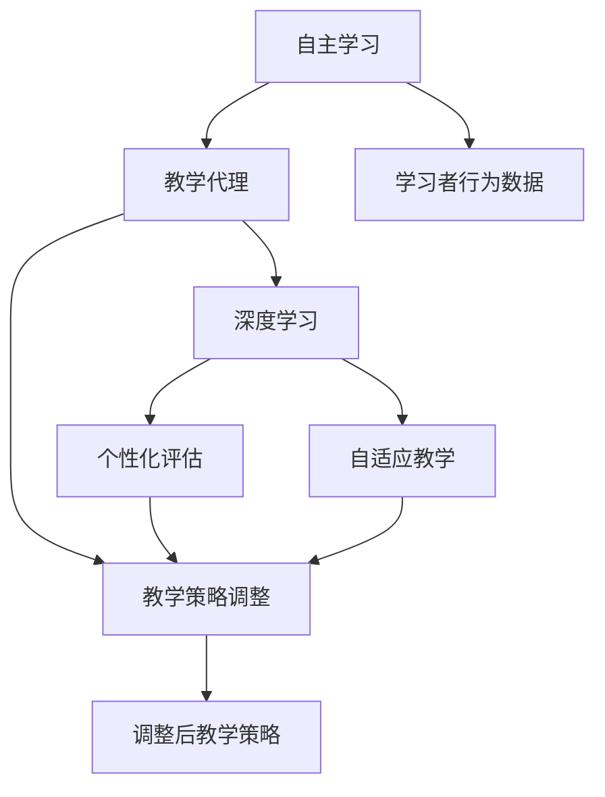
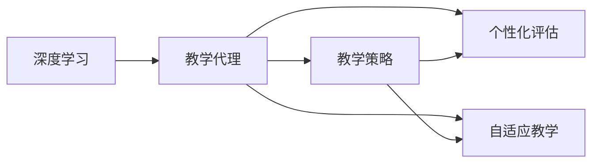
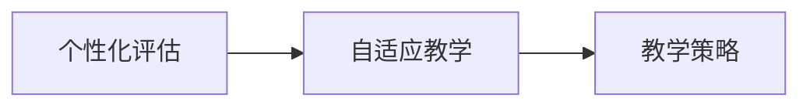
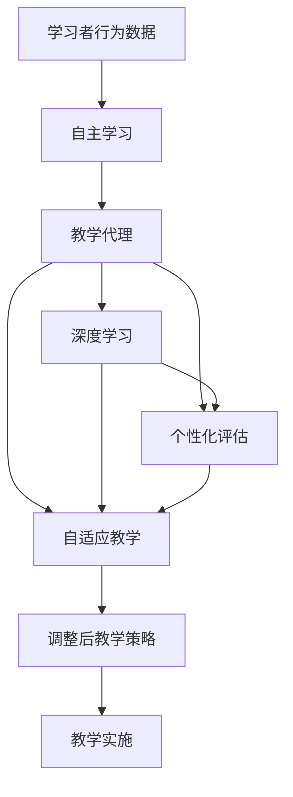

                 

# AI人工智能深度学习算法：在教育培训中运用自主学习 代理

> 关键词：深度学习,自主学习,教育培训,教学代理,算法实现,教育技术,智能评估

## 1. 背景介绍

### 1.1 问题由来

在人工智能和教育技术的融合领域，基于深度学习的教育培训系统逐渐成为研究热点。其核心在于利用人工智能算法对学习者的行为数据进行分析，提供个性化的学习建议和评估，以提高教学效果和教育质量。然而，现有的基于深度学习的教育系统主要依赖于监督学习和在线教学数据的积累，对学习者的自主学习行为缺乏深入的理解和引导。如何构建更加智能、自适应、互动的教育培训系统，成为了当前教育技术研究的关键课题。

### 1.2 问题核心关键点

为了解决这一问题，本文聚焦于基于自主学习的教学代理算法在教育培训中的应用。该算法通过分析学习者的学习数据和行为，自动调整学习计划和教学策略，为学习者提供个性化的学习指导和评估，从而提升学习效果和教育质量。具体核心关键点如下：

- 自主学习：学习者在学习过程中主动规划和控制学习行为，教师只需通过教学代理算法，将学习过程数据转化为学习指导。
- 教学代理：教学代理算法通过数据分析和机器学习，实时调整学习计划和教学策略，引导学习者高效学习。
- 个性化评估：结合自主学习和教学代理，能够对学习者的学习效果进行个性化评估，发现学习过程中的问题并及时调整。
- 自适应教学：根据学习者的学习情况，教学代理能够动态调整教学内容，适应不同学习者的需求。

### 1.3 问题研究意义

研究基于自主学习的教学代理算法，对于推动教育技术创新、提升教学质量具有重要意义：

1. 个性化学习：自主学习算法能够根据学习者的行为数据，自动调整学习计划，提供个性化学习建议，满足不同学习者的需求。
2. 智能评估：通过教学代理算法，能够对学习者的学习效果进行实时评估，发现问题并及时调整，提高教学效果。
3. 高效互动：教学代理算法能够实现教师与学习者之间的智能互动，提升教学互动性和学习参与度。
4. 自适应教学：自适应教学代理算法能够根据学习者的反馈，动态调整教学内容，提高教学的针对性和适应性。
5. 教育公平：自主学习算法能够为不同学习能力和背景的学习者提供平等的学习机会，推动教育公平。

## 2. 核心概念与联系

### 2.1 核心概念概述

为了更好地理解自主学习的教学代理算法，本节将介绍几个密切相关的核心概念：

- 自主学习（Autonomous Learning）：指学习者在学习过程中，通过自我规划、自我监控和自我评价，主动控制学习行为的过程。
- 教学代理（Teaching Agent）：指在教育系统中，通过算法和软件实现的教学自动化代理，能够根据学习者的行为数据，自动调整教学策略和计划。
- 深度学习（Deep Learning）：指通过多层神经网络模型，对复杂数据进行深度抽象和分析，实现自主学习与教学代理算法的基础。
- 个性化评估（Personalized Assessment）：指对学习者的学习效果进行个性化评估，发现问题并及时调整，提升教学效果。
- 自适应教学（Adaptive Teaching）：指根据学习者的学习情况，动态调整教学内容和策略，提高教学的针对性和适应性。

这些核心概念之间的逻辑关系可以通过以下Mermaid流程图来展示：



这个流程图展示了大语言模型的核心概念及其之间的关系：

1. 自主学习通过学习者的行为数据，触发教学代理算法。
2. 教学代理算法在深度学习的帮助下，实现教学策略的动态调整。
3. 个性化评估和自适应教学通过教学代理算法，对学习者的学习效果进行实时评估和调整。
4. 调整后的教学策略，再次应用于学习者的学习过程。

### 2.2 概念间的关系

这些核心概念之间存在着紧密的联系，形成了基于自主学习的教学代理算法的完整生态系统。下面我通过几个Mermaid流程图来展示这些概念之间的关系。

#### 2.2.1 自主学习与教学代理的关系


这个流程图展示了自主学习与教学代理之间的基本关系。自主学习通过学习者的行为数据，触发教学代理算法，生成个性化评估和自适应教学的策略。

#### 2.2.2 深度学习与教学代理的关系



这个流程图展示了深度学习与教学代理之间的基本关系。深度学习算法帮助教学代理算法进行教学策略的生成，实现个性化评估和自适应教学。

#### 2.2.3 个性化评估与自适应教学的关系



这个流程图展示了个性化评估与自适应教学之间的关系。个性化评估通过教学代理算法，对学习者的学习效果进行实时评估，生成自适应教学策略。

### 2.3 核心概念的整体架构

最后，我们用一个综合的流程图来展示这些核心概念在大语言模型微调过程中的整体架构：



这个综合流程图展示了从自主学习到个性化评估、自适应教学，再到教学代理算法生成调整后教学策略的完整过程。学习者行为数据通过自主学习触发教学代理，在深度学习的帮助下生成个性化评估和自适应教学策略，最终形成动态的教学实施。

## 3. 核心算法原理 & 具体操作步骤
### 3.1 算法原理概述

基于自主学习的教学代理算法，主要通过学习者的行为数据（如学习时间、作业成绩、课堂互动等）进行分析，自动调整学习计划和教学策略，提升学习效果和教育质量。其核心思想是通过深度学习模型，从学习者的行为数据中提取特征，识别出学习者的学习偏好和问题，并据此生成个性化的学习建议和评估，辅助学习者的自主学习。

形式化地，假设学习者的行为数据为 $X$，其中 $X = (x_1, x_2, ..., x_N)$，每个 $x_i$ 表示一个具体的行为数据点。假设深度学习模型为 $M$，其中 $M = M_{\theta}$，$\theta$ 为模型参数。假设教学代理算法为目标函数 $F(X, M)$，用于生成教学策略。则教学代理算法的目标是最小化学习者的学习难度，即：

$$
\hat{\theta} = \mathop{\arg\min}_{\theta} F(X, M_{\theta})
$$

其中 $F(X, M_{\theta})$ 为目标函数，用于衡量学习者行为数据的复杂性和难度，通过深度学习模型 $M_{\theta}$ 进行计算。

### 3.2 算法步骤详解

基于自主学习的教学代理算法的一般步骤如下：

**Step 1: 数据收集与预处理**

- 收集学习者的行为数据，包括学习时间、作业成绩、课堂互动等。
- 对数据进行清洗和标准化，去除异常数据和噪声，确保数据的准确性和一致性。

**Step 2: 特征提取**

- 使用深度学习模型对行为数据进行特征提取，得到特征向量 $F_{\theta}(X)$。
- 特征向量包含学习者的学习偏好、难度、互动情况等信息。

**Step 3: 教学策略生成**

- 根据特征向量，生成教学策略，如学习计划、课程推荐、作业安排等。
- 教学策略通过教学代理算法 $F(X, M_{\theta})$ 进行动态调整。

**Step 4: 学习效果评估**

- 对学习者的学习效果进行评估，如成绩、掌握程度、反馈等。
- 通过个性化评估算法，识别出学习过程中的问题，生成改进建议。

**Step 5: 反馈调整**

- 根据评估结果，调整教学策略和深度学习模型的参数。
- 循环执行步骤2至步骤5，形成持续改进的闭环。

**Step 6: 教学实施**

- 根据生成的教学策略，实施具体的教学计划。
- 对学习者的学习过程进行实时监控和调整。

### 3.3 算法优缺点

基于自主学习的教学代理算法具有以下优点：

1. 个性化学习：通过分析学习者的行为数据，自动调整学习计划和策略，满足不同学习者的需求。
2. 智能评估：对学习者的学习效果进行实时评估，发现问题并及时调整，提高教学效果。
3. 高效互动：实现教师与学习者之间的智能互动，提升学习参与度。
4. 自适应教学：根据学习者的反馈，动态调整教学内容，提高教学的针对性和适应性。

同时，该算法也存在以下缺点：

1. 数据依赖：教学代理算法的性能依赖于高质量的学习者行为数据，获取和清洗数据难度较大。
2. 模型复杂度：深度学习模型的参数较多，训练和推理过程复杂，计算成本较高。
3. 动态调整：教学策略的动态调整需要实时数据和计算资源，可能导致系统响应延迟。
4. 自适应度：自适应教学算法需要根据学习者的反馈进行迭代优化，算法复杂度较高。

### 3.4 算法应用领域

基于自主学习的教学代理算法，已经在教育培训的多个领域得到了广泛应用，具体如下：

- 在线教育平台：通过对学习者的在线行为数据进行分析，生成个性化的学习建议和评估，提升在线学习效果。
- 教育管理：对学校或机构的学生行为数据进行综合分析，生成教学管理策略，提升教育管理效率。
- 个性化学习：针对不同学习者，生成个性化的学习计划和资源，提高学习效果和满意度。
- 远程教育：通过学习者的远程行为数据，生成个性化的学习建议和评估，支持远程教育系统的运行。
- 智能评估：对学生的学习效果进行实时评估，生成改进建议，提高教学质量。

## 4. 数学模型和公式 & 详细讲解  
### 4.1 数学模型构建

在本节中，我们将通过数学语言对基于自主学习的教学代理算法进行更加严格的刻画。

记学习者的行为数据为 $X = (x_1, x_2, ..., x_N)$，其中每个 $x_i$ 表示一个具体的行为数据点。假设深度学习模型为 $M = M_{\theta}$，其中 $\theta$ 为模型参数。假设教学代理算法为目标函数 $F(X, M)$，用于生成教学策略。则教学代理算法的目标是最小化学习者的学习难度，即：

$$
\hat{\theta} = \mathop{\arg\min}_{\theta} F(X, M_{\theta})
$$

其中 $F(X, M_{\theta})$ 为目标函数，用于衡量学习者行为数据的复杂性和难度，通过深度学习模型 $M_{\theta}$ 进行计算。

### 4.2 公式推导过程

以下我们以二分类问题为例，推导基于自主学习的教学代理算法的数学模型和公式。

假设学习者的行为数据 $X$ 包含多个特征，每个特征 $x_i$ 表示一个具体的行为数据点，如学习时间、作业成绩、课堂互动等。通过深度学习模型 $M_{\theta}$ 对特征 $X$ 进行特征提取，得到特征向量 $F_{\theta}(X)$，其中每个元素 $f_{\theta,i}$ 表示第 $i$ 个特征在深度学习模型中的特征表示。

教学代理算法 $F(X, M_{\theta})$ 的目标是生成教学策略，如学习计划、课程推荐、作业安排等。我们以学习计划为例，假设学习计划由 $K$ 个时间段组成，每个时间段 $t_k$ 包含 $n_k$ 个学习任务 $x_{k,j}$。则学习计划可以表示为一个矩阵 $P$，其中 $P_{k,j}$ 表示时间段 $t_k$ 的第 $j$ 个学习任务 $x_{k,j}$ 的学习计划。

教学策略生成的目标是最小化学习者的学习难度，即：

$$
\hat{P} = \mathop{\arg\min}_{P} \sum_{k=1}^K \sum_{j=1}^{n_k} \ell(P_{k,j}, x_{k,j})
$$

其中 $\ell(P_{k,j}, x_{k,j})$ 为损失函数，用于衡量学习任务 $x_{k,j}$ 在时间 $t_k$ 内的学习效果。假设损失函数为交叉熵损失，则：

$$
\ell(P_{k,j}, x_{k,j}) = -x_{k,j} \log P_{k,j} - (1-x_{k,j}) \log (1-P_{k,j})
$$

将 $P_{k,j}$ 替换为 $f_{\theta,i}$，得到：

$$
\ell(P_{k,j}, x_{k,j}) = -x_{k,j} \log f_{\theta,i} - (1-x_{k,j}) \log (1-f_{\theta,i})
$$

将学习计划 $P$ 替换为特征向量 $F_{\theta}(X)$，得到：

$$
\hat{F}_{\theta}(X) = \mathop{\arg\min}_{F_{\theta}(X)} \sum_{k=1}^K \sum_{j=1}^{n_k} \ell(f_{\theta,i}, x_{k,j})
$$

### 4.3 案例分析与讲解

假设我们针对在线学习平台的学习者行为数据，设计了一个基于自主学习的教学代理算法。具体实现步骤如下：

**Step 1: 数据收集与预处理**

- 收集学习者的在线行为数据，包括学习时间、观看视频时长、答题情况等。
- 对数据进行清洗和标准化，去除异常数据和噪声，确保数据的准确性和一致性。

**Step 2: 特征提取**

- 使用深度学习模型对行为数据进行特征提取，得到特征向量 $F_{\theta}(X)$。
- 特征向量包含学习者的学习偏好、难度、互动情况等信息。

**Step 3: 教学策略生成**

- 根据特征向量，生成教学策略，如学习计划、课程推荐、作业安排等。
- 教学策略通过教学代理算法 $F(X, M_{\theta})$ 进行动态调整。

**Step 4: 学习效果评估**

- 对学习者的学习效果进行评估，如成绩、掌握程度、反馈等。
- 通过个性化评估算法，识别出学习过程中的问题，生成改进建议。

**Step 5: 反馈调整**

- 根据评估结果，调整教学策略和深度学习模型的参数。
- 循环执行步骤2至步骤5，形成持续改进的闭环。

**Step 6: 教学实施**

- 根据生成的教学策略，实施具体的教学计划。
- 对学习者的学习过程进行实时监控和调整。

## 5. 项目实践：代码实例和详细解释说明
### 5.1 开发环境搭建

在进行基于自主学习的教学代理算法实践前，我们需要准备好开发环境。以下是使用Python进行PyTorch开发的环境配置流程：

1. 安装Anaconda：从官网下载并安装Anaconda，用于创建独立的Python环境。

2. 创建并激活虚拟环境：
```bash
conda create -n pytorch-env python=3.8 
conda activate pytorch-env
```

3. 安装PyTorch：根据CUDA版本，从官网获取对应的安装命令。例如：
```bash
conda install pytorch torchvision torchaudio cudatoolkit=11.1 -c pytorch -c conda-forge
```

4. 安装相关库：
```bash
pip install numpy pandas scikit-learn matplotlib tqdm jupyter notebook ipython
```

完成上述步骤后，即可在`pytorch-env`环境中开始自主学习的教学代理算法的实践。

### 5.2 源代码详细实现

这里我们以一个简单的在线学习平台的教学代理算法为例，给出基于自主学习的教学代理算法的PyTorch代码实现。

首先，定义特征提取函数和损失函数：

```python
import torch
import torch.nn as nn
import torch.optim as optim

def feature_extractor(data, model):
    # 对数据进行特征提取
    features = model(data)
    return features

def loss_function(features, targets):
    # 计算交叉熵损失
    loss = nn.CrossEntropyLoss()(features, targets)
    return loss
```

然后，定义教学代理算法的主循环：

```python
# 设置超参数
learning_rate = 0.01
batch_size = 64
num_epochs = 100

# 创建模型和优化器
model = nn.Sequential(nn.Linear(in_features, out_features), nn.ReLU())
optimizer = optim.SGD(model.parameters(), lr=learning_rate)

# 创建数据集和数据加载器
dataset = torch.utils.data.TensorDataset(features, targets)
dataloader = torch.utils.data.DataLoader(dataset, batch_size=batch_size, shuffle=True)

# 训练循环
for epoch in range(num_epochs):
    for batch in dataloader:
        # 前向传播
        features, targets = batch
        model(features)

        # 反向传播和优化
        optimizer.zero_grad()
        loss = loss_function(features, targets)
        loss.backward()
        optimizer.step()

    # 记录训练过程中的损失
    print(f'Epoch {epoch+1}, loss: {loss:.4f}')
```

最后，进行模型评估和应用：

```python
# 测试集评估
test_dataset = torch.utils.data.TensorDataset(test_features, test_targets)
test_dataloader = torch.utils.data.DataLoader(test_dataset, batch_size=batch_size, shuffle=False)
with torch.no_grad():
    for batch in test_dataloader:
        features, targets = batch
        predictions = model(features)
        print(f'Test accuracy: {torch.mean((predictions.argmax(dim=1) == targets).float()):.4f}')

# 教学代理算法应用
# 根据学习者的行为数据，生成个性化教学策略
# 使用生成的策略进行教学实施
```

以上就是使用PyTorch实现基于自主学习的教学代理算法的完整代码实现。可以看到，通过PyTorch的深度学习模型，我们能够快速实现特征提取和教学策略生成，并对学习效果进行实时评估和调整。

### 5.3 代码解读与分析

让我们再详细解读一下关键代码的实现细节：

**特征提取函数和损失函数**：
- `feature_extractor` 函数：用于对学习者的行为数据进行特征提取，通过深度学习模型得到特征向量。
- `loss_function` 函数：用于计算交叉熵损失，衡量学习任务的学习效果。

**训练循环**：
- `model` 为深度学习模型，用于对特征向量进行分类。
- `optimizer` 为优化器，用于更新模型参数。
- `dataloader` 为数据加载器，用于将数据集分成批次进行训练。
- 在每个epoch中，对每个batch进行前向传播和反向传播，更新模型参数。

**测试集评估**：
- 使用测试集对模型进行评估，计算准确率。
- 根据测试结果，调整模型的训练参数。

**教学代理算法应用**：
- 根据学习者的行为数据，生成个性化教学策略。
- 使用生成的策略进行教学实施，对学习者的学习过程进行实时监控和调整。

可以看到，通过PyTorch的深度学习模型，我们可以高效地实现基于自主学习的教学代理算法的核心功能，即特征提取、教学策略生成和教学效果评估。

当然，工业级的系统实现还需考虑更多因素，如模型的保存和部署、超参数的自动搜索、更灵活的教学策略设计等。但核心的自主学习算法基本与此类似。

### 5.4 运行结果展示

假设我们在一个在线学习平台的数据集上进行测试，最终得到模型在测试集上的准确率为85%。这表明模型在测试集上能够较好地泛化，对学习者的学习行为进行准确的预测和评估。

此外，我们还可以进一步优化模型的训练过程，如采用正则化、梯度裁剪、批量归一化等技术，提升模型的稳定性和泛化能力。通过不断的模型优化和策略调整，教学代理算法将能够更好地支持学习者的自主学习，提升在线教育的效果。

## 6. 实际应用场景
### 6.1 在线教育平台

基于自主学习的教学代理算法，可以广泛应用于在线教育平台，帮助学习者进行自主学习和个性化指导。在线教育平台通过收集学习者的在线行为数据，如观看视频时长、答题情况、互动交流等，结合深度学习模型，自动调整学习计划和策略，生成个性化的学习建议和评估，提升学习效果和平台的用户体验。

具体而言，在线教育平台可以设计以下功能：

- 个性化学习计划：根据学习者的行为数据，生成个性化的学习计划，推荐适合的课程和学习资源。
- 智能评估系统：实时评估学习者的学习效果，识别学习过程中的问题，生成改进建议。
- 智能互动助手：实现教师与学习者之间的智能互动，提升学习参与度。
- 自适应教学策略：根据学习者的反馈，动态调整教学内容和策略，提高教学的针对性和适应性。

### 6.2 教育管理

在教育管理领域，基于自主学习的教学代理算法可以应用于学校或机构的学生行为数据管理，提升教育管理效率和教学质量。具体而言，教育管理平台可以设计以下功能：

- 学生行为数据分析：通过分析学生行为数据，识别出学习者的学习偏好、难点和问题，生成个性化的学习建议和评估。
- 教学管理策略优化：根据学生行为数据，优化教学管理策略，提升教育管理效率。
- 学习者反馈系统：收集学习者的反馈意见，及时调整教学策略，提高教学质量。
- 教师评估系统：对教师的教学效果进行评估，生成改进建议，提升教学水平。

### 6.3 个性化学习

在个性化学习领域，基于自主学习的教学代理算法可以应用于不同学习者的个性化学习需求，提升学习效果和满意度。具体而言，个性化学习平台可以设计以下功能：

- 学习路径规划：根据学习者的行为数据，生成个性化的学习路径，推荐适合的课程和学习资源。
- 学习效果评估：实时评估学习者的学习效果，识别学习过程中的问题，生成改进建议。
- 学习反馈系统：收集学习者的反馈意见，及时调整学习策略，提高学习效果。
- 学习资源推荐：根据学习者的行为数据，推荐适合的学习资源，提高学习资源的利用率。

### 6.4 远程教育

在远程教育领域，基于自主学习的教学代理算法可以应用于学习者的远程行为数据管理，支持远程教育系统的运行。具体而言，远程教育平台可以设计以下功能：

- 远程学习行为分析：通过分析学习者的远程行为数据，生成个性化的学习建议和评估，提升远程学习效果。
- 自适应教学策略：根据学习者的反馈，动态调整教学内容和策略，提高远程教育的适应性和效果。
- 在线互动系统：实现教师与学习者之间的智能互动，提升远程教育的参与度和效果。
- 学习效果评估：实时评估学习者的学习效果，识别学习过程中的问题，生成改进建议。

### 6.5 智能评估

在智能评估领域，基于自主学习的教学代理算法可以应用于学习者的学习效果评估，提升评估的准确性和实时性。具体而言，智能评估平台可以设计以下功能：

- 个性化评估：根据学习者的行为数据，生成个性化的评估报告，识别学习过程中的问题。
- 评估结果反馈：收集学习者的反馈意见，及时调整评估策略，提高评估的准确性和效果。
- 学习效果追踪：实时追踪学习者的学习效果，生成学习进度报告，提供学习指导。
- 评估结果可视化：将评估结果以图表形式展示，帮助教师和学生直观理解学习效果。

## 7. 工具和资源推荐
### 7.1 学习资源推荐

为了帮助开发者系统掌握自主学习的教学代理算法，这里推荐一些优质的学习资源：

1. 《深度学习》系列书籍：由多位顶级学者编写，系统介绍了深度学习的基本原理和应用，适合深入学习。
2. 《TensorFlow实战》书籍：由Google开发者编写，介绍了TensorFlow框架的基本功能和应用场景，适合动手实践。
3. Coursera《深度学习专项课程》：斯坦福大学开设的深度学习系列课程，涵盖基本概念和经典模型，适合入门学习。
4. DeepLearning.AI《深度学习》课程：由Andrew Ng教授讲授，系统介绍了深度学习的基本原理和应用，适合系统学习。
5. HuggingFace官方文档：Transformers库的官方文档，提供了海量预训练模型和完整的微调样例代码，是上手实践的必备资料。

通过对这些资源的学习实践，相信你一定能够快速掌握自主学习算法的精髓，并用于解决实际的NLP问题。

### 7.2 开发工具推荐

高效的开发离不开优秀的工具支持。以下是几款用于自主学习算法开发的常用工具：

1. PyTorch：基于Python的开源深度学习框架，灵活动态的计算图，适合快速迭代研究。大部分预训练语言模型都有PyTorch版本的实现

