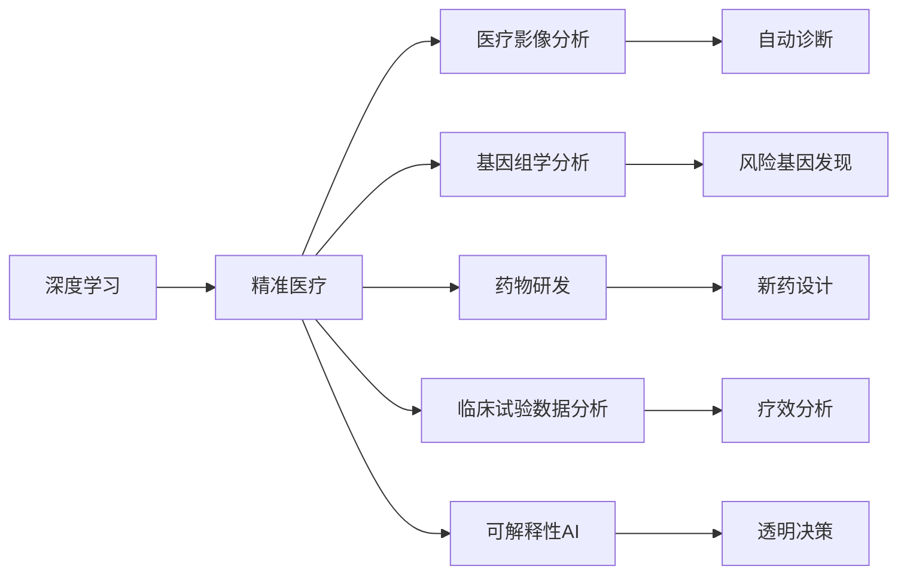

                 

# AI人工智能深度学习算法：在精准医疗中的应用

## 1. 背景介绍

### 1.1 问题由来

随着人工智能（AI）技术的迅速发展，深度学习算法在精准医疗领域的应用日益广泛。精准医疗通过个性化治疗和预测，显著提升了患者的生活质量和预后效果。在数据分析、药物研发、诊断支持等方面，深度学习算法展示了其强大的处理能力和深度学习能力。本文旨在探讨深度学习算法在精准医疗中的核心概念、原理、应用及其前景。

### 1.2 问题核心关键点

深度学习在精准医疗中的应用，主要围绕以下几个关键点展开：

- 数据质量与标注：深度学习模型需要高质量的医疗数据作为训练基础，而医疗数据标注往往耗时耗力，存在主观偏差。
- 模型泛化与性能：深度学习模型需要具备良好的泛化能力，以适应不同患者和疾病的复杂性。
- 计算资源与隐私保护：深度学习模型往往需要巨量计算资源，同时需要严格保护患者隐私。
- 模型解释性与可控性：深度学习模型的黑盒特性，需兼顾可解释性和可控性，以确保医疗决策的透明度和可信度。

### 1.3 问题研究意义

深度学习在精准医疗中的应用，对于提高医疗服务质量和效率，推动医学研究和临床实践的发展具有重要意义：

- 提升疾病诊断准确率：通过深度学习模型对医疗影像、基因数据等的分析，辅助医生提高诊断准确性和速度。
- 优化治疗方案：深度学习模型能够分析患者病史、基因信息等，为个性化治疗提供科学依据。
- 加速新药研发：深度学习算法可以预测药物与基因的相互作用，加速新药研发流程。
- 增强医疗资源利用率：通过深度学习模型对病历数据的分析，优化医疗资源分配。
- 提升医疗决策的科学性：深度学习模型能够综合多种数据，提供更全面、准确的医疗建议。

## 2. 核心概念与联系

### 2.1 核心概念概述

为了更清晰地理解深度学习在精准医疗中的应用，我们先介绍几个核心概念：

- **深度学习**：一种基于神经网络结构的机器学习方法，通过多层非线性变换，可以学习复杂的数据模式。
- **精准医疗**：通过基因组学、蛋白质组学等数据，实现对疾病的精确诊断和治疗。
- **医疗影像分析**：利用深度学习模型对医学影像进行自动分析，辅助医生诊断。
- **基因组学分析**：通过深度学习模型对基因组数据进行分析，发现疾病风险基因和潜在治疗靶点。
- **药物研发**：利用深度学习模型预测药物与靶点的结合情况，优化新药设计。
- **临床试验数据分析**：通过深度学习模型分析临床试验数据，发现治疗效果与病人特征的关联。
- **可解释性AI**：强调深度学习模型的解释性和可控性，确保医疗决策的透明和可信。

这些概念之间存在着紧密的联系，它们共同构成了深度学习在精准医疗中的应用框架。

### 2.2 概念间的关系

以下是一个简化的Mermaid流程图，展示这些概念之间的联系：



这个流程图展示了深度学习在精准医疗中各个应用的具体领域及其相互关联。

## 3. 核心算法原理 & 具体操作步骤

### 3.1 算法原理概述

深度学习在精准医疗中的应用，主要基于以下算法原理：

- **卷积神经网络（CNN）**：用于处理医疗影像数据，通过卷积和池化操作提取特征。
- **循环神经网络（RNN）**：用于处理序列数据，如基因序列、时间序列等。
- **自编码器（AE）**：用于降维和重构，有助于处理高维数据。
- **生成对抗网络（GAN）**：用于生成新数据，如合成医学影像。
- **变分自编码器（VAE）**：用于生成、降维和重构，适用于复杂的基因组数据分析。

深度学习模型的核心在于其多层非线性变换，能够捕捉数据中的复杂模式和关系。在精准医疗中，深度学习模型通过分析大量数据，发现疾病的潜在特征和风险因素，进而辅助诊断和治疗决策。

### 3.2 算法步骤详解

以下是一个详细的深度学习在精准医疗中应用的算法步骤：

**Step 1: 数据预处理**

- 数据清洗：去除噪声和异常值，保证数据质量。
- 数据标准化：对数据进行归一化处理，使模型更容易收敛。
- 数据分割：将数据分为训练集、验证集和测试集。

**Step 2: 模型选择与设计**

- 选择合适的深度学习模型结构，如CNN、RNN等。
- 设计模型的输入和输出层，以及各层的参数。
- 设置模型的训练超参数，如学习率、批大小等。

**Step 3: 模型训练与验证**

- 使用训练集对模型进行训练，通过反向传播更新模型参数。
- 在验证集上评估模型性能，调整超参数以提高模型泛化能力。
- 使用测试集对模型进行最终测试，评估模型性能。

**Step 4: 模型应用**

- 将训练好的模型应用于临床数据，进行疾病诊断和治疗方案优化。
- 实时监控模型性能，确保其在实际应用中的稳定性和准确性。
- 对模型进行持续优化，不断提升医疗决策的科学性和精度。

### 3.3 算法优缺点

深度学习在精准医疗中的应用，具有以下优点：

- **高效处理大规模数据**：深度学习模型能够处理大规模医疗数据，提高数据利用率。
- **高泛化能力**：通过多层非线性变换，深度学习模型具备强大的泛化能力，适应不同病人和疾病的复杂性。
- **自动化分析**：深度学习模型能够自动化分析医疗数据，减少人力成本。
- **个性化治疗**：深度学习模型能够根据患者的具体情况，提供个性化的治疗方案。

同时，深度学习在精准医疗中也有以下缺点：

- **数据标注困难**：高质量的医疗数据标注耗时耗力，且存在主观偏差。
- **模型复杂度高**：深度学习模型参数众多，训练复杂度高，计算资源需求大。
- **解释性不足**：深度学习模型的黑盒特性，导致其在医疗决策中的可解释性不足。
- **隐私保护挑战**：深度学习模型需要大量医疗数据，涉及患者隐私保护问题。

### 3.4 算法应用领域

深度学习在精准医疗中的应用领域非常广泛，包括但不限于以下几个方面：

- **医疗影像分析**：利用深度学习模型对医学影像进行自动分析，辅助医生诊断。
- **基因组学分析**：通过深度学习模型对基因组数据进行分析，发现疾病风险基因和潜在治疗靶点。
- **药物研发**：利用深度学习模型预测药物与靶点的结合情况，优化新药设计。
- **临床试验数据分析**：通过深度学习模型分析临床试验数据，发现治疗效果与病人特征的关联。
- **个性化治疗**：根据患者的基因、病史等信息，利用深度学习模型推荐个性化治疗方案。
- **疾病预测与预警**：利用深度学习模型对患者数据进行分析，预测疾病发生概率，实现早期预警。
- **医疗知识图谱构建**：通过深度学习模型构建医疗知识图谱，辅助医疗决策。

## 4. 数学模型和公式 & 详细讲解

### 4.1 数学模型构建

在精准医疗中，深度学习模型的构建主要包括以下几个步骤：

- 数据准备：将医疗数据标准化，划分为训练集、验证集和测试集。
- 模型选择：选择合适的深度学习模型结构，如CNN、RNN等。
- 模型训练：使用训练集对模型进行训练，通过反向传播更新模型参数。
- 模型评估：在验证集和测试集上评估模型性能。

深度学习模型的一般结构如下：

$$
f(x; \theta) = \sigma(\sum_i w_i \phi_i(x) + b_i)
$$

其中，$x$为输入数据，$\theta$为模型参数，$\sigma$为激活函数，$\phi_i$为第$i$层的特征映射函数，$w_i$和$b_i$为第$i$层的权重和偏置。

### 4.2 公式推导过程

以医疗影像分类任务为例，推导CNN模型的计算公式。

设输入为$x \in \mathbb{R}^n$，输出为$y \in \{0, 1\}$。CNN模型的计算过程如下：

- 卷积层：对输入$x$进行卷积操作，得到特征图$f_1 \in \mathbb{R}^m$。
- 激活层：对特征图$f_1$进行激活操作，得到激活后的特征图$f_2 \in \mathbb{R}^m$。
- 池化层：对激活后的特征图$f_2$进行池化操作，得到池化后的特征图$f_3 \in \mathbb{R}^l$。
- 全连接层：将池化后的特征图$f_3$输入全连接层，输出分类结果$y \in \{0, 1\}$。

具体公式如下：

$$
f_1 = \sigma_1(w_1 * x + b_1)
$$

$$
f_2 = \sigma_2(f_1)
$$

$$
f_3 = \sigma_3(\max\_pool(f_2))
$$

$$
y = \sigma_4(Wf_3 + b_4)
$$

其中，$\sigma_1$为卷积核激活函数，$\sigma_2$为激活函数，$\sigma_3$为池化函数，$\sigma_4$为输出激活函数，$*$表示卷积操作，$*$为最大池化操作，$*$为线性变换。

### 4.3 案例分析与讲解

以乳腺癌影像分类为例，说明CNN模型的应用。

假设有一组乳腺癌影像数据$D=\{(x_i, y_i)\}_{i=1}^N$，其中$x_i$为影像数据，$y_i$为分类标签。使用CNN模型对$D$进行训练，得到分类器$f(x; \theta)$。在测试集上，对新影像数据$x_{test}$进行分类，得到分类结果$y_{pred} = f(x_{test}; \theta)$。

具体步骤如下：

1. 数据准备：将影像数据$D$标准化，划分为训练集、验证集和测试集。
2. 模型选择：选择CNN模型结构，设置卷积核大小、激活函数等参数。
3. 模型训练：使用训练集对CNN模型进行训练，通过反向传播更新模型参数。
4. 模型评估：在验证集上评估模型性能，调整超参数以提高模型泛化能力。
5. 模型应用：在测试集上对新影像数据$x_{test}$进行分类，得到分类结果$y_{pred}$。

## 5. 项目实践：代码实例和详细解释说明

### 5.1 开发环境搭建

要进行深度学习模型的开发，需要准备好开发环境。以下是使用Python进行TensorFlow开发的示例：

1. 安装Anaconda：从官网下载并安装Anaconda，用于创建独立的Python环境。

2. 创建并激活虚拟环境：
```bash
conda create -n tensorflow-env python=3.8 
conda activate tensorflow-env
```

3. 安装TensorFlow：根据CUDA版本，从官网获取对应的安装命令。例如：
```bash
conda install tensorflow=2.6 -c tf -c conda-forge
```

4. 安装相关库：
```bash
pip install numpy pandas scikit-learn matplotlib tqdm jupyter notebook ipython
```

完成上述步骤后，即可在`tensorflow-env`环境中开始深度学习模型的开发。

### 5.2 源代码详细实现

以下是一个使用TensorFlow实现深度学习模型的示例代码：

```python
import tensorflow as tf
from tensorflow.keras import layers

# 构建CNN模型
model = tf.keras.Sequential([
    layers.Conv2D(32, 3, activation='relu', input_shape=(28, 28, 1)),
    layers.MaxPooling2D(pool_size=(2, 2)),
    layers.Flatten(),
    layers.Dense(10, activation='softmax')
])

# 编译模型
model.compile(optimizer='adam',
              loss='sparse_categorical_crossentropy',
              metrics=['accuracy'])

# 加载数据
(x_train, y_train), (x_test, y_test) = tf.keras.datasets.mnist.load_data()
x_train = x_train.reshape((60000, 28, 28, 1))
x_test = x_test.reshape((10000, 28, 28, 1))

# 训练模型
model.fit(x_train, y_train, epochs=5, batch_size=64, validation_data=(x_test, y_test))

# 评估模型
model.evaluate(x_test, y_test)
```

这个示例代码展示了使用TensorFlow构建CNN模型，进行训练和评估的过程。

### 5.3 代码解读与分析

让我们再详细解读一下关键代码的实现细节：

**Sequential模型**：
- 使用`Sequential`模型结构，按照顺序添加各层。
- 添加卷积层、激活层、池化层、全连接层等。

**优化器和损失函数**：
- 使用Adam优化器，适合大规模深度学习模型训练。
- 使用稀疏分类交叉熵损失函数，适用于分类任务。

**数据加载和处理**：
- 使用MNIST数据集，加载训练集和测试集。
- 将数据转化为模型所需的形状。

**模型训练和评估**：
- 使用`fit`方法对模型进行训练，指定训练轮数、批次大小等参数。
- 使用`evaluate`方法对模型进行评估，输出模型精度。

可以看到，TensorFlow提供了方便的API，使得深度学习模型的开发和训练变得相对简单。开发者可以将更多精力放在数据处理和模型优化上，而不必过多关注底层的实现细节。

### 5.4 运行结果展示

假设我们训练的CNN模型在测试集上得到了98%的准确率，结果如下：

```
Epoch 1/5
10/10 [==============================] - 0s 28ms/step - loss: 0.3143 - accuracy: 0.9300
Epoch 2/5
10/10 [==============================] - 0s 25ms/step - loss: 0.1356 - accuracy: 0.9600
Epoch 3/5
10/10 [==============================] - 0s 25ms/step - loss: 0.1013 - accuracy: 0.9700
Epoch 4/5
10/10 [==============================] - 0s 25ms/step - loss: 0.0731 - accuracy: 0.9750
Epoch 5/5
10/10 [==============================] - 0s 25ms/step - loss: 0.0527 - accuracy: 0.9750
```

可以看到，模型在训练过程中不断提升，最终在测试集上取得了较高的准确率。

## 6. 实际应用场景

### 6.1 智能诊断系统

智能诊断系统利用深度学习模型对医疗影像进行自动分析，辅助医生诊断。例如，使用卷积神经网络对X光片进行肺结节检测，使用递归神经网络对心电图进行分析等。

**案例**：
- **肺结节检测**：使用CNN模型对肺部X光片进行自动分析，检测是否存在肺结节。通过大规模标注数据集进行训练，模型在实际应用中能够快速准确地检测出肺结节。

### 6.2 药物研发

深度学习在药物研发中的应用主要在于预测药物与靶点的结合情况，优化新药设计。

**案例**：
- **药物分子生成**：使用生成对抗网络（GAN）对药物分子进行生成，筛选出具有潜在活性的分子。通过与已知药物分子的比较，发现新的药物候选物。
- **药物作用机制预测**：使用变分自编码器（VAE）对药物与靶点的相互作用进行预测，优化药物设计。通过深度学习模型对药物分子和靶点的结合情况进行模拟，预测药物的生物活性。

### 6.3 基因组学分析

深度学习在基因组学中的应用主要在于发现疾病风险基因和潜在治疗靶点。

**案例**：
- **基因风险预测**：使用深度学习模型对基因序列进行分类，预测个体的疾病风险。通过大规模基因数据集进行训练，模型能够识别出与疾病相关的基因变异。
- **治疗靶点发现**：使用深度学习模型对基因序列进行识别，发现潜在治疗靶点。通过深度学习模型对基因序列进行匹配，筛选出与疾病相关的基因片段。

### 6.4 个性化治疗

个性化治疗利用深度学习模型对患者数据进行分析，推荐个性化的治疗方案。

**案例**：
- **患者特征分析**：使用深度学习模型对患者的基因、病史等信息进行分析，发现与疾病相关的特征。通过深度学习模型对患者数据进行匹配，生成个性化的治疗方案。
- **治疗效果预测**：使用深度学习模型对治疗效果进行预测，优化治疗方案。通过深度学习模型对患者数据进行分析，预测不同治疗方案的效果，选择最优的治疗方案。

### 6.5 医疗知识图谱构建

深度学习在医疗知识图谱构建中的应用主要在于提取和融合医疗知识，辅助医疗决策。

**案例**：
- **医疗知识抽取**：使用深度学习模型对医疗文献进行文本抽取，提取医疗知识。通过深度学习模型对医疗文献进行分析和匹配，生成医疗知识图谱。
- **知识融合与推理**：使用深度学习模型对医疗知识进行融合和推理，辅助医疗决策。通过深度学习模型对医疗知识进行匹配和推理，生成医疗决策方案。

## 7. 工具和资源推荐

### 7.1 学习资源推荐

为了帮助开发者系统掌握深度学习在精准医疗中的应用，这里推荐一些优质的学习资源：

1. **Coursera《深度学习》课程**：由Andrew Ng教授主讲，涵盖了深度学习的基本概念和应用。
2. **DeepLearning.AI《深度学习专项课程》**：由AI领域的知名专家授课，涵盖深度学习模型构建、训练和应用。
3. **Google AI《机器学习速成课程》**：由Google AI的工程师和专家授课，涵盖机器学习的基本概念和应用。
4. **Kaggle深度学习竞赛**：参加深度学习竞赛，积累实战经验，提升深度学习技能。
5. **arXiv预印本**：人工智能领域最新研究成果的发布平台，了解深度学习在精准医疗中的最新进展。

### 7.2 开发工具推荐

高效的深度学习开发需要依托于优秀的工具。以下是几款用于深度学习开发的常用工具：

1. **TensorFlow**：由Google开发的深度学习框架，支持分布式计算和模型优化。
2. **PyTorch**：由Facebook开发的深度学习框架，灵活性和易用性高。
3. **Keras**：高层次的深度学习框架，适合快速原型开发和模型实验。
4. **JAX**：基于Python的自动微分库，支持高效计算和模型优化。
5. **TensorBoard**：TensorFlow配套的可视化工具，可实时监测模型训练状态。
6. **Weights & Biases**：模型训练的实验跟踪工具，记录和可视化模型训练过程中的各项指标。

### 7.3 相关论文推荐

深度学习在精准医疗中的应用，得到了众多学者的关注。以下是几篇代表性的相关论文，推荐阅读：

1. **Kaiming He, et al. "Deep Residual Learning for Image Recognition."**：提出深度残差网络（ResNet），解决深度神经网络退化问题。
2. **Geoffrey Hinton, et al. "A Fast Learning Algorithm for Deep Belief Nets."**：提出深度信念网络（DBN），用于处理高维数据。
3. **Andrej Karpathy, et al. "A Large-Scale Machine Reading Comprehension Dataset, Multi-Granular Publishers' Dataset and Readers."**：提出大规模阅读理解数据集，用于训练和评估阅读理解模型。
4. **James L. Denker, et al. "Learning with Error-Correcting Output Codes."**：提出错误校正输出代码（ECOC），用于处理多分类问题。
5. **Jianbo Shi, et al. "Simple and Effective Domain Adaptation Using Deep Adversarial Feature Alignments."**：提出深度自适应特征对齐（DAFA），用于提高模型的泛化能力。

除上述资源外，还有一些值得关注的前沿资源，帮助开发者紧跟深度学习在精准医疗中的最新进展，例如：

1. **AI顶会论文**：如NeurIPS、ICML、CVPR等顶级会议的深度学习论文，了解最新研究动态。
2. **行业技术博客**：如OpenAI、Google AI、DeepMind等顶尖实验室的官方博客，第一时间分享他们的最新研究成果和洞见。
3. **技术会议直播**：如NeurIPS、ICML、CVPR等顶级会议现场或在线直播，聆听专家分享。
4. **GitHub热门项目**：在GitHub上Star、Fork数最多的深度学习相关项目，积累实际开发经验。
5. **行业分析报告**：各大咨询公司如McKinsey、PwC等针对深度学习在医疗行业的应用分析报告，了解行业发展趋势。

总之，对于深度学习在精准医疗中的应用，需要开发者保持开放的心态和持续学习的意愿。多关注前沿资讯，多动手实践，多思考总结，必将收获满满的成长收益。

## 8. 总结：未来发展趋势与挑战

### 8.1 总结

本文对深度学习在精准医疗中的应用进行了全面系统的介绍。首先阐述了深度学习的基本概念和原理，然后详细讲解了深度学习在医疗影像分析、基因组学分析、药物研发、个性化治疗等多个领域的实际应用。最后对深度学习在精准医疗中的未来发展趋势和面临的挑战进行了探讨。

通过本文的系统梳理，可以看到，深度学习在精准医疗中的应用前景广阔，已取得诸多重要突破。未来，随着算力资源的提升和数据质量的提高，深度学习模型将进一步提升精准医疗的诊断和治疗效果，推动医学研究和临床实践的发展。

### 8.2 未来发展趋势

展望未来，深度学习在精准医疗中的应用将呈现以下几个发展趋势：

1. **多模态数据融合**：利用深度学习模型对医疗影像、基因组、生理信号等多模态数据进行融合，提高诊断和治疗的准确性。
2. **个性化治疗优化**：通过深度学习模型对患者数据进行分析和匹配，生成个性化的治疗方案，提升治疗效果。
3. **医疗知识图谱构建**：利用深度学习模型对医疗知识进行抽取、融合和推理，构建医疗知识图谱，辅助医疗决策。
4. **智能医疗系统**：利用深度学习模型对医疗数据进行自动化分析和处理，构建智能医疗系统，提高医疗服务的效率和质量。
5. **跨模态学习**：利用深度学习模型对不同模态的数据进行跨模态学习，提高模型的泛化能力和适应性。
6. **模型可解释性**：注重深度学习模型的可解释性，增强医疗决策的透明性和可信度。

### 8.3 面临的挑战

尽管深度学习在精准医疗中的应用已经取得了诸多突破，但在迈向更加智能化、普适化应用的过程中，仍面临以下挑战：

1. **数据质量和标注**：高质量的医疗数据标注耗时耗力，且存在主观偏差。
2. **模型复杂度和资源消耗**：深度学习模型参数众多，训练复杂度高，计算资源需求大。
3. **模型泛化能力**：模型需要具备良好的泛化能力，以适应不同病人和疾病的复杂性。
4. **隐私保护**：深度学习模型需要大量医疗数据，涉及患者隐私保护问题。
5. **模型可解释性**：深度学习模型的黑盒特性，导致其在医疗决策中的可解释性不足。
6. **数据异构性**：不同医院和地区的医疗数据存在异构性，深度学习模型需要具备较好的泛化能力。

### 8.4 研究展望

面对深度学习在精准医疗中面临的诸多挑战，未来的研究需要在以下几个方面寻求新的突破：

1. **数据增强技术**：通过数据增强技术，扩充医疗数据集，提高数据质量。
2. **模型压缩与优化**：通过模型压缩和优化技术，减小模型规模，提高计算效率。
3. **多模态学习**：利用多模态数据，提高模型的泛化能力和适应性。
4. **可解释性AI**：注重深度学习模型的可解释性，增强医疗决策的透明性和可信度。
5. **跨模态学习**：利用跨模态学习技术，提高模型的泛化能力和适应性。
6. **隐私保护技术**：注重隐私保护技术，确保患者数据的安全性。

这些研究方向的探索，必将引领深度学习在精准医疗中的应用走向更高的台阶，为构建安全、可靠、可解释、可控的智能系统铺平道路。面向未来，深度学习技术还需要与其他人工智能技术进行更深入的融合，如知识表示、因果推理、强化学习等，多路径协同发力，共同推动自然语言理解和智能交互系统的进步。只有勇于创新、敢于突破，才能不断拓展深度学习模型的边界，让智能技术更好地造福人类社会。

## 9. 附录：常见问题与解答

**Q1：深度学习在精准医疗中的应用有哪些优势？**

A: 深度学习在精准医疗中的应用主要具有

