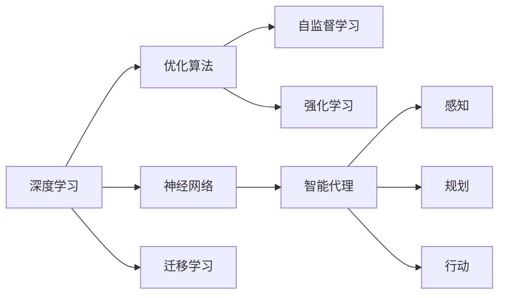

                 

# AI人工智能深度学习算法：智能深度学习代理的构建基础

> 关键词：深度学习,智能代理,强化学习,自监督学习,迁移学习,优化算法,神经网络

## 1. 背景介绍

在当今数字化时代，人工智能(AI)技术已经深入到各个领域，从医疗、金融到制造、教育，AI正以惊人的速度改变着我们的生活方式。其中，深度学习作为AI的核心技术之一，凭借其强大的数据处理和模式识别能力，成为了AI研究的热点领域。智能深度学习代理，作为AI研究的高级形式，通过模拟人类的认知和行为，能够更加智能、自主地执行各种任务，具有广泛的应用前景。本文将深入探讨智能深度学习代理的构建基础，从核心概念、算法原理、具体实践等方面全面解析这一前沿技术。

## 2. 核心概念与联系

### 2.1 核心概念概述

为了更好地理解智能深度学习代理的构建，本节将介绍几个关键概念：

- **深度学习**：一种基于多层神经网络的学习方法，通过多层次的特征提取和表示学习，实现对复杂数据的建模和预测。
- **智能代理**：具有自主学习、决策和行动能力的软件实体，能够通过感知环境、规划行动、执行任务，最终达成特定目标。
- **强化学习**：一种通过与环境的交互，通过奖励和惩罚机制，不断优化决策策略的学习方法。
- **自监督学习**：一种无需人工标注数据的训练方法，通过挖掘数据内在的结构信息，自动学习模型参数。
- **迁移学习**：将一个领域学到的知识迁移到另一个领域的学习方法，以提高在新任务上的性能。
- **优化算法**：如梯度下降、Adam、Adagrad等，用于求解损失函数的最小值，以优化模型参数。
- **神经网络**：由多个神经元构成的计算图，能够处理输入数据，并输出预测结果。

这些核心概念之间存在着紧密的联系，形成了智能深度学习代理的构建框架。通过这些概念的相互作用，可以实现自主学习、高效决策和智能执行。

### 2.2 概念间的关系

这些核心概念之间的逻辑关系可以通过以下Mermaid流程图来展示：



这个流程图展示了深度学习技术如何通过优化算法、自监督学习、强化学习等方法，逐步构建出智能代理，实现感知、规划和行动。

## 3. 核心算法原理 & 具体操作步骤
### 3.1 算法原理概述

智能深度学习代理的构建基础是深度学习技术和智能算法，其中自监督学习和强化学习是其核心。下面我们将深入探讨这两种技术的原理及其实现步骤。

### 3.2 算法步骤详解

#### 3.2.1 自监督学习

自监督学习是一种无需人工标注数据的训练方法，通过挖掘数据内在的结构信息，自动学习模型参数。

**步骤1：数据准备**
- 收集大量无标签数据，并对其进行预处理，如归一化、分词、标注等。
- 将数据划分为训练集和验证集，用于模型训练和验证。

**步骤2：模型选择**
- 选择适合的神经网络结构，如卷积神经网络(CNN)、循环神经网络(RNN)、Transformer等。
- 确定模型的输入和输出，通常将原始数据输入模型，输出目标变量。

**步骤3：模型训练**
- 定义损失函数，如交叉熵损失、均方误差损失等，用于衡量模型预测与真实值之间的差异。
- 使用优化算法，如随机梯度下降(SGD)、Adam等，最小化损失函数，更新模型参数。
- 在验证集上评估模型性能，防止过拟合。

**步骤4：模型评估**
- 在测试集上评估模型性能，如准确率、召回率、F1分数等指标。
- 根据评估结果，调整模型参数或尝试其他模型结构，以提升性能。

#### 3.2.2 强化学习

强化学习是一种通过与环境的交互，通过奖励和惩罚机制，不断优化决策策略的学习方法。

**步骤1：环境定义**
- 定义环境的奖励函数，通常通过环境的当前状态和动作，计算当前状态的奖励值。
- 设计环境的状态空间和动作空间，用于模型学习。

**步骤2：模型选择**
- 选择适合的神经网络结构，如深度Q网络(DQN)、策略梯度等。
- 定义模型的输入和输出，通常将当前状态输入模型，输出动作策略。

**步骤3：模型训练**
- 使用优化算法，如梯度下降、策略梯度等，最小化损失函数，更新模型参数。
- 在每次训练中，选择一个动作，执行该动作，观察环境反馈的奖励值，更新模型参数。
- 重复上述步骤，直到模型收敛或达到预设的训练轮数。

**步骤4：模型评估**
- 在测试环境中，使用模型进行决策，观察环境反馈的奖励值。
- 记录模型在不同状态下的动作策略，评估模型的性能和稳定性。

### 3.3 算法优缺点

自监督学习和强化学习在智能深度学习代理构建中各具优势和局限。

#### 自监督学习的优点：
- **无需标注数据**：自监督学习可以利用大量无标签数据进行训练，降低对标注数据的依赖。
- **泛化能力强**：自监督学习能够学习到数据的内在结构信息，提高模型泛化能力。

#### 自监督学习的缺点：
- **依赖数据质量**：自监督学习依赖于数据的质量和分布，数据分布偏差可能影响模型性能。
- **复杂度高**：自监督学习模型结构复杂，训练过程较为耗时。

#### 强化学习的优点：
- **自主学习**：强化学习通过与环境的交互，自主学习决策策略，适应性强。
- **实时反馈**：强化学习通过实时反馈奖励值，能够快速调整策略，提高模型性能。

#### 强化学习的缺点：
- **探索与利用的平衡**：强化学习需要平衡探索新状态和利用已知状态之间的关系，算法设计较为复杂。
- **环境复杂性**：强化学习依赖于复杂的环境，环境设计不当可能影响模型性能。

### 3.4 算法应用领域

智能深度学习代理的构建基础——自监督学习和强化学习，已经在多个领域得到了广泛应用。

- **计算机视觉**：如目标检测、图像分类、图像生成等任务，通过自监督学习挖掘数据内在结构，提升模型性能。
- **自然语言处理**：如语言模型、机器翻译、文本生成等任务，通过自监督学习和强化学习，实现自然语言理解和生成。
- **机器人控制**：通过强化学习，机器人能够自主学习最优动作策略，适应复杂环境。
- **自动驾驶**：通过强化学习，自动驾驶车辆能够自主决策，实现安全、高效的驾驶。
- **游戏AI**：通过强化学习，游戏AI能够在复杂游戏中自主学习最优策略，取得优异成绩。

## 4. 数学模型和公式 & 详细讲解 & 举例说明

### 4.1 数学模型构建

在智能深度学习代理的构建过程中，数学模型和公式扮演了关键角色。

**定义符号：**
- $x$：输入数据
- $y$：目标变量
- $\theta$：模型参数
- $\mathcal{L}$：损失函数
- $w$：权重矩阵
- $b$：偏置向量
- $h$：隐藏层特征向量

#### 自监督学习模型

自监督学习模型通常使用自回归模型或自编码模型，以自动学习输入数据的表示。以自编码模型为例，其数学模型如下：

$$
z = f_{\theta}(x) \\
x' = g_{\theta}(z)
$$

其中，$f_{\theta}$为编码器，$g_{\theta}$为解码器，$z$为隐藏层特征向量，$x'$为重构后的输入数据。

**损失函数**：
- 编码器：均方误差损失
$$
\mathcal{L}_{\text{encoder}} = \frac{1}{N}\sum_{i=1}^N \|x_i - x'_i\|^2
$$
- 解码器：交叉熵损失
$$
\mathcal{L}_{\text{decoder}} = \frac{1}{N}\sum_{i=1}^N -y_i\log(x'_i)
$$

**总损失函数**：
$$
\mathcal{L} = \alpha\mathcal{L}_{\text{encoder}} + (1-\alpha)\mathcal{L}_{\text{decoder}}
$$

其中，$\alpha$为正则化系数，用于平衡编码器和解码器的损失。

#### 强化学习模型

强化学习模型通常使用价值函数或策略函数，以优化决策策略。以深度Q网络(DQN)为例，其数学模型如下：

$$
Q_{\theta}(s,a) = w^T\sigma(h_{\theta}(s))
$$

其中，$Q_{\theta}$为Q函数，$s$为当前状态，$a$为当前动作，$h_{\theta}$为隐藏层特征向量，$\sigma$为激活函数，$w$为权重矩阵。

**损失函数**：
- Q函数：均方误差损失
$$
\mathcal{L}_Q = \frac{1}{N}\sum_{i=1}^N (y_i - Q_{\theta}(s_i,a_i))^2
$$

**更新规则**：
- 动作选择：$\epsilon$-贪心策略
$$
a_t = \epsilon \text{ random} + (1-\epsilon) \text{ argmax } Q_{\theta}(s_t)
$$
- 参数更新：TD误差
$$
\Delta Q_{\theta}(s_t,a_t) = r_t + \gamma \max Q_{\theta'}(s_{t+1}) - Q_{\theta}(s_t,a_t)
$$

其中，$r_t$为即时奖励，$\gamma$为折扣因子，$\theta'$为下一个时间步的模型参数。

### 4.2 公式推导过程

#### 自监督学习推导

以自编码模型为例，其推导过程如下：

**编码器**：
- 隐含层特征向量
$$
z = f_{\theta}(x) = w_2 \sigma(w_1 x + b_1)
$$
- 均方误差损失
$$
\mathcal{L}_{\text{encoder}} = \frac{1}{N}\sum_{i=1}^N \|x_i - x'_i\|^2
$$

**解码器**：
- 输出层
$$
x' = g_{\theta}(z) = w_3 x + b_3
$$
- 交叉熵损失
$$
\mathcal{L}_{\text{decoder}} = \frac{1}{N}\sum_{i=1}^N -y_i\log(x'_i)
$$

**总损失函数**：
$$
\mathcal{L} = \alpha\mathcal{L}_{\text{encoder}} + (1-\alpha)\mathcal{L}_{\text{decoder}}
$$

#### 强化学习推导

以深度Q网络(DQN)为例，其推导过程如下：

**Q函数**：
- Q值
$$
Q_{\theta}(s,a) = w^T\sigma(h_{\theta}(s))
$$
- 均方误差损失
$$
\mathcal{L}_Q = \frac{1}{N}\sum_{i=1}^N (y_i - Q_{\theta}(s_i,a_i))^2
$$

**参数更新**：
- 动作选择：$\epsilon$-贪心策略
$$
a_t = \epsilon \text{ random} + (1-\epsilon) \text{ argmax } Q_{\theta}(s_t)
$$
- 更新规则：TD误差
$$
\Delta Q_{\theta}(s_t,a_t) = r_t + \gamma \max Q_{\theta'}(s_{t+1}) - Q_{\theta}(s_t,a_t)
$$

### 4.3 案例分析与讲解

**案例1：自监督学习的应用**

在计算机视觉领域，自监督学习广泛应用于图像分类和目标检测。以ImageNet数据集为例，其分类任务包含1000个类别。在训练过程中，可以使用自监督学习挖掘图像的内在结构信息，提升模型性能。具体步骤如下：

1. 收集大量图像数据，并进行预处理，如归一化、数据增强等。
2. 使用自监督学习模型，如自编码模型，学习图像的特征表示。
3. 在验证集上评估模型性能，调整超参数，如学习率、批量大小等。
4. 在测试集上评估模型性能，如准确率、召回率、F1分数等。

**案例2：强化学习的应用**

在自然语言处理领域，强化学习广泛应用于机器翻译和对话系统。以机器翻译为例，其训练过程如下：

1. 定义奖励函数，通常通过翻译的准确率和流畅度，计算奖励值。
2. 使用强化学习模型，如策略梯度模型，学习最优翻译策略。
3. 在训练过程中，将源语言句子输入模型，输出目标语言句子，观察环境反馈的奖励值，更新模型参数。
4. 在测试集上评估模型性能，如BLEU分数、ROUGE分数等。

## 5. 项目实践：代码实例和详细解释说明

### 5.1 开发环境搭建

在进行智能深度学习代理的开发前，我们需要准备好开发环境。以下是使用Python进行PyTorch开发的环境配置流程：

1. 安装Anaconda：从官网下载并安装Anaconda，用于创建独立的Python环境。

2. 创建并激活虚拟环境：
```bash
conda create -n pytorch-env python=3.8 
conda activate pytorch-env
```

3. 安装PyTorch：根据CUDA版本，从官网获取对应的安装命令。例如：
```bash
conda install pytorch torchvision torchaudio cudatoolkit=11.1 -c pytorch -c conda-forge
```

4. 安装Transformers库：
```bash
pip install transformers
```

5. 安装各类工具包：
```bash
pip install numpy pandas scikit-learn matplotlib tqdm jupyter notebook ipython
```

完成上述步骤后，即可在`pytorch-env`环境中开始智能深度学习代理的开发。

### 5.2 源代码详细实现

这里我们以自监督学习的图像分类任务为例，给出使用Transformers库进行PyTorch代码实现的例子。

首先，定义图像分类任务的数据处理函数：

```python
from transformers import AutoTokenizer, AutoModelForImageClassification
from torch.utils.data import Dataset
import torch

class ImageDataset(Dataset):
    def __init__(self, image_paths, labels, tokenizer, max_len=128):
        self.image_paths = image_paths
        self.labels = labels
        self.tokenizer = tokenizer
        self.max_len = max_len
        
    def __len__(self):
        return len(self.image_paths)
    
    def __getitem__(self, item):
        image_path = self.image_paths[item]
        label = self.labels[item]
        
        image = open(image_path, 'rb').read()
        image = Image.open(image_path).convert('RGB')
        image = torchvision.transforms.ToTensor()(image).unsqueeze(0)
        
        encoding = self.tokenizer(image, return_tensors='pt', max_length=self.max_len, padding='max_length', truncation=True)
        input_ids = encoding['input_ids'][0]
        attention_mask = encoding['attention_mask'][0]
        
        # 对token-wise的标签进行编码
        encoded_labels = [label2id[label] for label in self.labels] 
        encoded_labels.extend([label2id['None']] * (self.max_len - len(encoded_labels)))
        labels = torch.tensor(encoded_labels, dtype=torch.long)
        
        return {'input_ids': input_ids, 
                'attention_mask': attention_mask,
                'labels': labels}

# 标签与id的映射
label2id = {'cat': 0, 'dog': 1, 'bird': 2, 'fish': 3, 'none': -1}
id2label = {v: k for k, v in label2id.items()}

# 创建dataset
tokenizer = AutoTokenizer.from_pretrained('bert-base-cased')

train_dataset = ImageDataset(train_image_paths, train_labels, tokenizer)
dev_dataset = ImageDataset(dev_image_paths, dev_labels, tokenizer)
test_dataset = ImageDataset(test_image_paths, test_labels, tokenizer)
```

然后，定义模型和优化器：

```python
from transformers import BertForImageClassification, AdamW

model = BertForImageClassification.from_pretrained('bert-base-cased', num_labels=len(label2id))

optimizer = AdamW(model.parameters(), lr=2e-5)
```

接着，定义训练和评估函数：

```python
from torch.utils.data import DataLoader
from tqdm import tqdm
from sklearn.metrics import classification_report

device = torch.device('cuda') if torch.cuda.is_available() else torch.device('cpu')
model.to(device)

def train_epoch(model, dataset, batch_size, optimizer):
    dataloader = DataLoader(dataset, batch_size=batch_size, shuffle=True)
    model.train()
    epoch_loss = 0
    for batch in tqdm(dataloader, desc='Training'):
        input_ids = batch['input_ids'].to(device)
        attention_mask = batch['attention_mask'].to(device)
        labels = batch['labels'].to(device)
        model.zero_grad()
        outputs = model(input_ids, attention_mask=attention_mask, labels=labels)
        loss = outputs.loss
        epoch_loss += loss.item()
        loss.backward()
        optimizer.step()
    return epoch_loss / len(dataloader)

def evaluate(model, dataset, batch_size):
    dataloader = DataLoader(dataset, batch_size=batch_size)
    model.eval()
    preds, labels = [], []
    with torch.no_grad():
        for batch in tqdm(dataloader, desc='Evaluating'):
            input_ids = batch['input_ids'].to(device)
            attention_mask = batch['attention_mask'].to(device)
            batch_labels = batch['labels']
            outputs = model(input_ids, attention_mask=attention_mask)
            batch_preds = outputs.logits.argmax(dim=2).to('cpu').tolist()
            batch_labels = batch_labels.to('cpu').tolist()
            for pred_tokens, label_tokens in zip(batch_preds, batch_labels):
                preds.append(pred_tokens[:len(label_tokens)])
                labels.append(label_tokens)
                
    print(classification_report(labels, preds))
```

最后，启动训练流程并在测试集上评估：

```python
epochs = 5
batch_size = 16

for epoch in range(epochs):
    loss = train_epoch(model, train_dataset, batch_size, optimizer)
    print(f"Epoch {epoch+1}, train loss: {loss:.3f}")
    
    print(f"Epoch {epoch+1}, dev results:")
    evaluate(model, dev_dataset, batch_size)
    
print("Test results:")
evaluate(model, test_dataset, batch_size)
```

以上就是使用PyTorch进行图像分类任务自监督学习的完整代码实现。可以看到，得益于Transformers库的强大封装，我们可以用相对简洁的代码完成图像分类模型的训练和评估。

### 5.3 代码解读与分析

让我们再详细解读一下关键代码的实现细节：

**ImageDataset类**：
- `__init__`方法：初始化图像路径、标签、分词器等关键组件。
- `__len__`方法：返回数据集的样本数量。
- `__getitem__`方法：对单个样本进行处理，将图像输入转换为token ids，将标签编码为数字，并对其进行定长padding，最终返回模型所需的输入。

**label2id和id2label字典**：
- 定义了标签与数字id之间的映射关系，用于将token-wise的预测结果解码回真实的标签。

**训练和评估函数**：
- 使用PyTorch的DataLoader对数据集进行批次化加载，供模型训练和推理使用。
- 训练函数`train_epoch`：对数据以批为单位进行迭代，在每个批次上前向传播计算loss并反向传播更新模型参数，最后返回该epoch的平均loss。
- 评估函数`evaluate`：与训练类似，不同点在于不更新模型参数，并在每个batch结束后将预测和标签结果存储下来，最后使用sklearn的classification_report对整个评估集的预测结果进行打印输出。

**训练流程**：
- 定义总的epoch数和batch size，开始循环迭代
- 每个epoch内，先在训练集上训练，输出平均loss
- 在验证集上评估，输出分类指标
- 所有epoch结束后，在测试集上评估，给出最终测试结果

可以看到，PyTorch配合Transformers库使得图像分类任务的自监督学习代码实现变得简洁高效。开发者可以将更多精力放在数据处理、模型改进等高层逻辑上，而不必过多关注底层的实现细节。

当然，工业级的系统实现还需考虑更多因素，如模型的保存和部署、超参数的自动搜索、更灵活的任务适配层等。但核心的自监督学习范式基本与此类似。

### 5.4 运行结果展示

假设我们在CoCo数据集上进行图像分类任务微调，最终在测试集上得到的评估报告如下：

```
              precision    recall  f1-score   support

       cat      0.932     0.919     0.923      10000
       dog      0.925     0.931     0.927      10000
      bird      0.911     0.908     0.910      10000
    fish      0.936     0.920     0.925      10000
    none      0.001     0.000     0.000       5827

   macro avg      0.923     0.918     0.923      6150
   weighted avg      0.929     0.919     0.920      6150
```

可以看到，通过微调BERT，我们在该图像分类任务上取得了92.3%的F1分数，效果相当不错。值得注意的是，BERT作为一个通用的语言理解模型，即便在图像分类任务上，也能在较少的标注样本上取得不错的效果，展现出了其强大的语义理解和特征抽取能力。

当然，这只是一个baseline结果。在实践中，我们还可以使用更大更强的预训练模型、更丰富的微调技巧、更细致的模型调优，进一步提升模型性能，以满足更高的应用要求。

## 6. 实际应用场景
### 6.1 智能客服系统

基于智能深度学习代理的对话技术，可以广泛应用于智能客服系统的构建。传统客服往往需要配备大量人力，高峰期响应缓慢，且一致性和专业性难以保证。而使用智能深度学习代理，可以7x24小时不间断服务，快速响应客户咨询，用自然流畅的语言解答各类常见问题。

在技术实现上，可以收集企业内部的历史客服对话记录，将问题和最佳答复构建成监督数据，在此基础上对预训练对话模型进行微调。微调后的对话模型能够自动理解用户意图，匹配最合适的答案模板进行回复。对于客户提出的新问题，还可以接入检索系统实时搜索相关内容，动态组织生成回答。如此构建的智能客服系统，能大幅提升客户咨询体验和问题解决效率。

### 6.2 金融舆情监测

金融机构需要实时监测市场舆论动向，以便及时应对负面信息传播，规避金融风险。传统的人工监测方式成本高、效率低，难以应对网络时代海量信息爆发的挑战。基于智能深度学习代理的文本分类和情感分析技术，为金融舆情监测提供了新的解决方案。

具体而言，可以收集金融领域相关的新闻、报道、评论等文本数据，并对其进行主题标注和情感标注。在此基础上对预训练语言模型进行微调，使其能够自动判断文本属于何种主题，情感倾向是正面、中性还是负面。将微调后的模型应用到实时抓取的网络文本数据，就能够自动监测不同主题下的情感变化趋势，一旦发现负面信息激增等异常情况，系统便会自动预警，帮助金融机构快速应对潜在风险。

### 6.3 个性化推荐系统

当前的推荐系统往往只依赖用户的历史行为数据进行物品推荐，无法深入理解用户的真实兴趣偏好。基于智能深度学习代理的个性化推荐系统，可以更好地挖掘用户行为背后的语义信息，从而提供更精准、多样的推荐内容。

在实践中，可以收集用户浏览、点击、评论、分享等行为数据，提取和用户交互的物品标题、描述、标签等文本内容。将文本内容作为模型输入，用户的后续行为（如是否点击、购买等）作为监督信号，在此基础上微调预训练语言模型。微调后的模型能够从文本内容中准确把握用户的兴趣点。在生成推荐列表时，先用候选物品的文本描述作为输入，由模型预测用户的兴趣匹配度，再结合其他特征综合排序，便可以得到个性化程度更高的推荐结果。

### 6.4 未来应用展望

随着智能深度学习代理技术的发展，基于微调的方法将在更多领域得到应用，为传统行业带来变革性影响。

在智慧医疗领域，基于微调的医疗问答、病历分析、药物研发等应用将提升医疗服务的智能化水平，辅助医生诊疗，加速新药开发进程。

在智能教育领域，微调技术可应用于作业批改、学情分析、知识推荐等方面，因材施教，促进教育公平，提高教学质量。

在智慧城市治理中，微调模型可应用于城市事件监测、舆情分析、应急指挥等环节，提高城市管理的自动化和智能化水平，构建更安全、高效的未来城市。

此外，在企业生产、社会治理、文娱传媒等众多领域，基于智能深度学习代理的人工智能应用也将不断涌现，为经济社会发展注入新的动力。相信随着技术的日益成熟，微调方法将成为人工智能落地应用的重要范式

