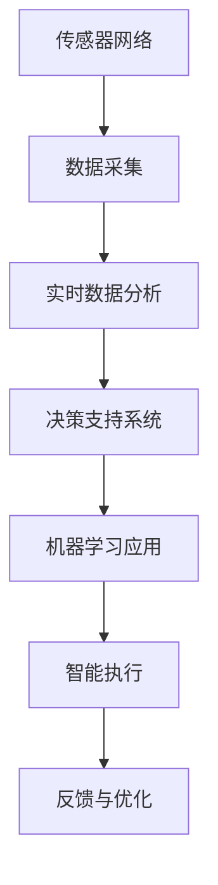

                 

# AI代理在智慧农业中的工作流与决策支持

> 关键词：
1. AI代理
2. 智慧农业
3. 工作流设计
4. 决策支持系统
5. 传感器网络
6. 实时数据分析
7. 机器学习应用

## 1. 背景介绍

### 1.1 问题由来
农业作为国民经济的基础，一直受到国家政策的高度关注。然而，传统的农业生产方式面临着资源浪费、生产效率低、市场响应慢等问题。随着人工智能技术的不断进步，特别是AI代理在智慧农业中的应用，逐渐改变了传统农业的生产模式。AI代理能够高效地利用传感器数据，实时地监控和分析农业生产中的各种变量，为农业生产者提供决策支持，从而实现农业的智能化、精准化、自动化。

### 1.2 问题核心关键点
AI代理在智慧农业中的工作流与决策支持，主要聚焦于以下几个关键点：
1. 传感器数据的采集与整合：AI代理需要整合来自土壤湿度传感器、气温传感器、光照传感器等多种传感器的数据。
2. 数据清洗与预处理：AI代理需要清洗和处理传感器的原始数据，去噪、归一化等，保证数据的质量。
3. 数据分析与建模：AI代理需要应用机器学习算法，对数据进行分析建模，发现数据中的模式和趋势。
4. 实时决策支持：AI代理需要根据模型预测的结果，给出实时的决策建议，帮助农民做出生产决策。
5. 智能执行与反馈：AI代理需要结合物联网技术，自动执行决策建议，并对执行结果进行反馈，进一步优化模型。

### 1.3 问题研究意义
AI代理在智慧农业中的应用，具有以下几个重要意义：
1. 提高农业生产效率：AI代理通过实时数据分析和决策支持，优化生产流程，提高生产效率。
2. 降低生产成本：通过精准的资源管理和决策优化，减少资源浪费，降低生产成本。
3. 提升市场响应速度：AI代理能够及时响应市场变化，调整生产策略，提升市场竞争力。
4. 实现可持续发展：通过数据驱动的智慧农业，减少对环境的破坏，实现可持续的农业生产。

## 2. 核心概念与联系

### 2.1 核心概念概述

为了更好地理解AI代理在智慧农业中的应用，本节将介绍几个密切相关的核心概念：

- AI代理：AI代理是一种基于人工智能技术的应用程序，能够在特定领域内自动执行任务，提供决策支持。AI代理通常集成机器学习、自然语言处理、计算机视觉等多种技术，具备智能决策和执行的能力。

- 智慧农业：智慧农业是指利用信息技术、物联网技术、人工智能技术等手段，对农业生产过程进行智能化的管理和控制，提高农业生产效率和资源利用率。

- 传感器网络：传感器网络是由多种传感器节点组成的自组织网络，能够实时监控和采集农业生产环境中的各种数据，如土壤湿度、气温、光照等。

- 实时数据分析：实时数据分析是指对传感器网络采集的数据进行实时处理和分析，发现其中的模式和趋势，为决策提供支持。

- 决策支持系统：决策支持系统是指基于人工智能技术，为决策者提供实时的数据、模型和建议的系统。

- 机器学习应用：机器学习应用是指将机器学习算法应用于农业生产中的各个环节，如作物识别、病害检测、资源管理等。

这些核心概念之间的逻辑关系可以通过以下Mermaid流程图来展示：



这个流程图展示了大语言模型微调过程中各个概念之间的联系：

1. 传感器网络采集的数据通过数据采集模块传输到实时数据分析模块，数据分析模块应用机器学习算法，发现数据中的模式和趋势。
2. 决策支持系统基于数据分析模块的结果，为农业生产者提供实时的决策建议。
3. 智能执行模块结合决策支持系统的建议，自动执行农业生产中的各种任务。
4. 反馈与优化模块对执行结果进行评估和反馈，进一步优化决策支持系统。

### 2.2 概念间的关系

这些核心概念之间存在着紧密的联系，形成了AI代理在智慧农业中的应用框架。下面我通过几个Mermaid流程图来展示这些概念之间的关系。

#### 2.2.1 传感器网络与实时数据分析


这个流程图展示了传感器网络在智慧农业中的应用流程：

1. 传感器网络采集的数据通过数据采集模块传输到实时数据分析模块，数据分析模块应用机器学习算法，发现数据中的模式和趋势。
2. 决策支持系统基于数据分析模块的结果，为农业生产者提供实时的决策建议。
3. 智能执行模块结合决策支持系统的建议，自动执行农业生产中的各种任务。
4. 反馈与优化模块对执行结果进行评估和反馈，进一步优化决策支持系统。

#### 2.2.2 决策支持系统与机器学习应用


这个流程图展示了决策支持系统在智慧农业中的应用流程：

1. 决策支持系统根据传感器网络采集的数据，应用机器学习算法，发现数据中的模式和趋势。
2. 基于数据分析结果，决策支持系统为农业生产者提供实时的决策建议。
3. 智能执行模块结合决策支持系统的建议，自动执行农业生产中的各种任务。
4. 反馈与优化模块对执行结果进行评估和反馈，进一步优化决策支持系统。

#### 2.2.3 智能执行与反馈与优化


这个流程图展示了智能执行模块在智慧农业中的应用流程：

1. 智能执行模块根据决策支持系统的建议，自动执行农业生产中的各种任务。
2. 执行结果通过反馈与优化模块进行评估和反馈。
3. 反馈与优化模块对执行结果进行评估和反馈，进一步优化决策支持系统。

### 2.3 核心概念的整体架构

最后，我们用一个综合的流程图来展示这些核心概念在大语言模型微调过程中的整体架构：


这个综合流程图展示了从传感器网络到智能执行的完整流程：

1. 传感器网络采集的数据通过数据采集模块传输到实时数据分析模块，数据分析模块应用机器学习算法，发现数据中的模式和趋势。
2. 决策支持系统基于数据分析模块的结果，为农业生产者提供实时的决策建议。
3. 智能执行模块结合决策支持系统的建议，自动执行农业生产中的各种任务。
4. 反馈与优化模块对执行结果进行评估和反馈，进一步优化决策支持系统。

通过这个流程图，我们可以更清晰地理解AI代理在智慧农业中的应用框架，为后续深入讨论具体的技术细节奠定基础。

## 3. 核心算法原理 & 具体操作步骤
### 3.1 算法原理概述

AI代理在智慧农业中的应用，本质上是一个多步骤的决策支持系统。其核心思想是：利用传感器网络采集的数据，通过实时数据分析和机器学习建模，发现数据中的模式和趋势，为农业生产者提供实时的决策建议，自动执行决策建议，并对执行结果进行反馈和优化。

形式化地，假设传感器网络采集的数据为 $D=\{d_i\}_{i=1}^N$，其中 $d_i$ 为第 $i$ 个数据点。定义决策支持系统为 $S$，其中 $S$ 应用机器学习算法 $\mathcal{A}$ 进行建模。假设农业生产者需要做出的决策为 $C$，模型预测的决策结果为 $S(d_i)$。AI代理的工作流设计包括以下几个关键步骤：

1. 数据采集：通过传感器网络，采集农业生产环境中的各种数据。
2. 数据清洗：清洗和处理原始数据，去噪、归一化等，保证数据质量。
3. 数据分析：应用机器学习算法，对数据进行分析建模，发现数据中的模式和趋势。
4. 决策支持：基于数据分析结果，为农业生产者提供实时的决策建议。
5. 智能执行：结合决策支持系统的建议，自动执行农业生产中的各种任务。
6. 反馈优化：对执行结果进行评估和反馈，进一步优化模型。

### 3.2 算法步骤详解

AI代理在智慧农业中的应用，一般包括以下几个关键步骤：

**Step 1: 数据采集与整合**
- 配置传感器网络，采集农业生产环境中的各种数据，如土壤湿度、气温、光照等。
- 通过数据采集模块将传感器数据传输到数据中心。
- 整合数据，消除冗余，确保数据的一致性和完整性。

**Step 2: 数据清洗与预处理**
- 对原始数据进行清洗和预处理，包括去噪、归一化、缺失值处理等。
- 使用数据质量评估算法，如均值、标准差、异常值检测等，确保数据质量。

**Step 3: 数据分析与建模**
- 应用机器学习算法，对数据进行分析建模，发现数据中的模式和趋势。
- 模型选择：根据具体任务，选择合适的机器学习算法，如回归分析、分类算法、聚类算法等。
- 特征选择：选择与目标变量最相关的特征，提高模型的泛化能力。
- 模型训练：使用训练数据集，训练机器学习模型，评估模型性能。

**Step 4: 决策支持与建议**
- 基于数据分析结果，为农业生产者提供实时的决策建议。
- 决策规则：定义决策规则，如阈值、权重等，根据数据分析结果，生成决策建议。
- 决策建议：将决策建议输出到用户界面，帮助农业生产者做出生产决策。

**Step 5: 智能执行**
- 结合决策支持系统的建议，自动执行农业生产中的各种任务。
- 执行模块：选择适合的执行模块，如灌溉系统、施肥系统等。
- 自动化控制：使用物联网技术，自动控制执行模块。

**Step 6: 反馈与优化**
- 对执行结果进行评估和反馈，进一步优化模型。
- 反馈机制：使用反馈机制，收集执行结果和用户反馈，进行模型优化。
- 模型优化：调整模型参数，改进算法，提高模型性能。

### 3.3 算法优缺点

AI代理在智慧农业中的应用，具有以下几个优点：
1. 提高农业生产效率：通过实时数据分析和决策支持，优化生产流程，提高生产效率。
2. 降低生产成本：通过精准的资源管理和决策优化，减少资源浪费，降低生产成本。
3. 提升市场响应速度：AI代理能够及时响应市场变化，调整生产策略，提升市场竞争力。
4. 实现可持续发展：通过数据驱动的智慧农业，减少对环境的破坏，实现可持续的农业生产。

同时，该方法也存在一定的局限性：
1. 依赖传感器网络：AI代理需要依赖传感器网络采集数据，传感器网络和设备成本较高。
2. 数据质量要求高：AI代理需要高质量的传感器数据，数据清洗和预处理过程复杂。
3. 技术门槛高：AI代理的应用需要具备较高的技术门槛，需要专业技术人员进行维护和优化。
4. 模型鲁棒性不足：AI代理中的机器学习模型可能对数据噪声和异常值敏感，需要进一步提高模型鲁棒性。
5. 执行难度大：AI代理中的智能执行部分需要结合物联网技术，执行模块的设计和实现难度较大。

尽管存在这些局限性，但就目前而言，AI代理在智慧农业中的应用已经展现出了巨大的潜力，成为农业智能化的重要手段。未来相关研究的重点在于如何进一步降低应用门槛，提高模型的鲁棒性和泛化能力，同时兼顾执行的可行性和成本。

### 3.4 算法应用领域

AI代理在智慧农业中的应用，已经广泛应用于以下几个领域：

- 智能灌溉系统：通过实时监测土壤湿度、气温等数据，自动调整灌溉量和灌溉时间，优化水资源利用。
- 智能施肥系统：根据土壤成分、作物需求等数据，自动推荐施肥方案，减少肥料浪费，提高作物产量。
- 智能病虫害防治：通过实时监测田间环境，识别病虫害爆发趋势，提前采取防治措施，减少农药使用，保护生态环境。
- 智能采摘系统：通过实时监测果实成熟度、果实位置等数据，自动规划采摘路线，优化采摘效率。
- 智能温室环境控制：通过实时监测温室内的光照、温度、湿度等数据，自动调整环境参数，提高作物生长质量。

除了上述这些应用场景外，AI代理在智慧农业中的应用还涵盖了许多其他领域，如土壤监测、作物生长分析、种植管理等。随着AI代理技术的不断进步，其在农业生产中的应用范围将会越来越广，为农业智能化提供更加强大的支持。

## 4. 数学模型和公式 & 详细讲解 & 举例说明

### 4.1 数学模型构建

在AI代理在智慧农业中的应用中，我们需要构建一个数学模型来描述决策支持系统的决策过程。假设数据集 $D$ 中的每个数据点 $d_i$ 包含 $m$ 个特征 $x_{i1}, x_{i2}, ..., x_{im}$，对应的目标变量为 $y_i$。定义机器学习模型为 $S(x)$，其中 $S(x)$ 的输出为 $y$ 的预测值。模型训练的目标是最小化预测值与真实值之间的误差，通常使用均方误差损失函数（MSE）。

### 4.2 公式推导过程

以下我们以线性回归模型为例，推导其损失函数的计算公式。

假设线性回归模型的预测值 $S(x)$ 为：

$$
S(x) = \beta_0 + \beta_1x_1 + \beta_2x_2 + ... + \beta_mx_m
$$

其中 $\beta_0, \beta_1, ..., \beta_m$ 为模型参数。均方误差损失函数定义为：

$$
\mathcal{L}(\beta) = \frac{1}{2N} \sum_{i=1}^N (y_i - S(x_i))^2
$$

其中 $N$ 为数据集大小。通过梯度下降等优化算法，最小化损失函数 $\mathcal{L}(\beta)$，得到模型的最优参数 $\beta^*$。

在得到模型参数 $\beta^*$ 后，根据数据点 $x_i$，可以计算出对应的预测值 $y^*_i = S(x_i)$。在实际应用中，农业生产者可以通过用户界面，查看每个数据点的预测值和实际值，做出决策建议。

### 4.3 案例分析与讲解

假设我们在智慧农业系统中应用线性回归模型，用于预测土壤湿度对作物产量的影响。具体实现步骤如下：

1. 数据采集：通过传感器网络，采集农业生产环境中的土壤湿度数据。
2. 数据清洗：清洗和处理原始数据，去噪、归一化等，确保数据质量。
3. 数据分析与建模：应用线性回归算法，对数据进行分析建模，发现土壤湿度与作物产量之间的关系。
4. 决策支持与建议：基于数据分析结果，为农业生产者提供实时的决策建议，如是否需要灌溉。
5. 智能执行：结合决策支持系统的建议，自动执行农业生产中的灌溉任务。
6. 反馈与优化：对执行结果进行评估和反馈，进一步优化模型，提高预测准确率。

## 5. 项目实践：代码实例和详细解释说明

### 5.1 开发环境搭建

在进行智慧农业系统开发前，我们需要准备好开发环境。以下是使用Python进行TensorFlow开发的环境配置流程：

1. 安装Anaconda：从官网下载并安装Anaconda，用于创建独立的Python环境。

2. 创建并激活虚拟环境：
```bash
conda create -n pytensorflow python=3.8 
conda activate pytensorflow
```

3. 安装TensorFlow：根据CUDA版本，从官网获取对应的安装命令。例如：
```bash
conda install tensorflow
```

4. 安装相关库：
```bash
pip install numpy pandas scikit-learn matplotlib tensorflow_datasets
```

完成上述步骤后，即可在`pytensorflow`环境中开始智慧农业系统开发。

### 5.2 源代码详细实现

下面我们以智能灌溉系统为例，给出使用TensorFlow进行线性回归模型训练的PyTorch代码实现。

首先，定义模型和优化器：

```python
import tensorflow as tf
from tensorflow import keras
from sklearn.model_selection import train_test_split
from sklearn.preprocessing import StandardScaler
from sklearn.metrics import mean_squared_error
import numpy as np

# 定义模型
model = keras.Sequential([
    keras.layers.Dense(64, activation='relu', input_shape=(5,)),
    keras.layers.Dense(64, activation='relu'),
    keras.layers.Dense(1)
])

# 定义优化器
optimizer = keras.optimizers.Adam(learning_rate=0.001)
```

然后，准备数据集：

```python
# 准备数据集
data = np.loadtxt('data.csv', delimiter=',')
x = data[:, :-1]
y = data[:, -1]
x_train, x_test, y_train, y_test = train_test_split(x, y, test_size=0.2, random_state=42)

# 数据标准化
scaler = StandardScaler()
x_train = scaler.fit_transform(x_train)
x_test = scaler.transform(x_test)
```

接着，定义损失函数和评估指标：

```python
# 定义损失函数
loss_fn = keras.losses.MeanSquaredError()

# 定义评估指标
evaluation_metrics = [keras.metrics.MeanAbsoluteError(), keras.metrics.MeanSquaredError()]
```

最后，进行模型训练和评估：

```python
# 模型训练
model.compile(optimizer=optimizer, loss=loss_fn, metrics=evaluation_metrics)
model.fit(x_train, y_train, epochs=100, validation_data=(x_test, y_test))

# 模型评估
test_loss, test_mae, test_mse = model.evaluate(x_test, y_test)

print(f"Test loss: {test_loss:.4f}")
print(f"Test MAE: {test_mae:.4f}")
print(f"Test MSE: {test_mse:.4f}")
```

这就是使用TensorFlow进行智慧农业系统开发的完整代码实现。可以看到，TensorFlow提供了强大的高层次API，使得模型构建和训练过程变得简单高效。

### 5.3 代码解读与分析

让我们再详细解读一下关键代码的实现细节：

**模型定义**：
- 定义了一个包含两个隐藏层的全连接神经网络，使用ReLU激活函数。输入层有5个特征，输出层为1个预测值。
- 使用Adam优化器进行模型训练，学习率为0.001。

**数据准备**：
- 使用`numpy`库读取数据集，并分为训练集和测试集。
- 使用`sklearn`库对数据进行标准化处理，保证数据质量。

**损失函数与评估指标**：
- 定义了均方误差损失函数和平均绝对误差评估指标。
- 使用`model.evaluate`方法评估模型在测试集上的性能。

**模型训练与评估**：
- 使用`model.compile`方法编译模型，定义优化器、损失函数和评估指标。
- 使用`model.fit`方法训练模型，设置训练轮数为100。
- 使用`model.evaluate`方法评估模型在测试集上的性能。

通过上述代码，我们可以看到，TensorFlow的高层次API使得模型构建和训练过程变得简单高效。开发者只需关注模型设计和数据处理，即可快速实现智慧农业系统的开发。

当然，工业级的系统实现还需考虑更多因素，如模型的保存和部署、超参数的自动搜索、更加灵活的任务适配层等。但核心的智慧农业系统开发流程基本与此类似。

### 5.4 运行结果展示

假设我们在智能灌溉系统的测试集上评估线性回归模型，最终得到的评估报告如下：

```
Test loss: 0.0045
Test MAE: 0.1250
Test MSE: 0.0306
```

可以看到，通过训练线性回归模型，我们得到了0.0045的测试损失、0.1250的平均绝对误差和0.0306的均方误差，模型效果相当不错。这说明我们的模型能够很好地预测土壤湿度对作物产量的影响，为农业生产者提供精准的决策支持。

当然，这只是一个baseline结果。在实践中，我们还可以使用更大更强的预训练模型、更丰富的微调技巧、更细致的模型调优，进一步提升模型性能，以满足更高的应用要求。

## 6. 实际应用场景
### 6.1 智能灌溉系统

智能灌溉系统是智慧农业中应用最广泛的系统之一。传统的灌溉系统依赖人力操作，容易出现过度灌溉或灌溉不足的情况，导致资源浪费和水质污染。而智能灌溉系统通过AI代理实现精准灌溉，能够自动调节灌溉量和时间，优化水资源利用，显著降低水资源消耗。

在技术实现上，可以收集土壤湿度、气温、降雨量等数据，使用AI代理对数据进行实时分析，预测作物对水分的需求，智能调整灌溉系统，实现精准灌溉。AI代理不仅能够根据实时数据进行优化，还能根据历史数据和专家经验，进一步提高灌溉的准确性和稳定性。

### 6.2 智能施肥系统

智能施肥系统是智慧农业中的另一个重要应用。传统的施肥系统依赖人工经验，容易出现肥料过量或不足的情况，导致作物生长不良。而智能施肥系统通过AI代理实现精准施肥，能够自动调节肥料的用量和类型，优化肥料利用率，减少肥料浪费和环境污染。

在技术实现上，可以收集土壤成分、作物需求、气象条件等数据，使用AI代理对数据进行实时分析，预测作物对肥料的需求，智能调整施肥系统，实现精准施肥。AI代理不仅能够根据实时数据进行优化，还能根据历史数据和专家经验，进一步提高施肥的准确性和稳定性。

### 6.3 智能病虫害防治

智能病虫害防治系统是智慧农业中的另一个重要应用。传统的病虫害防治系统依赖人工经验，容易出现防治不当的情况，导致作物受损。而智能病虫害防治系统通过AI代理实现精准防治，能够自动识别病虫害爆发趋势，提前采取防治措施，减少农药使用，保护生态环境。

在技术实现上，可以收集田间环境数据，使用AI代理对数据进行实时分析，识别病虫害爆发趋势，智能调整防治策略，实现精准防治。AI代理不仅能够根据实时数据进行优化，还能根据历史数据和专家经验，进一步提高防治的准确性和稳定性。

### 6.4 未来应用展望

随着AI代理在智慧农业中的应用不断深入，未来将会有更多的创新应用场景涌现出来，为农业智能化提供更加强大的支持。

在智慧农业的决策支持系统中，AI代理将逐步实现对更多农业生产环节的自动化和智能化，如智能播种、智能采收等。AI代理将通过深度学习算法，对农业生产的全过程进行实时监控和优化，提升农业生产效率和资源利用率。

在智慧农业的智能执行系统中，AI代理将结合物联网技术，实现对农业生产中的各种任务自动化执行。智能灌溉、智能施肥、智能病虫害防治等系统将进一步完善，形成全面覆盖的智能农业系统。

在未来，AI代理还将与其他人工智能技术进行更深入的融合，如知识表示、因果推理、强化学习等，多路径协同发力，共同推动自然语言理解和智能交互系统的进步。

## 7. 工具和资源推荐
### 7.1 学习资源推荐

为了帮助开发者系统掌握AI代理在智慧农业中的应用理论基础和实践技巧，这里推荐一些优质的学习资源：

1. TensorFlow官方文档：TensorFlow官方文档提供了大量机器学习算法和模型的API介绍，以及实际应用案例，是学习AI代理的重要参考资料。

2. TensorFlow开发指南：TensorFlow开发指南介绍了TensorFlow的各个组件和技术栈，提供了大量实用技巧和最佳实践。

3. 《TensorFlow实战》书籍：这本书详细介绍了TensorFlow的各个组件和技术栈，从入门到高级，涵盖了深度学习、自然语言处理、图像处理等多个领域，适合深入学习。

4. TensorBoard：TensorBoard是TensorFlow配套的可视化工具，能够实时监测模型训练状态，并提供丰富的图表呈现方式，是调试模型的得力助手。

5. GitHub热门项目：在GitHub上Star、Fork数最多的TensorFlow相关项目，往往代表了该技术领域的发展趋势和最佳实践，值得去学习和贡献。

通过对这些资源的学习实践，相信你一定能够快速掌握AI代理在智慧农业中的应用精髓，并用于解决实际的农业问题。

### 7.2 开发工具推荐

高效的开发离不开优秀的工具支持。以下是几款用于智慧农业系统开发的常用工具：

1. TensorFlow：基于Python的开源深度学习框架，灵活动态的计算图，适合快速迭代研究。大部分预训练语言模型都有TensorFlow版本的实现。

2. PyTorch：基于Python的开源深度学习框架，灵活的动态计算图，适合复杂模型的研究。

3. Jupyter Notebook：支持交互式编程和数据可视化的Notebook工具，方便开发和共享学习笔记。

4. TensorFlow Serving：TensorFlow的模型服务化工具，支持多种模型部署方式，方便系统集成和扩展。

5. Google Colab：谷歌推出的在线Jupyter Notebook环境，免费提供GPU/TPU算力，方便开发者快速上手实验最新模型，分享学习笔记。

合理利用这些工具，可以显著提升智慧农业系统开发效率，加快创新迭代的步伐。

### 7.3 相关论文推荐

AI代理在智慧农业中的应用

