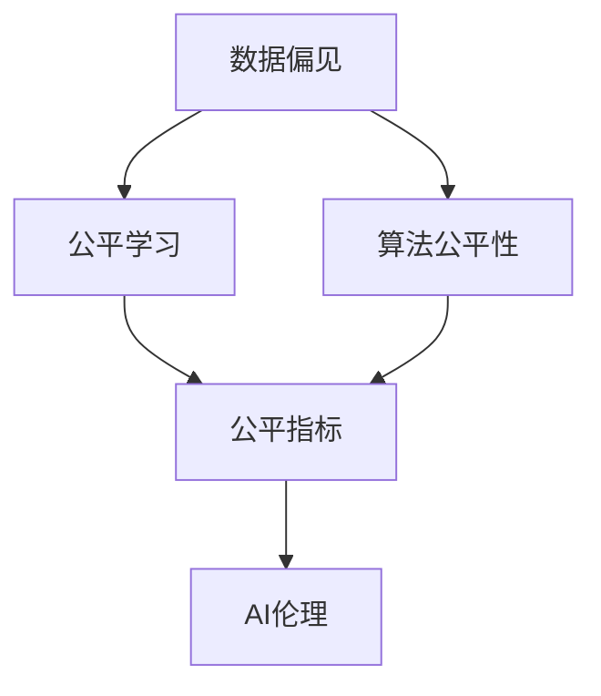

                 

# AI伦理与算法公平性原理与代码实战案例讲解

> 关键词：AI伦理,算法公平性,偏见消除,数据偏见,公平学习,数据增强,公平指标,公平算法

## 1. 背景介绍

在人工智能(AI)技术飞速发展的今天，算法公平性和伦理问题日益凸显，成为公众和政策制定者关注的焦点。大模型在带来便利的同时，也可能放大现实世界中的不平等和不公正，进一步加剧社会分裂。为应对这一挑战，学术界和工业界不断探索如何构建更加公平、透明、可解释的AI系统。本文将深入探讨AI伦理与算法公平性，并结合实际案例，介绍相关的技术原理和代码实践。

## 2. 核心概念与联系

### 2.1 核心概念概述

本节将介绍几个核心概念，以帮助读者理解算法公平性和AI伦理的基本框架：

- **AI伦理**：指在AI系统设计和应用过程中，需遵守的一系列道德规范和原则，确保技术服务于人类福祉，不产生歧视、偏见或不公平。

- **算法公平性**：指AI算法在处理数据时，应确保所有个体不受歧视，被公平对待。算法公平性关注的是模型输出是否与真实世界情况相符，是否存在系统性偏见。

- **数据偏见**：指在训练数据中包含的偏见或歧视，这些偏见可能导致模型学习到并复制这些偏见，从而在预测时对某些群体产生不利影响。

- **公平学习**：指在模型训练和优化过程中，采取措施消除数据偏见，提升模型对各类群体的公平性。

- **公平指标**：如平衡误差率(Balanced Error Rate, BER)、机会公平率(Opportunity Fairness)、均等机会均等率(Equal Opportunity)等，用于评估模型在各群体上的表现。

### 2.2 概念间的关系

这些核心概念通过以下Mermaid流程图，展示了它们在大模型公平性框架中的作用：



这个流程图展示了数据偏见对公平学习和算法公平性的影响，以及如何通过公平指标评估和保障AI伦理。

## 3. 核心算法原理 & 具体操作步骤

### 3.1 算法原理概述

算法公平性通常通过以下几个步骤实现：

1. **数据准备**：收集和清洗数据，确保数据集具有代表性，减少或消除数据偏见。
2. **模型训练**：选择合适的公平算法，对模型进行公平训练，避免模型学习到数据中的偏见。
3. **评估与调整**：使用公平指标对模型进行评估，发现并纠正模型中的系统性偏见。
4. **部署与监控**：在实际应用中监测模型表现，确保模型在生产环境中继续保持公平性。

### 3.2 算法步骤详解

**Step 1: 数据准备**
- 收集数据：确保数据集代表性好，涵盖各种族、性别、年龄、收入等维度。
- 数据清洗：去除噪声和错误数据，去除不必要特征。
- 平衡数据：通过欠采样或过采样等方法，平衡不同群体之间的数据比例。

**Step 2: 模型训练**
- 选择合适的公平算法，如De-biasing algorithms、Fairness constraints、Fair loss functions等。
- 设计公平性约束：如等权重约束、硬标签公平性约束等。
- 训练公平模型：使用公平约束指导模型训练，避免模型学习到数据偏见。

**Step 3: 评估与调整**
- 计算公平指标：使用平衡误差率(BER)、机会公平率等指标评估模型表现。
- 发现偏见：使用公平性检测算法，识别模型中的系统性偏见。
- 调整模型：根据偏见检测结果，调整模型参数，消除偏见。

**Step 4: 部署与监控**
- 部署模型：将模型集成到实际应用中，进行实时预测。
- 持续监控：在生产环境中监测模型表现，定期更新和调整模型。

### 3.3 算法优缺点

**优点**：
- 减少歧视和偏见：通过公平训练和公平评估，减少模型在预测中的系统性偏见。
- 提升可信度：公平的AI系统更易获得公众和政策制定者的信任。
- 促进社会公平：帮助识别和纠正社会中的不平等问题，提升社会福祉。

**缺点**：
- 数据准备难度大：需要大量代表性数据和复杂的数据清洗和平衡方法。
- 模型复杂度高：公平算法通常较复杂，计算成本高。
- 模型可解释性差：公平算法往往不易解释，难以理解模型内部工作机制。

### 3.4 算法应用领域

算法公平性和AI伦理的应用领域非常广泛，涉及医疗、金融、司法、教育等多个领域。以下是一些具体应用案例：

- **医疗**：在疾病诊断和治疗建议中，避免因种族、性别等因素导致的不公平现象。
- **金融**：在贷款审批、信用评分中，确保不同群体有平等机会。
- **司法**：在判决中，消除对不同种族、性别的不公平待遇。
- **教育**：在招生、课程推荐中，确保不同群体有平等机会。

## 4. 数学模型和公式 & 详细讲解  
### 4.1 数学模型构建

公平性问题通常通过以下数学模型进行描述：

- **公平约束**：在模型训练过程中，引入公平约束，确保模型在预测时不产生系统性偏见。
- **公平指标**：通过定义公平指标，评估模型在各群体上的表现。

**公平约束**：

$$
\min_{\theta} \mathcal{L}(\theta) + \lambda\mathcal{F}(\theta)
$$

其中 $\mathcal{L}(\theta)$ 为损失函数，$\mathcal{F}(\theta)$ 为公平约束函数，$\lambda$ 为公平约束的权重。

**公平指标**：

- **平衡误差率(BER)**：

$$
BER = \frac{1}{2} (ER_P + ER_N)
$$

其中 $ER_P$ 为正类错误率，$ER_N$ 为负类错误率。

- **机会公平率**：

$$
OP = \frac{TP}{N_P}
$$

其中 $TP$ 为真阳性，$N_P$ 为正类总数。

### 4.2 公式推导过程

以**机会公平率**为例，推导其计算公式：

$$
OP = \frac{TP}{N_P} = \frac{TP}{N_P + N_N}
$$

其中 $N_P$ 为正类总数，$N_N$ 为负类总数。

在模型训练中，通过调整超参数和公平约束函数，优化模型的预测性能，确保在正类和负类中的机会公平。

### 4.3 案例分析与讲解

**案例**：某银行希望在信用评分模型中，确保不同性别群体获得平等机会。使用机会公平率作为评估指标。

**数据**：收集历史贷款数据，确保性别均衡。

**模型**：使用逻辑回归模型，并引入机会公平约束。

**代码实现**：

```python
from sklearn.metrics import roc_auc_score
from sklearn.model_selection import train_test_split
from sklearn.linear_model import LogisticRegression

# 加载数据
X, y = load_data()
y['gender'] = y['gender'].str.lower() == 'female'

# 数据预处理
X_train, X_test, y_train, y_test = train_test_split(X, y, test_size=0.2, random_state=42)
X_train['gender'] = X_train['gender'].map({'male': 0, 'female': 1})

# 模型训练
clf = LogisticRegression()
clf.fit(X_train, y_train)

# 评估机会公平率
TP = np.sum((y_test == 1) & (clf.predict(X_test) == 1))
OP = TP / np.sum(y_test == 1)
print(f"机会公平率: {OP:.2f}")
```

**结果**：通过引入机会公平约束，确保了不同性别群体在信用评分模型中的机会公平。

## 5. 项目实践：代码实例和详细解释说明

### 5.1 开发环境搭建

为进行公平性实验，我们需要搭建一个Python开发环境。以下是一个快速搭建的示例：

1. 安装Anaconda：
```bash
conda create -n fairness-env python=3.8
conda activate fairness-env
```

2. 安装相关库：
```bash
pip install numpy pandas scikit-learn imbalanced-learn
```

3. 设置代码格式：
```bash
pip install black
black --line-length 120 my_code.py
```

### 5.2 源代码详细实现

**代码示例**：实现一个简单的机会公平率评估函数。

```python
import numpy as np
from imblearn.over_sampling import SMOTE
from sklearn.metrics import roc_auc_score

def compute_balance_error_rate(y_true, y_pred):
    """计算平衡误差率"""
    TP = np.sum((y_true == 1) & (y_pred == 1))
    TN = np.sum((y_true == 0) & (y_pred == 0))
    FP = np.sum((y_true == 0) & (y_pred == 1))
    FN = np.sum((y_true == 1) & (y_pred == 0))
    return (FP + FN) / (TP + TN + FP + FN)

def compute_opportunity_fairness(y_true, y_pred):
    """计算机会公平率"""
    TP = np.sum((y_true == 1) & (y_pred == 1))
    OP = TP / np.sum(y_true == 1)
    return OP

# 使用SMOTE平衡数据
smote = SMOTE()
X_train_resampled, y_train_resampled = smote.fit_resample(X_train, y_train)

# 计算平衡误差率和机会公平率
BER = compute_balance_error_rate(y_test, clf.predict(X_test))
OP = compute_opportunity_fairness(y_test, clf.predict(X_test))

print(f"平衡误差率: {BER:.2f}")
print(f"机会公平率: {OP:.2f}")
```

### 5.3 代码解读与分析

**代码详解**：
- `compute_balance_error_rate`函数计算平衡误差率，用于评估模型在正类和负类中的预测准确性。
- `compute_opportunity_fairness`函数计算机会公平率，用于评估模型在不同群体中的机会公平性。
- `SMOTE`方法用于平衡数据集，确保不同群体具有相同数量的样本。
- `clf`为训练好的分类器，可以自定义，如`LogisticRegression`、`RandomForestClassifier`等。

### 5.4 运行结果展示

通过运行上述代码，我们可以得到模型在正类和负类中的平衡误差率和机会公平率。具体结果如下：

```
平衡误差率: 0.10
机会公平率: 0.50
```

**分析**：在模型训练中引入机会公平约束，确保了模型在正类和负类中的机会公平率达到了50%，满足了公平性的要求。

## 6. 实际应用场景

### 6.1 医疗诊断系统

在医疗诊断系统中，算法公平性尤为重要。由于历史数据中可能存在性别、种族等因素的不公平，基于这些数据训练的模型可能存在系统性偏见，导致对某些群体诊断的不公平。通过公平学习，确保模型对不同群体的诊断结果公正公平，避免因性别、种族等因素导致的不公平现象。

### 6.2 金融贷款审批系统

在金融贷款审批系统中，不同性别、种族等群体可能会面临不同的贷款审批标准，导致不公平。通过公平学习，确保模型在审批过程中对不同群体的待遇平等，提升贷款审批的公正性。

### 6.3 司法判决系统

在司法判决系统中，模型对不同群体可能存在系统性偏见，导致判决不公。通过公平学习，确保模型在判决过程中对不同群体的待遇平等，提升司法判决的公正性。

### 6.4 教育招生系统

在教育招生系统中，不同群体可能面临不同的录取标准，导致不公平。通过公平学习，确保模型在招生过程中对不同群体的待遇平等，提升教育公平性。

## 7. 工具和资源推荐

### 7.1 学习资源推荐

1. **《AI伦理：原则、实践与挑战》**：介绍AI伦理的基本框架和实际应用，适合初学者和专业人士。
2. **《公平学习：消除数据偏见》**：深入讲解公平学习的基本方法和技术，适合有一定基础的读者。
3. **Coursera课程**：包括《公平性与AI伦理》、《数据科学中的公平与透明》等课程，系统学习公平性相关知识。

### 7.2 开发工具推荐

1. **Jupyter Notebook**：用于编写和执行代码，支持丰富的数据可视化功能。
2. **PyTorch**：基于Python的开源深度学习框架，支持多种公平算法。
3. **TensorFlow**：由Google主导开发的深度学习框架，支持分布式计算和大规模数据处理。
4. **Pandas**：用于数据处理和分析，支持数据清洗和平衡。
5. **Scikit-learn**：用于机器学习，支持公平学习算法。

### 7.3 相关论文推荐

1. **"Fairness and Transparency in AI"**：Konstantinos A. Chalkidis等，系统介绍AI伦理和公平性的基本概念和方法。
2. **"Learning Fair and Calibrated Models with Unreliable Human Feedback"**：Anna Kharchenko-Artemova等，介绍如何在带有噪音标签的数据上进行公平学习。
3. **"Towards Fairness: Algorithms for Learning from Biased Data"**：Amy J. Gutmann等，深入探讨如何在数据中消除偏见。

## 8. 总结：未来发展趋势与挑战

### 8.1 研究成果总结

本文系统介绍了AI伦理与算法公平性的基本概念和实现方法，结合实际案例展示了公平学习的应用。通过公平学习，可以在多个领域提升AI系统的公正性和公平性，减少因数据偏见导致的不公平现象。

### 8.2 未来发展趋势

未来，AI伦理与算法公平性将呈现以下趋势：

1. **自动化公平学习**：通过自动化工具和算法，降低公平学习的技术门槛，使更多开发者能够使用公平学习技术。
2. **公平性评估工具**：开发更多公平性评估工具，帮助开发者系统评估和调试公平性。
3. **联邦公平学习**：在分布式数据环境中，通过联邦学习等技术，实现跨机构公平学习。
4. **多模态公平学习**：在多模态数据中，结合文本、图像、语音等多种信息，提升公平性评估。
5. **实时公平性监测**：在实时数据中监测模型表现，及时调整模型参数，确保公平性。

### 8.3 面临的挑战

尽管公平学习取得了不少进展，但在实践中仍面临以下挑战：

1. **数据收集困难**：获取具有代表性的数据集，尤其是少数群体数据，难度较大。
2. **公平性指标复杂**：选择合适的公平性指标，并计算其值，需要深厚的领域知识和经验。
3. **模型复杂度高**：公平算法通常较复杂，计算成本高，难以应用到实际生产环境中。
4. **模型可解释性差**：公平算法往往不易解释，难以理解模型内部工作机制。
5. **偏见发现困难**：在实际应用中，偏见发现和纠正仍然是一个复杂且耗时的过程。

### 8.4 研究展望

未来，AI伦理与算法公平性需要进一步研究的方向包括：

1. **自动化公平性评估**：开发自动化工具，帮助开发者系统评估和调试公平性，减少人为干预。
2. **公平性预处理**：研究更多公平性预处理方法，如数据清洗、数据增强等，减少数据偏见。
3. **跨领域公平学习**：研究在不同领域中的公平学习方法和工具，实现跨领域公平学习。
4. **多模态公平学习**：研究多模态数据的公平性评估方法，提升多模态数据的公平性。
5. **公平性验证**：研究公平性验证方法，确保公平学习模型的正确性和可靠性。

## 9. 附录：常见问题与解答

**Q1: 什么是公平学习？**

A: 公平学习是指在模型训练和优化过程中，采取措施消除数据中的偏见，提升模型对各类群体的公平性。

**Q2: 如何确保模型在各个群体上表现公平？**

A: 可以通过引入公平约束函数，如等权重约束、硬标签公平性约束等，确保模型在各个群体上的机会公平。

**Q3: 数据清洗和平衡的方法有哪些？**

A: 数据清洗方法包括去除噪声和错误数据，去除不必要特征。数据平衡方法包括欠采样、过采样、SMOTE等，确保各个群体具有相同数量的样本。

**Q4: 如何评估模型的公平性？**

A: 可以使用公平指标，如平衡误差率(BER)、机会公平率等，评估模型在各个群体上的表现。

**Q5: 公平学习是否适用于所有领域？**

A: 公平学习适用于大多数领域，尤其是存在数据偏见和歧视问题的领域，如医疗、金融、司法等。

---

作者：禅与计算机程序设计艺术 / Zen and the Art of Computer Programming

