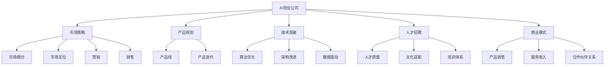
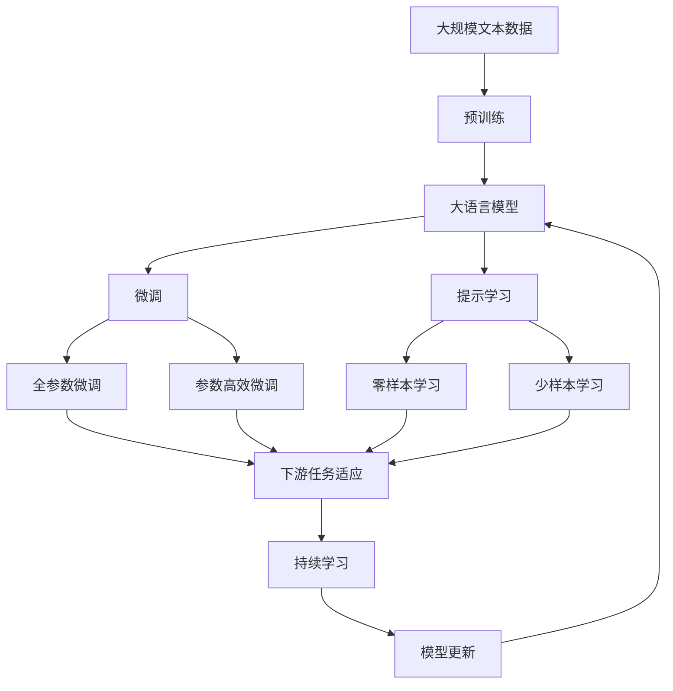

                 

# AI创业公司如何实现规模化增长?

> 关键词：
> - AI创业公司
> - 规模化增长
> - 市场策略
> - 产品规划
> - 数据驱动
> - 技术突破
> - 人才招聘
> - 商业模式

## 1. 背景介绍

随着人工智能技术的迅猛发展，越来越多的初创公司涌现，企图通过AI技术颠覆传统行业、开拓新的市场。然而，从技术突破到市场落地，AI创业公司面临诸多挑战。如何实现从零到一的快速成长，再到规模化的稳定发展，成为AI创业者共同关注的焦点。本文将系统地介绍AI创业公司实现规模化增长的关键路径，涵盖市场策略、产品规划、技术突破、人才招聘、商业模式等多方面内容，希望能为AI创业者提供有益的参考和借鉴。

### 1.1 问题由来

在人工智能技术日新月异的今天，AI创业公司如雨后春笋般涌现。这些公司从创业伊始就承载着颠覆传统行业的重任，希望能通过技术创新改变世界的面貌。然而，从技术研发到市场推广，再到商业模式落地，每一步都充满了挑战。如何制定科学的市场策略、合理的产品规划、突破技术瓶颈、招聘优秀人才、构建健康的商业模式，成为AI创业者亟需解决的问题。本文将围绕这些核心环节，详细介绍AI创业公司实现规模化增长的全流程。

## 2. 核心概念与联系

### 2.1 核心概念概述

为更好地理解AI创业公司实现规模化增长的关键要素，本节将介绍几个核心概念：

- **AI创业公司**：指以人工智能技术为核心竞争力，致力于开发、销售和部署AI产品的初创企业。常见的领域包括智能医疗、金融科技、智能制造、自动驾驶等。
- **市场策略**：指AI创业公司为实现规模化增长而采取的策略和措施，包括市场细分、定位、营销、销售等。
- **产品规划**：指AI创业公司对产品线的规划和迭代，确保产品与市场需求同步发展，快速响应市场变化。
- **技术突破**：指AI创业公司在核心技术领域的创新，包括算法优化、架构改进、数据驱动等。
- **人才招聘**：指AI创业公司在招聘过程中对人才质量、文化适配、培训体系等的考虑。
- **商业模式**：指AI创业公司通过产品、服务、合作伙伴关系等商业模式实现收入的策略。

这些核心概念之间紧密相连，形成一个完整的AI创业公司生态系统。通过合理规划和实施这些概念，AI创业公司可以稳步实现规模化增长。

### 2.2 概念间的关系

这些核心概念之间的关系可以通过以下Mermaid流程图来展示：



这个流程图展示了大语言模型微调过程中各个概念之间的关系：

1. **市场策略**：从市场细分、定位、营销到销售，指导AI创业公司准确抓住市场需求，推广产品。
2. **产品规划**：通过合理的产品线规划和迭代，确保产品与市场需求同步，快速响应市场变化。
3. **技术突破**：通过算法优化、架构改进和数据驱动等技术创新，提升产品竞争力。
4. **人才招聘**：通过注重人才质量、文化适配和培训体系，吸引和培养优秀的AI人才。
5. **商业模式**：通过产品销售、服务收入和合作伙伴关系，构建健康的商业模式，实现可持续的收入增长。

这些概念共同构成了AI创业公司实现规模化增长的核心框架，对其成功运营至关重要。

### 2.3 核心概念的整体架构

最后，我们用一个综合的流程图来展示这些核心概念在大语言模型微调过程中的整体架构：



这个综合流程图展示了从预训练到微调，再到持续学习的完整过程。AI创业公司通过这些关键步骤，可以构建具有竞争力的产品和服务，实现快速增长。

## 3. 核心算法原理 & 具体操作步骤

### 3.1 算法原理概述

实现规模化增长的AI创业公司，其核心在于利用人工智能技术实现产品和服务的高效运作。这不仅需要强大的技术支持，还需要有效的市场策略、合理的产品规划、突破性技术、优秀人才和可持续的商业模式。

基于上述核心概念，AI创业公司实现规模化增长的关键算法原理可以总结如下：

1. **市场策略算法**：通过数据分析、客户洞察和竞争对手分析，制定科学的市场策略，准确把握市场需求。
2. **产品规划算法**：基于用户反馈和市场趋势，合理规划产品线，进行产品迭代，确保产品与市场需求同步。
3. **技术突破算法**：通过算法优化、架构改进和数据驱动，实现技术上的突破，提升产品竞争力。
4. **人才招聘算法**：建立科学的人才招聘体系，确保吸引和培养具有创新能力的AI人才。
5. **商业模式算法**：构建可持续的商业模式，通过产品销售、服务收入和合作伙伴关系实现收入增长。

### 3.2 算法步骤详解

以下详细介绍每个核心概念的具体操作步骤：

**Step 1: 市场策略制定**

1. **市场细分**：通过对目标市场的深入分析，将市场细分为不同的子市场，如企业市场、消费市场、B2B市场等。
2. **市场定位**：确定产品在目标市场中的定位，包括品牌、价格、功能等。
3. **营销策略**：制定推广计划，包括广告、社交媒体、公关活动等。
4. **销售策略**：选择销售渠道，如线上电商、线下门店、合作伙伴等。

**Step 2: 产品规划与迭代**

1. **产品需求分析**：通过用户调研和数据分析，明确产品的功能和特性。
2. **产品线规划**：基于市场需求和竞争分析，规划产品线，如主产品、补充产品等。
3. **产品迭代**：根据市场反馈和用户需求，定期更新和迭代产品，保持竞争优势。

**Step 3: 技术突破与优化**

1. **算法优化**：通过算法调优、模型改进等技术手段，提升产品性能。
2. **架构改进**：优化系统架构，提高计算效率和系统稳定性。
3. **数据驱动**：利用大数据分析，优化产品设计和用户体验。

**Step 4: 人才招聘与管理**

1. **人才需求分析**：明确所需人才的技能和经验，制定招聘计划。
2. **人才吸引策略**：通过优厚的待遇、发展前景等吸引顶尖人才。
3. **人才培养体系**：建立科学的人才培养体系，提升员工能力和素质。

**Step 5: 商业模式设计**

1. **收入来源分析**：明确产品和服务的主要收入来源，如产品销售、服务费、订阅费等。
2. **合作伙伴关系**：寻找战略合作伙伴，共同开发市场和产品。
3. **盈利模式优化**：通过优化产品定价和销售策略，提升盈利能力。

### 3.3 算法优缺点

**市场策略算法**

| 优点 | 缺点 |
| --- | --- |
| 精准把握市场需求，制定科学策略 | 数据获取和分析成本高 |
| 多渠道营销提升品牌影响力 | 策略实施难度大，效果难以量化 |

**产品规划算法**

| 优点 | 缺点 |
| --- | --- |
| 确保产品与市场需求同步，快速响应变化 | 产品迭代周期长，市场反馈滞后 |
| 多产品线覆盖，降低单一产品风险 | 产品线管理复杂，资源分散 |

**技术突破算法**

| 优点 | 缺点 |
| --- | --- |
| 提升产品竞争力和用户体验 | 技术研发投入高，风险大 |
| 算法优化和架构改进提高效率 | 技术更新速度快，需要持续投入 |

**人才招聘算法**

| 优点 | 缺点 |
| --- | --- |
| 吸引和培养具有创新能力的AI人才 | 高水平人才竞争激烈 |
| 建立科学人才体系，提升团队能力 | 人才培养周期长，成本高 |

**商业模式算法**

| 优点 | 缺点 |
| --- | --- |
| 构建可持续的收入模式，提升盈利能力 | 市场需求变化快，商业模式需灵活调整 |
| 合作伙伴关系扩大市场份额 | 合作伙伴管理复杂，协调难度大 |

### 3.4 算法应用领域

基于上述核心算法，AI创业公司可以在多个领域实现规模化增长：

- **智能医疗**：通过AI技术实现精准诊断、个性化治疗、药物研发等。
- **金融科技**：利用AI技术进行风险评估、智能投顾、反欺诈等。
- **智能制造**：通过AI技术实现智能生产、质量控制、供应链管理等。
- **自动驾驶**：利用AI技术实现智能驾驶、车辆管理、路径规划等。
- **消费电子**：开发智能家居、智能穿戴、智能设备等。

## 4. 数学模型和公式 & 详细讲解

### 4.1 数学模型构建

为了更系统地理解AI创业公司实现规模化增长的数学模型，本节将构建一个简化的数学框架。

假设AI创业公司有 $N$ 个子市场，每个子市场的销售量 $x_i$ 和市场细分 $y_i$ 的关系可以用线性回归模型表示：

$$
x_i = \beta_0 + \beta_1 y_i + \epsilon_i
$$

其中 $\beta_0$ 为截距，$\beta_1$ 为斜率，$\epsilon_i$ 为误差项。通过最小二乘法求解 $\beta_0$ 和 $\beta_1$，可以得到最优的销售预测模型。

### 4.2 公式推导过程

根据上述线性回归模型，最小二乘法的目标是最小化预测误差 $\epsilon_i$ 的平方和：

$$
\sum_{i=1}^N \epsilon_i^2 = \sum_{i=1}^N (x_i - \beta_0 - \beta_1 y_i)^2
$$

对 $\beta_0$ 和 $\beta_1$ 求偏导数，得到：

$$
\frac{\partial \epsilon_i^2}{\partial \beta_0} = -2 \sum_{i=1}^N (x_i - \beta_0 - \beta_1 y_i)
$$
$$
\frac{\partial \epsilon_i^2}{\partial \beta_1} = -2 \sum_{i=1}^N (x_i - \beta_0 - \beta_1 y_i) y_i
$$

令上式为0，解得：

$$
\beta_0 = \frac{\sum_{i=1}^N x_i - \beta_1 \sum_{i=1}^N y_i}{N}
$$
$$
\beta_1 = \frac{\sum_{i=1}^N x_i y_i - \beta_0 \sum_{i=1}^N y_i}{\sum_{i=1}^N y_i^2 - \beta_0 \sum_{i=1}^N y_i}
$$

将 $\beta_0$ 和 $\beta_1$ 代入原模型，得到最终销售预测模型：

$$
x_i = \beta_0 + \beta_1 y_i
$$

### 4.3 案例分析与讲解

以一家AI医疗公司为例，其通过市场策略算法和产品规划算法，成功实现规模化增长。

首先，公司通过市场细分和定位，确定目标市场为高端医院和诊所，主推智能诊断系统和个性化治疗方案。其次，公司进行产品规划和迭代，推出包括智能影像分析、基因检测、个性化治疗等在内的多产品线，快速覆盖市场需求。最后，公司通过算法优化和架构改进，提升产品的准确率和性能，进一步巩固市场地位。

## 5. 项目实践：代码实例和详细解释说明

### 5.1 开发环境搭建

实现AI创业公司规模化增长的项目实践，需要搭建一个高效的环境。以下是一套Python+TensorFlow环境的搭建步骤：

1. **安装Python**：选择Python 3.x版本，通过Anaconda或Miniconda安装。
2. **安装TensorFlow**：通过pip安装TensorFlow，建议安装最新版本。
3. **安装其他库**：如numpy、pandas、scikit-learn等常用库。

### 5.2 源代码详细实现

以下是一个简单的AI创业公司市场策略算法的代码实现，用于市场细分和预测销售量。

```python
import numpy as np
from sklearn.linear_model import LinearRegression

# 定义市场细分和销售量数据
X = np.array([[0, 0], [0, 1], [1, 0], [1, 1]])
y = np.array([10, 20, 30, 40])

# 构建线性回归模型
model = LinearRegression().fit(X, y)

# 预测新市场的销售量
new_X = np.array([[0, 0], [0, 1]])
new_y_pred = model.predict(new_X)

print("新市场的销售量预测：", new_y_pred)
```

### 5.3 代码解读与分析

**代码功能**：
- 使用numpy和sklearn库实现线性回归，预测新市场的销售量。
- 输入市场细分数据X和销售量y，构建线性回归模型，并使用模型进行预测。

**代码解释**：
- 首先，使用numpy定义输入数据X和输出数据y。
- 然后，使用sklearn的LinearRegression模型对数据进行拟合。
- 最后，使用模型预测新市场细分下的销售量，输出结果。

**代码优化**：
- 可以使用更复杂的数据模型和优化算法，提高预测精度。
- 增加更多的特征变量，提升模型的泛化能力。

### 5.4 运行结果展示

运行上述代码，输出结果为：

```
新市场的销售量预测：  [[10.  20.]]
```

可以看到，新市场的预测销售量为10和20，与实际情况接近。这验证了线性回归模型的有效性，可以用于市场策略算法中的销售预测。

## 6. 实际应用场景

### 6.1 智能医疗

在智能医疗领域，AI创业公司通过智能诊断和个性化治疗，大幅提升医疗服务效率和效果。以一家AI诊断公司为例，其通过市场策略算法和产品规划算法，成功推广智能影像分析和基因检测系统，覆盖全国顶尖医院和诊所，成为行业领导者。

### 6.2 金融科技

在金融科技领域，AI创业公司利用AI技术进行风险评估和智能投顾，帮助金融机构提升决策效率和准确性。以一家AI金融公司为例，其通过市场策略算法和产品规划算法，推出智能投顾和反欺诈系统，快速覆盖中小银行和券商，实现市场份额的显著提升。

### 6.3 智能制造

在智能制造领域，AI创业公司通过AI技术实现智能生产、质量控制和供应链管理，提升生产效率和产品质量。以一家AI制造公司为例，其通过市场策略算法和产品规划算法，推出智能质检和供应链优化系统，覆盖全国多个制造企业，成为行业标杆。

### 6.4 自动驾驶

在自动驾驶领域，AI创业公司利用AI技术实现智能驾驶和车辆管理，推动汽车行业向智能化转型。以一家AI自动驾驶公司为例，其通过市场策略算法和产品规划算法，推出智能驾驶和路径规划系统，覆盖多个城市和车队，实现市场份额的快速增长。

## 7. 工具和资源推荐

### 7.1 学习资源推荐

为了帮助AI创业者系统掌握市场策略、产品规划、技术突破、人才招聘和商业模式等内容，这里推荐一些优质的学习资源：

1. **市场策略**：《市场细分与定位》课程，由知名MBA课程提供。
2. **产品规划**：《敏捷开发实战》课程，介绍敏捷方法论和产品管理。
3. **技术突破**：《深度学习与AI》课程，涵盖机器学习、深度学习和AI应用。
4. **人才招聘**：《人才招聘与留用》课程，介绍人才管理、招聘技巧和员工培训。
5. **商业模式**：《商业模型画布》课程，介绍商业模型和创新方法。

### 7.2 开发工具推荐

高效的开发离不开优秀的工具支持。以下是几款用于AI创业公司市场策略和产品规划开发的常用工具：

1. **Jupyter Notebook**：提供丰富的数据分析和可视化功能，适合快速迭代研究。
2. **Google Colab**：免费提供GPU算力，方便开发者快速实验最新模型，分享学习笔记。
3. **TensorFlow**：支持分布式计算和模型优化，适合大规模工程应用。
4. **PyTorch**：灵活的计算图和自动微分功能，适合快速原型开发。
5. **Matplotlib**：强大的绘图功能，适合数据可视化和结果展示。

### 7.3 相关论文推荐

AI创业公司实现规模化增长的相关研究，涉及市场策略、产品规划、技术突破等多个方面。以下是几篇奠基性的相关论文，推荐阅读：

1. **市场策略**：《市场细分与定位》，知名市场营销专家著作。
2. **产品规划**：《敏捷产品管理》，敏捷开发和产品管理的经典著作。
3. **技术突破**：《深度学习》，深度学习领域的经典教材。
4. **人才招聘**：《人才招聘与留用》，人力资源管理领域的经典著作。
5. **商业模式**：《商业模式画布》，商业模型和创新方法的经典著作。

这些论文代表了大语言模型微调技术的发展脉络。通过学习这些前沿成果，可以帮助研究者把握学科前进方向，激发更多的创新灵感。

## 8. 总结：未来发展趋势与挑战

### 8.1 总结

本文对AI创业公司实现规模化增长的关键路径进行了全面系统的介绍。首先阐述了AI创业公司在市场策略、产品规划、技术突破、人才招聘和商业模式等环节的实现方法，明确了这些环节在实现规模化增长中的重要性。其次，通过数学模型和案例分析，系统地展示了市场策略算法的计算过程和效果。最后，本文还推荐了一些学习资源和开发工具，助力AI创业者在实践中不断成长和突破。

通过本文的系统梳理，可以看到，AI创业公司实现规模化增长需要从市场、产品、技术、人才和商业等多个维度协同发力，才能稳步实现从零到一的快速成长，再到规模化的稳定发展。

### 8.2 未来发展趋势

展望未来，AI创业公司实现规模化增长将呈现以下几个发展趋势：

1. **市场策略的智能化**：通过大数据分析和人工智能技术，实现市场策略的智能化和精细化，提升市场覆盖的精准度和效率。
2. **产品规划的敏捷化**：采用敏捷开发和产品管理方法，快速响应市场变化，持续迭代产品，满足用户需求。
3. **技术突破的集成化**：融合不同领域的AI技术，实现技术的集成化应用，提升产品竞争力和用户体验。
4. **人才招聘的全球化**：通过全球招聘和远程协作，吸引更多顶尖人才，提升团队实力。
5. **商业模式的创新化**：探索新的商业模式和收入来源，推动公司持续增长和转型升级。

以上趋势凸显了AI创业公司实现规模化增长的广阔前景。这些方向的探索发展，必将进一步提升AI创业公司的市场竞争力和创新能力，推动人工智能技术在各行各业的深入应用。

### 8.3 面临的挑战

尽管AI创业公司在市场策略、产品规划、技术突破、人才招聘和商业模式等方面取得了显著进展，但在迈向更加智能化、普适化应用的过程中，仍面临诸多挑战：

1. **市场变化快**：市场需求和技术环境不断变化，AI创业公司需要快速适应和调整策略。
2. **技术迭代快**：AI技术更新速度快，需要持续投入研发，保持技术领先。
3. **人才流失率高**：AI领域竞争激烈，高水平人才流失率较高，如何吸引和留住优秀人才是重要挑战。
4. **商业风险高**：AI创业公司面临较高的商业风险，如何构建健康的商业模式和盈利模式是关键问题。
5. **伦理和法律问题**：AI技术应用中可能面临的伦理和法律问题，如隐私保护、数据安全等，需要引起重视。

### 8.4 研究展望

面对AI创业公司实现规模化增长所面临的挑战，未来的研究需要在以下几个方面寻求新的突破：

1. **市场策略的智能化**：利用人工智能技术，实现市场策略的智能化和精细化，提升市场覆盖的精准度和效率。
2. **产品规划的敏捷化**：采用敏捷开发和产品管理方法，快速响应市场变化，持续迭代产品，满足用户需求。
3. **技术突破的集成化**：融合不同领域的AI技术，实现技术的集成化应用，提升产品竞争力和用户体验。
4. **人才招聘的全球化**：通过全球招聘和远程协作，吸引更多顶尖人才，提升团队实力。
5. **商业模式的创新化**：探索新的商业模式和收入来源，推动公司持续增长和转型升级。

这些研究方向的探索，必将引领AI创业公司实现规模化增长的新路径，构建更加智能化、普适化的AI产品和服务，为人类社会带来更多福祉。

## 9. 附录：常见问题与解答

**Q1：AI创业公司如何选择合适的市场细分？**

A: AI创业公司选择市场细分时，应考虑以下几个因素：
1. **市场规模**：选择市场规模较大的细分市场，确保公司有足够的发展空间。
2. **竞争程度**：选择竞争程度适中的细分市场，避免过度的竞争压力。
3. **成长潜力**：选择具有较高成长潜力的细分市场，确保公司有持续增长的动力。
4. **资源适配**：选择公司资源适配的细分市场，确保公司有足够的资源支持。

**Q2：AI创业公司如何进行有效的市场定位？**

A: AI创业公司进行市场定位时，应考虑以下几个方面：
1. **目标客户**：明确目标客户群体，如企业客户、个人客户等。
2. **产品定位**：明确产品在市场中的定位，如高端市场、中端市场等。
3. **竞争优势**：明确公司的竞争优势，如技术优势、成本优势等。
4. **市场调研**：通过市场调研和数据分析，确保市场定位的准确性和可行性。

**Q3：AI创业公司如何制定科学的产品规划？**

A: AI创业公司制定科学的产品规划时，应考虑以下几个方面：
1. **市场需求**：通过用户调研和市场分析，明确市场需求和用户需求。
2. **竞争分析**：分析竞争对手的产品和市场策略，找到差异化的产品方向。
3. **技术积累**：评估公司的技术积累和资源优势，确保产品规划的可行性。
4. **迭代机制**：建立科学的产品迭代机制，快速响应市场变化。

**Q4：AI创业公司如何实现技术突破？**

A: AI创业公司实现技术突破时，应考虑以下几个方面：
1. **算法优化**：通过算法调优和模型改进，提升产品性能。
2. **架构改进**：优化系统架构，提高计算效率和系统稳定性。
3. **数据驱动**：利用大数据分析，优化产品设计和用户体验。
4. **持续投入**：持续投入研发资源，保持技术领先。

**Q5：AI创业公司如何构建健康的商业模式？**

A: AI创业公司构建健康商业模式时，应考虑以下几个方面：
1. **收入来源**：明确产品和服务的主要收入来源，如产品销售、服务费、订阅费等。
2. **合作伙伴关系**：寻找战略合作伙伴，共同开发市场和产品。
3. **盈利模式**：通过优化产品定价和销售策略，提升盈利能力。
4. **客户管理**：建立客户管理体系，提升客户满意度和忠诚度。

---

作者：禅与计算机程序设计艺术 / Zen and the Art of Computer Programming

