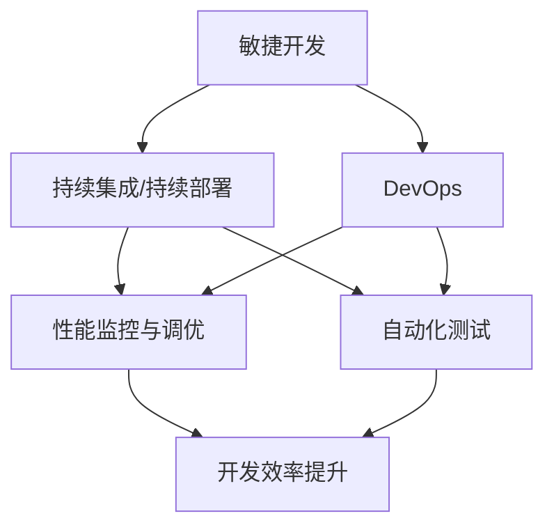
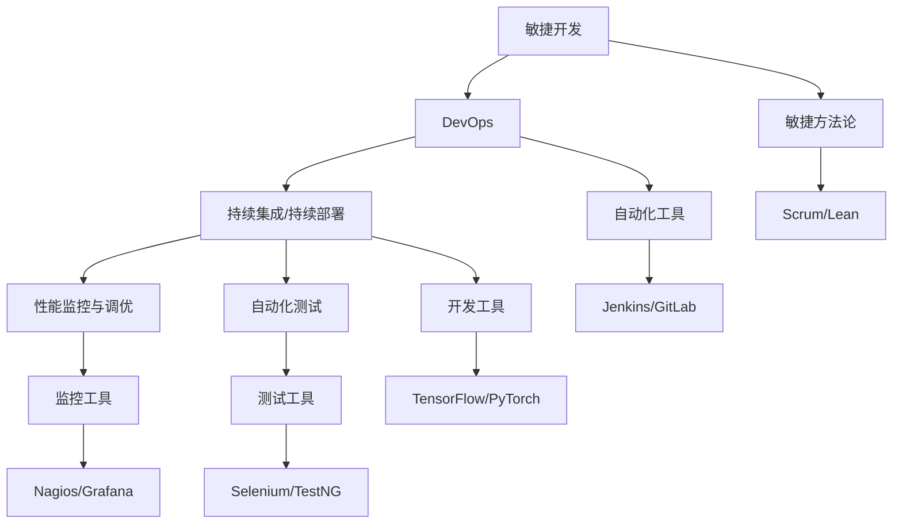

                 

# AI创业公司的技术研发管理优化

> 关键词：AI创业公司,技术研发管理,优化,生产力,项目调度,资源配置,员工绩效,创新激励,持续学习

## 1. 背景介绍

### 1.1 问题由来

在当今的科技发展浪潮中，AI创业公司如雨后春笋般涌现。这些公司以强大的技术实力、创新的商业模式和高效的项目管理，推动着人工智能技术的快速发展和广泛应用。然而，随着业务规模的不断扩大，技术研发管理的复杂性也在不断提升。如何在有限的资源和紧迫的时间压力下，高效地推进技术研发，实现快速迭代和创新突破，成为每个AI创业公司面临的重大挑战。

### 1.2 问题核心关键点

技术研发管理的核心在于如何通过高效的项目调度、资源配置、员工绩效管理和创新激励机制，最大化公司的技术研发生产力。其中，以下关键点尤为重要：

- **项目调度**：如何合理规划项目时间表，协调不同项目间的资源分配，避免资源浪费和项目延期。
- **资源配置**：如何根据项目需求，高效配置硬件、软件、人力等各类资源，实现成本最优。
- **员工绩效管理**：如何通过有效的绩效评估和激励机制，提升员工的工作动力和产出效率。
- **创新激励**：如何建立鼓励创新、容忍失败的企业文化，激发团队的创新能力和技术热情。

### 1.3 问题研究意义

优化AI创业公司的技术研发管理，对于提升公司的技术创新能力、加快产品迭代速度、增强市场竞争力具有重要意义：

1. **提升生产力**：通过科学的项目管理和资源配置，最大化技术研发效率，缩短产品上市周期。
2. **降低成本**：合理配置资源，避免资源浪费，减少不必要的研发投入。
3. **提高员工满意度**：通过公正的绩效评估和激励机制，提升员工工作积极性和满意度。
4. **增强创新能力**：建立支持创新的企业文化，鼓励员工大胆尝试新技术和新方法，推动技术突破。
5. **适应市场变化**：快速响应市场需求变化，灵活调整研发策略和方向，保持公司的竞争优势。

## 2. 核心概念与联系

### 2.1 核心概念概述

为了更好地理解技术研发管理优化，我们首先介绍几个核心概念及其相互关系：

- **敏捷开发(Agile Development)**：一种以迭代、反馈为导向的开发方法，强调团队协作和快速响应变化。
- **DevOps(DevOps)**：一种将软件开发和运维融合的技术文化和管理实践，旨在提高开发和运维的效率和质量。
- **持续集成/持续部署(CI/CD)**：一种基于自动化工具和流程的开发实践，旨在加速软件开发生命周期的各个环节。
- **性能监控与调优(Performance Monitoring & Tuning)**：通过持续监控系统性能，及时发现和解决问题，优化系统运行效率。
- **自动化测试(Automated Testing)**：通过编写自动化测试脚本，快速验证代码的正确性和性能，确保软件质量。

这些概念通过以下几个方面的联系，构成了AI创业公司技术研发管理的核心：

1. **敏捷开发**：通过迭代交付，快速响应市场需求和变化，提升开发效率。
2. **DevOps**：通过自动化和工具链的整合，提高开发和运维的效率和质量。
3. **持续集成/持续部署**：通过自动化工具和流程，加速软件开发生命周期的各个环节，减少手工操作的错误和延迟。
4. **性能监控与调优**：通过持续监控和问题发现，及时调整系统配置，优化系统性能。
5. **自动化测试**：通过自动化测试工具，快速验证代码的正确性和性能，确保软件质量。

### 2.2 概念间的关系

通过以下Mermaid流程图，我们可以更清晰地理解这些核心概念之间的逻辑关系：



这个流程图展示了敏捷开发、DevOps、CI/CD、性能监控与调优、自动化测试之间的关系：

1. 敏捷开发通过迭代交付提升开发效率。
2. DevOps通过自动化和工具链整合，提高开发和运维效率。
3. CI/CD通过自动化工具和流程，加速软件开发生命周期。
4. 性能监控与调优通过持续监控和问题发现，优化系统性能。
5. 自动化测试通过快速验证代码的正确性和性能，确保软件质量。

这些概念共同构成了AI创业公司技术研发管理的完整生态系统，帮助企业在复杂多变的市场环境中，快速响应变化，提高技术研发生产力。

### 2.3 核心概念的整体架构

最后，我们用一个综合的流程图来展示这些核心概念在大语言模型微调过程中的整体架构：



这个综合流程图展示了敏捷开发、DevOps、CI/CD、性能监控与调优、自动化测试在大语言模型微调过程中的整体架构：

1. 敏捷开发采用Scrum/Lean方法论，通过迭代交付提升开发效率。
2. DevOps通过Jenkins/GitLab等自动化工具，提高开发和运维效率。
3. CI/CD通过持续集成/持续部署，加速软件开发生命周期。
4. 性能监控与调优通过Nagios/Grafana等监控工具，优化系统性能。
5. 自动化测试通过Selenium/TestNG等测试工具，快速验证代码的正确性和性能。

这些概念通过相互协作，构成了大语言模型微调项目的完整生命周期，帮助AI创业公司高效地推进技术研发。

## 3. 核心算法原理 & 具体操作步骤

### 3.1 算法原理概述

AI创业公司的技术研发管理优化，本质上是运用敏捷开发、DevOps、CI/CD等方法和工具，在有限的资源和时间压力下，最大化技术研发生产力。其核心原理在于通过科学的项目管理和资源配置，提升团队的协作效率和产出质量。

### 3.2 算法步骤详解

AI创业公司技术研发管理的优化，通常包括以下几个关键步骤：

1. **需求分析与规划**：明确项目目标、需求和关键路径，制定详细的项目计划和时间表。
2. **资源配置与调度**：根据项目需求，合理配置硬件、软件、人力等各类资源，制定资源分配方案。
3. **项目管理与监控**：采用敏捷开发方法论，如Scrum/Lean，通过迭代交付和持续反馈，监控项目进展和质量。
4. **持续集成与部署**：利用CI/CD工具，自动化软件开发生命周期的各个环节，加速开发和部署。
5. **性能监控与调优**：通过监控工具，实时监控系统性能，及时发现和解决问题，优化系统运行效率。
6. **自动化测试与验证**：通过自动化测试工具，快速验证代码的正确性和性能，确保软件质量。

### 3.3 算法优缺点

AI创业公司技术研发管理优化的主要优点在于：

1. **提升开发效率**：通过敏捷开发和持续集成，快速响应市场需求和变化，缩短产品上市周期。
2. **提高软件质量**：通过自动化测试和持续部署，减少手工操作的错误和延迟，提高软件质量。
3. **优化资源配置**：通过合理的资源配置和调度，减少资源浪费，降低开发成本。
4. **增强团队协作**：通过敏捷开发和DevOps实践，提升团队协作效率和产出质量。

然而，该方法也存在一定的局限性：

1. **复杂度高**：需要建立科学的项目管理和资源配置体系，对团队和资源管理能力要求较高。
2. **需要持续投入**：持续集成和持续部署需要长期的自动化工具和流程支持，成本较高。
3. **文化变革难**：引入敏捷开发和DevOps，需要企业文化的深度变革，短期内可能面临抵触和阻力。

### 3.4 算法应用领域

技术研发管理优化的方法和工具，广泛应用于各个行业的AI创业公司，特别是那些需要快速迭代和创新突破的公司。以下是一些典型的应用领域：

- **互联网公司**：如Google、Facebook、Amazon等，通过敏捷开发和DevOps实践，高效推进新产品开发和迭代。
- **金融科技公司**：如PayPal、Stripe、Square等，通过持续集成和自动化测试，快速上线金融产品和服务。
- **医疗科技公司**：如IBM Watson、Zebra Medical等，通过敏捷开发和持续部署，开发医疗影像分析、疾病预测等创新产品。
- **自动驾驶公司**：如Waymo、Tesla等，通过性能监控和调优，确保自动驾驶系统的高可靠性和安全性。
- **游戏开发公司**：如Epic Games、Zynga等，通过敏捷开发和自动化测试，快速迭代游戏内容和体验。

这些公司通过科学的项目管理和资源配置，优化技术研发流程，显著提升了产品开发效率和市场竞争力。

## 4. 数学模型和公式 & 详细讲解 & 举例说明

### 4.1 数学模型构建

在技术研发管理优化的过程中，可以构建如下数学模型来描述各个关键指标的关系：

设项目总数为$N$，项目平均周期为$T$，资源总量为$R$，人力资源为$L$，每个项目的平均人力资源需求为$P$，总工时为$H$。

则有如下模型：

$$
\begin{aligned}
\text{总项目数} &= N \\
\text{项目平均周期} &= T \\
\text{资源总量} &= R \\
\text{人力资源} &= L \\
\text{每个项目的平均人力资源需求} &= P \\
\text{总工时} &= H
\end{aligned}
$$

### 4.2 公式推导过程

根据上述模型，我们可以推导出几个关键指标的计算公式：

1. **项目工时总和**：
$$
\text{总工时} = \sum_{i=1}^N P_iT_i
$$

其中$P_i$和$T_i$分别为项目$i$的人力资源需求和周期。

2. **人力资源配置**：
$$
L = \sum_{i=1}^N P_i
$$

3. **资源利用率**：
$$
\text{资源利用率} = \frac{R}{H}
$$

其中$H$为总工时。

### 4.3 案例分析与讲解

假设一个AI创业公司，有10个项目，每个项目的平均周期为3个月，每个项目平均需要3名开发者参与，总共需要投入100个开发者人月（即每人工作3个月），公司拥有200个开发者的资源。

根据上述模型和公式，我们有：

1. 项目工时总和$H = 10 \times 3 \times 3 = 90$人月。
2. 人力资源配置$L = 10 \times 3 = 30$人。
3. 资源利用率$\frac{200}{90} \approx 2.2$，表明资源配置合理，利用率较高。

通过这个案例，我们可以看出，合理配置项目资源和工时，能够最大化开发效率，同时避免资源浪费。

## 5. 项目实践：代码实例和详细解释说明

### 5.1 开发环境搭建

在进行技术研发管理优化实践前，我们需要准备好开发环境。以下是使用Python进行Jenkins和GitLab开发的环境配置流程：

1. 安装Anaconda：从官网下载并安装Anaconda，用于创建独立的Python环境。

2. 创建并激活虚拟环境：
```bash
conda create -n pytorch-env python=3.8 
conda activate pytorch-env
```

3. 安装Jenkins：
```bash
sudo apt-get install jenkins
```

4. 安装GitLab：
```bash
sudo apt-get install gitlab-ce
```

5. 配置Jenkins和GitLab：
```bash
sudo jenkins-cli -s http://localhost:8080/ install-plugins -plugin-list 'hudson.model.Jenkins docker-plugin'
```

6. 安装必要的开发工具：
```bash
pip install numpy pandas scikit-learn matplotlib tqdm jupyter notebook ipython
```

完成上述步骤后，即可在`pytorch-env`环境中开始开发实践。

### 5.2 源代码详细实现

这里我们以构建一个简单的敏捷开发项目为例，使用Jenkins和GitLab进行开发管理和持续集成。

首先，创建一个GitLab仓库，将项目的代码和配置文件存储在其中：

```bash
mkdir project
cd project
git init
git remote add origin https://github.com/your-username/project.git
```

在项目目录下创建README.md文件，描述项目的基本信息和开发要求：

```markdown
# Your Project

This is a simple project to demonstrate agile development and CI/CD.

## Development Requirements

- Python 3.8
- NumPy
- pandas
- scikit-learn
- matplotlib
- tqdm
- jupyter notebook
- ipython
```

然后，在项目目录下创建一个Jenkinsfile，定义持续集成的流程：

```groovy
pipeline {
    agent any
    stages {
        stage('Build') {
            steps {
                withPython('python3.8') {
                    sh 'pip install -r requirements.txt'
                    sh 'python main.py'
                }
            }
        }
        stage('Test') {
            steps {
                withPython('python3.8') {
                    sh 'python test.py'
                }
            }
        }
        stage('Deploy') {
            steps {
                withPython('python3.8') {
                    sh 'python deploy.py'
                }
            }
        }
    }
}
```

这个Jenkinsfile定义了三个阶段：构建、测试和部署，每个阶段使用Python 3.8环境，并执行相应的命令。

接下来，在GitLab中创建一个Jenkins Pipeline，并将其与GitLab仓库关联：

```bash
jenkins-cli -s http://localhost:8080/ create-job -name your-project-pipeline -url https://your-project-pipeline.git
```

然后，配置Jenkins Pipeline的触发条件、构建步骤等，使其与GitLab仓库同步。

最后，在Jenkins Pipeline中，设置性能监控和自动化测试的插件，并配置相应的监控工具和测试脚本。

### 5.3 代码解读与分析

让我们再详细解读一下关键代码的实现细节：

**Jenkinsfile**：
- 使用Jenkins Pipeline语法，定义了项目的构建、测试和部署流程。
- 通过withPython命令，切换Python环境，执行相应的命令。

**GitLab Pipeline**：
- 创建一个GitLab Pipeline，并将其与GitLab仓库关联。
- 配置触发条件、构建步骤等，使Jenkins Pipeline自动触发。
- 设置性能监控和自动化测试的插件，并配置相应的监控工具和测试脚本。

通过Jenkins和GitLab的结合，我们实现了敏捷开发和持续集成的全流程自动化，能够快速响应市场需求和变化，提升开发效率。

## 6. 实际应用场景

### 6.1 智能客服系统

AI创业公司可以利用敏捷开发和DevOps实践，构建智能客服系统。传统客服往往依赖大量人力，高峰期响应缓慢，且一致性和专业性难以保证。通过敏捷开发和持续集成，智能客服系统能够7x24小时不间断服务，快速响应客户咨询，用自然流畅的语言解答各类常见问题。

在技术实现上，可以收集企业内部的历史客服对话记录，将问题和最佳答复构建成监督数据，在此基础上对预训练对话模型进行微调。微调后的对话模型能够自动理解用户意图，匹配最合适的答案模板进行回复。对于客户提出的新问题，还可以接入检索系统实时搜索相关内容，动态组织生成回答。如此构建的智能客服系统，能大幅提升客户咨询体验和问题解决效率。

### 6.2 金融舆情监测

金融机构需要实时监测市场舆论动向，以便及时应对负面信息传播，规避金融风险。传统的人工监测方式成本高、效率低，难以应对网络时代海量信息爆发的挑战。通过敏捷开发和持续部署，金融舆情监测系统能够实时抓取网络文本数据，自动判断文本属于何种主题，情感倾向是正面、中性还是负面。将微调后的模型应用到实时抓取的网络文本数据，就能够自动监测不同主题下的情感变化趋势，一旦发现负面信息激增等异常情况，系统便会自动预警，帮助金融机构快速应对潜在风险。

### 6.3 个性化推荐系统

当前的推荐系统往往只依赖用户的历史行为数据进行物品推荐，无法深入理解用户的真实兴趣偏好。通过敏捷开发和持续部署，个性化推荐系统可以更好地挖掘用户行为背后的语义信息，从而提供更精准、多样的推荐内容。

在实践上，可以收集用户浏览、点击、评论、分享等行为数据，提取和用户交互的物品标题、描述、标签等文本内容。将文本内容作为模型输入，用户的后续行为（如是否点击、购买等）作为监督信号，在此基础上微调预训练语言模型。微调后的模型能够从文本内容中准确把握用户的兴趣点。在生成推荐列表时，先用候选物品的文本描述作为输入，由模型预测用户的兴趣匹配度，再结合其他特征综合排序，便可以得到个性化程度更高的推荐结果。

### 6.4 未来应用展望

随着敏捷开发和DevOps方法的不断完善，AI创业公司将在更多领域应用敏捷开发和持续集成，提升技术研发效率和市场响应速度。

在智慧医疗领域，通过敏捷开发和持续部署，基于AI的疾病预测、影像分析等应用能够快速迭代和更新，提供更加精准和可靠的医疗服务。

在智能教育领域，通过敏捷开发和持续集成，AI教育平台能够快速响应用户需求，提供个性化的学习内容和推荐，提升教育质量和效率。

在智慧城市治理中，通过敏捷开发和持续部署，基于AI的城市事件监测、舆情分析、应急指挥等应用能够快速迭代和更新，提高城市管理的自动化和智能化水平，构建更安全、高效的未来城市。

此外，在企业生产、社会治理、文娱传媒等众多领域，基于敏捷开发和持续集成的人工智能应用也将不断涌现，为经济社会发展注入新的动力。

## 7. 工具和资源推荐

### 7.1 学习资源推荐

为了帮助开发者系统掌握敏捷开发、DevOps和持续集成的理论基础和实践技巧，这里推荐一些优质的学习资源：

1. 《敏捷软件开发实践》书籍：Eric Ries和Donella Rice合著的经典之作，系统介绍了敏捷开发的核心理念和实践方法。
2. 《CI/CD: The Future of Software Delivery》书籍：Andrew Ng和Matthias Biehl合著的全面介绍CI/CD的书籍，从理论到实践，涵盖各类工具和最佳实践。
3. 《DevOps：简化信息技术技术运营和开发》书籍：Patrick Debois和George Hicks合著的DevOps经典之作，介绍了DevOps的文化和管理实践。
4. 《持续集成：一种新的协作开发模式》书籍：Fernando Rego和Sergei Lemeshko合著的持续集成入门书籍，系统介绍了持续集成的概念和实践方法。
5. 《微服务架构：敏捷架构的关键》书籍：Sam Newman的微服务架构入门书籍，介绍了微服务的核心理念和设计模式。

这些书籍提供了丰富的理论知识和实践案例，帮助开发者深入理解敏捷开发、DevOps和持续集成的核心思想和操作方法。

### 7.2 开发工具推荐

高效的开发离不开优秀的工具支持。以下是几款用于敏捷开发、DevOps和持续集成开发的常用工具：

1. Jenkins：开源的自动化服务器，支持持续集成、持续部署和持续监控。
2. GitLab：集成了代码管理、持续集成、持续部署、问题跟踪和协作工具的开源平台。
3. Git：分布式版本控制系统，支持分布式协作和分支管理。
4. Docker：开源的容器化平台，支持应用程序的打包、部署和分发。
5. Kubernetes：开源的容器编排平台，支持大规模分布式部署和管理。
6. Ansible：开源的自动化配置管理工具，支持自动化运维和部署。

合理利用这些工具，可以显著提升敏捷开发和DevOps的开发效率，加速软件开发和迭代。

### 7.3 相关论文推荐

敏捷开发、DevOps和持续集成技术的发展源于学界的持续研究。以下是几篇奠基性的相关论文，推荐阅读：

1. "The Agile Manifesto"：Agile联盟发布的一系列敏捷开发宣言，定义了敏捷开发的核心理念和方法论。
2. "Continuous Integration and Delivery"：Andrew Ng和Matthias Biehl合著的论文，系统介绍了CI/CD的概念和实践方法。
3. "Beyond DevOps: The Culture of Agile Delivery"：Thomas A. Kim合著的论文，探讨了DevOps与敏捷开发的文化融合。
4. "Jenkins: A Scientific Comparison of DevOps Practices"：Jeremiah Goehlenberg和Andreas Zimmermann合著的论文，对Jenkins和GitLab等工具进行了科学比较和分析。
5. "Microservices: A Distributed System Design Pattern"：Sam Newman的论文，定义了微服务的核心理念和设计模式。

这些论文代表了大规模技术管理和开发方法的演进脉络，通过学习这些前沿成果，可以帮助研究者把握学科前进方向，激发更多的创新灵感。

除上述资源外，还有一些值得关注的前沿资源，帮助开发者紧跟技术管理和开发的最新进展，例如：

1. arXiv论文预印本：人工智能领域最新研究成果的发布平台，包括大量尚未发表的前沿工作，学习前沿技术的必读资源。

2. 业界技术博客：如Google AI、Facebook AI、IBM Research等顶尖实验室的官方博客，第一时间分享他们的最新研究成果和洞见。

3. 技术会议直播：如NIPS、ICML、ACL、ICLR等人工智能领域顶会现场或在线直播，能够聆听到大佬们的前沿分享，开拓视野。

4. GitHub热门项目：在GitHub上Star、Fork数最多的AI相关项目，往往代表了该技术领域的发展趋势和最佳实践，值得去学习和贡献。

5. 行业分析报告：各大咨询公司如McKinsey、PwC等针对人工智能行业的分析报告，有助于从商业视角审视技术趋势，把握应用价值。

总之，对于AI创业公司的技术研发管理优化，需要开发者保持开放的心态和持续学习的意愿。多关注前沿资讯，多动手实践，多思考总结，必将收获满满的成长收益。

## 8. 总结：未来发展趋势与挑战

### 8.1 总结

本文对AI创业公司的技术研发管理优化进行了全面系统的介绍。首先阐述了敏捷开发、DevOps和持续集成等核心技术的发展背景和应用意义，明确了其对于提升技术研发效率和市场响应速度的独特价值。其次，从原理到实践，详细讲解了敏捷开发和DevOps的数学模型和操作步骤，给出了敏捷开发和持续集成的完整代码实例。同时，本文还广泛探讨了敏捷开发和DevOps技术在多个行业领域的应用前景，展示了其在实际应用中的巨大潜力。

通过本文的系统梳理，可以看到，敏捷开发、DevOps和持续集成技术正在成为AI创业公司技术研发管理的核心，极大地提升了技术研发效率和市场响应速度，推动了AI技术在垂直行业的快速落地。未来，伴随技术管理的不断演进和优化，这些技术必将在更多行业领域得到广泛应用，为AI创业公司带来更加高效、灵活的创新突破。

### 8.2 未来发展趋势

展望未来，敏捷开发、DevOps和持续集成技术的发展趋势将主要体现在以下几个方面：

1. **全面自动化**：随着机器学习、自然语言处理等技术的不断成熟，更多的自动化工具和流程将被引入，提升开发和运维的效率和质量。
2. **持续集成和持续部署**：随着云原生技术的发展，更多的持续集成和持续部署工具将支持分布式部署和弹性伸缩，进一步提升软件开发生命周期的效率。
3. **敏捷开发和DevOps的融合**：随着DevOps文化和管理实践的深入，敏捷开发和DevOps将更加紧密地融合，形成一个更加灵活、高效的技术生态系统。
4. **分布式和微服务架构**：随着微服务架构和容器化技术的普及，更多的分布式和微服务应用将得到支持，提升系统可靠性和扩展性。
5. **自动化测试和性能监控**：随着自动化测试和性能监控工具的不断完善，更多的自动化测试和持续监控将得到应用，提升软件质量和系统性能。
6. **AI技术的应用**：随着AI技术的不断成熟，更多的AI技术将被引入敏捷开发和DevOps中，提升开发效率和系统性能。

以上趋势凸显了敏捷开发、DevOps和持续集成技术的广阔前景。这些方向的探索发展，必将进一步提升AI创业公司的技术研发效率和市场响应速度，推动AI技术在更多领域的应用和落地。

### 8.3 面临的挑战

尽管敏捷开发、DevOps和持续集成技术已经取得了显著进展，但在迈向更加智能化、普适化应用的过程中，仍面临诸多挑战：

1. **复杂度高**：需要建立科学的项目管理和资源配置体系，对团队和资源管理能力要求较高。
2. **文化变革难**：引入敏捷开发和DevOps，需要企业文化的深度变革，短期内可能面临抵触和阻力。
3. **自动化工具不足**：现有自动化工具和流程在复杂多变的环境下，仍需进一步完善和优化。
4. **技术债务积累**：随着项目数量的增加和复杂度的提高，技术债务积累的风险也相应增加，需要持续的债务管理。
5. **资源配置不均**：不同项目对资源的竞争可能导致资源配置不均衡，影响

