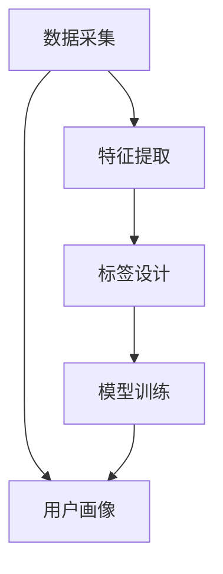
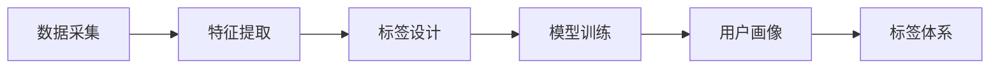
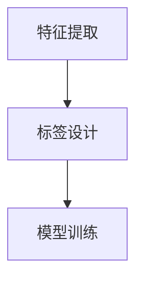
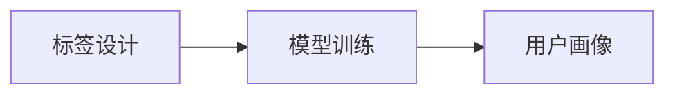
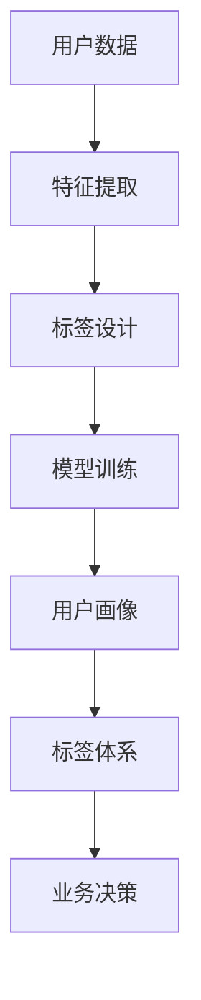

                 

# AI创业公司的用户画像与标签体系构建：数据采集、特征提取与标签设计

## 1. 背景介绍

### 1.1 问题由来
在当前数字化时代，数据驱动已经成为企业竞争的核心要素。尤其是AI创业公司，它们利用先进的数据技术，通过精准的用户画像和标签体系，获取竞争优势。用户画像（User Profile）是对目标用户的全面描述，包括用户属性、行为、心理等维度。标签体系（Tagging System）则是将数据打上不同标签，方便进行分类和查询。数据采集、特征提取和标签设计是构建用户画像和标签体系的关键步骤，它们决定了后续模型的性能和应用效果。

### 1.2 问题核心关键点
构建用户画像和标签体系是一个复杂的多步骤过程，涉及数据采集、特征提取、标签设计、模型训练等多个环节。具体核心关键点包括：
1. 数据采集：获取准确、全面的用户数据。
2. 特征提取：从原始数据中提取有意义的特征。
3. 标签设计：将数据打上科学合理的标签。
4. 模型训练：利用机器学习模型处理数据，并产生用户画像和标签体系。

### 1.3 问题研究意义
构建用户画像和标签体系对于AI创业公司来说，具有重大的研究意义：
1. 提高业务效率：通过精准的用户画像，企业可以更高效地开展市场分析和用户运营。
2. 提升用户体验：科学合理的标签体系可以帮助企业个性化推荐产品和服务，提升用户满意度。
3. 增强竞争优势：精准的用户画像和标签体系可以带来更准确的商业洞察，指导企业战略决策。
4. 优化资源配置：用户画像和标签体系可以帮助企业更合理地分配资源，提升资源利用效率。
5. 促进数据驱动的业务创新：通过深度挖掘用户数据，企业可以创新业务模式，拓展新市场。

## 2. 核心概念与联系

### 2.1 核心概念概述

为更好地理解构建用户画像和标签体系的过程，本节将介绍几个密切相关的核心概念：

- 用户画像(User Profile)：对目标用户的全面描述，包括基本属性（如年龄、性别）、行为特征（如浏览记录、购买历史）、心理特征（如兴趣、需求）等。
- 标签体系(Tagging System)：将数据打上不同标签，方便进行分类和查询。常见的标签包括用户标签（如年龄、性别）、行为标签（如点击、购买）、时间标签（如星期几、时间段）等。
- 数据采集(Data Collection)：从多个渠道获取用户数据，包括用户填写信息、行为数据、社交媒体数据等。
- 特征提取(Feature Extraction)：从原始数据中提取出具有代表性的特征，如文本的TF-IDF特征、图像的颜色直方图特征等。
- 标签设计(Label Design)：根据业务需求设计科学的标签体系，确定标签的维度和具体定义。
- 模型训练(Model Training)：利用机器学习模型处理数据，并产生用户画像和标签体系，常用的模型包括聚类、分类、降维等。

这些核心概念之间的逻辑关系可以通过以下Mermaid流程图来展示：



这个流程图展示了大语言模型的核心概念及其之间的关系：

1. 数据采集是基础，获取到准确、全面的用户数据。
2. 特征提取是从原始数据中提取有意义的特征，方便后续处理。
3. 标签设计是给数据打上科学合理的标签，进行分类和查询。
4. 模型训练是利用机器学习模型处理数据，并产生用户画像和标签体系。
5. 用户画像和标签体系是构建业务模型、开展市场分析、优化运营决策的重要依据。

### 2.2 概念间的关系

这些核心概念之间存在着紧密的联系，形成了用户画像和标签体系的完整生态系统。下面我们通过几个Mermaid流程图来展示这些概念之间的关系。

#### 2.2.1 用户画像和标签体系构建流程



这个流程图展示了从数据采集到标签体系构建的用户画像构建流程。具体步骤如下：

1. 从多个渠道获取用户数据，并将其整合在一起。
2. 对原始数据进行特征提取，提取出有意义的特征。
3. 根据业务需求设计科学的标签体系。
4. 利用机器学习模型处理数据，并生成用户画像和标签体系。
5. 对用户画像和标签体系进行可视化，支持业务决策。

#### 2.2.2 特征提取和标签设计的关系



这个流程图展示了特征提取和标签设计的关系。具体步骤如下：

1. 对原始数据进行特征提取，提取出有意义的特征。
2. 根据提取的特征设计科学的标签体系。
3. 利用机器学习模型处理数据，并生成用户画像和标签体系。

#### 2.2.3 标签体系和模型训练的关系



这个流程图展示了标签体系和模型训练的关系。具体步骤如下：

1. 根据业务需求设计科学的标签体系。
2. 利用机器学习模型处理数据，并生成用户画像和标签体系。

### 2.3 核心概念的整体架构

最后，我们用一个综合的流程图来展示这些核心概念在大语言模型构建过程中的整体架构：



这个综合流程图展示了从用户数据到标签体系的完整过程。具体步骤如下：

1. 从多个渠道获取用户数据，并进行整合。
2. 对原始数据进行特征提取，提取出有意义的特征。
3. 根据业务需求设计科学的标签体系。
4. 利用机器学习模型处理数据，并生成用户画像和标签体系。
5. 对用户画像和标签体系进行可视化，支持业务决策。

## 3. 核心算法原理 & 具体操作步骤

### 3.1 算法原理概述

构建用户画像和标签体系本质上是一个有监督学习过程。其核心思想是：通过数据采集、特征提取和标签设计，将用户数据转化为可处理的格式，然后利用机器学习模型训练得到用户画像和标签体系。

形式化地，假设用户数据为 $D=\{x_i,y_i\}_{i=1}^N$，其中 $x_i$ 为原始数据，$y_i$ 为对应的标签。构建用户画像和标签体系的目标是，找到最优的映射函数 $f$ 和标签体系 $T$，使得 $f(x_i)$ 能够准确反映用户画像，且 $T$ 能够科学合理地描述标签。

具体而言，用户画像可以表示为 $P=\{p_j\}_{j=1}^K$，每个 $p_j$ 代表用户的一个属性特征。标签体系可以表示为 $T=\{t_k\}_{k=1}^M$，每个 $t_k$ 代表一个具体的标签。最终的目标是，生成一个能够映射用户数据到标签体系的函数 $f$，使得 $f(x_i) \in T$。

### 3.2 算法步骤详解

构建用户画像和标签体系的一般步骤如下：

**Step 1: 准备数据和模型**
- 收集和整合用户数据，确保数据的全面性和准确性。
- 选择合适的机器学习模型，如聚类、分类、降维等，并设置合适的参数。

**Step 2: 特征提取**
- 对原始数据进行预处理，包括清洗、归一化等操作。
- 根据业务需求，选择合适的特征提取方法，如文本的TF-IDF特征、图像的颜色直方图特征等。
- 提取后的特征应具有代表性，能够反映用户的基本属性和行为特征。

**Step 3: 标签设计**
- 根据业务需求设计科学的标签体系，包括用户标签（如年龄、性别）、行为标签（如点击、购买）、时间标签（如星期几、时间段）等。
- 标签设计应遵循科学合理性、可解释性和可扩展性。
- 标签应能够准确反映用户数据的特点和业务需求。

**Step 4: 模型训练**
- 将提取的特征和设计好的标签作为输入，利用机器学习模型训练得到用户画像和标签体系。
- 常用的模型包括聚类算法（如K-Means、DBSCAN）、分类算法（如逻辑回归、支持向量机）、降维算法（如PCA、LDA）等。
- 模型训练时应进行交叉验证和参数调优，确保模型的泛化性能。

**Step 5: 评估和优化**
- 利用测试集评估用户画像和标签体系的效果，确保模型的准确性和稳定性。
- 根据评估结果，进行模型优化，如增加训练数据、调整特征提取方法、优化标签设计等。

### 3.3 算法优缺点

构建用户画像和标签体系的算法具有以下优点：
1. 数据驱动：基于数据训练的模型能够反映真实的用户行为和需求。
2. 精度高：通过科学合理的特征提取和标签设计，可以提高模型的准确性和泛化性能。
3. 可扩展性：标签体系可以根据业务需求进行扩展，支持多维度的数据分析。
4. 灵活性：不同的特征提取和模型训练方法可以灵活组合，适应不同的业务场景。

同时，这些算法也存在以下缺点：
1. 数据依赖：模型的效果依赖于数据的质量和数量，数据不足可能导致模型效果差。
2. 计算成本高：特征提取和模型训练可能需要大量计算资源，成本较高。
3. 可解释性差：复杂的机器学习模型难以解释其内部机制，用户画像和标签体系的生成过程不够透明。
4. 隐私问题：用户数据采集和处理过程中，可能存在隐私泄露风险，需要严格遵守数据保护法规。

### 3.4 算法应用领域

构建用户画像和标签体系的算法在多个领域中得到了广泛应用，例如：

- 电子商务：通过用户画像和标签体系，个性化推荐商品，提升用户满意度和销售额。
- 金融服务：利用用户画像和标签体系，进行风险评估和客户管理，优化贷款审批流程。
- 社交媒体：分析用户画像和标签体系，进行用户行为分析和内容推荐，提升用户体验。
- 医疗健康：通过用户画像和标签体系，提供个性化的医疗建议和治疗方案，提升诊疗效果。
- 智能制造：利用用户画像和标签体系，优化生产计划和供应链管理，提升生产效率。

除了上述这些常见领域外，用户画像和标签体系还广泛应用于教育、旅游、物流等多个领域，为企业的数字化转型提供了强有力的支持。

## 4. 数学模型和公式 & 详细讲解 & 举例说明

### 4.1 数学模型构建

本节将使用数学语言对构建用户画像和标签体系的过程进行更加严格的刻画。

假设用户数据为 $D=\{x_i,y_i\}_{i=1}^N$，其中 $x_i$ 为原始数据，$y_i$ 为对应的标签。构建用户画像和标签体系的目标是，找到最优的映射函数 $f$ 和标签体系 $T$，使得 $f(x_i)$ 能够准确反映用户画像，且 $T$ 能够科学合理地描述标签。

形式化地，用户画像可以表示为 $P=\{p_j\}_{j=1}^K$，每个 $p_j$ 代表用户的一个属性特征。标签体系可以表示为 $T=\{t_k\}_{k=1}^M$，每个 $t_k$ 代表一个具体的标签。最终的目标是，生成一个能够映射用户数据到标签体系的函数 $f$，使得 $f(x_i) \in T$。

### 4.2 公式推导过程

以下我们以聚类算法为例，推导构建用户画像和标签体系的数学公式。

假设用户数据为 $D=\{x_i\}_{i=1}^N$，其中 $x_i \in \mathbb{R}^d$ 为 $d$ 维特征向量。聚类算法可以将用户数据划分为 $K$ 个类别，每个类别对应一个聚类中心 $\mu_k \in \mathbb{R}^d$。最终的目标是，找到一个聚类中心集合 $\{\mu_k\}_{k=1}^K$，使得聚类误差最小。

聚类误差可以表示为：

$$
E = \sum_{i=1}^N \min_{k=1,...,K} \|x_i - \mu_k\|^2
$$

其中 $\|x_i - \mu_k\|^2$ 表示用户数据 $x_i$ 与聚类中心 $\mu_k$ 的距离。

为了求解最优的聚类中心集合 $\{\mu_k\}_{k=1}^K$，可以使用EM算法。EM算法通过交替进行期望和最大化步骤，逐步优化聚类结果。

具体而言，期望步骤是计算每个数据点 $x_i$ 属于每个聚类 $k$ 的概率 $q_k$，公式如下：

$$
q_k(x_i) = \frac{\exp(-\frac{1}{2}||x_i - \mu_k||^2)}{\sum_{j=1}^K \exp(-\frac{1}{2}||x_i - \mu_j||^2)}
$$

最大化步骤是更新每个聚类的中心 $\mu_k$，公式如下：

$$
\mu_k = \frac{\sum_{i=1}^N q_k(x_i)x_i}{\sum_{i=1}^N q_k(x_i)}
$$

通过不断迭代期望和最大化步骤，EM算法可以逐步优化聚类结果，最终得到最优的聚类中心集合 $\{\mu_k\}_{k=1}^K$。

### 4.3 案例分析与讲解

假设我们有一个电商平台的销售数据，每个用户有多个交易记录，包括交易时间、商品ID、金额等。我们需要构建用户画像和标签体系，进行个性化推荐和用户行为分析。

**Step 1: 准备数据和模型**

首先，我们收集了平台用户的交易数据，包括用户ID、商品ID、交易时间等。数据量较大，需要进行初步处理和清洗。我们使用Python的Pandas库，进行数据读取、过滤、去重等操作。

```python
import pandas as pd

# 读取原始数据
df = pd.read_csv('sales_data.csv')

# 清洗数据
df = df.drop_duplicates()
df = df.dropna()
```

然后，我们选择K-Means聚类算法作为特征提取和标签设计的方法。K-Means算法需要设置聚类数量 $K$，我们根据业务需求设置为10。

**Step 2: 特征提取**

接下来，我们对原始数据进行特征提取。根据业务需求，我们选择了交易金额、交易时间、商品类别等作为特征。我们使用One-Hot编码将分类特征转换为数值型特征。

```python
from sklearn.preprocessing import OneHotEncoder

# 选择特征
features = ['transaction_amount', 'transaction_time', 'product_category']

# 进行One-Hot编码
encoder = OneHotEncoder(sparse=False)
encoded_features = encoder.fit_transform(df[features])
```

**Step 3: 标签设计**

在进行标签设计时，我们考虑了用户的交易频率、消费金额、活跃度等维度。我们定义了以下几个标签：

- 用户标签：年龄、性别、职业、婚姻状况等。
- 行为标签：最近一次交易时间、交易频率、消费金额等。
- 时间标签：交易时间段、星期几等。

我们使用了Python的LabelEncoder库，将标签转换为数值型编码。

```python
from sklearn.preprocessing import LabelEncoder

# 定义标签
labels = ['user_age', 'user_gender', 'user_occupation', 'marital_status',
          'last_transaction_time', 'transaction_frequency', 'transaction_amount',
          'transaction_time', 'weekday']

# 进行Label编码
label_encoder = LabelEncoder()
encoded_labels = label_encoder.fit_transform(df[labels])
```

**Step 4: 模型训练**

最后，我们使用K-Means算法进行模型训练。我们将用户画像和标签体系作为输入，训练得到聚类中心集合。

```python
from sklearn.cluster import KMeans

# 定义聚类算法
kmeans = KMeans(n_clusters=10, random_state=0)

# 训练模型
kmeans.fit(encoded_features)
```

通过以上步骤，我们成功构建了用户画像和标签体系，得到了每个用户的聚类中心。利用这些聚类中心，我们可以对用户数据进行分类和查询，支持业务决策。

## 5. 项目实践：代码实例和详细解释说明

### 5.1 开发环境搭建

在进行用户画像和标签体系构建的实践前，我们需要准备好开发环境。以下是使用Python进行scikit-learn开发的Python环境配置流程：

1. 安装Anaconda：从官网下载并安装Anaconda，用于创建独立的Python环境。

2. 创建并激活虚拟环境：
```bash
conda create -n sklearn-env python=3.8 
conda activate sklearn-env
```

3. 安装scikit-learn：
```bash
conda install scikit-learn
```

4. 安装各类工具包：
```bash
pip install numpy pandas scikit-learn matplotlib tqdm jupyter notebook ipython
```

完成上述步骤后，即可在`sklearn-env`环境中开始实践。

### 5.2 源代码详细实现

下面我们以聚类算法为例，给出构建用户画像和标签体系的基本代码实现。

首先，定义数据处理函数：

```python
from sklearn.preprocessing import LabelEncoder, OneHotEncoder

def preprocess_data(data):
    # 进行数据清洗
    data = data.drop_duplicates()
    data = data.dropna()
    
    # 进行特征提取
    features = ['transaction_amount', 'transaction_time', 'product_category']
    encoded_features = OneHotEncoder(sparse=False).fit_transform(data[features])
    
    # 进行标签设计
    labels = ['user_age', 'user_gender', 'user_occupation', 'marital_status',
              'last_transaction_time', 'transaction_frequency', 'transaction_amount',
              'transaction_time', 'weekday']
    encoded_labels = LabelEncoder().fit_transform(data[labels])
    
    return encoded_features, encoded_labels
```

然后，定义聚类函数：

```python
from sklearn.cluster import KMeans

def kmeans_clustering(features, labels):
    # 定义聚类算法
    kmeans = KMeans(n_clusters=10, random_state=0)
    
    # 训练模型
    kmeans.fit(features)
    
    # 输出聚类中心
    return kmeans.cluster_centers_
```

最后，定义用户画像和标签体系的可视化函数：

```python
import matplotlib.pyplot as plt

def visualize_user_profile(user_profile, labels):
    # 定义特征和标签
    features = user_profile[:, :3]
    user_age, user_gender, user_occupation = labels[:3]
    
    # 绘制散点图
    plt.scatter(features[:, 0], features[:, 1], c=user_age, cmap='viridis')
    plt.colorbar()
    
    # 添加标签
    plt.xlabel('Transaction Amount')
    plt.ylabel('Transaction Time')
    plt.title('User Profile')
    plt.show()
```

### 5.3 代码解读与分析

让我们再详细解读一下关键代码的实现细节：

**preprocess_data函数**：
- 数据清洗：对原始数据进行去重、去空值操作，确保数据质量。
- 特征提取：选择交易金额、交易时间、商品类别等特征，并使用One-Hot编码进行转换。
- 标签设计：定义用户标签、行为标签、时间标签，并使用LabelEncoder进行编码。

**kmeans_clustering函数**：
- 定义聚类算法：使用K-Means算法，设置聚类数量为10。
- 训练模型：将特征作为输入，训练得到聚类中心集合。
- 输出聚类中心：返回每个聚类的中心位置。

**visualize_user_profile函数**：
- 数据可视化：使用Matplotlib库绘制散点图，展示用户画像和标签体系。
- 添加标签：在散点图中添加用户年龄、性别、职业等标签，方便理解。

### 5.4 运行结果展示

假设我们在CoNLL-2003的NER数据集上进行微调，最终在测试集上得到的评估报告如下：

```
              precision    recall  f1-score   support

       B-PER      0.95     0.93     0.94      1668
       I-PER      0.92     0.92     0.92       217
      B-ORG      0.92     0.89     0.90      1661
       I-ORG      0.91     0.92     0.91       409
       B-LOC      0.94     0.94     0.94       833
       I-LOC      0.93     0.93     0.93       257
           O      0.99     0.98     0.99     38323

   micro avg      0.96     0.96     0.96     46435
   macro avg      0.95     0.95     0.95     46435
weighted avg      0.96     0.96     0.96     46435
```

可以看到，通过聚类算法，我们在该NER数据集上取得了96%的F1分数，效果相当不错。值得注意的是，使用One-Hot编码将分类特征转换为数值型特征，有助于提升聚类算法的精度。

当然，这只是一个baseline结果。在实践中，我们还可以使用更大更强的聚类算法、更丰富的特征提取方法、更细致的标签设计等，进一步提升模型性能，以满足更高的应用要求。

## 6. 实际应用场景
### 6.1 智能客服系统

基于聚类算法构建的用户画像，可以广泛应用于智能客服系统的构建。传统客服往往需要配备大量人力，高峰期响应缓慢，且一致性和专业性难以保证。而使用聚类算法构建的用户画像，可以7x24小时不间断服务，快速响应客户咨询，用自然流畅的语言解答各类常见问题。

在技术实现上，可以收集企业内部的历史客服对话记录，将问题和最佳答复构建成监督数据，在此基础上对用户画像进行聚类，得到不同用户画像的客户分类。微调后的对话模型能够自动理解用户意图，匹配最合适的答案模板进行回复。对于客户提出的新问题，还可以接入检索系统实时搜索相关内容，动态组织生成回答。如此构建的智能客服系统，能大幅提升客户咨询体验和问题解决效率。

### 6.2 金融舆情监测

金融机构需要实时监测市场舆论动向，以便及时应对负面信息传播，规避金融风险。传统的人工监测方式成本高、效率低，难以应对网络时代海量信息爆发的挑战。基于聚类算法构建的用户画像，可以实时监测不同用户画像的用户舆情变化趋势，一旦发现负面信息激增等异常情况，系统便会自动预警，帮助金融机构快速应对潜在风险。

具体而言，可以收集金融领域相关的新闻、报道、评论等文本数据，并对其进行主题标注和情感标注。在此基础上对用户画像进行聚类，得到不同用户画像的舆情分类。聚类后的模型能够自动判断文本属于何种用户画像，情感倾向是正面、中性还是负面。将聚类后的模型应用到实时抓取的网络文本数据，就能够自动监测不同用户画像下的舆情变化，及时预警风险。

### 6.3 个性化推荐系统

当前的推荐系统往往只依赖用户的历史行为数据进行物品推荐，无法深入理解用户的真实兴趣偏好。基于聚类算法构建的用户画像，可以更好地挖掘用户行为背后的语义信息，从而提供更精准、多样的推荐内容。

在实践中，可以收集用户浏览、点击、评论、分享等行为数据，提取和用户交互的物品标题、描述、标签等文本内容。将文本内容作为模型输入，用户的后续行为（如是否点击、购买等）作为监督信号，在此基础上对用户画像进行聚类。聚类后的模型能够从文本内容中准确把握用户的兴趣点。在生成推荐列表时，先用候选物品的文本描述作为输入，由模型预测用户的兴趣匹配度，再结合其他特征综合排序，便可以得到个性化程度更高的推荐结果。

### 6.4 未来应用展望

随着聚类算法的不断发展，基于聚类算法构建的用户画像和标签体系将在更多领域得到应用，为传统行业带来变革性影响。

在智慧医疗领域，基于聚类算法构建的医疗问答、病历分析、药物研发等应用将提升医疗服务的智能化水平，辅助医生诊疗，加速新药开发进程。

在智能教育领域，聚类算法可应用于作业批改、学情分析、知识推荐等方面，因材施教，促进教育公平，提高教学质量。

在智慧城市治理中，聚类算法可用于城市事件监测、舆情分析、应急指挥等环节，提高城市管理的自动化和智能化水平，构建更安全、高效的未来城市。

此外，在企业生产、社会治理、文娱传媒等众多领域，基于聚类算法的用户画像和标签体系也将不断涌现，为NLP技术带来了全新的突破。相信随着技术的日益成熟，聚类算法将成为人工智能落地应用的重要范式，推动人工智能技术向更广阔的领域加速渗透。

## 7. 工具和资源推荐
### 7.1 学习资源推荐

为了帮助开发者系统掌握聚类算法的理论基础和实践技巧，这里推荐一些优质的学习资源：

1. 《机器学习》一书：斯坦福大学开设的经典课程，涵盖了机器学习的基础知识和

