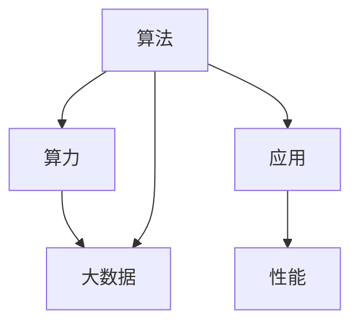

                 

# AI发展的三大支柱：算法、算力与大数据

> 关键词：人工智能,算法,算力,大数据,深度学习

## 1. 背景介绍

在过去的几十年里，人工智能（AI）技术取得了显著进展，其成功依赖于多个关键因素的协同作用。在众多因素中，算法、算力和大数据是最为核心的三大支柱，它们共同构成了现代AI技术的基础。本文将深入探讨这三个支柱的概念、关系及其在AI发展中的重要作用，希望能为读者提供全面的理解。

## 2. 核心概念与联系

### 2.1 核心概念概述

1. **算法**：算法是解决特定问题的步骤和方法，是AI系统的核心。它包括机器学习、深度学习、强化学习等各类算法，这些算法让计算机能够处理、分析和理解数据。

2. **算力**：算力指的是计算机系统处理和运行算法的能力，包括硬件和软件的综合能力。算力的大小直接影响AI系统的性能和效率。

3. **大数据**：大数据是指规模巨大、种类繁多、速度快速的数据集合，是AI训练和优化模型的基础。

### 2.2 核心概念的联系

这三个支柱之间的关系是相辅相成的。算法决定了AI系统的能力，算力提供了计算资源，大数据则提供了学习和优化的材料。一个优秀的AI系统必须在这三个方面都有卓越的表现，才能取得最佳的性能和应用效果。

一个直观的Mermaid流程图可以展示这三者之间的关系：



从图中可以看出，算法、算力和大数据共同推动了AI系统的发展，而最终的目标是提升应用的性能。

## 3. 核心算法原理 & 具体操作步骤

### 3.1 算法原理概述

在AI领域，算法是实现各种任务的基础。以下是一些主要的AI算法及其原理：

- **机器学习**：机器学习通过从数据中学习模式和规律，来训练模型进行预测或分类。常用的算法包括监督学习、非监督学习和强化学习。
- **深度学习**：深度学习是机器学习的一种，通过多层神经网络模拟人脑处理信息的方式，来实现复杂的模式识别和决策。
- **自然语言处理**：自然语言处理（NLP）是让计算机理解和处理人类语言的技术，包括文本分析、语音识别和机器翻译等。
- **计算机视觉**：计算机视觉使计算机能够“看”和理解图像和视频，包括图像分类、目标检测和图像生成等。

### 3.2 算法步骤详解

以深度学习中的卷积神经网络（CNN）为例，简要介绍其算法步骤：

1. **数据准备**：收集和处理训练数据，确保数据集的质量和多样性。
2. **模型构建**：设计并构建卷积神经网络模型，包括卷积层、池化层、全连接层等。
3. **模型训练**：使用训练数据对模型进行训练，调整权重和偏置，最小化损失函数。
4. **模型评估**：使用验证数据集评估模型性能，调整模型超参数。
5. **模型优化**：根据评估结果，优化模型结构，提高模型精度。
6. **模型部署**：将训练好的模型部署到实际应用中，进行实时预测。

### 3.3 算法优缺点

- **算法优点**：
  - **自适应性强**：算法能够自动学习数据中的模式和规律，适用于各种复杂的任务。
  - **处理能力强**：现代算法能够处理大规模的数据集，进行高效的计算和预测。
  - **应用广泛**：算法技术已经广泛应用于各个领域，包括医疗、金融、教育等。

- **算法缺点**：
  - **数据依赖性强**：算法的性能高度依赖于数据的质量和多样性，数据不足时可能导致性能下降。
  - **计算资源消耗大**：复杂算法的计算需求大，需要高性能的硬件支持。
  - **可解释性差**：部分算法（如深度学习）的决策过程难以解释，缺乏透明性。

### 3.4 算法应用领域

算法在各个领域都有广泛的应用：

- **医疗**：通过图像识别、自然语言处理等技术，辅助医生进行疾病诊断和研究。
- **金融**：使用机器学习和深度学习算法进行风险评估、投资策略优化和欺诈检测。
- **教育**：开发智能辅导系统，根据学生的学习情况提供个性化教学方案。
- **交通**：利用计算机视觉和深度学习技术，实现自动驾驶和交通流量预测。
- **娱乐**：在游戏、影视制作中，通过自然语言处理和计算机视觉技术提升用户体验。

## 4. 数学模型和公式 & 详细讲解 & 举例说明

### 4.1 数学模型构建

在AI算法中，数学模型是算法的基础。以下是几个常见的数学模型：

- **线性回归模型**：用于预测连续变量，模型表达式为 $y = w_0 + w_1 x_1 + w_2 x_2 + ... + w_n x_n$。
- **支持向量机（SVM）**：用于分类任务，通过构建最优超平面将数据分隔开。
- **卷积神经网络（CNN）**：用于图像识别，通过卷积层、池化层和全连接层等构建模型。

### 4.2 公式推导过程

以线性回归模型为例，介绍其公式推导过程：

设训练数据集为 $(x_1, y_1), (x_2, y_2), ..., (x_m, y_m)$，其中 $x_i$ 为输入向量，$y_i$ 为输出变量。线性回归模型表达式为：

$$
y = w_0 + w_1 x_1 + w_2 x_2 + ... + w_n x_n
$$

通过最小二乘法，可以求解模型参数 $w_0, w_1, w_2, ..., w_n$：

$$
\min_{w_0, w_1, ..., w_n} \sum_{i=1}^m (y_i - (w_0 + w_1 x_{i1} + w_2 x_{i2} + ... + w_n x_{in}))^2
$$

通过矩阵计算，可以得到：

$$
\hat{w} = (X^T X)^{-1} X^T Y
$$

其中 $X = [x_1, x_2, ..., x_m]$，$Y = [y_1, y_2, ..., y_m]$，$\hat{w}$ 为模型参数的最优解。

### 4.3 案例分析与讲解

以图像分类为例，展示卷积神经网络（CNN）的训练过程：

1. **数据准备**：准备训练集和验证集，包括图像和对应的标签。
2. **模型构建**：使用卷积层和池化层构建卷积神经网络模型。
3. **模型训练**：使用随机梯度下降（SGD）算法，最小化损失函数。
4. **模型评估**：在验证集上评估模型性能，选择合适的超参数。
5. **模型优化**：通过调整学习率、批大小等超参数，优化模型性能。
6. **模型部署**：将训练好的模型部署到实际应用中，进行图像分类。

## 5. 项目实践：代码实例和详细解释说明

### 5.1 开发环境搭建

在Python中使用TensorFlow进行项目开发，需要安装TensorFlow和相关的依赖包：

```bash
pip install tensorflow
```

### 5.2 源代码详细实现

以下是一个简单的卷积神经网络（CNN）的实现，用于图像分类：

```python
import tensorflow as tf

# 构建卷积神经网络
model = tf.keras.Sequential([
    tf.keras.layers.Conv2D(32, (3, 3), activation='relu', input_shape=(28, 28, 1)),
    tf.keras.layers.MaxPooling2D((2, 2)),
    tf.keras.layers.Flatten(),
    tf.keras.layers.Dense(10, activation='softmax')
])

# 编译模型
model.compile(optimizer='adam',
              loss='sparse_categorical_crossentropy',
              metrics=['accuracy'])

# 训练模型
model.fit(x_train, y_train, epochs=10, validation_data=(x_test, y_test))
```

### 5.3 代码解读与分析

上述代码中，首先构建了一个包含卷积层、池化层和全连接层的卷积神经网络。然后使用 `compile` 函数编译模型，设置优化器、损失函数和评估指标。最后使用 `fit` 函数训练模型，并在验证集上评估性能。

### 5.4 运行结果展示

训练完成后，可以通过以下代码进行模型评估：

```python
test_loss, test_acc = model.evaluate(x_test, y_test)
print('Test accuracy:', test_acc)
```

## 6. 实际应用场景

### 6.1 医疗影像分析

在医疗领域，算法、算力和大数据可以用于影像分析和疾病预测：

- **算法**：使用卷积神经网络（CNN）进行图像分类，识别出肿瘤、病变等异常影像。
- **算力**：高性能GPU加速训练过程，提高图像处理速度。
- **大数据**：利用大量的医学影像数据，进行模型训练和优化。

### 6.2 金融风险预测

在金融领域，算法、算力和大数据可以用于风险评估和投资策略优化：

- **算法**：使用机器学习算法（如决策树、随机森林）进行风险预测和信用评估。
- **算力**：高性能计算机和服务器提供计算资源，进行复杂的模型训练和预测。
- **大数据**：利用金融市场数据、交易数据等，训练和优化模型。

### 6.3 智能推荐系统

在电商和社交网络中，算法、算力和大数据可以用于智能推荐：

- **算法**：使用协同过滤算法和深度学习算法进行个性化推荐。
- **算力**：高性能服务器和分布式计算提供计算资源，处理大规模数据集。
- **大数据**：利用用户行为数据、商品信息等，训练和优化推荐模型。

### 6.4 未来应用展望

未来，算法、算力和大数据将继续推动AI技术的发展：

1. **自适应算法**：开发更加智能的算法，能够根据数据变化自动调整模型参数，适应新的应用场景。
2. **量子计算**：利用量子计算技术，提高算力，加速复杂算法的计算过程。
3. **联邦学习**：在保护数据隐私的前提下，利用大数据进行分布式训练，优化模型性能。

## 7. 工具和资源推荐

### 7.1 学习资源推荐

1. **《深度学习》课程**：斯坦福大学的吴恩达教授开设的深度学习课程，涵盖了深度学习的基础知识和高级应用。
2. **《机器学习实战》书籍**：一本适合初学者的机器学习入门书籍，包含丰富的代码实例和案例分析。
3. **Kaggle竞赛平台**：一个数据科学竞赛平台，可以参与各种数据科学竞赛，锻炼实战能力。
4. **GitHub开源项目**：GitHub上有许多优秀的AI开源项目，可以学习和参考。

### 7.2 开发工具推荐

1. **Jupyter Notebook**：一个基于Web的交互式编程环境，适合数据科学和机器学习开发。
2. **TensorFlow**：谷歌开源的深度学习框架，支持分布式计算和GPU加速。
3. **PyTorch**：Facebook开源的深度学习框架，易于使用，支持动态计算图。
4. **OpenCV**：一个计算机视觉库，提供了丰富的图像处理和分析工具。

### 7.3 相关论文推荐

1. **《ImageNet Classification with Deep Convolutional Neural Networks》**：Hinton等人的经典论文，介绍了卷积神经网络（CNN）在图像分类中的应用。
2. **《Deep Learning》**：Goodfellow等人的书籍，详细介绍了深度学习的基础知识和最新进展。
3. **《Scalable Machine Learning》**：Hastie等人的书籍，介绍了大规模机器学习算法的优化方法。

## 8. 总结：未来发展趋势与挑战

### 8.1 研究成果总结

算法、算力和大数据是AI技术发展的三大支柱，它们共同推动了AI技术的进步。算法决定了AI系统的能力和应用范围，算力提供了计算资源，大数据提供了学习和优化的数据基础。

### 8.2 未来发展趋势

未来，算法、算力和大数据将继续推动AI技术的发展：

1. **自适应算法**：开发更加智能的算法，能够根据数据变化自动调整模型参数，适应新的应用场景。
2. **量子计算**：利用量子计算技术，提高算力，加速复杂算法的计算过程。
3. **联邦学习**：在保护数据隐私的前提下，利用大数据进行分布式训练，优化模型性能。

### 8.3 面临的挑战

虽然算法、算力和大数据为AI技术的发展提供了坚实的基础，但在实际应用中也面临诸多挑战：

1. **数据隐私和安全**：如何保护数据隐私，防止数据泄露和滥用。
2. **模型可解释性**：算法的决策过程难以解释，缺乏透明性。
3. **算力成本**：高性能计算资源成本高昂，如何降低算力成本。
4. **算法鲁棒性**：算法对数据分布的鲁棒性不足，容易受到数据噪声的影响。

### 8.4 研究展望

未来，在算法、算力和大数据的协同发展下，AI技术将取得更多突破：

1. **跨领域融合**：将AI技术与更多领域结合，如医疗、金融、教育等，推动跨学科创新。
2. **人工智能伦理**：探讨AI技术的伦理和道德问题，确保技术的安全和公正。
3. **智能人机协作**：开发智能人机协作系统，提升人类与机器的协作效率。

## 9. 附录：常见问题与解答

**Q1：算法、算力和大数据之间的关系是什么？**

A: 算法、算力和大数据是AI技术发展的三大支柱，它们共同构成了现代AI技术的基础。算法决定了AI系统的能力，算力提供了计算资源，大数据提供了学习和优化的数据基础。一个优秀的AI系统必须在这三个方面都有卓越的表现，才能取得最佳的性能和应用效果。

**Q2：如何在保证数据隐私的前提下进行机器学习训练？**

A: 利用联邦学习技术，可以在保护数据隐私的前提下进行分布式机器学习训练。联邦学习将数据分散在多个客户端进行本地训练，然后将模型参数进行聚合，更新全局模型。这样可以避免数据泄露，同时充分利用分布式计算资源。

**Q3：AI算法的鲁棒性如何提升？**

A: 提升AI算法的鲁棒性，需要从多个方面进行优化：
1. 数据增强：通过扩充训练数据，增强模型的泛化能力。
2. 正则化：使用L2正则、Dropout等技术，防止模型过拟合。
3. 对抗训练：加入对抗样本，提高模型的鲁棒性。
4. 迁移学习：利用预训练模型，在少量标注数据上进行微调，提高模型的泛化能力。

**Q4：如何提高AI算法的可解释性？**

A: 提高AI算法的可解释性，可以从以下几个方面进行：
1. 模型简化：尽量使用简单的模型结构，避免过于复杂的深度学习算法。
2. 可视化技术：使用可视化工具，如梯度热力图、特征重要性图等，展示模型的决策过程。
3. 解释性算法：使用可解释性算法，如决策树、线性回归等，提供更加透明和可解释的决策逻辑。

**Q5：如何降低AI算法的计算成本？**

A: 降低AI算法的计算成本，可以从以下几个方面进行：
1. 模型压缩：使用模型压缩技术，减小模型大小，提高推理速度。
2. 量化加速：将浮点模型转为定点模型，压缩存储空间，提高计算效率。
3. 分布式计算：利用分布式计算技术，将计算任务分散到多个节点上进行并行计算，提高计算效率。

---

作者：禅与计算机程序设计艺术 / Zen and the Art of Computer Programming

