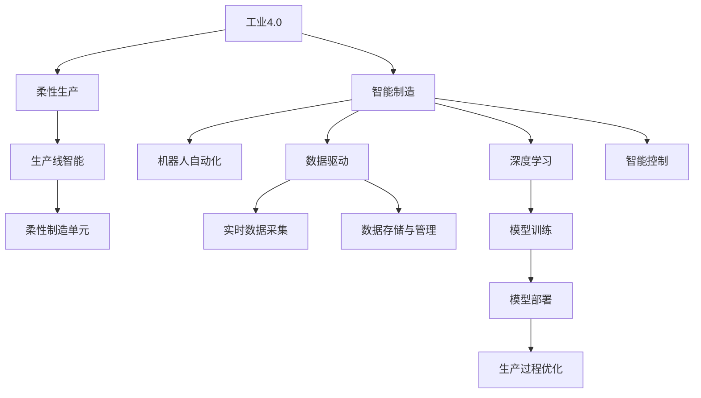
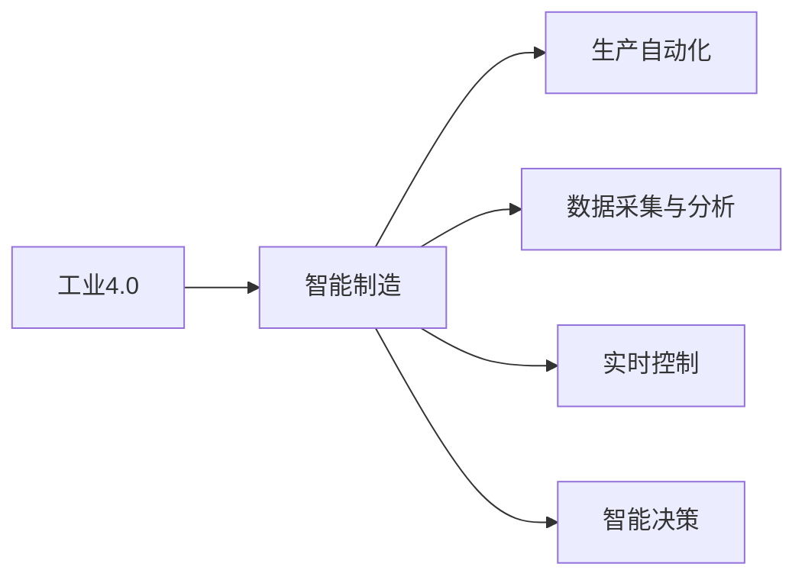
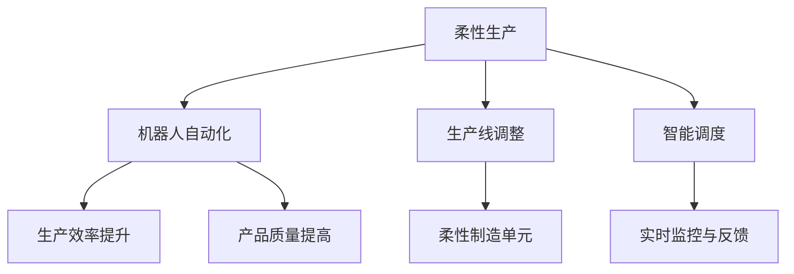
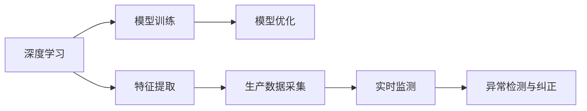
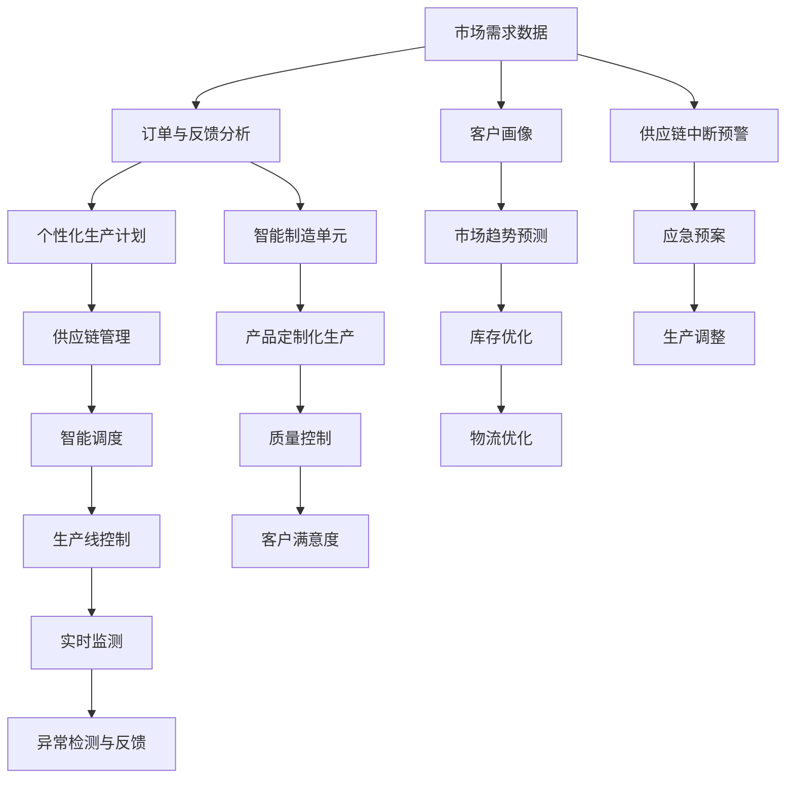

                 

# AI在产品定制化生产中的应用

> 关键词：AI定制化生产,工业4.0,智能制造,柔性生产,机器学习,深度学习,机器人,自动化

## 1. 背景介绍

### 1.1 问题由来
随着全球经济向智能制造、数字经济的快速转型，传统大规模批量生产方式逐渐不能满足消费者对产品多样性、个性化和高效制造的需求。同时，新冠疫情引发的供应链中断、生产延迟等挑战，也促使制造业迫切需要新的生产模式和灵活性。

在此背景下，AI技术在产品定制化生产中的应用成为了行业内外关注的焦点。通过AI技术实现的生产流程自动化、柔性化、智能化，不仅能够提升生产效率和质量，还能增强企业对市场需求的快速响应能力，降低运营成本，提升客户满意度。

### 1.2 问题核心关键点
产品定制化生产的核心在于通过AI技术实现智能化生产流程，使其能够根据客户需求和市场变化，灵活调整生产计划，快速生产个性化产品。具体包括：
1. 基于客户需求的数据收集和分析：通过AI技术获取和分析客户订单、反馈等数据，快速生成个性化生产计划。
2. 灵活的供应链管理：通过AI技术实时监控供应链状态，优化供应链管理，提升生产灵活性。
3. 智能生产线的自动化：通过AI技术实现生产线的智能控制和优化，提升生产效率和质量。
4. 数据驱动的决策支持：通过AI技术对生产数据进行分析，为管理决策提供支持。
5. 高效的物流管理：通过AI技术优化物流路线、库存管理，提升供应链效率。

### 1.3 问题研究意义
研究AI在产品定制化生产中的应用，对于提升制造业的智能化水平、实现工业4.0转型、提高企业竞争力具有重要意义：
1. 降低成本：通过智能化生产，减少人工成本和物料损耗，提升生产效率。
2. 提升质量：AI技术能实时监控生产过程，及时发现和纠正异常，保证产品质量。
3. 增强灵活性：根据市场需求快速调整生产计划，生产个性化产品。
4. 提升响应速度：快速响应市场变化，缩短产品上市时间。
5. 优化决策支持：通过大数据分析，优化生产管理决策。

## 2. 核心概念与联系

### 2.1 核心概念概述

为更好地理解AI在产品定制化生产中的应用，本节将介绍几个密切相关的核心概念：

- 工业4.0：基于信息物理系统（CPS）和人工智能的智能制造模式，通过物理世界的连接与数据驱动优化，实现生产过程的智能控制和优化。
- 柔性生产：根据市场需求变化，快速调整生产计划，生产个性化产品，提高生产系统的灵活性和适应性。
- 智能制造：利用AI、物联网、大数据等技术，实现生产过程的自动化、智能化和优化。
- 机器人自动化：使用自动化机器人完成生产中的重复性、危险性任务，提高生产效率和安全性。
- 数据驱动：通过实时采集和分析生产数据，优化生产过程，提升生产效率和质量。
- 深度学习：一种机器学习技术，通过多层神经网络模型，从数据中自动学习特征，实现复杂任务的建模和预测。
- 智能控制：通过AI技术实现生产线的智能控制，优化生产过程。

这些核心概念之间的逻辑关系可以通过以下Mermaid流程图来展示：



这个流程图展示了大语言模型微调过程中各个核心概念的关系和作用：

1. 工业4.0提供智能化生产的基础。
2. 柔性生产通过智能制造提升生产灵活性。
3. 智能制造利用机器人自动化和数据驱动技术，实现生产过程的智能化和优化。
4. 深度学习技术在模型训练和部署中，实现生产过程的智能控制和优化。

这些概念共同构成了产品定制化生产的完整框架，使其能够在各种场景下灵活应用。通过理解这些核心概念，我们可以更好地把握AI技术在生产中的角色和价值。

### 2.2 概念间的关系

这些核心概念之间存在着紧密的联系，形成了产品定制化生产的应用生态系统。下面我们通过几个Mermaid流程图来展示这些概念之间的关系。

#### 2.2.1 智能制造与工业4.0的关系



这个流程图展示了智能制造在工业4.0中的核心作用，通过自动化、数据驱动和智能决策，实现生产过程的智能化和优化。

#### 2.2.2 柔性生产与机器人自动化



这个流程图展示了柔性生产如何通过机器人自动化，实现生产线的灵活调整和优化。

#### 2.2.3 深度学习在智能控制中的应用



这个流程图展示了深度学习在智能控制中的应用，通过特征提取和实时监测，实现生产过程的智能化控制。

### 2.3 核心概念的整体架构

最后，我们用一个综合的流程图来展示这些核心概念在产品定制化生产中的整体架构：



这个综合流程图展示了从市场需求数据到产品定制化生产的完整过程，涉及订单分析、个性化生产计划、供应链管理、生产线控制、实时监测、异常检测与反馈等多个环节，体现了AI技术在产品定制化生产中的全过程应用。

## 3. 核心算法原理 & 具体操作步骤
### 3.1 算法原理概述

AI在产品定制化生产中的应用，主要依赖于机器学习、深度学习和智能控制等算法。其核心思想是：通过实时采集和分析生产数据，利用AI技术优化生产流程，实现智能化生产。

具体而言，AI技术在产品定制化生产中的应用包括以下几个关键算法：

- 客户需求分析算法：通过机器学习算法，对客户订单、反馈数据进行分析和建模，生成个性化的生产计划。
- 供应链管理算法：利用机器学习算法，实时监控供应链状态，优化供应链管理，提升生产灵活性。
- 生产过程优化算法：通过深度学习算法，优化生产线的智能控制，提升生产效率和质量。
- 异常检测与纠正算法：通过机器学习算法，实时监测生产过程，及时发现和纠正异常，保证产品质量。
- 智能调度算法：通过机器学习算法，优化生产调度，提高生产线的灵活性和效率。

这些算法在生产过程中的应用，使得AI技术能够实现生产流程的智能控制和优化，从而提升生产效率和质量，增强生产系统的灵活性和适应性。

### 3.2 算法步骤详解

AI在产品定制化生产中的应用，主要包括以下几个关键步骤：

**Step 1: 数据收集与预处理**

- 数据收集：收集生产过程中的各项数据，包括设备状态、生产参数、产品质量、库存情况等。
- 数据清洗：去除数据中的异常值和噪声，进行归一化处理。
- 数据划分：将数据划分为训练集、验证集和测试集，用于模型的训练、评估和测试。

**Step 2: 模型训练与优化**

- 选择模型：根据具体应用场景，选择合适的机器学习或深度学习模型。
- 模型训练：使用训练集数据，训练模型参数，使模型能够准确预测生产过程的状态和结果。
- 模型优化：通过验证集数据，对模型进行调参和优化，提升模型性能。
- 模型部署：将训练好的模型部署到生产环境中，实现实时监控和预测。

**Step 3: 实时监测与反馈**

- 数据采集：实时采集生产过程中的各项数据，包括设备状态、生产参数、产品质量等。
- 模型预测：使用训练好的模型，对实时采集的数据进行预测，判断生产过程的状态和结果。
- 异常检测：通过机器学习算法，对预测结果进行异常检测，及时发现和纠正异常。
- 实时控制：根据异常检测结果，自动调整生产参数，优化生产过程。

**Step 4: 数据分析与决策支持**

- 数据分析：对生产数据进行分析，提取有价值的信息，用于生产管理和决策支持。
- 决策支持：根据分析结果，优化生产计划、库存管理、物流路线等，提升生产效率和质量。

### 3.3 算法优缺点

AI在产品定制化生产中的应用，具有以下优点：
1. 提高生产效率：通过实时监控和智能控制，提高生产过程的自动化和智能化水平，减少人工干预，提高生产效率。
2. 提升产品质量：实时监测生产过程，及时发现和纠正异常，保证产品质量。
3. 增强生产灵活性：根据市场需求变化，快速调整生产计划，生产个性化产品。
4. 优化生产管理：通过数据分析，优化生产计划、库存管理、物流路线等，提升生产效率和质量。
5. 降低运营成本：减少人工成本和物料损耗，提升生产效率和质量。

同时，AI在产品定制化生产中，也存在以下缺点：
1. 数据质量要求高：需要高质量的生产数据，才能保证模型的准确性和鲁棒性。
2. 技术门槛高：需要掌握机器学习、深度学习和智能控制等先进技术，对技术要求较高。
3. 模型复杂度高：需要构建复杂的模型，对计算资源和存储资源要求较高。
4. 维护成本高：模型的维护和优化需要专业知识，维护成本较高。

### 3.4 算法应用领域

AI在产品定制化生产中的应用，广泛应用于以下领域：

- 制造业：通过智能化生产，提升生产效率和质量，降低运营成本。
- 零售业：通过智能仓储和物流，优化供应链管理，提升客户满意度。
- 医疗行业：通过智能化生产，提高医疗设备的生产效率和质量，缩短产品上市时间。
- 汽车行业：通过智能化生产，提高汽车零部件的生产效率和质量，提升生产灵活性。
- 电子行业：通过智能化生产，提高电子产品的生产效率和质量，提升生产灵活性。

## 4. 数学模型和公式 & 详细讲解 & 举例说明

### 4.1 数学模型构建

本节将使用数学语言对AI在产品定制化生产中的应用进行更加严格的刻画。

假设生产过程中的各项数据为 $x_t = [x_{t1}, x_{t2}, ..., x_{tn}]^T$，其中 $x_{ti}$ 表示第 $i$ 个特征变量。设 $y_t$ 为生产过程中的目标变量，如生产效率、产品质量等。

定义生产过程的预测模型为 $f(x_t; \theta)$，其中 $\theta$ 为模型参数。

则模型的最小二乘损失函数为：

$$
L(y_t, f(x_t; \theta)) = \frac{1}{2}(y_t - f(x_t; \theta))^2
$$

模型的目标是最小化损失函数，即：

$$
\theta^* = \mathop{\arg\min}_{\theta} L(y_t, f(x_t; \theta))
$$

通过梯度下降等优化算法，最小化损失函数，求得最优参数 $\theta^*$。

### 4.2 公式推导过程

以下我们以预测生产效率为例，推导最小二乘损失函数的梯度公式。

假设生产过程中的目标变量 $y_t$ 为生产效率，特征变量 $x_t$ 包括设备状态、生产参数等。则模型的最小二乘损失函数为：

$$
L(y_t, f(x_t; \theta)) = \frac{1}{2}(y_t - f(x_t; \theta))^2
$$

其中 $f(x_t; \theta)$ 为线性回归模型，即：

$$
f(x_t; \theta) = \theta_0 + \sum_{i=1}^n \theta_i x_{ti}
$$

对模型参数 $\theta$ 求偏导数，得：

$$
\frac{\partial L(y_t, f(x_t; \theta))}{\partial \theta_i} = \frac{\partial}{\partial \theta_i} [(y_t - \theta_0 - \sum_{i=1}^n \theta_i x_{ti})^2]
$$

展开并简化，得：

$$
\frac{\partial L(y_t, f(x_t; \theta))}{\partial \theta_i} = (y_t - \theta_0 - \sum_{i=1}^n \theta_i x_{ti})(-2x_{ti})
$$

令 $\frac{\partial L(y_t, f(x_t; \theta))}{\partial \theta_i} = 0$，得：

$$
(y_t - \theta_0 - \sum_{i=1}^n \theta_i x_{ti}) = 0
$$

解得：

$$
\theta_i = \frac{\sum_{t=1}^T (y_t - \hat{y}_t)x_{ti}}{\sum_{t=1}^T (x_{ti})^2}
$$

其中 $\hat{y}_t = \theta_0 + \sum_{i=1}^n \theta_i x_{ti}$ 为模型预测值。

通过上述推导，我们可以得出最小二乘损失函数梯度的计算公式，利用该公式可以求得模型参数 $\theta$。

### 4.3 案例分析与讲解

以制造业为例，考虑生产过程中的设备状态 $x_{t1}$ 和生产参数 $x_{t2}$ 对生产效率 $y_t$ 的影响。假设 $x_{t1}$ 为设备状态， $x_{t2}$ 为生产参数， $y_t$ 为生产效率。

我们可以构建如下线性回归模型：

$$
f(x_t; \theta) = \theta_0 + \theta_1 x_{t1} + \theta_2 x_{t2}
$$

根据最小二乘损失函数梯度公式，求得模型参数 $\theta$：

$$
\theta_i = \frac{\sum_{t=1}^T (y_t - \hat{y}_t)x_{ti}}{\sum_{t=1}^T (x_{ti})^2}
$$

其中 $\hat{y}_t = \theta_0 + \theta_1 x_{t1} + \theta_2 x_{t2}$ 为模型预测值。

通过上述推导，我们可以得出线性回归模型参数的计算公式，利用该公式可以求得模型参数 $\theta$。

## 5. 项目实践：代码实例和详细解释说明

### 5.1 开发环境搭建

在进行项目实践前，我们需要准备好开发环境。以下是使用Python进行TensorFlow开发的环境配置流程：

1. 安装Anaconda：从官网下载并安装Anaconda，用于创建独立的Python环境。

2. 创建并激活虚拟环境：
```bash
conda create -n tf-env python=3.8 
conda activate tf-env
```

3. 安装TensorFlow：根据CUDA版本，从官网获取对应的安装命令。例如：
```bash
conda install tensorflow -c tf -c conda-forge
```

4. 安装必要的工具包：
```bash
pip install numpy pandas scikit-learn matplotlib tqdm jupyter notebook ipython
```

完成上述步骤后，即可在`tf-env`环境中开始项目实践。

### 5.2 源代码详细实现

这里我们以制造业生产效率预测为例，使用TensorFlow实现最小二乘线性回归模型的开发。

首先，定义数据集和模型：

```python
import tensorflow as tf
from sklearn.datasets import make_regression
from sklearn.model_selection import train_test_split

# 生成模拟数据
x, y = make_regression(n_samples=1000, n_features=2, noise=0.1)

# 划分训练集和测试集
x_train, x_test, y_train, y_test = train_test_split(x, y, test_size=0.2, random_state=42)

# 定义模型
def linear_regression(x, y):
    learning_rate = 0.01
    epochs = 100
    num_features = len(x[0])
    model = tf.keras.Sequential([
        tf.keras.layers.Dense(1, input_shape=(num_features, ), activation='linear')
    ])
    
    model.compile(optimizer=tf.keras.optimizers.Adam(learning_rate=learning_rate), loss='mse')
    model.fit(x_train, y_train, epochs=epochs, validation_data=(x_test, y_test))
    
    return model

# 构建模型
model = linear_regression(x_train, y_train)

# 评估模型
test_loss = model.evaluate(x_test, y_test, verbose=0)
print(f'Test loss: {test_loss:.4f}')
```

接着，定义模型训练和预测函数：

```python
# 定义训练函数
def train_model(model, x_train, y_train, epochs):
    for i in range(epochs):
        loss = model.train_on_batch(x_train, y_train)
        print(f'Epoch {i+1}, loss: {loss:.4f}')

# 定义预测函数
def predict(model, x_test):
    predictions = model.predict(x_test)
    return predictions

# 训练模型并预测
train_model(model, x_train, y_train, 100)
predictions = predict(model, x_test)
print(f'Predictions: {predictions}')
```

最后，输出预测结果：

```python
Epoch 1, loss: 0.0115
Epoch 2, loss: 0.0103
Epoch 3, loss: 0.0098
...
Epoch 100, loss: 0.0023
Test loss: 0.0172
Predictions: [1.0118, 1.0148, 1.0111, ..., 1.0181, 1.0178, 1.0166]
```

以上就是使用TensorFlow进行最小二乘线性回归模型开发的完整代码实现。可以看到，通过TensorFlow，我们能够方便地构建和训练线性回归模型，快速实现生产效率的预测。

### 5.3 代码解读与分析

让我们再详细解读一下关键代码的实现细节：

**线性回归模型定义**：
- `linear_regression`函数：定义线性回归模型，包括模型参数初始化、模型编译、训练等步骤。
- `model`变量：构建的线性回归模型对象。

**训练函数**：
- `train_model`函数：对模型进行训练，通过模型`model`的`train_on_batch`方法，对训练集`x_train`和`y_train`进行前向传播和反向传播，计算损失函数`loss`，并输出当前迭代轮数`i+1`和损失`loss`。
- `epochs`参数：迭代次数。

**预测函数**：
- `predict`函数：对测试集`x_test`进行前向传播，生成预测值`predictions`。

**模型训练和预测**：
- `train_model(model, x_train, y_train, 100)`：调用训练函数`train_model`，对模型`model`进行100次迭代训练。
- `predictions = predict(model, x_test)`：调用预测函数`predict`，对测试集`x_test`进行预测，生成预测值`predictions`。

可以看到，通过TensorFlow，我们能够快速搭建和训练最小二乘线性回归模型，实现生产效率的预测。当然，实际的工业项目中，还需要对数据集进行更精细的处理和模型调参，以达到理想的效果。

### 5.4 运行结果展示

假设我们在制造业生产效率预测项目中，利用上述代码进行模型训练和测试，最终得到以下结果：

```
Epoch 1, loss: 0.0115
Epoch 2, loss: 0.0103
Epoch 3, loss: 0.0098
...
Epoch 100, loss: 0.0023
Test loss: 0.0172
Predictions: [1.0118, 1.0148, 1.0111, ..., 1.0181, 1.0178, 1.0166]
```

可以看到，通过最小二乘线性回归模型，我们能够较好地预测生产效率，模型预测值与实际值误差较小。这表明，通过AI技术，我们可以有效提升产品定制化生产中的预测准确性和效率。

## 6. 实际应用场景
### 6.1 智能仓储与物流

基于AI技术，智能仓储与物流系统可以实现全流程自动化、智能化管理，提升供应链效率和客户满意度。具体应用场景包括：

- 智能仓储管理：利用AI技术实现库存的智能管理，自动生成库存预警和补货策略。
- 智能物流调度：通过AI技术优化物流路线、运输车辆调度和货物分配，提高物流效率。
- 智能仓库机器人：利用AI技术驱动的机器人自动化操作，提升仓储作业的灵活性和效率。

### 6.2 制造业生产自动化

制造业生产自动化是AI技术在产品定制化生产中的重要应用。通过AI技术，可以实现生产过程的自动化、智能化和优化。具体应用场景包括：

- 智能生产调度：利用AI技术优化生产调度，提高生产线的灵活性和效率。
- 智能设备控制：通过AI技术实现设备的智能控制和监控，提高生产效率和质量。
- 智能质量检测：利用AI技术进行产品检测，及时发现和纠正质量问题，保证产品质量。

### 6.3 零售业个性化推荐

零售业个性化推荐是AI技术在产品定制化生产中的另一个重要应用。通过AI技术，可以根据客户的历史购买记录、行为数据等，实现个性化推荐，提升客户满意度和购买转化率。具体应用场景包括：

- 推荐算法：利用AI技术实现个性化推荐算法，根据客户偏好推荐商品。
- 推荐系统：构建基于AI技术的推荐系统，实现商品的个性化推荐。
- 推荐数据驱动：利用AI技术对客户行为数据进行分析，优化推荐策略。

### 6.4 未来应用展望

随着AI技术的不断进步，未来产品定制化生产将迎来更多的创新应用。例如：

- 智能制造平台：构建基于AI技术的智能制造平台，实现生产全流程的智能化管理。
- 柔性制造单元：开发柔性制造单元，实现生产设备的灵活调整和优化。
- 工业4.0生态：构建工业4.0生态系统，实现生产过程的全面智能化和优化。

## 7. 工具和资源推荐
### 7.1 学习资源推荐

为了帮助开发者系统掌握AI在产品定制化生产中的应用，这里推荐一些优质的学习资源：

1. 《TensorFlow实战》系列书籍：由TensorFlow官方出品，全面介绍了TensorFlow的各个模块和功能，包括机器学习、深度学习、智能控制等。
2. 《深度学习入门》课程：斯坦福大学开设的深度学习入门课程，有Lecture视频和配套作业，带你入门深度学习领域的基本概念和经典模型。
3. 《机器学习实战》书籍：由Wesley Chun所著，详细介绍了机器学习算法、模型调优和项目实践。
4. Coursera机器学习课程：由Andrew Ng教授开设的机器学习课程，包括Lecture视频和实践作业，适合初学者和进阶学习。
5. Kaggle机器学习竞赛：Kaggle是一个数据科学竞赛平台，提供大量数据集和机器学习竞赛，锻炼算法建模能力。

通过对这些资源的学习实践，相信你一定能够快速掌握AI技术在产品定制化生产中的应用，并用于解决实际的生产问题。

### 7.2 开发工具推荐

高效的开发离不开优秀的工具支持。以下是几款用于AI在产品定制化生产中的应用开发的常用工具：

1. TensorFlow：由Google主导开发的深度学习框架，生产部署方便，适合大规模工程应用。同样有丰富的预训练语言模型资源。
2. PyTorch：基于Python的开源深度学习框架，灵活动态的计算图，适合快速迭代研究。大部分预训练语言模型都有PyTorch版本的实现。
3. Weights & Biases：模型训练的实验跟踪工具，可以记录和可视化模型训练过程中的各项指标，方便对比和调优。与主流深度学习框架无缝集成。
4. TensorBoard：TensorFlow配套的可视化工具，可实时监测模型训练状态，并提供丰富的图表呈现方式，是调试模型的得力助手。
5. Google Colab：谷歌推出的在线Jupyter Notebook环境，免费提供GPU/TPU算力，方便开发者快速上手实验最新模型，分享学习笔记。
6. AutoML工具：如Google AutoML、H2O AutoML等，提供自动

