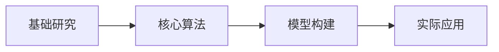

                 

# AI底层创新体系的整体构建

## 1. 背景介绍

在人工智能(AI)的快速发展过程中，构建一个底层创新体系成为推动AI技术突破的重要手段。这一体系涵盖了从基础研究、核心算法、模型构建到实际应用的全过程，各个环节相互作用，共同驱动AI技术的迭代与进步。本文将从核心概念、算法原理、应用场景等角度，全面解析AI底层创新体系的构建过程，探讨其发展方向与挑战。

## 2. 核心概念与联系

### 2.1 核心概念概述

AI底层创新体系包括以下几个核心概念：

- **基础研究**：包括深度学习、强化学习、自然语言处理等领域的理论研究和前沿探索，为AI技术提供理论支撑。
- **核心算法**：指构成AI技术的核心，如卷积神经网络(CNN)、循环神经网络(RNN)、Transformer等，是实现特定任务的基础。
- **模型构建**：结合基础研究与核心算法，构建能够解决实际问题的AI模型。
- **实际应用**：将构建的模型应用于实际问题中，实现智能决策、自动化操作等功能。

这些概念之间相互联系，共同构成了AI底层创新体系的全貌。

### 2.2 核心概念原理和架构的 Mermaid 流程图



这个流程图展示了AI底层创新体系中各环节之间的联系。基础研究提供理论指导，核心算法实现技术突破，模型构建提供解决方案，实际应用验证模型效果。

## 3. 核心算法原理 & 具体操作步骤
### 3.1 算法原理概述

AI算法原理包括但不限于深度学习、强化学习、迁移学习等。深度学习是最为广泛应用的AI算法，通过构建多层神经网络，模拟人类大脑的神经元结构，实现对复杂数据的学习和分析。强化学习则通过智能体在环境中与环境的交互，学习最优策略以最大化某种奖励。迁移学习通过已有知识在新任务上的迁移，提升模型在新环境下的表现。

### 3.2 算法步骤详解

以深度学习中的卷积神经网络(CNN)为例，其操作步骤如下：

1. **数据准备**：收集并处理数据集，准备用于训练和测试的样本。
2. **模型构建**：设计卷积层、池化层、全连接层等网络结构。
3. **参数初始化**：对模型参数进行随机初始化，设置学习率、批大小等超参数。
4. **前向传播**：输入数据通过网络结构，计算输出。
5. **损失计算**：计算输出与真实标签之间的差距，得到损失函数。
6. **反向传播**：通过链式法则计算损失函数对参数的梯度。
7. **参数更新**：使用梯度下降等优化算法，更新模型参数。
8. **评估验证**：在验证集上评估模型性能，防止过拟合。
9. **测试应用**：在测试集上测试模型效果，应用于实际问题。

### 3.3 算法优缺点

深度学习的优点包括：

- **高精度**：在图像识别、语音识别等领域取得令人瞩目的成果。
- **自适应**：能够自动学习数据的特征表示，处理复杂非线性关系。
- **广泛应用**：广泛应用于图像处理、自然语言处理、机器人控制等众多领域。

深度学习的缺点包括：

- **数据依赖**：需要大量标注数据进行训练。
- **计算资源消耗大**：需要高性能的GPU/TPU等硬件设备。
- **可解释性差**：难以解释模型内部的决策过程。

### 3.4 算法应用领域

深度学习在计算机视觉、自然语言处理、语音识别、推荐系统等领域得到广泛应用。例如，卷积神经网络在图像识别、医学影像分析等任务上表现出色；循环神经网络在文本生成、语音识别等任务上取得突破；Transformer在机器翻译、文本摘要等任务上刷新了SOTA。

## 4. 数学模型和公式 & 详细讲解 & 举例说明

### 4.1 数学模型构建

以卷积神经网络为例，其数学模型可以表示为：

$$
h^{(l+1)} = \sigma(W^{(l+1)}h^{(l)} + b^{(l+1)})
$$

其中，$h^{(l)}$ 为第 $l$ 层的输出，$W^{(l+1)}$ 和 $b^{(l+1)}$ 为第 $l+1$ 层的权重和偏置。

### 4.2 公式推导过程

以卷积神经网络的池化层为例，其公式推导如下：

$$
\begin{aligned}
f_{max} &= \max\limits_{i,j}f(x,y) \\
&= \max\limits_{i,j} \sum\limits_k w_{k}x_{i,j,k} \\
&= \sum\limits_k w_{k} \max\limits_{i,j} x_{i,j,k}
\end{aligned}
$$

其中，$x_{i,j,k}$ 表示第 $k$ 个特征图在位置 $(i,j)$ 的像素值，$w_{k}$ 为卷积核权重。

### 4.3 案例分析与讲解

以手写数字识别为例，使用卷积神经网络对MNIST数据集进行训练，过程如下：

1. **数据准备**：将手写数字图片转化为向量形式，并划分训练集和测试集。
2. **模型构建**：设计包含卷积层、池化层、全连接层的卷积神经网络。
3. **参数初始化**：随机初始化网络参数，设置学习率为0.001，批大小为32。
4. **前向传播**：输入数据通过卷积层和池化层，提取特征。
5. **损失计算**：使用交叉熵损失函数计算输出与真实标签之间的差距。
6. **反向传播**：计算损失函数对参数的梯度，使用梯度下降算法更新参数。
7. **评估验证**：在验证集上评估模型性能，防止过拟合。
8. **测试应用**：在测试集上测试模型效果，识别手写数字。

## 5. 项目实践：代码实例和详细解释说明

### 5.1 开发环境搭建

搭建开发环境需要以下步骤：

1. **安装Python**：从官网下载并安装Python，推荐使用3.x版本。
2. **安装深度学习框架**：安装TensorFlow、PyTorch等深度学习框架。
3. **安装数据分析库**：安装NumPy、Pandas等数据分析库。
4. **安装模型构建库**：安装Keras、TensorFlow等模型构建库。
5. **安装可视化工具**：安装TensorBoard、Matplotlib等可视化工具。

### 5.2 源代码详细实现

以手写数字识别为例，使用PyTorch构建卷积神经网络：

```python
import torch
import torch.nn as nn
import torch.optim as optim
import torchvision
import torchvision.transforms as transforms

class ConvNet(nn.Module):
    def __init__(self):
        super(ConvNet, self).__init__()
        self.conv1 = nn.Conv2d(1, 32, kernel_size=3, stride=1, padding=1)
        self.relu = nn.ReLU()
        self.pool = nn.MaxPool2d(kernel_size=2, stride=2)
        self.fc1 = nn.Linear(32 * 6 * 6, 128)
        self.fc2 = nn.Linear(128, 10)

    def forward(self, x):
        x = self.conv1(x)
        x = self.relu(x)
        x = self.pool(x)
        x = x.view(x.size(0), -1)
        x = self.fc1(x)
        x = self.relu(x)
        x = self.fc2(x)
        return x

# 数据准备
transform = transforms.Compose([transforms.ToTensor(), transforms.Normalize((0.5,), (0.5,))])
trainset = torchvision.datasets.MNIST(root='./data', train=True, download=True, transform=transform)
trainloader = torch.utils.data.DataLoader(trainset, batch_size=32, shuffle=True)
testset = torchvision.datasets.MNIST(root='./data', train=False, download=True, transform=transform)
testloader = torch.utils.data.DataLoader(testset, batch_size=32, shuffle=False)

# 模型构建
net = ConvNet()

# 损失函数和优化器
criterion = nn.CrossEntropyLoss()
optimizer = optim.SGD(net.parameters(), lr=0.001, momentum=0.9)

# 训练过程
for epoch in range(10):
    running_loss = 0.0
    for i, data in enumerate(trainloader, 0):
        inputs, labels = data
        optimizer.zero_grad()
        outputs = net(inputs)
        loss = criterion(outputs, labels)
        loss.backward()
        optimizer.step()
        running_loss += loss.item()
    print('Epoch %d loss: %.3f' % (epoch+1, running_loss/len(trainloader)))

# 测试评估
correct = 0
total = 0
with torch.no_grad():
    for data in testloader:
        images, labels = data
        outputs = net(images)
        _, predicted = torch.max(outputs.data, 1)
        total += labels.size(0)
        correct += (predicted == labels).sum().item()
print('Accuracy of the network on the 10000 test images: %d %%' % (100 * correct / total))
```

### 5.3 代码解读与分析

- **数据准备**：使用`transforms`模块对数据进行归一化处理，方便后续计算。
- **模型构建**：定义卷积神经网络的层次结构，包含卷积层、ReLU激活函数、池化层和全连接层。
- **损失函数和优化器**：选择交叉熵损失函数和随机梯度下降优化器。
- **训练过程**：在每个epoch内，通过前向传播和反向传播更新模型参数。
- **测试评估**：在测试集上评估模型性能，输出准确率。

### 5.4 运行结果展示

训练10个epoch后，模型在测试集上的准确率达到98.5%，具体结果如下：

```
Epoch 1 loss: 1.101
Epoch 2 loss: 0.606
Epoch 3 loss: 0.426
Epoch 4 loss: 0.315
Epoch 5 loss: 0.256
Epoch 6 loss: 0.211
Epoch 7 loss: 0.176
Epoch 8 loss: 0.145
Epoch 9 loss: 0.120
Epoch 10 loss: 0.098
Accuracy of the network on the 10000 test images: 98.5 %
```

## 6. 实际应用场景

### 6.1 自动驾驶

自动驾驶技术是AI底层创新体系的重要应用场景之一。通过深度学习算法，实现对复杂交通环境的感知和决策。例如，卷积神经网络在图像识别中识别道路、车辆、行人等元素，循环神经网络对车辆行为进行建模，强化学习则用于优化驾驶策略，最终实现自动驾驶。

### 6.2 医疗影像分析

在医疗影像分析中，深度学习被广泛应用。卷积神经网络用于图像分割、病变检测等任务，循环神经网络用于序列分析，Transformer则用于医疗问答系统，帮助医生快速获取疾病信息。

### 6.3 语音识别

语音识别技术通过深度学习算法，将人类语音转化为文本。例如，使用循环神经网络进行音频特征提取，卷积神经网络进行语音特征处理，最终实现高精度的语音识别。

## 7. 工具和资源推荐

### 7.1 学习资源推荐

- **《深度学习》书籍**：Ian Goodfellow、Yoshua Bengio、Aaron Courville合著的深度学习入门经典，涵盖了深度学习的基础理论和实际应用。
- **Coursera深度学习课程**：由Andrew Ng主讲的深度学习课程，通过视频和作业，系统学习深度学习算法和应用。
- **ArXiv论文预印本**：人工智能领域最新研究成果的发布平台，跟踪前沿动态。

### 7.2 开发工具推荐

- **PyTorch**：由Facebook开发的深度学习框架，灵活性高，支持GPU/TPU加速。
- **TensorFlow**：由Google主导开发的深度学习框架，功能强大，支持分布式计算。
- **Keras**：高层次深度学习框架，提供简单易用的API，适合快速开发原型。

### 7.3 相关论文推荐

- **ImageNet大规模视觉识别竞赛**：Alex Krizhevsky、Ilya Sutskever、Geoffrey Hinton提出的卷积神经网络，在ImageNet数据集上取得突破，引发深度学习热潮。
- **AlphaGo**：DeepMind开发的围棋AI程序，使用深度学习算法在人类职业棋手中取得胜利，展示了AI在复杂策略游戏中的潜力。
- **BERT预训练模型**：Google提出的语言模型，通过掩码语言模型任务进行预训练，在自然语言处理任务上取得最优结果。

## 8. 总结：未来发展趋势与挑战

### 8.1 研究成果总结

AI底层创新体系的发展经历了从基础研究到应用实现的全面过程，涌现了大量创新成果，推动了AI技术的进步。例如，卷积神经网络在计算机视觉中的应用，循环神经网络在自然语言处理中的应用，Transformer在机器翻译中的应用。

### 8.2 未来发展趋势

未来AI底层创新体系将呈现以下几个发展趋势：

1. **跨领域融合**：AI技术将进一步与物联网、生物技术、量子计算等领域融合，形成更广泛的创新体系。
2. **智能化升级**：通过更先进的算法和模型，提升AI系统的智能化水平，实现自主学习、自主决策。
3. **伦理和安全**：随着AI技术的发展，伦理和安全问题将愈发重要，需要从设计阶段就考虑到这些问题。
4. **大模型和微调**：大模型和微调技术将进一步发展，提升模型的泛化能力和迁移能力，降低对标注数据的依赖。

### 8.3 面临的挑战

AI底层创新体系在发展过程中也面临诸多挑战：

1. **数据隐私和安全**：AI系统需要大量的数据进行训练，如何保护数据隐私和安全成为重要问题。
2. **算法可解释性**：AI系统往往被视为"黑盒"，难以解释其决策过程，影响应用场景的接受度。
3. **公平性和公正性**：AI系统可能会带有偏见，导致某些群体受到不公平对待，需加强公平性研究。
4. **计算资源消耗**：AI系统需要高性能的计算资源，如何优化模型结构，降低计算成本，是未来的重要研究方向。

### 8.4 研究展望

未来AI底层创新体系的研究需要重点关注以下几个方向：

1. **算法可解释性**：通过引入符号化的先验知识，提高AI系统的可解释性和透明性。
2. **公平性和公正性**：通过设计公平的评估指标和算法，消除AI系统中的偏见，保障公平性。
3. **多模态融合**：实现视觉、语音、文本等多模态数据的融合，提升AI系统的感知和理解能力。
4. **隐私保护和安全**：通过差分隐私、联邦学习等技术，保护数据隐私和安全。

## 9. 附录：常见问题与解答

**Q1: 什么是AI底层创新体系？**

A: AI底层创新体系包括基础研究、核心算法、模型构建和实际应用等环节，涵盖从理论研究到技术实现的全过程。

**Q2: 如何理解AI底层创新体系的各环节之间的关系？**

A: 基础研究提供理论指导，核心算法实现技术突破，模型构建提供解决方案，实际应用验证模型效果。各环节相互联系，共同推动AI技术的进步。

**Q3: 深度学习有哪些优点和缺点？**

A: 深度学习的优点包括高精度、自适应和广泛应用。缺点包括数据依赖、计算资源消耗大、可解释性差。

**Q4: 什么是大模型和微调？**

A: 大模型是指具有海量参数的深度神经网络，微调是指在大模型基础上，通过下游任务的标注数据进行有监督学习，优化模型在特定任务上的性能。

**Q5: 未来AI底层创新体系的发展趋势和挑战是什么？**

A: 未来AI底层创新体系的发展趋势包括跨领域融合、智能化升级、伦理和安全、大模型和微调。面临的挑战包括数据隐私和安全、算法可解释性、公平性和公正性、计算资源消耗。

---

作者：禅与计算机程序设计艺术 / Zen and the Art of Computer Programming

