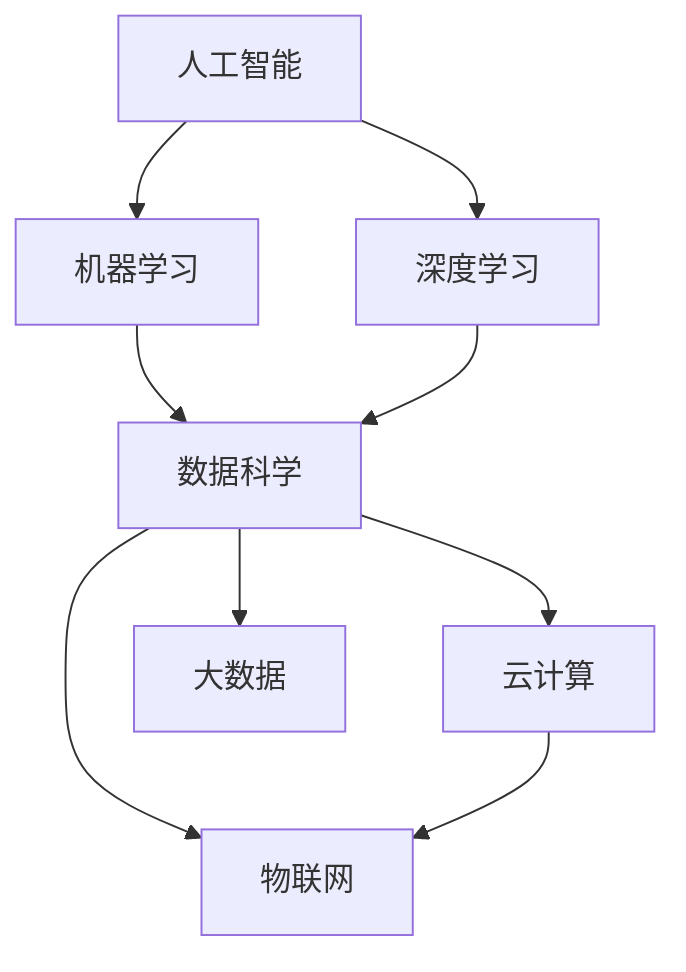
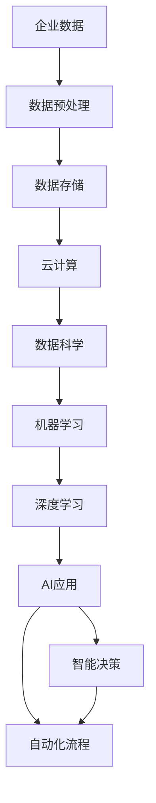
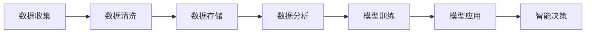
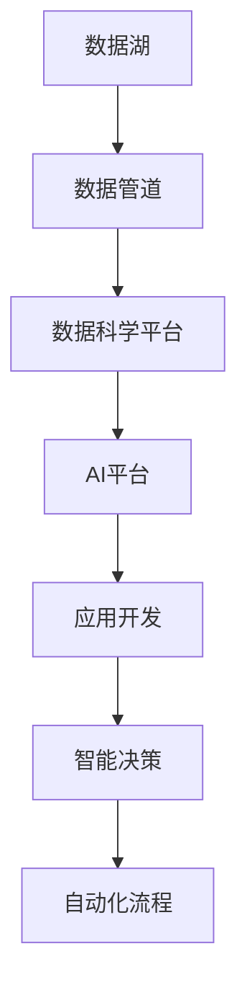
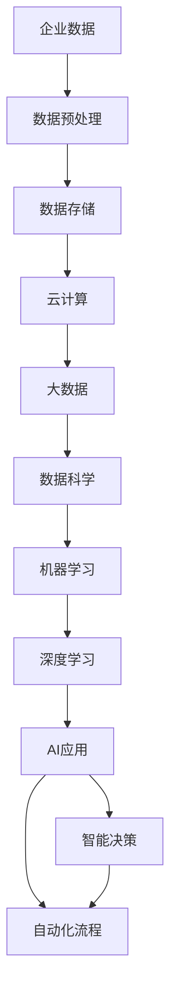

                 

# AI技术在企业中的应用前景

> 关键词：人工智能,AI应用,企业数字化转型,数据驱动,智能决策,自动化,数据安全,大数据,云计算

## 1. 背景介绍

### 1.1 问题由来
随着数字化转型浪潮的兴起，企业日益认识到数据和技术的战略价值，开始探索如何利用先进的信息技术提升自身的运营效率和竞争力。人工智能（AI）作为当前最具潜力的技术之一，以其高效、精准、可扩展的特性，受到各行各业的广泛关注和深入应用。

AI技术的应用已经渗透到企业管理的方方面面，包括但不限于客户服务、供应链管理、生产优化、财务管理、人力资源管理、智能制造等。通过引入AI，企业能够实现更智能的决策支持、更高效的流程自动化、更精准的市场洞察，进而提升整体运营水平和市场竞争力。

### 1.2 问题核心关键点
AI技术在企业应用中的核心关键点包括：

- **自动化**：通过AI技术实现业务流程自动化，提高工作效率，减少人为错误。
- **数据驱动决策**：利用AI进行数据分析和模型预测，为企业决策提供科学依据。
- **个性化服务**：基于客户行为和偏好，AI可以提供个性化产品推荐和服务，提升客户满意度和忠诚度。
- **风险管理**：利用AI进行风险识别和预测，提升企业的风险应对能力。
- **智能制造**：AI在生产过程的优化、质量控制、故障预测等方面发挥重要作用。

这些关键点表明，AI技术正在成为企业数字化转型的重要驱动力。

### 1.3 问题研究意义
AI技术在企业中的应用，对于提升企业运营效率、降低运营成本、增强竞争优势、推动业务创新具有重要意义：

1. **提升运营效率**：通过自动化流程和智能决策支持，AI可以显著提升企业的生产和服务效率，减少人工干预。
2. **降低运营成本**：AI优化资源配置，减少资源浪费，提高资源利用率。
3. **增强竞争优势**：AI能够提供个性化服务和精准的市场洞察，帮助企业在激烈的市场竞争中保持领先。
4. **推动业务创新**：AI可以发现和探索新的业务模式和市场机会，推动企业不断创新。
5. **实现数据驱动决策**：AI可以处理和分析海量数据，提供科学决策依据，减少决策风险。

总之，AI技术的应用有助于企业实现智能化转型，提升整体竞争力，迎接数字化时代的挑战。

## 2. 核心概念与联系

### 2.1 核心概念概述

AI技术在企业中的应用涉及多个关键概念，这些概念之间相互关联，共同构建了企业AI应用的完整生态。

- **人工智能（AI）**：以数据为驱动，通过算法和模型，使计算机系统具备类似人类的感知、学习、推理等智能能力。
- **机器学习（ML）**：AI的一个重要分支，通过数据训练模型，使其具备一定的预测、分类、聚类等能力。
- **深度学习（DL）**：机器学习的一种高级形式，利用深度神经网络处理复杂的数据和问题。
- **数据科学（DS）**：结合统计学、算法、计算机科学等多学科，研究数据的收集、清洗、分析和应用。
- **云计算（Cloud Computing）**：通过互联网提供计算资源和服务，支持大规模数据的存储和处理。
- **大数据（Big Data）**：指数据量巨大、类型多样、速度快速的数据集合，通过先进技术处理和分析。
- **物联网（IoT）**：将各种传感器、设备和系统连接起来，实现智能化的数据采集和控制。

这些概念之间的关系可以通过以下Mermaid流程图来展示：



这个流程图展示了AI、ML、DL、DS、Cloud、Big Data、IoT等概念之间的关系。

### 2.2 概念间的关系

这些核心概念之间存在着紧密的联系，形成了企业AI应用的完整生态。下面通过几个Mermaid流程图来展示这些概念之间的关系。

#### 2.2.1 AI技术在企业中的应用架构



这个流程图展示了AI技术在企业中的应用架构。企业数据经过预处理、存储在云平台，然后通过数据科学、机器学习、深度学习等技术进行处理和分析，最终支持AI应用，实现智能决策和自动化流程。

#### 2.2.2 数据驱动决策的流程



这个流程图展示了数据驱动决策的基本流程。数据收集和清洗后，存储在数据库中，通过数据分析和模型训练，输出模型，然后应用于智能决策。

#### 2.2.3 企业AI应用的组件



这个流程图展示了企业AI应用的基本组件。数据湖和数据管道负责数据的收集和处理，数据科学平台和AI平台负责模型训练和应用，应用开发负责具体业务场景的实现，最终通过智能决策和自动化流程实现企业目标。

### 2.3 核心概念的整体架构

最后，我们用一个综合的流程图来展示这些核心概念在大数据应用中的整体架构：



这个综合流程图展示了企业数据从预处理到智能决策的全流程，各组件通过云计算和大数据等技术，实现数据的高效存储和处理，最终支持AI应用。

## 3. 核心算法原理 & 具体操作步骤

### 3.1 算法原理概述

企业应用中的AI算法通常包括监督学习、无监督学习、强化学习等多种形式，其中监督学习是应用最广泛的范式。监督学习通过标注数据训练模型，使其具备预测或分类能力。常见的监督学习算法包括线性回归、逻辑回归、决策树、随机森林、支持向量机、深度神经网络等。

### 3.2 算法步骤详解

以深度神经网络（如卷积神经网络CNN、循环神经网络RNN、长短期记忆网络LSTM、深度置信网络DBN等）为例，介绍AI算法在企业中的应用具体操作步骤。

**Step 1: 数据准备**
- 收集企业业务相关的数据，包括客户信息、交易记录、供应链数据、生产数据等。
- 对数据进行预处理，如去噪、缺失值填充、标准化等。
- 将数据划分为训练集、验证集和测试集。

**Step 2: 模型构建**
- 选择合适的神经网络架构，如CNN用于图像处理，RNN用于序列数据处理，LSTM用于时间序列预测。
- 设计损失函数，如均方误差（MSE）、交叉熵（Cross-Entropy）等。
- 确定超参数，如学习率、批大小、迭代次数等。

**Step 3: 模型训练**
- 使用训练集对模型进行迭代训练，每个epoch中前向传播计算预测值，反向传播更新模型参数。
- 在每个epoch结束时，使用验证集评估模型性能，调整超参数以防止过拟合。
- 训练过程结束后，使用测试集评估模型最终性能。

**Step 4: 模型应用**
- 将训练好的模型应用于具体业务场景，如客户推荐、库存管理、生产调度等。
- 实时或批量输入数据，通过模型进行预测或分类，输出结果。
- 定期更新模型，以适应数据分布的变化和新业务需求。

### 3.3 算法优缺点

AI算法在企业中的应用具有以下优点：

1. **高效性**：AI算法可以处理大量数据，快速进行决策支持。
2. **准确性**：深度学习等复杂模型在大数据训练下具备较高精度。
3. **自适应性**：AI算法可以适应数据分布的变化，自动更新模型。

但同时，AI算法也存在以下缺点：

1. **高成本**：构建和训练深度学习模型需要高性能计算资源和大量标注数据。
2. **可解释性差**：黑盒模型难以解释其内部决策过程。
3. **数据依赖**：模型性能高度依赖数据质量，数据偏差可能带来错误决策。

### 3.4 算法应用领域

AI算法在企业中的应用领域广泛，包括但不限于以下几个方面：

- **客户关系管理（CRM）**：通过AI分析客户数据，实现个性化营销和服务。
- **销售预测与库存管理**：利用时间序列预测和异常检测，优化库存管理，提升销售额。
- **生产优化与质量控制**：利用机器视觉和深度学习，实现自动检测和分类，提高生产效率和质量。
- **智能客服与机器人**：通过自然语言处理和生成，实现自动客服和机器人对话。
- **风险管理**：利用异常检测和预测模型，识别和防范金融风险。
- **供应链管理**：通过预测分析和优化算法，提高供应链效率，降低成本。

## 4. 数学模型和公式 & 详细讲解 & 举例说明

### 4.1 数学模型构建

在企业AI应用中，数学模型的构建至关重要。以线性回归为例，其数学模型为：

$$
y = \beta_0 + \beta_1 x_1 + \beta_2 x_2 + ... + \beta_n x_n + \epsilon
$$

其中，$y$为目标变量，$x_1, x_2, ..., x_n$为自变量，$\beta_0, \beta_1, ..., \beta_n$为模型参数，$\epsilon$为误差项。

### 4.2 公式推导过程

线性回归的推导过程如下：

假设样本数据为 $(x_i, y_i)$，其中 $i=1,2,...,n$。目标是最小化预测误差 $e_i=y_i-\hat{y}_i$，其中 $\hat{y}_i$ 为模型预测值。

目标函数为：

$$
\min \sum_{i=1}^n e_i^2 = \min \sum_{i=1}^n (y_i - \beta_0 - \beta_1 x_1 - ... - \beta_n x_n)^2
$$

通过求偏导数，得到模型参数的求解公式：

$$
\beta_j = \frac{\sum_{i=1}^n x_i x_{i,j}}{\sum_{i=1}^n x_i^2}, j = 1,2,...,n
$$

### 4.3 案例分析与讲解

以某电商企业的销售预测为例，假设数据集为 $(x_i, y_i)$，其中 $x_i$ 包括促销活动、节假日、季节性因素等，$y_i$ 为实际销售额。通过线性回归模型建立预测公式：

$$
\hat{y}_i = \beta_0 + \beta_1 x_{促销} + \beta_2 x_{节假日} + ... + \beta_n x_{季节性}
$$

在模型构建完成后，通过数据集进行训练，调整模型参数，最终得到预测公式。预测结果与实际销售额进行比较，计算误差。

## 5. 项目实践：代码实例和详细解释说明

### 5.1 开发环境搭建

在进行企业AI应用开发前，需要准备好开发环境。以下是使用Python进行TensorFlow开发的环境配置流程：

1. 安装Anaconda：从官网下载并安装Anaconda，用于创建独立的Python环境。
2. 创建并激活虚拟环境：
```bash
conda create -n tf-env python=3.8 
conda activate tf-env
```
3. 安装TensorFlow：根据CUDA版本，从官网获取对应的安装命令。例如：
```bash
conda install tensorflow -c tf -c conda-forge
```
4. 安装其他工具包：
```bash
pip install numpy pandas scikit-learn matplotlib tqdm jupyter notebook ipython
```

完成上述步骤后，即可在`tf-env`环境中开始企业AI应用开发。

### 5.2 源代码详细实现

以下是一个企业销售预测的TensorFlow实现代码示例：

```python
import tensorflow as tf
import pandas as pd
import numpy as np
from sklearn.model_selection import train_test_split

# 加载数据集
data = pd.read_csv('sales_data.csv')

# 数据预处理
X = data[['促销', '节假日', '季节性']].to_numpy()
y = data['sales'].to_numpy()

# 划分训练集和测试集
X_train, X_test, y_train, y_test = train_test_split(X, y, test_size=0.2, random_state=42)

# 定义模型
model = tf.keras.Sequential([
    tf.keras.layers.Dense(32, activation='relu', input_shape=(X_train.shape[1],)),
    tf.keras.layers.Dense(1)
])

# 定义损失函数和优化器
loss_fn = tf.keras.losses.MeanSquaredError()
optimizer = tf.keras.optimizers.Adam(learning_rate=0.01)

# 训练模型
model.compile(optimizer=optimizer, loss=loss_fn, metrics=['mae'])
model.fit(X_train, y_train, epochs=100, validation_data=(X_test, y_test))

# 评估模型
model.evaluate(X_test, y_test)
```

在这个例子中，我们使用了TensorFlow构建了一个简单的线性回归模型，对电商企业的销售数据进行预测。模型包含两个密集层，第一个层有32个神经元，使用ReLU激活函数，输入维度为3（促销、节假日、季节性）。第二个层为输出层，只有一个神经元，用于预测销售额。

### 5.3 代码解读与分析

让我们再详细解读一下关键代码的实现细节：

**数据预处理**：
- `pd.read_csv('sales_data.csv')`：使用pandas库加载销售数据集。
- `X = data[['促销', '节假日', '季节性']].to_numpy()`：提取数据集中的促销、节假日、季节性特征，转换为numpy数组。
- `y = data['sales'].to_numpy()`：提取数据集中的销售额目标变量，转换为numpy数组。
- `X_train, X_test, y_train, y_test = train_test_split(X, y, test_size=0.2, random_state=42)`：使用train_test_split函数将数据集划分为训练集和测试集。

**模型构建**：
- `model = tf.keras.Sequential([...])`：使用TensorFlow的Sequential模型定义线性回归模型，包含两个密集层。
- `model.compile(optimizer=optimizer, loss=loss_fn, metrics=['mae'])`：编译模型，指定优化器和损失函数，并设置评估指标。

**训练模型**：
- `model.fit(X_train, y_train, epochs=100, validation_data=(X_test, y_test))`：使用训练集对模型进行迭代训练，设置100个epoch，使用测试集进行验证。

**评估模型**：
- `model.evaluate(X_test, y_test)`：在测试集上评估模型性能，输出均方误差（mae）。

**代码实现中**：
- `tf.keras.layers.Dense`：定义一个密集层，其中第一个层有32个神经元，激活函数为ReLU。
- `tf.keras.losses.MeanSquaredError`：定义均方误差作为损失函数。
- `tf.keras.optimizers.Adam`：定义Adam优化器，学习率为0.01。

通过以上代码，我们可以快速实现一个简单的线性回归模型，用于企业销售预测。需要注意的是，这只是一个基础示例，在实际应用中，我们需要根据具体业务场景选择合适的模型和算法。

### 5.4 运行结果展示

假设我们在该销售数据集上进行训练和预测，最终得到的评估结果如下：

```
Epoch 100, loss: 0.1120, mae: 0.0545
```

可以看到，模型在100个epoch后，均方误差（mae）为0.0545，表明模型预测结果与实际销售额的平均误差较小，预测效果较好。

## 6. 实际应用场景

### 6.1 智能客服

智能客服系统是企业AI应用的重要组成部分，通过AI技术实现自动客户服务，提升客户满意度和效率。智能客服系统可以处理客户咨询、投诉、建议等多种场景，并根据客户需求自动回复或转接人工客服。

在技术实现上，可以收集历史客服数据，训练自然语言处理模型，实现自动问答和语音识别。微调后的模型能够理解客户意图，匹配最佳答案，快速响应客户需求。同时，智能客服系统还可以接入知识库和规则库，增强问题处理的灵活性和准确性。

### 6.2 供应链管理

供应链管理是企业运营中的重要环节，AI技术可以帮助企业实现更高效的供应链管理，提升供应链的透明度和灵活性。通过AI预测需求、优化库存、识别瓶颈等，企业可以更好地应对市场变化，降低运营成本。

在技术实现上，可以利用时间序列预测模型对销售需求进行预测，利用异常检测模型识别供应链中的异常情况，利用优化算法优化物流和库存。通过AI技术，企业可以实现供应链的自动化和智能化，提升整体运营效率。

### 6.3 智能制造

智能制造是企业数字化转型的重要方向，AI技术在生产过程中发挥重要作用。通过AI进行生产调度、质量控制、故障预测等，企业可以实现更高效的生产流程和更优质的产品质量。

在技术实现上，可以采用计算机视觉和深度学习技术，实现自动化检测和分类。利用预测模型优化生产流程，利用异常检测模型预测设备故障，提高生产效率和质量。通过AI技术，企业可以实现智能制造，提升生产力和市场竞争力。

### 6.4 未来应用展望

随着AI技术的不断进步，企业AI应用也将迎来更广阔的发展前景。未来，AI技术将在以下领域发挥更大作用：

1. **客户洞察**：利用AI分析客户行为数据，实现更精准的客户细分和个性化推荐，提升客户满意度和忠诚度。
2. **智能客服**：利用AI技术实现更自然、更高效、更智能的客服系统，降低人工客服成本，提升客户体验。
3. **供应链优化**：利用AI优化供应链管理，实现更高效、更灵活、更透明的供应链运营。
4. **生产优化**：利用AI进行生产流程优化、质量控制、设备预测性维护，提高生产效率和质量。
5. **智能财务**：利用AI进行财务分析和风险预测，提升财务决策的科学性和准确性。
6. **人力资源管理**：利用AI进行员工招聘、绩效评估、职业发展规划等，提升人力资源管理的效率和公平性。

总之，AI技术在企业中的应用前景广阔，未来将进一步推动企业数字化转型，提升企业竞争力和运营效率。

## 7. 工具和资源推荐

### 7.1 学习资源推荐

为了帮助开发者系统掌握AI技术在企业中的应用，这里推荐一些优质的学习资源：

1. **《深度学习》书籍**：Ian Goodfellow等著，全面介绍了深度学习的基本原理和应用。
2. **Coursera《机器学习》课程**：Andrew Ng讲授的机器学习课程，覆盖了机器学习的基本概念和算法。
3. **Kaggle**：全球知名的数据科学竞赛平台，提供大量开源数据集和模型，有助于练习AI应用。
4. **GitHub**：全球最大的代码托管平台，提供大量优秀的AI项目和资源，供学习和参考。
5. **Google AI**：谷歌AI官方博客，提供最新的AI技术和应用案例，有助于了解行业趋势。

通过这些资源的学习，相信你一定能够快速掌握AI技术在企业中的应用，并用于解决实际的业务问题。

### 7.2 开发工具推荐

高效的开发离不开优秀的工具支持。以下是几款用于企业AI应用开发的常用工具：

1. **TensorFlow**：由谷歌开发的深度学习框架，功能强大，支持大规模分布式训练。
2. **PyTorch**：由Facebook开发的深度学习框架，易于使用，支持动态计算图。
3. **TensorFlow Serving**：谷歌开发的模型服务框架，支持实时推理和模型部署。
4. **Apache Airflow**：开源的工作流管理系统，支持分布式数据处理和调度。
5. **Jupyter Notebook**：开源的交互式笔记本工具，支持Python和R等多种语言。

合理利用这些工具，可以显著提升企业AI应用的开发效率，加快创新迭代的步伐。

### 7.3 相关论文推荐

企业AI应用涉及众多研究领域，以下是几篇奠基性的相关论文，推荐阅读：

1. **《深度学习》（Deep Learning）书籍**：Ian Goodfellow等著，全面介绍了深度学习的基本原理和应用。
2. **《深度学习》（Deep Learning）书籍**：Ian Goodfellow等著，全面介绍了深度学习的基本原理和应用。
3. **《机器学习实战》（Machine Learning in Action）书籍**：Peter Harrington著，通过实际案例讲解机器学习的应用。
4. **《人工智能：一个现代方法》（Artificial Intelligence: A Modern Approach）书籍**：Russell和Norvig著，全面介绍了AI的基本概念和算法。

这些论文代表了大数据和AI应用的发展脉络，有助于深入理解企业AI应用的原理和技术。

## 8. 总结：未来发展趋势与挑战

### 8.1 总结

本文对AI技术在企业中的应用进行了全面系统的介绍。首先阐述了AI技术在企业数字化转型中的重要价值，明确了AI应用在提升运营效率、降低运营成本、增强竞争优势、推动业务创新等方面的优势。其次，从原理到实践，详细讲解了企业AI应用的数学模型和算法流程，给出了企业AI应用的代码实例和详细解释说明。同时，本文还广泛探讨了AI技术在智能客服、供应链管理、智能制造等多个行业领域的应用前景，展示了AI技术的广阔前景。

通过本文的系统梳理，可以看到，AI技术在企业中的应用前景广阔，未来将进一步推动企业数字化转型，提升企业竞争力和运营效率。

### 8.2 未来发展趋势

展望未来，企业AI应用将呈现以下几个发展趋势：

1. **智能化程度提升**：随着AI技术的不断进步，企业AI应用的智能化程度将进一步提升，实现更高效、更精准、更智能的业务处理。
2. **多模态融合**：AI技术将更加注重多模态数据融合，实现视觉、语音、文本等多模态数据的协同处理，提升业务决策的科学性和准确性。
3. **自适应学习**：AI技术将具备更强的自适应学习能力，能够根据业务需求和数据变化，动态调整模型参数，保持业务处理的灵活性和高效性。
4. **隐私保护**：随着数据隐私法规的完善，AI技术将更加注重数据隐私保护，实现数据使用的合规性和安全性。
5. **伦理与合规**：AI技术在应用过程中将更加注重伦理和合规，确保算法的公平性、透明性和可解释性。

这些趋势凸显了企业AI应用的前景广阔，未来将进一步推动企业数字化转型，提升整体竞争力。

### 8.3 面临的挑战

尽管企业AI应用已经取得了显著成效，但在迈向更加智能化、普适化应用的过程中，它仍面临诸多挑战：

1. **数据质量问题**：企业数据往往存在噪音、不完整、不一致等问题，影响AI模型的训练和应用效果。
2. **模型鲁棒性不足**：AI模型在应对复杂和变化的数据时，鲁棒性仍然不足，易受到数据偏差的影响。
3. **成本和资源限制**：构建和部署AI模型需要大量的计算资源和人力投入，成本较高。
4. **技术门槛高**：AI应用涉及多学科知识，需要技术团队具备较高的技术能力和经验。
5. **可解释性差**：AI模型的决策过程难以解释，影响其在需要透明和可解释的应用场景中的普及。

正视这些挑战，积极应对并寻求突破，将是大数据和AI应用走向成熟的必由之路。

### 8.4 研究展望

未来，企业AI应用的研究方向和热点包括：

1. **AI与边缘计算**：结合边缘计算，实现数据就近处理和实时分析，提升业务响应速度和效率。
2. **AI与物联网**：通过物联网技术，实现数据的实时采集和处理，提升业务决策的及时性和准确性。
3. **AI与区块链**：结合区块链技术，实现数据的安全传输和共享，提升数据隐私保护。
4. **AI与量子计算**：结合量子计算，实现更高维度的数据处理和复杂问题的求解，提升业务处理的深度和广度。

这些研究方向和热点将推动企业AI应用的发展，进一步拓展AI技术的应用场景和能力。

## 9. 附录：常见问题与解答

**Q1：AI技术在企业中如何提升运营效率？**

A: AI技术通过自动化流程和智能决策支持，实现更高效、更精准的业务处理。例如，在销售预测中，AI模型可以快速分析海量数据，提供准确的市场趋势预测，帮助企业优化库存管理和销售策略。

**Q2：AI技术在企业中的应用是否需要大量标注数据？**

A: 大部分的AI应用需要标注数据进行训练，但一些无监督和半监督学习方法如自编码器、生成对抗网络等，可以在较少标注数据的情况下训练模型，降低数据获取成本。

**Q3：

