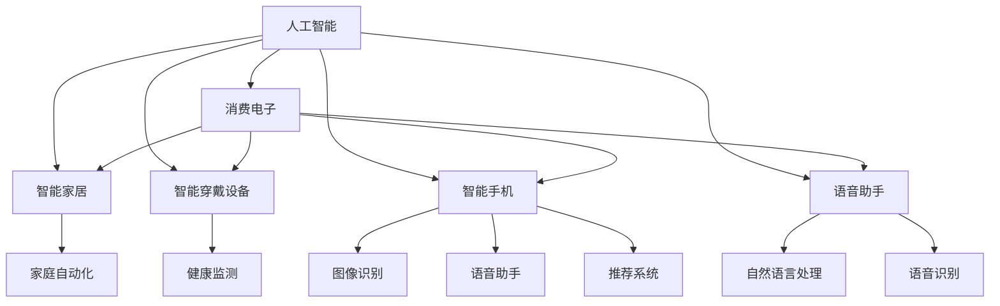

                 

# AI技术在消费电子中的应用现状

> 关键词：AI技术, 消费电子, 智能家居, 智能穿戴设备, 智能手机, 智能家居, 语音助手

## 1. 背景介绍

### 1.1 问题由来

随着人工智能技术的不断发展，越来越多的AI技术被应用于消费电子领域。消费电子涵盖范围广泛，从智能家居到智能穿戴设备，再到智能手机，AI技术的身影无处不在。AI技术的引入，使得消费电子产品更加智能、便捷、个性化，极大地提升了用户体验和产品价值。

### 1.2 问题核心关键点

AI技术在消费电子中的应用，主要集中在以下几个方面：

- **智能家居**：通过语音识别、图像识别、自然语言处理等技术，实现家庭场景的自动化管理，提升居住舒适度和安全性。
- **智能穿戴设备**：结合生物识别、机器学习等技术，为用户提供健康监测、运动分析、个性化推荐等服务。
- **智能手机**：在摄像头、语音助手、推荐系统等方面，通过深度学习、计算机视觉等技术，提升用户体验和设备智能化程度。
- **语音助手**：通过自然语言处理和语音识别技术，实现自然语言交互，为用户提供便捷的智能服务。

### 1.3 问题研究意义

研究AI技术在消费电子中的应用现状，对于推动消费电子行业的智能化转型，提升产品的用户体验，加速技术创新，具有重要意义：

- **提升用户体验**：AI技术的引入，使得消费电子产品能够更好地理解用户需求，提供个性化、定制化的服务，增强用户粘性。
- **加速技术创新**：AI技术的快速发展，为消费电子行业带来了新的技术突破点，推动了产品的迭代和升级。
- **降低成本**：通过AI技术优化产品设计和服务流程，减少人工成本，提高生产效率。
- **开拓新市场**：AI技术的应用，开辟了新的产品形态和业务模式，为消费电子企业打开了新的市场空间。

## 2. 核心概念与联系

### 2.1 核心概念概述

为更好地理解AI技术在消费电子中的应用，本节将介绍几个密切相关的核心概念：

- **人工智能**：通过计算机模拟人类智能行为的技术，包括机器学习、深度学习、自然语言处理等。
- **消费电子**：包括家庭娱乐、健康监测、智能穿戴设备、智能手机等在内的各类电子产品的统称。
- **智能家居**：通过AI技术实现家庭自动化管理，提升居住体验的智能家居系统。
- **智能穿戴设备**：结合生物识别、机器学习等技术，为用户提供健康监测、运动分析等服务的智能穿戴设备。
- **智能手机**：结合计算机视觉、深度学习等技术，提供高性能图像识别、语音助手、推荐系统等服务的智能手机。
- **语音助手**：通过自然语言处理和语音识别技术，实现自然语言交互的智能语音助手。

这些核心概念之间存在着紧密的联系，形成了AI技术在消费电子领域应用的完整生态系统。

### 2.2 概念间的关系

这些核心概念之间存在着紧密的联系，形成了AI技术在消费电子领域应用的完整生态系统。



这个流程图展示了大语言模型微调过程中各个核心概念之间的关系：

- **人工智能**是基础技术，包括机器学习、深度学习、自然语言处理等。
- **消费电子**是大类，包括智能家居、智能穿戴设备、智能手机、语音助手等具体应用场景。
- **智能家居**、**智能穿戴设备**、**智能手机**、**语音助手**等应用场景，都是AI技术的典型应用领域。

这些概念共同构成了AI技术在消费电子领域应用的完整框架，为深入研究提供了清晰的逻辑脉络。

## 3. 核心算法原理 & 具体操作步骤
### 3.1 算法原理概述

AI技术在消费电子中的应用，主要基于以下算法原理：

- **机器学习**：通过训练算法模型，让机器能够从数据中学习，并做出预测或决策。常见的机器学习算法包括监督学习、无监督学习和强化学习。
- **深度学习**：一种特殊的机器学习算法，通过构建多层神经网络，模拟人类神经元之间的连接，实现更复杂的特征提取和模式识别。
- **计算机视觉**：利用图像处理和模式识别技术，实现对图像、视频的理解和分析。
- **自然语言处理**：通过文本处理、语音识别和生成技术，实现对人类语言的理解和生成。

这些算法原理构成了AI技术在消费电子中的核心技术框架，使得产品能够具备智能感知、自主决策和自然交互的能力。

### 3.2 算法步骤详解

基于AI技术在消费电子中的应用，通常包括以下几个关键步骤：

**Step 1: 数据收集与预处理**
- 收集与消费电子应用相关的数据，如家庭环境数据、生物特征数据、用户行为数据等。
- 对数据进行清洗、去重、标注，确保数据质量。

**Step 2: 模型选择与训练**
- 根据应用场景选择合适的算法模型，如卷积神经网络（CNN）、循环神经网络（RNN）、深度神经网络（DNN）等。
- 使用收集到的数据对模型进行训练，调整模型参数，提高模型精度。

**Step 3: 模型集成与优化**
- 将训练好的模型集成到消费电子产品中，进行实时推理和预测。
- 对模型进行性能优化，提高计算效率和实时性。

**Step 4: 系统部署与测试**
- 将优化后的模型部署到实际产品中，进行系统集成和测试。
- 根据测试结果，调整模型参数和系统设计，确保系统稳定运行。

**Step 5: 用户反馈与迭代**
- 收集用户反馈，评估系统性能和用户体验。
- 根据反馈结果，进行模型迭代和系统升级，持续优化产品功能和服务质量。

### 3.3 算法优缺点

AI技术在消费电子中的应用，具有以下优点：

- **智能化程度高**：通过机器学习和深度学习等技术，使产品具备自主决策和智能感知能力，提供更高质量的服务。
- **用户体验佳**：通过自然语言处理和语音识别技术，实现自然语言交互，提升用户体验和产品粘性。
- **市场竞争力强**：通过AI技术提升产品性能和服务质量，增强市场竞争力。

但同时也存在以下缺点：

- **成本高**：AI技术的引入，带来了较高的硬件和软件成本。
- **数据依赖强**：AI技术的应用，对数据质量和数据量的要求较高，数据获取和标注成本较高。
- **复杂度高**：AI技术的实现，需要较高的技术水平和开发经验，开发难度较大。

### 3.4 算法应用领域

AI技术在消费电子中的应用，广泛涵盖了以下领域：

- **智能家居**：智能音箱、智能灯光、智能安防等，通过语音识别和自然语言处理技术，实现家庭自动化管理。
- **智能穿戴设备**：智能手表、智能眼镜、智能服装等，结合生物识别和机器学习技术，提供健康监测、运动分析等服务。
- **智能手机**：智能手机中的摄像头、语音助手、推荐系统等，通过深度学习和计算机视觉技术，提升用户体验和设备智能化程度。
- **语音助手**：智能音箱、智能家居等设备中的语音助手，通过自然语言处理和语音识别技术，实现自然语言交互。

## 4. 数学模型和公式 & 详细讲解  
### 4.1 数学模型构建

以智能手机中的图像识别为例，我们可以使用以下数学模型：

设输入图像为 $x \in \mathbb{R}^{H \times W \times C}$，其中 $H$、$W$、$C$ 分别表示图像的高度、宽度和通道数。输出为类别标签 $y \in \{1, 2, \dots, K\}$，其中 $K$ 表示类别数。

### 4.2 公式推导过程

图像识别通常使用卷积神经网络（CNN）模型。其前向传播过程如下：

1. 卷积层（Convolutional Layer）：对输入图像进行卷积操作，提取局部特征。
2. 池化层（Pooling Layer）：对卷积结果进行下采样操作，减少特征维度。
3. 全连接层（Fully Connected Layer）：将池化结果展开为向量，进行分类操作。

损失函数通常使用交叉熵损失函数（Cross-Entropy Loss），其定义为：

$$
\mathcal{L}(y, \hat{y}) = -\frac{1}{N} \sum_{i=1}^N \sum_{j=1}^K y_i \log \hat{y}_{i,j}
$$

其中 $N$ 表示样本数，$y_i$ 表示第 $i$ 个样本的真实标签，$\hat{y}_{i,j}$ 表示模型预测的第 $i$ 个样本属于第 $j$ 类的概率。

### 4.3 案例分析与讲解

以智能手表的健康监测为例，可以结合生物识别和机器学习技术，实现以下功能：

- **心率监测**：通过心率传感器采集用户心率数据，结合机器学习算法，分析用户的心率变化趋势。
- **运动分析**：通过加速度传感器采集用户运动数据，结合机器学习算法，分析用户的运动模式和强度。
- **睡眠监测**：通过睡眠传感器采集用户睡眠数据，结合机器学习算法，分析用户的睡眠状况。

## 5. 项目实践：代码实例和详细解释说明
### 5.1 开发环境搭建

在进行AI技术在消费电子中的应用实践前，我们需要准备好开发环境。以下是使用Python进行TensorFlow开发的环境配置流程：

1. 安装Anaconda：从官网下载并安装Anaconda，用于创建独立的Python环境。

2. 创建并激活虚拟环境：
```bash
conda create -n tf-env python=3.8 
conda activate tf-env
```

3. 安装TensorFlow：根据CUDA版本，从官网获取对应的安装命令。例如：
```bash
conda install tensorflow tensorflow-gpu=cuda11.1 -c conda-forge
```

4. 安装各类工具包：
```bash
pip install numpy pandas scikit-learn matplotlib tqdm jupyter notebook ipython
```

完成上述步骤后，即可在`tf-env`环境中开始AI技术在消费电子中的应用实践。

### 5.2 源代码详细实现

下面我们以智能手表的健康监测为例，给出使用TensorFlow进行模型开发的PyTorch代码实现。

首先，定义数据集：

```python
import tensorflow as tf
import numpy as np
import pandas as pd

# 定义数据集
def load_data():
    data = pd.read_csv('heart_rate_data.csv')
    X = data['heart_rate'].values.reshape(-1, 1)
    y = data['label'].values
    return X, y

X, y = load_data()
X = X / 100.0  # 数据归一化
```

然后，定义模型：

```python
# 定义模型
class HeartRateModel(tf.keras.Model):
    def __init__(self):
        super(HeartRateModel, self).__init__()
        self.dense1 = tf.keras.layers.Dense(64, activation='relu')
        self.dense2 = tf.keras.layers.Dense(1, activation='sigmoid')
    
    def call(self, inputs):
        x = self.dense1(inputs)
        x = self.dense2(x)
        return x

model = HeartRateModel()
```

接着，定义损失函数和优化器：

```python
# 定义损失函数和优化器
loss_fn = tf.keras.losses.BinaryCrossentropy()
optimizer = tf.keras.optimizers.Adam(learning_rate=0.001)
```

然后，训练模型：

```python
# 训练模型
def train_epoch(model, data, loss_fn, optimizer):
    for i in range(epochs):
        for j in range(len(data)):
            x, y = data[j]
            with tf.GradientTape() as tape:
                y_pred = model(x)
                loss = loss_fn(y_pred, y)
            gradients = tape.gradient(loss, model.trainable_variables)
            optimizer.apply_gradients(zip(gradients, model.trainable_variables))
```

最后，评估模型：

```python
# 评估模型
def evaluate(model, X_test, y_test):
    y_pred = []
    for i in range(len(X_test)):
        x_test = X_test[i]
        y_pred.append(model(x_test).numpy()[0])
    y_pred = np.array(y_pred)
    accuracy = (y_test == y_pred).mean()
    print("Accuracy:", accuracy)
```

## 6. 实际应用场景

### 6.1 智能家居

智能家居通过AI技术实现了家庭自动化管理，提升了居住舒适度和安全性。例如：

- **智能音箱**：通过语音识别和自然语言处理技术，实现语音控制家电、播放音乐等功能。
- **智能灯光**：通过图像识别和自然语言处理技术，实现自动调节灯光亮度和颜色，适应不同场景需求。
- **智能安防**：通过图像识别和计算机视觉技术，实现面部识别、入侵检测等功能。

### 6.2 智能穿戴设备

智能穿戴设备通过生物识别和机器学习技术，为用户提供健康监测、运动分析等服务。例如：

- **智能手表**：通过心率传感器和机器学习算法，实现心率监测和运动分析。
- **智能眼镜**：通过图像识别和机器学习算法，实现场景识别和实时翻译。
- **智能服装**：通过压力传感器和机器学习算法，实现身体压力监测和运动分析。

### 6.3 智能手机

智能手机通过深度学习和计算机视觉技术，提升了用户体验和设备智能化程度。例如：

- **摄像头**：通过深度学习算法，实现图像分类、物体检测等功能。
- **语音助手**：通过自然语言处理和语音识别技术，实现自然语言交互。
- **推荐系统**：通过机器学习算法，实现个性化推荐，提升用户体验。

### 6.4 语音助手

语音助手通过自然语言处理和语音识别技术，实现自然语言交互，提升了用户的使用便捷性。例如：

- **智能音箱**：通过自然语言处理和语音识别技术，实现语音控制和智能问答。
- **智能家居**：通过自然语言处理和语音识别技术，实现家庭自动化管理。
- **车载系统**：通过自然语言处理和语音识别技术，实现车载语音控制和导航。

## 7. 工具和资源推荐
### 7.1 学习资源推荐

为了帮助开发者系统掌握AI技术在消费电子中的应用理论基础和实践技巧，这里推荐一些优质的学习资源：

1. 《深度学习入门》系列博文：由AI领域的专家撰写，深入浅出地介绍了深度学习、自然语言处理等基本概念和算法。
2. Coursera《深度学习专项课程》：由斯坦福大学开设的深度学习专项课程，有视频讲解和配套作业，带你入门深度学习领域。
3. 《动手学深度学习》书籍：由AI领域的大牛团队编写，全面介绍了深度学习的基础理论和实践技巧。
4. HuggingFace官方文档：提供海量预训练模型和完整的代码示例，是上手实践的必备资料。
5. Kaggle数据集：包含各类NLP和图像处理的数据集，供学习和研究使用。

通过对这些资源的学习实践，相信你一定能够快速掌握AI技术在消费电子中的应用精髓，并用于解决实际的NLP问题。

### 7.2 开发工具推荐

高效的开发离不开优秀的工具支持。以下是几款用于AI技术在消费电子中应用的常用工具：

1. TensorFlow：基于Python的开源深度学习框架，生产部署方便，适合大规模工程应用。
2. PyTorch：基于Python的开源深度学习框架，灵活动态的计算图，适合快速迭代研究。
3. Keras：高层次的神经网络API，易于使用，适合初学者入门。
4. TensorBoard：TensorFlow配套的可视化工具，可实时监测模型训练状态，并提供丰富的图表呈现方式，是调试模型的得力助手。
5. Weights & Biases：模型训练的实验跟踪工具，可以记录和可视化模型训练过程中的各项指标，方便对比和调优。
6. Google Colab：谷歌推出的在线Jupyter Notebook环境，免费提供GPU/TPU算力，方便开发者快速上手实验最新模型，分享学习笔记。

合理利用这些工具，可以显著提升AI技术在消费电子中的应用开发效率，加快创新迭代的步伐。

### 7.3 相关论文推荐

AI技术在消费电子中的应用源于学界的持续研究。以下是几篇奠基性的相关论文，推荐阅读：

1. "Convolutional Neural Networks for Visual Recognition"（卷积神经网络在视觉识别中的应用）：提出CNN模型，用于图像识别任务。
2. "Natural Language Processing with Transformers"（使用Transformer进行自然语言处理）：提出Transformer模型，用于自然语言处理任务。
3. "Faster R-CNN: Towards Real-Time Object Detection with Region Proposal Networks"（Faster R-CNN：快速区域网络的目标检测）：提出Faster R-CNN模型，用于目标检测任务。
4. "Attention is All You Need"（注意力是所有）：提出Transformer模型，用于自然语言处理任务。
5. "Hands-Free Interaction with a Robotic Arm Using Deep Reinforcement Learning"（使用深度强化学习与机械臂进行无接触交互）：提出深度强化学习模型，用于机械臂控制。

这些论文代表了大语言模型微调技术的发展脉络。通过学习这些前沿成果，可以帮助研究者把握学科前进方向，激发更多的创新灵感。

除上述资源外，还有一些值得关注的前沿资源，帮助开发者紧跟AI技术在消费电子中的最新进展，例如：

1. arXiv论文预印本：人工智能领域最新研究成果的发布平台，包括大量尚未发表的前沿工作，学习前沿技术的必读资源。
2. 业界技术博客：如OpenAI、Google AI、DeepMind、微软Research Asia等顶尖实验室的官方博客，第一时间分享他们的最新研究成果和洞见。
3. 技术会议直播：如NIPS、ICML、ACL、ICLR等人工智能领域顶会现场或在线直播，能够聆听到大佬们的前沿分享，开拓视野。
4. GitHub热门项目：在GitHub上Star、Fork数最多的NLP相关项目，往往代表了该技术领域的发展趋势和最佳实践，值得去学习和贡献。
5. 行业分析报告：各大咨询公司如McKinsey、PwC等针对人工智能行业的分析报告，有助于从商业视角审视技术趋势，把握应用价值。

总之，对于AI技术在消费电子中的应用的学习和实践，需要开发者保持开放的心态和持续学习的意愿。多关注前沿资讯，多动手实践，多思考总结，必将收获满满的成长收益。

## 8. 总结：未来发展趋势与挑战

### 8.1 总结

本文对AI技术在消费电子中的应用现状进行了全面系统的介绍。首先阐述了AI技术在消费电子领域的背景和研究意义，明确了AI技术在智能家居、智能穿戴设备、智能手机、语音助手等具体应用场景中的应用价值。其次，从原理到实践，详细讲解了AI技术在消费电子中的应用流程和关键步骤，给出了实际项目开发的完整代码实现。同时，本文还广泛探讨了AI技术在消费电子领域的应用前景，展示了AI技术在消费电子中的巨大潜力。

通过本文的系统梳理，可以看到，AI技术在消费电子领域的应用已经取得了显著进展，对传统消费电子产品进行了智能化改造，极大地提升了用户体验和产品价值。未来，伴随AI技术的不断进步，消费电子领域必将迎来更多的智能化创新，进一步拓展AI技术的应用边界。

### 8.2 未来发展趋势

展望未来，AI技术在消费电子中的应用将呈现以下几个发展趋势：

1. **智能化程度提升**：随着AI技术的不断进步，消费电子产品将具备更高级的智能化功能，如自主决策、情景感知、自然语言交互等，提供更高质量的用户体验。
2. **应用场景拓展**：AI技术在消费电子中的应用将从智能家居、智能穿戴设备、智能手机等传统领域，拓展到车载系统、智能家居、健康监测等新兴领域，带来更多智能应用场景。
3. **多模态融合**：未来的AI技术将结合视觉、语音、生物识别等多种模态数据，实现更加全面、准确的智能感知和决策。
4. **隐私保护加强**：随着用户对隐私保护的重视，AI技术在消费电子中的应用将更加注重数据安全和隐私保护，采用联邦学习、差分隐私等技术，保护用户数据安全。
5. **标准化规范制定**：为推动AI技术在消费电子中的应用标准化和规范化，行业将制定更加严格的规范和标准，保障产品的安全和可靠性。

### 8.3 面临的挑战

尽管AI技术在消费电子中的应用已经取得了显著进展，但在迈向更加智能化、普适化应用的过程中，仍面临诸多挑战：

1. **数据获取难度高**：AI技术在消费电子中的应用，需要大量的标注数据进行训练。如何高效、低成本地获取高质量标注数据，是一个亟待解决的难题。
2. **技术复杂度高**：AI技术在消费电子中的应用，涉及深度学习、自然语言处理、计算机视觉等多个领域的知识。如何整合这些技术，实现跨领域的协同创新，仍需深入研究和探索。
3. **隐私保护压力大**：AI技术在消费电子中的应用，往往涉及用户数据和隐私保护。如何在保护用户隐私的同时，实现高效的AI功能，是一个重要的研究课题。
4. **技术壁垒高**：AI技术在消费电子中的应用，需要较高的技术水平和开发经验。如何降低技术壁垒，推动AI技术的普及和应用，是行业需要面对的重要挑战。
5. **市场竞争激烈**：AI技术在消费电子中的应用，吸引了众多企业的关注和投入。如何在激烈的市场竞争中脱颖而出，是企业需要持续关注和解决的问题。

### 8.4 未来突破

面对AI技术在消费电子中的应用所面临的种种挑战，未来的研究需要在以下几个方面寻求新的突破：

1. **数据获取技术创新**：开发更加高效、低成本的数据获取技术，如主动学习、半监督学习等，降低AI技术在消费电子中的应用对标注数据的依赖。
2. **技术整合能力提升**：深入研究和探索AI技术的跨领域整合能力，实现更加全面、准确的智能感知和决策。
3. **隐私保护技术创新**：采用联邦学习、差分隐私等技术，保护用户数据和隐私安全，同时实现高效的AI功能。
4. **技术壁垒降低**：开发更加简单易用的AI开发工具和平台，降低技术门槛，推动AI技术的普及和应用。
5. **市场竞争力提升**：在技术创新和产品设计上不断突破，提升AI技术在消费电子中的应用市场竞争力，占领更多市场份额。

这些研究方向的探索，必将引领AI技术在消费电子中的应用走向更高的台阶，为消费电子行业带来更多的智能化创新，推动行业的可持续发展。

## 9. 附录：常见问题与解答

**Q1：AI技术在消费电子中的应用对用户隐私有什么影响？**

A: AI技术在消费电子中的应用，需要获取大量的用户数据进行训练。这些数据可能包括用户的生物特征、行为习惯、位置信息等，涉及到用户的隐私问题。如何保护用户隐私，是一个重要的研究课题。一方面，可以采用数据匿名化、差分隐私等技术，保护用户数据的安全；另一方面，可以采用联邦学习等技术，在不泄露用户数据的情况下，实现高效的AI功能。

**Q2：AI技术在消费电子中的应用如何实现标准化和规范化？**

A: 为了推动AI技术在消费电子中的应用标准化和规范化，行业需要制定更加严格的技术规范和标准。这包括设备接口、数据格式、通信协议等方面的规范，保障产品的安全和可靠性。同时，行业组织可以建立AI技术的评估体系，对AI技术在消费电子中的应用效果进行评估和认证，确保技术应用的科学性和可靠性。

**Q3：AI技术在消费电子中的应用如何处理数据偏差问题？**

A: AI技术在消费电子中的应用，可能会受到数据偏差的影响，导致模型在特定群体或场景下的表现不佳。为了处理数据偏差问题，可以采用以下方法：
1. 数据增强：通过数据扩充和数据合成技术，增加数据多样性，减少数据偏差。
2. 对抗训练：引入对抗样本，提高模型的鲁棒性，减少对特定数据集的依赖。
3. 偏差校正：通过重新设计数据集或算法，减少数据偏差的影响，提升模型公平性和公正性。
4. 多模态融合：结合多种数据模态，提升模型的泛化能力，减少单一数据模态的偏差影响。

通过以上方法，可以有效地处理AI技术在消费电子中的应用数据偏差问题，提升模型的公平性和公正性，保障技术应用的可靠性和可信性。

**Q4：AI技术在消费电子中的应用如何实现高效的模型训练？**

A: 高效的模型训练是AI技术在消费电子中的应用中重要的研究课题。为了实现高效的模型训练，可以采用以下方法：
1. 分布式训练：利用分布式计算技术，将模型训练任务分散到多个计算节点上，加速模型训练过程。
2. 模型压缩：通过剪枝、量化等技术，减少模型参数量，提升模型推理效率。
3. 优化算法改进：采用更加高效的优化算法，如AdamW、Adafactor等，加速模型收敛。
4. 硬件优化：利用GPU/TPU等高性能硬件，提升模型训练和推理效率。
5. 数据预处理：对数据进行高效的预处理，减少数据读取和处理的时间，提升模型训练效率。

通过以上方法，可以实现高效的模型训练，降低AI技术在消费电子中的应用成本，提高模型的实时性和可靠性。

---

作者：禅与计算机程序设计艺术 / Zen and the Art of Computer Programming

