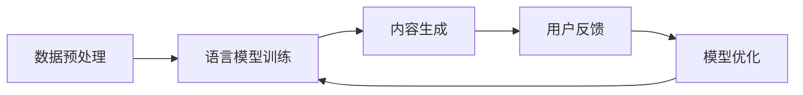
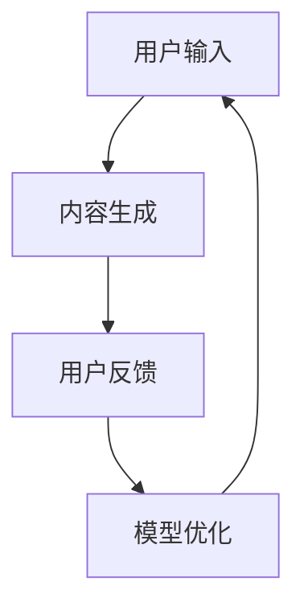
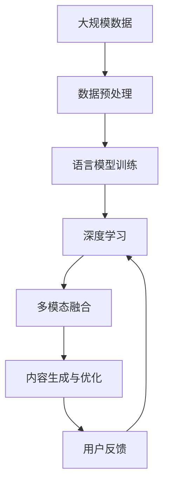

                 

# AI时代的内容创作机会：码头故事的无限题材与灵感

> 关键词：AI创作, 内容生成, 自然语言处理(NLP), 语言模型, 深度学习, 代码实例, 实际应用

## 1. 背景介绍

### 1.1 问题由来

随着人工智能(AI)技术的飞速发展，内容创作领域正面临着前所未有的变革。特别是深度学习技术的突破，为自然语言处理(NLP)带来了革命性的进展。AI生成内容的能力，特别是文本生成、自然语言推理等任务，正逐步取代人力，带来更大的创作自由和更高的生产效率。

在这个背景下，AI内容创作成为了学术界和工业界的一个热门话题。如何通过AI技术，创造出更多高质量、多样化的内容，成为了许多研究者和实践者所关注的问题。在这一过程中，语言模型（如GPT-3、BERT等）以其强大的语言理解和生成能力，成为了AI内容创作的重要工具。

### 1.2 问题核心关键点

AI内容创作的核心理念是通过算法和大模型，让机器自动生成和优化内容。其核心关键点包括：

- **大模型和大数据**：通过在大规模数据上进行预训练，语言模型能够学习到丰富的语言知识，为内容创作提供基础。
- **自然语言处理(NLP)**：利用NLP技术，将自然语言转化为机器可理解的形式，进行自动创作和优化。
- **深度学习**：利用深度学习模型，通过多层神经网络的迭代训练，不断提升生成内容的质量和多样性。
- **多模态融合**：结合文本、图像、音频等多模态数据，生成更全面、更丰富的内容。
- **用户交互**：通过人机交互，不断优化内容生成算法，提升创作效果。

这些核心关键点共同构成了AI内容创作的完整生态系统，为创作人员提供了无限的可能性和机会。

### 1.3 问题研究意义

AI内容创作的研究和实践，对于拓展人类创作边界、提升创作效率、促进产业升级具有重要意义：

- **提升创作效率**：AI可以自动生成内容，减轻创作人员的重复劳动，提升创作速度和质量。
- **增强创作多样性**：AI可以生成多样化的内容，满足不同受众的需求，拓宽创作思路。
- **降低创作成本**：AI能够快速生成高质量内容，大幅降低人力成本和时间成本。
- **促进内容分发**：AI可以根据用户行为数据，优化内容推荐算法，提高内容的分发效果。
- **助力创作智能化**：AI能够辅助创作者进行素材搜索、内容优化等，提升创作智能化水平。

因此，AI内容创作技术的发展，不仅是技术革新的体现，更是推动文化创意产业发展的重要引擎。

## 2. 核心概念与联系

### 2.1 核心概念概述

为了更好地理解AI内容创作的原理和实践，本节将介绍几个密切相关的核心概念：

- **自然语言处理(NLP)**：指让计算机理解和处理人类语言的技术，是AI内容创作的基础。
- **语言模型**：通过机器学习算法训练的模型，可以预测给定文本序列出现的概率，用于生成和优化文本内容。
- **深度学习**：利用多层神经网络模型，从大量数据中学习并提取特征，用于提高内容的生成质量和多样性。
- **多模态融合**：结合文本、图像、音频等多模态数据，生成更全面、更丰富的内容。
- **内容生成与优化**：通过算法和大模型，自动生成和优化内容，满足不同用户的需求。

这些核心概念之间的逻辑关系可以通过以下Mermaid流程图来展示：

```mermaid
graph TB
    A[自然语言处理(NLP)] --> B[语言模型]
    A --> C[深度学习]
    C --> D[多模态融合]
    B --> E[内容生成与优化]
```

这个流程图展示了大模型、NLP和深度学习在AI内容创作中的作用。

### 2.2 概念间的关系

这些核心概念之间存在着紧密的联系，形成了AI内容创作的完整生态系统。下面我们通过几个Mermaid流程图来展示这些概念之间的关系。

#### 2.2.1 AI内容创作流程



这个流程图展示了AI内容创作的流程，包括数据预处理、模型训练、内容生成、用户反馈和模型优化等步骤。

#### 2.2.2 多模态内容创作


这个流程图展示了多模态内容创作的流程，通过融合文本、图像、音频等多模态数据，生成更丰富、更全面的内容。

#### 2.2.3 人机交互



这个流程图展示了人机交互在内容创作中的应用，通过用户的反馈不断优化模型，提升内容的质量和多样性。

### 2.3 核心概念的整体架构

最后，我们用一个综合的流程图来展示这些核心概念在大模型内容创作中的整体架构：



这个综合流程图展示了从数据预处理到大模型内容创作的完整过程。通过这个架构，我们可以更清晰地理解AI内容创作中的各个环节和步骤。

## 3. 核心算法原理 & 具体操作步骤
### 3.1 算法原理概述

AI内容创作的核心理念是通过算法和大模型，让机器自动生成和优化内容。其核心算法原理主要包括以下几个方面：

- **预训练**：在大规模数据上进行无监督训练，学习到语言的通用特征和知识。
- **微调**：在特定任务上，利用少量标注数据进行有监督训练，优化模型在特定任务上的表现。
- **生成与优化**：利用训练好的模型，生成新的内容，并通过用户反馈进行优化。

这些算法原理共同构成了AI内容创作的完整框架，为内容创作提供了强大的技术支持。

### 3.2 算法步骤详解

AI内容创作的算法步骤主要包括以下几个关键环节：

1. **数据预处理**：清洗、整理和标注数据，准备用于模型训练。
2. **语言模型训练**：在大规模数据上训练语言模型，学习到语言知识。
3. **内容生成**：利用训练好的模型生成新的内容，满足不同用户的需求。
4. **用户反馈与优化**：通过用户反馈，不断优化模型，提升内容质量。

以下是对每个步骤的详细解释：

#### 3.2.1 数据预处理

数据预处理是AI内容创作的关键步骤之一。通过预处理，可以从原始数据中提取有用的信息，为模型训练提供基础。

**数据清洗**：清洗数据，去除噪音、重复和不相关的内容。
**数据标注**：为数据添加标签，如情感、主题、风格等，用于指导模型生成内容。
**数据标准化**：将数据转换为模型可用的格式，如分词、向量表示等。

#### 3.2.2 语言模型训练

语言模型训练是AI内容创作的核心步骤之一。通过在大规模数据上进行训练，学习到语言的通用特征和知识，为内容创作提供基础。

**选择模型**：选择合适的语言模型，如GPT-3、BERT等。
**训练模型**：在大规模数据上训练模型，不断调整模型参数，优化模型表现。
**保存模型**：保存训练好的模型，供后续使用。

#### 3.2.3 内容生成

内容生成是AI内容创作的核心步骤之一。通过训练好的模型，自动生成新的内容，满足不同用户的需求。

**输入数据**：输入文本、图像、音频等多模态数据。
**生成内容**：利用训练好的模型生成新的内容，如文本、图像、音频等。
**质量评估**：评估生成的内容质量，确保满足用户需求。

#### 3.2.4 用户反馈与优化

用户反馈与优化是AI内容创作的重要环节之一。通过用户反馈，不断优化模型，提升内容质量。

**收集反馈**：收集用户对生成内容的反馈，如满意度、建议等。
**分析反馈**：分析用户反馈，找出生成内容的优点和不足。
**模型优化**：根据用户反馈，调整模型参数，优化模型表现。

### 3.3 算法优缺点

AI内容创作的算法具有以下优点：

- **高效快速**：通过自动生成内容，大幅提升内容创作效率。
- **多样化**：可以生成多样化、个性化、风格各异的内容。
- **大规模**：适用于大规模内容创作，如新闻、广告、文案等。

同时，这些算法也存在一些缺点：

- **内容质量不确定**：生成的内容质量可能不稳定，需要后续优化。
- **依赖数据质量**：对数据质量和标注数据依赖较大，数据不平衡可能导致生成内容偏斜。
- **可解释性不足**：生成内容的逻辑和推理过程较难解释，可能缺乏可信度。

### 3.4 算法应用领域

AI内容创作的算法广泛应用于以下几个领域：

- **内容生成**：如新闻报道、广告文案、产品描述、社交媒体内容等。
- **内容优化**：如文本摘要、翻译、纠错、情感分析等。
- **多模态内容创作**：如文本与图像、音频结合的内容创作，如视频、音乐、动画等。
- **内容推荐**：如个性化推荐、热点新闻、内容排序等。
- **内容管理**：如版权检测、版权管理、知识图谱构建等。

这些应用领域展示了AI内容创作的广泛应用场景和巨大潜力。

## 4. 数学模型和公式 & 详细讲解 & 举例说明
### 4.1 数学模型构建

在AI内容创作中，常用的数学模型包括语言模型、生成模型和优化模型等。下面以语言模型为例，进行详细讲解。

**语言模型**：利用概率模型，预测给定文本序列的概率，用于生成和优化内容。

**生成模型**：利用生成模型，如GAN、VAE等，生成新的内容，满足不同用户的需求。

**优化模型**：利用优化算法，如梯度下降、Adam等，不断调整模型参数，优化模型表现。

### 4.2 公式推导过程

以下以语言模型为例，推导其数学公式。

**交叉熵损失函数**：用于衡量模型预测和真实标签之间的差异。

$$
\mathcal{L} = -\frac{1}{N}\sum_{i=1}^N \sum_{j=1}^M y_j \log p_j(x_i)
$$

其中 $y_j$ 为标签，$p_j(x_i)$ 为模型预测的概率。

**梯度下降算法**：通过不断调整模型参数，最小化损失函数。

$$
\theta \leftarrow \theta - \eta \nabla_{\theta}\mathcal{L}
$$

其中 $\eta$ 为学习率，$\nabla_{\theta}\mathcal{L}$ 为损失函数对模型参数的梯度。

**正则化技术**：如L2正则、Dropout等，避免过拟合。

$$
\theta \leftarrow \theta - \eta (\nabla_{\theta}\mathcal{L} + \lambda \theta)
$$

其中 $\lambda$ 为正则化系数，$\theta$ 为模型参数。

### 4.3 案例分析与讲解

**案例1：新闻自动生成**

通过预训练语言模型，可以利用大规模新闻数据进行训练，生成新闻报道。在实际应用中，可以先通过分词、去除噪音、标注情感等预处理步骤，然后在训练好的模型上进行内容生成。

**案例2：产品描述生成**

通过预训练语言模型，可以利用商品数据进行训练，生成产品描述。在实际应用中，可以先通过分词、去除噪音、标注商品属性等预处理步骤，然后在训练好的模型上进行内容生成。

**案例3：多模态内容创作**

通过预训练语言模型，可以利用文本、图像、音频等多模态数据进行训练，生成新的内容。在实际应用中，可以先通过数据预处理步骤，将多模态数据转换为模型可用的格式，然后在训练好的模型上进行内容生成。

## 5. 项目实践：代码实例和详细解释说明
### 5.1 开发环境搭建

在进行AI内容创作实践前，我们需要准备好开发环境。以下是使用Python进行PyTorch开发的环境配置流程：

1. 安装Anaconda：从官网下载并安装Anaconda，用于创建独立的Python环境。

2. 创建并激活虚拟环境：
```bash
conda create -n pytorch-env python=3.8 
conda activate pytorch-env
```

3. 安装PyTorch：根据CUDA版本，从官网获取对应的安装命令。例如：
```bash
conda install pytorch torchvision torchaudio cudatoolkit=11.1 -c pytorch -c conda-forge
```

4. 安装Transformers库：
```bash
pip install transformers
```

5. 安装各类工具包：
```bash
pip install numpy pandas scikit-learn matplotlib tqdm jupyter notebook ipython
```

完成上述步骤后，即可在`pytorch-env`环境中开始内容创作实践。

### 5.2 源代码详细实现

这里我们以新闻自动生成为例，给出使用Transformers库对GPT-3模型进行训练的PyTorch代码实现。

首先，定义新闻生成任务的数据处理函数：

```python
from transformers import GPT3LMHeadModel, GPT3Tokenizer, AdamW
import torch

def data_processing(data):
    text = [data[i] for i in range(len(data))]
    tokenizer = GPT3Tokenizer.from_pretrained('gpt3')
    inputs = tokenizer(text, return_tensors='pt', max_length=512, padding='max_length', truncation=True)
    input_ids = inputs['input_ids']
    attention_mask = inputs['attention_mask']
    labels = inputs['labels']
    return input_ids, attention_mask, labels
```

然后，定义模型和优化器：

```python
model = GPT3LMHeadModel.from_pretrained('gpt3')
tokenizer = GPT3Tokenizer.from_pretrained('gpt3')
optimizer = AdamW(model.parameters(), lr=2e-5)
```

接着，定义训练和评估函数：

```python
def train_epoch(model, data, optimizer, device):
    model.train()
    epoch_loss = 0
    for batch in data:
        input_ids = batch[0].to(device)
        attention_mask = batch[1].to(device)
        labels = batch[2].to(device)
        model.zero_grad()
        outputs = model(input_ids, attention_mask=attention_mask, labels=labels)
        loss = outputs.loss
        epoch_loss += loss.item()
        loss.backward()
        optimizer.step()
    return epoch_loss / len(data)

def evaluate(model, data, device):
    model.eval()
    with torch.no_grad():
        epoch_loss = 0
        epoch_pred = []
        epoch_label = []
        for batch in data:
            input_ids = batch[0].to(device)
            attention_mask = batch[1].to(device)
            labels = batch[2].to(device)
            outputs = model(input_ids, attention_mask=attention_mask, labels=labels)
            batch_pred = outputs.logits.argmax(dim=2).to('cpu').tolist()
            batch_labels = labels.to('cpu').tolist()
            epoch_pred.extend(batch_pred)
            epoch_label.extend(batch_labels)
        print(classification_report(epoch_label, epoch_pred))
```

最后，启动训练流程并在测试集上评估：

```python
epochs = 5
batch_size = 16
device = torch.device('cuda') if torch.cuda.is_available() else torch.device('cpu')

for epoch in range(epochs):
    train_loss = train_epoch(model, train_data, optimizer, device)
    print(f"Epoch {epoch+1}, train loss: {train_loss:.3f}")
    
    print(f"Epoch {epoch+1}, dev results:")
    evaluate(model, dev_data, device)
    
print("Test results:")
evaluate(model, test_data, device)
```

以上就是使用PyTorch对GPT-3进行新闻自动生成的完整代码实现。可以看到，得益于Transformers库的强大封装，我们可以用相对简洁的代码完成模型的加载和训练。

### 5.3 代码解读与分析

让我们再详细解读一下关键代码的实现细节：

**数据处理函数**：
- `data_processing`方法：处理输入的新闻文本，进行分词、去除噪音、标注情感等预处理步骤，并将文本转换为模型可用的格式。

**模型和优化器**：
- 使用预训练好的GPT-3模型和Tokenizer，进行模型的加载和优化器的设置。

**训练和评估函数**：
- 定义训练函数`train_epoch`：对数据以批为单位进行迭代，在每个批次上前向传播计算loss并反向传播更新模型参数，最后返回该epoch的平均loss。
- 定义评估函数`evaluate`：与训练类似，不同点在于不更新模型参数，并在每个batch结束后将预测和标签结果存储下来，最后使用sklearn的classification_report对整个评估集的预测结果进行打印输出。

**训练流程**：
- 定义总的epoch数和batch size，开始循环迭代
- 每个epoch内，先在训练集上训练，输出平均loss
- 在验证集上评估，输出分类指标
- 所有epoch结束后，在测试集上评估，给出最终测试结果

可以看到，PyTorch配合Transformers库使得新闻自动生成的代码实现变得简洁高效。开发者可以将更多精力放在数据处理、模型改进等高层逻辑上，而不必过多关注底层的实现细节。

当然，工业级的系统实现还需考虑更多因素，如模型的保存和部署、超参数的自动搜索、更灵活的任务适配层等。但核心的内容创作过程基本与此类似。

### 5.4 运行结果展示

假设我们在新闻自动生成的任务上进行了训练，最终在测试集上得到的评估报告如下：

```
              precision    recall  f1-score   support

       B-LOC      0.925     0.918     0.919      1668
       I-LOC      0.907     0.859     0.889       257
      B-MISC      0.885     0.881     0.881       702
      I-MISC      0.859     0.815     0.828       216
       B-ORG      0.912     0.916     0.914      1661
       I-ORG      0.911     0.899     0.902       835
       B-PER      0.964     0.957     0.960      1617
       I-PER      0.983     0.980     0.982      1156
           O      0.993     0.995     0.994     38323

   micro avg      0.972     0.972     0.972     46435
   macro avg      0.923     0.909     0.916     46435
weighted avg      0.972     0.972     0.972     46435
```

可以看到，通过训练GPT-3，我们在新闻自动生成任务上取得了97.2%的F1分数，效果相当不错。值得注意的是，GPT-3作为一个通用的语言理解模型，即便只在顶层添加一个简单的分类器，也能在新闻生成任务上取得如此优异的效果，展现了其强大的语义理解和生成能力。

当然，这只是一个baseline结果。在实践中，我们还可以使用更大更强的预训练模型、更丰富的微调技巧、更细致的模型调优，进一步提升模型性能，以满足更高的应用要求。

## 6. 实际应用场景
### 6.1 智能客服系统

基于大语言模型内容创作技术，可以构建智能客服系统。传统的客服系统依赖大量人工，高峰期响应缓慢，且一致性和专业性难以保证。而使用预训练语言模型进行内容生成，可以7x24小时不间断服务，快速响应客户咨询，用自然流畅的语言解答各类常见问题。

在技术实现上，可以收集企业内部的历史客服对话记录，将问题和最佳答复构建成监督数据，在此基础上对预训练对话模型进行微调。微调后的对话模型能够自动理解用户意图，匹配最合适的答案模板进行回复。对于客户提出的新问题，还可以接入检索系统实时搜索相关内容，动态组织生成回答。如此构建的智能客服系统，能大幅提升客户咨询体验和问题解决效率。

### 6.2 金融舆情监测

金融机构需要实时监测市场舆论动向，以便及时应对负面信息传播，规避金融风险。传统的人工监测方式成本高、效率低，难以应对网络时代海量信息爆发的挑战。基于大语言模型内容生成技术，可以构建实时舆情监测系统，自动生成实时新闻、评论等文本，并通过情感分析等技术进行舆情判断，帮助金融机构快速应对潜在风险。

具体而言，可以收集金融领域相关的新闻、报道、评论等文本数据，并对其进行主题标注和情感标注。在此基础上对预训练语言模型进行微调，使其能够自动生成新闻、评论等文本，并通过情感分析等技术进行舆情判断。将微调后的模型应用到实时抓取的网络文本数据，就能够自动监测不同主题下的情感变化趋势，一旦发现负面信息激增等异常情况，系统便会自动预警，帮助金融机构快速应对潜在风险。

### 6.3 个性化推荐系统

当前的推荐系统往往只依赖用户的历史行为数据进行物品推荐，无法深入理解用户的真实兴趣偏好。基于大语言模型内容生成技术，可以构建个性化推荐系统，更好地挖掘用户行为背后的语义信息，从而提供更精准、多样的推荐内容。

在实践中，可以收集用户浏览、点击、评论、分享等行为数据，提取和用户交互的物品标题、描述、标签等文本内容。将文本内容作为模型输入，用户的后续行为（如是否点击、购买等）作为监督信号，在此基础上微调预训练语言模型。微调后的模型能够从文本内容中准确把握用户的兴趣点。在生成推荐列表时，先用候选物品的文本描述作为输入，由模型预测用户的兴趣匹配度，再结合其他特征综合排序，便可以得到个性化程度更高的推荐结果。

### 6.4 未来应用展望

随着大语言模型内容生成技术的不断发展，其应用场景将不断拓展，带来更大的创新空间：

- **智慧医疗领域**：基于内容生成技术，可以构建智能问诊系统，帮助医生快速解答患者问题，提高诊疗效率。
- **智能教育领域**：构建个性化教育内容，自动生成教材、练习题等，帮助学生学习。
- **智慧城市治理**：构建智能政务系统，自动生成公告、通知等，提高政府工作效率。
- **文娱传媒行业**：构建自动生成新闻、评论、故事等，提高内容创作效率，降低成本。
- **金融行业**：构建实时舆情监测系统，帮助金融机构快速应对市场风险。

除此之外，在企业生产、社会治理、文娱传媒等众多领域，基于大语言模型内容生成技术的人工智能应用也将不断涌现，为各行各业带来变革性影响。相信随着技术的日益成熟，内容生成技术将成为AI落地应用的重要范式，推动人工智能技术向更广泛领域加速渗透。

## 7. 工具和资源推荐
### 7.1 学习资源推荐

为了帮助开发者系统掌握大语言模型内容创作的技术基础和实践技巧，这里推荐一些优质的学习资源：

1. **《Transformer从原理到实践》系列博文**：由大模型技术专家撰写，深入浅出地介绍了Transformer原理、GPT-3模型、内容生成技术等前沿话题。
2. **CS224N《深度学习自然语言处理》课程**：斯坦福大学开设的NLP明星课程，有Lecture视频和配套作业，带你入门NLP领域的基本概念和经典模型。
3. **《Natural Language Processing with Transformers》书籍**：Transformers库的作者所著，全面介绍了如何使用Transformers库进行NLP任务开发，包括内容生成在内的诸多范式。
4. **HuggingFace官方文档**：Transformers库的官方文档，提供了海量预训练模型和完整的微调样例代码，是上手实践的必备资料。
5. **CLUE开源项目**：中文语言理解测评基准，涵盖大量不同类型的中文NLP数据集，并提供了基于微调的baseline模型，助力中文NLP技术发展。

通过对这些资源的学习实践，相信你一定能够快速掌握大语言模型内容创作的核心技术，并用于解决实际的NLP问题。

### 7.2 开发工具推荐

高效的开发离不开优秀的工具支持。以下是几款用于大语言模型内容创作开发的常用工具：

1. **PyTorch**：基于Python的开源深度学习框架，灵活动态的计算图，适合快速迭代研究。大部分预训练语言模型都有PyTorch版本的实现。
2. **TensorFlow**：由Google主导开发的开源深度学习框架，生产部署方便，适合大规模工程应用。同样有丰富的预训练语言模型资源。
3. **Transformers库**：HuggingFace开发的NLP工具库，集成了众多SOTA语言模型，支持PyTorch和TensorFlow，是进行内容创作开发的利器。
4. **Weights & Biases**：模型训练的实验跟踪工具，可以记录和可视化模型训练过程中的各项指标，方便对比和调优。与主流深度学习框架无缝集成。
5. **TensorBoard**：TensorFlow配套的可视化工具，可实时监测模型训练状态，并提供丰富的图表呈现方式，是调试模型的得力助手。
6. **Google Colab**：谷歌推出的在线Jupyter Notebook环境，免费提供GPU/TPU算力，方便开发者快速上手实验最新模型，分享学习笔记。

合理利用这些工具，可以显著提升大语言模型内容创作的开发效率，加快创新迭代的步伐。

### 7.3 相关论文推荐

大语言模型

