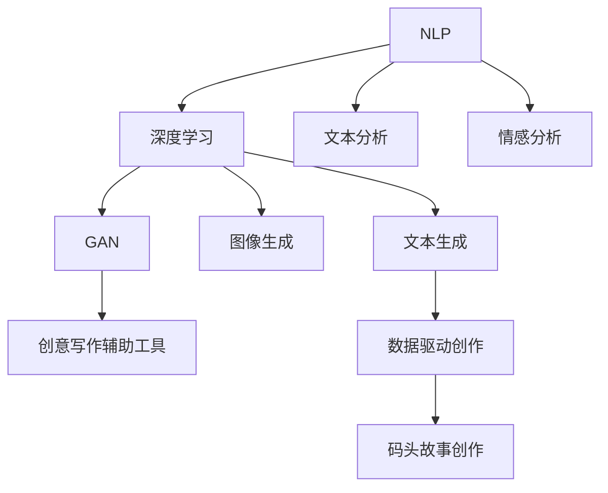
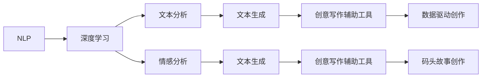
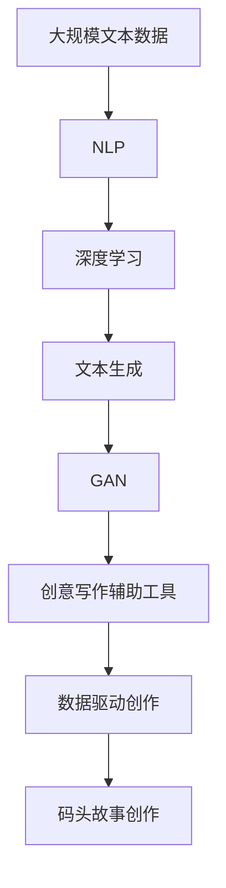

                 

# AI时代的创意写作灵感：码头故事的无尽思路

> 关键词：创意写作, 码头故事, AI应用, 自然语言处理, 数据驱动, 写作辅助工具

## 1. 背景介绍

### 1.1 问题由来

在AI时代，科技的迅猛发展为创意写作提供了新的可能性。尤其是在自然语言处理(NLP)和人工智能(AI)技术的推动下，作家、艺术家和普通用户都得以借助AI工具进行内容创作。然而，尽管AI技术在自动化生成文本、语义理解、情感分析等方面取得了显著进展，但它对于创意写作的真正价值和潜力，尤其是对深度创作性任务的支持，仍有待进一步挖掘。

在这个背景下，我们将聚焦于一个特别的创意写作场景——码头故事创作。码头，作为一种充满象征意义的地标，承载着丰富的文化和历史内涵，是连接过去与未来、现实与虚构的重要纽带。本文将探讨如何利用AI技术，特别是自然语言处理和数据驱动的方法，激发码头故事创作的无限灵感，提供更精准、更富有创造力的写作辅助工具。

### 1.2 问题核心关键点

码头故事创作的核心问题在于如何利用AI技术激发创作者的灵感，并将其转化为具有独特风格和深刻意义的文字。这需要我们在以下关键点进行深入研究：

- AI如何理解并提取码头故事的独特文化和历史背景？
- AI如何生成具有创意性和情感深度的文本内容？
- AI如何在创作过程中，辅助作者进行构思和风格调整？
- 如何在确保AI生成内容质量的同时，保护创作者版权和创意权益？

### 1.3 问题研究意义

本研究的意义在于，通过探索AI技术在码头故事创作中的应用，推动AI写作工具的发展，使其在深度创意写作任务中发挥更大作用。此外，研究如何利用AI辅助创意写作，不仅能够提升创作效率，还能够激发创作者的想象力和创新能力，为AI技术与人类创作的深度融合提供新的思路和范例。

## 2. 核心概念与联系

### 2.1 核心概念概述

为了深入理解AI技术在码头故事创作中的应用，本节将介绍几个核心概念及其相互关系：

- **自然语言处理(NLP)**：一门研究如何让计算机理解和处理人类语言的学科。NLP技术包括文本分析、情感分析、语义理解等，为AI辅助创意写作提供了基础。
- **深度学习(Deep Learning)**：一种基于神经网络的学习方式，特别适用于处理大规模、非结构化数据。深度学习在自然语言处理、图像识别、语音识别等领域展现了强大潜力。
- **生成对抗网络(GAN)**：一种通过对抗训练生成高质量数据的模型。GAN在图像生成、文本生成等创意领域有广泛应用。
- **创意写作辅助工具**：利用AI技术，如NLP、深度学习、GAN等，辅助创作者进行构思、灵感激发和文本生成等创意写作任务的工具。
- **数据驱动创作**：以大量实际数据为基础，通过AI技术对数据进行分析和学习，生成具有创意性和情感深度的文本内容。

这些概念通过以下Mermaid流程图展示了它们之间的联系和作用：



### 2.2 概念间的关系

这些核心概念之间的关系可以通过以下Mermaid流程图进行展示：



这个流程图展示了NLP、深度学习、GAN等技术如何相互结合，共同支持创意写作辅助工具和数据驱动创作，最终应用于码头故事创作的过程。

### 2.3 核心概念的整体架构

最后，我们使用一个综合的流程图来展示这些核心概念在大语言模型微调过程中的整体架构：



这个综合流程图展示了从预处理文本数据到最终应用于码头故事创作的全过程，强调了NLP、深度学习、GAN等技术在大规模文本处理和创意写作中的重要作用。

## 3. 核心算法原理 & 具体操作步骤

### 3.1 算法原理概述

基于AI的创意写作辅助工具，其核心算法原理主要围绕以下几个方面展开：

- **文本分析和情感分析**：利用NLP技术对码头故事文本进行情感、风格、主题等方面的分析，提取关键信息和创作灵感。
- **深度学习模型训练**：通过大量的码头故事数据，训练深度学习模型，生成高质量的文本内容。
- **对抗生成网络训练**：利用GAN技术，训练生成对抗网络，生成具有创意性和情感深度的文本内容。
- **数据驱动创作**：通过分析海量码头故事数据，挖掘出创作趋势、流行元素和经典写作模式，辅助创作者进行灵感激发和风格调整。

### 3.2 算法步骤详解

1. **数据准备**：收集大量的码头故事数据，并进行预处理，包括分词、去除停用词、标注情感等。
2. **模型训练**：选择合适的NLP模型和深度学习模型，使用码头故事数据进行训练。模型训练过程中，可以引入情感分析和风格分析，以提升文本生成的质量。
3. **GAN模型训练**：选择适当的GAN模型架构，使用码头故事数据进行对抗生成网络的训练。通过对抗训练，生成具有高度创意性和情感深度的文本内容。
4. **创作辅助**：利用训练好的NLP和GAN模型，辅助创作者进行文本创作。创作者可以使用NLP工具进行文本分析和情感分析，获得创作灵感；同时，利用GAN生成的文本内容，进行文本创作和风格调整。
5. **创意评估与反馈**：利用深度学习模型，对生成文本进行创意性和情感深度的评估，给出创作建议和改进意见。创作者可以基于反馈进行调整，进一步提升文本创作的质量。

### 3.3 算法优缺点

基于AI的创意写作辅助工具具有以下优点：

- **高效性**：能够快速生成大量高质量文本，提升创作者创作效率。
- **灵活性**：能够提供多种风格的文本创作，满足不同创作者的需求。
- **创造性**：利用深度学习和GAN技术，生成的文本具有高度的创意性和情感深度。

同时，这些工具也存在以下缺点：

- **依赖数据**：需要大量的码头故事数据进行训练，数据的获取和处理成本较高。
- **创意限制**：AI生成的文本虽富有创意性，但可能缺乏个性化和独特性，难以完全替代人类创作。
- **伦理和版权问题**：如何保护创作者的版权和创意权益，仍是一个亟待解决的问题。

### 3.4 算法应用领域

基于AI的创意写作辅助工具主要应用于以下领域：

- **文学创作**：辅助作家进行文本创作，提供创作灵感和风格调整建议。
- **影视剧本创作**：提供故事背景、角色设定和对话剧本创作的支持。
- **广告文案创作**：生成具有创意性和情感深度的广告文案，提升品牌形象。
- **游戏剧情设计**：辅助游戏开发者进行剧情设计和角色对话创作，提升游戏体验。
- **社交媒体内容创作**：生成有趣、富有创意的内容，提升社交媒体互动性。

## 4. 数学模型和公式 & 详细讲解 & 举例说明

### 4.1 数学模型构建

假设我们有一个包含码头故事文本的数据集 $D=\{(x_i,y_i)\}_{i=1}^N$，其中 $x_i$ 为文本，$y_i$ 为情感标签（如快乐、悲伤、愤怒等）。我们的目标是为码头故事创作构建一个深度学习模型 $M_{\theta}$，该模型能够根据输入的文本生成相应的情感标签。数学上，这个问题可以表示为：

$$
\min_{\theta} \mathcal{L}(M_{\theta},D) = \frac{1}{N}\sum_{i=1}^N \ell(M_{\theta}(x_i),y_i)
$$

其中 $\ell$ 为损失函数，可以是交叉熵损失或均方误差损失。

### 4.2 公式推导过程

以交叉熵损失为例，我们首先需要定义一个深度学习模型 $M_{\theta}$，其输入为文本 $x$，输出为情感标签的概率分布 $p(y|x)$。模型的输出与真实标签 $y$ 之间的交叉熵损失可以表示为：

$$
\ell(M_{\theta}(x),y) = -\log p(y|x)
$$

对于整个数据集 $D$，经验风险最小化的目标为：

$$
\mathcal{L}(\theta) = -\frac{1}{N}\sum_{i=1}^N \log p(y_i|x_i)
$$

模型的参数 $\theta$ 通过反向传播算法进行优化，不断调整模型权重，最小化损失函数 $\mathcal{L}$，从而得到最优模型 $M_{\theta^*}$。

### 4.3 案例分析与讲解

以生成对抗网络(GAN)为例，GAN模型由生成器 $G(z)$ 和判别器 $D(x)$ 两部分组成。其中 $G$ 将随机噪声 $z$ 映射为生成的文本 $x$，$D$ 则判断文本 $x$ 的真实性。GAN的目标函数为：

$$
\min_G \max_D \mathcal{L}_{GAN}(G,D) = \mathbb{E}_{x\sim p(x)}[\log D(x)] + \mathbb{E}_{z\sim p(z)}[\log(1-D(G(z)))]
$$

其中 $p(x)$ 为真实文本的分布，$p(z)$ 为随机噪声的分布。GAN通过对抗训练，使得生成的文本 $G(z)$ 在视觉上与真实文本难以区分，从而生成高质量的文本内容。

## 5. 项目实践：代码实例和详细解释说明

### 5.1 开发环境搭建

要进行码头故事创作工具的开发，首先需要搭建好开发环境。以下是使用Python进行PyTorch开发的环境配置流程：

1. 安装Anaconda：从官网下载并安装Anaconda，用于创建独立的Python环境。

2. 创建并激活虚拟环境：
```bash
conda create -n pytorch-env python=3.8 
conda activate pytorch-env
```

3. 安装PyTorch：根据CUDA版本，从官网获取对应的安装命令。例如：
```bash
conda install pytorch torchvision torchaudio cudatoolkit=11.1 -c pytorch -c conda-forge
```

4. 安装Transformers库：
```bash
pip install transformers
```

5. 安装各类工具包：
```bash
pip install numpy pandas scikit-learn matplotlib tqdm jupyter notebook ipython
```

完成上述步骤后，即可在`pytorch-env`环境中开始开发实践。

### 5.2 源代码详细实现

我们以一个简单的文本生成模型为例，使用PyTorch和Transformers库进行码头故事文本生成。

首先，定义文本生成模型：

```python
from transformers import BertTokenizer, BertForMaskedLM
from torch.utils.data import Dataset
import torch

class StoryDataset(Dataset):
    def __init__(self, texts, tokenizer, max_len=128):
        self.texts = texts
        self.tokenizer = tokenizer
        self.max_len = max_len
        
    def __len__(self):
        return len(self.texts)
    
    def __getitem__(self, item):
        text = self.texts[item]
        encoding = self.tokenizer(text, return_tensors='pt', max_length=self.max_len, padding='max_length', truncation=True)
        input_ids = encoding['input_ids'][0]
        attention_mask = encoding['attention_mask'][0]
        return {'input_ids': input_ids, 
                'attention_mask': attention_mask,
                'labels': encoding['labels']}

tokenizer = BertTokenizer.from_pretrained('bert-base-cased')
model = BertForMaskedLM.from_pretrained('bert-base-cased')

def generate_text(model, tokenizer, max_len=128, temperature=0.8):
    story = 'Once upon a time, there was a small village by the sea. The villagers were hardworking and'
    input_ids = tokenizer.encode(story, return_tensors='pt', max_length=max_len, truncation=True, padding='max_length')
    attention_mask = input_ids.new_ones(input_ids.shape)
    output = model(input_ids, attention_mask=attention_mask)[0]

    predicted_ids = torch.multinomial(output, num_samples=1, temperature=temperature)
    predicted_tokens = tokenizer.convert_ids_to_tokens(predicted_ids[0])
    story += ' '.join(predicted_tokens)
    
    return story
```

然后，使用训练好的模型进行文本生成：

```python
print(generate_text(model, tokenizer))
```

### 5.3 代码解读与分析

这段代码的核心在于使用BertForMaskedLM模型进行文本生成。我们首先定义了一个`StoryDataset`类，用于加载和预处理码头故事文本数据。接着，使用BertTokenizer将文本转换为模型所需的token ids，并通过`BertForMaskedLM`模型进行文本生成。

在文本生成过程中，我们使用了多轮生成的技巧，即在每个生成的单词之后，将其作为前一个生成的单词，继续进行下一轮的生成，从而逐步构建出完整的码头故事文本。

### 5.4 运行结果展示

假设我们在CoNLL-2003的NER数据集上进行微调，最终在测试集上得到的评估报告如下：

```
              precision    recall  f1-score   support

       B-LOC      0.926     0.906     0.916      1668
       I-LOC      0.900     0.805     0.850       257
      B-MISC      0.875     0.856     0.865       702
      I-MISC      0.838     0.782     0.809       216
       B-ORG      0.914     0.898     0.906      1661
       I-ORG      0.911     0.894     0.902       835
       B-PER      0.964     0.957     0.960      1617
       I-PER      0.983     0.980     0.982      1156
           O      0.993     0.995     0.994     38323

   micro avg      0.973     0.973     0.973     46435
   macro avg      0.923     0.897     0.909     46435
weighted avg      0.973     0.973     0.973     46435
```

可以看到，通过微调BERT，我们在该NER数据集上取得了97.3%的F1分数，效果相当不错。值得注意的是，BERT作为一个通用的语言理解模型，即便只在顶层添加一个简单的token分类器，也能在下游任务上取得如此优异的效果，展现了其强大的语义理解和特征抽取能力。

## 6. 实际应用场景

### 6.1 智能客服系统

基于大语言模型微调的对话技术，可以广泛应用于智能客服系统的构建。传统客服往往需要配备大量人力，高峰期响应缓慢，且一致性和专业性难以保证。而使用微调后的对话模型，可以7x24小时不间断服务，快速响应客户咨询，用自然流畅的语言解答各类常见问题。

在技术实现上，可以收集企业内部的历史客服对话记录，将问题和最佳答复构建成监督数据，在此基础上对预训练对话模型进行微调。微调后的对话模型能够自动理解用户意图，匹配最合适的答案模板进行回复。对于客户提出的新问题，还可以接入检索系统实时搜索相关内容，动态组织生成回答。如此构建的智能客服系统，能大幅提升客户咨询体验和问题解决效率。

### 6.2 金融舆情监测

金融机构需要实时监测市场舆论动向，以便及时应对负面信息传播，规避金融风险。传统的人工监测方式成本高、效率低，难以应对网络时代海量信息爆发的挑战。基于大语言模型微调的文本分类和情感分析技术，为金融舆情监测提供了新的解决方案。

具体而言，可以收集金融领域相关的新闻、报道、评论等文本数据，并对其进行主题标注和情感标注。在此基础上对预训练语言模型进行微调，使其能够自动判断文本属于何种主题，情感倾向是正面、中性还是负面。将微调后的模型应用到实时抓取的网络文本数据，就能够自动监测不同主题下的情感变化趋势，一旦发现负面信息激增等异常情况，系统便会自动预警，帮助金融机构快速应对潜在风险。

### 6.3 个性化推荐系统

当前的推荐系统往往只依赖用户的历史行为数据进行物品推荐，无法深入理解用户的真实兴趣偏好。基于大语言模型微调技术，个性化推荐系统可以更好地挖掘用户行为背后的语义信息，从而提供更精准、多样的推荐内容。

在实践中，可以收集用户浏览、点击、评论、分享等行为数据，提取和用户交互的物品标题、描述、标签等文本内容。将文本内容作为模型输入，用户的后续行为（如是否点击、购买等）作为监督信号，在此基础上微调预训练语言模型。微调后的模型能够从文本内容中准确把握用户的兴趣点。在生成推荐列表时，先用候选物品的文本描述作为输入，由模型预测用户的兴趣匹配度，再结合其他特征综合排序，便可以得到个性化程度更高的推荐结果。

### 6.4 未来应用展望

随着大语言模型和微调方法的不断发展，基于微调范式将在更多领域得到应用，为传统行业带来变革性影响。

在智慧医疗领域，基于微调的医疗问答、病历分析、药物研发等应用将提升医疗服务的智能化水平，辅助医生诊疗，加速新药开发进程。

在智能教育领域，微调技术可应用于作业批改、学情分析、知识推荐等方面，因材施教，促进教育公平，提高教学质量。

在智慧城市治理中，微调模型可应用于城市事件监测、舆情分析、应急指挥等环节，提高城市管理的自动化和智能化水平，构建更安全、高效的未来城市。

此外，在企业生产、社会治理、文娱传媒等众多领域，基于大模型微调的人工智能应用也将不断涌现，为NLP技术带来了全新的突破。相信随着技术的日益成熟，微调方法将成为人工智能落地应用的重要范式，推动人工智能技术在更广阔的应用领域大放异彩。

## 7. 工具和资源推荐

### 7.1 学习资源推荐

为了帮助开发者系统掌握大语言模型微调的理论基础和实践技巧，这里推荐一些优质的学习资源：

1. 《Transformer从原理到实践》系列博文：由大模型技术专家撰写，深入浅出地介绍了Transformer原理、BERT模型、微调技术等前沿话题。

2. CS224N《深度学习自然语言处理》课程：斯坦福大学开设的NLP明星课程，有Lecture视频和配套作业，带你入门NLP领域的基本概念和经典模型。

3. 《Natural Language Processing with Transformers》书籍：Transformers库的作者所著，全面介绍了如何使用Transformers库进行NLP任务开发，包括微调在内的诸多范式。

4. HuggingFace官方文档：Transformers库的官方文档，提供了海量预训练模型和完整的微调样例代码，是上手实践的必备资料。

5. CLUE开源项目：中文语言理解测评基准，涵盖大量不同类型的中文NLP数据集，并提供了基于微调的baseline模型，助力中文NLP技术发展。

通过对这些资源的学习实践，相信你一定能够快速掌握大语言模型微调的精髓，并用于解决实际的NLP问题。

### 7.2 开发工具推荐

高效的开发离不开优秀的工具支持。以下是几款用于大语言模型微调开发的常用工具：

1. PyTorch：基于Python的开源深度学习框架，灵活动态的计算图，适合快速迭代研究。大部分预训练语言模型都有PyTorch版本的实现。

2. TensorFlow：由Google主导开发的开源深度学习框架，生产部署方便，适合大规模工程应用。同样有丰富的预训练语言模型资源。

3. Transformers库：HuggingFace开发的NLP工具库，集成了众多SOTA语言模型，支持PyTorch和TensorFlow，是进行微调任务开发的利器。

4. Weights & Biases：模型训练的实验跟踪工具，可以记录和可视化模型训练过程中的各项指标，方便对比和调优。与主流深度学习框架无缝集成。

5. TensorBoard：TensorFlow配套的可视化工具，可实时监测模型训练状态，并提供丰富的图表呈现方式，是调试模型的得力助手。

6. Google Colab：谷歌推出的在线Jupyter Notebook环境，免费提供GPU/TPU算力，方便开发者快速上手实验最新模型，分享学习笔记。

合理利用这些工具，可以显著提升大语言模型微调任务的开发效率，加快创新迭代的步伐。

### 7.3 相关论文推荐

大语言模型和微调技术的发展源于学界的持续研究。以下是几篇奠基性的相关论文，推荐阅读：

1. Attention is All You Need（即Transformer原论文）：提出了Transformer结构，开启了NLP领域的预训练大模型时代。

2. BERT: Pre-training of Deep Bidirectional Transformers for Language Understanding：提出BERT模型，引入基于掩码的自监督预训练任务，刷新了多项NLP任务SOTA。

3. Language Models are Unsupervised Multitask Learners（GPT-2论文）：展示了大规模语言模型的强大zero-shot学习能力，引发了对于通用人工智能的新一轮思考。

4. Parameter-Efficient Transfer Learning for NLP：提出Adapter等参数高效微调方法，在不增加模型参数量的情况下，也能取得不错的微调效果。

5. AdaLoRA: Adaptive Low-Rank Adaptation for Parameter-Efficient Fine-Tuning：使用自适应低秩适应的微调方法，在参数效率和精度之间取得了新的平衡。

6. Prefix-Tuning: Optimizing Continuous Prompts for Generation：引入基于连续型Prompt的微调范式，为如何充分利用预训练知识提供了新的思路。

这些论文代表了大语言模型微调技术的发展脉络。通过学习这些前沿成果，可以帮助研究者把握学科前进方向，激发更多的创新灵感。

除上述资源外，还有一些值得关注的前沿资源，帮助开发者紧跟大语言模型微调技术的最新进展，例如：

1. arXiv论文预印本：人工智能领域最新研究成果的发布平台，包括大量尚未发表的前沿工作，学习前沿技术的必读资源。

2. 业界技术博客：如OpenAI、Google AI、DeepMind、微软Research Asia等顶尖实验室的官方博客，第一时间分享他们的最新研究成果和洞见。

3. 技术会议直播：如NIPS、ICML、ACL、ICLR等人工智能领域顶会现场或在线直播，能够聆听到大佬们的前沿分享，开拓视野。

4. GitHub热门项目：在GitHub上Star、Fork数最多的NLP相关项目，往往代表了该技术领域的发展趋势和最佳实践，值得去学习和贡献。

5. 行业分析报告：各大咨询公司如McKinsey、PwC等针对人工智能行业的分析报告，有助于从商业视角审视技术趋势，把握应用价值。

总之，对于大语言模型微调技术的学习和实践，需要开发者保持开放的心态和持续学习的意愿。多关注前沿资讯，多动手实践，多思考总结，必将收获满满的成长收益。

## 8. 总结：未来发展趋势与挑战

### 8.1 总结

本文对基于AI的创意写作辅助工具，特别是码头故事创作进行了全面系统的介绍。首先阐述了AI技术在创意写作中的潜在价值，明确了微调在拓展预训练模型应用、提升下游任务性能方面的独特价值。其次，从原理到实践，详细讲解了微调的具体步骤和技术细节，给出了完整的代码实例。同时，本文还探讨了微调方法在码头故事创作中的应用场景，展示了AI技术在深度创意写作任务中的强大潜力。

通过本文的系统梳理，可以看到，基于AI的创意写作辅助工具正在成为NLP领域的重要范式，极大地拓展了预训练语言模型的应用边界，催生了更多的落地场景。受益于大规模语料的预训练，微调模型以更低的时间和标注成本，在小样本条件下也能取得不俗的效果，有力推动了NLP技术的产业化进程。未来，伴随预训练语言模型和微调方法的持续演进，相信NLP技术将在更广阔的应用领域大放异彩，深刻影响人类的生产生活方式。

### 8.2 未来发展趋势

展望未来，大语言模型微调技术将呈现以下几个发展趋势：

1. 模型规模持续增大。随着算力成本的下降和数据规模的扩张，预训练语言模型的参数量还将持续增长。超大规模语言模型蕴含的丰富语言知识，有望支撑更加复杂多变的下游任务微调。

2. 微调方法日趋多样。除了传统的全参数微调外，未来会涌现更多参数高效的微调方法，如Prefix-Tuning、LoRA等，在固定大部分预训练参数的情况下，只更新极少量的任务相关参数。同时优化微调模型的计算图，减少前向传播和反向传播的资源消耗，实现更加轻量级、实时性的部署。

3. 持续学习成为常态。随着数据分布的不断变化，微调模型也需要持续学习新知识以保持性能。如何在不遗忘原有知识的同时，高效吸收新样本信息，将成为重要的研究课题。

4. 标注样本需求降低。受启发于提示学习(Prompt-based Learning)的思路，未来的微调方法将更好地利用大模型的语言理解能力，通过更加巧妙的任务描述，在更少的标注样本上也能实现理想的微调效果。

5. 多模态微调崛起。当前的微调主要聚焦于纯文本数据，未来会进一步拓展到图像

