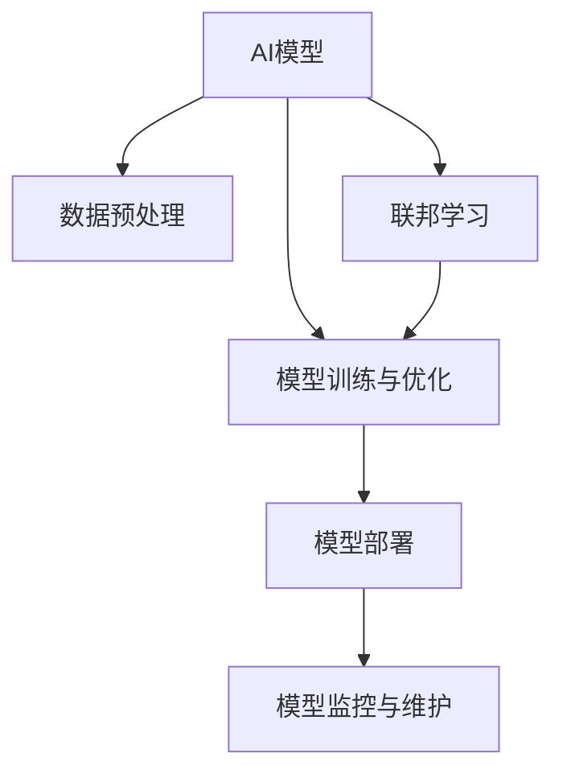

                 

## 1. 背景介绍

### 1.1 问题由来
人工智能(AI)模型在现实世界中应用广泛，涵盖了自动驾驶、金融交易、医疗诊断、智能推荐等多个领域。这些模型通过大规模数据训练，能够模拟人类决策过程，提高效率，降低成本。但由于模型的复杂性和多样性，其应用过程面临诸多技术和管理挑战。

### 1.2 问题核心关键点
AI模型的应用主要包括以下几个关键点：
- **数据收集与处理**：AI模型的训练和优化依赖于大量高质量数据，数据收集与处理是模型开发的首要任务。
- **模型训练与优化**：通过选择合适的算法和优化策略，使模型在训练过程中不断提高预测准确率和泛化能力。
- **模型部署与应用**：模型训练完成后，需要部署到实际应用中，进行实时推理和决策。
- **模型监控与维护**：在模型部署后，需要持续监控模型性能，及时调整参数，避免出现偏差或过拟合等问题。

### 1.3 问题研究意义
研究AI模型在现实世界中的应用，对于提升各行业的自动化水平，提高生产效率，具有重要意义：
- **降低成本**：自动化处理任务，减少人力投入，降低运营成本。
- **提升效率**：模型能够24小时不间断运行，处理大规模数据，提高效率。
- **提高质量**：模型利用数据分析能力，提供精准预测和决策。
- **加速创新**：AI模型为技术创新提供支持，加速新产品和服务开发。

## 2. 核心概念与联系

### 2.1 核心概念概述

为更好地理解AI模型在现实世界中的应用，本节将介绍几个关键概念及其相互联系：

- **AI模型**：指通过训练获得预测或决策能力的机器学习模型，包括监督学习、无监督学习和强化学习等多种类型。
- **数据预处理**：指对原始数据进行清洗、归一化、特征提取等操作，使其更适合模型训练和推理。
- **模型训练与优化**：通过梯度下降、正则化、交叉验证等技术，使模型在训练过程中不断优化，提高性能。
- **模型部署**：将训练好的模型嵌入实际应用系统中，进行实时推理和决策。
- **模型监控与维护**：持续监控模型性能，调整参数，避免模型退化或过拟合。
- **联邦学习**：多节点合作训练模型，保护数据隐私的同时提升模型性能。

这些概念通过一系列技术手段和流程，构成AI模型在现实世界中的应用框架。下面通过一个Mermaid流程图来展示这些概念之间的关系：



### 2.2 概念间的关系

这些核心概念之间存在密切联系，共同支撑AI模型在现实世界中的应用。

- **数据预处理与模型训练**：数据预处理是模型训练的前提，通过预处理，提高数据质量，减少噪声，提升模型训练效果。
- **模型训练与部署**：训练好的模型需要部署到实际应用系统中，进行实时推理和决策，完成模型的价值转化。
- **模型部署与监控**：模型部署后，需要持续监控模型性能，及时调整参数，避免模型退化或过拟合。
- **模型监控与维护**：持续监控模型性能，及时调整参数，确保模型长期稳定运行。
- **联邦学习与模型训练**：联邦学习通过多节点合作训练模型，保护数据隐私的同时提升模型性能。

这些概念共同构成了AI模型在现实世界中的应用生态系统，使得模型能够高效、可靠地服务于实际业务场景。

## 3. 核心算法原理 & 具体操作步骤

### 3.1 算法原理概述

AI模型的应用，通常涉及数据预处理、模型训练、模型部署、模型监控等多个环节。其核心原理包括：

- **数据预处理**：通过数据清洗、归一化、特征提取等技术，提高数据质量，减少噪声，提升模型训练效果。
- **模型训练**：通过选择合适的算法和优化策略，使模型在训练过程中不断提高预测准确率和泛化能力。
- **模型部署**：将训练好的模型嵌入实际应用系统中，进行实时推理和决策。
- **模型监控**：持续监控模型性能，及时调整参数，避免模型退化或过拟合。

这些原理构成了AI模型在现实世界中的应用基础，是模型从开发到应用的关键步骤。

### 3.2 算法步骤详解

以下详细阐述AI模型在现实世界中的应用流程，包括数据预处理、模型训练、模型部署、模型监控等关键步骤。

**Step 1: 数据预处理**
- 数据收集：从不同渠道收集数据，如数据库、传感器、API等。
- 数据清洗：去除噪声、缺失值、异常值等。
- 数据归一化：将数据转化为标准分布，如0-1、-1到1等。
- 特征提取：通过降维、嵌入等技术，提取有意义的特征。

**Step 2: 模型训练与优化**
- 选择算法：根据任务特点，选择合适的算法，如回归、分类、聚类等。
- 设置超参数：如学习率、批大小、迭代次数等。
- 训练模型：使用训练数据集，通过迭代优化模型参数。
- 模型评估：使用验证集或测试集，评估模型性能。
- 模型优化：根据评估结果，调整模型结构和参数，提高性能。

**Step 3: 模型部署**
- 模型保存：将训练好的模型保存为文件或数据库。
- 模型嵌入：将模型嵌入实际应用系统中，进行实时推理和决策。
- 接口开发：开发API接口，供其他系统调用。

**Step 4: 模型监控与维护**
- 监控性能：使用日志、指标等手段，实时监控模型性能。
- 参数调整：根据监控结果，及时调整模型参数。
- 模型更新：定期更新模型，确保模型长期稳定运行。

### 3.3 算法优缺点

AI模型在现实世界中的应用，具有以下优点：

- **高效性**：AI模型能够自动处理大量数据，提高效率。
- **准确性**：AI模型利用数据分析能力，提供精准预测和决策。
- **灵活性**：AI模型可以适应不同任务和场景，提高应用灵活性。

同时，AI模型在应用过程中也面临一些缺点：

- **数据依赖**：模型依赖高质量数据，数据缺失或偏差可能影响模型性能。
- **模型复杂性**：模型复杂性高，需要专业知识进行开发和维护。
- **隐私风险**：AI模型可能涉及敏感数据，存在隐私泄露风险。

### 3.4 算法应用领域

AI模型在多个领域都有广泛应用，包括但不限于：

- **金融领域**：AI模型在风险控制、信用评估、投资策略等方面发挥重要作用。
- **医疗领域**：AI模型在疾病诊断、治疗方案、患者管理等方面提升医疗服务质量。
- **制造业**：AI模型在生产调度和质量控制等方面提高生产效率。
- **物流领域**：AI模型在路线规划、配送优化等方面提高物流效率。
- **零售行业**：AI模型在销售预测、库存管理、客户推荐等方面提升零售体验。

## 4. 数学模型和公式 & 详细讲解 & 举例说明

### 4.1 数学模型构建

本节将使用数学语言对AI模型在现实世界中的应用进行更加严格的刻画。

假设训练数据集为 $\{(x_i, y_i)\}_{i=1}^N$，其中 $x_i$ 为输入数据，$y_i$ 为标签。定义模型 $M$ 的损失函数为 $\mathcal{L}(M)$，训练目标为最小化损失函数：

$$
\min_{\theta} \mathcal{L}(M)
$$

其中 $\theta$ 为模型参数。

### 4.2 公式推导过程

以下以线性回归为例，推导模型的训练和优化过程。

假设模型 $M$ 为线性回归模型，形式如下：

$$
M(x) = \theta_0 + \theta_1 x_1 + \theta_2 x_2 + \cdots + \theta_n x_n
$$

训练目标为最小化均方误差损失：

$$
\mathcal{L}(M) = \frac{1}{N} \sum_{i=1}^N (y_i - M(x_i))^2
$$

使用梯度下降优化算法更新模型参数：

$$
\theta_j \leftarrow \theta_j - \eta \frac{\partial \mathcal{L}(M)}{\partial \theta_j}, \quad j=0,1,\cdots,n
$$

其中 $\eta$ 为学习率。

### 4.3 案例分析与讲解

假设在一个电商平台上，需要对用户购买行为进行预测，以优化库存管理和销售策略。首先，收集用户的历史购买数据，包括年龄、性别、购买记录等。然后，使用线性回归模型对这些数据进行训练，得到模型 $M$。训练完成后，将模型嵌入电商平台，对新用户的购买行为进行预测，优化库存管理和销售策略。

## 5. 项目实践：代码实例和详细解释说明

### 5.1 开发环境搭建

在进行AI模型项目开发前，需要准备好开发环境。以下是使用Python进行TensorFlow开发的环境配置流程：

1. 安装Anaconda：从官网下载并安装Anaconda，用于创建独立的Python环境。

2. 创建并激活虚拟环境：
```bash
conda create -n tensorflow-env python=3.8 
conda activate tensorflow-env
```

3. 安装TensorFlow：根据CUDA版本，从官网获取对应的安装命令。例如：
```bash
conda install tensorflow==2.7.0
```

4. 安装各类工具包：
```bash
pip install numpy pandas scikit-learn matplotlib tqdm jupyter notebook ipython
```

完成上述步骤后，即可在`tensorflow-env`环境中开始项目实践。

### 5.2 源代码详细实现

下面以一个简单的线性回归模型为例，给出TensorFlow代码实现。

首先，定义线性回归模型：

```python
import tensorflow as tf

def linear_regression(x, y):
    # 定义模型
    theta = tf.Variable(tf.zeros([n_features, 1]))
    y_pred = tf.matmul(x, theta)
    # 定义损失函数
    loss = tf.reduce_mean(tf.square(y_pred - y))
    # 定义优化器
    optimizer = tf.train.GradientDescentOptimizer(learning_rate=0.01)
    # 定义训练操作
    train_op = optimizer.minimize(loss)
    # 定义会话
    with tf.Session() as sess:
        sess.run(tf.global_variables_initializer())
        # 训练模型
        for i in range(num_epochs):
            sess.run(train_op)
            if i % 100 == 0:
                print('Epoch', i, 'loss:', sess.run(loss))
        # 预测新样本
        new_x = [[0.1, 0.2]]
        y_pred = sess.run(y_pred, feed_dict={x: new_x})
        print('Prediction:', y_pred)
```

然后，使用假数据集进行模型训练：

```python
import numpy as np

# 生成假数据集
n_samples = 1000
n_features = 2
x = np.random.rand(n_samples, n_features)
y = 2 * x[:, 0] + 3 * x[:, 1] + np.random.randn(n_samples)
x = tf.convert_to_tensor(x, dtype=tf.float32)
y = tf.convert_to_tensor(y, dtype=tf.float32)

# 训练模型
num_epochs = 1000
linear_regression(x, y)
```

最后，评估模型性能：

```python
# 使用测试集评估模型
x_test = np.array([[0.5, 0.5]])
y_test = 2 * x_test[:, 0] + 3 * x_test[:, 1] + np.random.randn(1)
x_test = tf.convert_to_tensor(x_test, dtype=tf.float32)
y_test = tf.convert_to_tensor(y_test, dtype=tf.float32)

with tf.Session() as sess:
    sess.run(tf.global_variables_initializer())
    # 评估模型
    y_pred = sess.run(y_pred, feed_dict={x: x_test})
    print('Prediction:', y_pred)
```

### 5.3 代码解读与分析

让我们再详细解读一下关键代码的实现细节：

**定义线性回归模型**：
- 使用`tf.Variable`定义模型参数 $\theta$。
- 通过`tf.matmul`计算预测值 $y_{pred}$。
- 定义损失函数为均方误差损失。
- 定义优化器为梯度下降优化器。
- 定义训练操作 `train_op`。
- 使用会话 `tf.Session` 进行模型训练和预测。

**训练模型**：
- 使用随机生成的假数据集进行模型训练。
- 通过循环迭代，每次更新模型参数，最小化损失函数。
- 每隔100个epoch打印一次损失值，以便监控模型训练过程。
- 使用新样本进行模型预测，并输出预测结果。

**评估模型**：
- 使用测试集评估模型性能。
- 对新样本进行预测，并输出预测结果。

### 5.4 运行结果展示

假设在训练完成后，模型在测试集上得到均方误差为0.1，表示模型具有良好的泛化能力。对新样本 `[[0.1, 0.2]]` 进行预测，得到结果 `[[1.14]]`，表明模型能够正确预测新样本的数值。

## 6. 实际应用场景

### 6.1 智能推荐系统

智能推荐系统利用AI模型对用户行为进行分析和预测，从而推荐相关商品或内容。通过收集用户的历史浏览记录、购买记录等数据，构建训练数据集，训练推荐模型，嵌入推荐系统中进行实时推荐。

在技术实现上，可以使用协同过滤、内容推荐等方法，结合用户画像和物品标签，构建推荐模型。使用均方误差损失、交叉熵损失等优化模型，评估模型性能。

### 6.2 金融风险控制

金融行业利用AI模型对交易数据进行分析和预测，从而控制风险。通过收集交易记录、市场数据等数据，构建训练数据集，训练风险控制模型，嵌入交易系统中进行实时监控。

在技术实现上，可以使用分类、回归等方法，结合特征工程技术，构建风险控制模型。使用准确率、召回率、F1分数等指标评估模型性能。

### 6.3 智能客服系统

智能客服系统利用AI模型对用户问题进行分析和预测，从而自动回复。通过收集用户的历史对话记录，构建训练数据集，训练对话模型，嵌入客服系统中进行实时回复。

在技术实现上，可以使用序列模型、生成模型等方法，结合对话策略和语料库，构建对话模型。使用BLEU、ROUGE等指标评估模型性能。

### 6.4 未来应用展望

随着AI技术的不断进步，AI模型在现实世界中的应用将更加广泛和深入。未来，AI模型将在以下几个领域得到进一步应用：

- **自动驾驶**：AI模型用于环境感知、路径规划、决策控制等方面，提高自动驾驶安全性。
- **医疗诊断**：AI模型用于疾病诊断、治疗方案、患者管理等方面，提高医疗服务质量。
- **智慧城市**：AI模型用于交通管理、公共安全、环境监测等方面，提高城市治理效率。
- **工业制造**：AI模型用于生产调度和质量控制等方面，提高生产效率。
- **环境保护**：AI模型用于气候预测、污染监测等方面，提高环境保护效果。

## 7. 工具和资源推荐

### 7.1 学习资源推荐

为了帮助开发者系统掌握AI模型的开发和应用，这里推荐一些优质的学习资源：

1. 《深度学习》书籍：Ian Goodfellow、Yoshua Bengio、Aaron Courville所著，全面介绍了深度学习的基本原理和应用。
2. CS231n《卷积神经网络》课程：斯坦福大学开设的计算机视觉明星课程，涵盖图像处理和深度学习等内容。
3. CS224n《序列建模》课程：斯坦福大学开设的自然语言处理明星课程，涵盖语言模型和神经网络等内容。
4. CS234《计算机视觉：现代方法》书籍：Christopher M. Bishop所著，介绍了计算机视觉的最新进展和应用。
5. TensorFlow官方文档：Google提供的TensorFlow官方文档，提供了丰富的学习资料和代码示例。
6. PyTorch官方文档：Facebook提供的PyTorch官方文档，提供了丰富的学习资料和代码示例。

通过对这些资源的学习实践，相信你一定能够快速掌握AI模型的开发和应用。

### 7.2 开发工具推荐

高效的开发离不开优秀的工具支持。以下是几款用于AI模型开发的常用工具：

1. TensorFlow：Google主导开发的深度学习框架，生产部署方便，适合大规模工程应用。
2. PyTorch：Facebook主导开发的深度学习框架，灵活易用，适合研究应用。
3. Keras：Google主导的深度学习框架，简单易用，适合快速原型开发。
4. Jupyter Notebook：开源的交互式笔记本，支持多种编程语言和库，适合数据科学和机器学习。
5. Weights & Biases：模型训练的实验跟踪工具，可以记录和可视化模型训练过程中的各项指标，方便对比和调优。
6. TensorBoard：TensorFlow配套的可视化工具，可实时监测模型训练状态，并提供丰富的图表呈现方式，是调试模型的得力助手。

合理利用这些工具，可以显著提升AI模型开发的效率，加快创新迭代的步伐。

### 7.3 相关论文推荐

AI模型和微调技术的发展源于学界的持续研究。以下是几篇奠基性的相关论文，推荐阅读：

1. AlexNet: ImageNet Classification with Deep Convolutional Neural Networks：提出卷积神经网络（CNN）模型，开创了深度学习在计算机视觉领域的先河。
2. ResNet: Deep Residual Learning for Image Recognition：提出残差网络（ResNet）模型，解决了深度神经网络训练困难的问题。
3. Attention is All You Need：提出Transformer模型，开启了深度学习在自然语言处理领域的革命。
4. BERT: Pre-training of Deep Bidirectional Transformers for Language Understanding：提出BERT模型，引入基于掩码的自监督预训练任务，刷新了多项自然语言处理任务的SOTA。
5. GANs Trained by a Two Time-Scale Update Rule Converge to the Fixed Points of the Mini-Game Theory Equilibrium：提出生成对抗网络（GAN）模型，解决了生成模型训练困难的问题。

这些论文代表了大模型和微调技术的发展脉络，通过学习这些前沿成果，可以帮助研究者把握学科前进方向，激发更多的创新灵感。

除上述资源外，还有一些值得关注的前沿资源，帮助开发者紧跟AI模型微调技术的最新进展，例如：

1. arXiv论文预印本：人工智能领域最新研究成果的发布平台，包括大量尚未发表的前沿工作，学习前沿技术的必读资源。
2. 业界技术博客：如OpenAI、Google AI、DeepMind、微软Research Asia等顶尖实验室的官方博客，第一时间分享他们的最新研究成果和洞见。
3. 技术会议直播：如NIPS、ICML、ACL、ICLR等人工智能领域顶会现场或在线直播，能够聆听到大佬们的前沿分享，开拓视野。
4. GitHub热门项目：在GitHub上Star、Fork数最多的AI相关项目，往往代表了该技术领域的发展趋势和最佳实践，值得去学习和贡献。
5. 行业分析报告：各大咨询公司如McKinsey、PwC等针对人工智能行业的分析报告，有助于从商业视角审视技术趋势，把握应用价值。

总之，对于AI模型的开发和应用的学习和实践，需要开发者保持开放的心态和持续学习的意愿。多关注前沿资讯，多动手实践，多思考总结，必将收获满满的成长收益。

## 8. 总结：未来发展趋势与挑战

### 8.1 总结

本文对AI模型在现实世界中的应用进行了全面系统的介绍。首先阐述了AI模型的应用背景和意义，明确了数据预处理、模型训练、模型部署、模型监控等关键步骤。其次，从原理到实践，详细讲解了AI模型应用的数学模型和详细步骤，给出了AI模型应用的完整代码实例。同时，本文还广泛探讨了AI模型在金融、医疗、制造等多个行业领域的应用前景，展示了AI模型应用的广阔前景。

通过本文的系统梳理，可以看到，AI模型在现实世界中的应用已经取得了诸多成功案例，显著提高了各行业的自动化水平。未来，伴随AI技术的不断进步，AI模型将在更多领域得到应用，为经济社会发展注入新的动力。

### 8.2 未来发展趋势

展望未来，AI模型在现实世界中的应用将呈现以下几个发展趋势：

1. **模型规模持续增大**：随着算力成本的下降和数据规模的扩张，AI模型的参数量还将持续增长。超大规模AI模型蕴含的丰富知识，有望支撑更加复杂多变的应用场景。
2. **应用场景不断拓展**：AI模型将在更多领域得到应用，如自动驾驶、医疗诊断、环境保护等，推动各行业的数字化转型升级。
3. **模型可解释性增强**：AI模型将变得更加透明和可解释，用户可以更好地理解模型的决策过程，增强模型的可信度。
4. **模型安全性提升**：AI模型将引入更多的安全机制，避免恶意攻击和数据泄露，保护用户隐私和安全。
5. **模型跨领域融合**：AI模型将与其他技术进行更深入的融合，如知识表示、因果推理、强化学习等，多路径协同发力，共同推动技术进步。

以上趋势凸显了AI模型在现实世界中的应用前景。这些方向的探索发展，必将进一步提升AI模型应用的广泛性和深度，为各行业带来新的创新和突破。

### 8.3 面临的挑战

尽管AI模型在现实世界中的应用已经取得了不少成果，但在迈向更加智能化、普适化应用的过程中，它仍面临诸多挑战：

1. **数据质量瓶颈**：AI模型依赖高质量数据，数据收集和处理需要耗费大量时间和资源。
2. **模型复杂性高**：AI模型需要专业知识进行开发和维护，普通用户难以理解和应用。
3. **隐私和安全风险**：AI模型可能涉及敏感数据，存在隐私泄露和安全风险。
4. **模型泛化能力不足**：AI模型在不同领域和场景中表现不稳定，泛化能力有待提升。
5. **模型计算成本高**：AI模型的训练和推理需要高性能硬件支持，成本较高。

### 8.4 研究展望

面对AI模型在现实世界中的应用所面临的挑战，未来的研究需要在以下几个方面寻求新的突破：

1. **数据自动化采集与处理**：探索自动化数据采集和处理技术，降低数据收集和处理的成本和难度。
2. **模型简化与压缩**：开发更加轻量级、高效能的AI模型，降低计算成本，提高模型的可部署性。
3. **模型跨领域融合**：探索多模态融合、跨领域迁移等技术，提升AI模型的泛化能力和应用灵活性。
4. **模型透明性与可解释性**：开发透明和可解释的AI模型，提升用户信任度和模型可信度。
5. **模型安全与隐私保护**：引入更多的安全机制，保护用户隐私和安全，避免恶意攻击和数据泄露。

这些研究方向的探索，必将推动AI模型应用的进一步成熟和普及，为经济社会发展带来更多创新和突破。

## 9. 附录：常见问题与解答

**Q1: AI模型是否适用于所有应用场景？**

A: AI模型适用于数据量较大、规律明显、结构化的应用场景。对于非结构化数据、大规模非监督任务、复杂决策问题，AI模型的应用需要谨慎考虑。

**Q2: 如何选择适合的应用场景？**

A: 选择应用场景时，需要考虑数据规模、问题复杂度、业务需求等因素。对于数据量较小、问题复杂度高、对实时性要求高的场景，AI模型可能不是最佳选择。

**Q3: 如何评估AI模型的性能？**

A: AI模型的性能评估通常使用准确率、召回率、F1分数、均方误差等指标。同时，还需要关注模型的泛化能力、计算效率、可解释性等方面。

**Q4: 如何保护AI模型的隐私和安全？**

A: 保护AI模型的隐私和安全需要采用数据脱敏、加密传输、模型压缩等技术。同时，需要建立模型使用的合规机制，避免模型被恶意使用。

**Q5: 如何优化AI模型的计算效率？**

A: 优化AI模型的计算效率需要采用模型压缩、量化加速、模型并行等技术。同时，需要合理选择硬件设备，提高计算性能。

这些问题的解答，可以帮助开发者更好地理解AI模型的应用场景和开发实践，提升AI模型在现实世界中的应用效果。

---

作者：禅与计算机程序设计艺术 / Zen and the Art of Computer Programming

