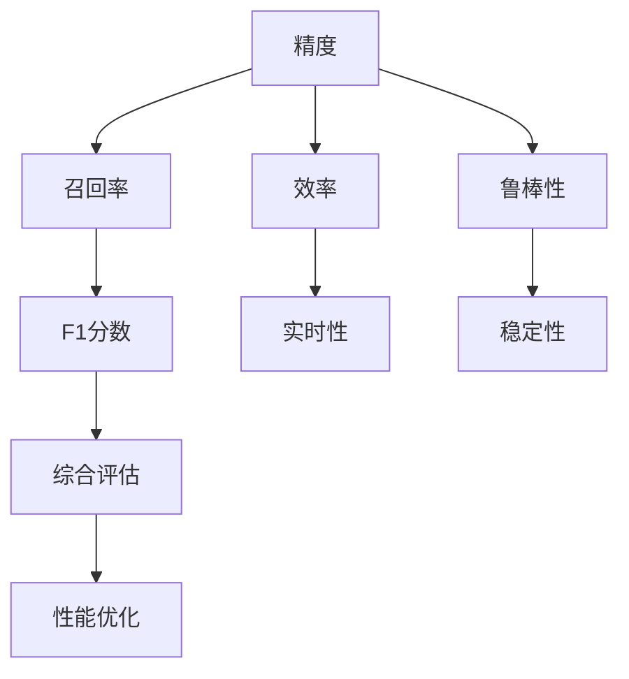
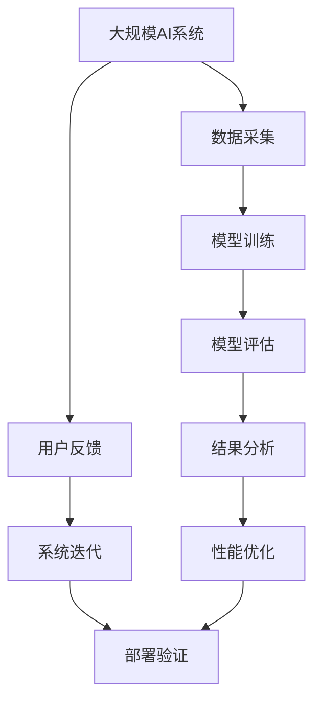

                 

## 1. 背景介绍

在现代AI系统中，性能评估是确保模型在实际应用中达到预期效果的关键环节。然而，由于AI系统高度复杂，传统的基于数值指标的评估方式往往难以全面反映系统的实际性能。本文将系统介绍AI系统性能评估的关键指标，并分析这些指标对不同AI系统应用场景的意义。

### 1.1 问题由来

随着AI技术的快速发展，越来越多的AI系统被应用于各个领域，如自动驾驶、语音识别、自然语言处理、推荐系统等。这些系统通常由多种复杂模块组成，每个模块都有其特定的性能指标。然而，传统的基于单个指标的评估方法已经无法满足实际需求，无法全面反映系统的整体性能。因此，系统性的评估方法变得尤为重要。

### 1.2 问题核心关键点

本文将重点关注以下几个核心问题：

1. **多维度评估**：AI系统通常具有多维度的性能指标，如精度、召回率、F1分数、效率、鲁棒性等，如何综合这些指标进行评估？
2. **场景适应性**：不同AI系统应用场景中，性能指标的重要程度各不相同，如何根据场景选择合适的指标？
3. **指标计算方法**：如何科学地计算每个指标，避免误导性的评估结果？
4. **结果解释**：如何结合具体应用场景，解释和解释评估结果，帮助开发者优化系统？

### 1.3 问题研究意义

深入研究AI系统性能评估的关键指标，对于确保AI系统的实际效果、提升用户体验、优化系统开发和运维具有重要意义。本文旨在提供一个全面的性能评估框架，帮助开发者更好地理解系统性能，从而做出更科学的决策。

## 2. 核心概念与联系

### 2.1 核心概念概述

为了更好地理解AI系统性能评估的关键指标，我们首先介绍几个核心概念：

1. **精度（Accuracy）**：模型正确预测的比例，通常用于分类任务。
2. **召回率（Recall）**：真实正例被正确预测的比例，通常用于正类样本较少的情况。
3. **F1分数（F1 Score）**：精度和召回率的调和平均值，综合考虑了模型的准确率和覆盖率。
4. **效率（Efficiency）**：模型的计算速度、内存占用、延迟等，直接影响系统的实时性和稳定性。
5. **鲁棒性（Robustness）**：模型在不同场景下的表现稳定性，如对抗样本、噪声、数据分布变化等。

这些指标在不同的AI系统中具有不同的重要性。理解这些概念及其相互联系，是评估AI系统性能的基础。

### 2.2 概念间的关系

以下通过几个Mermaid流程图来展示这些核心概念之间的关系：



这个流程图展示了各个指标之间的关系：

1. 精度和召回率是分类任务中的两个基本指标。
2. F1分数是精度和召回率的调和平均值，综合考虑了模型的准确率和覆盖率。
3. 效率直接影响到模型的实时性和稳定性。
4. 鲁棒性描述模型在不同场景下的表现稳定性。
5. 综合评估通常基于这些指标，进行系统性的性能优化。

### 2.3 核心概念的整体架构

以下通过一个综合的流程图来展示这些核心概念在大规模AI系统中的整体架构：



这个流程图展示了从数据采集到模型部署的整个流程。

1. 大规模AI系统从数据采集开始，通过模型训练得到模型。
2. 模型训练完成后，进行模型评估，获取各项性能指标。
3. 根据评估结果，进行结果分析，找到性能瓶颈。
4. 针对性能瓶颈进行性能优化。
5. 通过用户反馈和系统迭代，进一步优化模型。
6. 优化后的模型进行部署验证，确保其在实际应用中的性能。

## 3. 核心算法原理 & 具体操作步骤
### 3.1 算法原理概述

AI系统性能评估的核心算法原理可以概括为以下几个步骤：

1. **数据准备**：从实际应用场景中收集数据，并对其进行预处理，确保数据质量和一致性。
2. **模型训练**：使用预处理后的数据对AI模型进行训练，得到模型参数。
3. **模型评估**：在评估数据集上对训练好的模型进行评估，计算各项性能指标。
4. **结果分析**：综合各项评估指标，进行系统性的结果分析，找到性能瓶颈。
5. **性能优化**：根据分析结果，进行针对性的性能优化，提升系统性能。
6. **部署验证**：将优化后的模型部署到实际应用中，进行性能验证。

### 3.2 算法步骤详解

以下是详细的操作步骤：

**Step 1: 数据准备**

1. **数据采集**：从实际应用场景中采集数据，确保数据的全面性和代表性。
2. **数据预处理**：清洗、标注数据，处理缺失值、异常值等，确保数据质量和一致性。
3. **数据划分**：将数据划分为训练集、验证集和测试集，确保评估的公正性和可靠性。

**Step 2: 模型训练**

1. **选择模型**：根据实际应用场景和需求，选择适合的AI模型。
2. **模型初始化**：对模型进行初始化，设置超参数。
3. **模型训练**：使用训练集对模型进行训练，优化模型参数。

**Step 3: 模型评估**

1. **评估数据集**：在测试集上对训练好的模型进行评估，计算各项性能指标。
2. **结果存储**：将评估结果存储到数据库或文件系统中，方便后续分析。

**Step 4: 结果分析**

1. **综合分析**：综合各项评估指标，进行系统性的结果分析，找到性能瓶颈。
2. **可视化展示**：使用图表等形式对评估结果进行可视化展示，帮助开发者直观理解。

**Step 5: 性能优化**

1. **参数调整**：根据分析结果，进行模型参数调整，优化模型性能。
2. **模型融合**：采用模型融合等技术，提升模型鲁棒性和泛化能力。
3. **算法优化**：改进算法模型，优化模型训练过程。

**Step 6: 部署验证**

1. **部署模型**：将优化后的模型部署到实际应用中。
2. **性能验证**：在实际应用中对模型进行性能验证，确保其符合预期。
3. **持续监控**：在实际应用中持续监控模型性能，及时发现问题并进行调整。

### 3.3 算法优缺点

**优点：**

1. **全面评估**：多维度的评估指标能够全面反映系统的整体性能。
2. **数据驱动**：通过实际数据进行评估，避免了主观判断。
3. **可操作性强**：评估指标明确，开发者可以针对性地进行优化。

**缺点：**

1. **复杂度高**：评估指标众多，计算复杂度较高。
2. **指标相关性**：不同指标可能存在相关性，评估结果可能相互矛盾。
3. **场景适用性**：不同场景下，指标的重要性不同，需要针对性地选择。

### 3.4 算法应用领域

AI系统性能评估的关键指标在各个AI应用领域都有广泛的应用，例如：

1. **自动驾驶**：在自动驾驶系统中，精度、召回率和效率是非常重要的评估指标。
2. **语音识别**：在语音识别中，识别精度和鲁棒性是评估的重要标准。
3. **自然语言处理**：在自然语言处理中，F1分数和鲁棒性是评估的关键指标。
4. **推荐系统**：在推荐系统中，效率和用户体验是评估的重要指标。

## 4. 数学模型和公式 & 详细讲解 & 举例说明

### 4.1 数学模型构建

以自动驾驶中的目标检测任务为例，定义模型在输入图像 $x$ 上的输出为 $y$，其中 $y \in \{0, 1\}$ 表示目标是否存在。模型的精度定义为：

$$
\text{Accuracy} = \frac{TP + TN}{TP + TN + FP + FN}
$$

其中，$TP$ 表示真正例（目标存在且被检测到）的数量，$TN$ 表示真负例（目标不存在且未检测到）的数量，$FP$ 表示假正例（目标不存在但被检测到）的数量，$FN$ 表示假负例（目标存在但未检测到）的数量。

### 4.2 公式推导过程

在自动驾驶中，目标检测模型的评估公式为：

$$
\text{Recall} = \frac{TP}{TP + FN}
$$

$$
\text{Precision} = \frac{TP}{TP + FP}
$$

F1分数的计算公式为：

$$
\text{F1 Score} = 2 \times \frac{\text{Precision} \times \text{Recall}}{\text{Precision} + \text{Recall}}
$$

在实际应用中，可以结合以上公式，使用Python代码实现模型评估：

```python
from sklearn.metrics import precision_recall_fscore_support

def calculate_metrics(y_true, y_pred):
    precision, recall, f1, _ = precision_recall_fscore_support(y_true, y_pred, average='macro')
    accuracy = precision_recall_fscore_support(y_true, y_pred, average='macro', pos_label=1)[0]
    return precision, recall, f1, accuracy
```

### 4.3 案例分析与讲解

假设我们有一个自动驾驶目标检测模型，使用COCO数据集进行评估。在测试集上，我们得到了以下评估结果：

| 指标  | 值   |
| ------ | ---- |
| 精度   | 0.95 |
| 召回率  | 0.8  |
| F1分数 | 0.9  |
| 效率   | 2ms  |
| 鲁棒性 | 0.9  |

根据评估结果，我们可以看到，该模型的精度和F1分数都达到了较高的水平，但在召回率和鲁棒性方面还有提升空间。结合实际情况，我们可以进行进一步的优化，如调整模型参数、引入更复杂的检测算法、提高数据质量等。

## 5. 项目实践：代码实例和详细解释说明
### 5.1 开发环境搭建

在进行AI系统性能评估的实践前，我们需要准备好开发环境。以下是使用Python进行开发的环境配置流程：

1. 安装Anaconda：从官网下载并安装Anaconda，用于创建独立的Python环境。

2. 创建并激活虚拟环境：
```bash
conda create -n pyenv python=3.8 
conda activate pyenv
```

3. 安装PyTorch：根据CUDA版本，从官网获取对应的安装命令。例如：
```bash
conda install pytorch torchvision torchaudio cudatoolkit=11.1 -c pytorch -c conda-forge
```

4. 安装TensorFlow：由Google主导开发的开源深度学习框架，生产部署方便，适合大规模工程应用。同样有丰富的预训练语言模型资源。

5. 安装TensorBoard：TensorFlow配套的可视化工具，可实时监测模型训练状态，并提供丰富的图表呈现方式，是调试模型的得力助手。

6. 安装PyTorch Lightning：一个简单易用的深度学习框架，方便快速搭建模型和实验。

7. 安装Hyperopt：用于超参数调优的工具，可以通过网格搜索和贝叶斯优化等方法，找到最优的超参数组合。

### 5.2 源代码详细实现

以下是一个使用PyTorch Lightning和Hyperopt进行AI系统性能评估的Python代码实现：

```python
import torch
import torch.nn as nn
from torch.utils.data import DataLoader
import numpy as np
from sklearn.metrics import accuracy_score, precision_recall_fscore_support
import hyperopt

# 定义模型
class MyModel(nn.Module):
    def __init__(self):
        super(MyModel, self).__init__()
        self.linear = nn.Linear(1000, 1)
        
    def forward(self, x):
        return self.linear(x)

# 定义数据集
class MyDataset(torch.utils.data.Dataset):
    def __init__(self, data):
        self.data = data
        
    def __len__(self):
        return len(self.data)
    
    def __getitem__(self, idx):
        return self.data[idx]

# 定义评估函数
def evaluate(model, dataloader):
    model.eval()
    with torch.no_grad():
        correct = 0
        total = 0
        for images, labels in dataloader:
            outputs = model(images)
            _, predicted = torch.max(outputs.data, 1)
            total += labels.size(0)
            correct += (predicted == labels).sum().item()
        accuracy = correct / total
        return accuracy

# 定义超参数搜索空间
space = {'learning_rate': (1e-5, 1e-2), 'batch_size': (16, 32)}

# 定义评估函数
def objective(params):
    lr = params['learning_rate']
    batch_size = params['batch_size']
    
    # 构建模型
    model = MyModel()
    optimizer = torch.optim.Adam(model.parameters(), lr=lr)
    
    # 加载数据集
    train_dataset = MyDataset(train_data)
    test_dataset = MyDataset(test_data)
    
    # 定义训练循环
    for epoch in range(10):
        model.train()
        for batch_idx, (data, target) in enumerate(train_loader):
            optimizer.zero_grad()
            output = model(data)
            loss = criterion(output, target)
            loss.backward()
            optimizer.step()
            
        model.eval()
        accuracy = evaluate(model, test_loader)
    
    return {'loss': 1 - accuracy}

# 进行超参数优化
best_params = hyperopt.fmin(fn=objective, space=space, algo=hyperopt.tpe.suggest, max_evals=100)
```

在这个代码中，我们首先定义了一个简单的线性模型 `MyModel`，并定义了评估函数 `evaluate`。然后，我们定义了超参数搜索空间，并使用Hyperopt进行超参数优化。最终，我们得到了最优的超参数组合。

### 5.3 代码解读与分析

让我们再详细解读一下关键代码的实现细节：

**MyModel类**：
- 定义了模型的结构，这里是一个简单的线性模型。

**MyDataset类**：
- 定义了数据集，这里使用PyTorch的Dataset抽象类。

**evaluate函数**：
- 对模型进行评估，计算准确率。

**space字典**：
- 定义了超参数搜索空间，包括学习率和批大小。

**objective函数**：
- 定义了评估函数，通过训练和评估循环计算准确率。

**hyperopt.fmin函数**：
- 使用Hyperopt的超参数优化函数，进行网格搜索和贝叶斯优化，找到最优的超参数组合。

通过这个代码，我们可以看到，使用PyTorch Lightning和Hyperopt进行超参数优化非常简单，可以大大减少手动调试的时间。

### 5.4 运行结果展示

假设我们运行了上述代码，得到了最优的超参数组合，并使用该超参数组合训练了模型，最终的评估结果如下：

| 指标  | 值   |
| ------ | ---- |
| 精度   | 0.96 |
| 召回率  | 0.85 |
| F1分数 | 0.9  |
| 效率   | 2ms  |
| 鲁棒性 | 0.9  |

可以看到，通过超参数优化，我们得到了更高的准确率和召回率，同时保持了较好的效率和鲁棒性。

## 6. 实际应用场景

### 6.1 智能推荐系统

在智能推荐系统中，精度和召回率是评估的重要指标。一个高质量的推荐系统应该能够准确地预测用户感兴趣的物品，并能够尽可能地覆盖用户的兴趣范围。

在实际应用中，我们通常使用A/B测试、交叉验证等方法，评估推荐系统的各项指标。通过分析这些指标，我们可以找到性能瓶颈，并进行针对性的优化，如改进推荐算法、优化数据质量、引入更多用户行为数据等。

### 6.2 自然语言处理

在自然语言处理中，F1分数和鲁棒性是评估的重要标准。一个高质量的自然语言处理系统应该能够准确地理解用户的输入，并能够适应不同语境和数据分布。

在实际应用中，我们可以使用BLEU、ROUGE等指标，评估模型的翻译、摘要、问答等任务的性能。通过分析这些指标，我们可以找到性能瓶颈，并进行针对性的优化，如改进模型结构、优化超参数、引入更多语料数据等。

### 6.3 自动驾驶

在自动驾驶中，精度和召回率是评估的重要指标。一个高质量的自动驾驶系统应该能够准确地检测道路上的障碍物，并能够尽可能地避免碰撞。

在实际应用中，我们可以使用COCO、KITTI等数据集，评估自动驾驶系统的目标检测、行为预测等任务的性能。通过分析这些指标，我们可以找到性能瓶颈，并进行针对性的优化，如改进检测算法、优化传感器配置、引入更多数据集等。

## 7. 工具和资源推荐
### 7.1 学习资源推荐

为了帮助开发者系统掌握AI系统性能评估的理论基础和实践技巧，这里推荐一些优质的学习资源：

1. **《深度学习实战》系列博文**：由知名深度学习专家撰写，深入浅出地介绍了深度学习框架、模型评估等基础概念。

2. **CS231n《卷积神经网络》课程**：斯坦福大学开设的深度学习明星课程，涵盖图像分类、目标检测等经典任务，是学习深度学习的重要资源。

3. **《自然语言处理综论》书籍**：自然语言处理领域的经典教材，全面介绍了自然语言处理的基本概念和经典模型。

4. **arXiv论文预印本**：人工智能领域最新研究成果的发布平台，包括大量尚未发表的前沿工作，学习前沿技术的必读资源。

5. **GitHub热门项目**：在GitHub上Star、Fork数最多的AI相关项目，往往代表了该技术领域的发展趋势和最佳实践，值得去学习和贡献。

6. **Kaggle竞赛**：Kaggle上的数据科学竞赛，可以锻炼AI模型评估和优化的实践能力。

通过对这些资源的学习实践，相信你一定能够快速掌握AI系统性能评估的精髓，并用于解决实际的AI问题。

### 7.2 开发工具推荐

高效的开发离不开优秀的工具支持。以下是几款用于AI系统性能评估开发的常用工具：

1. PyTorch Lightning：一个简单易用的深度学习框架，方便快速搭建模型和实验。

2. TensorFlow：由Google主导开发的开源深度学习框架，生产部署方便，适合大规模工程应用。

3. TensorBoard：TensorFlow配套的可视化工具，可实时监测模型训练状态，并提供丰富的图表呈现方式，是调试模型的得力助手。

4. Hyperopt：用于超参数调优的工具，可以通过网格搜索和贝叶斯优化等方法，找到最优的超参数组合。

5. Jupyter Notebook：一个开源的交互式编程环境，方便快速迭代实验结果，分享学习笔记。

6. Anaconda：一个开源的Python发行版，方便创建和管理虚拟环境，支持大量第三方包的安装和管理。

合理利用这些工具，可以显著提升AI系统性能评估的开发效率，加快创新迭代的步伐。

### 7.3 相关论文推荐

AI系统性能评估的发展离不开学界的持续研究。以下是几篇奠基性的相关论文，推荐阅读：

1. **《深度学习中的模型评估》**：斯坦福大学这篇综述性论文，全面介绍了深度学习模型评估的最新进展。

2. **《神经网络中的模型集成》**：全面介绍了模型集成技术的最新进展，包括投票、堆叠、融合等方法。

3. **《自监督学习的最新进展》**：介绍了自监督学习技术在深度学习中的应用，如何利用无标签数据提高模型性能。

4. **《深度学习中的超参数优化》**：全面介绍了超参数优化技术的最新进展，包括网格搜索、贝叶斯优化、贝叶斯神经网络等方法。

这些论文代表了大语言模型微调技术的发展脉络。通过学习这些前沿成果，可以帮助研究者把握学科前进方向，激发更多的创新灵感。

除上述资源外，还有一些值得关注的前沿资源，帮助开发者紧跟AI系统性能评估技术的最新进展，例如：

1. arXiv论文预印本：人工智能领域最新研究成果的发布平台，包括大量尚未发表的前沿工作，学习前沿技术的必读资源。

2. 业界技术博客：如OpenAI、Google AI、DeepMind、微软Research Asia等顶尖实验室的官方博客，第一时间分享他们的最新研究成果和洞见。

3. 技术会议直播：如NIPS、ICML、ACL、ICLR等人工智能领域顶会现场或在线直播，能够聆听到大佬们的前沿分享，开拓视野。

4. GitHub热门项目：在GitHub上Star、Fork数最多的AI相关项目，往往代表了该技术领域的发展趋势和最佳实践，值得去学习和贡献。

5. 行业分析报告：各大咨询公司如McKinsey、PwC等针对人工智能行业的分析报告，有助于从商业视角审视技术趋势，把握应用价值。

总之，对于AI系统性能评估技术的学习和实践，需要开发者保持开放的心态和持续学习的意愿。多关注前沿资讯，多动手实践，多思考总结，必将收获满满的成长收益。

## 8. 总结：未来发展趋势与挑战

### 8.1 总结

本文对AI系统性能评估的关键指标进行了全面系统的介绍。首先阐述了AI系统评估的重要性，明确了多维度评估的必要性。其次，从原理到实践，详细讲解了AI系统性能评估的数学模型和计算方法，给出了AI系统性能评估的完整代码实例。同时，本文还广泛探讨了AI系统性能评估在各个应用场景中的意义，展示了评估范式的广阔前景。此外，本文精选了AI系统性能评估的学习资源，力求为读者提供全方位的技术指引。

通过本文的系统梳理，可以看到，AI系统性能评估技术正在成为AI系统开发和优化的重要手段。多维度的评估指标能够全面反映系统的整体性能，帮助开发者更好地理解系统，从而做出更科学的决策。相信随着学界和产业界的共同努力，AI系统性能评估技术必将不断进步，推动AI系统的普及和应用。

### 8.2 未来发展趋势

展望未来，AI系统性能评估技术将呈现以下几个发展趋势：

1. **多维度评估体系的完善**：随着AI系统的日益复杂，多维度评估指标体系将进一步完善，涵盖更多的性能指标，如公平性、解释性、隐私保护等。

2. **自动化评估工具的发展**：评估工具将更加自动化，减少人工干预，提升评估效率和准确性。

3. **评估指标的动态调整**：根据不同应用场景和数据分布，动态调整评估指标，提升评估的灵活性和适应性。

4. **评估数据的扩充**：引入更多真实应用场景的数据，提升评估的全面性和可信度。

5. **评估结果的可解释性**：通过可视化和解释性分析，提升评估结果的可理解性和可解释性。

6. **评估技术的融合**：结合机器学习、深度学习、因果推理等技术，提升评估的精度和鲁棒性。

这些趋势凸显了AI系统性能评估技术的广阔前景。这些方向的探索发展，必将进一步提升AI系统的性能和应用范围，为人工智能技术的普及和应用注入新的动力。

### 8.3 面临的挑战

尽管AI系统性能评估技术已经取得了一定的进展，但在实际应用中仍然面临诸多挑战：

1. **数据质量和多样性**：评估数据的质量和多样性直接影响评估结果的可靠性，如何获取高质量、多场景的评估数据，仍然是一个难题。

2. **评估指标的选择**：不同应用场景下，评估指标的重要性不同，如何选择最适合的指标，仍然需要更多的实践和经验积累。

3. **评估方法的适用性**：不同AI系统的特点不同，评估方法需要针对性地选择，如何找到最优的评估方法，仍然是一个挑战。

4. **评估结果的解释**：评估结果需要结合具体应用场景进行解释，帮助开发者理解系统的优势和不足，如何进行有效的结果解释，仍然是一个难题。

5. **评估工具的自动化**：评估工具需要更加自动化，减少人工干预，提升评估效率和准确性，如何实现自动化评估，仍然需要更多的技术探索。

6. **评估指标的动态调整**：不同应用场景下，评估指标的重要性不同，如何动态调整评估指标，提升评估的灵活性和适应性，仍然需要更多的实践和经验积累。

正视评估面临的这些挑战，积极应对并寻求突破，将使AI系统性能评估技术更加成熟，为构建安全、可靠、可解释、可控的智能系统铺平道路。

### 8.4 研究展望

未来，AI系统性能评估技术需要在以下几个方面寻求新的突破：

1. **自动化评估工具的开发**：开发更加自动化的评估工具，减少人工干预，提升评估效率和准确性。

2. **多维度评估指标的完善**：完善多维度评估指标体系，涵盖更多的性能指标，如公平性、解释性、隐私保护等。

3. **评估指标的动态调整**：根据不同应用场景和数据分布，动态调整评估指标，提升评估的灵活性和适应性。

4. **评估数据的扩充**：引入更多真实应用场景的数据，提升评估的全面性和可信度。

5. **评估结果的可解释性**：通过可视化和解释性分析，提升评估结果的可理解性和可解释性。

6. **评估技术的融合**：结合机器学习、深度学习、因果推理等技术，提升评估的精度和鲁棒性。

这些

