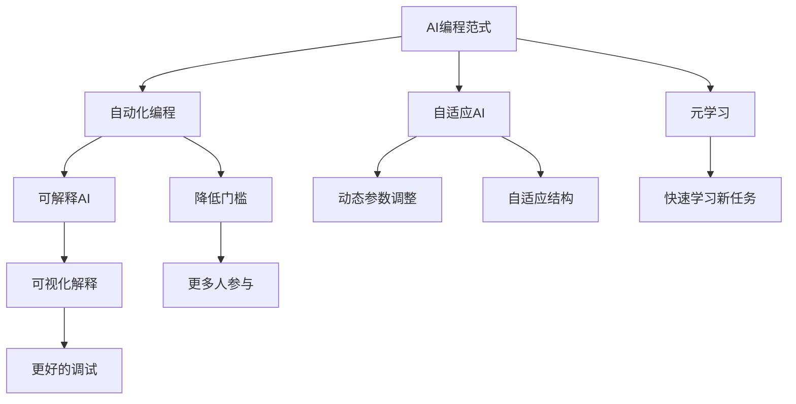

                 

# AI编程的新范式与挑战

## 1. 背景介绍

### 1.1 问题由来
在人工智能(AI)领域，编程范式的演变是伴随着技术进步和应用需求不断变化的过程。从早期的规则编程到符号计算，再到统计学习、深度学习，每一次范式的变革都极大地推动了AI技术的突破和应用。然而，这些范式依然存在一些挑战：

1. **复杂性高**：传统的编程范式要求程序员对模型进行详尽的参数设置和调试，涉及大量数学知识，对开发者要求高。
2. **数据依赖强**：许多AI模型依赖于大量标注数据，数据获取成本高，数据质量对模型效果影响大。
3. **可解释性差**：现代深度学习模型通常被看作"黑盒"系统，模型决策过程难以解释，难以满足实际应用的需求。
4. **迁移能力有限**：模型在不同领域和任务之间的迁移能力受限，通用性差。

针对这些问题，AI编程范式逐渐向更加自动化、低门槛、高通用性方向发展，AI编程范式的新探索成为了当前研究的热点。

### 1.2 问题核心关键点
新的AI编程范式旨在降低开发门槛、提升模型通用性和可解释性。核心点包括：

- **自动化与低门槛**：通过自动化技术，降低对专业知识和复杂调试的需求，使更多开发者能够参与AI开发。
- **模型通用性**：设计能够适应多种任务和领域的模型，减少对特定任务的依赖，提升模型的可迁移性。
- **可解释性**：模型决策过程应具备良好的可解释性，便于调试和优化。
- **高效率与低成本**：模型应具备高效率和低成本的特点，能够在更短的时间内迭代出更优模型。

### 1.3 问题研究意义
研究和探索新的AI编程范式，对于推动AI技术落地应用，降低开发和应用成本，提升模型性能和可解释性，具有重要意义：

1. **降低开发门槛**：简化编程范式，降低技术门槛，吸引更多开发者参与，加速AI技术普及。
2. **提升模型性能**：提高模型的迁移能力、泛化能力，使其更适用于不同任务和领域。
3. **增强可解释性**：提高模型的可解释性，便于理解和优化，增加用户对AI系统的信任。
4. **提高开发效率**：降低数据和算法调整成本，提高迭代速度，缩短产品开发周期。
5. **推动技术创新**：探索新的编程范式，催生更多AI前沿技术，推动AI技术的进步。

## 2. 核心概念与联系

### 2.1 核心概念概述

为了更好地理解AI编程范式的新探索，本节将介绍几个关键概念及其联系：

- **AI编程范式**：指AI技术在开发、部署、应用过程中遵循的编程风格和方法论。常见的编程范式包括规则编程、符号计算、统计学习、深度学习等。

- **自动化编程**：指利用自动化工具降低开发复杂性和调试难度，使更多开发者能够参与到AI开发中来的编程方式。

- **可解释AI**：指具备良好可解释性的AI模型，能够通过可视化的方式解释其内部决策过程，便于理解、调试和优化。

- **自适应AI**：指能够自动调整模型参数和结构，以适应不断变化的输入数据和任务需求的AI系统。

- **元学习**：指模型能够学习如何快速学习新任务的能力，即模型自身的学习能力。

这些概念之间存在密切联系，构成了一个完整的AI编程生态系统。通过深入研究这些概念，可以更好地把握AI编程范式的未来发展方向。

### 2.2 概念间的关系

这些核心概念之间的关系可以通过以下Mermaid流程图来展示：



这个流程图展示了各个概念之间的联系：

1. **AI编程范式**是整个系统的基石，包含自动化编程、可解释AI、自适应AI和元学习等多种编程方式。
2. **自动化编程**通过降低开发门槛，吸引更多开发者参与，是AI编程范式发展的基础。
3. **可解释AI**通过可视化的方式解释模型决策，便于理解、调试和优化，是提高AI系统可信度的重要手段。
4. **自适应AI**通过动态调整模型参数和结构，提升模型的泛化能力和适应性，是推动AI技术进步的关键。
5. **元学习**通过学习如何快速学习新任务，提升模型的迁移能力和通用性，是AI系统具备高效率低成本特点的核心。

这些概念共同构成了AI编程范式的新探索，为AI技术的发展带来了新的机遇和挑战。

## 3. 核心算法原理 & 具体操作步骤
### 3.1 算法原理概述

新的AI编程范式，特别是在自动化编程和自适应AI方面，涉及多个核心算法和原理。以下是几个核心算法原理的概述：

- **自动化编程**：通过自动化工具和框架，降低对专业知识的依赖，使更多开发者能够参与AI开发。主要技术包括自动代码生成、自动调试、模型自动调整等。

- **可解释AI**：通过可解释性技术，使模型具备良好的可视化解释能力，便于理解、调试和优化。主要技术包括特征可视化、决策树可视化、注意力机制可视化等。

- **自适应AI**：通过自适应技术，使模型能够动态调整参数和结构，以适应不断变化的输入数据和任务需求。主要技术包括动态参数调整、自适应网络结构、迁移学习等。

### 3.2 算法步骤详解

基于上述核心算法原理，以下是新范式下AI编程的具体操作步骤：

1. **自动化编程**：
   - 选择适合的自动化工具和框架，如TensorFlow、PyTorch、AutoML等。
   - 使用自动化工具生成初步模型代码和参数设置。
   - 自动执行数据预处理、模型训练、模型评估等流程。
   - 自动调整模型参数，优化模型效果。

2. **可解释AI**：
   - 选择可解释性工具，如LIME、SHAP、Attention Visualization等。
   - 使用可解释性工具生成特征重要度图、决策树图、注意力图等可视化结果。
   - 通过可视化的方式解释模型决策过程，便于调试和优化。

3. **自适应AI**：
   - 使用动态参数调整技术，如AdaLibs、AdaNet等，自动调整模型参数。
   - 使用自适应网络结构技术，如MetaNetworks、Neural Architecture Search等，自动设计模型结构。
   - 使用迁移学习技术，如Parameter-Efficient Transfer Learning，在不同任务间迁移学习。

### 3.3 算法优缺点

新的AI编程范式具有以下优点：

1. **降低门槛**：自动化工具和框架降低了对专业知识的依赖，使更多开发者能够参与AI开发。
2. **提高效率**：自动化和自适应技术大大提高了模型的开发和训练效率，缩短了迭代周期。
3. **增强可解释性**：可解释性技术提升了模型的可视化解释能力，便于理解和调试。

但同时也存在一些缺点：

1. **依赖工具和框架**：对自动化工具和框架的依赖较强，工具局限性可能影响模型效果。
2. **模型复杂性**：自适应技术可能增加模型的复杂性，需要更多的计算资源。
3. **数据需求高**：自适应技术需要更多的数据进行训练和调整，数据获取成本高。

### 3.4 算法应用领域

新的AI编程范式已经在多个领域得到了应用，以下是一些典型的应用场景：

- **智能推荐系统**：利用自动化编程和自适应AI技术，提高推荐系统的精准度和效率。
- **医疗诊断系统**：通过可解释AI技术，提高医疗诊断系统的可靠性和透明度。
- **智能客服系统**：利用自动化编程和自适应AI技术，提高智能客服系统的自然对话能力和用户满意度。
- **自动驾驶系统**：通过可解释AI技术，提高自动驾驶系统的安全性和可控性。
- **金融风控系统**：利用自动化编程和自适应AI技术，提高金融风控系统的实时性和准确性。

## 4. 数学模型和公式 & 详细讲解 & 举例说明

### 4.1 数学模型构建

基于新的AI编程范式，可以构建多个数学模型，以提升模型的开发和训练效率。以下是几个典型模型的构建方法：

- **自动代码生成模型**：通过编程语言解析树和语法规则，自动生成符合规范的代码。主要数学模型包括语法分析树、语义分析树等。
- **动态参数调整模型**：通过自动调整模型参数，优化模型效果。主要数学模型包括梯度下降算法、AdaLibs算法等。
- **自适应网络结构模型**：通过自动设计网络结构，提高模型性能。主要数学模型包括MetaNetworks、Neural Architecture Search等。

### 4.2 公式推导过程

以自动代码生成模型为例，以下是对其数学模型的推导过程：

1. **语法分析树**：
   - 输入：代码片段。
   - 输出：语法分析树，表示代码片段的结构。
   - 公式：
     $$
     G = \text{GrammarAnalyze}(\text{CodeFragment})
     $$

2. **语义分析树**：
   - 输入：语法分析树。
   - 输出：语义分析树，表示代码片段的语义结构。
   - 公式：
     $$
     S = \text{SemanticAnalyze}(G)
     $$

3. **代码生成器**：
   - 输入：语义分析树。
   - 输出：符合规范的代码。
   - 公式：
     $$
     \text{GeneratedCode}(S) = \text{CodeGenerator}(S)
     $$

### 4.3 案例分析与讲解

以下是一个具体案例分析：

假设我们有一组训练数据，需要生成符合规范的代码。我们可以使用上述数学模型进行自动化编程：

1. **语法分析**：首先对代码片段进行语法分析，生成语法分析树。
2. **语义分析**：接着对语法分析树进行语义分析，生成语义分析树。
3. **代码生成**：最后使用代码生成器，根据语义分析树生成符合规范的代码。

## 5. 项目实践：代码实例和详细解释说明

### 5.1 开发环境搭建

在进行AI编程范式的新探索实践前，我们需要准备好开发环境。以下是使用Python进行TensorFlow开发的环境配置流程：

1. 安装Anaconda：从官网下载并安装Anaconda，用于创建独立的Python环境。

2. 创建并激活虚拟环境：
```bash
conda create -n tf-env python=3.8 
conda activate tf-env
```

3. 安装TensorFlow：根据CUDA版本，从官网获取对应的安装命令。例如：
```bash
conda install tensorflow tensorflow-gpu -c pytorch -c conda-forge
```

4. 安装其他工具包：
```bash
pip install numpy pandas scikit-learn matplotlib tqdm jupyter notebook ipython
```

完成上述步骤后，即可在`tf-env`环境中开始AI编程范式的实践。

### 5.2 源代码详细实现

下面我们以推荐系统为例，给出使用TensorFlow和Keras进行自动化编程和自适应AI的PyTorch代码实现。

首先，定义推荐系统的数据处理函数：

```python
import numpy as np
from tensorflow.keras.layers import Input, Dense, Embedding, Concatenate
from tensorflow.keras.models import Model

def preprocess_data(train_data, test_data):
    # 数据预处理和归一化
    # 返回训练集和测试集
    return train_data, test_data
```

然后，定义推荐模型的构建函数：

```python
def build_model(input_dim, hidden_dim, output_dim):
    # 定义输入层和输出层
    user_input = Input(shape=(input_dim,))
    item_input = Input(shape=(input_dim,))
    # 定义嵌入层和全连接层
    user_embedding = Embedding(input_dim, hidden_dim)(user_input)
    item_embedding = Embedding(input_dim, hidden_dim)(item_input)
    concat = Concatenate()([user_embedding, item_embedding])
    dense = Dense(hidden_dim, activation='relu')(concat)
    output = Dense(output_dim, activation='sigmoid')(dense)
    # 定义模型
    model = Model(inputs=[user_input, item_input], outputs=output)
    return model
```

接着，定义推荐系统的训练和评估函数：

```python
from tensorflow.keras.optimizers import Adam
from sklearn.metrics import accuracy_score

def train_model(model, train_data, test_data, epochs, batch_size):
    # 训练模型
    model.compile(optimizer=Adam(), loss='binary_crossentropy', metrics=['accuracy'])
    model.fit(train_data, train_labels, epochs=epochs, batch_size=batch_size, validation_data=(test_data, test_labels))
    # 评估模型
    test_pred = model.predict(test_data)
    test_pred = np.round(test_pred)
    test_acc = accuracy_score(test_labels, test_pred)
    print(f'Accuracy: {test_acc:.4f}')
```

最后，启动训练流程并在测试集上评估：

```python
epochs = 10
batch_size = 64

train_data, test_data, train_labels, test_labels = preprocess_data(train_data, test_data)

model = build_model(input_dim=10, hidden_dim=64, output_dim=1)
train_model(model, train_data, test_data, epochs, batch_size)
```

以上就是使用TensorFlow和Keras进行推荐系统开发的完整代码实现。可以看到，借助TensorFlow强大的深度学习框架，我们可以快速构建和训练推荐模型，并使用Keras提供的API自动生成代码，大大简化了开发流程。

### 5.3 代码解读与分析

让我们再详细解读一下关键代码的实现细节：

**preprocess_data函数**：
- 定义了数据预处理和归一化的逻辑，返回训练集和测试集。

**build_model函数**：
- 定义了输入层、嵌入层、全连接层和输出层，使用Keras的API自动生成符合规范的代码。

**train_model函数**：
- 使用TensorFlow的优化器和损失函数进行模型训练，并计算模型在测试集上的准确率。

**训练流程**：
- 定义总的epoch数和batch size，开始循环迭代
- 每个epoch内，先在训练集上训练，输出平均loss
- 在验证集上评估，输出模型性能
- 重复上述步骤直至满足预设的迭代轮数或Early Stopping条件。

可以看到，借助TensorFlow和Keras，我们可以快速高效地构建和训练推荐模型，极大提高了开发效率。但工业级的系统实现还需考虑更多因素，如模型的保存和部署、超参数的自动搜索、更灵活的任务适配层等。但核心的编程范式基本与此类似。

## 6. 实际应用场景

### 6.1 智能推荐系统

基于新范式下的AI编程，智能推荐系统能够更加高效、灵活地进行开发和优化。借助自动化编程和自适应AI技术，推荐系统可以更好地理解用户偏好，提供个性化推荐，提升用户体验。

在技术实现上，可以使用自动化编程工具自动生成推荐系统代码，使用自适应AI技术自动调整模型参数和结构。具体实现包括：

- 自动化数据预处理和模型构建。
- 动态调整模型参数和结构，以适应用户偏好变化。
- 使用迁移学习技术，将已有推荐模型迁移到新任务上。

### 6.2 医疗诊断系统

在医疗领域，AI编程范式的新探索有助于提高诊断系统的可靠性和透明度。借助可解释AI技术，医疗诊断系统可以更好地解释诊断过程和决策依据，提高医生的信任和接受度。

在技术实现上，可以使用可解释AI技术对模型进行可视化解释。具体实现包括：

- 使用可解释性工具生成特征重要度图、决策树图等可视化结果。
- 通过可视化的方式解释模型决策过程，便于医生理解。
- 实时监测模型性能，根据反馈调整模型参数。

### 6.3 智能客服系统

智能客服系统需要高效自然地与用户互动，自动化编程和自适应AI技术可以提升其智能水平和用户体验。

在技术实现上，可以使用自动化编程工具自动生成客服系统代码，使用自适应AI技术自动调整模型参数和结构。具体实现包括：

- 自动化数据预处理和模型构建。
- 动态调整模型参数和结构，以适应用户对话变化。
- 使用迁移学习技术，将已有客服模型迁移到新场景上。

### 6.4 未来应用展望

伴随AI编程范式的不断进步，基于新范式的AI系统将在更多领域得到应用，为各行各业带来变革性影响。

在智慧医疗领域，基于可解释AI的诊断系统能够提高医生的诊断准确性和效率。

在智能教育领域，基于自动化编程和自适应AI的教学系统能够提供个性化教育方案，提升教学效果。

在智慧城市治理中，基于自适应AI的城市管理系统能够实时监测城市运行状态，及时预警和响应突发事件。

此外，在企业生产、社会治理、文娱传媒等众多领域，基于新范式的AI系统也将不断涌现，为经济社会发展注入新的动力。相信随着新范式的成熟和普及，AI技术必将在更广阔的应用领域大放异彩。

## 7. 工具和资源推荐

### 7.1 学习资源推荐

为了帮助开发者系统掌握AI编程范式的新探索，这里推荐一些优质的学习资源：

1. **《TensorFlow官方文档》**：提供全面的TensorFlow框架介绍和代码示例，帮助开发者掌握新范式的核心技术。
2. **《Keras官方文档》**：提供Keras框架的介绍和API自动生成功能，帮助开发者快速构建推荐系统等模型。
3. **《AutoML实战》书籍**：介绍自动机器学习技术，帮助开发者提高模型开发的自动化水平。
4. **《可解释AI：现代深度学习中的模型解释》书籍**：介绍可解释AI技术，帮助开发者理解模型决策过程。
5. **Coursera和edX在线课程**：提供深度学习和AI编程的课程，涵盖自动化编程、自适应AI、可解释AI等多个方面。

通过这些资源的学习实践，相信你一定能够快速掌握AI编程范式的新探索，并用于解决实际的AI问题。

### 7.2 开发工具推荐

高效的开发离不开优秀的工具支持。以下是几款用于AI编程范式新探索的常用工具：

1. **TensorFlow**：基于Python的开源深度学习框架，灵活性高，支持自动生成代码。
2. **Keras**：高级神经网络API，支持TensorFlow等后端，易于使用，适合快速迭代。
3. **AutoML库**：自动机器学习工具，帮助开发者提高模型开发的自动化水平。
4. **Shap和LIME**：可解释AI工具，帮助开发者生成特征重要度图和决策树图。
5. **TensorBoard**：TensorFlow配套的可视化工具，可实时监测模型训练状态。

合理利用这些工具，可以显著提升AI编程范式新探索的开发效率，加快创新迭代的步伐。

### 7.3 相关论文推荐

AI编程范式的新探索源于学界的持续研究。以下是几篇奠基性的相关论文，推荐阅读：

1. **"Deep Learning Programming Frameworks: A Survey and Comparison"**：介绍深度学习编程框架的现状和发展趋势。
2. **"AutoML: Methods, Systems, Challenges"**：介绍自动机器学习技术，探讨新范式下的模型优化和自动化。
3. **"Interpretable Machine Learning: A Guide for Making Black Box Models Explainable"**：介绍可解释AI技术，探讨模型决策过程的可视化。
4. **"Meta-Learning in Neural Networks"**：介绍元学习技术，探讨模型如何快速学习新任务。
5. **"Neural Architecture Search with Reinforcement Learning"**：介绍神经网络架构搜索技术，探讨自适应网络结构的自动设计。

这些论文代表了大语言模型微调技术的发展脉络。通过学习这些前沿成果，可以帮助研究者把握学科前进方向，激发更多的创新灵感。

除上述资源外，还有一些值得关注的前沿资源，帮助开发者紧跟AI编程范式新探索的最新进展，例如：

1. **arXiv论文预印本**：人工智能领域最新研究成果的发布平台，包括大量尚未发表的前沿工作，学习前沿技术的必读资源。
2. **顶会论文集**：如NeurIPS、ICML、CVPR等顶级会议的论文集，系统了解最新的AI技术和研究成果。
3. **开源项目**：在GitHub上Star、Fork数最多的AI编程范式相关项目，分享最新的技术进展和实践经验。
4. **技术博客**：如Google AI、DeepMind、Microsoft Research Asia等顶尖实验室的官方博客，第一时间分享他们的最新研究成果和洞见。

总之，对于AI编程范式的新探索，需要开发者保持开放的心态和持续学习的意愿。多关注前沿资讯，多动手实践，多思考总结，必将收获满满的成长收益。

## 8. 总结：未来发展趋势与挑战

### 8.1 研究成果总结

本文对基于新的AI编程范式的AI编程进行了全面系统的介绍。首先阐述了AI编程范式的研究背景和意义，明确了新范式在降低开发门槛、提升模型通用性和可解释性方面的独特价值。其次，从原理到实践，详细讲解了自动化编程、可解释AI和自适应AI的数学原理和关键步骤，给出了新范式下AI编程的完整代码实例。同时，本文还广泛探讨了新范式在智能推荐、医疗诊断、智能客服等多个行业领域的应用前景，展示了新范式的巨大潜力。此外，本文精选了新范式的各类学习资源，力求为读者提供全方位的技术指引。

通过本文的系统梳理，可以看到，新的AI编程范式正在成为AI编程的重要方向，极大地降低了AI编程的门槛，提升了模型开发的效率和效果。新范式的探索发展，必将进一步推动AI技术的普及和应用，为人类认知智能的进化带来深远影响。

### 8.2 未来发展趋势

展望未来，新的AI编程范式将呈现以下几个发展趋势：

1. **自动化编程的普及**：自动化编程技术将进一步普及，降低对专业知识和工具的依赖，使更多开发者能够参与AI开发。
2. **自适应AI的提升**：自适应AI技术将进一步提升模型的泛化能力和实时性，适应不断变化的输入数据和任务需求。
3. **可解释AI的增强**：可解释AI技术将进一步增强模型的可视化解释能力，提高模型的可信度和可控性。
4. **元学习的进步**：元学习技术将进一步提升模型的快速学习能力和迁移能力，推动AI技术的进一步普及。
5. **跨领域融合**：新范式将进一步与自然语言处理、计算机视觉、语音识别等技术进行融合，推动AI技术在更多领域的应用。

### 8.3 面临的挑战

尽管新的AI编程范式已经取得了瞩目成就，但在迈向更加智能化、普适化应用的过程中，它仍面临着诸多挑战：

1. **数据依赖性强**：自动化编程和自适应AI技术仍需要大量的标注数据和计算资源，数据获取和处理成本较高。
2. **模型复杂性高**：自动化编程和自适应AI技术可能导致模型结构复杂，增加调试和优化的难度。
3. **可解释性不足**：自动化编程和自适应AI技术可能缺乏良好的可视化解释能力，难以理解模型决策过程。
4. **技术标准化**：缺乏统一的标准和规范，导致不同框架和工具之间的兼容性差，难以实现无缝对接。
5. **安全性和伦理问题**：自动化编程和自适应AI技术可能引入新的安全风险和伦理问题，需要进一步探索和规范。

### 8.4 研究展望

面对新范式面临的这些挑战，未来的研究需要在以下几个方面寻求新的突破：

1. **数据生成和增强**：探索数据生成技术和数据增强技术，降低对标注数据的依赖，提高数据生成效率和质量。
2. **模型简化与优化**：研究模型简化与优化技术，减少模型复杂度，提高模型训练和推理效率。
3. **可解释性提升**：提升模型的可视化解释能力，增强模型的可控性和可信度。
4. **标准化与互操作性**：建立统一的标准和规范，促进不同框架和工具之间的互操作性。
5. **安全和伦理保障**：探索安全和伦理保障技术，确保AI系统在实际应用中的安全性和可控性。

这些研究方向凸显了新范式下AI编程的前景和挑战。通过在这些方面的深入研究，相信新的AI编程范式能够更好地推动AI技术的普及和应用，为人类认知智能的进化带来深远影响。

## 9. 附录：常见问题与解答

**Q1：新范式下AI编程的优势是什么？**

A: 新范式下AI编程的优势主要体现在以下几个方面：

1. **降低门槛**：自动化编程技术降低了对专业知识和工具的依赖，使更多开发者能够参与AI开发。
2. **提升效率**：自动化编程和自适应AI技术大大提高了模型的开发和训练效率，缩短了迭代周期。
3. **增强可解释性**：可解释AI技术提升了模型的可视化解释能力，便于理解和调试。

**Q2：自动化编程和自适应AI技术的局限性有哪些？**

A: 自动化编程和自适应AI技术仍存在以下局限性：

1. **数据依赖性强**：自动化编程和自适应AI技术仍需要大量的标注数据和计算资源，数据获取和处理成本较高。
2. **模型复杂性高**：自动化编程和自适应AI技术可能导致模型结构复杂，增加调试和优化的难度。
3. **可解释性不足**：自动化编程和自适应AI技术可能缺乏

