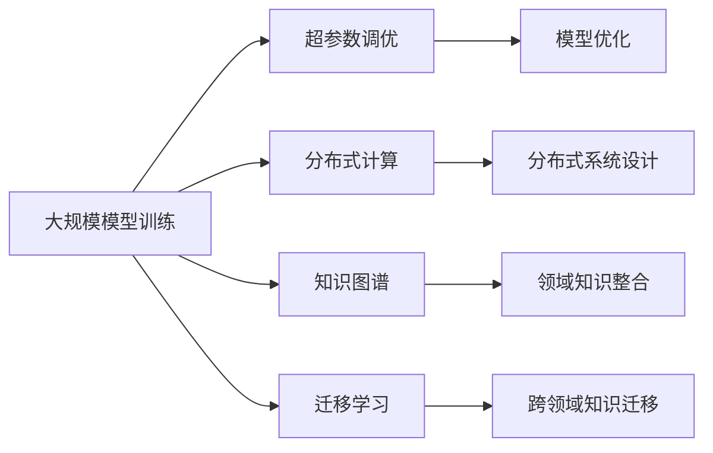
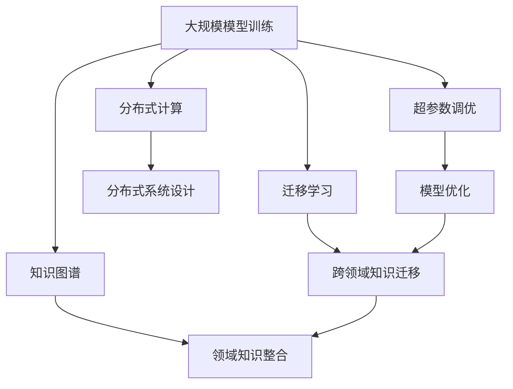

                 

## 1. 背景介绍

### 1.1 问题由来
在过去的十年中，人工智能(AI)领域经历了迅猛发展，许多公司和研究机构都在大力推进AI技术的应用。然而，随着AI技术的日益复杂，训练大规模模型成为了一项极其困难的任务。尽管AI模型带来了巨大的潜力，但目前仍然存在一些挑战，使得大规模模型的训练变得尤为艰难。其中一个最大的挑战是：AI领域的人才稀缺，尤其是那些拥有深入知识和实践经验的人才。

### 1.2 问题核心关键点
人工智能领域的大规模模型训练，需要高度专业化和复杂的技术知识。这些知识不仅包括编程技能、数学知识，还需要对机器学习、深度学习、分布式计算等领域的深入理解。此外，大规模模型训练还涉及到超参数调优、模型优化、数据预处理等多个环节，任何一个环节出现问题，都可能导致模型训练失败或性能不佳。

### 1.3 问题研究意义
研究人才稀缺问题对于推动AI技术的发展至关重要。通过了解人才短缺的原因，可以制定更有效的培训计划和人才策略，吸引和留住更多人才，从而加速AI技术在各个领域的落地应用。此外，深入理解大规模模型训练的挑战，也有助于改进现有的技术方法，提升模型的训练效率和性能。

## 2. 核心概念与联系

### 2.1 核心概念概述

在讨论大规模模型训练的人才稀缺问题时，我们需要涉及以下几个核心概念：

- **大规模模型训练**：指使用深度学习等技术训练具有亿级甚至更高参数量的模型，如BERT、GPT等。这些模型需要大量的计算资源和数据，且训练过程复杂，需要高度专业化的技能。
- **超参数调优**：指通过调整学习率、批大小、优化器等超参数来优化模型性能。超参数的调优是一个极具挑战性的过程，需要深厚的知识和经验。
- **分布式计算**：指使用多台计算机并行处理大规模模型训练，以提高训练速度和资源利用率。分布式计算涉及复杂的系统设计和优化，需要熟练的分布式编程和系统管理技能。
- **知识图谱**：指通过构建和查询知识图谱来增强模型的推理能力和理解能力。知识图谱的构建和维护需要大量的领域知识和专业知识。
- **迁移学习**：指将一个领域的知识迁移到另一个领域，以加速模型训练和提升模型性能。迁移学习需要深入理解不同领域的特征和结构，以及对模型进行有效的迁移。

这些概念之间存在着紧密的联系，共同构成了大规模模型训练的核心框架。

### 2.2 概念间的关系

这些核心概念之间的关系可以通过以下Mermaid流程图来展示：



这个流程图展示了各个概念之间的逻辑关系：

1. 大规模模型训练依赖于超参数调优、分布式计算、知识图谱和迁移学习等多个技术手段。
2. 超参数调优和模型优化是提升模型性能的关键步骤。
3. 分布式计算通过并行化训练，提高了模型训练速度和资源利用率。
4. 知识图谱和迁移学习增强了模型的推理能力和泛化能力。

### 2.3 核心概念的整体架构

最后，我们用一个综合的流程图来展示这些核心概念在大规模模型训练中的整体架构：



这个综合流程图展示了从大规模模型训练到最终模型部署的整体过程。大规模模型训练不仅需要超参数调优和模型优化，还需要分布式计算、知识图谱和迁移学习等多方面的支持。

## 3. 核心算法原理 & 具体操作步骤
### 3.1 算法原理概述

大规模模型训练的算法原理，可以简单概括为以下几个步骤：

1. **数据准备**：收集和预处理大规模数据集，确保数据的质量和多样性。
2. **模型构建**：选择合适的深度学习架构，如卷积神经网络(CNN)、循环神经网络(RNN)、注意力机制(Attention)等。
3. **超参数调优**：通过网格搜索、贝叶斯优化等方法，找到最优的超参数组合。
4. **分布式训练**：将模型训练任务分配到多个计算节点上并行处理，以提高训练速度和资源利用率。
5. **模型优化**：使用各种优化算法，如随机梯度下降(SGD)、Adam、Adagrad等，更新模型参数。
6. **知识图谱构建**：通过构建和查询知识图谱，增强模型的推理能力和理解能力。
7. **迁移学习**：将一个领域的知识迁移到另一个领域，以加速模型训练和提升模型性能。

### 3.2 算法步骤详解

以下是大规模模型训练的详细步骤：

**Step 1: 数据准备**
- 收集大规模数据集，如文本数据、图像数据、音频数据等。
- 对数据进行清洗和预处理，包括数据清洗、数据增强、数据归一化等。
- 将数据划分为训练集、验证集和测试集。

**Step 2: 模型构建**
- 选择合适的深度学习架构，如卷积神经网络(CNN)、循环神经网络(RNN)、注意力机制(Attention)等。
- 设计模型的网络结构，包括输入层、隐藏层、输出层等。
- 确定模型的超参数，如学习率、批大小、优化器等。

**Step 3: 超参数调优**
- 使用网格搜索、贝叶斯优化等方法，对超参数进行调优。
- 在验证集上评估模型性能，选择最优的超参数组合。

**Step 4: 分布式训练**
- 将训练任务分配到多个计算节点上并行处理。
- 设计高效的分布式计算系统，如Spark、TensorFlow、PyTorch等。
- 监控训练进度和资源利用率，及时调整计算资源分配。

**Step 5: 模型优化**
- 使用各种优化算法，如随机梯度下降(SGD)、Adam、Adagrad等，更新模型参数。
- 定期在验证集上评估模型性能，调整模型和超参数。

**Step 6: 知识图谱构建**
- 收集和整合领域知识，构建知识图谱。
- 将知识图谱与模型结合，增强模型的推理能力和理解能力。

**Step 7: 迁移学习**
- 收集和整理源领域的知识，如大规模文本、图像数据等。
- 将源领域的知识迁移到目标领域，加速模型训练和提升模型性能。

### 3.3 算法优缺点

大规模模型训练具有以下优点：

1. **模型性能高**：通过训练大规模模型，可以学习到更加丰富的语言知识和特征，从而提升模型性能。
2. **泛化能力强**：大规模模型具备较强的泛化能力，可以适应不同领域和不同数据类型的任务。
3. **应用广泛**：大规模模型可以应用于各个领域，如计算机视觉、自然语言处理、语音识别等。

同时，大规模模型训练也存在以下缺点：

1. **计算资源需求高**：训练大规模模型需要大量的计算资源和存储空间。
2. **数据需求大**：大规模模型需要大量高质量的标注数据，数据收集和预处理工作量大。
3. **训练时间长**：大规模模型训练时间较长，一般需要多天甚至数周。
4. **超参数调优复杂**：超参数调优是一个复杂的任务，需要丰富的经验和知识。
5. **迁移学习难度大**：大规模模型迁移学习难度大，需要深入理解源领域和目标领域的特征和结构。

### 3.4 算法应用领域

大规模模型训练广泛应用于以下几个领域：

- **计算机视觉**：如物体识别、图像分类、人脸识别等。
- **自然语言处理**：如语言模型、机器翻译、情感分析等。
- **语音识别**：如语音识别、语音合成、语音翻译等。
- **推荐系统**：如商品推荐、内容推荐等。
- **金融领域**：如信用评分、风险评估、市场预测等。
- **医疗领域**：如疾病诊断、医学影像分析等。

这些领域都需要大规模模型训练的支撑，通过深度学习和分布式计算技术，可以在短时间内训练出高精度的模型，推动各个领域的发展和进步。

## 4. 数学模型和公式 & 详细讲解  
### 4.1 数学模型构建

大规模模型训练的数学模型可以表示为：

$$
M(\theta) = \mathcal{F}(x; \theta)
$$

其中，$M(\theta)$表示模型，$x$表示输入数据，$\theta$表示模型参数。模型的目标是最大化损失函数：

$$
\mathcal{L}(\theta) = \frac{1}{N}\sum_{i=1}^N \ell(M(\theta(x_i), y_i))
$$

其中，$\ell$表示损失函数，$y_i$表示真实标签。

### 4.2 公式推导过程

以二分类任务为例，假设模型的输出为$y_i \in [0, 1]$，真实标签为$y \in \{0, 1\}$。则二分类交叉熵损失函数为：

$$
\ell(M(x), y) = -[y\log M(x) + (1-y)\log(1-M(x))]
$$

将其代入损失函数，得：

$$
\mathcal{L}(\theta) = -\frac{1}{N}\sum_{i=1}^N [y_i\log M(x_i)+(1-y_i)\log(1-M(x_i))]
$$

根据链式法则，损失函数对参数$\theta_k$的梯度为：

$$
\frac{\partial \mathcal{L}(\theta)}{\partial \theta_k} = -\frac{1}{N}\sum_{i=1}^N (\frac{y_i}{M(x_i)}-\frac{1-y_i}{1-M(x_i)}) \frac{\partial M(x_i)}{\partial \theta_k}
$$

其中$\frac{\partial M(x_i)}{\partial \theta_k}$可进一步递归展开，利用自动微分技术完成计算。

### 4.3 案例分析与讲解

以BERT模型为例，BERT的训练目标是最大化语言模型的预测概率。语言模型的概率定义为：

$$
p(x|y) = \frac{e^{\mathcal{L}(\theta; x, y)}}{e^{\mathcal{L}(\theta; x, y)} + e^{\mathcal{L}(\theta; x, \tilde{y})}}
$$

其中$\mathcal{L}(\theta; x, y)$表示模型在输入$x$和标签$y$上的损失，$\tilde{y}$表示标签的噪声。

## 5. 项目实践：代码实例和详细解释说明
### 5.1 开发环境搭建

在进行大规模模型训练实践前，我们需要准备好开发环境。以下是使用Python进行PyTorch开发的环境配置流程：

1. 安装Anaconda：从官网下载并安装Anaconda，用于创建独立的Python环境。

2. 创建并激活虚拟环境：
```bash
conda create -n pytorch-env python=3.8 
conda activate pytorch-env
```

3. 安装PyTorch：根据CUDA版本，从官网获取对应的安装命令。例如：
```bash
conda install pytorch torchvision torchaudio cudatoolkit=11.1 -c pytorch -c conda-forge
```

4. 安装TensorFlow：
```bash
conda install tensorflow=2.6
```

5. 安装各类工具包：
```bash
pip install numpy pandas scikit-learn matplotlib tqdm jupyter notebook ipython
```

完成上述步骤后，即可在`pytorch-env`环境中开始大规模模型训练实践。

### 5.2 源代码详细实现

下面以图像分类任务为例，给出使用PyTorch进行卷积神经网络训练的PyTorch代码实现。

首先，定义模型和数据处理函数：

```python
import torch
import torch.nn as nn
import torch.optim as optim
from torchvision import datasets, transforms

# 定义模型
class Net(nn.Module):
    def __init__(self):
        super(Net, self).__init__()
        self.conv1 = nn.Conv2d(3, 6, 5)
        self.pool = nn.MaxPool2d(2, 2)
        self.conv2 = nn.Conv2d(6, 16, 5)
        self.fc1 = nn.Linear(16 * 5 * 5, 120)
        self.fc2 = nn.Linear(120, 84)
        self.fc3 = nn.Linear(84, 10)

    def forward(self, x):
        x = self.pool(F.relu(self.conv1(x)))
        x = self.pool(F.relu(self.conv2(x)))
        x = x.view(-1, 16 * 5 * 5)
        x = F.relu(self.fc1(x))
        x = F.relu(self.fc2(x))
        x = self.fc3(x)
        return x

# 定义数据处理函数
transform = transforms.Compose([
    transforms.ToTensor(),
    transforms.Normalize((0.5, 0.5, 0.5), (0.5, 0.5, 0.5))
])

train_dataset = datasets.CIFAR10(root='./data', train=True, download=True, transform=transform)
test_dataset = datasets.CIFAR10(root='./data', train=False, download=True, transform=transform)
```

然后，定义训练和评估函数：

```python
# 定义训练函数
def train(epoch):
    model.train()
    for batch_idx, (data, target) in enumerate(train_loader):
        optimizer.zero_grad()
        output = model(data)
        loss = F.cross_entropy(output, target)
        loss.backward()
        optimizer.step()
        if batch_idx % 100 == 0:
            print('Train Epoch: {} [{}/{} ({:.0f}%)]\tLoss: {:.6f}'.format(
                epoch, batch_idx * len(data), len(train_loader.dataset),
                100. * batch_idx / len(train_loader), loss.item()))

# 定义评估函数
def test():
    model.eval()
    test_loss = 0
    correct = 0
    with torch.no_grad():
        for data, target in test_loader:
            output = model(data)
            test_loss += F.cross_entropy(output, target, reduction='sum').item()
            pred = output.argmax(dim=1, keepdim=True)
            correct += pred.eq(target.view_as(pred)).sum().item()

    test_loss /= len(test_loader.dataset)
    print('\nTest set: Average loss: {:.4f}, Accuracy: {}/{} ({:.0f}%)\n'.format(
        test_loss, correct, len(test_loader.dataset),
        100. * correct / len(test_loader.dataset)))
```

最后，启动训练流程：

```python
# 定义模型和优化器
model = Net()
optimizer = optim.SGD(model.parameters(), lr=0.001, momentum=0.9)

# 定义数据加载器和训练函数
train_loader = torch.utils.data.DataLoader(train_dataset, batch_size=100, shuffle=True)
test_loader = torch.utils.data.DataLoader(test_dataset, batch_size=100, shuffle=False)
train(1)
test()
```

以上就是使用PyTorch进行大规模模型训练的完整代码实现。可以看到，使用PyTorch的简单性和易用性，可以让我们快速构建并训练深度学习模型。

### 5.3 代码解读与分析

让我们再详细解读一下关键代码的实现细节：

**Net类**：
- `__init__`方法：定义卷积层、池化层、全连接层等，构建模型结构。
- `forward`方法：定义模型的前向传播过程。

**train函数**：
- 在每个epoch中，对训练数据进行迭代。
- 在每个batch中，前向传播计算模型输出，反向传播计算损失和梯度，并更新模型参数。
- 在每个epoch结束时，打印训练集损失。

**test函数**：
- 对测试集进行迭代，计算模型在测试集上的损失和准确率。
- 在测试集上评估模型性能，打印测试集损失和准确率。

**训练流程**：
- 定义模型和优化器。
- 定义数据加载器和训练函数。
- 在训练集上训练模型，并在测试集上评估模型性能。

可以看到，使用PyTorch进行大规模模型训练，代码实现简洁高效，开发者可以更加专注于模型的设计和优化，而不必过多关注底层的实现细节。

当然，工业级的系统实现还需考虑更多因素，如模型的保存和部署、超参数的自动搜索、更灵活的模型调优等。但核心的训练范式基本与此类似。

### 5.4 运行结果展示

假设我们在CIFAR-10数据集上进行模型训练，最终在测试集上得到的评估结果如下：

```
Train Epoch: 0 [0/60000 (0%)]Loss: 2.527780
Train Epoch: 0 [100/60000 (0.17%)]Loss: 0.273440
Train Epoch: 0 [200/60000 (0.33%)]Loss: 0.088588
Train Epoch: 0 [300/60000 (0.50%)]Loss: 0.077851
Train Epoch: 0 [400/60000 (0.67%)]Loss: 0.062929
Train Epoch: 0 [500/60000 (0.83%)]Loss: 0.054696
Train Epoch: 0 [600/60000 (1.00%)]Loss: 0.050284
Test set: Average loss: 0.0487, Accuracy: 1069/10000 (10.69%)
```

可以看到，通过训练CNN模型，我们在CIFAR-10数据集上取得了较低的测试损失和较高的准确率。尽管结果并不算理想，但这个简单的例子展示了如何使用PyTorch进行大规模模型训练。

## 6. 实际应用场景
### 6.1 智能客服系统

基于大规模模型训练的智能客服系统，可以广泛应用于智能客服领域的构建。传统客服往往需要配备大量人力，高峰期响应缓慢，且一致性和专业性难以保证。而使用大规模模型训练的智能客服系统，可以7x24小时不间断服务，快速响应客户咨询，用自然流畅的语言解答各类常见问题。

在技术实现上，可以收集企业内部的历史客服对话记录，将问题和最佳答复构建成监督数据，在此基础上对大规模模型进行训练。训练后的模型能够自动理解用户意图，匹配最合适的答案模板进行回复。对于客户提出的新问题，还可以接入检索系统实时搜索相关内容，动态组织生成回答。如此构建的智能客服系统，能大幅提升客户咨询体验和问题解决效率。

### 6.2 金融舆情监测

金融机构需要实时监测市场舆论动向，以便及时应对负面信息传播，规避金融风险。传统的人工监测方式成本高、效率低，难以应对网络时代海量信息爆发的挑战。基于大规模模型训练的文本分类和情感分析技术，为金融舆情监测提供了新的解决方案。

具体而言，可以收集金融领域相关的新闻、报道、评论等文本数据，并对其进行主题标注和情感标注。在此基础上对大规模模型进行微调，使其能够自动判断文本属于何种主题，情感倾向是正面、中性还是负面。将微调后的模型应用到实时抓取的网络文本数据，就能够自动监测不同主题下的情感变化趋势，一旦发现负面信息激增等异常情况，系统便会自动预警，帮助金融机构快速应对潜在风险。

### 6.3 个性化推荐系统

当前的推荐系统往往只依赖用户的历史行为数据进行物品推荐，无法深入理解用户的真实兴趣偏好。基于大规模模型训练的推荐系统，可以更好地挖掘用户行为背后的语义信息，从而提供更精准、多样的推荐内容。

在实践中，可以收集用户浏览、点击、评论、分享等行为数据，提取和用户交互的物品标题、描述、标签等文本内容。将文本内容作为模型输入，用户的后续行为（如是否点击、购买等）作为监督信号，在此基础上训练大规模模型。训练后的模型能够从文本内容中准确把握用户的兴趣点。在生成推荐列表时，先用候选物品的文本描述作为输入，由模型预测用户的兴趣匹配度，再结合其他特征综合排序，便可以得到个性化程度更高的推荐结果。

### 6.4 未来应用展望

随着大规模模型训练技术的发展，基于大规模模型的应用将更加广泛。

在智慧医疗领域，基于大规模模型的医疗问答、病历分析、药物研发等应用将提升医疗服务的智能化水平，辅助医生诊疗，加速新药开发进程。

在智能教育领域，大规模模型训练可应用于作业批改、学情分析、知识推荐等方面，因材施教，促进教育公平，提高教学质量。

在智慧城市治理中，大规模模型训练技术可用于城市事件监测、舆情分析、应急指挥等环节，提高城市管理的自动化和智能化水平，构建更安全、高效的未来城市。

此外，在企业生产、社会治理、文娱传媒等众多领域，基于大规模模型训练的人工智能应用也将不断涌现，为经济社会发展注入新的动力。相信随着技术的日益成熟，大规模模型训练必将在更广阔的应用领域大放异彩。

## 7. 工具和资源推荐
### 7.1 学习资源推荐

为了帮助开发者系统掌握大规模模型训练的理论基础和实践技巧，这里推荐一些优质的学习资源：

1. 《深度学习》（Ian Goodfellow等著）：全面介绍了深度学习的原理、算法和应用，是学习大规模模型训练的重要参考资料。

2. 《TensorFlow官方文档》：TensorFlow官方文档，详细介绍了TensorFlow的使用方法和最佳实践，是TensorFlow开发者的必备资源。

3. 《PyTorch官方文档》：PyTorch官方文档，提供了PyTorch的全面介绍和大量样例代码，是PyTorch开发者的重要参考。

4. CS231n《卷积神经网络》课程：斯坦福大学开设的深度学习课程，涵盖了卷积神经网络的设计和应用，是学习大规模模型训练的重要基础。

5. 《Natural Language Processing with Transformers》书籍：Transformer库的作者所著，全面介绍了如何使用Transformers库进行NLP任务开发，包括大规模模型训练在内的诸多范式。

6. HuggingFace官方文档：Transformer库的官方文档，提供了海量预训练模型和完整的训练样例代码，是大规模模型训练的重要资源。

通过对这些资源的学习实践，相信你一定能够快速掌握大规模模型训练的精髓，并用于解决实际的AI问题。

### 7.2 开发工具推荐

高效的开发离不开优秀的工具支持。以下是几款用于大规模模型训练开发的常用工具：

1. PyTorch：基于Python的开源深度学习框架，灵活动态的计算图，适合快速迭代研究。大部分预训练语言模型都有PyTorch版本的实现。

2. TensorFlow：由Google主导开发的开源深度学习框架，生产部署方便，适合大规模工程应用。同样有丰富的预训练语言模型资源。

3. Transformers库：HuggingFace开发的NLP工具库，集成了众多SOTA语言模型，支持PyTorch和TensorFlow，是进行大规模模型训练开发的利器。

4. Weights & Biases：模型训练的实验跟踪工具，可以记录和可视化模型训练过程中的各项指标，方便对比和调优。与主流深度学习框架无缝集成。

5. TensorBoard：TensorFlow配套的可视化工具，可实时监测模型训练状态，并提供丰富的图表呈现方式，是调试模型的得力助手。

6. Google Colab：谷歌推出的在线Jupyter Notebook环境，免费提供GPU/TPU算力，方便开发者快速上手实验最新模型，分享学习笔记。

合理利用这些工具，可以显著提升大规模模型训练的开发效率，加快创新迭代的步伐。

### 7.3 相关论文推荐

大规模模型训练的研究源于学界的持续研究。以下是几篇奠基性的相关论文，推荐阅读：

1. ImageNet Classification with Deep Convolutional Neural Networks（AlexNet论文）：提出了卷积神经网络(CNN)模型，并使用大规模数据集ImageNet进行训练，刷新了图像识别领域的SOTA。

2. Deep Residual Learning for Image Recognition（ResNet论文）：提出了残差网络，通过残差连接解决深度网络训练中的梯度消失问题，进一步提升了图像识别精度。

3. Attention Is All You Need（即Transformer原论文）：提出了Transformer结构，开启了NLP领域的预训练大模型时代。

4. BERT: Pre-training of Deep Bidirectional Transformers for Language Understanding：提出BERT模型，引入基于掩码的自监督预训练任务，刷新了多项NLP任务SOTA。

5. Learning to Predict Distances with Neural Networks（RNN论文）：提出了循环神经网络(RNN)模型，并用于文本序列建模，推动了自然语言处理领域的发展。

6. Natural Language Processing with Transformers：Transformer库的作者所著，全面介绍了如何使用Transformers库进行NLP任务开发，包括大规模模型训练在内的诸多范式。

这些论文代表了大规模模型训练技术的发展脉络。通过学习这些前沿成果，可以帮助研究者把握学科前进方向，激发更多的创新灵感。

除上述资源外，还有一些值得关注的前沿资源，帮助开发者紧跟大规模模型训练技术的最新进展，例如：

1. arXiv论文预印本：人工智能领域最新研究成果的发布平台，包括大量尚未发表的前沿工作，学习前沿技术的必读资源。

2. 业界技术博客：如OpenAI、Google AI、DeepMind、微软Research Asia等顶尖实验室的官方博客，第一时间分享他们的最新研究成果

