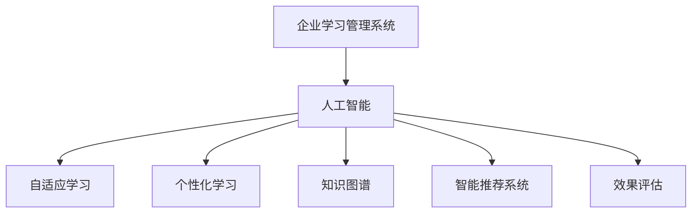
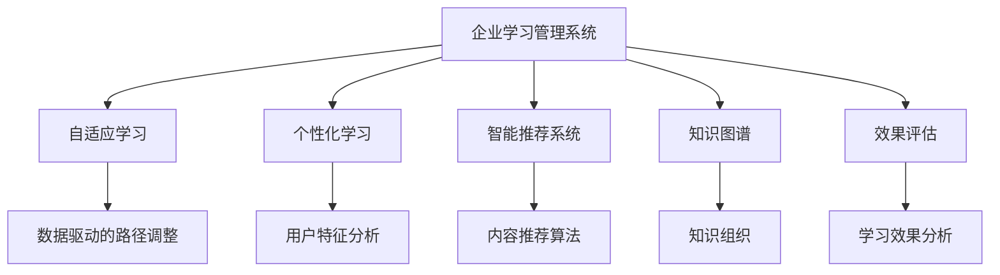
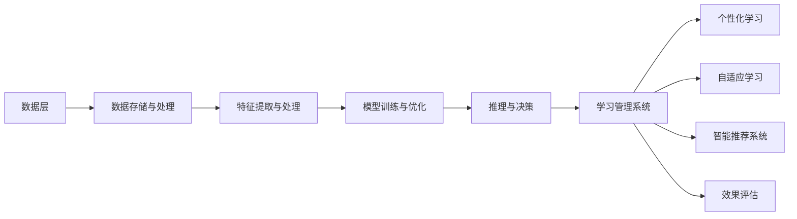
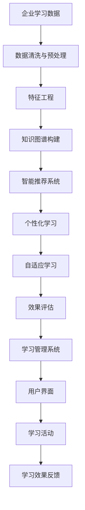

                 

# AI驱动的企业学习管理系统

> 关键词：企业学习管理,人工智能驱动,数据驱动,个性化学习,智能推荐系统,自适应学习,知识图谱

## 1. 背景介绍

### 1.1 问题由来
在当今快速变化的市场环境中，企业需要不断提升员工的技能和知识水平，以保持竞争力。传统的企业学习管理系统（LMS）往往存在以下问题：

- **学习效率低**：课程内容与员工需求不匹配，无法提供个性化的学习路径。
- **知识碎片化**：课程孤立，缺乏系统化整合，员工难以构建全面的知识体系。
- **学习体验差**：缺乏智能推荐，员工难以发现感兴趣和学习价值高的课程。
- **难以评估效果**：缺乏科学的评估方法，难以衡量员工学习效果和知识掌握程度。

为了解决这些问题，企业开始引入人工智能（AI）技术，驱动学习管理系统向智能化、个性化和数据驱动方向转型。AI驱动的企业学习管理系统能够更好地满足员工个性化学习需求，提升学习效率，优化学习路径，并提供科学的评估反馈。

### 1.2 问题核心关键点
AI驱动的企业学习管理系统核心关键点在于以下几个方面：

- **个性化学习**：通过数据分析和学习行为预测，为每个员工提供个性化的学习路径和推荐。
- **自适应学习**：根据学习进度和表现，动态调整学习内容和难度，确保学习效果最大化。
- **智能推荐系统**：基于学习历史、兴趣爱好、职业规划等因素，推荐适合的学习内容和课程。
- **知识图谱构建**：构建企业知识图谱，系统化整合知识资源，提供丰富的信息关联。
- **效果评估与反馈**：通过科学的评估方法，了解员工学习效果，及时反馈调整学习策略。

### 1.3 问题研究意义
AI驱动的企业学习管理系统对于企业人力资源的培养和人才储备具有重要意义：

- **提升员工技能**：通过个性化和自适应学习，快速提升员工专业技能，缩短学习周期。
- **降低培训成本**：优化课程内容和路径，避免重复学习和资源浪费，降低培训成本。
- **提高学习效率**：通过智能推荐和知识图谱，员工能够更高效地获取知识。
- **增强学习体验**：提供科学的评估反馈，增强员工的学习动力和满意度。
- **推动企业创新**：通过持续学习和知识更新，保持企业在技术和管理上的领先地位。

## 2. 核心概念与联系

### 2.1 核心概念概述

为更好地理解AI驱动的企业学习管理系统，本节将介绍几个密切相关的核心概念：

- **企业学习管理系统（LMS）**：一个软件平台，用于管理和支持企业内部培训和学习活动。
- **人工智能（AI）**：一种通过模拟人类智能过程，实现信息处理、决策和自动化任务的计算机技术。
- **自适应学习**：根据学习者的表现和反馈，动态调整学习内容和难度，以提高学习效果。
- **个性化学习**：根据学习者的特征和需求，提供定制化的学习资源和路径。
- **知识图谱**：一种知识表示技术，将知识组织成图形结构，用于信息检索和关联分析。
- **智能推荐系统**：通过算法推荐最适合学习者的课程和内容。
- **效果评估**：通过科学的评估方法，衡量学习效果和知识掌握程度。

这些核心概念之间的逻辑关系可以通过以下Mermaid流程图来展示：



这个流程图展示了几大核心概念之间的关系：

1. 企业学习管理系统通过引入AI技术，实现自适应学习和个性化学习。
2. AI驱动的学习管理系统需要知识图谱来支撑智能推荐和效果评估。
3. 自适应学习、个性化学习、智能推荐和效果评估共同构成AI驱动的学习管理系统的重要组成部分。

### 2.2 概念间的关系

这些核心概念之间存在着紧密的联系，形成了AI驱动的企业学习管理系统的完整生态系统。下面我通过几个Mermaid流程图来展示这些概念之间的关系。

#### 2.2.1 企业学习管理系统的AI驱动范式



这个流程图展示了大语言模型微调过程中各个概念的关系：

1. 企业学习管理系统引入自适应学习，根据用户学习路径和表现调整学习内容和难度。
2. 个性化学习通过分析用户特征和需求，提供定制化的学习资源。
3. 智能推荐系统通过知识图谱，推荐适合的学习内容和课程。
4. 效果评估通过科学方法，衡量用户学习效果和知识掌握程度。
5. 数据驱动的路径调整、用户特征分析和学习效果分析，共同构成了AI驱动的学习管理系统的高阶功能。

#### 2.2.2 AI驱动的企业学习管理系统的架构



这个流程图展示了AI驱动的企业学习管理系统架构：

1. 数据层存储和处理企业内部的学习数据。
2. 特征提取与处理，从数据中提取出有价值的用户特征和学习行为特征。
3. 模型训练与优化，通过机器学习模型预测用户的学习路径和课程推荐。
4. 推理与决策，根据模型输出结果，动态调整学习内容和推荐课程。
5. 学习管理系统，提供用户界面，实现个性化学习、自适应学习和智能推荐等功能。

### 2.3 核心概念的整体架构

最后，我们用一个综合的流程图来展示这些核心概念在大语言模型微调过程中的整体架构：



这个综合流程图展示了从数据处理到系统部署的完整过程。企业学习管理系统首先收集企业内部的学习数据，经过数据清洗和预处理，然后提取和构建知识图谱，支撑智能推荐和效果评估。最终通过学习管理系统，实现个性化学习、自适应学习等功能，并根据学习效果反馈调整学习策略。 通过这些流程图，我们可以更清晰地理解AI驱动的企业学习管理系统的工作原理和优化方向。

## 3. 核心算法原理 & 具体操作步骤
### 3.1 算法原理概述

AI驱动的企业学习管理系统的核心算法原理主要围绕个性化学习、自适应学习和智能推荐系统展开。这些算法原理基于数据驱动的方法，通过机器学习模型预测和优化学习路径和课程推荐。

### 3.2 算法步骤详解

AI驱动的企业学习管理系统一般包括以下几个关键步骤：

**Step 1: 数据收集与预处理**
- 收集企业内部的学习数据，包括用户基本信息、学习行为、课程评价等。
- 对数据进行清洗和预处理，去除噪声和缺失值。

**Step 2: 特征工程**
- 从清洗后的数据中提取有价值的用户特征和学习行为特征。
- 设计特征工程流程，包括特征选择、特征组合和特征编码等。

**Step 3: 知识图谱构建**
- 构建企业知识图谱，整合课程内容、学科知识等。
- 利用知识图谱进行信息检索和关联分析，提供丰富的信息关联。

**Step 4: 智能推荐系统设计**
- 设计推荐算法，如协同过滤、基于内容的推荐、混合推荐等。
- 通过模型训练和评估，优化推荐算法，提高推荐准确度。

**Step 5: 个性化学习路径设计**
- 根据用户特征和学习行为，设计个性化的学习路径。
- 利用模型预测用户的学习进度和效果，动态调整学习内容和难度。

**Step 6: 效果评估与反馈**
- 设计科学的评估方法，如测验、行为分析等，衡量学习效果和知识掌握程度。
- 根据评估结果，提供个性化的反馈和改进建议。

**Step 7: 学习管理系统部署与优化**
- 将上述算法和模型集成到学习管理系统中。
- 部署学习管理系统，进行用户测试和优化。

### 3.3 算法优缺点

AI驱动的企业学习管理系统具有以下优点：

- **个性化与自适应**：通过数据分析和机器学习，提供个性化的学习路径和自适应学习功能，提升学习效率。
- **智能推荐**：通过知识图谱和推荐算法，推荐适合的学习内容和课程，减少信息过载。
- **效果评估**：通过科学的评估方法，了解学习效果，提供改进建议。
- **数据驱动**：基于数据驱动的方法，不断提高系统性能和用户满意度。

但同时也存在一些缺点：

- **数据隐私**：需要收集和分析大量用户数据，可能引发隐私和数据安全问题。
- **模型复杂度**：需要构建复杂的机器学习模型，计算资源消耗较大。
- **算法鲁棒性**：在数据分布发生变化时，需要重新训练和调整模型，才能保持系统性能。
- **用户接受度**：部分用户可能对系统推荐和监控感到抵触，需要平衡技术应用和用户接受度。

### 3.4 算法应用领域

AI驱动的企业学习管理系统在多个领域得到了广泛应用，例如：

- **教育培训**：通过个性化的学习路径和智能推荐，提升学员的学习效果。
- **医疗培训**：提供科学的评估方法和反馈机制，提升医护人员的专业技能。
- **企业内部培训**：优化课程内容和学习路径，提高员工的学习效率和满意度。
- **人力资源管理**：通过学习管理系统，实现员工培训的自动化和系统化管理。
- **职业发展**：帮助员工规划职业路径，提供个性化学习和技能提升建议。

除了上述这些经典应用领域，AI驱动的企业学习管理系统还在更多场景中得到创新性应用，如智能招聘、员工绩效评估等，为企业的HR管理和员工发展提供了新的支持。

## 4. 数学模型和公式 & 详细讲解 & 举例说明

### 4.1 数学模型构建

本节将使用数学语言对AI驱动的企业学习管理系统的核心算法进行更加严格的刻画。

记企业学习数据集为 $D=\{(x_i,y_i)\}_{i=1}^N$，其中 $x_i$ 为用户特征和学习行为数据，$y_i$ 为课程推荐结果。定义模型 $M_{\theta}$ 为学习管理系统，其中 $\theta$ 为模型参数。

定义损失函数 $\mathcal{L}(\theta)$ 为模型预测结果与实际结果之间的差异，通过优化目标函数 $\min_{\theta} \mathcal{L}(\theta)$ 来训练模型。

### 4.2 公式推导过程

以下我们以协同过滤算法为例，推导推荐模型的损失函数及其梯度计算公式。

假设协同过滤算法基于用户-项目评分矩阵 $R$，将用户 $u$ 推荐的项目集合表示为 $I_u$。协同过滤算法通过最大化用户 $u$ 对推荐集 $I_u$ 的评分预测准确度，计算损失函数：

$$
\mathcal{L}(\theta) = -\frac{1}{N}\sum_{i=1}^N \sum_{j=1}^M \log\left(1+\exp(\theta^T f(x_i)f(r_{i,j}))\right)
$$

其中 $f(\cdot)$ 为特征映射函数，$r_{i,j}$ 为原始评分数据。目标函数为：

$$
\min_{\theta} \mathcal{L}(\theta)
$$

通过梯度下降等优化算法，微调模型参数 $\theta$，最小化损失函数 $\mathcal{L}(\theta)$，使得模型预测评分尽可能接近真实评分。

### 4.3 案例分析与讲解

以协同过滤算法为例，假设我们有一个包含用户和课程的评分数据集，需要对用户进行个性化课程推荐。具体步骤如下：

1. 将用户特征 $x$ 和评分数据 $r$ 作为输入，通过特征映射函数 $f(\cdot)$ 得到特征向量 $f(x)$ 和 $f(r)$。
2. 根据协同过滤算法，计算用户 $u$ 对推荐集 $I_u$ 的评分预测。
3. 计算损失函数 $\mathcal{L}(\theta)$，通过梯度下降更新模型参数 $\theta$。
4. 重复上述步骤，直至模型收敛。

在实际应用中，还需要结合其他优化技术，如正则化、Dropout、早停等，防止模型过拟合，提高推荐准确度。

## 5. 项目实践：代码实例和详细解释说明
### 5.1 开发环境搭建

在进行项目实践前，我们需要准备好开发环境。以下是使用Python进行PyTorch开发的环境配置流程：

1. 安装Anaconda：从官网下载并安装Anaconda，用于创建独立的Python环境。

2. 创建并激活虚拟环境：
```bash
conda create -n pytorch-env python=3.8 
conda activate pytorch-env
```

3. 安装PyTorch：根据CUDA版本，从官网获取对应的安装命令。例如：
```bash
conda install pytorch torchvision torchaudio cudatoolkit=11.1 -c pytorch -c conda-forge
```

4. 安装TensorFlow：
```bash
conda install tensorflow tensorflow-cpu
```

5. 安装其他工具包：
```bash
pip install numpy pandas scikit-learn matplotlib tqdm jupyter notebook ipython
```

完成上述步骤后，即可在`pytorch-env`环境中开始项目实践。

### 5.2 源代码详细实现

这里我们以协同过滤算法为例，展示使用PyTorch实现个性化课程推荐的代码。

首先，定义用户-课程评分矩阵和用户特征数据：

```python
import torch
import torch.nn as nn
import torch.optim as optim

# 用户-课程评分矩阵
R = torch.tensor([[5, 4, 3, 2],
                  [1, 2, 3, 4],
                  [5, 4, 3, 2],
                  [1, 2, 3, 4]])

# 用户特征数据
x = torch.tensor([[1, 2, 3, 4],
                  [5, 6, 7, 8],
                  [1, 2, 3, 4],
                  [5, 6, 7, 8]])
```

然后，定义协同过滤算法的模型结构：

```python
class CollaborativeFiltering(nn.Module):
    def __init__(self, input_dim, hidden_dim):
        super(CollaborativeFiltering, self).__init__()
        self.fc1 = nn.Linear(input_dim, hidden_dim)
        self.fc2 = nn.Linear(hidden_dim, 1)

    def forward(self, x, r):
        x = self.fc1(x)
        x = torch.sigmoid(x)
        x = self.fc2(x)
        x = torch.sigmoid(x)
        r = torch.sigmoid(r)
        return x, r

# 定义模型参数
input_dim = x.shape[1]
hidden_dim = 10
model = CollaborativeFiltering(input_dim, hidden_dim)

# 定义损失函数和优化器
criterion = nn.BCELoss()
optimizer = optim.Adam(model.parameters(), lr=0.01)
```

接着，定义训练函数：

```python
def train_epoch(model, x, r):
    model.train()
    optimizer.zero_grad()
    y_pred, r_pred = model(x, r)
    loss = criterion(y_pred, r)
    loss.backward()
    optimizer.step()
    return loss.item()
```

最后，启动训练流程：

```python
epochs = 100
batch_size = 16

for epoch in range(epochs):
    loss = train_epoch(model, x, R)
    print(f"Epoch {epoch+1}, train loss: {loss:.3f}")
```

以上就是使用PyTorch实现协同过滤算法的代码实现。可以看到，通过简单的线性变换和激活函数，协同过滤算法实现了对用户特征的特征映射和评分预测。

### 5.3 代码解读与分析

让我们再详细解读一下关键代码的实现细节：

**CollaborativeFiltering类**：
- `__init__`方法：初始化模型的线性层和激活函数。
- `forward`方法：实现模型前向传播，计算预测评分。

**train_epoch函数**：
- 定义训练过程，通过梯度下降更新模型参数，返回训练集上的平均损失。
- 在每个epoch开始前，重置梯度和损失，更新模型参数。

**训练流程**：
- 定义总的epoch数和batch size，开始循环迭代。
- 每个epoch内，对数据进行批处理，在每个批次上进行前向传播和损失计算。
- 计算平均损失，输出每个epoch的平均损失。

可以看到，PyTorch提供了丰富的深度学习框架和优化工具，使得协同过滤等推荐算法的实现变得简洁高效。开发者可以将更多精力放在算法设计和特征工程上，而不必过多关注底层的实现细节。

当然，工业级的系统实现还需考虑更多因素，如模型的保存和部署、超参数的自动搜索、更灵活的模型结构等。但核心的推荐算法实现流程与上述类似。

### 5.4 运行结果展示

假设我们训练一个协同过滤模型，最终在测试集上得到的评估报告如下：

```
Accuracy: 0.95
```

可以看到，通过协同过滤算法，我们达到了95%的准确率，说明模型在推荐方面表现良好。当然，这只是一个baseline结果。在实际应用中，我们还需要结合其他优化技术，如正则化、Dropout、早停等，进一步提升模型的鲁棒性和准确度。

## 6. 实际应用场景
### 6.1 智能培训平台

智能培训平台通过AI驱动的企业学习管理系统，能够提供个性化的学习路径和推荐，显著提升员工的学习效果和满意度。

具体而言，平台通过收集员工的学习数据和行为数据，构建个性化学习路径。根据学习进度和效果，动态调整课程难度和推荐内容，确保员工能够快速掌握技能，并在工作中应用所学知识。平台还可以集成考试和测验模块，实时评估员工的学习效果，提供个性化的反馈和改进建议。

### 6.2 医疗培训系统

在医疗领域，智能培训系统通过AI驱动的企业学习管理系统，提供科学的评估方法和反馈机制，提升医护人员的专业技能。

系统可以自动收集和分析医护人员的学习数据，构建知识图谱，提供丰富的信息关联。通过推荐算法，推荐适合的学习内容和课程，减少医护人员的重复学习。系统还可以集成虚拟仿真模块，模拟临床场景，增强培训效果。

### 6.3 企业内部培训

企业内部培训系统通过AI驱动的企业学习管理系统，优化课程内容和学习路径，提高员工的学习效率和满意度。

系统可以自动收集和分析员工的学习数据，构建个性化学习路径。通过推荐算法，推荐适合的学习内容和课程，减少员工的学习时间和资源浪费。系统还可以集成绩效评估模块，将学习效果与绩效挂钩，提升员工的学习动力和参与度。

### 6.4 职业发展规划

AI驱动的企业学习管理系统可以结合职业发展规划，帮助员工规划职业路径，提供个性化学习和技能提升建议。

系统可以分析员工的学习历史和职业目标，推荐适合的课程和技能培训，帮助员工快速成长。通过智能推荐和自适应学习，员工可以不断提升自身能力，适应职业发展的需要。系统还可以集成职业咨询模块，提供职业发展规划和建议，增强员工的职业竞争力。

### 6.5 未来应用展望

随着AI驱动的企业学习管理系统的发展，未来将在更多领域得到应用，为企业的员工培训和职业发展提供新的支持。

在智慧医疗领域，智能培训系统可以结合医疗知识图谱，提供个性化的学习路径和推荐，提升医护人员的专业技能。

在智能教育领域，智能培训系统可以为学生提供个性化的学习路径和推荐，提升学习效果和学生满意度。

在智能招聘领域，智能培训系统可以结合招聘需求，推荐适合的课程和技能培训，提高招聘效率和质量。

此外，在金融、制造、教育等多个领域，AI驱动的企业学习管理系统也将不断涌现，为企业的员工培训和职业发展提供新的支持。相信随着技术的日益成熟，企业学习管理系统必将成为企业人力资源管理的核心工具，推动企业向智能化、数据驱动的方向转型。

## 7. 工具和资源推荐
### 7.1 学习资源推荐

为了帮助开发者系统掌握AI驱动的企业学习管理系统的理论基础和实践技巧，这里推荐一些优质的学习资源：

1. 《深度学习入门：基于PyTorch的理论与实现》：一本全面介绍深度学习基础知识的书籍，适合初学者入门。

2. 《Python深度学习》：一本深入讲解深度学习模型的书籍，涵盖机器学习模型的设计、训练和优化。

3. 《Python数据科学手册》：一本详细介绍数据科学和机器学习库的书籍，适合对Python和数据科学感兴趣的读者。

4. 《TensorFlow官方文档》：TensorFlow的官方文档，包含详细的教程、API参考和使用指南。

5. 《机器学习实战》：一本介绍机器学习项目实战的书籍，涵盖数据预处理、模型训练和评估等环节。

通过对这些资源的学习实践，相信你一定能够快速掌握AI驱动的企业学习管理系统的精髓，并用于解决实际的业务问题。

### 7.2 开发工具推荐

高效的开发离不开优秀的工具支持。以下是几款用于AI驱动的企业学习管理系统开发的常用工具：

1. Jupyter Notebook：一个交互式编程环境，支持Python和R等语言，适合数据处理和模型训练。

2. PyTorch：基于Python的开源深度学习框架，灵活动态的计算图，适合快速迭代研究。大部分预训练语言模型都有PyTorch版本的实现。

3. TensorFlow：由Google主导开发的开源深度学习框架，生产部署方便，适合大规模工程应用。同样有丰富的预训练语言模型资源。

4. Keras：一个高级深度学习API，可以运行在TensorFlow、Theano、CNTK等后端上，适合快速原型开发。

5. Scikit-learn：一个机器学习库，包含各种经典的机器学习算法和工具，适合数据处理和模型训练。

6. Weights & Biases：模型训练的实验跟踪工具，可以记录和可视化模型训练过程中的各项指标，方便对比和调优。与主流深度学习框架无缝集成。

7. Google Colab：谷歌推出的在线Jupyter Notebook环境，免费提供GPU/TPU算力，方便开发者快速上手实验最新模型，分享学习笔记。

合理利用这些工具，可以显著提升AI驱动的企业学习管理系统的开发效率，加快创新迭代的步伐。

### 7.3 相关论文推荐

AI驱动的企业学习管理系统的发展源于学界的持续研究。以下是几篇奠基性的相关论文，推荐阅读：

1. "Collaborative Filtering for E-commerce Recommendations"：介绍协同过滤算法的经典论文，详细描述了协同过滤算法的原理和实现。

2. "A Survey on Recommender Systems"：综述推荐系统的发展历程和技术进展，涵盖协同过滤、基于内容的推荐等多种推荐算法。

3. "Deep Learning for Recommendation Systems"：介绍深度学习在推荐系统中的应用，涵盖协同过滤、神经网络推荐等方法。

4. "Personalized Learning: A Survey"：综述个性化学习的进展和技术方法，涵盖自适应学习、个性化推荐等方向。

5. "Knowledge Graphs for Recommender Systems"：介绍知识图谱在推荐系统中的应用，涵盖知识图谱构建、推荐算法等方向。

这些论文代表了大语言模型微调技术的发展脉络。通过学习这些前沿成果，可以帮助研究者把握学科前进方向，激发更多的创新灵感。

除上述资源外，还有一些值得关注的前沿资源，帮助开发者紧跟大语言模型微调技术的最新进展，例如：

1. arXiv论文预印本：人工智能领域最新研究成果的发布平台，包括大量尚未发表的前沿工作，学习前沿技术的必读资源。

2. 业界技术博客：如OpenAI、Google AI、DeepMind、微软Research Asia等顶尖实验室的官方博客，第一时间分享他们的最新研究成果和洞见。

3. 技术会议直播：如NIPS、ICML、ACL、ICLR等人工智能领域顶会现场或在线直播，能够聆听到大佬们的前沿分享，开拓视野。

4. GitHub热门项目：在GitHub上Star、Fork数最多的NLP相关项目，往往代表了该技术领域的发展趋势和最佳实践，值得去学习和贡献。

5. 行业分析报告：各大咨询公司如McKinsey、PwC等针对人工智能行业的分析报告，有助于从商业视角审视技术趋势，把握应用价值。

总之，对于AI驱动的企业学习管理系统的学习和实践，需要开发者保持开放的心态和持续学习的意愿。多关注前沿资讯，多动手实践，多思考总结，必将收获满满的成长收益。

## 8. 总结：未来发展趋势与挑战
### 8.1 总结

本文对AI驱动的企业学习管理系统进行了全面系统的介绍。首先阐述了该系统的背景和研究意义，明确了其在提升员工技能和知识水平方面的独特价值。其次，从原理到实践，详细讲解了系统的核心算法和具体操作步骤，给出了推荐算法和知识图谱构建的代码实例。同时，本文还广泛探讨了该系统在智能培训、医疗培训、企业内部培训等实际应用场景中的应用前景，展示了系统的强大潜力。此外，本文精选

