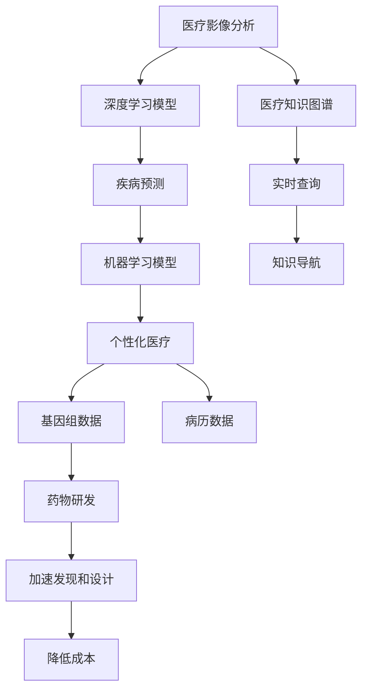
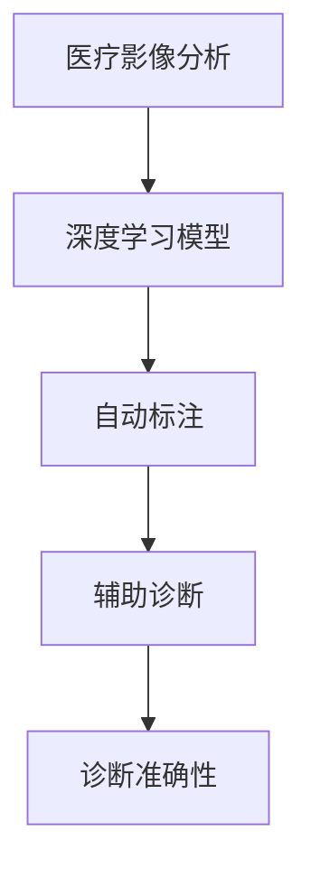
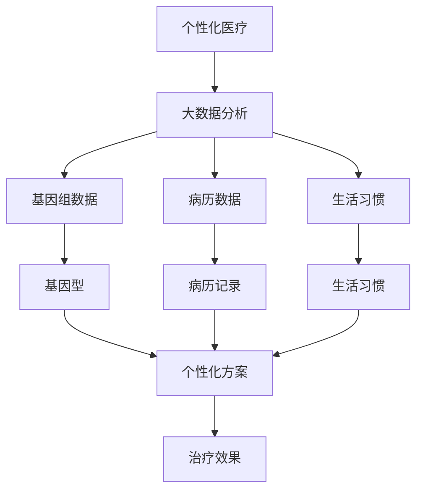
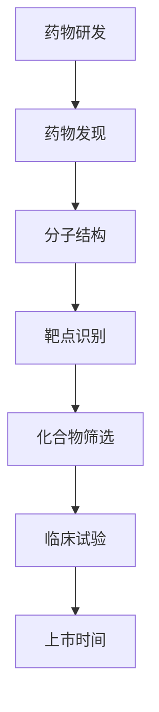
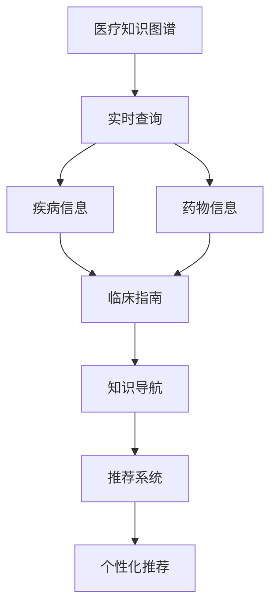
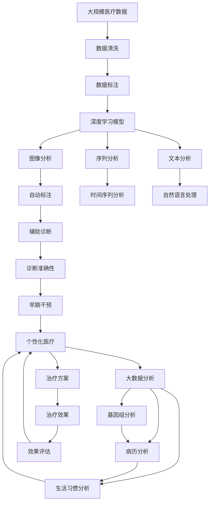

                 

# AI驱动的创新：人类计算在医疗领域的应用

> 关键词：人工智能,医疗,计算,大数据,机器学习,深度学习,医疗影像,疾病预测,个性化医疗,药物研发,医疗知识图谱

## 1. 背景介绍

### 1.1 问题由来
随着人工智能(AI)技术的快速发展和广泛应用，其在医疗领域的应用潜力逐渐被重视。传统的医疗系统依赖人工处理，存在效率低、错误率高、成本高等问题，而AI技术能够通过自动化、智能化手段大幅提升医疗服务的质量与效率。近年来，基于深度学习、自然语言处理、图像识别等技术的AI技术在医疗影像诊断、疾病预测、个性化治疗、药物研发等方面展现了巨大的潜力。

### 1.2 问题核心关键点
AI技术在医疗领域的应用主要集中在以下几个方面：

- **医疗影像分析**：利用深度学习模型对医学影像进行自动分析，辅助医生进行诊断，如CT、MRI、X光等影像的分析。
- **疾病预测与诊断**：通过机器学习模型分析病历数据、基因数据等，预测疾病的发生风险，提高早期诊断的准确率。
- **个性化医疗**：基于患者的基因信息、病历数据、生活习惯等，为每位患者提供个性化的治疗方案。
- **药物研发**：利用AI技术加速药物发现和设计过程，减少临床试验的时间和成本。
- **医疗知识图谱**：构建医疗领域的专业知识图谱，为医生和患者提供实时查询、知识导航等支持。

AI技术在医疗领域的应用，能够显著提高医疗服务的效率和准确性，降低医疗成本，改善患者体验，是未来医疗行业发展的必然趋势。

### 1.3 问题研究意义
AI技术在医疗领域的应用具有以下重要意义：

- **提高诊断准确性**：通过AI技术辅助诊断，可以降低误诊和漏诊率，提高诊断的准确性和效率。
- **个性化治疗**：AI技术能够分析大量的患者数据，为每位患者提供量身定制的治疗方案，提高治疗效果。
- **提升医疗效率**：自动化流程减少了人工操作，降低了人力成本，提升了医疗服务的效率。
- **优化药物研发**：通过AI技术加速药物发现和临床试验，缩短药物上市时间，降低研发成本。
- **促进医疗知识共享**：医疗知识图谱和智能推荐系统能够为医生提供丰富的参考资料，促进医疗知识的共享和传播。

## 2. 核心概念与联系

### 2.1 核心概念概述

为了更好地理解AI在医疗领域的应用，本节将介绍几个核心概念：

- **医疗影像分析**：通过深度学习模型对医学影像进行自动化分析，辅助医生进行诊断。
- **疾病预测**：利用机器学习模型分析病历数据、基因数据等，预测疾病的发生风险，进行早期干预。
- **个性化医疗**：基于患者的基因信息、病历数据、生活习惯等，为每位患者提供个性化的治疗方案。
- **药物研发**：利用AI技术加速药物发现和设计过程，减少临床试验的时间和成本。
- **医疗知识图谱**：构建医疗领域的专业知识图谱，提供实时查询、知识导航等支持。

这些概念之间存在着紧密的联系，形成了AI在医疗领域的应用框架。以下将通过一个Mermaid流程图展示这些概念之间的关系：



这个流程图展示了医疗影像分析、疾病预测、个性化医疗、药物研发和医疗知识图谱之间的关系：

1. **医疗影像分析**：利用深度学习模型对医学影像进行分析，辅助医生进行诊断。
2. **疾病预测**：通过机器学习模型分析病历数据、基因数据等，预测疾病的发生风险，进行早期干预。
3. **个性化医疗**：基于患者的基因信息、病历数据、生活习惯等，为每位患者提供个性化的治疗方案。
4. **药物研发**：利用AI技术加速药物发现和设计过程，减少临床试验的时间和成本。
5. **医疗知识图谱**：构建医疗领域的专业知识图谱，提供实时查询、知识导航等支持。

这些概念共同构成了AI在医疗领域的应用生态系统，通过协同工作，提升医疗服务的效率和质量。

### 2.2 概念间的关系

这些核心概念之间存在着紧密的联系，形成了AI在医疗领域的应用框架。以下通过几个Mermaid流程图展示这些概念之间的关系。

#### 2.2.1 医疗影像分析与深度学习



这个流程图展示了医疗影像分析和深度学习的关系：

1. **深度学习模型**：利用卷积神经网络(CNN)等深度学习模型对医学影像进行自动分析，提高诊断的准确性。
2. **自动标注**：通过深度学习模型自动标注影像中的关键区域，如肿瘤、病灶等。
3. **辅助诊断**：利用自动标注结果辅助医生进行诊断，提高诊断效率和准确性。

#### 2.2.2 疾病预测与机器学习


这个流程图展示了疾病预测与机器学习的关系：

1. **病历数据**：收集和整理患者的病历数据，包括临床记录、检查结果等。
2. **基因数据**：收集和分析患者的基因数据，识别潜在的遗传风险因素。
3. **机器学习模型**：利用机器学习模型分析病历数据和基因数据，预测疾病的发生风险。
4. **风险预测**：通过机器学习模型预测患者的疾病风险，提供个性化的预防建议。
5. **早期干预**：根据风险预测结果，进行早期干预，如定期体检、生活方式调整等。

#### 2.2.3 个性化医疗与大数据



这个流程图展示了个性化医疗与大数据的关系：

1. **大数据分析**：收集和整理患者的基因组数据、病历数据和生活习惯等大数据。
2. **基因组数据**：分析患者的基因组数据，识别基因型和突变。
3. **病历数据**：分析患者的病历记录，提取诊断和治疗信息。
4. **生活习惯**：分析患者的生活方式，识别健康风险因素。
5. **个性化方案**：利用大数据分析结果，为每位患者设计个性化的治疗方案。
6. **治疗效果**：根据个性化方案实施治疗，监测治疗效果。

#### 2.2.4 药物研发与AI



这个流程图展示了药物研发与AI的关系：

1. **药物发现**：利用AI技术加速药物的发现过程，识别潜在的药物分子。
2. **分子结构**：分析药物分子的结构和功能，优化药物设计。
3. **靶点识别**：利用AI技术识别药物的靶点，确定药物的作用机制。
4. **化合物筛选**：利用AI技术筛选出具有活性的化合物，优化药物筛选流程。
5. **临床试验**：利用AI技术预测药物的临床试验结果，缩短试验周期。
6. **上市时间**：通过AI技术加速药物的上市过程，减少研发成本。

#### 2.2.5 医疗知识图谱与智能推荐



这个流程图展示了医疗知识图谱与智能推荐的关系：

1. **实时查询**：构建医疗知识图谱，提供实时查询功能，方便医生和患者获取所需信息。
2. **疾病信息**：提供疾病的详细信息，包括病因、症状、诊断方法等。
3. **药物信息**：提供药物的详细信息，包括作用机制、副作用、使用方法等。
4. **临床指南**：提供临床指南和最佳实践，帮助医生制定治疗方案。
5. **知识导航**：利用医疗知识图谱进行知识导航，提供深度查询功能。
6. **推荐系统**：根据患者的需求和历史记录，提供个性化的疾病预测和治疗方案推荐。

### 2.3 核心概念的整体架构

最后，我们用一个综合的流程图来展示这些核心概念在大规模医疗数据分析和处理中的整体架构：



这个综合流程图展示了从大规模医疗数据分析到个性化医疗的完整过程。

## 3. 核心算法原理 & 具体操作步骤

### 3.1 算法原理概述

AI在医疗领域的应用，其核心算法原理主要包括以下几个方面：

- **深度学习**：通过深度神经网络对医疗数据进行特征提取和分析，提高诊断和治疗的准确性。
- **机器学习**：利用机器学习算法对病历数据、基因数据等进行模式识别和预测，进行疾病预测和个性化治疗。
- **自然语言处理(NLP)**：利用NLP技术对病历、医疗文献等文本数据进行分析和处理，辅助医生进行诊断和治疗。
- **图像处理**：通过图像处理技术对医学影像进行分析和识别，辅助医生进行诊断。
- **知识图谱构建**：利用知识图谱技术构建医疗领域的专业知识图谱，提供实时查询和知识导航支持。

这些算法原理共同构成了AI在医疗领域的应用基础，通过协同工作，实现高效、准确的医疗服务。

### 3.2 算法步骤详解

以下将详细讲解AI在医疗领域的具体操作步骤：

**Step 1: 数据收集与预处理**

1. **数据收集**：收集医疗数据，包括病历数据、医学影像数据、基因数据等。
2. **数据清洗**：对收集到的数据进行清洗，去除噪声和异常值。
3. **数据标注**：对数据进行标注，标记关键信息，如病历的诊断结果、医学影像的异常区域等。

**Step 2: 模型训练与微调**

1. **模型选择**：选择适合的深度学习模型，如卷积神经网络(CNN)、递归神经网络(RNN)、Transformer等。
2. **模型训练**：利用收集到的数据对模型进行训练，优化模型参数。
3. **微调**：在特定任务上对模型进行微调，调整模型权重以适应任务需求。

**Step 3: 模型评估与部署**

1. **模型评估**：利用测试集对模型进行评估，计算模型的准确率、召回率等指标。
2. **模型部署**：将训练好的模型部署到实际应用场景中，提供实时服务。
3. **持续优化**：根据实际应用情况，对模型进行持续优化，提高模型性能。

### 3.3 算法优缺点

AI在医疗领域的应用具有以下优点：

- **高效准确**：通过AI技术，能够显著提高诊断和治疗的准确性和效率。
- **个性化治疗**：利用AI技术分析大量的患者数据，为每位患者提供个性化的治疗方案。
- **降低成本**：通过自动化流程减少人工操作，降低人力成本，提高医疗服务效率。
- **快速响应**：AI模型可以24小时不间断地处理医疗数据，提供快速响应。

同时，AI在医疗领域的应用也存在一些缺点：

- **数据依赖**：AI技术的效果依赖于高质量的数据，数据质量差会降低模型的性能。
- **解释性不足**：AI模型的决策过程缺乏可解释性，难以进行医学解释。
- **伦理问题**：AI技术可能存在偏见和歧视，需要考虑伦理问题，确保模型的公平性和可解释性。
- **隐私保护**：医疗数据涉及患者隐私，需要采取措施保护数据安全。

### 3.4 算法应用领域

AI在医疗领域的应用领域非常广泛，包括：

- **医疗影像分析**：对医学影像进行自动分析，辅助医生进行诊断，如CT、MRI、X光等影像的分析。
- **疾病预测与诊断**：利用机器学习模型分析病历数据、基因数据等，预测疾病的发生风险，提高早期诊断的准确率。
- **个性化医疗**：基于患者的基因信息、病历数据、生活习惯等，为每位患者提供个性化的治疗方案。
- **药物研发**：利用AI技术加速药物发现和设计过程，减少临床试验的时间和成本。
- **医疗知识图谱**：构建医疗领域的专业知识图谱，提供实时查询、知识导航等支持。

## 4. 数学模型和公式 & 详细讲解 & 举例说明

### 4.1 数学模型构建

在AI在医疗领域的应用中，常用的数学模型包括深度学习模型、机器学习模型、自然语言处理模型和图像处理模型等。这里以深度学习模型为例，介绍其数学模型的构建。

假设一个深度学习模型用于医疗影像分析，其输入为一张医学影像 $x$，输出为影像中是否存在异常的分类结果 $y$。模型的数学模型可以表示为：

$$
y = f(x; \theta)
$$

其中 $f$ 为深度学习模型，$\theta$ 为模型参数。深度学习模型的常见形式包括卷积神经网络(CNN)、递归神经网络(RNN)等。

### 4.2 公式推导过程

以下以卷积神经网络(CNN)为例，推导其训练过程的数学公式。

假设模型 $f$ 是一个卷积神经网络，其结构如图：

```
input layer
convolutional layer 1
max pooling layer 1
convolutional layer 2
max pooling layer 2
fully connected layer
output layer
```

输入 $x$ 经过多个卷积层和池化层的特征提取后，进入全连接层进行分类。设卷积层和全连接层的参数分别为 $\theta_1$ 和 $\theta_2$，则模型输出 $y$ 可以表示为：

$$
y = g(W_1 * x + b_1) \cdot g(W_2 * g(W_1 * x + b_1) + b_2)
$$

其中 $g$ 为激活函数，$*$ 表示卷积操作，$+$ 表示加法，$W_1$ 和 $W_2$ 为卷积核参数，$b_1$ 和 $b_2$ 为偏置参数。

在训练过程中，我们希望通过反向传播算法最小化损失函数 $\mathcal{L}$。常见的损失函数包括交叉熵损失、均方误差损失等。以交叉熵损失为例，其公式为：

$$
\mathcal{L}(y, y') = -\sum_{i=1}^n y_i \log y'_i
$$

其中 $y$ 为真实标签，$y'$ 为模型预测结果。训练过程的目标是最小化损失函数 $\mathcal{L}$：

$$
\theta^* = \mathop{\arg\min}_{\theta} \mathcal{L}(y, f(x; \theta))
$$

通过梯度下降等优化算法，不断更新模型参数 $\theta$，最终得到训练好的模型。

### 4.3 案例分析与讲解

以医疗影像分析为例，说明深度学习模型在实际应用中的具体实现过程。

**数据准备**：收集大量医学影像数据，包括正常影像和异常影像。对每张影像进行标注，标记其中是否存在异常区域。

**模型选择**：选择卷积神经网络(CNN)作为医疗影像分析的模型，设计多个卷积层和池化层进行特征提取。

**模型训练**：利用标注好的影像数据对模型进行训练，优化模型参数。通过反向传播算法，不断调整卷积核参数 $W_1$ 和 $W_2$，偏置参数 $b_1$ 和 $b_2$，使模型能够更好地提取影像特征。

**模型评估**：在测试集上对模型进行评估，计算准确率、召回率等指标，评估模型的性能。

**模型部署**：将训练好的模型部署到实际应用场景中，对新的医学影像进行分类。

**持续优化**：根据实际应用情况，对模型进行持续优化，提高模型性能。

## 5. 项目实践：代码实例和详细解释说明

### 5.1 开发环境搭建

在进行AI在医疗领域的应用实践前，我们需要准备好开发环境。以下是使用Python进行TensorFlow开发的环境配置流程：

1. 安装Anaconda：从官网下载并安装Anaconda，用于创建独立的Python环境。

2. 创建并激活虚拟环境：
```bash
conda create -n tf-env python=3.8 
conda activate tf-env
```

3. 安装TensorFlow：根据CUDA版本，从官网获取对应的安装命令。例如：
```bash
conda install tensorflow -c pytorch -c conda-forge
```

4. 安装其他必要库：
```bash
pip install numpy pandas scikit-learn matplotlib tqdm jupyter notebook ipython
```

完成上述步骤后，即可在`tf-env`环境中开始AI在医疗领域的应用实践。

### 5.2 源代码详细实现

这里我们以医疗影像分析为例，给出使用TensorFlow进行深度学习模型训练的Python代码实现。

首先，定义模型和损失函数：

```python
import tensorflow as tf
from tensorflow.keras.layers import Conv2D, MaxPooling2D, Flatten, Dense
from tensorflow.keras.models import Sequential
from tensorflow.keras.optimizers import Adam

# 定义模型
model = Sequential()
model.add(Conv2D(32, (3, 3), activation='relu', input_shape=(128, 128, 3)))
model.add(MaxPooling2D(pool_size=(2, 2)))
model.add(Conv2D(64, (3, 3), activation='relu'))
model.add(MaxPooling2D(pool_size=(2, 2)))
model.add(Flatten())
model.add(Dense(128, activation='relu'))
model.add(Dense(1, activation='sigmoid'))

# 定义损失函数
loss = tf.keras.losses.BinaryCrossentropy()

# 定义优化器
optimizer = Adam(lr=0.001)
```

然后，定义训练和评估函数：

```python
# 定义训练函数
def train(model, dataset, batch_size, epochs, loss_fn, optimizer):
    dataset = dataset.shuffle(buffer_size=10000)
    for epoch in range(epochs):
        for x, y in dataset:
            with tf.GradientTape() as tape:
                logits = model(x)
                loss_value = loss_fn(y, logits)
            gradients = tape.gradient(loss_value, model.trainable_variables)
            optimizer.apply_gradients(zip(gradients, model.trainable_variables))
            print(f'Epoch {epoch+1}, loss: {loss_value:.4f}')

# 定义评估函数
def evaluate(model, dataset, batch_size):
    correct_predictions = 0
    total_predictions = 0
    for x, y in dataset:
        logits = model(x)
        predictions = tf.round(logits)
        correct_predictions += tf.reduce_sum(tf.cast(predictions == y, tf.float32))
        total_predictions += predictions.shape[0]
    accuracy = correct_predictions / total_predictions
    print(f'Accuracy: {accuracy:.4f}')
```

最后，启动训练流程并在测试集上评估：

```python
# 加载数据集
train_dataset = ...
val_dataset = ...

# 训练模型
train(model, train_dataset, batch_size=32, epochs=10, loss_fn=loss, optimizer=optimizer)

# 在测试集上评估模型
evaluate(model, val_dataset, batch_size=32)
```

以上就是使用TensorFlow对医疗影像分析模型进行训练的完整代码实现。可以看到，TensorFlow提供了丰富的深度学习模型和优化器，使得模型的训练和评估变得简洁高效。

### 5.3 代码解读与分析

让我们再详细解读一下关键代码的实现细节：

**模型定义**：
```python
model = Sequential()
model.add(Conv2D(32, (3, 3), activation='relu', input_shape=(128, 128, 3)))
model.add(MaxPooling2D(pool_size=(2, 2)))
model.add(Conv2D(64, (3, 3), activation='relu'))
model.add(MaxPooling2D(pool_size=(2, 2)))
model.add(Flatten())
model.add(Dense(128, activation='relu'))
model.add(Dense(1, activation='sigmoid'))
```
- 定义了一个包含两个卷积层、两个池化层、两个全连接层的卷积神经网络模型。

**损失函数定义**：
```python
loss = tf.keras.losses.BinaryCrossentropy()
```
- 定义了交叉熵损失函数，用于二分类任务。

**训练函数定义**：
```python
def train(model, dataset, batch_size, epochs, loss_fn, optimizer):
    dataset = dataset.shuffle(buffer_size=10000)
    for epoch in range(epochs):
        for x, y in dataset:
            with tf.GradientTape() as tape:
                logits = model(x)
                loss_value = loss_fn(y, logits)
            gradients = tape.gradient(loss_value, model.trainable_variables)
            optimizer.apply_gradients(zip(gradients, model.trainable_variables))
            print(f'Epoch {epoch+1}, loss: {loss_value:.4f}')
```
- 定义了一个训练函数，用于对模型进行反向传播和参数更新。

**评估函数定义**：
```python
def evaluate(model, dataset, batch_size):
    correct_predictions = 0
    total_predictions = 0
    for x, y in dataset:
        logits = model(x)
        predictions = tf.round(logits)
        correct_predictions += tf.reduce_sum(tf.cast(predictions == y, tf.float32))
        total_predictions += predictions.shape[0]
    accuracy = correct_predictions / total_predictions
    print(f'Accuracy: {accuracy:.4f}')
```
- 定义了一个评估函数，用于计算模型在测试集上的准确率。

**训练与评估流程**：
```python
# 加载数据集
train_dataset = ...
val_dataset = ...

# 训练模型
train(model, train_dataset, batch_size=32, epochs=10, loss_fn=loss, optimizer=optimizer)

# 在测试集上评估模型
evaluate(model, val_dataset, batch_size=32)
```
- 通过定义训练函数和评估函数，对模型进行训练和评估。

## 6. 实际应用场景

### 6.1 智能影像诊断

智能影像诊断是AI在医疗领域的一个重要应用。利用深度学习模型对医学影像进行自动分析，可以辅助医生进行诊断，提高诊断的准确性和效率。

例如，利用卷积神经网络(CNN)对肺CT影像进行分析，能够自动识别肺部结节、肿瘤等异常区域。在实际应用中，将肺CT影像输入训练好的模型，模型自动提取影像特征并进行分类，输出是否存在异常区域的信息。

**算法流程**：
1. 收集大量肺CT影像数据，并标注其中的异常区域。
2. 利用卷积神经网络对影像进行特征提取和分类。
3. 在测试集上评估模型的性能，并进行调整优化。
4. 将训练好的模型部署到实际应用场景中，对新的肺CT影像进行自动诊断。

### 6.2 疾病预测与预防

疾病预测与预防是AI在医疗领域的另一个重要应用。通过机器学习模型分析病历数据、基因数据等，能够预测疾病的发生风险，进行早期干预，提高预防效果。

例如，利用随机森林模型分析患者的病历数据和基因数据，预测其是否患有某种疾病。在实际应用中，将患者的病历数据和基因数据输入训练好的模型，模型分析数据特征并进行风险预测，输出疾病发生的概率。

**算法流程**：
1. 收集大量患者的病历数据和基因数据。
2. 利用机器学习模型对数据进行特征提取和风险预测。
3. 在测试集上评估模型的性能，并进行调整优化。
4. 将训练好的模型部署到实际应用场景中，对新患者进行疾病预测和预防。

### 6.3 个性化医疗

