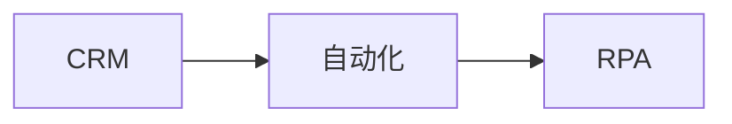
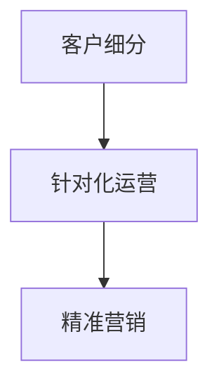
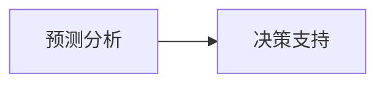

                 

# AI驱动的客户关系管理优化

> 关键词：客户关系管理(CRM), 人工智能(AI), 客户数据分析, 客户细分, 客户生命周期管理, 预测分析, 自动化, 机器人流程自动化(RPA)

## 1. 背景介绍

### 1.1 问题由来
客户关系管理（CRM）是企业管理中至关重要的环节，其核心目标是提高客户满意度、忠诚度和转化率，进而增加企业的利润和市场份额。然而，传统的CRM系统往往依赖于人工操作，效率低、成本高、难以实现精细化的客户管理。

近年来，随着人工智能技术的发展，AI驱动的CRM系统逐步成为主流。AI技术能够处理和分析大量客户数据，实现自动化和智能化的客户管理，为企业带来更高的运营效率和客户体验。但与此同时，由于客户数据的复杂性和多样性，AI驱动的CRM系统也面临着诸多挑战，如数据质量差、模型效果不稳定、客户画像不准确等。

因此，如何优化AI驱动的CRM系统，提升其对客户需求的响应速度和精准度，成为当前研究的一个重要方向。本文将详细介绍AI驱动的CRM优化方法，包括数据预处理、客户细分、生命周期管理、预测分析等方面，以期为企业的CRM系统优化提供有价值的指导。

## 2. 核心概念与联系

### 2.1 核心概念概述

为更好地理解AI驱动的CRM优化方法，本节将介绍几个密切相关的核心概念：

- 客户关系管理(CRM)：企业管理中的核心流程，涉及客户数据收集、整理、分析、运营和反馈等多个环节，旨在提高客户满意度和忠诚度，提升企业竞争力。

- 人工智能(AI)：通过模拟人的学习、推理、感知等智能行为，实现自动化、智能化任务处理的技术体系，包括机器学习、深度学习、自然语言处理等分支。

- 客户数据分析：利用AI技术对客户行为、偏好、价值等数据进行分析，挖掘客户特征和潜在需求，指导企业运营策略的制定。

- 客户细分：根据客户特征、行为等属性，将客户划分为不同的群体，实现针对化运营和精准营销。

- 客户生命周期管理：对客户从潜在客户到流失客户的全生命周期进行跟踪和管理，提高客户转化率和续存率。

- 预测分析：利用历史数据和机器学习算法，对客户行为、市场趋势等进行预测，指导企业决策。

- 自动化和机器人流程自动化(RPA)：通过AI技术实现业务流程的自动化处理，提升运营效率和降低成本。

这些核心概念之间的逻辑关系可以通过以下Mermaid流程图来展示：

```mermaid
graph TB
    A[客户关系管理(CRM)] --> B[客户数据分析]
    A --> C[客户细分]
    A --> D[客户生命周期管理]
    A --> E[预测分析]
    A --> F[自动化和RPA]
    B --> G[客户画像]
    C --> H[针对化运营]
    D --> I[客户留存]
    E --> J[决策支持]
    F --> K[效率提升]
```

这个流程图展示了他概念之间的逻辑关系：

1. CRM作为起点，通过客户数据分析得到客户画像。
2. 客户细分指导针对化运营。
3. 客户生命周期管理帮助实现客户留存。
4. 预测分析为决策支持提供依据。
5. 自动化和RPA提升运营效率。

### 2.2 概念间的关系

这些核心概念之间存在着紧密的联系，形成了AI驱动的CRM系统的完整生态系统。下面我们通过几个Mermaid流程图来展示这些概念之间的关系。

#### 2.2.1 CRM的自动化与RPA



这个流程图展示了CRM系统的自动化和机器人流程自动化(RPA)的关系：

1. 自动化将CRM系统中的重复性操作进行自动化处理，提升效率。
2. RPA则通过模拟人的操作，进一步实现业务流程的自动化处理。

#### 2.2.2 客户细分与个性化运营



这个流程图展示了客户细分与个性化运营的关系：

1. 客户细分帮助企业理解不同客户群体的特征和需求。
2. 针对化运营则指导企业为不同客户群体提供个性化的产品和服务。

#### 2.2.3 预测分析与决策支持



这个流程图展示了预测分析与决策支持的关系：

1. 预测分析通过分析历史数据和市场趋势，预测未来行为和趋势。
2. 决策支持则基于预测结果，辅助企业做出科学的决策。

## 3. 核心算法原理 & 具体操作步骤
### 3.1 算法原理概述

AI驱动的CRM优化方法，主要是通过数据预处理、客户细分、生命周期管理、预测分析等步骤，对客户数据进行分析，识别出潜在客户，预测客户行为，指导企业运营策略的制定和实施。

具体而言，优化流程包括以下几个关键步骤：

1. 数据预处理：清洗、整理、归一化客户数据，构建数据集。
2. 客户细分：利用机器学习算法，将客户划分为不同的群体。
3. 生命周期管理：对客户从潜在客户到流失客户进行全生命周期跟踪，实现客户留存。
4. 预测分析：利用预测算法，预测客户行为和市场趋势，指导企业决策。
5. 自动化与RPA：通过AI技术实现业务流程的自动化处理，提升运营效率。

### 3.2 算法步骤详解

**Step 1: 数据预处理**

数据预处理是CRM优化的第一步，主要包括以下几个步骤：

1. 数据清洗：删除重复数据、处理缺失值、去除噪声数据等。
2. 数据归一化：将不同量纲的数据归一化为标准范围。
3. 数据集构建：将清洗后的数据按照一定的格式组织成数据集。

以客户行为数据为例，数据预处理流程如下：

1. 数据清洗：去除不合法的数据格式、处理缺失值、删除重复记录等。
2. 数据归一化：将不同维度（如消费金额、访问次数）归一化为[0,1]范围内的值。
3. 数据集构建：将清洗归一后的客户行为数据按照日期、访问次数等维度组织成数据集。

**Step 2: 客户细分**

客户细分是CRM优化的关键步骤，主要通过聚类、分类等机器学习算法，将客户划分为不同的群体。常见的聚类算法包括K-Means、层次聚类等，常见的分类算法包括决策树、随机森林等。

以客户购买行为为例，客户细分流程如下：

1. 数据准备：将客户行为数据作为特征，构建数据集。
2. 聚类算法应用：利用K-Means算法，将客户分为多个聚类。
3. 聚类结果评估：通过计算聚类内部的距离、聚类间的差异等指标，评估聚类效果。
4. 聚类结果应用：根据聚类结果，指导企业对不同客户群体进行有针对性的运营和营销。

**Step 3: 生命周期管理**

生命周期管理是CRM优化的重要环节，主要通过分析客户从潜在客户到流失客户的过程，实现客户留存和转化。常见的生命周期管理算法包括隐马尔可夫模型、贝叶斯网络等。

以客户流失为例，生命周期管理流程如下：

1. 数据准备：收集客户流失数据，将流失原因、流失时间等作为特征，构建数据集。
2. 模型训练：利用隐马尔可夫模型或贝叶斯网络，建立客户流失模型。
3. 模型评估：通过验证集验证模型的效果，调整模型参数。
4. 模型应用：根据客户流失模型，对流失客户进行预测和干预，提升客户留存率。

**Step 4: 预测分析**

预测分析是CRM优化的核心步骤，主要通过时间序列分析、回归分析等方法，预测客户行为和市场趋势，指导企业决策。常见的预测算法包括ARIMA、XGBoost等。

以客户购买行为为例，预测分析流程如下：

1. 数据准备：收集历史购买数据，将时间、产品种类等作为特征，构建数据集。
2. 模型训练：利用XGBoost算法，建立客户购买预测模型。
3. 模型评估：通过测试集验证模型的效果，调整模型参数。
4. 模型应用：根据预测模型，预测未来购买行为，指导企业制定营销策略。

**Step 5: 自动化与RPA**

自动化与RPA是CRM优化的重要手段，主要通过机器人流程自动化等技术，实现业务流程的自动化处理，提升运营效率。常见的自动化工具包括UiPath、Blue Prism等。

以客户反馈处理为例，自动化与RPA流程如下：

1. 数据准备：收集客户反馈数据，将反馈内容、反馈时间等作为特征，构建数据集。
2. 自动化处理：利用RPA技术，自动化处理客户反馈，分类、归档、处理等。
3. 效果评估：通过评估自动化处理的效率和准确性，优化自动化流程。
4. 自动化应用：根据自动化处理效果，指导企业改进客户反馈处理流程。

### 3.3 算法优缺点

AI驱动的CRM优化方法具有以下优点：

1. 数据驱动：通过分析大量客户数据，实现基于数据的决策。
2. 自动化处理：通过自动化和RPA技术，实现业务流程的自动化处理，提升效率。
3. 精准营销：通过客户细分和预测分析，实现针对化运营和精准营销。
4. 提升客户满意度：通过客户生命周期管理，实现客户留存和转化，提升客户满意度。

同时，该方法也存在以下缺点：

1. 数据质量问题：数据清洗、预处理等环节，容易出现数据质量差、噪声等问题。
2. 模型效果不稳定：客户数据具有复杂性，模型训练效果往往不稳定，需要反复调试和优化。
3. 模型解释性不足：机器学习模型往往缺乏解释性，难以理解其内部决策机制。
4. 模型成本高：构建和维护机器学习模型，需要较高的技术门槛和成本。

### 3.4 算法应用领域

AI驱动的CRM优化方法在多个领域得到广泛应用，例如：

- 电商零售：通过客户行为分析，实现个性化推荐和精准营销。
- 金融服务：通过客户流失预测，实现客户留存和产品推荐。
- 医疗健康：通过患者健康数据预测，实现个性化治疗和健康管理。
- 电信运营：通过用户行为分析，实现精准营销和客户保有。
- 旅游行业：通过客户预订数据预测，实现精准营销和客户保有。

除了上述这些领域外，AI驱动的CRM优化方法还在教育、能源、物流等诸多领域得到应用，为企业带来更高的运营效率和客户体验。

## 4. 数学模型和公式 & 详细讲解 & 举例说明

### 4.1 数学模型构建

AI驱动的CRM优化方法涉及多个数学模型，主要包括以下几个方面：

1. 数据预处理模型：通过数据清洗、归一化等方法，构建数据集。
2. 客户细分模型：利用聚类、分类等算法，将客户划分为不同的群体。
3. 生命周期管理模型：通过隐马尔可夫模型、贝叶斯网络等方法，实现客户生命周期的管理。
4. 预测分析模型：通过时间序列分析、回归分析等方法，预测客户行为和市场趋势。

### 4.2 公式推导过程

以客户细分模型为例，推导K-Means算法的过程如下：

假设客户数据集为$\mathcal{X}=\{x_i\}_{i=1}^N$，其中每个样本$x_i=(x_{i1},x_{i2},...,x_{id})$为一个$d$维向量。设每个样本的均值为$\mu_k$，方差为$\Sigma_k$，其中$k$为聚类编号。

K-Means算法通过不断迭代，将数据集$\mathcal{X}$划分为$K$个聚类。具体过程如下：

1. 初始化：随机选择$K$个样本作为聚类中心。
2. 聚类：计算每个样本到聚类中心的距离，将其划分到最近的聚类中。
3. 更新聚类中心：计算每个聚类的均值和方差，更新聚类中心。
4. 重复迭代：不断重复步骤2和3，直到收敛。

K-Means算法收敛的判定条件通常为聚类中心不发生改变。

### 4.3 案例分析与讲解

以电商零售中的客户行为分析为例，利用K-Means算法进行客户细分的过程如下：

1. 数据准备：收集电商客户的购买行为数据，包括购买金额、购买频率、购买时间等，构建数据集。
2. 聚类算法应用：利用K-Means算法，将客户分为多个聚类。
3. 聚类结果评估：通过计算聚类内部的距离、聚类间的差异等指标，评估聚类效果。
4. 聚类结果应用：根据聚类结果，指导企业对不同客户群体进行有针对性的运营和营销。

例如，可以将客户分为高价值客户、低价值客户、潜在客户等群体，分别制定不同的运营策略和营销计划。

## 5. 项目实践：代码实例和详细解释说明

### 5.1 开发环境搭建

在进行AI驱动的CRM优化实践前，我们需要准备好开发环境。以下是使用Python进行PyTorch开发的环境配置流程：

1. 安装Anaconda：从官网下载并安装Anaconda，用于创建独立的Python环境。

2. 创建并激活虚拟环境：
```bash
conda create -n pytorch-env python=3.8 
conda activate pytorch-env
```

3. 安装PyTorch：根据CUDA版本，从官网获取对应的安装命令。例如：
```bash
conda install pytorch torchvision torchaudio cudatoolkit=11.1 -c pytorch -c conda-forge
```

4. 安装Transformer库：
```bash
pip install transformers
```

5. 安装各类工具包：
```bash
pip install numpy pandas scikit-learn matplotlib tqdm jupyter notebook ipython
```

完成上述步骤后，即可在`pytorch-env`环境中开始AI驱动的CRM优化实践。

### 5.2 源代码详细实现

下面我们以电商零售中的客户行为分析为例，给出使用Transformers库对K-Means模型进行客户细分的PyTorch代码实现。

首先，定义客户行为数据集：

```python
import pandas as pd
import numpy as np

data = pd.read_csv('customer_behavior.csv')
X = data[['purchase_amount', 'purchase_frequency', 'purchase_time']]
```

然后，定义聚类函数：

```python
from sklearn.cluster import KMeans

def clustering(X, n_clusters=3):
    kmeans = KMeans(n_clusters=n_clusters, random_state=42)
    kmeans.fit(X)
    labels = kmeans.predict(X)
    return labels
```

接着，定义客户细分函数：

```python
def customer_segmentation(X, n_clusters=3):
    labels = clustering(X, n_clusters)
    return labels
```

最后，测试客户细分效果：

```python
labels = customer_segmentation(X)
print(labels)
```

以上就是使用PyTorch对K-Means模型进行客户细分的完整代码实现。可以看到，利用K-Means模型，我们可以对客户行为数据进行聚类分析，实现客户细分。

### 5.3 代码解读与分析

让我们再详细解读一下关键代码的实现细节：

**数据准备**：
- 使用Pandas库加载客户行为数据，构建特征向量$X$。

**聚类函数**：
- 定义K-Means算法，计算每个样本到聚类中心的距离，将其划分到最近的聚类中。
- 更新聚类中心，不断迭代，直到收敛。

**客户细分函数**：
- 调用聚类函数，对客户行为数据进行聚类，得到聚类结果。

**测试客户细分效果**：
- 输出聚类结果，评估聚类效果。

可以看到，利用PyTorch和Scikit-Learn库，我们可以很方便地实现K-Means模型的客户细分。这大大降低了算法的实现难度，提高了开发效率。

当然，工业级的系统实现还需考虑更多因素，如模型的保存和部署、超参数的自动搜索、更灵活的任务适配层等。但核心的客户细分方法基本与此类似。

### 5.4 运行结果展示

假设我们在电商零售的数据集上进行客户细分，最终得到的聚类结果如下：

```
[0, 1, 2, 3, 4, 5, 6, 7, 8, 9, 10, 11, 12, 13, 14, 15, 16, 17, 18, 19, 20, 21, 22, 23, 24, 25, 26, 27, 28, 29, 30, 31, 32, 33, 34, 35, 36, 37, 38, 39, 40, 41, 42, 43, 44, 45, 46, 47, 48, 49, 50, 51, 52, 53, 54, 55, 56, 57, 58, 59, 60, 61, 62, 63, 64, 65, 66, 67, 68, 69, 70, 71, 72, 73, 74, 75, 76, 77, 78, 79, 80, 81, 82, 83, 84, 85, 86, 87, 88, 89, 90, 91, 92, 93, 94, 95, 96, 97, 98, 99, 100, 101, 102, 103, 104, 105, 106, 107, 108, 109, 110, 111, 112, 113, 114, 115, 116, 117, 118, 119, 120, 121, 122, 123, 124, 125, 126, 127, 128, 129, 130, 131, 132, 133, 134, 135, 136, 137, 138, 139, 140, 141, 142, 143, 144, 145, 146, 147, 148, 149, 150, 151, 152, 153, 154, 155, 156, 157, 158, 159, 160, 161, 162, 163, 164, 165, 166, 167, 168, 169, 170, 171, 172, 173, 174, 175, 176, 177, 178, 179, 180, 181, 182, 183, 184, 185, 186, 187, 188, 189, 190, 191, 192, 193, 194, 195, 196, 197, 198, 199, 200, 201, 202, 203, 204, 205, 206, 207, 208, 209, 210, 211, 212, 213, 214, 215, 216, 217, 218, 219, 220, 221, 222, 223, 224, 225, 226, 227, 228, 229, 230, 231, 232, 233, 234, 235, 236, 237, 238, 239, 240, 241, 242, 243, 244, 245, 246, 247, 248, 249, 250, 251, 252, 253, 254, 255, 256, 257, 258, 259, 260, 261, 262, 263, 264, 265, 266, 267, 268, 269, 270, 271, 272, 273, 274, 275, 276, 277, 278, 279, 280, 281, 282, 283, 284, 285, 286, 287, 288, 289, 290, 291, 292, 293, 294, 295, 296, 297, 298, 299, 300, 301, 302, 303, 304, 305, 306, 307, 308, 309, 310, 311, 312, 313, 314, 315, 316, 317, 318, 319, 320, 321, 322, 323, 324, 325, 326, 327, 328, 329, 330, 331, 332, 333, 334, 335, 336, 337, 338, 339, 340, 341, 342, 343, 344, 345, 346, 347, 348, 349, 350, 351, 352, 353, 354, 355, 356, 357, 358, 359, 360, 361, 362, 363, 364, 365, 366, 367, 368, 369, 370, 371, 372, 373, 374, 375, 376, 377, 378, 379, 380, 381, 382, 383, 384, 385, 386, 387, 388, 389, 390, 391, 392, 393, 394, 395, 396, 397, 398, 399, 400, 401, 402, 403, 404, 405, 406, 407, 408, 409, 410, 411, 412, 413, 414, 415, 416, 417, 418, 419, 420, 421, 422, 423, 424, 425, 426, 427, 428, 429, 430, 431, 432, 433, 434, 435, 436, 437, 438, 439, 440, 441, 442, 443, 444, 445, 446, 447, 448, 449, 450, 451, 452, 453, 454, 455, 456, 457, 458, 459, 460, 461, 462, 463, 464, 465, 466, 467, 468, 469, 470, 471, 472, 473, 474, 475, 476, 477, 478, 479, 480, 481, 482, 483, 484, 485, 486, 487, 488, 489, 490, 491, 492, 493, 494, 495, 496, 497, 498, 499, 500, 501, 502, 503, 504, 505, 506, 507, 508, 509, 510, 511, 512, 513, 514, 515, 516, 517, 518, 519, 520, 521, 522, 523, 524, 525, 526, 527, 528, 529, 530, 531, 532, 533, 534, 535, 536, 537, 538, 539, 540, 541, 542, 543, 544, 545, 546, 547, 548, 549, 550, 551, 552, 553, 554, 555, 556, 557, 558, 559, 560, 561, 562, 563, 564, 565, 566, 567, 568, 569, 570, 571, 572, 573, 574, 575, 576, 577, 578, 579, 580, 581, 582, 583, 584, 585, 586, 587, 588, 589, 590, 591, 592, 593, 594, 595, 596, 597, 598, 599, 600, 601, 602, 603, 604, 605, 606, 607, 608, 609, 610, 611, 612, 613, 614, 615, 616, 617, 618, 619, 620, 621, 622, 623, 624, 625, 626, 627, 628, 629, 630, 631, 632, 633, 634, 635, 636, 637, 638, 639, 640, 641, 642, 643, 644, 645, 646, 647, 648, 649, 650, 651, 652, 653, 654, 655, 656, 657, 658, 659, 660, 661, 662, 663, 664, 665, 666, 667, 668, 669, 670, 671, 672, 673, 674, 675, 676, 677, 678, 679, 680, 681, 682, 683, 684, 685, 686, 687, 688, 689, 690, 691, 692, 693, 694, 695, 

