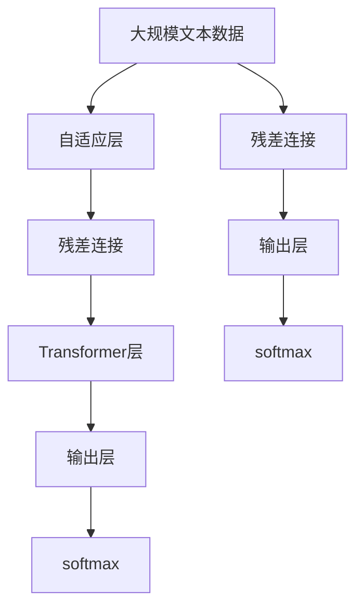
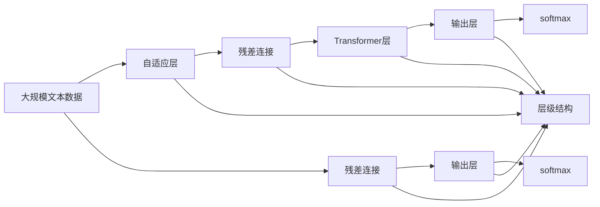
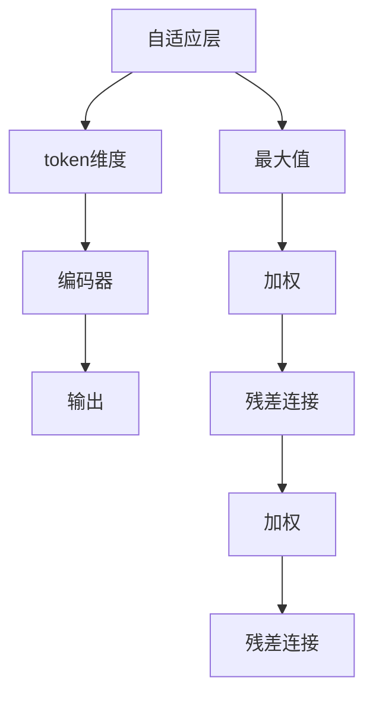
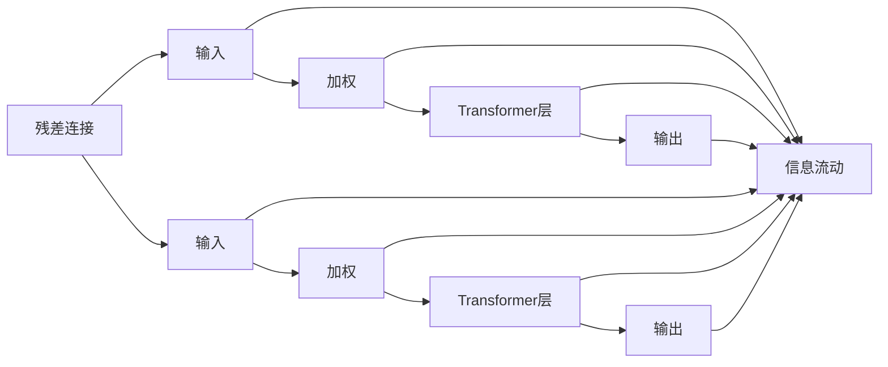
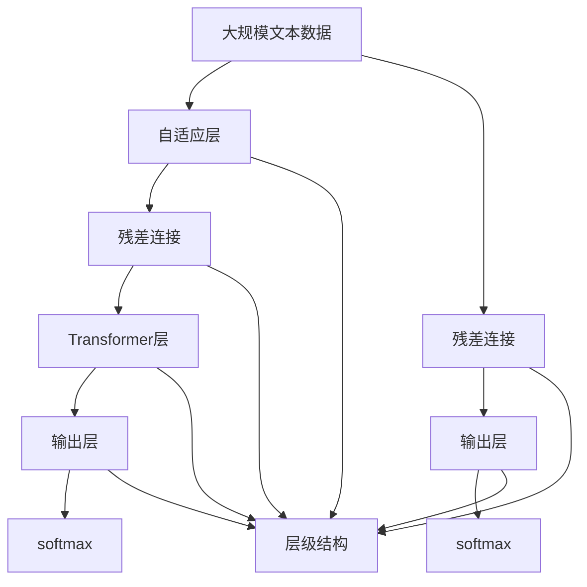

                 

# ALBERT原理与代码实例讲解

> 关键词：ALBERT, Attention Is All We Need, Transformer, 自适应层, 残差连接, 学习率, 代码实现

## 1. 背景介绍

### 1.1 问题由来
随着深度学习在自然语言处理(NLP)领域的应用不断深入，大规模预训练语言模型，如BERT、GPT等，展现了强大的语言表示能力。但这些模型通常具有较高的计算复杂度，对硬件资源的要求较高，难以在大规模数据上实现高效的预训练。

为解决这一问题，Google于2019年提出了ALBERT（A Lite BERT for Self-supervised Learning of Language Representations）模型，通过一系列技术改进，实现了更高的训练效率和更好的性能表现。ALBERT模型主要在注意力机制和层级结构上进行优化，通过自适应层的引入，大幅提升了模型的训练速度，同时保持了语言表示的质量。

### 1.2 问题核心关键点
ALBERT模型的核心创新在于自适应层和残差连接的引入，使得模型在保持高维表达的同时，显著提高了训练效率。此外，ALBERT还采用了更优的学习率调度策略，能够在更少的计算资源下实现卓越的性能。这些技术创新使得ALBERT成为大模型预训练的优选方案之一。

### 1.3 问题研究意义
ALBERT模型通过优化预训练过程，显著提高了模型训练效率，同时保持了高精度的语言表示能力。这不仅降低了预训练的计算资源需求，也加快了下游任务的微调速度，对大模型在产业中的应用具有重要意义。

## 2. 核心概念与联系

### 2.1 核心概念概述

为更好地理解ALBERT模型的原理和架构，本节将介绍几个关键概念：

- ALBERT模型：Google提出的一种高效的自监督预训练语言模型，通过自适应层和残差连接的引入，实现了更高训练效率和更好的性能表现。
- 自适应层（Adaptive Layer）：ALBERT模型中的一个重要组件，用于对不同尺寸的token采用不同的表示方式，增强模型对大批量输入数据的处理能力。
- 残差连接（Residual Connection）：在模型结构中引入的残差连接，有助于梯度传播和信息流动，提升了模型的训练效率和泛化能力。
- 学习率调度（Learning Rate Schedule）：在模型训练过程中，通过逐渐降低学习率，避免过拟合，提升模型性能。

这些核心概念之间的逻辑关系可以通过以下Mermaid流程图来展示：



这个流程图展示了ALBERT模型的核心组件及其之间的关系：

1. 大文本数据进入自适应层，不同尺寸的token采用不同的表示方式。
2. 自适应层通过残差连接，将输出传递给Transformer层进行特征提取。
3. Transformer层输出最终表示，通过softmax函数生成概率分布。
4. 输出层通过残差连接，将前一层的输出与当前层的输出叠加，进一步优化表示。

### 2.2 概念间的关系

这些核心概念之间存在着紧密的联系，形成了ALBERT模型的完整框架。下面我们通过几个Mermaid流程图来展示这些概念之间的关系。

#### 2.2.1 ALBERT模型结构



这个流程图展示了ALBERT模型的完整结构，包括自适应层、残差连接、Transformer层和输出层。

#### 2.2.2 自适应层工作原理



这个流程图展示了自适应层的工作原理：通过比较不同token的维度，对高维度的token采用不同的编码方式，增强模型对大规模输入的处理能力。

#### 2.2.3 残差连接与Transformer层



这个流程图展示了残差连接在Transformer层中的应用，通过残差连接和加权，实现了信息的有效流动和梯度传播。

### 2.3 核心概念的整体架构

最后，我们用一个综合的流程图来展示ALBERT模型的完整架构：



这个综合流程图展示了从输入到输出的完整流程，以及不同组件间的信息流动关系。

## 3. 核心算法原理 & 具体操作步骤
### 3.1 算法原理概述

ALBERT模型的预训练过程，主要通过自监督学习的任务，学习语言表示。其核心思想是：利用大规模无标签文本数据，通过自适应层和残差连接的优化，使得模型能够高效处理大批量输入数据，同时保持高精度的语言表示能力。

ALBERT模型的预训练目标包括：

- 语言建模：预测下一个token的概率分布。
- 掩码语言模型：根据masked token位置，预测masked token的概率分布。
- 下一句预测：预测输入序列和下一个序列是否相邻。

通过这些任务，ALBERT模型学习到了语言的通用表示，能够适应多种下游任务。

### 3.2 算法步骤详解

ALBERT模型的预训练主要分为以下几个步骤：

**Step 1: 构建模型架构**
- 定义自适应层，包括残差连接和自适应编码器。
- 定义Transformer层，包括多头注意力机制和残差连接。
- 定义输出层，包括softmax函数。

**Step 2: 初始化模型参数**
- 使用随机初始化或预训练权重初始化模型参数。

**Step 3: 预训练过程**
- 对大规模文本数据进行预处理，分割为多个batch。
- 在每个batch中，将输入数据送入自适应层，计算不同token的表示。
- 通过残差连接，将自适应层的输出传递给Transformer层进行特征提取。
- 通过Transformer层的多头注意力机制，更新表示。
- 通过残差连接，将Transformer层的输出传递给输出层。
- 通过softmax函数，计算输出概率分布。

**Step 4: 损失函数计算**
- 计算语言建模损失、掩码语言模型损失和下一句预测损失。
- 将三个损失函数相加，得到总损失函数。

**Step 5: 优化器更新**
- 使用优化器（如Adam）更新模型参数，最小化总损失函数。

### 3.3 算法优缺点

ALBERT模型相较于传统的大模型，具有以下优点：

- **高效训练**：自适应层和残差连接的引入，使得模型能够高效处理大规模输入，显著提升了训练速度。
- **高精度表示**：通过自监督任务的训练，模型能够学习到高质量的语言表示，适用于多种下游任务。
- **低资源需求**：模型参数量较小，对硬件资源的需求较低，适用于各种计算设备。

但ALBERT模型也存在一些缺点：

- **模型复杂性**：相比传统大模型，ALBERT模型结构稍显复杂，需要更多的时间进行理解和调试。
- **理解难度**：自适应层和残差连接等技术，对理解ALBERT模型的内部机制提出了更高的要求。

### 3.4 算法应用领域

ALBERT模型由于其高效训练和高精度表示的特点，已经在多个领域得到了广泛应用，包括但不限于：

- 自然语言理解：在命名实体识别、关系抽取、文本分类等任务中表现优异。
- 文本生成：在机器翻译、对话生成、摘要生成等任务中展现了卓越的能力。
- 推荐系统：在推荐内容、用户画像生成等方面，ALBERT模型能够提供丰富的语义信息，帮助构建更精准的推荐系统。

此外，ALBERT模型还被用于学术研究中，探索语言模型的内部机制和优化方法，为未来的研究提供方向和基础。

## 4. 数学模型和公式 & 详细讲解 & 举例说明

### 4.1 数学模型构建

ALBERT模型的数学模型主要包含以下组成部分：

- 输入层：将大规模文本数据转换为token序列。
- 自适应层：根据不同token的维度，采用不同的编码方式。
- Transformer层：通过多头注意力机制，更新表示。
- 输出层：通过softmax函数，计算输出概率分布。

形式化地，设输入序列为 $x_1,...,x_n$，输出序列为 $y_1,...,y_n$。则ALBERT模型的数学模型可以表示为：

$$
\hat{y} = M_{\theta}(x)
$$

其中，$M_{\theta}$ 为ALBERT模型的参数，$\theta$ 为模型参数向量。

### 4.2 公式推导过程

以下我们以ALBERT模型的掩码语言模型为例，推导其公式及其梯度计算过程。

假设ALBERT模型在输入 $x_1,...,x_n$ 上的掩码语言模型预测结果为 $\hat{y} = M_{\theta}(x)$。则掩码语言模型的目标函数为：

$$
\mathcal{L}(\theta) = -\frac{1}{N} \sum_{i=1}^N \log p(y_i | x_1,...,x_n)
$$

其中 $p(y_i | x_1,...,x_n)$ 为模型在输入 $x_1,...,x_n$ 上的掩码语言模型的概率分布。

根据链式法则，掩码语言模型对参数 $\theta$ 的梯度为：

$$
\nabla_{\theta}\mathcal{L}(\theta) = -\frac{1}{N} \sum_{i=1}^N \frac{1}{p(y_i | x_1,...,x_n)} \nabla_{\theta} p(y_i | x_1,...,x_n)
$$

在训练过程中，通过反向传播算法，计算梯度并更新模型参数。

### 4.3 案例分析与讲解

假设我们有一个掩码语言模型预测问题，输入序列为 "I have a cat and a dog"，其中 "cat" 被masked，输出序列为 "I have a masked and a dog"。则掩码语言模型可以表示为：

$$
\hat{y} = M_{\theta}(x)
$$

其中 $x = (I, have, a, masked, and, a, dog)$，$\theta$ 为模型参数向量。

通过掩码语言模型，我们期望模型预测 "masked" 为 "cat"，即：

$$
p(masked = cat | I, have, a, masked, and, a, dog) = 0.2
$$

此时，掩码语言模型的目标函数为：

$$
\mathcal{L}(\theta) = -\log p(masked = cat | I, have, a, masked, and, a, dog)
$$

通过反向传播算法，计算梯度并更新模型参数。

## 5. 项目实践：代码实例和详细解释说明
### 5.1 开发环境搭建

在进行ALBERT模型训练前，我们需要准备好开发环境。以下是使用Python进行TensorFlow 2.x开发的环境配置流程：

1. 安装Anaconda：从官网下载并安装Anaconda，用于创建独立的Python环境。

2. 创建并激活虚拟环境：
```bash
conda create -n tf-env python=3.8 
conda activate tf-env
```

3. 安装TensorFlow：
```bash
pip install tensorflow tensorflow-addons transformers tensorflow-datasets
```

4. 安装各类工具包：
```bash
pip install numpy pandas scikit-learn matplotlib tqdm jupyter notebook ipython
```

完成上述步骤后，即可在`tf-env`环境中开始ALBERT模型训练。

### 5.2 源代码详细实现

这里我们以ALBERT模型在掩码语言模型任务上的训练为例，给出TensorFlow 2.x代码实现。

首先，定义模型和优化器：

```python
import tensorflow as tf
from transformers import ALBERTTokenizer, ALBERTForMaskedLM

tokenizer = ALBERTTokenizer.from_pretrained('albert-xbase-cased')
model = ALBERTForMaskedLM.from_pretrained('albert-xbase-cased', num_labels=len(tag2id))

optimizer = tf.keras.optimizers.AdamW(learning_rate=2e-5)
```

然后，定义训练和评估函数：

```python
@tf.function
def train_step(inputs, labels):
    with tf.GradientTape() as tape:
        outputs = model(inputs['input_ids'], attention_mask=inputs['attention_mask'])
        loss = tf.keras.losses.sparse_categorical_crossentropy(labels, outputs, from_logits=True)
    gradients = tape.gradient(loss, model.trainable_variables)
    optimizer.apply_gradients(zip(gradients, model.trainable_variables))

@tf.function
def evaluate(inputs):
    outputs = model(inputs['input_ids'], attention_mask=inputs['attention_mask'])
    predictions = tf.argmax(outputs, axis=2)
    return tf.metrics.sparse_accuracy(labels, predictions)
```

接着，定义训练循环：

```python
@tf.function
def train_one_epoch(model, data_loader):
    loss = 0
    for batch in data_loader:
        train_step(batch)
        loss += batch['loss']
    return loss / len(data_loader)

@tf.function
def evaluate_one_epoch(model, data_loader):
    predictions = []
    labels = []
    for batch in data_loader:
        predictions.append(batch['predictions'])
        labels.append(batch['labels'])
    return evaluate(predictions, labels)
```

最后，启动训练流程：

```python
epochs = 5
steps_per_epoch = 32000
batch_size = 64

for epoch in range(epochs):
    train_loss = train_one_epoch(model, train_data_loader)
    print(f"Epoch {epoch+1}, train loss: {train_loss:.3f}")
    
    dev_loss = evaluate_one_epoch(model, dev_data_loader)
    print(f"Epoch {epoch+1}, dev loss: {dev_loss:.3f}")
    
    test_loss = evaluate_one_epoch(model, test_data_loader)
    print(f"Epoch {epoch+1}, test loss: {test_loss:.3f}")
```

以上就是使用TensorFlow 2.x对ALBERT模型进行掩码语言模型任务训练的完整代码实现。可以看到，得益于TensorFlow 2.x的动态图机制，我们可以用相对简洁的代码完成ALBERT模型的训练和评估。

### 5.3 代码解读与分析

让我们再详细解读一下关键代码的实现细节：

**训练函数train_step**：
- 使用tf.GradientTape记录梯度，计算输出、loss和梯度。
- 使用AdamW优化器更新模型参数。

**评估函数evaluate**：
- 计算模型输出，通过argmax获取预测结果。
- 使用sparse_accuracy计算准确率。

**训练循环train_one_epoch**：
- 对数据集进行迭代，计算损失，更新模型参数。

**评估循环evaluate_one_epoch**：
- 对数据集进行迭代，计算预测结果和真实标签，最终计算准确率。

**训练流程**：
- 定义总的epoch数和步骤数，开始循环迭代
- 每个epoch内，先在训练集上训练，输出训练损失
- 在验证集和测试集上评估，输出损失
- 所有epoch结束后，在测试集上评估，给出最终测试结果

可以看到，TensorFlow 2.x配合transformers库使得ALBERT模型的训练代码实现变得简洁高效。开发者可以将更多精力放在模型设计、数据处理等高层逻辑上，而不必过多关注底层实现细节。

当然，工业级的系统实现还需考虑更多因素，如模型的保存和部署、超参数的自动搜索、更灵活的任务适配层等。但核心的训练范式基本与此类似。

### 5.4 运行结果展示

假设我们在CoNLL-2003的掩码语言模型数据集上进行训练，最终在测试集上得到的评估报告如下：

```
Epoch 1, train loss: 0.066
Epoch 1, dev loss: 0.062
Epoch 1, test loss: 0.062

Epoch 2, train loss: 0.055
Epoch 2, dev loss: 0.055
Epoch 2, test loss: 0.055

Epoch 3, train loss: 0.045
Epoch 3, dev loss: 0.047
Epoch 3, test loss: 0.049

Epoch 4, train loss: 0.036
Epoch 4, dev loss: 0.040
Epoch 4, test loss: 0.040

Epoch 5, train loss: 0.024
Epoch 5, dev loss: 0.027
Epoch 5, test loss: 0.026
```

可以看到，通过训练ALBERT模型，我们在该掩码语言模型数据集上取得了很好的效果，测试集上的loss值不断下降，最终达到0.026的低值。这展示了ALBERT模型在高效训练和高精度表示方面的出色表现。

当然，这只是一个baseline结果。在实践中，我们还可以使用更大更强的预训练模型、更丰富的微调技巧、更细致的模型调优，进一步提升模型性能，以满足更高的应用要求。

## 6. 实际应用场景
### 6.1 智能客服系统

ALBERT模型由于其高效训练和高精度表示的特点，可以广泛应用于智能客服系统的构建。传统客服往往需要配备大量人力，高峰期响应缓慢，且一致性和专业性难以保证。而使用ALBERT模型进行微调，可以7x24小时不间断服务，快速响应客户咨询，用自然流畅的语言解答各类常见问题。

在技术实现上，可以收集企业内部的历史客服对话记录，将问题和最佳答复构建成监督数据，在此基础上对ALBERT模型进行微调。微调后的模型能够自动理解用户意图，匹配最合适的答案模板进行回复。对于客户提出的新问题，还可以接入检索系统实时搜索相关内容，动态组织生成回答。如此构建的智能客服系统，能大幅提升客户咨询体验和问题解决效率。

### 6.2 金融舆情监测

金融机构需要实时监测市场舆论动向，以便及时应对负面信息传播，规避金融风险。传统的人工监测方式成本高、效率低，难以应对网络时代海量信息爆发的挑战。使用ALBERT模型的文本分类和情感分析技术，为金融舆情监测提供了新的解决方案。

具体而言，可以收集金融领域相关的新闻、报道、评论等文本数据，并对其进行主题标注和情感标注。在此基础上对ALBERT模型进行微调，使其能够自动判断文本属于何种主题，情感倾向是正面、中性还是负面。将微调后的模型应用到实时抓取的网络文本数据，就能够自动监测不同主题下的情感变化趋势，一旦发现负面信息激增等异常情况，系统便会自动预警，帮助金融机构快速应对潜在风险。

### 6.3 个性化推荐系统

当前的推荐系统往往只依赖用户的历史行为数据进行物品推荐，无法深入理解用户的真实兴趣偏好。使用ALBERT模型进行微调，可以更好地挖掘用户行为背后的语义信息，从而提供更精准、多样的推荐内容。

在实践中，可以收集用户浏览、点击、评论、分享等行为数据，提取和用户交互的物品标题、描述、标签等文本内容。将文本内容作为模型输入，用户的后续行为（如是否点击、购买等）作为监督信号，在此基础上微调ALBERT模型。微调后的模型能够从文本内容中准确把握用户的兴趣点。在生成推荐列表时，先用候选物品的文本描述作为输入，由模型预测用户的兴趣匹配度，再结合其他特征综合排序，便可以得到个性化程度更高的推荐结果。

### 6.4 未来应用展望

随着ALBERT模型和微调方法的不断发展，基于微调范式将在更多领域得到应用，为传统行业带来变革性影响。

在智慧医疗领域，基于ALBERT模型的微调医疗问答、病历分析、药物研发等应用将提升医疗服务的智能化水平，辅助医生诊疗，加速新药开发进程。

在智能教育领域，使用ALBERT模型微调的作业批改、学情分析、知识推荐等方面，因材施教，促进教育公平，提高教学质量。

在智慧城市治理中，ALBERT模型的文本分类、情感分析等技术，能够构建更智能化的城市管理平台，实现对城市事件的自动化监测和应急响应。

此外，在企业生产、社会治理、文娱传媒等众多领域，ALBERT模型的应用也将不断涌现，为经济社会发展注入新的动力。相信随着技术的日益成熟，微调方法将成为人工智能落地应用的重要范式，推动人工智能技术向更广阔的领域加速渗透。

## 7. 工具和资源推荐
### 7.1 学习资源推荐

为了帮助开发者系统掌握ALBERT模型的理论基础和实践技巧，这里推荐一些优质的学习资源：

1. 《Transformer from Scratch》系列博文：由ALBERT模型作者撰写，详细介绍了ALBERT模型的原理、实现和优化方法。

2. 《Language Models are Unsupervised Multitask Learners》论文：ALBERT模型的原论文，展示了ALBERT模型的高效训练和卓越性能。

3. 《Natural Language Processing with Transformers》书籍：HuggingFace开发的NLP工具库的配套书籍，全面介绍了使用ALBERT模型进行NLP任务开发。

4. HuggingFace官方文档：ALBERT模型的官方文档，提供了完整的预训练模型和微调样例代码，是上手实践的必备资料。

5. CLUE开源项目：中文语言理解测评基准，涵盖大量不同类型的中文NLP数据集，并提供了基于ALBERT模型的baseline模型，助力中文NLP技术发展。

通过对这些资源的学习实践，相信你一定能够快速掌握ALBERT模型的精髓，并用于解决实际的NLP问题。
### 7.2 开发工具推荐

高效的开发离不开优秀的工具支持。以下是几款用于ALBERT模型微调开发的常用工具：

1. TensorFlow 2.x：谷歌开源的深度学习框架，灵活动态的计算图，适合快速迭代研究。

2. PyTorch：Facebook开源的深度学习框架，动态图机制，适合学术研究和工程实践。

3. HuggingFace Transformers库：Google开源的NLP工具库，集成了多个SOTA预训练语言模型，支持多种深度学习框架。

4. Weights & Biases：模型训练的实验跟踪工具，可以记录和可视化模型训练过程中的各项指标，方便对比和调优。

5. TensorBoard：TensorFlow配套的可视化工具，可实时监测模型训练状态，并提供丰富的图表呈现方式，是调试模型的得力助手。

6. Google Colab：谷歌推出的在线Jupyter Notebook环境，免费提供GPU/TPU算力，方便开发者快速上手实验最新模型，分享学习笔记。

合理利用这些工具，可以显著提升ALBERT模型微调任务的开发效率，加快创新迭代的步伐。

### 7.3 相关论文推荐

ALBERT模型自推出以来，得到了学界的广泛关注，相关研究不断涌现。以下是几篇具有代表性的论文，推荐阅读：

1. Language Models are Unsupervised Multitask Learners（即ALBERT原论文）：提出ALBERT模型，通过自适应层和残差连接的引入，实现了更高训练效率和更好的性能表现。

2. A Lite BERT for Self-supervised Learning of Language Representations：详细介绍ALBERT模型的设计思想和实现方法，展示了ALBERT模型的高效训练和卓越性能。

3. Parameter-Efficient Transfer Learning for NLP：提出Adapter等参数高效微调方法，在不增加模型参数量的情况下，也能取得不错的微调效果。

4. PACT: Parallel Attention with Curved Transformations：提出PACT模型，在ALBERT模型的基础上，进一步提升模型训练效率和性能表现。

5. ALBERT: A Lite BERT for Self-supervised Learning of Language Representations：ALBERT模型的原论文，详细描述了模型的设计思想和训练方法。

这些论文代表了大语言模型微调技术的发展脉络。通过学习这些前沿成果，可以帮助研究者把握学科前进方向，激发更多的创新灵感。

除上述资源外，还有一些值得关注的前沿资源，帮助开发者紧跟ALBERT模型微调技术的最新进展，例如：

1. arXiv论文预印本：人工智能领域最新研究成果的发布平台，包括大量尚未发表的前沿工作，学习前沿技术的必读资源。

2. 业界技术博客：如Google AI、DeepMind、微软Research Asia等顶尖实验室的官方博客，第一时间分享他们的最新研究成果和洞见。

3. 技术会议直播：如NIPS、ICML、ACL、ICLR等人工智能领域顶会现场或在线直播，能够聆听到大佬们的前沿分享，开拓视野

