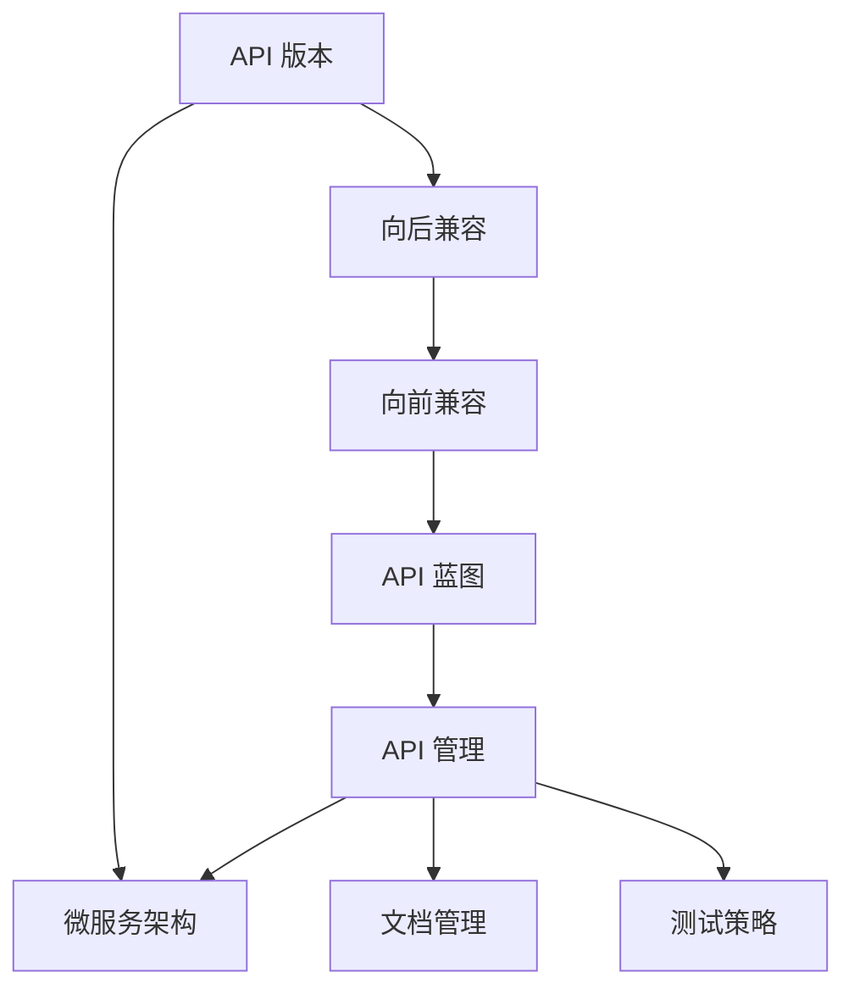

                 

# API 版本控制的最佳实践

> 关键词：API 版本控制, RESTful API, 微服务架构, API 接口, 向后兼容, 向前兼容, API 蓝图, API 管理

## 1. 背景介绍

在现代软件开发中，API（应用程序接口）是连接应用系统的重要桥梁。API的稳定性和可维护性直接关系到系统的稳定运行和后期扩展升级。然而，随着业务的迭代发展，API版本的管理和控制变得越来越复杂。如何合理设计API版本控制，既能保证向后兼容，又能灵活升级API，成为了开发者必须面对的重要问题。本文将从背景介绍出发，探讨API版本控制的最佳实践，为开发者提供参考和指导。

### 1.1 问题由来

随着云计算、微服务架构的普及，现代应用系统通常由多个独立的模块和微服务构成。各个模块和微服务之间通过API进行通信和交互，因此API的稳定性和可维护性直接影响到整个系统的运行。

然而，API版本控制面临着诸多挑战：

1. **向后兼容性问题**：新版本的API需要兼容旧版本，避免影响已有应用系统。
2. **向前兼容性问题**：旧版本的API需要向后兼容新变化，避免用户迁移成本。
3. **API版本管理复杂**：需要管理多个API版本，容易混乱和出错。
4. **API文档更新困难**：版本变化后，需要及时更新文档，导致文档维护成本增加。

这些问题如果处理不当，将严重制约系统的扩展和维护，甚至影响业务的正常运行。

### 1.2 问题核心关键点

API版本控制的核心在于如何在保证兼容性的同时，灵活管理API的变更和升级。主要包括以下几个方面：

1. **版本化策略**：如何定义API的版本号。
2. **兼容策略**：新版本API与旧版本API之间的兼容规则。
3. **文档管理**：如何管理API文档以适应版本变更。
4. **测试策略**：如何通过测试保证API版本的稳定性和向后兼容性。

## 2. 核心概念与联系

### 2.1 核心概念概述

为了更好地理解API版本控制的最佳实践，本节将介绍几个核心概念及其相互联系：

1. **API 版本**：API的版本可以简单地分为主要版本（MAJOR）和次要版本（MINOR）。主要版本表示API有重大更改，次要版本表示API有小的增强或修复。

2. **向后兼容**：新版本的API应支持旧版本的调用，确保已有应用系统不受影响。

3. **向前兼容**：旧版本的API应能适应新版本的变化，避免用户迁移成本。

4. **API 蓝图**：用于描述API的架构和设计，包括API接口、请求和响应格式、错误码等。

5. **API 管理**：对API进行管理和维护，包括版本控制、文档管理、测试和监控等。

6. **微服务架构**：由多个独立的服务组成的架构，每个服务通过API进行通信和交互。

这些核心概念之间存在着紧密的联系，通过合理的版本控制策略和兼容机制，能够确保API的稳定性和灵活性。

### 2.2 概念间的关系

这些核心概念之间的关系可以通过以下Mermaid流程图来展示：



这个流程图展示了大语言模型微调过程中各个概念之间的关系：

1. API版本定义了API的版本号和变更规则。
2. 向后兼容和向前兼容规则确保了API版本的稳定性和灵活性。
3. API蓝图描述了API的接口和交互方式，是API版本控制的基础。
4. API管理负责对API进行管理和维护，包括版本控制、文档管理、测试和监控等。
5. 微服务架构是API版本控制的应用场景，多个独立服务通过API进行通信和交互。

这些概念共同构成了API版本控制的完整生态系统，使得API在不断迭代的同时，保持稳定和兼容。

## 3. 核心算法原理 & 具体操作步骤
### 3.1 算法原理概述

API版本控制的算法原理主要包括以下几个方面：

1. **版本化策略**：定义API的版本号和变更规则。
2. **兼容策略**：确保新旧版本API的兼容。
3. **文档管理**：更新和维护API文档以适应版本变更。
4. **测试策略**：通过测试确保API版本的稳定性和向后兼容性。

### 3.2 算法步骤详解

以下是对API版本控制的算法步骤详解：

**Step 1: 版本化策略定义**

API版本控制的关键在于定义清晰的版本化策略。一般来说，API版本可以按照以下规则进行定义：

1. **主要版本（MAJOR）**：表示API有重大更改，应兼容旧版本的API。例如，将版本号从1.0升级到2.0，表示有重大变化。

2. **次要版本（MINOR）**：表示API有小的增强或修复，应兼容旧版本的API。例如，将版本号从1.1升级到1.2，表示有小的变化。

3. **补丁版本（PATCH）**：表示API的修复和完善，不兼容旧版本的API。例如，将版本号从1.2.3升级到1.2.4，表示有修复和完善。

**Step 2: 兼容策略设计**

兼容策略是确保新旧版本API兼容的关键。一般来说，API兼容策略包括以下几个方面：

1. **向后兼容**：新版本的API应支持旧版本的调用，避免影响已有应用系统。例如，增加新的API参数或请求体，旧版本的API应能正常处理。

2. **向前兼容**：旧版本的API应能适应新版本的变化，避免用户迁移成本。例如，旧版本的API应能处理新版本的请求和响应格式。

3. **API蓝图更新**：根据版本变化更新API蓝图，确保新旧版本的API定义一致。

**Step 3: 文档管理**

文档管理是API版本控制的另一个重要方面。一般来说，API文档管理包括以下几个步骤：

1. **文档版本管理**：根据API版本更新API文档。例如，版本号为1.0的API文档应包含1.0版本的所有API接口和交互方式。

2. **文档发布管理**：确保API文档的及时发布，避免用户使用过时的文档。

3. **文档同步管理**：确保API文档和API版本的一致性，避免文档与实际API版本不同步。

**Step 4: 测试策略设计**

测试策略是确保API版本的稳定性和向后兼容性的关键。一般来说，API测试包括以下几个步骤：

1. **单元测试**：对每个API接口进行单元测试，确保接口的稳定性和正确性。

2. **集成测试**：对多个API接口进行集成测试，确保整体API的稳定性和兼容性。

3. **性能测试**：对API进行性能测试，确保API在高负载下的稳定性和响应速度。

4. **自动化测试**：通过自动化测试工具，确保API版本控制的稳定性。

### 3.3 算法优缺点

API版本控制的主要优点包括：

1. **灵活性**：通过合理的版本控制策略，可以灵活管理API的变更和升级，避免复杂的版本管理问题。

2. **稳定性**：通过兼容策略和测试策略，可以确保API版本的稳定性和向后兼容性，避免对已有应用系统造成影响。

3. **文档管理**：通过文档管理，可以确保API文档和API版本的一致性，方便用户使用API。

4. **维护成本低**：通过自动化测试和API蓝图管理，可以降低API的维护成本。

主要缺点包括：

1. **复杂性**：API版本控制需要定义版本化策略和兼容策略，具有一定的复杂性。

2. **文档更新困难**：每次版本变更后，需要及时更新API文档，增加了文档维护的成本。

3. **测试成本高**：API版本控制的测试策略需要全面的测试覆盖，增加了测试成本。

## 4. 数学模型和公式 & 详细讲解  
### 4.1 数学模型构建

API版本控制的数学模型主要包括以下几个方面：

1. **版本化策略定义**：主要版本MAJOR，次要版本MINOR，补丁版本PATCH。
2. **兼容策略设计**：向后兼容策略，向前兼容策略。
3. **文档管理**：文档版本管理，文档发布管理，文档同步管理。
4. **测试策略设计**：单元测试，集成测试，性能测试，自动化测试。

### 4.2 公式推导过程

以下是API版本控制的数学模型公式推导过程：

1. **版本化策略定义公式**：
$$
\text{Version} = \text{MAJOR}.(\text{MINOR}.\text{PATCH})
$$

2. **向后兼容策略公式**：
$$
\text{兼容} = \text{旧版本API} \cap \text{新版本API}
$$

3. **向前兼容策略公式**：
$$
\text{兼容} = \text{旧版本API} \supset \text{新版本API}
$$

4. **文档管理公式**：
$$
\text{文档更新} = \text{API版本} \rightarrow \text{文档变更}
$$

5. **测试策略公式**：
$$
\text{测试策略} = \text{单元测试} \cap \text{集成测试} \cap \text{性能测试} \cap \text{自动化测试}
$$

### 4.3 案例分析与讲解

以下是一个简单的API版本控制的案例分析：

**案例背景**：某电商平台的API从1.0升级到1.1，增加了新的API接口和请求参数。

**解决方案**：

1. **版本化策略定义**：将API版本从1.0升级到1.1，表示有小的增强。

2. **兼容策略设计**：

   - 向后兼容：旧版本的API应能处理新的请求参数和接口。
   - 向前兼容：新版本的API应能处理旧版本的请求参数和接口。

3. **文档管理**：

   - 文档版本管理：更新1.1版本的API文档，包含新的API接口和请求参数。
   - 文档发布管理：确保API文档的及时发布，避免用户使用过时的文档。
   - 文档同步管理：确保API文档和API版本的一致性。

4. **测试策略设计**：

   - 单元测试：对新的API接口进行单元测试，确保接口的稳定性和正确性。
   - 集成测试：对多个API接口进行集成测试，确保整体API的稳定性和兼容性。
   - 性能测试：对API进行性能测试，确保API在高负载下的稳定性和响应速度。
   - 自动化测试：通过自动化测试工具，确保API版本控制的稳定性。

## 5. 项目实践：代码实例和详细解释说明
### 5.1 开发环境搭建

在进行API版本控制的实践前，我们需要准备好开发环境。以下是使用Python进行Flask开发的环境配置流程：

1. 安装Anaconda：从官网下载并安装Anaconda，用于创建独立的Python环境。

2. 创建并激活虚拟环境：
```bash
conda create -n flask-env python=3.8 
conda activate flask-env
```

3. 安装Flask：
```bash
pip install flask
```

4. 安装Flask-RESTful：
```bash
pip install flask-restful
```

5. 安装Flask-RESTPlus：
```bash
pip install flask-restplus
```

6. 安装Flask-Testing：
```bash
pip install flask-testing
```

完成上述步骤后，即可在`flask-env`环境中开始API版本控制的实践。

### 5.2 源代码详细实现

下面我们以电商平台的API版本控制为例，给出使用Flask进行API版本控制的Python代码实现。

首先，定义API版本信息：

```python
from flask import Flask, jsonify
from flask_restful import Api
from flask_restplus import Api, Resource, fields

app = Flask(__name__)
api = Api(app)

version = '1.0'
app.config['SWAGGER_UI_VERSION'] = version
```

然后，定义API蓝图：

```python
ns = api.namespace('api', description='APIs for sale')

class HelloWorld(Resource):
    @api.response(200, 'OK', fields={})
    def get(self):
        return jsonify({'message': 'Hello, World!'})

ns.add_resource(HelloWorld, '/')

class HelloWorldV2(HelloWorld):
    @api.response(200, 'OK', fields={})
    def get(self):
        return jsonify({'message': 'Hello, World V2!'})

ns.add_resource(HelloWorldV2, '/v2', endpoint='hello')

api.add_namespace(ns)
```

接着，定义测试用例：

```python
from flask_testing import TestCase

class MyApiTest(TestCase):
    def create_app(self):
        app.config['TESTING'] = True
        return app

    def test_hello_world(self):
        response = self.client.get('/')
        assert response.status_code == 200
        assert response.json == {'message': 'Hello, World!'} 

    def test_hello_world_v2(self):
        response = self.client.get('/v2')
        assert response.status_code == 200
        assert response.json == {'message': 'Hello, World V2!'}
```

最后，启动测试流程：

```python
if __name__ == '__main__':
    app.run(debug=True)
```

以上就是使用Flask进行API版本控制的完整代码实现。可以看到，得益于Flask框架的强大封装，我们能够快速实现API版本控制的功能。

### 5.3 代码解读与分析

让我们再详细解读一下关键代码的实现细节：

**Flask应用和API定义**：
- 首先定义了一个Flask应用和API实例。
- 通过设置`SWAGGER_UI_VERSION`，指定API蓝图的版本号。

**API蓝图定义**：
- 定义了两个API蓝图：HelloWorld和HelloWorldV2。
- 通过`@api.response`和`fields`定义了API响应格式。
- 使用`ns.add_resource`将API蓝图添加到API实例中。

**测试用例定义**：
- 定义了一个测试类`MyApiTest`，继承自`TestCase`。
- 通过`create_app`方法创建Flask应用。
- 定义了两个测试方法：`test_hello_world`和`test_hello_world_v2`，分别测试HelloWorld和HelloWorldV2的API接口。

**测试流程启动**：
- 在`__name__ == '__main__':`条件下，启动Flask应用，并设置`debug=True`。

可以看到，Flask框架提供了便捷的工具和库，帮助开发者快速实现API版本控制的功能。在实际开发中，开发者可以根据需求，进一步定制和扩展API版本控制的逻辑和功能。

## 6. 实际应用场景

### 6.1 智能客服系统

基于API版本控制的智能客服系统，可以广泛应用于智能客服系统的构建。传统客服往往需要配备大量人力，高峰期响应缓慢，且一致性和专业性难以保证。而使用API版本控制的对话模型，可以7x24小时不间断服务，快速响应客户咨询，用自然流畅的语言解答各类常见问题。

在技术实现上，可以收集企业内部的历史客服对话记录，将问题和最佳答复构建成监督数据，在此基础上对预训练对话模型进行微调。微调后的对话模型能够自动理解用户意图，匹配最合适的答案模板进行回复。对于客户提出的新问题，还可以接入检索系统实时搜索相关内容，动态组织生成回答。如此构建的智能客服系统，能大幅提升客户咨询体验和问题解决效率。

### 6.2 金融舆情监测

金融机构需要实时监测市场舆论动向，以便及时应对负面信息传播，规避金融风险。传统的人工监测方式成本高、效率低，难以应对网络时代海量信息爆发的挑战。基于API版本控制的文本分类和情感分析技术，为金融舆情监测提供了新的解决方案。

具体而言，可以收集金融领域相关的新闻、报道、评论等文本数据，并对其进行主题标注和情感标注。在此基础上对预训练语言模型进行微调，使其能够自动判断文本属于何种主题，情感倾向是正面、中性还是负面。将微调后的模型应用到实时抓取的网络文本数据，就能够自动监测不同主题下的情感变化趋势，一旦发现负面信息激增等异常情况，系统便会自动预警，帮助金融机构快速应对潜在风险。

### 6.3 个性化推荐系统

当前的推荐系统往往只依赖用户的历史行为数据进行物品推荐，无法深入理解用户的真实兴趣偏好。基于API版本控制的个性化推荐系统，可以更好地挖掘用户行为背后的语义信息，从而提供更精准、多样的推荐内容。

在实践中，可以收集用户浏览、点击、评论、分享等行为数据，提取和用户交互的物品标题、描述、标签等文本内容。将文本内容作为模型输入，用户的后续行为（如是否点击、购买等）作为监督信号，在此基础上微调预训练语言模型。微调后的模型能够从文本内容中准确把握用户的兴趣点。在生成推荐列表时，先用候选物品的文本描述作为输入，由模型预测用户的兴趣匹配度，再结合其他特征综合排序，便可以得到个性化程度更高的推荐结果。

### 6.4 未来应用展望

随着API版本控制技术的不断发展，其在更多领域得到应用，为传统行业带来变革性影响。

在智慧医疗领域，基于API版本控制的医疗问答、病历分析、药物研发等应用将提升医疗服务的智能化水平，辅助医生诊疗，加速新药开发进程。

在智能教育领域，API版本控制的作业批改、学情分析、知识推荐等方面，因材施教，促进教育公平，提高教学质量。

在智慧城市治理中，API版本控制的城市事件监测、舆情分析、应急指挥等环节，提高城市管理的自动化和智能化水平，构建更安全、高效的未来城市。

此外，在企业生产、社会治理、文娱传媒等众多领域，基于API版本控制的API应用也将不断涌现，为经济社会发展注入新的动力。相信随着技术的日益成熟，API版本控制必将在构建人机协同的智能时代中扮演越来越重要的角色。

## 7. 工具和资源推荐
### 7.1 学习资源推荐

为了帮助开发者系统掌握API版本控制的最佳实践，这里推荐一些优质的学习资源：

1. 《API设计指南》系列博文：由知名API专家撰写，深入浅出地介绍了API设计的基本原则和最佳实践，是API设计入门的必读材料。

2. RESTful API设计指南：《RESTful API设计指南》一书，详细介绍了RESTful API设计的原理和实现方法，是API设计的经典之作。

3. Swagger官方文档：Swagger是API版本控制的重要工具之一，官方文档提供了全面的教程和示例，帮助开发者快速上手Swagger。

4. Postman官方文档：Postman是API版本控制的另一个重要工具，官方文档提供了详细的API测试和文档管理教程。

5. API设计沙龙：参加API设计沙龙，与API设计领域的专家和同行交流心得，获取最新的API设计思路和案例。

通过对这些资源的学习实践，相信你一定能够快速掌握API版本控制的最佳实践，并用于解决实际的API设计问题。

### 7.2 开发工具推荐

高效的开发离不开优秀的工具支持。以下是几款用于API版本控制开发的常用工具：

1. Flask：基于Python的开源Web框架，简单易用，适合快速开发API应用。

2. Swagger：用于API设计和文档管理的工具，支持自动生成API文档和API测试。

3. Postman：API测试和管理的工具，支持自动化测试和API蓝图管理。

4. Apiary：API设计和管理平台，提供全面的API版本控制和文档管理功能。

5. Insomnia：API测试和管理的工具，支持Swagger和Postman格式的API文档。

合理利用这些工具，可以显著提升API版本控制的开发效率，加快创新迭代的步伐。

### 7.3 相关论文推荐

API版本控制技术的发展源于学界的持续研究。以下是几篇奠基性的相关论文，推荐阅读：

1. RESTful API设计原则：阐述了RESTful API设计的核心原则和最佳实践，是API设计的经典之作。

2. API版本控制策略：提出了多种API版本控制策略，包括向后兼容、向前兼容、蓝图管理等。

3. 自动化API测试工具：介绍了几种自动化API测试工具和测试策略，确保API版本的稳定性和兼容性。

这些论文代表了大语言模型微调技术的发展脉络。通过学习这些前沿成果，可以帮助研究者把握学科前进方向，激发更多的创新灵感。

除上述资源外，还有一些值得关注的前沿资源，帮助开发者紧跟API版本控制技术的最新进展，例如：

1. arXiv论文预印本：人工智能领域最新研究成果的发布平台，包括大量尚未发表的前沿工作，学习前沿技术的必读资源。

2. 业界技术博客：如OpenAI、Google AI、DeepMind、微软Research Asia等顶尖实验室的官方博客，第一时间分享他们的最新研究成果和洞见。

3. 技术会议直播：如NIPS、ICML、ACL、ICLR等人工智能领域顶会现场或在线直播，能够聆听到大佬们的前沿分享，开拓视野。

4. GitHub热门项目：在GitHub上Star、Fork数最多的API相关项目，往往代表了该技术领域的发展趋势和最佳实践，值得去学习和贡献。

5. 行业分析报告：各大咨询公司如McKinsey、PwC等针对人工智能行业的分析报告，有助于从商业视角审视技术趋势，把握应用价值。

总之，对于API版本控制技术的学习和实践，需要开发者保持开放的心态和持续学习的意愿。多关注前沿资讯，多动手实践，多思考总结，必将收获满满的成长收益。

## 8. 总结：未来发展趋势与挑战

### 8.1 总结

本文对API版本控制的最佳实践进行了全面系统的介绍。首先阐述了API版本控制的背景和意义，明确了版本控制在保证API稳定性和灵活性方面的独特价值。其次，从原理到实践，详细讲解了API版本控制的数学原理和关键步骤，给出了API版本控制的完整代码实例。同时，本文还广泛探讨了API版本控制在智能客服、金融舆情、个性化推荐等多个行业领域的应用前景，展示了版本控制范式的巨大潜力。此外，本文精选了版本控制技术的各类学习资源，力求为开发者提供全方位的技术指引。

通过本文的系统梳理，可以看到，API版本控制技术在不断迭代中逐步成熟，已经成为现代应用系统不可或缺的一部分。API版本控制的灵活性和稳定性，使得API能够在不断变化的应用场景中保持可靠性和适用性，促进了API技术的广泛应用。

### 8.2 未来发展趋势

展望未来，API版本控制技术将呈现以下几个发展趋势：

1. **自动化测试和持续集成**：API版本控制将与自动化测试和持续集成深度结合，自动化完成API的测试和部署，提升API的版本管理效率。

2. **API蓝图管理和版本控制**：API蓝图管理将更加细粒化，能够更好地描述API接口和交互方式，版本控制将更加灵活，能够更好地适应API的变更需求。

3. **API版本兼容机制**：API版本兼容机制将更加完善，能够更好地处理新旧版本API之间的兼容问题，确保API的稳定性和向前兼容性。

4. **API文档管理**：API文档管理将更加智能化，能够自动更新API文档，确保文档与API版本的一致性。

5. **API版本治理**：API版本治理将更加科学化，能够更好地评估API版本的影响，制定合理的API版本策略。

这些趋势凸显了API版本控制技术的广阔前景，为API的稳定性和灵活性提供了更多的保障。

### 8.3 面临的挑战

尽管API版本控制技术已经取得了瞩目成就，但在迈向更加智能化、普适化应用的过程中，它仍面临着诸多挑战：

1. **版本管理复杂**：API版本数量众多，版本管理复杂，容易出错。

2. **兼容问题多发**：新旧版本API之间的兼容问题多发，容易导致应用系统出现问题。

3. **文档管理困难**：API版本变更后，文档更新困难，文档管理成本高。

4. **测试成本高昂**：API版本控制的测试策略需要全面的测试覆盖，增加了测试成本。

5. **治理难度大**：API版本治理需要科学化的决策和评估，难度较大。

正视API版本控制面临的这些挑战，积极应对并寻求突破，将是大语言模型微调走向成熟的必由之路。

### 8.4 未来突破

面对API版本控制面临的种种挑战，未来的研究需要在以下几个方面寻求新的突破：

1. **自动化工具**：开发更加自动化和智能化的API版本控制工具，减少人工干预，提高版本管理的效率和准确性。

2. **兼容机制优化**：优化API兼容机制，提升新旧版本API之间的兼容性和稳定性。

3. **文档智能管理**：引入智能文档管理工具，自动更新API文档，确保文档与API版本的一致性。

4. **治理体系建立**：建立科学化的API版本治理体系，制定合理的API版本策略，确保API的稳定性和向前兼容性。

5. **技术融合创新**：将API版本控制与其他技术进行融合创新，如微服务架构、容器化、云平台等，多路径协同发力，共同推动API版本控制的进步。

这些研究方向的探索，必将引领API版本控制技术迈向更高的台阶，为构建安全、可靠、可解释、可控的智能系统铺平道路。面向未来，API版本控制技术还需要与其他人工智能技术进行更深入的融合，如知识表示、因果推理、强化学习等，多路径协同发力，共同推动API版本控制的进步。只有勇于创新、敢于突破，才能不断拓展API版本控制的边界，让API更好地服务于现代应用系统的需求。

## 9. 附录：常见问题与解答

**Q1：API版本控制有哪些主要策略？**

A: API版本控制的主要策略包括向后兼容和向前兼容。向后兼容策略确保新版本的API兼容旧版本的调用，向前兼容策略确保旧版本的API兼容新版本的变化。

**Q2：API版本控制中应该如何管理API文档？**

A: API版本控制中应通过API蓝图管理API文档。API蓝

