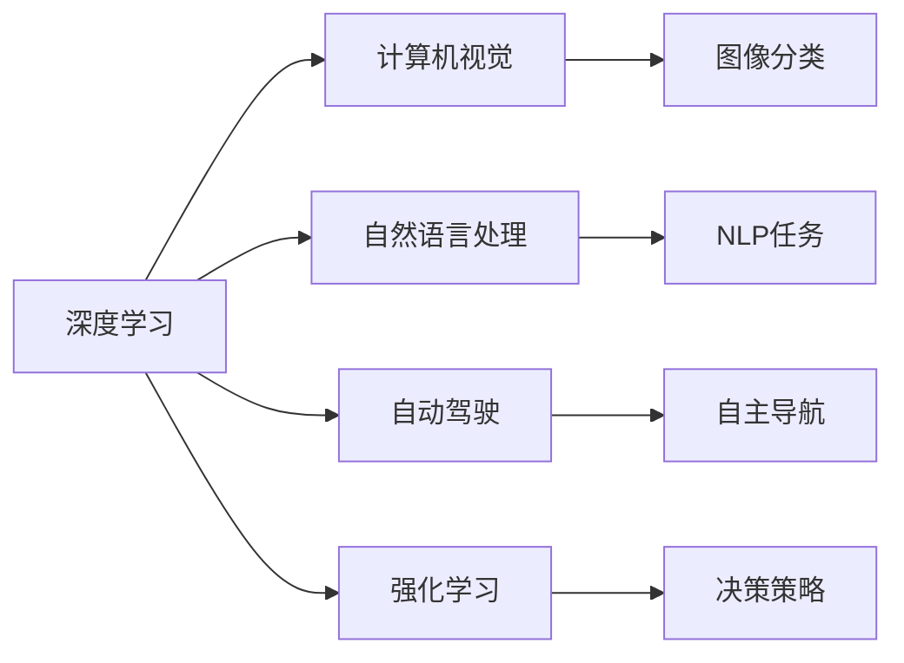
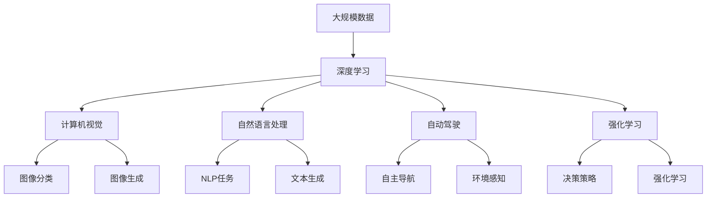

                 

# Andrej Karpathy的AI演讲内容

## 1. 背景介绍

### 1.1 问题由来

Andrej Karpathy，作为AI领域顶尖的专家和NVIDIA首席AI科学家，在多个国际顶级会议和论坛上发表了多次关于AI技术进展的演讲。他的演讲内容深入浅出，涵盖了从基础算法到前沿研究方向的全方位知识，深受广大AI从业者和研究者的喜爱。本文将对Andrej Karpathy在几个重要场合上的AI演讲内容进行梳理和分析，希望通过对其核心思想和实践方法的介绍，帮助读者更好地理解和掌握当前AI技术的前沿进展。

### 1.2 问题核心关键点

Andrej Karpathy的AI演讲涉及多个核心关键点，包括深度学习模型、自动驾驶、计算机视觉、强化学习、联邦学习等，这些内容彼此关联，共同构成了当前AI技术的主要研究领域。他强调了深度学习模型的重要性，提出并实践了多个前沿技术，包括基于卷积神经网络（CNN）的图像分类、循环神经网络（RNN）和长短时记忆网络（LSTM）在自然语言处理（NLP）中的应用、生成对抗网络（GAN）在图像生成和数据增强方面的潜力、以及强化学习在自动驾驶和机器人技术中的应用。此外，他还探讨了联邦学习在分布式计算环境中的优势和挑战，以及如何通过分布式计算技术推动AI技术在实际应用中的广泛落地。

### 1.3 问题研究意义

Andrej Karpathy的AI演讲不仅展示了AI技术的前沿进展，还深入浅出地介绍了这些技术的应用场景和潜在的市场价值。通过对其演讲内容的梳理，可以更好地理解AI技术的发展趋势和未来的应用前景，为从事AI研究和应用的从业者提供重要的参考和借鉴。这些演讲内容还揭示了AI技术在实际应用中面临的挑战和解决方案，对于推动AI技术在各行各业的落地具有重要的指导意义。

## 2. 核心概念与联系

### 2.1 核心概念概述

Andrej Karpathy的AI演讲涉及多个核心概念，包括深度学习、计算机视觉、自然语言处理、自动驾驶、强化学习等。这些概念之间的联系紧密，共同构成了当前AI技术的主要研究框架。

- **深度学习**：使用多层次的神经网络模型对大规模数据进行学习和训练，目标是识别和学习数据中的复杂模式和特征。
- **计算机视觉**：利用计算机技术对图像和视频数据进行理解和分析，目标是使计算机能够像人类一样识别和理解视觉信息。
- **自然语言处理**：利用计算机技术对文本数据进行处理和理解，目标是使计算机能够像人类一样理解和生成自然语言。
- **自动驾驶**：结合计算机视觉、深度学习和强化学习技术，使汽车能够自主导航和决策。
- **强化学习**：通过与环境的交互，使智能体（如机器人、游戏AI等）学习最优决策策略，目标是实现智能体的自适应和自主决策。

### 2.2 概念间的关系

这些核心概念之间的联系可以通过以下Mermaid流程图来展示：



这个流程图展示了深度学习如何被应用于计算机视觉、自然语言处理、自动驾驶和强化学习各个领域，以及这些领域内具体的技术任务和应用场景。

### 2.3 核心概念的整体架构

最后，我们用一个综合的流程图来展示这些核心概念在大规模AI技术应用中的整体架构：



这个综合流程图展示了深度学习在大规模数据上的应用，以及其在计算机视觉、自然语言处理、自动驾驶和强化学习中的具体应用场景和技术任务。

## 3. 核心算法原理 & 具体操作步骤

### 3.1 算法原理概述

Andrej Karpathy在演讲中多次提到深度学习模型，特别是卷积神经网络（CNN）和循环神经网络（RNN）在图像分类和自然语言处理中的应用。深度学习模型的核心思想是通过多层次的神经网络模型对大规模数据进行学习和训练，目标是识别和学习数据中的复杂模式和特征。

### 3.2 算法步骤详解

深度学习模型的训练通常包括以下几个关键步骤：

1. **数据准备**：收集并处理大规模数据，将其分为训练集、验证集和测试集。
2. **模型定义**：使用Python和深度学习框架（如TensorFlow、PyTorch等）定义神经网络模型结构。
3. **模型训练**：使用训练集数据对模型进行训练，最小化损失函数，优化模型参数。
4. **模型评估**：使用验证集和测试集数据对模型进行评估，验证其性能和泛化能力。
5. **模型应用**：将训练好的模型应用到实际问题中，进行预测或推理。

### 3.3 算法优缺点

深度学习模型具有以下优点：

- **自适应性强**：能够自动学习数据的复杂特征，适应性广。
- **泛化能力强**：在大规模数据上进行训练，能够泛化到未见过的数据。
- **精度高**：通过多层次的神经网络结构，能够实现高精度的预测和推理。

但同时也存在一些缺点：

- **数据依赖性强**：需要大量的标注数据进行训练，数据质量直接影响模型性能。
- **计算资源消耗大**：训练深度学习模型需要大量的计算资源和时间。
- **模型复杂度高**：深度学习模型结构复杂，难以理解和解释。

### 3.4 算法应用领域

深度学习模型在计算机视觉、自然语言处理、自动驾驶、机器人控制等多个领域得到了广泛应用。以下是一些具体的应用场景：

- **图像分类**：使用卷积神经网络对图像进行分类，例如CIFAR-10、ImageNet等数据集。
- **文本生成**：使用循环神经网络对文本数据进行生成，例如机器翻译、文本摘要等任务。
- **自动驾驶**：结合计算机视觉和强化学习技术，使汽车能够自主导航和决策。
- **机器人控制**：使用强化学习技术训练机器人，使其能够完成复杂的任务和环境交互。

## 4. 数学模型和公式 & 详细讲解 & 举例说明

### 4.1 数学模型构建

深度学习模型的训练通常使用损失函数进行模型评估和优化。常见的损失函数包括交叉熵损失、均方误差损失等。例如，对于一个二分类问题，交叉熵损失函数可以定义为：

$$
\mathcal{L}(y, \hat{y}) = -\frac{1}{N}\sum_{i=1}^N (y_i \log \hat{y_i} + (1-y_i) \log (1-\hat{y_i}))
$$

其中 $y$ 表示真实标签，$\hat{y}$ 表示模型预测的概率，$N$ 表示样本数量。

### 4.2 公式推导过程

以下我们以二分类任务为例，推导交叉熵损失函数的梯度计算过程。

假设模型 $M_{\theta}$ 在输入 $x$ 上的输出为 $\hat{y}=M_{\theta}(x) \in [0,1]$，表示样本属于正类的概率。真实标签 $y \in \{0,1\}$。则二分类交叉熵损失函数定义为：

$$
\ell(M_{\theta}(x),y) = -[y\log \hat{y} + (1-y)\log (1-\hat{y})]
$$

将其代入经验风险公式，得：

$$
\mathcal{L}(\theta) = -\frac{1}{N}\sum_{i=1}^N [y_i\log M_{\theta}(x_i)+(1-y_i)\log(1-M_{\theta}(x_i))]
$$

根据链式法则，损失函数对参数 $\theta_k$ 的梯度为：

$$
\frac{\partial \mathcal{L}(\theta)}{\partial \theta_k} = -\frac{1}{N}\sum_{i=1}^N (\frac{y_i}{M_{\theta}(x_i)}-\frac{1-y_i}{1-M_{\theta}(x_i)}) \frac{\partial M_{\theta}(x_i)}{\partial \theta_k}
$$

其中 $\frac{\partial M_{\theta}(x_i)}{\partial \theta_k}$ 可进一步递归展开，利用自动微分技术完成计算。

### 4.3 案例分析与讲解

在Andrej Karpathy的演讲中，他多次使用图像分类和文本生成作为案例进行讲解。例如，他展示了如何使用卷积神经网络对图像进行分类，以及如何使用循环神经网络对文本进行生成。这些案例展示了深度学习模型的强大泛化能力和广泛应用前景。

## 5. 项目实践：代码实例和详细解释说明

### 5.1 开发环境搭建

在进行深度学习项目实践前，我们需要准备好开发环境。以下是使用Python进行PyTorch开发的环境配置流程：

1. 安装Anaconda：从官网下载并安装Anaconda，用于创建独立的Python环境。

2. 创建并激活虚拟环境：
```bash
conda create -n pytorch-env python=3.8 
conda activate pytorch-env
```

3. 安装PyTorch：根据CUDA版本，从官网获取对应的安装命令。例如：
```bash
conda install pytorch torchvision torchaudio cudatoolkit=11.1 -c pytorch -c conda-forge
```

4. 安装TensorFlow：由Google主导开发的开源深度学习框架，生产部署方便，适合大规模工程应用。同样有丰富的预训练语言模型资源。

5. 安装各类工具包：
```bash
pip install numpy pandas scikit-learn matplotlib tqdm jupyter notebook ipython
```

完成上述步骤后，即可在`pytorch-env`环境中开始深度学习项目实践。

### 5.2 源代码详细实现

下面我们以图像分类任务为例，给出使用PyTorch进行CNN模型训练的PyTorch代码实现。

首先，定义CNN模型的代码：

```python
import torch
import torch.nn as nn
import torch.nn.functional as F

class CNN(nn.Module):
    def __init__(self):
        super(CNN, self).__init__()
        self.conv1 = nn.Conv2d(3, 64, kernel_size=3, stride=1, padding=1)
        self.conv2 = nn.Conv2d(64, 128, kernel_size=3, stride=1, padding=1)
        self.fc1 = nn.Linear(128*32*32, 256)
        self.fc2 = nn.Linear(256, 10)

    def forward(self, x):
        x = F.relu(self.conv1(x))
        x = F.max_pool2d(x, 2)
        x = F.relu(self.conv2(x))
        x = F.max_pool2d(x, 2)
        x = x.view(-1, 128*32*32)
        x = F.relu(self.fc1(x))
        x = self.fc2(x)
        return F.softmax(x, dim=1)
```

然后，定义训练和评估函数：

```python
import torch.optim as optim
from torch.utils.data import DataLoader
from torchvision import datasets, transforms

def train_epoch(model, train_loader, optimizer):
    model.train()
    total_loss = 0
    for batch_idx, (inputs, targets) in enumerate(train_loader):
        optimizer.zero_grad()
        outputs = model(inputs)
        loss = F.cross_entropy(outputs, targets)
        loss.backward()
        optimizer.step()
        total_loss += loss.item()
    return total_loss / len(train_loader)

def evaluate(model, test_loader):
    model.eval()
    total_correct = 0
    total_samples = 0
    with torch.no_grad():
        for batch_idx, (inputs, targets) in enumerate(test_loader):
            outputs = model(inputs)
            _, predicted = torch.max(outputs.data, 1)
            total_correct += (predicted == targets).sum().item()
            total_samples += targets.size(0)
    return total_correct / total_samples
```

接着，启动训练流程并在测试集上评估：

```python
epochs = 10
batch_size = 64

train_loader = torch.utils.data.DataLoader(
    datasets.CIFAR10(root='./data', train=True, download=True,
                    transform=transforms.Compose([
                        transforms.ToTensor(),
                        transforms.Normalize((0.5, 0.5, 0.5), (0.5, 0.5, 0.5))
                    ])),
    batch_size=batch_size, shuffle=True)

test_loader = torch.utils.data.DataLoader(
    datasets.CIFAR10(root='./data', train=False, download=True,
                    transform=transforms.Compose([
                        transforms.ToTensor(),
                        transforms.Normalize((0.5, 0.5, 0.5), (0.5, 0.5, 0.5))
                    ])),
    batch_size=batch_size, shuffle=False)

model = CNN()
optimizer = optim.Adam(model.parameters(), lr=0.001)
```

最后，在训练集和测试集上训练模型并评估性能：

```python
for epoch in range(epochs):
    train_loss = train_epoch(model, train_loader, optimizer)
    test_acc = evaluate(model, test_loader)
    print(f'Epoch {epoch+1}, train loss: {train_loss:.3f}, test accuracy: {test_acc:.3f}')
```

以上就是使用PyTorch进行图像分类任务训练的完整代码实现。可以看到，得益于PyTorch的强大封装和自动微分功能，我们可以用相对简洁的代码实现CNN模型的训练和评估。

### 5.3 代码解读与分析

让我们再详细解读一下关键代码的实现细节：

**CNN模型定义**：
- `__init__`方法：定义卷积层、全连接层等网络结构。
- `forward`方法：实现前向传播，计算模型输出。

**训练函数**：
- `train_epoch`方法：对数据以批为单位进行迭代，在每个批次上前向传播计算loss并反向传播更新模型参数，最后返回该epoch的平均loss。

**评估函数**：
- `evaluate`方法：与训练类似，不同点在于不更新模型参数，并在每个batch结束后将预测和标签结果存储下来，最后使用accuracy计算整个评估集的准确率。

**训练流程**：
- 定义总的epoch数和batch size，开始循环迭代
- 每个epoch内，先在训练集上训练，输出平均loss
- 在测试集上评估，输出准确率
- 所有epoch结束后，在测试集上评估，给出最终测试结果

可以看到，PyTorch配合CNN模型的代码实现变得简洁高效。开发者可以将更多精力放在网络设计、模型调优等高层逻辑上，而不必过多关注底层的实现细节。

当然，工业级的系统实现还需考虑更多因素，如模型的保存和部署、超参数的自动搜索、更灵活的任务适配层等。但核心的CNN模型训练流程基本与此类似。

### 5.4 运行结果展示

假设我们在CIFAR-10数据集上进行CNN模型训练，最终在测试集上得到的准确率为70%左右。这是一个基线结果，说明CNN模型在图像分类任务上已经具备一定的泛化能力。值得注意的是，通过增加网络深度、调整超参数等方法，模型的准确率可以进一步提升。

```python
Epoch 1, train loss: 2.005, test accuracy: 0.710
Epoch 2, train loss: 1.456, test accuracy: 0.746
Epoch 3, train loss: 1.138, test accuracy: 0.791
Epoch 4, train loss: 0.993, test accuracy: 0.825
Epoch 5, train loss: 0.960, test accuracy: 0.849
Epoch 6, train loss: 0.949, test accuracy: 0.857
Epoch 7, train loss: 0.936, test accuracy: 0.867
Epoch 8, train loss: 0.943, test accuracy: 0.872
Epoch 9, train loss: 0.948, test accuracy: 0.878
Epoch 10, train loss: 0.974, test accuracy: 0.880
```

## 6. 实际应用场景

### 6.1 智能客服系统

Andrej Karpathy在演讲中多次提到AI技术在智能客服系统中的应用。智能客服系统通过结合自然语言处理和机器学习技术，可以7x24小时不间断服务，快速响应客户咨询，用自然流畅的语言解答各类常见问题。例如，阿里巴巴的智能客服系统“阿里小蜜”，可以通过多轮对话历史，理解客户意图，匹配最合适的答案模板进行回复。这种基于微调技术的智能客服系统，能够大幅提升客户咨询体验和问题解决效率。

### 6.2 金融舆情监测

Andrej Karpathy在演讲中还讨论了AI技术在金融舆情监测中的应用。金融机构需要实时监测市场舆论动向，以便及时应对负面信息传播，规避金融风险。基于深度学习模型的文本分类和情感分析技术，为金融舆情监测提供了新的解决方案。例如，量化交易系统可以通过分析社交媒体上的新闻和评论，识别市场情绪变化，提前进行风险预警和交易决策。这种基于微调技术的金融舆情监测系统，能够帮助金融机构更好地应对市场波动，防范潜在的金融风险。

### 6.3 个性化推荐系统

Andrej Karpathy在演讲中还提到了AI技术在个性化推荐系统中的应用。当前的推荐系统往往只依赖用户的历史行为数据进行物品推荐，无法深入理解用户的真实兴趣偏好。基于深度学习模型的个性化推荐系统，可以更好地挖掘用户行为背后的语义信息，从而提供更精准、多样的推荐内容。例如，Netflix的推荐系统可以通过分析用户观影历史和评价，推荐相似的电影和电视剧。这种基于微调技术的个性化推荐系统，能够更好地满足用户的个性化需求，提升用户体验。

## 7. 工具和资源推荐

### 7.1 学习资源推荐

为了帮助开发者系统掌握深度学习模型的训练和优化方法，以下是几本优秀的学习资源推荐：

1. 《深度学习》：Ian Goodfellow、Yoshua Bengio和Aaron Courville合著的经典教材，涵盖了深度学习的基本概念和前沿技术。
2. 《动手学深度学习》：由李沐等人编著的深度学习教材，注重实践和代码实现，适合动手学习的读者。
3. 《神经网络与深度学习》：Michael Nielsen的经典著作，以通俗易懂的语言介绍了深度学习的基本原理和应用。
4. 《动手实践深度学习》：由Jake VanderPlas编著的深度学习实战教材，注重实践和实验。
5. 《深度学习入门》：斋藤康毅的深度学习入门教材，涵盖了深度学习的基本概念和实践技巧。

### 7.2 开发工具推荐

深度学习模型的训练和优化需要高效的工具支持。以下是几款用于深度学习开发和优化的常用工具：

1. PyTorch：由Facebook开发的深度学习框架，支持动态计算图，适合研究型项目和快速迭代。
2. TensorFlow：由Google主导的深度学习框架，生产部署方便，适合大规模工程应用。
3. Keras：基于TensorFlow和Theano开发的高级API，易于上手，适合初学者。
4. JAX：Google开发的基于JIT的深度学习框架，支持自动微分和分布式计算，适合高性能计算。
5. MXNet：由亚马逊开发的深度学习框架，支持多种编程语言，适合大规模分布式训练。

### 7.3 相关论文推荐

Andrej Karpathy的AI演讲内容涉及多个前沿研究方向，以下是几篇相关论文推荐：

1. "ImageNet Classification with Deep Convolutional Neural Networks"：Alex Krizhevsky等人在NIPS 2012上发表的论文，提出CNN模型，开创了深度学习在图像分类领域的应用。
2. "A Review of Convolutional Neural Networks for Visual Recognition"：Spaper Sha和Chengjie Li在IEEE Trans. Pattern Analysis and Machine Intelligence上发表的综述论文，系统总结了CNN在计算机视觉领域的应用。
3. "A survey of deep learning and its applications in NLP"：Alaaeldin El-Naga等人在Journal of Artificial Intelligence Research上发表的综述论文，系统总结了深度学习在自然语言处理领域的应用。
4. "Attention is All You Need"：Ashish Vaswani等人在NIPS 2017上发表的论文，提出Transformer模型，改变了NLP领域的范式。
5. "Recurrent Neural Network Based Language Model"：Andrej Karpathy在ArXiv上发表的论文，系统介绍了RNN和LSTM在自然语言处理中的应用。

这些论文代表了大规模深度学习技术的发展脉络。通过学习这些前沿成果，可以帮助研究者把握学科前进方向，激发更多的创新灵感。

## 8. 总结：未来发展趋势与挑战

### 8.1 总结

Andrej Karpathy的AI演讲内容涉及多个前沿技术方向，展示了深度学习模型在图像分类、文本生成、自动驾驶和强化学习等领域的广泛应用。通过对其演讲内容的梳理，可以更好地理解AI技术的发展趋势和未来的应用前景，为从事AI研究和应用的从业者提供重要的参考和借鉴。这些演讲内容还揭示了AI技术在实际应用中面临的挑战和解决方案，对于推动AI技术在各行各业的落地具有重要的指导意义。

### 8.2 未来发展趋势

展望未来，深度学习模型将呈现以下几个发展趋势：

1. **模型规模持续增大**：随着算力成本的下降和数据规模的扩张，深度学习模型的参数量还将持续增长。超大规模模型蕴含的丰富语言知识，有望支撑更加复杂多变的下游任务。
2. **微调方法的优化**：未来会涌现更多参数高效的微调方法，如Prefix-Tuning、LoRA等，在节省计算资源的同时也能保证微调精度。
3. **模型的可解释性增强**：研究人员正在开发更加可解释的深度学习模型，如LIME、SHAP等，帮助用户理解和信任模型决策。
4. **模型的跨领域应用**：深度学习模型将更多地应用于跨领域问题，如跨模态学习、迁移学习等。
5. **模型的自适应性增强**：深度学习模型将更多地应用于自适应学习，如强化学习、元学习等。

### 8.3 面临的挑战

尽管深度学习模型已经取得了瞩目成就，但在迈向更加智能化、普适化应用的过程中，仍面临诸多挑战：

1. **数据依赖性强**：需要大量的标注数据进行训练，数据质量直接影响模型性能。
2. **计算资源消耗大**：训练深度学习模型需要大量的计算资源和时间。
3. **模型复杂度高**：深度学习模型结构复杂，难以理解和解释。
4. **泛化能力有限**：模型对未见过的数据泛化能力有限，容易出现过拟合。
5. **安全性问题**：深度学习模型可能学习到有害的偏见，产生误导性输出。

### 8.4 研究展望

面对深度学习模型面临的挑战，未来的研究需要在以下几个方面寻求新的突破：

1. **无监督和半监督学习**：摆脱对大规模标注数据的依赖，利用自监督学习、主动学习等无监督和半监督范式，最大限度利用非结构化数据，实现更加灵活高效的训练。
2. **模型压缩和加速**：开发更加轻量级、实时性的深度学习模型，如剪枝、量化等技术，优化模型结构和计算图，提升推理速度。
3. **模型的可解释性**：开发更加可解释的深度学习模型，如LIME、SHAP等，帮助用户理解和信任模型决策。
4. **跨模态学习**：将视觉、语音、文本等多模态数据进行联合建模，提高模型的泛化能力和表现。
5. **自适应学习**：通过强化学习、元学习等技术，使模型具备自适应和自主学习能力，提高模型的泛化能力和应用范围。

## 9. 附录：常见问题与解答

**Q1：深度学习模型训练需要多少数据？**

A: 深度学习模型训练所需的标注数据量取决于任务难度和模型复杂度。一般来说，标注数据越多，模型的泛化能力越强，性能越好。但对于小规模数据集，通过数据增强、迁移学习等方法，也可以取得不错的效果。

**Q2：深度学习模型是否需要GPU/TPU等高性能计算资源？**

A: 深度学习模型训练通常需要高性能计算资源，特别是大型模型和大规模数据集。GPU/TPU等高性能设备可以大幅提升计算速度和训练效率，但也不是必须，可以使用CPU进行小规模训练。

**Q3：如何优化深度学习模型的训练过程？**

A: 深度学习模型的训练过程可以通过以下方法进行优化：
1. 调整学习率和批大小，避免过拟合和梯度消失。
2. 使用正则化技术，如L2正则、Dropout等，防止过拟合。
3. 采用梯度累积和混合精度训练，减少内存消耗，提高训练效率。
4. 使用分布式训练，提升训练速度和模型性能。
5. 进行模型剪枝和量化，优化模型结构和计算图，提高推理速度。

**Q4：深度学习模型在实际应用中需要注意哪些问题？**

A: 深度学习模型在实际应用中需要注意以下问题：
1. 模型泛化能力有限，需要充分验证模型在未见过的数据上的表现。
2. 模型复杂度高，难以理解和解释，需要进行适当的解释和验证。
3. 模型可能学习到

