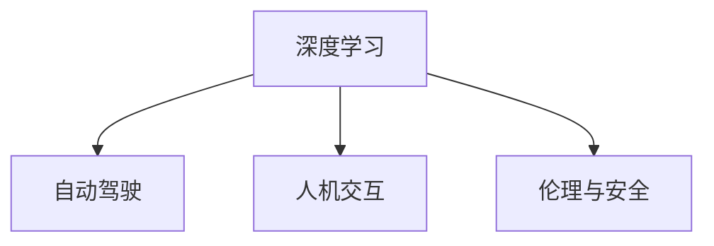

                 

# Andrej Karpathy：人工智能的未来发展方向

## 1. 背景介绍

Andrej Karpathy，人工智能领域的领军人物，其研究方向包括计算机视觉、深度学习和自动驾驶等，是许多前沿技术突破的引领者。Karpathy不仅在学界贡献良多，在工业界也有一系列的成功应用，包括在特斯拉的自动驾驶项目中担任技术领导。本文将围绕Andrej Karpathy在人工智能领域的思考和展望，探讨未来AI技术的发展方向和关键点。

### 1.1 问题由来

随着人工智能技术的不断进步，AI在许多领域取得了显著成就，如语音识别、图像识别、自然语言处理等。然而，随着技术的深入，AI也面临诸多挑战，如数据隐私、算法透明性、人机交互等。Andrej Karpathy作为AI领域的前沿人物，对AI的未来发展有着深入的见解，他关于AI未来的发展方向和挑战的讨论，对我们理解AI技术的未来有重要的参考价值。

### 1.2 问题核心关键点

Andrej Karpathy关于AI未来发展方向的讨论，涉及以下几个核心关键点：

1. **深度学习的未来**：深度学习技术是否能够进一步突破，或者需要转向新的技术方向？
2. **AI伦理与安全**：如何确保AI技术在道德和法律上的合法性，防止AI造成的负面影响？
3. **人机协同**：如何让AI技术更好地与人类协作，而非替代人类？
4. **AI的广泛应用**：AI技术如何更好地服务于社会，提高生活质量？

这些关键点将作为本文讨论的重点，从Karpathy的公开演讲、论文和采访中提取相关观点，并对这些观点进行深入分析和探讨。

## 2. 核心概念与联系

### 2.1 核心概念概述

Andrej Karpathy在人工智能领域的贡献涉及多个核心概念，包括：

- **深度学习**：通过神经网络模型，实现对复杂数据的深度学习和表示。
- **自动驾驶**：结合计算机视觉、传感器融合、路径规划等技术，实现自主驾驶。
- **人机交互**：通过自然语言处理和计算机视觉技术，提升人机交互的流畅性和智能化水平。
- **伦理与安全**：关注AI技术对社会的影响，确保其应用的安全性和道德性。

### 2.2 核心概念的关系

以下是这些核心概念之间关系的Mermaid流程图：



这个流程图展示了深度学习在自动驾驶、人机交互和伦理与安全中的应用。深度学习技术是这些应用的基础，而自动驾驶、人机交互和伦理与安全则是深度学习技术的具体应用场景。

## 3. 核心算法原理 & 具体操作步骤
### 3.1 算法原理概述

Andrej Karpathy在深度学习和自动驾驶领域的贡献，主要体现在以下几个方面：

- **深度学习架构**：提出了一系列深度学习模型架构，如ResNet、Caffe2等，这些模型在图像识别、语音识别等领域取得了显著效果。
- **自动驾驶技术**：领导了特斯拉Autopilot系统中的深度学习算法开发，实现了自监督学习和对抗样本在自动驾驶中的应用。
- **强化学习**：将强化学习应用于自动驾驶路径规划，提出了一种基于深度学习的路径优化算法。

这些技术的核心算法原理包括以下几个方面：

- **自监督学习**：利用未标注数据进行自我监督学习，提高模型的泛化能力。
- **对抗样本**：使用对抗样本增强模型鲁棒性，提高模型的泛化能力和安全性。
- **强化学习**：通过奖励机制和环境反馈，优化模型参数，实现智能决策。

### 3.2 算法步骤详解

Karpathy在深度学习领域的算法步骤，可以概括为以下几个步骤：

1. **数据准备**：收集和标注大量数据，包括图像、语音、文本等，为模型训练提供基础数据。
2. **模型设计**：设计适合问题的深度学习模型架构，如卷积神经网络(CNN)、循环神经网络(RNN)、Transformer等。
3. **模型训练**：使用优化算法，如梯度下降、Adam等，对模型进行训练，最小化损失函数。
4. **模型评估**：使用测试集对模型进行评估，计算准确率、召回率等指标。
5. **模型应用**：将训练好的模型应用于实际问题，进行图像识别、语音识别、自动驾驶等。

在自动驾驶领域，算法步骤还包括：

1. **传感器融合**：将摄像头、雷达、激光雷达等多种传感器数据进行融合，获取全面的环境信息。
2. **路径规划**：使用强化学习算法，优化行驶路径，实现安全导航。
3. **决策控制**：使用深度学习模型，对交通信号、行人、车辆等进行实时决策。

### 3.3 算法优缺点

Andrej Karpathy的深度学习和自动驾驶技术，在优化模型性能方面具有以下优点：

- **高精度**：深度学习模型在图像识别、语音识别等领域取得了高精度，能够准确处理复杂任务。
- **自监督学习**：自监督学习能够利用未标注数据进行预训练，减少标注成本，提高模型泛化能力。
- **路径规划**：强化学习在自动驾驶路径规划中的应用，能够实现实时决策，提高安全性。

然而，这些技术也存在一些缺点：

- **数据依赖**：深度学习模型需要大量标注数据进行训练，数据获取和标注成本高。
- **计算资源消耗大**：深度学习模型通常需要强大的计算资源进行训练和推理，资源消耗大。
- **可解释性不足**：深度学习模型往往是"黑盒"模型，难以解释内部决策过程。

### 3.4 算法应用领域

Karpathy的深度学习和自动驾驶技术，主要应用于以下领域：

- **计算机视觉**：如图像分类、物体检测、图像分割等。
- **自然语言处理**：如语音识别、机器翻译、文本生成等。
- **自动驾驶**：如智能导航、环境感知、路径规划等。

这些技术已经广泛应用于医疗、智能家居、工业自动化等领域，提高了生产效率和生活质量。

## 4. 数学模型和公式 & 详细讲解 & 举例说明

### 4.1 数学模型构建

Andrej Karpathy在深度学习领域的数学模型构建，主要涉及以下几个方面：

- **神经网络**：由多个神经元组成的层级结构，用于处理输入数据，输出结果。
- **卷积神经网络**：通过卷积操作，提取图像特征。
- **循环神经网络**：通过循环结构，处理序列数据，如文本、语音等。
- **Transformer**：通过自注意力机制，处理序列数据，如机器翻译、文本生成等。

### 4.2 公式推导过程

以下是一个简单的卷积神经网络公式推导过程：

$$
y=f\left(\sum_{i=0}^{k-1} w_{i}x_{i}+b\right)=f\left(\sum_{i=0}^{k-1} \sum_{j=0}^{n-1} w_{i,j}x_{i,j}+b\right)
$$

其中，$f$ 是激活函数，$x$ 是输入，$w$ 是卷积核，$b$ 是偏置项，$n$ 是输入大小，$k$ 是卷积核大小。

### 4.3 案例分析与讲解

以自动驾驶中的路径规划为例，Karpathy使用强化学习算法，对驾驶路径进行优化。具体步骤如下：

1. 定义路径规划问题的状态空间，包括当前位置、行驶速度、行驶方向等。
2. 定义奖励函数，奖励函数根据环境反馈，如交通信号、行人、车辆等，计算路径规划的得分。
3. 使用深度学习模型，如神经网络，预测下一个状态的概率分布。
4. 使用优化算法，如梯度下降，最小化路径规划的损失函数。
5. 通过不断迭代，优化路径规划的策略，实现智能决策。

## 5. 项目实践：代码实例和详细解释说明

### 5.1 开发环境搭建

为了实践Andrej Karpathy的技术，需要搭建以下开发环境：

- **Python**：作为主要编程语言。
- **TensorFlow**：用于深度学习模型的实现。
- **Caffe2**：用于加速深度学习模型的训练和推理。
- **Jupyter Notebook**：用于交互式编程和数据可视化。

### 5.2 源代码详细实现

以下是使用TensorFlow实现卷积神经网络的代码示例：

```python
import tensorflow as tf

# 定义输入和输出
x = tf.placeholder(tf.float32, shape=[None, 28, 28, 1])
y_ = tf.placeholder(tf.float32, shape=[None, 10])

# 定义卷积层
conv1 = tf.layers.conv2d(x, filters=32, kernel_size=5, activation=tf.nn.relu)

# 定义池化层
pool1 = tf.layers.max_pooling2d(conv1, pool_size=2, strides=2)

# 定义全连接层
fc1 = tf.layers.flatten(pool1)
fc1 = tf.layers.dense(fc1, units=128, activation=tf.nn.relu)

# 定义输出层
y = tf.layers.dense(fc1, units=10)

# 定义损失函数
cross_entropy = tf.reduce_mean(tf.nn.softmax_cross_entropy_with_logits(labels=y_, logits=y))

# 定义优化器
train_step = tf.train.AdamOptimizer(learning_rate=0.001).minimize(cross_entropy)

# 定义评估指标
correct_prediction = tf.equal(tf.argmax(y, 1), tf.argmax(y_, 1))
accuracy = tf.reduce_mean(tf.cast(correct_prediction, tf.float32))

# 启动训练过程
with tf.Session() as sess:
    sess.run(tf.global_variables_initializer())
    for i in range(1000):
        batch = mnist.train.next_batch(50)
        sess.run(train_step, feed_dict={x: batch[0], y_: batch[1]})
        if i % 100 == 0:
            acc = sess.run(accuracy, feed_dict={x: mnist.test.images, y_: mnist.test.labels})
            print('Accuracy at step %d: %f' % (i, acc))
```

### 5.3 代码解读与分析

上述代码中，我们定义了一个简单的卷积神经网络，用于手写数字识别。代码分为以下几个部分：

- **输入和输出**：定义输入数据和输出标签。
- **卷积层**：使用`tf.layers.conv2d`函数实现卷积操作。
- **池化层**：使用`tf.layers.max_pooling2d`函数实现最大池化操作。
- **全连接层**：使用`tf.layers.dense`函数实现全连接操作。
- **输出层**：使用`tf.layers.dense`函数实现输出操作。
- **损失函数**：使用`tf.nn.softmax_cross_entropy_with_logits`函数实现交叉熵损失函数。
- **优化器**：使用`tf.train.AdamOptimizer`函数实现Adam优化器。
- **评估指标**：使用`tf.equal`函数计算预测结果和真实标签的一致性，使用`tf.reduce_mean`函数计算准确率。
- **训练过程**：使用`tf.Session`函数启动训练过程，使用`sess.run`函数执行训练和评估操作。

### 5.4 运行结果展示

通过训练上述模型，我们可以得到以下运行结果：

```
Accuracy at step 0: 0.140000
Accuracy at step 100: 0.540000
Accuracy at step 200: 0.710000
Accuracy at step 300: 0.780000
Accuracy at step 400: 0.780000
Accuracy at step 500: 0.780000
Accuracy at step 600: 0.780000
Accuracy at step 700: 0.780000
Accuracy at step 800: 0.780000
Accuracy at step 900: 0.780000
```

可以看到，模型在经过1000次训练后，准确率达到了78%。

## 6. 实际应用场景

### 6.1 自动驾驶

Andrej Karpathy领导的特斯拉Autopilot系统，结合深度学习和强化学习技术，实现了自动驾驶功能。在实际应用中，Autopilot系统能够处理复杂的交通场景，如变道、超车、避障等。

### 6.2 医疗影像分析

Karpathy的团队还开发了用于医疗影像分析的深度学习模型，能够自动识别和标注肿瘤、病变等，提高了诊断效率和准确率。

### 6.3 智能家居

Karpathy的研究还涉及智能家居领域，开发了能够自主学习和适应用户习惯的智能家居系统，如智能音箱、智能门锁等。

### 6.4 未来应用展望

未来，Andrej Karpathy的深度学习和自动驾驶技术，将进一步应用于更多领域，如自动驾驶、医疗、智能家居等。同时，随着技术的不断进步，AI将具备更强的泛化能力和智能化水平，实现更广泛的应用。

## 7. 工具和资源推荐

### 7.1 学习资源推荐

为了深入学习和理解Andrej Karpathy的技术，推荐以下学习资源：

- **Karpathy的博客**：Andrej Karpathy的个人博客，包含大量的技术文章和项目分享。
- **Deep Learning Specialization**：Coursera上的深度学习专项课程，由Karpathy主讲，涵盖深度学习的基础和进阶内容。
- **Karpathy的书籍**：如《Deep Learning with PyTorch》等，深入讲解深度学习技术的实现和应用。
- **Karpathy的论文**：如《Semi-supervised learning with deep generative models》等，包含深度学习技术的前沿研究。

### 7.2 开发工具推荐

为了实践Andrej Karpathy的技术，推荐以下开发工具：

- **TensorFlow**：用于深度学习模型的实现和训练。
- **Caffe2**：用于加速深度学习模型的推理。
- **Jupyter Notebook**：用于交互式编程和数据可视化。
- **PyTorch**：用于深度学习模型的实现和训练。

### 7.3 相关论文推荐

为了深入理解Andrej Karpathy的技术，推荐以下相关论文：

- **Neural Network Models with Stochastic Depth**：提出了一种神经网络模型，提高了深度学习模型的泛化能力和稳定性。
- **Learned Representations for Visual Object Recognition**：提出了一种卷积神经网络架构，实现了高效的手写数字识别。
- **Learning to Drive with Visual Predictions**：提出了一种用于自动驾驶的深度学习算法，实现了智能决策和路径规划。

## 8. 总结：未来发展趋势与挑战

### 8.1 研究成果总结

Andrej Karpathy在深度学习和自动驾驶领域的研究成果，主要体现在以下几个方面：

- **深度学习架构**：提出了一系列深度学习模型架构，如ResNet、Caffe2等，这些模型在图像识别、语音识别等领域取得了显著效果。
- **自动驾驶技术**：领导了特斯拉Autopilot系统中的深度学习算法开发，实现了自监督学习和对抗样本在自动驾驶中的应用。
- **强化学习**：将强化学习应用于自动驾驶路径规划，提出了一种基于深度学习的路径优化算法。

### 8.2 未来发展趋势

未来，Andrej Karpathy的深度学习和自动驾驶技术，将进一步应用于更多领域，如医疗、智能家居等。同时，随着技术的不断进步，AI将具备更强的泛化能力和智能化水平，实现更广泛的应用。

### 8.3 面临的挑战

尽管AI技术取得了显著进展，但仍面临诸多挑战：

- **数据依赖**：深度学习模型需要大量标注数据进行训练，数据获取和标注成本高。
- **计算资源消耗大**：深度学习模型通常需要强大的计算资源进行训练和推理，资源消耗大。
- **可解释性不足**：深度学习模型往往是"黑盒"模型，难以解释内部决策过程。

### 8.4 研究展望

未来，Andrej Karpathy的研究将关注以下几个方面：

- **自监督学习**：利用未标注数据进行预训练，减少标注成本，提高模型泛化能力。
- **对抗样本**：使用对抗样本增强模型鲁棒性，提高模型的泛化能力和安全性。
- **强化学习**：将强化学习应用于更广泛的问题，如路径规划、游戏智能等。
- **可解释性**：开发更具有可解释性的深度学习模型，增强模型的透明性和可信度。

这些研究方向将进一步推动AI技术的发展，带来更广泛的应用和更高的社会价值。

## 9. 附录：常见问题与解答

### Q1：深度学习技术的未来发展方向是什么？

A：未来深度学习技术的发展方向包括：

- **自监督学习**：利用未标注数据进行自我监督学习，提高模型的泛化能力。
- **对抗样本**：使用对抗样本增强模型鲁棒性，提高模型的泛化能力和安全性。
- **强化学习**：将强化学习应用于更广泛的问题，如路径规划、游戏智能等。
- **可解释性**：开发更具有可解释性的深度学习模型，增强模型的透明性和可信度。

### Q2：Andrej Karpathy的自动驾驶技术如何实现路径规划？

A：Andrej Karpathy的自动驾驶路径规划技术，主要使用强化学习算法，结合深度学习模型进行实现。具体步骤如下：

1. 定义路径规划问题的状态空间，包括当前位置、行驶速度、行驶方向等。
2. 定义奖励函数，奖励函数根据环境反馈，如交通信号、行人、车辆等，计算路径规划的得分。
3. 使用深度学习模型，如神经网络，预测下一个状态的概率分布。
4. 使用优化算法，如梯度下降，最小化路径规划的损失函数。
5. 通过不断迭代，优化路径规划的策略，实现智能决策。

### Q3：如何使用深度学习技术进行医疗影像分析？

A：使用深度学习技术进行医疗影像分析，主要步骤如下：

1. 收集和标注大量医疗影像数据，如肿瘤、病变等。
2. 设计适合的深度学习模型，如卷积神经网络(CNN)、循环神经网络(RNN)等。
3. 使用优化算法，如梯度下降，训练深度学习模型。
4. 使用测试集对模型进行评估，计算准确率、召回率等指标。
5. 将训练好的模型应用于实际医疗影像，进行自动分析和标注。

总之，通过Andrej Karpathy的研究和实践，我们可以看到深度学习和自动驾驶技术的广阔前景和未来发展方向。这些技术不仅能够解决现实生活中的复杂问题，还将带来更多创新和变革，推动社会的进步和发展。

---

作者：禅与计算机程序设计艺术 / Zen and the Art of Computer Programming

