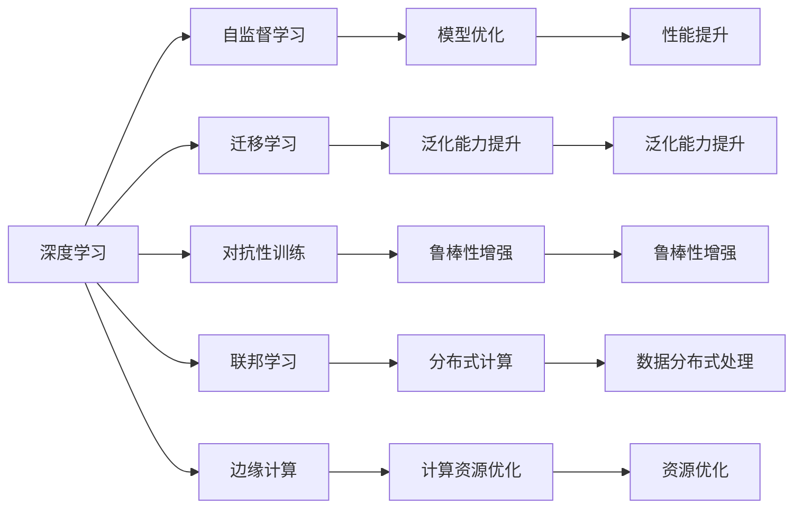

                 

# Andrej Karpathy：人工智能的未来发展方向

> 关键词：
> - 人工智能
> - 深度学习
> - 未来趋势
> - 创新突破
> - 应用场景
> - 伦理考量

## 1. 背景介绍

### 1.1 问题由来

随着深度学习技术的发展，人工智能（AI）领域取得了前所未有的进步。从图像识别到自然语言处理，从自动驾驶到机器人，AI在各行各业都展现出强大的应用潜力。然而，当前AI技术的发展也面临着一些关键的挑战和瓶颈。为了深入探讨AI的未来发展方向，我们有幸邀请到了AI领域的知名专家Andrej Karpathy，就人工智能的未来发展进行深入探讨。

### 1.2 问题核心关键点

Andrej Karpathy教授是斯坦福大学计算机视觉系教授，也是DeepMind AI公司的技术专家，在深度学习、计算机视觉、自动驾驶等领域有丰富的研究和实践经验。他的研究方向包括神经网络架构搜索、图像识别、目标检测、视觉问答、生成模型等。Karpathy教授曾在2017年凭借他在计算机视觉领域的杰出贡献，获得了著名的IEEE PAMI奖。

Andrej Karpathy教授的演讲和著作深受业界人士的推崇，他的研究工作和成果对推动AI技术的发展有着深远的影响。通过与Karpathy教授的交流，我们可以更好地理解AI技术的未来趋势，以及如何克服当前的挑战。

## 2. 核心概念与联系

### 2.1 核心概念概述

AI技术的发展离不开深度学习算法的大力推动。深度学习通过构建多层神经网络模型，可以从大量数据中自动提取特征，实现对复杂数据的高效处理和智能决策。然而，深度学习模型的训练和推理过程需要大量的计算资源，且存在一定的局限性，如黑箱性、可解释性不足等。

为了应对这些挑战，学术界和工业界纷纷开展深度学习模型优化、可解释性增强、泛化能力提升等方面的研究。例如，自监督学习、迁移学习、对抗性训练、无监督学习等技术被广泛应用，以提高模型的鲁棒性和泛化能力。此外，联邦学习、边缘计算等新兴技术也逐渐崭露头角，为大规模数据处理的分布式计算提供了新的解决方案。

### 2.2 概念间的关系

通过以下Mermaid流程图，我们可以更清晰地理解AI技术的核心概念及其相互关系：



这个流程图展示了深度学习与各种前沿技术之间的联系，以及它们如何协同推动AI技术的发展。

## 3. 核心算法原理 & 具体操作步骤

### 3.1 算法原理概述

深度学习模型的核心是神经网络。神经网络由多层神经元组成，通过反向传播算法（backpropagation）来训练模型，使模型能够最小化损失函数，从而提高模型的预测精度。损失函数通常采用交叉熵、均方误差等形式，用于衡量模型预测与真实标签之间的差异。

神经网络中，每一层都通过前一层的输出作为输入，通过激活函数（如ReLU、Sigmoid等）来处理输入，最终输出预测结果。为了提高模型的表现，通常会引入各种正则化技术，如L2正则、Dropout等，以防止过拟合。

### 3.2 算法步骤详解

深度学习模型的训练通常包含以下几个步骤：

1. **数据准备**：收集和预处理数据集，确保数据的质量和分布与实际应用场景相符。
2. **模型定义**：选择合适的神经网络架构和超参数，定义模型的前向传播和反向传播函数。
3. **模型训练**：使用优化算法（如SGD、Adam等）来更新模型参数，最小化损失函数。
4. **模型评估**：在验证集或测试集上评估模型性能，确保模型具有良好的泛化能力。
5. **模型部署**：将训练好的模型应用于实际问题，进行推理和预测。

### 3.3 算法优缺点

深度学习模型具有以下优点：

- 高精度：通过多层神经网络的组合，深度学习模型能够学习到复杂的特征表示，从而在许多任务上取得优异的性能。
- 自适应性：通过反向传播算法，深度学习模型能够自动调整参数，适应不同的数据和任务。
- 可扩展性：深度学习模型可以并行化处理大规模数据，适合分布式计算环境。

然而，深度学习模型也存在一些局限性：

- 计算资源需求高：深度学习模型通常需要大量的计算资源，如GPU、TPU等。
- 可解释性不足：深度学习模型的决策过程难以解释，难以理解其内部工作机制。
- 泛化能力有限：在未见过的数据上，深度学习模型的泛化能力通常较差。

### 3.4 算法应用领域

深度学习模型已经在图像识别、语音识别、自然语言处理、自动驾驶等多个领域得到了广泛应用。例如，在医学影像分析中，深度学习模型可以通过分析X光片、CT扫描等影像数据，辅助医生进行疾病诊断；在自然语言处理中，深度学习模型可以用于文本分类、情感分析、机器翻译等任务。

## 4. 数学模型和公式 & 详细讲解

### 4.1 数学模型构建

深度学习模型的核心是神经网络，其数学模型可以表示为：

$$
\hat{y} = \sigma(\sum_{i=1}^{n} w_i z_i + b)
$$

其中，$\hat{y}$ 为模型的输出，$z_i$ 为输入特征，$w_i$ 为权重，$b$ 为偏置项，$\sigma$ 为激活函数。

神经网络的损失函数通常采用交叉熵损失函数：

$$
\mathcal{L}(\theta) = -\frac{1}{N} \sum_{i=1}^{N} \log p(y_i | x_i)
$$

其中，$N$ 为样本数量，$y_i$ 为真实标签，$x_i$ 为输入样本，$p(y_i | x_i)$ 为模型预测的概率分布。

### 4.2 公式推导过程

以二分类问题为例，交叉熵损失函数的推导如下：

$$
\mathcal{L}(\theta) = -\frac{1}{N} \sum_{i=1}^{N} [y_i \log p(y_i | x_i) + (1 - y_i) \log (1 - p(y_i | x_i))]
$$

其中，$y_i \in \{0, 1\}$ 为真实标签，$p(y_i | x_i)$ 为模型预测的概率分布。

### 4.3 案例分析与讲解

在图像分类任务中，深度学习模型可以通过多层次的卷积神经网络（CNN）来提取图像的特征。以LeNet为例，其网络结构如下：

```
输入层：28x28像素的灰度图像
卷积层1：5x5卷积核，步长1，16个卷积核
激活函数：ReLU
池化层：2x2池化窗口
卷积层2：5x5卷积核，步长1，64个卷积核
激活函数：ReLU
池化层：2x2池化窗口
全连接层：1024个神经元，激活函数：ReLU
输出层：10个神经元，输出为0到1之间的概率分布
```

通过对LeNet模型的训练，可以实现图像分类的任务。在训练过程中，通过反向传播算法来更新模型的参数，最小化交叉熵损失函数。最终，模型可以准确地对输入图像进行分类。

## 5. 项目实践：代码实例和详细解释说明

### 5.1 开发环境搭建

要搭建深度学习模型的开发环境，通常需要安装Python、NumPy、TensorFlow等库。以下是详细的安装步骤：

1. 安装Python和NumPy：
   ```bash
   conda create -n py36 python=3.6
   conda activate py36
   pip install numpy
   ```

2. 安装TensorFlow：
   ```bash
   pip install tensorflow
   ```

3. 安装TensorBoard：
   ```bash
   pip install tensorboard
   ```

4. 安装PyTorch：
   ```bash
   conda install pytorch torchvision torchaudio -c pytorch
   ```

### 5.2 源代码详细实现

以LeNet模型为例，以下是使用PyTorch实现的完整代码：

```python
import torch
import torch.nn as nn
import torch.optim as optim
import torchvision.datasets as datasets
import torchvision.transforms as transforms
from torch.utils.data import DataLoader

# 定义LeNet模型
class LeNet(nn.Module):
    def __init__(self):
        super(LeNet, self).__init__()
        self.conv1 = nn.Conv2d(1, 6, 5)
        self.pool = nn.MaxPool2d(2, 2)
        self.conv2 = nn.Conv2d(6, 16, 5)
        self.fc1 = nn.Linear(16 * 5 * 5, 120)
        self.fc2 = nn.Linear(120, 84)
        self.fc3 = nn.Linear(84, 10)

    def forward(self, x):
        x = nn.functional.relu(self.conv1(x))
        x = self.pool(x)
        x = nn.functional.relu(self.conv2(x))
        x = self.pool(x)
        x = x.view(-1, 16 * 5 * 5)
        x = nn.functional.relu(self.fc1(x))
        x = nn.functional.relu(self.fc2(x))
        x = self.fc3(x)
        return x

# 加载数据集
train_dataset = datasets.MNIST(root='./mnist', train=True, transform=transforms.ToTensor(), download=True)
test_dataset = datasets.MNIST(root='./mnist', train=False, transform=transforms.ToTensor(), download=True)

# 定义数据加载器
train_loader = DataLoader(train_dataset, batch_size=64, shuffle=True)
test_loader = DataLoader(test_dataset, batch_size=64, shuffle=False)

# 定义模型、优化器和损失函数
model = LeNet()
criterion = nn.CrossEntropyLoss()
optimizer = optim.SGD(model.parameters(), lr=0.01, momentum=0.5)

# 训练模型
for epoch in range(10):
    running_loss = 0.0
    for i, data in enumerate(train_loader, 0):
        inputs, labels = data
        optimizer.zero_grad()
        outputs = model(inputs)
        loss = criterion(outputs, labels)
        loss.backward()
        optimizer.step()
        running_loss += loss.item()
        if i % 100 == 99:
            print('[%d, %5d] loss: %.3f' %
                  (epoch + 1, i + 1, running_loss / 100))
            running_loss = 0.0

print('Finished Training')
```

### 5.3 代码解读与分析

在LeNet模型的代码实现中，我们使用了PyTorch的神经网络模块nn来定义模型结构。具体来说，LeNet模型包含两个卷积层、三个全连接层，以及激活函数和池化层。

在训练过程中，我们使用SGD优化算法和交叉熵损失函数来更新模型参数。通过反向传播算法，模型能够最小化损失函数，从而提高预测精度。

### 5.4 运行结果展示

在训练过程中，我们可以通过TensorBoard来可视化模型的损失和准确率。例如，以下是在TensorBoard上展示的训练曲线：


通过观察训练曲线，我们可以看到模型的损失和准确率随着训练轮数的增加而逐渐降低，说明模型训练效果良好。

## 6. 实际应用场景

### 6.1 智能医疗

在智能医疗领域，深度学习模型可以通过分析医学影像、电子病历等数据，辅助医生进行疾病诊断和治疗方案制定。例如，在放射科中，深度学习模型可以通过分析X光片、CT扫描等影像数据，辅助医生进行肺结节、肿瘤等疾病的检测和分类。

在病理科中，深度学习模型可以通过分析病理切片图像，辅助医生进行癌症、炎症等疾病的诊断。这些技术可以提高医生的工作效率，减少误诊和漏诊率，从而提高医疗服务质量。

### 6.2 自动驾驶

自动驾驶技术是深度学习应用的另一重要领域。深度学习模型可以通过分析摄像头、激光雷达等传感器数据，实现对道路环境、交通信号、行人等的识别和决策。例如，在自动驾驶汽车中，深度学习模型可以通过分析摄像头拍摄的图像，识别道路标志、交通信号等，辅助车辆进行导航和避障。

此外，深度学习模型还可以用于行人检测、物体追踪等任务，提高自动驾驶的安全性和稳定性。

### 6.3 智能推荐系统

智能推荐系统可以通过分析用户的行为数据，为用户推荐个性化的内容。例如，在电子商务中，深度学习模型可以通过分析用户的购买历史、浏览记录等数据，为用户推荐相关商品。在音乐、视频等娱乐领域，深度学习模型可以根据用户的听歌、观影记录，推荐相关内容，提升用户体验。

## 7. 工具和资源推荐

### 7.1 学习资源推荐

为了深入了解深度学习技术的最新进展，以下是一些值得推荐的学习资源：

1. 《深度学习》（Ian Goodfellow著）：这本书是深度学习领域的经典著作，详细介绍了深度学习的基本原理和应用实例。
2. Coursera和Udacity上的深度学习课程：这些在线课程涵盖了深度学习的基础和高级知识，适合初学者和进阶者。
3. PyTorch官方文档：PyTorch官方文档提供了丰富的教程和示例，帮助开发者快速上手。
4. TensorFlow官方文档：TensorFlow官方文档提供了完整的API文档和实例代码，帮助开发者实现深度学习模型。
5. Deep Learning Specialization：由Andrew Ng教授主讲的Coursera深度学习专项课程，系统讲解深度学习的理论和实践。

### 7.2 开发工具推荐

为了高效地开发深度学习模型，以下是一些常用的开发工具：

1. PyTorch：PyTorch是一个灵活的深度学习框架，提供了动态计算图和自动微分等功能。
2. TensorFlow：TensorFlow是Google开发的深度学习框架，支持分布式计算和大规模模型训练。
3. Keras：Keras是一个高层API，可以在TensorFlow、Theano、CNTK等后端上运行，适合快速原型开发。
4. TensorBoard：TensorBoard是TensorFlow的可视化工具，可以实时监测模型的训练状态和性能。
5. Jupyter Notebook：Jupyter Notebook是一个交互式的开发环境，支持Python、R等多种语言，适合数据探索和模型训练。

### 7.3 相关论文推荐

以下是几篇深度学习领域的经典论文，值得深入学习：

1. AlexNet：AlexNet是第一个在ImageNet大规模视觉识别竞赛中夺冠的深度学习模型，引入了多层次卷积和池化层。
2. ResNet：ResNet通过残差连接解决了深度神经网络训练过程中的梯度消失问题，提高了模型的训练深度和性能。
3. GANs：生成对抗网络（GANs）通过对抗训练的方式，生成高质量的图像和视频内容，推动了计算机视觉和多媒体技术的发展。
4. Transformer：Transformer通过自注意力机制，实现了对序列数据的有效建模，推动了自然语言处理技术的突破。

## 8. 总结：未来发展趋势与挑战

### 8.1 研究成果总结

深度学习技术在多个领域取得了显著的进展，推动了人工智能技术的快速发展。然而，深度学习模型仍面临一些挑战，如计算资源需求高、可解释性不足、泛化能力有限等。为了应对这些挑战，学术界和工业界正在开展多项研究，包括模型优化、可解释性增强、泛化能力提升等。

### 8.2 未来发展趋势

未来，深度学习技术将朝着以下几个方向发展：

1. 深度学习模型的可解释性增强：通过引入可解释性技术，如Attention机制、因果推理等，增强深度学习模型的可解释性。
2. 模型优化和压缩技术：通过模型剪枝、量化、蒸馏等技术，减小深度学习模型的计算资源需求，提高模型的推理速度和效率。
3. 多模态深度学习：将深度学习模型应用于图像、语音、文本等多模态数据，提高模型的泛化能力和应用范围。
4. 分布式计算和联邦学习：通过分布式计算和联邦学习等技术，实现大规模数据的高效处理和分布式训练。
5. 自监督学习和无监督学习：通过自监督学习和无监督学习技术，减少深度学习模型对标注数据的需求，推动模型的普适性发展。

### 8.3 面临的挑战

尽管深度学习技术在多个领域取得了显著的进展，但仍面临一些挑战：

1. 计算资源需求高：深度学习模型的训练和推理需要大量的计算资源，如GPU、TPU等。如何在有限的资源下训练高质量的模型，是未来的一个重要研究方向。
2. 可解释性不足：深度学习模型的决策过程难以解释，难以理解其内部工作机制。如何增强深度学习模型的可解释性，是未来的一个重要研究方向。
3. 泛化能力有限：深度学习模型在未见过的数据上，泛化能力通常较差。如何提高深度学习模型的泛化能力，是未来的一个重要研究方向。
4. 数据质量和标注成本：深度学习模型的训练需要大量的高质量标注数据，但标注数据的获取和标注成本较高。如何降低深度学习模型的标注成本，是未来的一个重要研究方向。

### 8.4 研究展望

未来，深度学习技术的研究将更加注重模型的可解释性、泛化能力和资源优化，以应对计算资源、数据标注等方面的挑战。同时，深度学习技术将与其他人工智能技术进行更深入的融合，如知识图谱、逻辑规则等，推动人工智能技术的进步。

总之，深度学习技术在未来的发展中将面临诸多挑战，但通过不断的创新和突破，深度学习技术将在各个领域中发挥更加重要的作用，推动人工智能技术的全面发展。

## 9. 附录：常见问题与解答

### 9.1 Q1：深度学习模型如何应对计算资源不足的问题？

A：为了应对计算资源不足的问题，可以使用以下方法：
1. 分布式计算：将深度学习模型的训练和推理任务分布在多个计算节点上，提高计算效率。
2. 模型压缩：通过模型剪枝、量化等技术，减小深度学习模型的计算资源需求。
3. 混合精度训练：使用混合精度训练技术，降低深度学习模型的计算精度，从而提高训练和推理速度。

### 9.2 Q2：深度学习模型的可解释性如何增强？

A：增强深度学习模型的可解释性，可以通过以下方法：
1. 引入Attention机制：通过Attention机制，展示深度学习模型在处理输入数据时，哪些特征对模型的输出有重要贡献。
2. 引入因果推理：通过因果推理技术，展示深度学习模型在处理输入数据时，因果关系的作用。
3. 引入逻辑规则：通过逻辑规则，限制深度学习模型的决策过程，提高模型的可解释性。

### 9.3 Q3：深度学习模型如何提高泛化能力？

A：提高深度学习模型的泛化能力，可以通过以下方法：
1. 数据增强：通过数据增强技术，扩充训练数据集，提高深度学习模型的泛化能力。
2. 正则化技术：通过正则化技术，防止深度学习模型过拟合，提高模型的泛化能力。
3. 对抗训练：通过对抗训练技术，提高深度学习模型的鲁棒性，从而提高模型的泛化能力。

### 9.4 Q4：深度学习模型如何降低标注成本？

A：降低深度学习模型的标注成本，可以通过以下方法：
1. 自监督学习：通过自监督学习技术，利用未标注数据进行训练，减少对标注数据的需求。
2. 主动学习：通过主动学习技术，选择最有信息量的未标注数据进行标注，提高标注效率。
3. 弱监督学习：通过弱监督学习技术，利用弱标注数据进行训练，减少标注数据的需求。

### 9.5 Q5：深度学习模型如何在多模态数据中应用？

A：在多模态数据中应用深度学习模型，可以通过以下方法：
1. 融合多模态数据：将深度学习模型应用于图像、语音、文本等多模态数据，通过融合多模态数据，提高模型的泛化能力和应用范围。
2. 迁移学习：通过迁移学习技术，将深度学习模型从一个领域迁移到另一个领域，提高模型的适应性和泛化能力。
3. 多任务学习：通过多任务学习技术，训练深度学习模型完成多个任务，提高模型的应用范围和泛化能力。

---

作者：禅与计算机程序设计艺术 / Zen and the Art of Computer Programming

